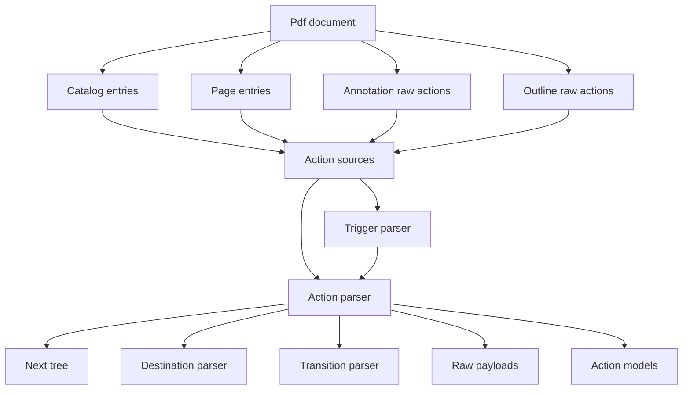
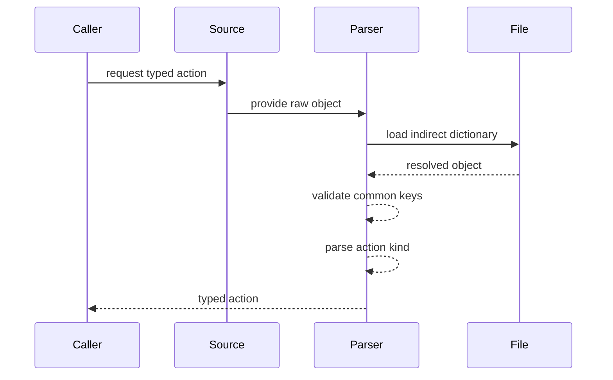
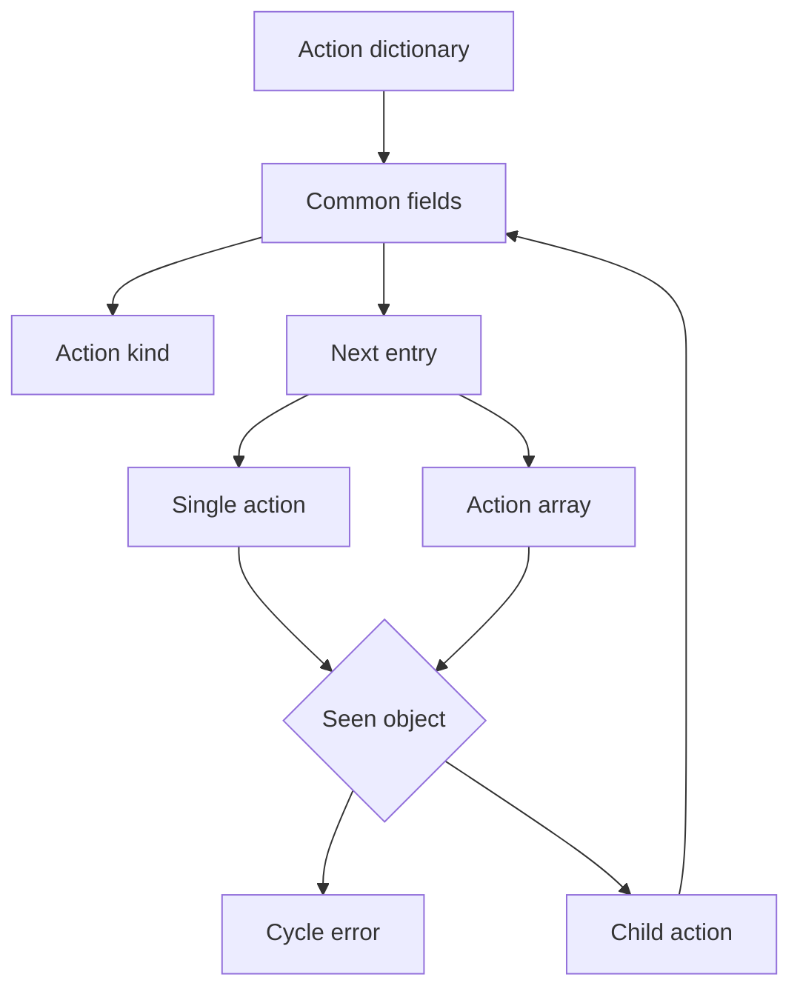
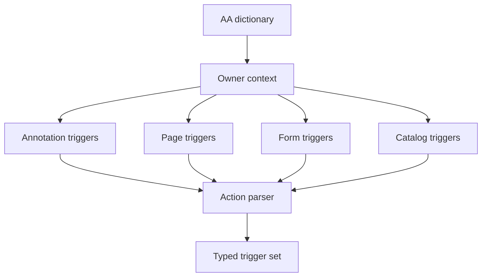
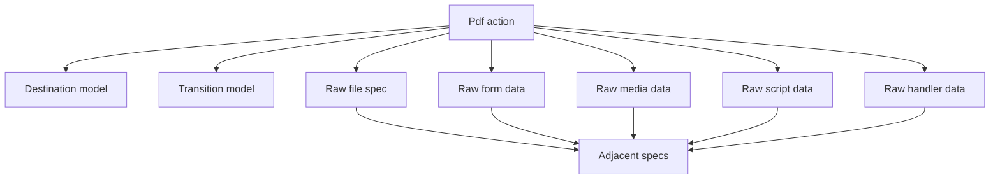
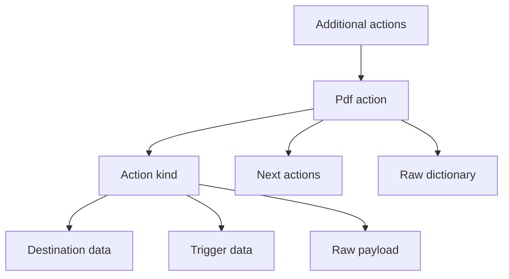

# Design Document

## Overview

This feature delivers typed PDF action metadata for the MoonBit `trkbt10/pdf` parser library. It extends the existing `src/reader` document facade so users can inspect Catalog open actions, additional-action dictionaries, outline and annotation action hand-offs, recursive `Next` action trees, trigger metadata, and the standard action dictionary types described by ISO 32000-2:2020 clause 12.6.

The feature changes action-related reader data from raw `PdfObject` hand-off values to optional typed structural parsing on demand. It does not execute actions, simulate viewer events, open files, resolve URIs, run ECMAScript, submit forms, mutate annotations, change optional-content state, play media, render transitions, or communicate with 3D or RichMedia handlers.

### Goals
- Parse common action dictionary fields, including optional `Type`, required `S`, and recursive `Next` trees with bounded cycle detection.
- Parse additional-action dictionaries for annotation, Page, form-field, and Catalog trigger-event owners as typed structural records.
- Parse every standard action type listed in 12.6.4 into a typed `PdfActionKind` variant while preserving adjacent-domain payloads raw.
- Reuse existing reader-layer destination, transition, annotation, optional-content, and lazy object-loading contracts without changing lower parser packages.
- Preserve compatibility with existing raw action fields and add typed accessors beside them.

### Non-Goals
- Action execution, event dispatch, UI focus handling, mouse tracking, drawing suspension, navigation side effects, or viewer preference behavior.
- ECMAScript runtime, URI resolution, network requests, file-system access, process launch, print operations, media playback, 3D view application, RichMedia command delivery, or form submission/reset/import.
- Mutation of action dictionaries, annotations, form fields, optional-content states, page views, document windows, or external documents.
- Deep parsing of file specifications, form-field dictionaries, sound streams, movie activation dictionaries, rendition objects, 3D artwork, RichMedia annotations, or RichMedia command arguments.
- PDF writing, repair of malformed action trees, security prompt UI, permission enforcement, or sandbox policy.

## Boundary Commitments

### This Spec Owns
- Public reader APIs for typed action parsing from Catalog, Page, outline, annotation, presentation, and raw `PdfObject` action sources.
- Public `PdfAction` models for common action dictionary entries, source identity, `S` action type, `Next` action trees, and raw dictionary retention.
- Public `PdfActionKind` variants for `GoTo`, `GoToR`, `GoToE`, `GoToDp`, `Launch`, `Thread`, `URI`, `Sound`, `Movie`, `Hide`, `Named`, `SubmitForm`, `ResetForm`, `ImportData`, `SetOCGState`, `Rendition`, `Trans`, `GoTo3DView`, `JavaScript`, `RichMediaExecute`, and unknown action names.
- Structural parsing of additional-action dictionaries for annotation, Page, form-field, and Catalog owner contexts.
- Structural trigger metadata, including activation precedence notes and open or close ordering metadata, without executing trigger flows.
- Cycle detection for recursive `Next` action trees and embedded Go-To target dictionary chains.
- Raw hand-off contracts for file specifications, form field references, annotation references, multimedia objects, JavaScript source, optional-content group dictionaries, 3D view operands, RichMedia commands, and unknown action payloads.

### Out of Boundary
- Low-level PDF syntax parsing, xref resolution, stream decoding, content-stream interpretation, and raw `PdfObject` representation.
- Destination parser ownership except action-specific use of existing destination parsing helpers.
- Annotation dictionary parsing, annotation flag interpretation, annotation hit testing, or annotation state mutation.
- Form field semantics, FDF import/export, submit-form transport, reset behavior, calculate or validate event effects, and signature workflows.
- File-specification parsing, embedded-file extraction, external document loading, process launch, URI fetching, print operations, or filesystem access.
- Optional-content state mutation, graphics redraw control, transition rendering, sound or movie playback, rendition handling, 3D artwork handling, RichMedia handler execution, and ECMAScript execution.

### Allowed Dependencies
- MoonBit standard library only.
- Existing local dependency direction remains unchanged: `objects`, `lexer`, `parser`, `filters`, `content`, and `graphics` remain upstream of `reader`; no upstream package imports `reader`.
- Existing `PdfDocument`, `PdfCatalog`, `PdfPage`, `PdfAnnotation`, `PdfOutlineItem`, `PdfFile::load_object`, `PdfObject`, `PdfDictionary`, `PdfName`, `ObjectId`, `PdfDestination`, `PdfTransition`, `PdfDocumentError`, and optional-content reader contracts.
- Existing exact-byte string preservation for PDF strings and names.
- Local extracted specification text under `spec/extracted/12.6-actions.spec.txt`, adjacent navigation and annotation specs, and future form specs for boundary revalidation.

### Revalidation Triggers
- Any public shape change to `PdfDocument`, `PdfCatalog`, `PdfPage`, `PdfAnnotation`, `PdfOutlineItem`, `PdfFile::load_object`, `PdfObject`, `PdfDictionary`, `PdfName`, `ObjectId`, `PdfDestination`, `PdfTransition`, or `PdfDocumentError`.
- Any change to package dependency direction, addition of a non-standard dependency, or movement of action parsing out of `src/reader`.
- Any future typed file-specification, forms, JavaScript, multimedia, optional-content, 3D, RichMedia, rendering, or execution API that replaces a raw action payload in this design.
- Any change to destination context parsing for local, remote, embedded, or structure destinations.
- Any implementation that begins executing actions, mutating document state, opening files, resolving URIs, running scripts, submitting forms, playing media, or rendering transitions.

## Architecture

### Existing Architecture Analysis

The repository already has a `src/reader` facade that resolves the Catalog, traverses Page trees, exposes typed navigation metadata, exposes typed annotations, and keeps action-related fields raw at adjacent-spec boundaries. `pdf-actions` is the natural follow-up owner for those raw action dictionaries because it needs the same private `PdfFile` loading path and existing destination and transition helpers.

The design stays in `src/reader` to preserve lazy object loading and package-private access. It adds typed action parsing beside existing raw fields rather than replacing them, which keeps `pdf-interactive-navigation` and `pdf-annotations` public contracts compatible.

### Architecture Pattern & Boundary Map



**Architecture Integration**:
- Selected pattern: focused reader-layer structural extension over existing raw action hand-offs.
- Domain boundaries: `reader` owns action dictionary structure and trigger metadata; lower packages own raw PDF objects and file loading; adjacent specs own forms, file specifications, media, JavaScript execution, rendering, 3D, RichMedia, and external effects.
- Existing patterns preserved: standard-library-only implementation, package-local files, explicit `pub(all)` models, `suberror` diagnostics, `///|` blocks, lazy indirect-reference loading, and white-box tests for parser helpers.
- New components rationale: source adapters, common action parsing, action-kind parsing, trigger parsing, and raw boundary preservation each have separate responsibilities and tests.
- Steering compliance: the feature remains byte-oriented, lazy, non-executing, and independently testable in `src/reader`.

### Technology Stack

| Layer | Choice / Version | Role in Feature | Notes |
|-------|------------------|-----------------|-------|
| Language | MoonBit project toolchain | Typed action models and parser APIs | Use explicit structs, `pub(all) enum`, `suberror`, and raised errors. |
| PDF object model | `trkbt10/pdf/src/objects` | Names, arrays, dictionaries, streams, strings, numbers, booleans, references, nulls | No object-model changes. |
| Document access | `trkbt10/pdf/src/reader` | Catalog, Page, annotations, outlines, object loading, destinations, transitions | Primary implementation package. |
| Adjacent descriptors | Existing `PdfDestination`, `PdfTransition`, annotation raw fields, optional-content raw values | Structural reuse and boundary hand-off | No execution or rendering. |
| Validation | `moon check`, `moon test`, `moon fmt`, `moon info` | Type checking, tests, formatting, public API review | `moon info` must show intended `src/reader` API additions only. |

## File Structure Plan

### Directory Structure

```text
src/
├── reader/
│   ├── action_types.mbt                 # Public PdfAction, PdfActionKind, trigger, target, and payload models
│   ├── action_common.mbt                # Shared action keys, diagnostics, primitive readers, indirect resolution, cycle guards
│   ├── actions.mbt                      # Public action parsing APIs and source adapters for Catalog, Page, annotation, outline, raw values
│   ├── action_triggers.mbt              # Additional-action dictionary parsing for annotation, page, form field, and catalog owner contexts
│   ├── action_destinations.mbt          # GoTo, GoToR, GoToE, GoToDp, target dictionary, and thread action parsing
│   ├── action_external.mbt              # Launch, URI, JavaScript, form action, and external-effect raw boundary records
│   ├── action_media.mbt                 # Sound, Movie, Rendition, GoTo3DView, RichMediaExecute raw structural parsing
│   ├── action_optional_content.mbt      # SetOCGState operation list parsing and raw OCG group preservation
│   ├── action_wbtest.mbt                # Common dictionary, Type, S, Next, unknown action, and cycle tests
│   ├── action_sources_wbtest.mbt        # Catalog, Page, annotation, outline, and raw action source tests
│   ├── action_triggers_wbtest.mbt       # AA dictionaries, owner-specific keys, and trigger ordering metadata tests
│   ├── action_destinations_wbtest.mbt   # GoTo, GoToR, GoToE, GoToDp, target dictionary, Thread tests
│   ├── action_external_wbtest.mbt       # Launch, URI, JavaScript, SubmitForm, ResetForm, ImportData boundary tests
│   ├── action_media_wbtest.mbt          # Sound, Movie, Rendition, GoTo3DView, RichMediaExecute, Trans tests
│   ├── action_optional_content_wbtest.mbt # SetOCGState sequence and PreserveRB tests
│   ├── document_error.mbt               # Add action-specific reader diagnostic
│   ├── catalog.mbt                      # Add small helpers for OpenAction and Catalog AA entries
│   ├── destination.mbt                  # Reuse existing helpers for action destination contexts
│   ├── outline.mbt                      # Keep raw action fields; typed parsing comes from action source adapters
│   ├── annotations.mbt                  # Keep raw action fields; typed parsing comes from action source adapters
│   └── pkg.generated.mbti               # Regenerate with moon info after public API additions
└── objects/
    └── no planned changes               # Revalidate if PdfObject, PdfName, PdfDictionary, or ObjectId changes
```

### Modified Files
- `src/reader/document_error.mbt` - Add `InvalidAction(@objects.ObjectId?, @objects.PdfName?, String)` or equivalent precise action diagnostic while preserving existing reader errors.
- `src/reader/catalog.mbt` - Add helpers for `OpenAction`, Catalog `AA`, and Catalog `URI` lookup without changing `PdfCatalog::entry`.
- `src/reader/destination.mbt` - Keep current destination API compatible; expose package-private helpers if action parsing needs explicit local, remote, embedded, or structure destination contexts.
- `src/reader/outline.mbt` - Preserve raw outline `action` fields; do not change outline traversal semantics.
- `src/reader/annotations.mbt` - Preserve raw annotation `action`, `previous_uri_action`, and `additional_actions` fields; do not change annotation parsing semantics.
- `src/reader/pkg.generated.mbti` - Regenerate and review intended public action API additions.
- `src/reader/moon.pkg` - No planned dependency change; update only if implementation proves an already local import is missing.

### Component to File Mapping

| Component | Primary Files |
|-----------|---------------|
| ActionModel | `src/reader/action_types.mbt`, `src/reader/pkg.generated.mbti` |
| ActionCommonParser | `src/reader/action_common.mbt`, `src/reader/document_error.mbt`, `src/reader/action_wbtest.mbt` |
| ActionSourceReader | `src/reader/actions.mbt`, `src/reader/catalog.mbt`, `src/reader/action_sources_wbtest.mbt` |
| AdditionalActionParser | `src/reader/action_triggers.mbt`, `src/reader/action_triggers_wbtest.mbt` |
| DestinationActionParser | `src/reader/action_destinations.mbt`, `src/reader/destination.mbt`, `src/reader/action_destinations_wbtest.mbt` |
| ExternalActionBoundary | `src/reader/action_external.mbt`, `src/reader/action_external_wbtest.mbt` |
| MediaActionBoundary | `src/reader/action_media.mbt`, `src/reader/action_media_wbtest.mbt` |
| OptionalContentActionParser | `src/reader/action_optional_content.mbt`, `src/reader/action_optional_content_wbtest.mbt` |
| RawBoundaryPolicy | `src/reader/action_types.mbt`, `src/reader/action_common.mbt`, `src/reader/actions.mbt` |

## System Flows

### Action Source Parsing



Missing optional action entries return `None` or an empty trigger set. Present malformed action dictionaries raise an action diagnostic.

### Recursive Next Tree



The parser tracks indirect `ObjectId` values across `Next` recursion. Direct dictionary recursion is bounded by parser stack context and rejected when it becomes self-referential through an indirect object.

### Additional Action Owner Parsing



Each owner context accepts only the event keys defined for that owner. Unknown keys are preserved in the raw dictionary for audit but are not promoted to standard trigger slots.

### Boundary Preservation



Only destination and transition structures reuse existing typed reader models. All external-effect or adjacent-domain payloads remain raw objects.

## Requirements Traceability

| Requirement | Summary | Components | Interfaces | Flows |
|-------------|---------|------------|------------|-------|
| 0.1 | Action entry points from annotations, outlines, Catalog open actions, and interactive contexts | ActionSourceReader, RawBoundaryPolicy | `PdfDocument::open_action`, raw source parsing APIs | Action Source Parsing |
| 0.2 | Common action dictionary fields and recursive `Next` trees | ActionCommonParser, ActionModel | `PdfAction`, `PdfActionNext`, `PdfActionKind` | Recursive Next Tree |
| 0.3 | Additional-action trigger dictionaries and event metadata | AdditionalActionParser, ActionSourceReader | `PdfAdditionalActions`, owner-specific trigger sets | Additional Action Owner Parsing |
| 0.4 | Standard action type recognition | ActionModel, ActionCommonParser | `PdfActionKind` standard variants | Action Source Parsing |
| 0.5 | Go-To actions | DestinationActionParser | `PdfGoToAction`, `PdfDestination` | Boundary Preservation |
| 0.6 | Remote Go-To actions | DestinationActionParser, ExternalActionBoundary | `PdfRemoteGoToAction` | Boundary Preservation |
| 0.7 | Embedded Go-To actions and target dictionaries | DestinationActionParser, ActionCommonParser | `PdfEmbeddedGoToAction`, `PdfTargetDictionary` | Recursive Next Tree |
| 0.8 | GoToDp actions | DestinationActionParser, RawBoundaryPolicy | `PdfGoToDPartAction` | Boundary Preservation |
| 0.9 | Launch actions and Windows launch parameters | ExternalActionBoundary | `PdfLaunchAction`, `PdfWindowsLaunchParams` | Boundary Preservation |
| 0.10 | Thread actions | DestinationActionParser, RawBoundaryPolicy | `PdfThreadAction` | Boundary Preservation |
| 0.11 | URI actions and URI dictionary base support | ExternalActionBoundary, ActionSourceReader | `PdfUriAction`, Catalog URI base accessor | Boundary Preservation |
| 0.12 | Sound actions | MediaActionBoundary | `PdfSoundAction` | Boundary Preservation |
| 0.13 | Movie actions | MediaActionBoundary | `PdfMovieAction` | Boundary Preservation |
| 0.14 | Hide actions | ActionModel, RawBoundaryPolicy | `PdfHideAction` | Boundary Preservation |
| 0.15 | Named actions | ActionModel | `PdfNamedAction` | Action Source Parsing |
| 0.16 | Set-OCG-state actions | OptionalContentActionParser | `PdfSetOCGStateAction`, `PdfOCGStateOperation` | Boundary Preservation |
| 0.17 | Rendition actions | MediaActionBoundary | `PdfRenditionAction` | Boundary Preservation |
| 0.18 | Transition actions | MediaActionBoundary | `PdfTransitionAction`, `PdfTransition` | Boundary Preservation |
| 0.19 | Go-To-3D-View actions | MediaActionBoundary | `PdfGoTo3DViewAction` | Boundary Preservation |
| 0.20 | ECMAScript actions | ExternalActionBoundary | `PdfJavaScriptAction` | Boundary Preservation |
| 0.21 | Rich-Media-Execute actions | MediaActionBoundary | `PdfRichMediaExecuteAction` | Boundary Preservation |

## Components and Interfaces

| Component | Domain | Intent | Req Coverage | Key Dependencies | Contracts |
|-----------|--------|--------|--------------|------------------|-----------|
| ActionModel | Reader models | Public typed representation for action dictionaries and variants | 0.2-0.21 | `PdfObject` P0 | State, Service |
| ActionCommonParser | Reader parsing | Validate common action dictionary fields and recursive `Next` | 0.2, 0.4 | `PdfFile::load_object` P0 | Service |
| ActionSourceReader | Reader facade | Parse actions from Catalog, Page, annotation, outline, presentation, and raw values | 0.1, 0.3 | `PdfDocument` P0, `PdfPage` P0 | Service |
| AdditionalActionParser | Trigger metadata | Parse owner-specific `AA` dictionaries | 0.3 | ActionCommonParser P0 | Service, State |
| DestinationActionParser | Navigation actions | Parse GoTo, GoToR, GoToE, GoToDp, and Thread action data | 0.5-0.8, 0.10 | `PdfDestination` P0 | Service |
| ExternalActionBoundary | External effects | Parse Launch, URI, JavaScript, and form actions without executing them | 0.9, 0.11, 0.20, 0.4 | Raw objects P0 | Service |
| MediaActionBoundary | Media and handler effects | Parse Sound, Movie, Rendition, Trans, 3D, and RichMedia action dictionaries structurally | 0.12, 0.13, 0.17-0.21 | `PdfTransition` P1 | Service |
| OptionalContentActionParser | Optional content | Parse SetOCGState operation arrays while preserving raw OCG dictionaries | 0.16 | Optional-content raw objects P1 | Service |
| RawBoundaryPolicy | Cross-domain hand-off | Preserve exact payloads for adjacent specs and existing raw fields | 0.1-0.21 | `PdfObject` P0 | State |

### Reader Models

#### ActionModel

| Field | Detail |
|-------|--------|
| Intent | Represent one action dictionary with common fields, parsed kind, recursive next actions, and raw dictionary. |
| Requirements | 0.2, 0.4-0.21 |

**Responsibilities & Constraints**
- Owns public action model shape and externally pattern-matchable action-kind variants.
- Stores the resolved source object id when available and always retains the raw dictionary.
- Represents unknown action names without rejecting otherwise well-formed dictionaries.

**Dependencies**
- Inbound: ActionCommonParser - creates validated models (P0).
- Outbound: `@objects.PdfObject`, `@objects.PdfDictionary`, `@objects.PdfName`, `@objects.ObjectId` - raw PDF data (P0).
- Outbound: `PdfDestination`, `PdfTransition` - reused typed adjacent structures (P1).

**Contracts**: Service [x] / API [ ] / Event [ ] / Batch [ ] / State [x]

##### Service Interface
```moonbit
pub(all) struct PdfAction {
  object_id : @objects.ObjectId?
  action_type : @objects.PdfName
  kind : PdfActionKind
  next : Array[PdfAction]
  raw_dict : @objects.PdfDictionary
}

pub(all) enum PdfActionKind {
  GoTo(PdfGoToAction)
  GoToR(PdfRemoteGoToAction)
  GoToE(PdfEmbeddedGoToAction)
  GoToDp(PdfGoToDPartAction)
  Launch(PdfLaunchAction)
  Thread(PdfThreadAction)
  URI(PdfUriAction)
  Sound(PdfSoundAction)
  Movie(PdfMovieAction)
  Hide(PdfHideAction)
  Named(PdfNamedAction)
  SubmitForm(PdfFormActionRaw)
  ResetForm(PdfFormActionRaw)
  ImportData(PdfFormActionRaw)
  SetOCGState(PdfSetOCGStateAction)
  Rendition(PdfRenditionAction)
  Trans(PdfTransitionAction)
  GoTo3DView(PdfGoTo3DViewAction)
  JavaScript(PdfJavaScriptAction)
  RichMediaExecute(PdfRichMediaExecuteAction)
  Unknown(@objects.PdfName, @objects.PdfDictionary)
}
```
- Preconditions: source object resolves to a dictionary; `S` exists and is a name; `Type`, when present, is `/Action`.
- Postconditions: `kind` corresponds to `S`; `next` preserves array order and recursively parsed actions; raw dictionary is retained.
- Invariants: no action execution side effect occurs during construction.

### Parser Layer

#### ActionCommonParser

| Field | Detail |
|-------|--------|
| Intent | Resolve action dictionaries, validate common keys, parse `Next`, and dispatch action-specific parsing. |
| Requirements | 0.2, 0.4 |

**Responsibilities & Constraints**
- Resolves indirect action dictionaries through `PdfFile::load_object`.
- Rejects malformed required common fields and invalid `Next` shapes.
- Tracks indirect object ids across recursive `Next` parsing.
- Delegates action-specific fields by `S` name.

**Dependencies**
- Inbound: ActionSourceReader, AdditionalActionParser, action-kind parsers - parse raw objects (P0).
- Outbound: `PdfFile::load_object` - lazy object loading (P0).
- Outbound: `PdfDocumentError::InvalidAction` and `CycleDetected` - diagnostics (P0).

**Contracts**: Service [x] / API [ ] / Event [ ] / Batch [ ] / State [ ]

##### Service Interface
```moonbit
fn parse_action_object(
  document : PdfDocument,
  value : @objects.PdfObject,
  owner : PdfActionOwner,
) -> PdfAction raise PdfDocumentError
```
- Preconditions: caller supplies the owning context for diagnostics and destination interpretation.
- Postconditions: returns one typed `PdfAction` or raises an action diagnostic.
- Invariants: absent optional `Next` returns an empty array; `Next` arrays preserve document order.

#### ActionSourceReader

| Field | Detail |
|-------|--------|
| Intent | Provide public entry points that parse existing raw action sources on demand. |
| Requirements | 0.1, 0.3 |

**Responsibilities & Constraints**
- Adds typed Catalog open-action and Catalog additional-action accessors.
- Adds Page additional-action parsing.
- Adds helper functions to parse raw action fields from `PdfAnnotation`, `PdfOutlineItem`, and raw `PdfObject` values.
- Keeps existing raw fields unchanged.

**Dependencies**
- Inbound: Library callers - request typed action metadata (P0).
- Outbound: ActionCommonParser - parse raw object values (P0).
- Outbound: Existing `PdfDocument`, `PdfPage`, `PdfAnnotation`, `PdfOutlineItem` models - raw source state (P0).

**Contracts**: Service [x] / API [ ] / Event [ ] / Batch [ ] / State [ ]

##### Service Interface
```moonbit
pub fn PdfDocument::open_action(
  self : PdfDocument
) -> PdfCatalogOpenAction? raise PdfDocumentError

pub fn PdfDocument::catalog_additional_actions(
  self : PdfDocument
) -> PdfCatalogAdditionalActions? raise PdfDocumentError

pub fn PdfPage::additional_actions(
  self : PdfPage
) -> PdfPageAdditionalActions? raise PdfDocumentError

pub fn PdfDocument::parse_action(
  self : PdfDocument,
  value : @objects.PdfObject
) -> PdfAction raise PdfDocumentError
```
- Preconditions: raw source values come from the same document when indirect references are involved.
- Postconditions: missing optional source entries return `None`.
- Invariants: accessors do not change the existing raw source API behavior.

#### AdditionalActionParser

| Field | Detail |
|-------|--------|
| Intent | Parse owner-specific `AA` dictionaries into typed trigger slots. |
| Requirements | 0.3 |

**Responsibilities & Constraints**
- Supports annotation keys `E`, `X`, `D`, `U`, `Fo`, `Bl`, `PO`, `PC`, `PV`, `PI`.
- Supports Page keys `O`, `C`.
- Supports form-field keys `K`, `F`, `V`, `C`.
- Supports Catalog keys `WC`, `WS`, `DS`, `WP`, `DP`.
- Records ordering metadata for activation and page lifecycle flows: annotation `A` takes precedence over annotation `AA` `U`, Catalog `OpenAction` precedes Page `AA` `O`, annotation `AA` `PO` follows both, annotation `AA` `PC` precedes Page `AA` `C`.
- Preserves raw dictionaries and unknown keys without executing events.

**Dependencies**
- Inbound: ActionSourceReader - parse Catalog and Page AA values (P0).
- Outbound: ActionCommonParser - parse action values for recognized keys (P0).
- External: Future forms spec - consume form-field trigger parsing (P1).

**Contracts**: Service [x] / API [ ] / Event [ ] / Batch [ ] / State [x]

##### Service Interface
```moonbit
pub(all) struct PdfAnnotationAdditionalActions {
  enter : PdfAction?
  exit : PdfAction?
  down : PdfAction?
  up : PdfAction?
  focus : PdfAction?
  blur : PdfAction?
  page_open : PdfAction?
  page_close : PdfAction?
  page_visible : PdfAction?
  page_invisible : PdfAction?
  raw_dict : @objects.PdfDictionary
}

pub(all) enum PdfActionTrigger {
  CatalogOpenAction
  PageOpen
  PageClose
  AnnotationActivation
  AnnotationMouseUp
  AnnotationPageOpen
  AnnotationPageClose
}

pub(all) struct PdfActionTriggerOrdering {
  activation_precedence : Array[PdfActionTrigger]
  page_open_order : Array[PdfActionTrigger]
  page_close_order : Array[PdfActionTrigger]
}
```
- Preconditions: recognized trigger values are action dictionaries or indirect references to action dictionaries.
- Postconditions: trigger slots preserve owner-specific standard keys.
- Invariants: parser records structural precedence metadata but does not dispatch events.

### Action Kind Parsers

#### DestinationActionParser

| Field | Detail |
|-------|--------|
| Intent | Parse navigation-related action variants and target dictionaries. |
| Requirements | 0.5, 0.6, 0.7, 0.8, 0.10 |

**Responsibilities & Constraints**
- `GoTo` parses required `D` and optional PDF 2.0 `SD` using existing destination structures where possible.
- `GoToR` preserves required file specification raw and parses remote destination shape.
- `GoToE` parses optional file specification, required destination, `NewWindow`, and recursive target dictionaries.
- `GoToDp` preserves the required DPart indirect dictionary reference as raw object with validation that it is an indirect reference.
- `Thread` preserves file specification raw and parses thread and bead selectors as raw or typed selector variants.

**Dependencies**
- Inbound: ActionCommonParser - dispatch by `S` name (P0).
- Outbound: Existing `PdfDestination` helpers - destination syntax (P0).
- Outbound: Raw `PdfObject` file specifications and DPart dictionaries - adjacent boundary (P1).

**Contracts**: Service [x] / API [ ] / Event [ ] / Batch [ ] / State [ ]

##### Service Interface
```moonbit
pub(all) struct PdfEmbeddedGoToAction {
  file_specification : @objects.PdfObject?
  destination : PdfDestination
  new_window : Bool?
  target : PdfTargetDictionary?
  raw_dict : @objects.PdfDictionary
}
```
- Preconditions: action-specific required keys are present with permitted object shapes.
- Postconditions: raw external file or DPart objects are retained.
- Invariants: target dictionary recursion is cycle checked and never loads external documents.

#### ExternalActionBoundary

| Field | Detail |
|-------|--------|
| Intent | Parse actions with external or security-sensitive effects as structural data only. |
| Requirements | 0.9, 0.11, 0.20, 0.4 |

**Responsibilities & Constraints**
- Parses Launch action `F`, `Win`, `Mac`, `Unix`, `NewWindow`, and Windows launch parameter fields without launching anything.
- Parses URI action required `URI`, optional `IsMap`, and Catalog URI base dictionary as byte-preserved strings.
- Parses JavaScript action required `JS` as text string or text stream raw value without interpretation.
- Represents SubmitForm, ResetForm, and ImportData as raw form-action variants because detailed semantics belong to 12.7.

**Dependencies**
- Inbound: ActionCommonParser - dispatch by `S` name (P0).
- Outbound: Raw `PdfObject` payloads - file specs, streams, and form dictionaries (P0).
- External: Future forms and JavaScript specs - deeper interpretation (P1).

**Contracts**: Service [x] / API [ ] / Event [ ] / Batch [ ] / State [ ]

##### Service Interface
```moonbit
pub(all) struct PdfUriAction {
  uri : Bytes
  is_map : Bool
  raw_dict : @objects.PdfDictionary
}

pub(all) struct PdfJavaScriptAction {
  script : @objects.PdfObject
  raw_dict : @objects.PdfDictionary
}
```
- Preconditions: required values have the object shape required by 12.6.
- Postconditions: external-effect operands are preserved exactly.
- Invariants: no network, filesystem, process, print, or script side effect occurs.

#### MediaActionBoundary

| Field | Detail |
|-------|--------|
| Intent | Parse media, transition, 3D, and RichMedia action dictionaries structurally. |
| Requirements | 0.12, 0.13, 0.17, 0.18, 0.19, 0.21 |

**Responsibilities & Constraints**
- Parses Sound action stream reference and optional volume, synchronous, repeat, and mix flags.
- Parses Movie action annotation or title exclusivity and operation names.
- Parses Rendition action `R`, `AN`, `OP`, `JS` presence rules while preserving payloads raw.
- Parses Trans action required transition dictionary using existing `PdfTransition` parsing where available.
- Parses GoTo3DView target annotation raw value and view selector variants.
- Parses RichMediaExecute `TA`, optional `TI`, and required `CMD` raw dictionaries.

**Dependencies**
- Inbound: ActionCommonParser - dispatch by `S` name (P0).
- Outbound: Existing transition parser - transition dictionary structure (P1).
- Outbound: Raw annotation, media, 3D, and RichMedia objects - adjacent boundary (P0).

**Contracts**: Service [x] / API [ ] / Event [ ] / Batch [ ] / State [ ]

##### Service Interface
```moonbit
pub(all) struct PdfRenditionAction {
  rendition : @objects.PdfObject?
  annotation : @objects.PdfObject?
  operation : Int?
  script : @objects.PdfObject?
  raw_dict : @objects.PdfDictionary
}
```
- Preconditions: action-specific required combinations are satisfied.
- Postconditions: media and handler payloads remain raw.
- Invariants: no playback, rendering, or handler invocation occurs.

#### OptionalContentActionParser

| Field | Detail |
|-------|--------|
| Intent | Parse SetOCGState action operation arrays without changing optional-content state. |
| Requirements | 0.16 |

**Responsibilities & Constraints**
- Parses the `State` array as ordered operation groups beginning with `ON`, `OFF`, or `Toggle`.
- Preserves each following optional-content group dictionary or reference as raw `PdfObject`.
- Parses `PreserveRB` default `true`.
- Allows repeated groups and repeated operation names as structural data.

**Dependencies**
- Inbound: ActionCommonParser - dispatch by `S /SetOCGState` (P0).
- Outbound: Raw optional-content group objects - graphics and optional-content boundary (P1).

**Contracts**: Service [x] / API [ ] / Event [ ] / Batch [ ] / State [ ]

##### Service Interface
```moonbit
pub(all) enum PdfOCGStateOperator {
  ON
  OFF
  Toggle
}

pub(all) struct PdfOCGStateOperation {
  operator : PdfOCGStateOperator
  groups : Array[@objects.PdfObject]
}
```
- Preconditions: `State` is an array and starts with a valid operator name before group entries.
- Postconditions: operation order is preserved exactly.
- Invariants: parser never applies optional-content state changes.

## Data Models

### Domain Model
- `PdfAction` is the aggregate root for a single action dictionary.
- `PdfActionKind` is the discriminated variant for the `S` name.
- `PdfAction` owns the recursive `next` array; each child action is a complete `PdfAction`.
- `PdfAdditionalActions` records owner-specific trigger slots and raw dictionaries.
- `PdfActionTriggerOrdering` records precedence and lifecycle ordering rules as metadata only.
- `PdfTargetDictionary` is a recursive value object for embedded Go-To target paths.
- Raw payload fields retain exact `PdfObject` values for adjacent domains.

### Logical Data Model



**Consistency & Integrity**:
- `S` is the natural discriminator for `PdfActionKind`.
- The `Next` relationship preserves document order and recursively parsed children.
- `object_id` is optional because direct dictionaries may not have one.
- Raw dictionaries are retained for audit and future reparsing.

## Error Handling

### Error Strategy
- Malformed action structures raise `PdfDocumentError::InvalidAction` with source object id when available, action name when known, and a concise reason.
- Recursive indirect-object cycles raise `PdfDocumentError::CycleDetected` with context such as `action Next cycle detected` or `target dictionary cycle detected`.
- Low-level object loading errors continue to wrap as `PdfDocumentError::ReaderError`.
- Adjacent-domain malformed payloads are not deep-validated unless 12.6 defines their object shape.

### Error Categories and Responses
- Missing required common fields: present action dictionary without `S` or non-name `S` fails before action-specific parsing.
- Invalid `Type`: present `Type` value that is not `/Action` fails.
- Invalid `Next`: non-dictionary, non-array, or array member that is not an action dictionary fails.
- Invalid action-specific required keys: missing `D`, `F`, `URI`, `Sound`, `Trans`, `JS`, `TA`, `CMD`, or incompatible required combinations fail with action diagnostics.
- Unknown action `S`: succeeds as `PdfActionKind::Unknown` when the common dictionary is valid.

### Monitoring
There is no runtime monitoring. Validation is through reader-layer errors, white-box tests, and public interface review.

## Testing Strategy

### Unit Tests
- Parse common action dictionaries with absent `Type`, valid `Type /Action`, missing `S`, non-name `S`, unknown `S`, direct `Next`, array `Next`, and indirect `Next` cycle failures.
- Parse owner-specific additional-action dictionaries for annotation, Page, form-field, and Catalog keys, including unknown key preservation.
- Parse GoTo, GoToR, GoToE target dictionaries, GoToDp, and Thread actions with valid required operands and malformed required operands.
- Parse SetOCGState arrays with repeated groups, repeated operation names, malformed leading operands, and `PreserveRB` default behavior.
- Parse Launch, URI, JavaScript, Sound, Movie, Rendition, Trans, GoTo3DView, and RichMediaExecute action dictionaries without invoking any side effect.

### Integration Tests
- Parse Catalog `OpenAction` as either action or existing destination form without breaking raw Catalog entry access.
- Parse Page `AA` actions from a minimal document and verify missing `AA` returns `None`.
- Parse action dictionaries preserved in `PdfOutlineItem.action` and `PdfAnnotation` raw action fields through typed source adapters.
- Verify typed action accessors preserve raw dictionary values object-for-object.
- Verify malformed action dictionaries propagate `PdfDocumentError` while existing navigation and annotation parsing behavior remains compatible.

### Boundary Tests
- Representative Launch, URI, JavaScript, SubmitForm, Sound, Movie, Rendition, GoTo3DView, and RichMediaExecute payloads are parsed and retained without filesystem, network, script, form, media, renderer, or handler calls.
- Annotation activation precedence and page-open or page-close ordering are exposed as metadata only, with no event dispatch.
- `Next` actions that would close documents or otherwise affect sequencing remain structural and do not stop parsing unless the dictionary shape is malformed.

### Public API Review
- Run `moon info` and inspect `src/reader/pkg.generated.mbti` for intended `PdfAction`, action-kind, trigger-set, and accessor additions only.
- Confirm no lower package public interface changes and no new package dependency direction.

## Security Considerations

Action dictionaries are security-sensitive because they may request external files, URIs, scripts, form submissions, media playback, process launches, or handler commands. This feature intentionally parses only structure and never performs external effects. Raw payloads are preserved so downstream applications can make their own policy decisions.

Validation must fail fast for malformed dictionaries but must not attempt repair that could change security meaning. Unknown actions remain structural `Unknown` values rather than executable callbacks.

## Performance & Scalability

Action parsing is lazy and source-driven. It parses only actions requested by callers and uses existing `PdfFile::load_object` behavior for indirect references. `Next` traversal is linear in the number of reachable action dictionaries and tracks visited indirect object ids to avoid unbounded cycles.

The implementation should avoid copying large stream payloads. JavaScript streams, sound streams, rendition objects, and RichMedia command dictionaries remain raw references or raw objects rather than decoded or interpreted data.
