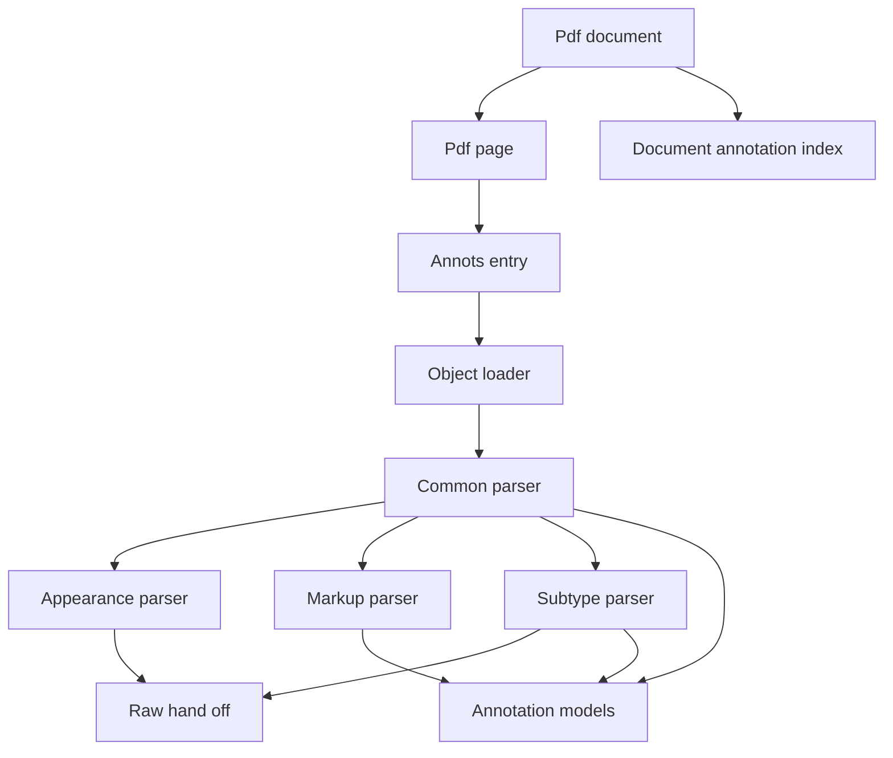
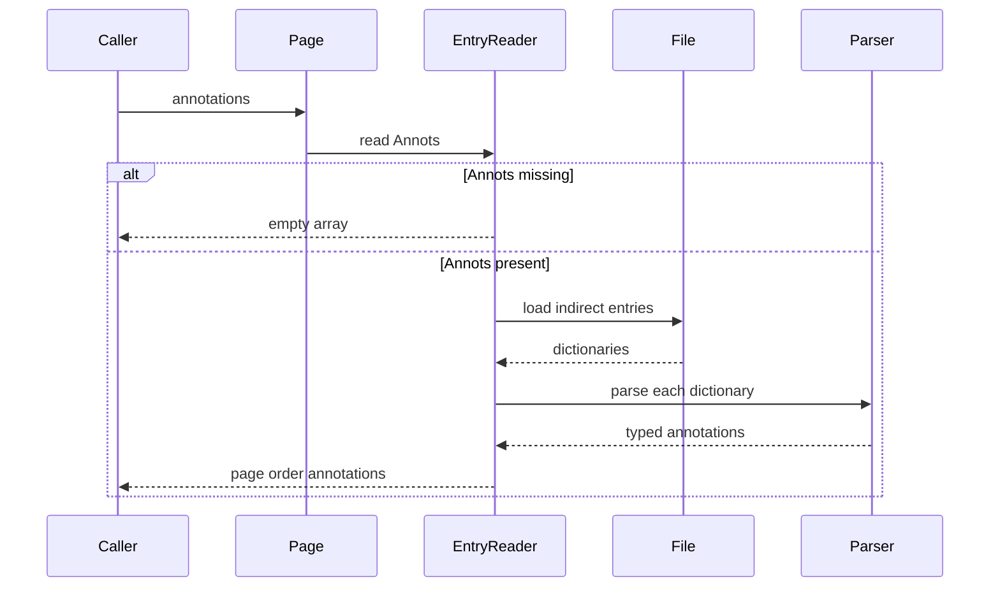
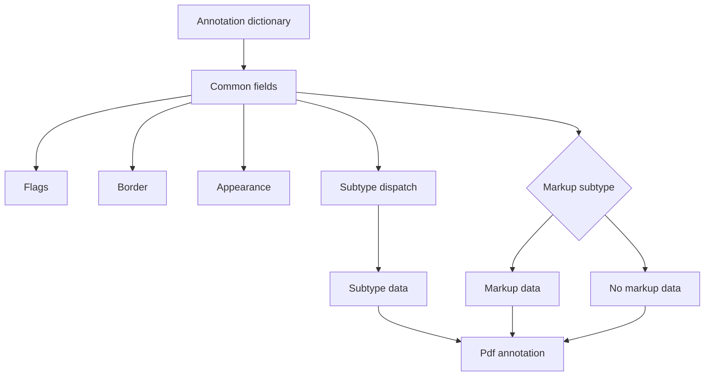
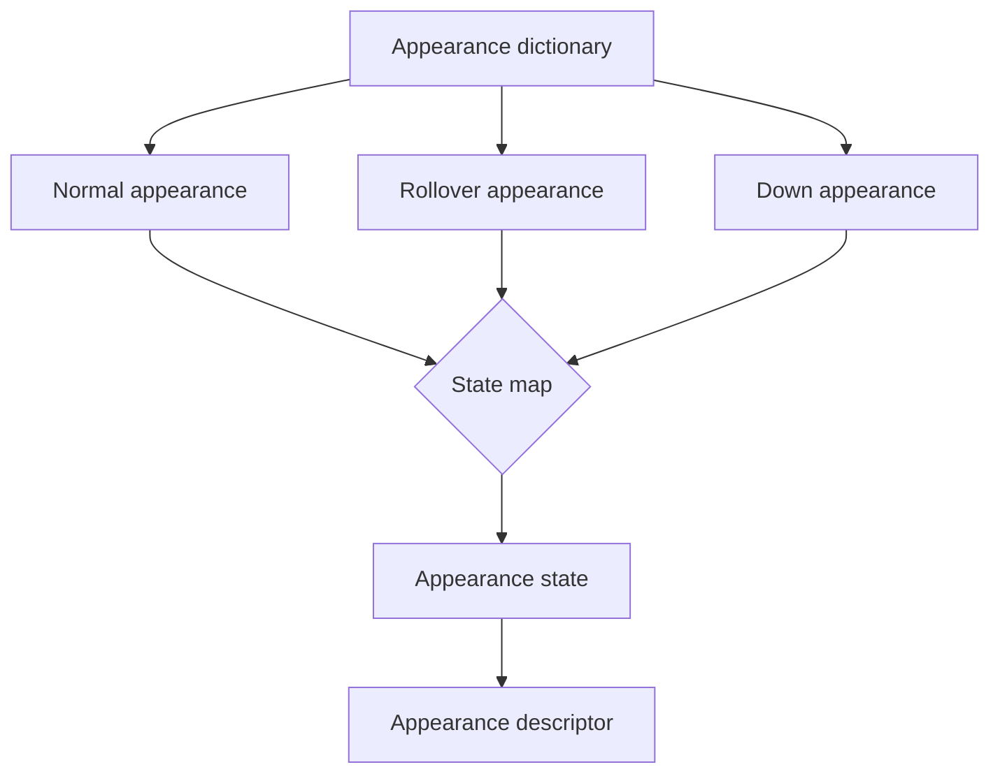
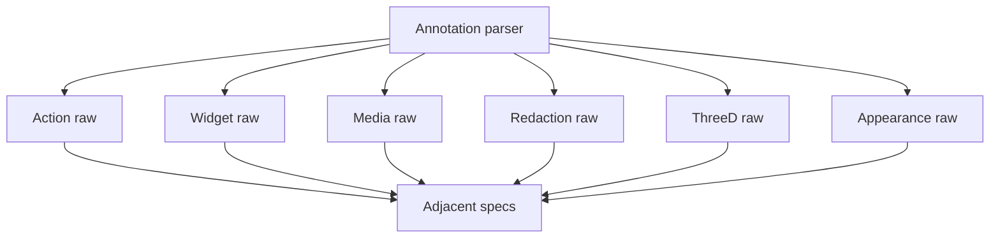
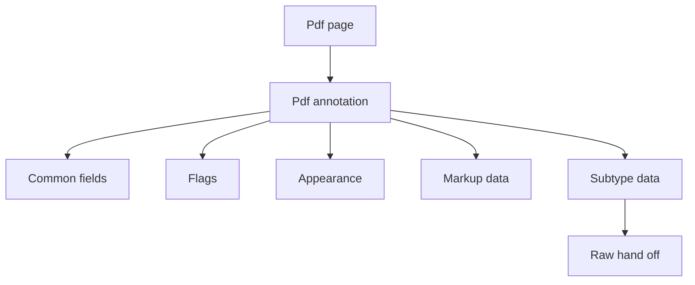

# Design Document

## Overview

This feature delivers typed annotation metadata for the MoonBit `trkbt10/pdf` parser library. It extends the existing `src/reader` document facade so users can enumerate Page `Annots` entries, inspect common annotation dictionary fields, parse annotation flags, borders, appearance dictionaries, markup metadata, annotation state records, and the subtype-specific structures described by ISO 32000-2:2020 clause 12.5.

The feature changes annotation access from a raw Page entry to a bounded structural API. It does not render annotation appearances, execute actions, play media, mutate form fields, apply redactions, process 3D or RichMedia content, or implement interactive PDF processor UI behavior.

### Goals
- Expose `PdfPage::annotations()` as the typed page entry point and `PdfDocument::annotations()` as the document-wide entry point that can validate cross-page annotation-reference uniqueness.
- Expose the Page `Tabs` annotation navigation order value as structure, while leaving tab traversal and UI focus behavior to consumers.
- Parse required common fields such as `Subtype` and `Rect`, optional common fields such as `Contents`, `NM`, `F`, `AP`, `AS`, `Border`, `C`, `OC`, `AF`, `ca`, `CA`, `BM`, and `Lang`.
- Parse annotation-owned subtype fields for the standard annotation types listed by 12.5, including markup annotations, states, geometry arrays, border/effect dictionaries, appearance characteristics, and fixed-print/redaction descriptors.
- Preserve raw hand-off values for actions, destinations not owned by this parser, file specifications, sound/movie/rendition data, widget field data, 3D, RichMedia, and rendering-specific appearance streams.
- Validate malformed annotation structures with reader-layer errors while preserving the existing low-level parser, object, file-structure, content, and graphics boundaries.

### Non-Goals
- Rendering annotation appearances, applying appearance matrices, transparency compositing, optional-content drawing, painting page annotations, or producing pixels.
- Executing actions, additional actions, JavaScript, URI handling, launch behavior, rendition actions, movie playback, sound playback, 3D activation, or RichMedia commands.
- Implementing interactive UI behavior such as popups, hover, down, keyboard tab navigation, focus handling, comments panes, annotation editing, grouping operations, or viewer-specific icon drawing.
- Parsing full interactive form field semantics or merging widget dictionaries with field dictionaries beyond preserving widget annotation-owned entries.
- Applying redactions or removing document content.
- PDF writing, annotation mutation, appearance regeneration, FDF import/export, or permissions enforcement.

## Boundary Commitments

### This Spec Owns
- Public reader APIs for typed annotation enumeration on `PdfPage`.
- Public reader APIs for document-wide annotation enumeration when cross-page validation is required.
- Public reader APIs for the Page `Tabs` annotation navigation order value.
- Public `PdfAnnotation` models for common annotation dictionary entries, annotation flags, border styles, border effects, appearance dictionary descriptors, markup metadata, annotation states, and subtype-specific 12.5 fields.
- Validation of Page `Annots` as an array of annotation dictionaries or indirect references to annotation dictionaries.
- Validation that a document-level annotation reference is not reused from multiple pages when callers enumerate annotations through the document-wide API.
- Validation of required common annotation keys: `Subtype` as a name and `Rect` as a rectangle.
- Annotation-owned defaulting rules such as flag default `0`, border default `[0 0 1]`, border style defaults, text icon defaults, open-state defaults, highlight mode defaults, opacity defaults, and PDF 2.0 subtype defaults stated in 12.5.
- Extensible subtype handling that preserves common fields and raw dictionaries for unknown or adjacent-clause subtypes.
- Raw hand-off contracts for action dictionaries, additional-actions dictionaries, file specifications, media dictionaries, widget parent fields, redaction overlay streams, 3D data, RichMedia data, optional content objects, and appearance form XObjects.

### Out of Boundary
- Low-level object parsing, xref resolution, object stream loading, stream filter decoding, content-stream parsing, and graphics instruction interpretation.
- Catalog-level action semantics, Page-level additional actions, field dictionaries, AcroForm behavior, signatures, JavaScript, and action execution.
- Appearance stream rendering, annotation hit testing, tab order computation, zoom/rotate coordinate adjustment, page painting order, icon drawing, popup windows, and user interaction state machines.
- Deep parsing of file specifications, embedded files, sounds, movies, renditions, 3D artwork, RichMedia assets, geospatial markup, projection runtime environments, and measurement dictionaries.
- Redaction application and any destructive removal of page content, image samples, annotations, or metadata.
- PDF writing, annotation editing, FDF compatibility conversion, and repair heuristics for malformed annotations.

### Allowed Dependencies
- MoonBit standard library only.
- Existing local dependency direction remains unchanged: `objects`, `lexer`, `parser`, `filters`, `content`, and `graphics` remain upstream of `reader`; no upstream package imports `reader`.
- Existing `PdfPage`, `PdfDocument`, `PdfFile::load_object`, `PdfObject`, `PdfDictionary`, `PdfName`, `PdfStream`, `ObjectId`, `PdfRectangle`, `PdfDestination`, `PdfDocumentError`, and navigation helper contracts.
- Existing reader Page entry access and lazy indirect object loading.
- Existing graphics optional-content and form-XObject models only as raw or descriptor boundaries; annotation parsing does not invoke a renderer.
- Local extracted specification text under `spec/extracted/12.5-annotations.spec.txt`, plus adjacent local specs for destinations, actions, forms, file specifications, optional content, and graphics when documenting raw hand-off boundaries.

### Revalidation Triggers
- Any public shape change to `PdfPage`, `PdfDocument`, `PdfFile::load_object`, `PdfObject`, `PdfDictionary`, `PdfName`, `PdfStream`, `ObjectId`, `PdfRectangle`, `PdfDestination`, or `PdfDocumentError`.
- Any change to the package dependency direction or addition of a non-standard dependency.
- Any decision to move annotation parsing out of `src/reader` into a new package.
- Any future typed `pdf-actions`, `pdf-forms-signatures`, file-specification, multimedia, 3D, RichMedia, projection, measurement, optional-content, or renderer API that replaces a raw hand-off field in this design.
- Any change to Page `Annots` semantics, page-index identity, annotation dictionary ownership, indirect object resolution policy, or cycle-detection policy.
- Any implementation that starts executing actions, changing document state, rendering appearances, applying redactions, opening files, playing media, or enforcing UI interactions.

## Architecture

### Existing Architecture Analysis

The repository already has a `src/reader` document facade that opens PDF bytes, resolves the Catalog, traverses the Page tree, and exposes `PdfPage::annots()` as the raw Page `Annots` entry. Reader-level interactive navigation features parse Catalog and Page dictionaries into typed models while preserving raw hand-off values for adjacent domains.

Annotations are Page-owned document structures that need lazy indirect object loading, page object identity, dictionary validation, and document-level error wrapping. Therefore, this feature extends `src/reader` instead of adding a lower-level package or modifying `objects`, `lexer`, `parser`, `filters`, `content`, or `graphics`.

### Architecture Pattern & Boundary Map



**Architecture Integration**:
- Selected pattern: reader-layer structural extension over the existing lazy document facade.
- Domain boundaries: `reader` owns annotation dictionary structure; lower packages own raw PDF object representation and file loading; adjacent specs own actions, forms, media, rendering, redaction execution, 3D, and RichMedia behavior.
- Existing patterns preserved: standard-library-only implementation, package-local files, `pub(all)` externally inspectable types, `suberror` diagnostics, `///|` block boundaries, lazy indirect-reference loading, and white-box tests for package-private parsers.
- New components rationale: common annotation parsing, appearance descriptors, markup/state parsing, geometry helpers, subtype-family parsers, and raw hand-off policy have separate contracts and tests.
- Steering compliance: the design remains byte-oriented, lazy, non-rendering, and independently testable in `src/reader`.

### Technology Stack

| Layer | Choice / Version | Role in Feature | Notes |
|-------|------------------|-----------------|-------|
| Language | MoonBit project toolchain | Typed annotation models and parser APIs | Use explicit structs, `pub(all) enum`, `suberror`, and raised errors. |
| PDF object model | `trkbt10/pdf/src/objects` | Names, arrays, dictionaries, streams, references, strings, numbers, and nulls | No object-model changes. |
| Document access | `trkbt10/pdf/src/reader` | Page `Annots`, lazy object loading, page identity, document errors | Primary implementation package. |
| Graphics descriptors | `trkbt10/pdf/src/graphics` | Raw form XObject and optional-content boundaries | No rendering or graphics import changes beyond existing reader import. |
| Data structures | MoonBit standard library `Array`, `Map`, `Bytes` | Annotation arrays, visited sets, raw byte strings, typed collections | No external storage. |
| Validation | `moon check`, `moon test`, `moon fmt`, `moon info` | Type checking, tests, formatting, public API review | `moon info` must show intended `src/reader` API additions only. |

## File Structure Plan

### Directory Structure

```text
src/
├── reader/
│   ├── document_types.mbt                # Add public annotation structs and enums
│   ├── document_error.mbt                # Add annotation-specific document error variant
│   ├── document_structure.mbt            # Keep existing raw PdfPage::annots entry
│   ├── annotations.mbt                   # Public PdfPage::annotations, PdfDocument::annotations, Annots traversal
│   ├── annotation_tab_order.mbt          # Page Tabs value parsing without UI traversal execution
│   ├── annotation_common.mbt             # Common dictionary fields, flags, colors, dates, raw hand-off helpers
│   ├── annotation_appearance.mbt         # AP dictionary, AS, appearance entry and state descriptors
│   ├── annotation_border.mbt             # Border array, BS dictionary, BE dictionary parsing
│   ├── annotation_markup.mbt             # Markup fields, reply/group data, ExData, state records
│   ├── annotation_geometry.mbt           # Points, quads, callouts, paths, difference rectangles, colour arrays
│   ├── annotation_subtypes.mbt           # Subtype dispatch and subtype-family parsers
│   ├── annotation_widget.mbt             # Widget annotation-owned fields and MK appearance characteristics
│   ├── annotations_wbtest.mbt            # Annots traversal, cross-page uniqueness, required common fields, unknown subtype tests
│   ├── annotation_tab_order_wbtest.mbt   # Tabs R, C, S, A, W, unknown, and absent default tests
│   ├── annotation_common_wbtest.mbt      # Flags, color, opacity, page ref, associated files, language tests
│   ├── annotation_appearance_wbtest.mbt  # AP, AS, state selection, stream or subdictionary shape tests
│   ├── annotation_border_wbtest.mbt      # Border, BS, BE defaults and malformed shape tests
│   ├── annotation_markup_wbtest.mbt      # Markup metadata, state models, reply and group validation tests
│   ├── annotation_geometry_wbtest.mbt    # Rect, QuadPoints, vertices, ink/path, callout, RD tests
│   ├── annotation_subtypes_wbtest.mbt    # Text, link, free text, line, shape, text markup, popup, media tests
│   ├── annotation_widget_wbtest.mbt      # Widget H, MK, icon fit raw hand-off, parent validation tests
│   └── annotation_redaction_wbtest.mbt   # Redact, watermark, trap network, projection edge tests
└── objects/
    └── no planned changes                # Revalidate if PdfObject, PdfName, PdfDictionary, or ObjectId changes
```

### Modified Files
- `src/reader/document_types.mbt` - Add externally inspectable annotation models. Keep parser traversal state private.
- `src/reader/document_error.mbt` - Add `InvalidAnnotation(@objects.ObjectId?, String)` or an equivalent precise annotation error variant while preserving existing variants.
- `src/reader/document_structure.mbt` - Keep `PdfPage::annots()` as the raw accessor for compatibility; add no semantic parsing here.
- `src/reader/pkg.generated.mbti` - Regenerate with `moon info` after public API additions.
- `src/reader/moon.pkg` - No planned dependency change; update only if implementation proves an already local import is missing.

### Component to File Mapping

| Component | Primary Files |
|-----------|---------------|
| AnnotationEntryReader | `src/reader/annotations.mbt`, `src/reader/annotations_wbtest.mbt` |
| AnnotationDocumentIndex | `src/reader/annotations.mbt`, `src/reader/annotations_wbtest.mbt` |
| AnnotationTabOrderReader | `src/reader/annotation_tab_order.mbt`, `src/reader/annotation_tab_order_wbtest.mbt` |
| AnnotationCommonParser | `src/reader/annotation_common.mbt`, `src/reader/document_types.mbt`, `src/reader/annotation_common_wbtest.mbt` |
| AnnotationFlagModel | `src/reader/annotation_common.mbt`, `src/reader/annotation_common_wbtest.mbt` |
| AnnotationBorderParser | `src/reader/annotation_border.mbt`, `src/reader/annotation_border_wbtest.mbt` |
| AnnotationAppearanceParser | `src/reader/annotation_appearance.mbt`, `src/reader/annotation_appearance_wbtest.mbt` |
| AnnotationMarkupParser | `src/reader/annotation_markup.mbt`, `src/reader/annotation_markup_wbtest.mbt` |
| AnnotationGeometryParser | `src/reader/annotation_geometry.mbt`, `src/reader/annotation_geometry_wbtest.mbt` |
| AnnotationSubtypeParser | `src/reader/annotation_subtypes.mbt`, `src/reader/annotation_subtypes_wbtest.mbt` |
| WidgetAnnotationParser | `src/reader/annotation_widget.mbt`, `src/reader/annotation_widget_wbtest.mbt` |
| RawHandOffPolicy | `src/reader/document_types.mbt`, `src/reader/annotation_common.mbt`, `src/reader/annotation_subtypes.mbt` |

## System Flows

### Page Annotation Enumeration



Missing `Annots` returns an empty array. A present non-array `Annots` entry or non-dictionary annotation entry raises `PdfDocumentError`.

### Annotation Dictionary Parse



Common field validation happens before subtype parsing. Unknown subtype names still produce a `PdfAnnotation` with parsed common fields and raw subtype data.

### Appearance Descriptor Selection



The descriptor validates stream-or-state-map shapes and records the selected `AS` name. It does not render form XObjects or compute appearance matrices.

### Raw Hand-Off Flow



Raw hand-off fields retain exact `PdfObject` values and field names so future specs can replace or augment them without reparsing the page.

## Requirements Traceability

| Requirement | Summary | Components | Interfaces | Flows |
|-------------|---------|------------|------------|-------|
| 0.1 | General annotation role, page association, tab-order context, extensible handlers | AnnotationEntryReader, AnnotationDocumentIndex, AnnotationTabOrderReader, AnnotationCommonParser, RawHandOffPolicy | `PdfPage::annotations`, `PdfDocument::annotations`, `PdfPage::annotation_tab_order`, `PdfAnnotationSubtype::Unknown` | Page Annotation Enumeration |
| 0.2 | Common annotation dictionary entries and one-page reference ownership | AnnotationCommonParser, AnnotationDocumentIndex, AnnotationAppearanceParser, AnnotationBorderParser, AnnotationFlagModel | `PdfAnnotationCommon`, `PdfAnnotationAppearance`, `PdfAnnotationBorder` | Annotation Dictionary Parse |
| 0.3 | Annotation flags | AnnotationFlagModel | `PdfAnnotationFlags`, screen and print eligibility helpers | Annotation Dictionary Parse |
| 0.4 | Border styles and border effects | AnnotationBorderParser | `PdfBorderStyle`, `PdfBorderEffect` | Annotation Dictionary Parse |
| 0.5 | Appearance streams and appearance dictionaries | AnnotationAppearanceParser, RawHandOffPolicy | `PdfAnnotationAppearance`, `PdfAppearanceEntry` | Appearance Descriptor Selection |
| 0.6 | Standard annotation subtype list and extensibility | AnnotationSubtypeParser | `PdfAnnotationSubtype`, `PdfAnnotationSpecific` | Annotation Dictionary Parse |
| 0.7 | Markup annotation common entries and ExData | AnnotationMarkupParser, RawHandOffPolicy | `PdfMarkupAnnotation`, `PdfMarkupExternalData` | Annotation Dictionary Parse |
| 0.8 | Annotation states and state models | AnnotationMarkupParser | `PdfAnnotationState`, `PdfAnnotationStateModel` | Annotation Dictionary Parse |
| 0.9 | Text annotation fields | AnnotationSubtypeParser, AnnotationFlagModel | `PdfTextAnnotation` | Annotation Dictionary Parse |
| 0.10 | Link annotation fields | AnnotationSubtypeParser, RawHandOffPolicy | `PdfLinkAnnotation` | Raw Hand-Off Flow |
| 0.11 | Free text annotation fields | AnnotationSubtypeParser, AnnotationGeometryParser, AnnotationBorderParser | `PdfFreeTextAnnotation` | Annotation Dictionary Parse |
| 0.12 | Line annotation fields and line ending styles | AnnotationSubtypeParser, AnnotationGeometryParser, AnnotationBorderParser | `PdfLineAnnotation`, `PdfLineEndingStyle` | Annotation Dictionary Parse |
| 0.13 | Square and circle annotation fields | AnnotationSubtypeParser, AnnotationGeometryParser, AnnotationBorderParser | `PdfShapeAnnotation` | Annotation Dictionary Parse |
| 0.14 | Polygon and polyline annotation fields | AnnotationSubtypeParser, AnnotationGeometryParser, AnnotationBorderParser | `PdfPolygonAnnotation`, `PdfAnnotationPath` | Annotation Dictionary Parse |
| 0.15 | Text markup annotation fields | AnnotationSubtypeParser, AnnotationGeometryParser | `PdfTextMarkupAnnotation`, `PdfQuadPoints` | Annotation Dictionary Parse |
| 0.16 | Caret annotation fields | AnnotationSubtypeParser, AnnotationGeometryParser | `PdfCaretAnnotation` | Annotation Dictionary Parse |
| 0.17 | Rubber stamp annotation fields | AnnotationSubtypeParser | `PdfStampAnnotation` | Annotation Dictionary Parse |
| 0.18 | Ink annotation fields | AnnotationSubtypeParser, AnnotationGeometryParser, AnnotationBorderParser | `PdfInkAnnotation`, `PdfAnnotationPath` | Annotation Dictionary Parse |
| 0.19 | Popup annotation fields | AnnotationSubtypeParser, AnnotationMarkupParser | `PdfPopupAnnotation` | Annotation Dictionary Parse |
| 0.20 | File attachment annotation fields | AnnotationSubtypeParser, RawHandOffPolicy | `PdfFileAttachmentAnnotation` | Raw Hand-Off Flow |
| 0.21 | Sound annotation fields | AnnotationSubtypeParser, RawHandOffPolicy | `PdfSoundAnnotation` | Raw Hand-Off Flow |
| 0.22 | Movie annotation fields | AnnotationSubtypeParser, RawHandOffPolicy | `PdfMovieAnnotation` | Raw Hand-Off Flow |
| 0.23 | Screen annotation fields | AnnotationSubtypeParser, RawHandOffPolicy, AnnotationAppearanceParser | `PdfScreenAnnotation` | Raw Hand-Off Flow |
| 0.24 | Widget annotation and appearance characteristics | WidgetAnnotationParser, AnnotationBorderParser, RawHandOffPolicy | `PdfWidgetAnnotation`, `PdfWidgetAppearanceCharacteristics` | Raw Hand-Off Flow |
| 0.25 | Printer mark annotation | AnnotationSubtypeParser, RawHandOffPolicy | `PdfPrinterMarkAnnotation` | Annotation Dictionary Parse |
| 0.26 | Trap network annotation constraints | AnnotationSubtypeParser, AnnotationEntryReader | `PdfTrapNetworkAnnotation` | Page Annotation Enumeration |
| 0.27 | Watermark and fixed print dictionaries | AnnotationSubtypeParser, AnnotationGeometryParser, RawHandOffPolicy | `PdfWatermarkAnnotation`, `PdfFixedPrint` | Annotation Dictionary Parse |
| 0.28 | Redaction annotation fields | AnnotationSubtypeParser, AnnotationGeometryParser, RawHandOffPolicy | `PdfRedactionAnnotation` | Raw Hand-Off Flow |
| 0.29 | Projection annotation fields and ExData context | AnnotationSubtypeParser, AnnotationMarkupParser, RawHandOffPolicy | `PdfProjectionAnnotation` | Annotation Dictionary Parse |

## Components and Interfaces

| Component | Domain | Intent | Requirement Coverage | Key Dependencies | Contracts |
|-----------|--------|--------|----------------------|------------------|-----------|
| AnnotationEntryReader | Reader | Enumerate page annotation dictionaries in page order | 0.1, 0.2, 0.26 | `PdfPage`, `PdfFile::load_object` P0 | Service |
| AnnotationDocumentIndex | Reader | Enumerate all page annotations and detect cross-page reused annotation refs | 0.1, 0.2 | `PdfDocument::pages`, AnnotationEntryReader P0 | Service |
| AnnotationTabOrderReader | Reader | Parse Page `Tabs` annotation order names as structure | 0.1 | `PdfPage::entry`, viewer direction raw context P1 | Service |
| AnnotationCommonParser | Reader | Parse common annotation dictionary fields | 0.2, 0.6 | `PdfObject`, `PdfRectangle` P0 | Service, State |
| AnnotationFlagModel | Reader | Interpret `F` bits and default behavior | 0.3, 0.9 | `PdfAnnotationCommon` P0 | Service |
| AnnotationBorderParser | Reader | Parse `Border`, `BS`, and `BE` structures | 0.2, 0.4, 0.11, 0.12, 0.13, 0.14, 0.18 | `PdfObject` P0 | Service |
| AnnotationAppearanceParser | Reader | Parse `AP` and `AS` descriptors | 0.2, 0.5, 0.23, 0.24 | `PdfStream`, `PdfDictionary` P0 | Service |
| AnnotationMarkupParser | Reader | Parse markup metadata, replies, groups, states, and ExData | 0.7, 0.8, 0.29 | `PdfObject`, page identity P1 | Service |
| AnnotationGeometryParser | Reader | Parse quads, paths, vertices, callouts, line arrays, and difference rectangles | 0.10, 0.11, 0.12, 0.13, 0.14, 0.15, 0.16, 0.18, 0.27, 0.28 | `PdfRectangle` P0 | Service |
| AnnotationSubtypeParser | Reader | Dispatch and parse standard subtype-owned fields | 0.6 through 0.29 | Common parser P0 | Service |
| WidgetAnnotationParser | Reader | Parse widget-owned annotation fields and MK characteristics | 0.24 | Forms raw objects P1 | Service |
| RawHandOffPolicy | Reader | Preserve adjacent-domain objects without execution | 0.5, 0.10, 0.20 through 0.24, 0.28, 0.29 | Adjacent specs P1 | State |

### Reader Layer

#### AnnotationEntryReader

| Field | Detail |
|-------|--------|
| Intent | Reads `Annots` from a `PdfPage`, resolves each annotation entry, and returns typed annotations in array order. |
| Requirements | 0.1, 0.2, 0.26 |

**Responsibilities & Constraints**
- Treat missing `Annots` as an empty annotation list.
- Require present `Annots` to be an array.
- Resolve each direct or indirect annotation dictionary through `PdfFile::load_object`.
- Preserve array order because page annotation order is meaningful for tab order, printing constraints, and trap network validation.
- Record the source indirect object id when an annotation entry is a reference.

**Dependencies**
- Inbound: `PdfPage::annotations` caller — requests typed page annotations (P0).
- Outbound: `PdfFile::load_object` — resolves indirect annotation dictionaries (P0).
- Outbound: `AnnotationCommonParser` and `AnnotationSubtypeParser` — parse dictionary content (P0).

**Contracts**: Service [x] / API [ ] / Event [ ] / Batch [ ] / State [ ]

##### Service Interface
```moonbit
pub fn PdfPage::annotations(self : PdfPage) -> Array[PdfAnnotation] raise PdfDocumentError
```
- Preconditions: `self` is a validated `PdfPage`.
- Postconditions: Returned annotations preserve `Annots` array order and carry `page_index`.
- Invariants: This method does not mutate document state, execute actions, render appearances, or repair malformed entries.

#### AnnotationDocumentIndex

| Field | Detail |
|-------|--------|
| Intent | Enumerates annotations across all pages and validates that indirect annotation dictionaries are not shared across pages. |
| Requirements | 0.1, 0.2 |

**Responsibilities & Constraints**
- Traverse pages through existing `PdfDocument::pages()` in document order.
- Reuse `AnnotationEntryReader` for per-page parsing.
- Track indirect annotation object ids and raise a document error if the same id appears on more than one page.
- Preserve per-page annotation order within the flattened result.

**Dependencies**
- Inbound: document-level callers — request complete annotation metadata or conformance validation (P0).
- Outbound: `PdfDocument::pages` — obtains validated pages (P0).
- Outbound: `AnnotationEntryReader` — parses each page's annotations (P0).

**Contracts**: Service [x] / API [ ] / Event [ ] / Batch [ ] / State [ ]

##### Service Interface
```moonbit
pub fn PdfDocument::annotations(self : PdfDocument) -> Array[PdfAnnotation] raise PdfDocumentError
```
- Preconditions: `self` is a validated `PdfDocument`.
- Postconditions: Returned annotations are grouped by document page order, then page `Annots` order.
- Invariants: Duplicate direct dictionaries cannot be identity-validated; duplicate indirect object ids across pages are rejected.

#### AnnotationTabOrderReader

| Field | Detail |
|-------|--------|
| Intent | Parses the optional Page `Tabs` entry values that define annotation navigation order. |
| Requirements | 0.1 |

**Responsibilities & Constraints**
- Parse `R`, `C`, `S`, `A`, and `W` into a typed enum.
- Preserve unknown names as `Unknown`.
- Do not sort annotations, consult viewer preferences, traverse logical structure, or implement keyboard focus.

**Dependencies**
- Inbound: `PdfPage::annotation_tab_order` caller — requests structural `Tabs` metadata (P1).
- Outbound: `PdfPage::entry` — reads the direct Page entry (P0).

**Contracts**: Service [x] / API [ ] / Event [ ] / Batch [ ] / State [ ]

##### Service Interface
```moonbit
pub fn PdfPage::annotation_tab_order(self : PdfPage) -> PdfAnnotationTabOrder? raise PdfDocumentError
```
- Preconditions: `self` is a validated `PdfPage`.
- Postconditions: Missing `Tabs` returns `None`; present names return typed values or `Unknown`.
- Invariants: This API reports structure only and never computes interactive traversal order.

#### AnnotationCommonParser

| Field | Detail |
|-------|--------|
| Intent | Converts common annotation dictionary entries into stable public value objects. |
| Requirements | 0.2, 0.6 |

**Responsibilities & Constraints**
- Require `Subtype` name and `Rect` rectangle.
- Accept optional `Type` only when absent or `/Annot`.
- Parse raw text strings as `Bytes` without Unicode normalization.
- Preserve optional page reference `P`, annotation name `NM`, modification date `M`, associated files `AF`, optional content `OC`, blend mode `BM`, and language `Lang`.
- Keep unknown or adjacent-domain common fields in `raw_dict`.

**Dependencies**
- Inbound: `AnnotationEntryReader` — supplies loaded dictionaries (P0).
- Outbound: `AnnotationFlagModel`, `AnnotationBorderParser`, `AnnotationAppearanceParser` — parse nested common fields (P0).
- External: `@objects.PdfObject` and `@objects.PdfDictionary` — raw object source (P0).

**Contracts**: Service [x] / API [ ] / Event [ ] / Batch [ ] / State [x]

##### Service Interface
```moonbit
fn parse_annotation_common(
  file : PdfFile,
  page : PdfPage,
  object_id : @objects.ObjectId?,
  dict : @objects.PdfDictionary
) -> PdfAnnotationCommon raise PdfDocumentError
```
- Preconditions: `dict` is the loaded annotation dictionary.
- Postconditions: Required common fields are validated and optional fields are defaulted or preserved.
- Invariants: `PdfAnnotationCommon.raw_dict` remains the authoritative source for fields not modeled by this spec.

#### AnnotationSubtypeParser

| Field | Detail |
|-------|--------|
| Intent | Dispatches by `Subtype` and parses 12.5-owned subtype fields. |
| Requirements | 0.6 through 0.29 |

**Responsibilities & Constraints**
- Recognize all standard annotation names listed in 0.6, including `3D` and `RichMedia` as raw hand-off subtypes because their detailed semantics are outside 12.5.
- Preserve `Unknown` subtype names and raw dictionaries.
- Apply subtype-specific required fields only for fields owned by 12.5.
- Avoid deep parsing of adjacent-domain dictionaries such as actions, file specifications, sound objects, movie dictionaries, form fields, 3D data, RichMedia data, measure dictionaries, and redaction overlay streams.

**Dependencies**
- Inbound: `AnnotationEntryReader` — requests subtype data (P0).
- Outbound: `AnnotationGeometryParser`, `AnnotationBorderParser`, `AnnotationMarkupParser`, `WidgetAnnotationParser` — parse shared subtype structures (P0).
- Outbound: `RawHandOffPolicy` — stores adjacent-domain raw values (P1).

**Contracts**: Service [x] / API [ ] / Event [ ] / Batch [ ] / State [x]

##### Service Interface
```moonbit
fn parse_annotation_specific(
  file : PdfFile,
  page : PdfPage,
  common : PdfAnnotationCommon,
  dict : @objects.PdfDictionary
) -> PdfAnnotationSpecific raise PdfDocumentError
```
- Preconditions: `common.subtype` is parsed and `common.rect` is valid.
- Postconditions: Returned variant matches the declared subtype or preserves it as `Unknown`.
- Invariants: Subtype parsing cannot broaden the feature boundary into rendering, actions, forms, or media execution.

#### RawHandOffPolicy

| Field | Detail |
|-------|--------|
| Intent | Keeps adjacent-domain values exact and explicitly labeled. |
| Requirements | 0.5, 0.10, 0.20, 0.21, 0.22, 0.23, 0.24, 0.28, 0.29 |

**Responsibilities & Constraints**
- Preserve raw `A`, `AA`, `PA`, `Dest`, `FS`, `Sound`, `Movie`, `MK`, `Parent`, `Measure`, `RO`, `ExData`, `FixedPrint`, `3D`, `RichMedia`, and appearance stream objects where deep semantics belong elsewhere.
- Store raw values in subtype-specific fields, not only in `raw_dict`, when the field is named by 12.5.
- Avoid executing or dereferencing external file, media, JavaScript, launch, or URI behavior.

**Dependencies**
- Inbound: all annotation parsers — use raw preservation for out-of-boundary values (P0).
- Outbound: future action, forms, multimedia, 3D, RichMedia, renderer, and redaction specs — consume raw hand-off fields (P1).

**Contracts**: Service [ ] / API [ ] / Event [ ] / Batch [ ] / State [x]

##### State Management
- State model: raw values are immutable fields on `PdfAnnotationSpecific` variants.
- Persistence & consistency: the original `raw_dict` is retained for audit and future reparsing.
- Concurrency strategy: no mutable shared state is introduced.

## Data Models

### Domain Model
- Aggregate root: `PdfPage` owns the annotation list returned from its direct `Annots` entry.
- Entity: `PdfAnnotation` represents one annotation dictionary and optional source object id.
- Value objects: `PdfAnnotationCommon`, `PdfAnnotationFlags`, `PdfAnnotationAppearance`, `PdfBorderStyle`, `PdfBorderEffect`, `PdfMarkupAnnotation`, geometry structs, and subtype-specific structs.
- Raw hand-off values: adjacent-domain fields remain typed as `@objects.PdfObject`, `@objects.PdfDictionary`, or `@objects.PdfStream`.



### Logical Data Model

**Core structure**:
```moonbit
pub(all) struct PdfAnnotation {
  page_index : Int
  object_id : @objects.ObjectId?
  common : PdfAnnotationCommon
  markup : PdfMarkupAnnotation?
  specific : PdfAnnotationSpecific
  raw_dict : @objects.PdfDictionary
}

pub(all) struct PdfAnnotationCommon {
  subtype : PdfAnnotationSubtype
  rect : PdfRectangle
  contents : Bytes?
  page_ref : @objects.ObjectId?
  name : Bytes?
  modified : @objects.PdfObject?
  flags : PdfAnnotationFlags
  appearance : PdfAnnotationAppearance?
  appearance_state : @objects.PdfName?
  border : PdfAnnotationBorder
  color : Array[Double]
  struct_parent : Int?
  optional_content : @objects.PdfObject?
  associated_files : Array[@objects.PdfObject]
  nonstroking_opacity : Double
  stroking_opacity : Double
  blend_mode : @objects.PdfName?
  language : Bytes?
}
```

**Subtype strategy**:
- `PdfAnnotationSubtype` is a public enum for known names and `Unknown(@objects.PdfName)`.
- `PdfAnnotationSpecific` is a public enum with variants for text, link, free text, line, shape, polygon, text markup, caret, stamp, ink, popup, file attachment, sound, movie, screen, widget, printer mark, trap network, watermark, redaction, projection, 3D raw, RichMedia raw, and unknown raw data.
- Markup data is optional and attached only when the subtype is markup according to 0.6 and 0.7.

### Data Contracts & Integration
- Page contract: `PdfPage::annots()` remains the raw accessor; `PdfPage::annotations()` is the typed structural accessor.
- Document contract: `PdfDocument::annotations()` is the typed whole-document accessor and validates duplicate indirect annotation references across pages.
- Tab-order contract: `PdfPage::annotation_tab_order()` reports `Tabs` structure and does not compute a runtime focus order.
- Error contract: malformed present annotation structures raise `PdfDocumentError`; absent optional fields apply documented defaults.
- Raw hand-off contract: every raw adjacent-domain field records the original `PdfObject` without execution, transformation, or loss of field identity.

## Error Handling

### Error Strategy
- Missing optional annotation arrays or fields return empty collections, `None`, or documented default values.
- Present malformed required fields raise `PdfDocumentError::InvalidAnnotation` or the chosen annotation-specific equivalent.
- Indirect object loading failures are wrapped as `PdfDocumentError::ReaderError`.
- Cycles in annotation-owned references such as popup parent chains, reply chains, or appearance state references raise `PdfDocumentError::CycleDetected`.
- Unknown annotation subtype names are not errors when common fields are valid.

### Error Categories and Responses
- Invalid Page `Annots`: present non-array, non-dictionary entry, null entry where a dictionary is required.
- Invalid common dictionary: missing or wrong `Subtype`, missing or malformed `Rect`, wrong `Type`, malformed flags, malformed opacity, malformed color, malformed associated files.
- Invalid nested annotation-owned structures: malformed `Border`, `BS`, `BE`, `AP`, `AS`, markup data, state model, geometry arrays, line endings, fixed print dictionaries, redaction descriptors, and widget `MK`.
- Boundary-preserving raw values: semantically invalid action, file spec, media, form field, 3D, or RichMedia payloads are not interpreted here unless their container shape is owned by 12.5.

## Testing Strategy

- Unit Tests: verify `PdfAnnotationFlags` bit decoding, reserved-bit detection, default flag value, `Hidden`/`NoView`/`Print` predicates, and text annotation implicit NoZoom/NoRotate behavior from 0.3 and 0.9.
- Unit Tests: verify `Border`, `BS`, and `BE` defaults, dash arrays, unknown border styles defaulting behavior, and cloudy intensity bounds from 0.4.
- Unit Tests: verify `AP` descriptors for stream entries, state subdictionaries, missing optional `R` and `D` fallback to `N`, and `AS` state preservation from 0.5.
- Unit Tests: verify geometry parsing for `QuadPoints`, line `L`, callout `CL`, leader offsets, `RD`, vertices, ink lists, PDF 2.0 path arrays, fixed-print matrices, and redaction regions from 0.10 through 0.18 and 0.27 through 0.28.
- Unit Tests: verify subtype parsers for text, link, free text, line, square, circle, polygon, polyline, text markup, caret, stamp, ink, popup, file attachment, sound, movie, screen, widget, printer mark, trap network, watermark, redaction, projection, 3D raw, RichMedia raw, and unknown subtype preservation from 0.6 through 0.29.
- Integration Tests: construct small in-memory PDFs or object graphs where `PdfPage::annotations()` resolves direct and indirect annotation dictionaries from `Annots` while preserving page order and source object ids.
- Integration Tests: verify `PdfDocument::annotations()` rejects reused indirect annotation dictionaries across multiple pages while preserving page order for valid documents.
- Integration Tests: verify `PdfPage::annotation_tab_order()` parses `R`, `C`, `S`, `A`, `W`, absent values, and unknown names without computing traversal.
- Integration Tests: verify popup parent, markup reply/group, screen `P`, widget parent, and trap network last-entry constraints without executing UI behavior.
- Integration Tests: verify raw hand-off fields for `A`, `AA`, `Dest`, `FS`, `Sound`, `Movie`, `MK`, `RO`, `ExData`, and appearance streams retain exact `PdfObject` values.
- Regression Tests: run existing document-structure, navigation, graphics, xobject, and optional-content tests to confirm annotation parsing does not change existing public behavior.

## Security Considerations

- Annotation parsing must not execute JavaScript, launch actions, URI actions, rendition actions, movie or sound playback, RichMedia commands, file extraction, or redaction deletion.
- Raw strings and streams are preserved as bytes or `PdfObject` values; no filesystem, network, process, or media APIs are called.
- Indirect traversal uses visited sets to avoid malicious cycles in annotation-owned object graphs.

## Performance & Scalability

- Annotation enumeration remains lazy per page; opening a `PdfDocument` does not parse annotations for all pages.
- `PdfPage::annotations()` resolves only the current page `Annots` array and referenced annotation dictionaries.
- `PdfDocument::annotations()` intentionally walks all pages only when callers request whole-document annotation validation.
- The parser avoids copying large streams; appearance, sound, movie, redaction overlay, 3D, and RichMedia payloads remain raw references or stream descriptors.
- Geometry and array validation is linear in the number of annotation entries and field operands.

## Supporting References
- `.kiro/specs/pdf-annotations/requirements.md` for the local 12.5 requirement source.
- `.kiro/specs/pdf-document-structure/design.md` for the `PdfPage` and raw `Annots` boundary.
- `.kiro/specs/pdf-interactive-navigation/design.md` for existing reader-layer typed metadata patterns.
- `.kiro/specs/pdf-graphics/design.md` and `.kiro/specs/pdf-xobjects-images/design.md` for rendering and optional-content boundaries.
