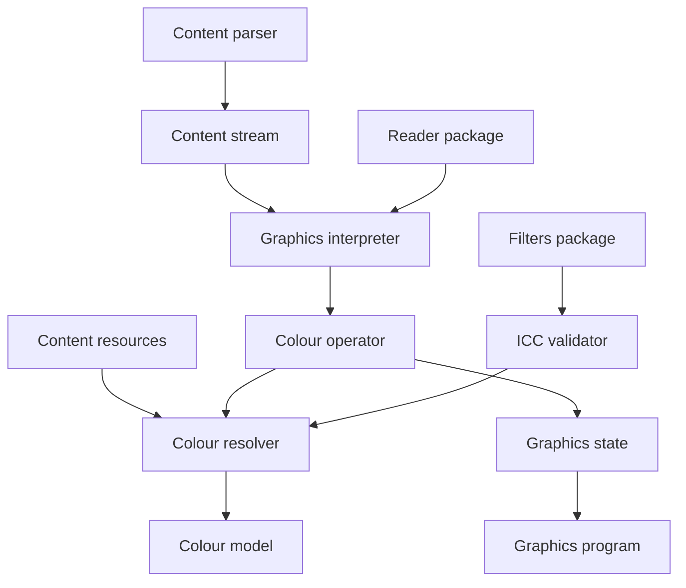
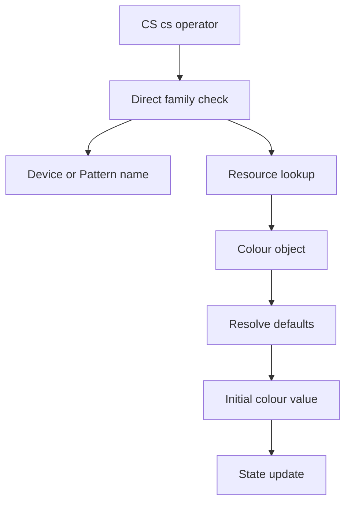
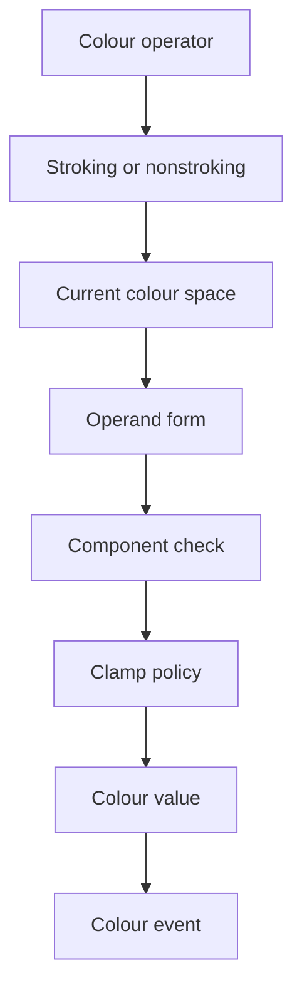
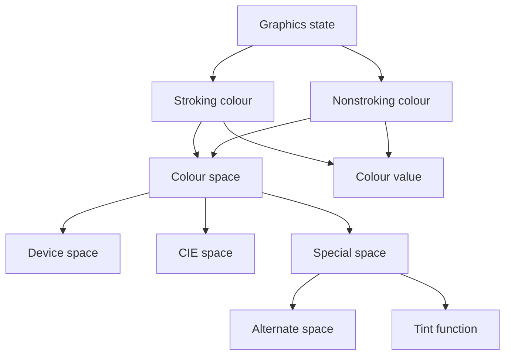

# Design Document

## Overview

This feature delivers typed PDF colour-space and colour-value semantics to the graphics interpretation layer. It changes colour operators from deferred observations into graphics-state mutations that preserve ISO 32000-2 clause 8.6 colour specification data for downstream consumers.

The primary users are MoonBit library users who inspect parsed page graphics programs and future renderer implementations that need a reliable, device-independent colour state. The feature extends existing `content` and `graphics` package integration without adding a rendering engine or device colour management.

### Goals
- Represent device, CIE-based, and special PDF colour spaces with explicit MoonBit types.
- Apply `CS`, `cs`, `SC`, `SCN`, `sc`, `scn`, `G`, `g`, `RG`, `rg`, `K`, and `k` to stroking and nonstroking graphics state.
- Validate colour-space structure, component counts, default remapping, initial values, rendering intent, black point compensation, and overprint state needed by clause 8.6.
- Keep colour conversion and raster output outside the graphics interpreter.

### Non-Goals
- Rendering colours to an output device.
- Computing CIE XYZ, RGB, CMYK, ICC, tint-transform, overprint, or transparency blending output values.
- Implementing patterns, shadings, images, fonts, glyph descriptions, or Type 3 font painting.
- Loading indirect objects from `PdfFile` inside the `graphics` package.
- Adding external colour management dependencies.

## Boundary Commitments

### This Spec Owns
- Typed colour-space definitions and validation for ISO 32000-2 clause 8.6 families.
- Typed current stroking and nonstroking colour state in `GraphicsState`.
- Colour operator application and emitted graphics events that expose the updated colour state.
- Structural ICCBased validation for direct profile streams and PDF stream dictionaries.
- Default device colour-space remapping through `ColorSpace` resources.
- Rendering intent, black point compensation, and overprint state normalization needed by colour semantics.
- Colour-operator ignore behavior when the interpreter is explicitly run in a colour-restricted context.

### Out of Boundary
- Device-dependent colour rendering, gamut mapping, gamma correction, halftoning, scan conversion, and raster compositing.
- Evaluation of PDF function objects used as tint transforms or dot gain functions.
- Pattern dictionary interpretation and pattern painting.
- Image sample decoding, image dictionaries beyond exposing reusable explicit colour-space parsing, and shading evaluation.
- Transparency group blending and output intents.
- Reader-owned indirect object loading policy.

### Allowed Dependencies
- `src/graphics` may depend on `objects`, `content`, `filters`, and `moonbitlang/core/math`.
- `src/content` remains responsible for operator tokenization, operand parsing, inline image dictionary expansion, and resource dictionary lookup primitives.
- `src/reader` may call public `graphics` APIs but `graphics` must not import `reader`.
- No external libraries are introduced.

### Revalidation Triggers
- Any public shape change to `ColourSpace`, `ColourValue`, `ColourState`, `RenderingIntent`, `BlackPointCompensation`, `GraphicsState`, or `GraphicsEvent`.
- Any change that makes `graphics` dereference indirect objects or import `reader`.
- Any change to component count, initial value, clamping, or default remapping rules.
- Any addition of rendering, tint transform evaluation, pattern painting, image decoding, or transparency blending.
- Any new dependency in `src/graphics/moon.pkg`.

## Architecture

### Existing Architecture Analysis

The current `content` package recognizes all colour operators and exposes raw `ContentOperation` values. The `graphics` package interprets graphics state and path operators but records colour operators as `ColorOperatorSeen` events. `GraphicsState` already has colour-related fields, rendering intent, overprint flags, and black point compensation, but colour spaces and colour values are raw PDF objects.

`ContentResources` already supports exact `ColorSpace` resource lookup without object loading. The reader package resolves page resources and content streams, then passes parsed content into `graphics.interpret_content`. This design keeps that direction and adds typed colour interpretation inside `graphics`.

### Architecture Pattern & Boundary Map



**Architecture Integration**:
- Selected pattern: typed domain extension inside the existing graphics interpreter.
- Domain boundaries: `content` parses syntax and resources; `graphics` validates colour semantics; `reader` loads document objects; renderers consume events later.
- Existing patterns preserved: package-local helpers, `suberror` failures, public `pub(all)` data models for externally inspectable state, and `*_wbtest.mbt` white-box tests.
- New components rationale: colour parsing, current colour state, ICC header validation, and operator application are distinct responsibilities.
- Steering compliance: no external dependencies, no renderer, package-local testability, and no reader dependency from graphics.

### Technology Stack

| Layer | Choice / Version | Role in Feature | Notes |
|-------|------------------|-----------------|-------|
| Language | MoonBit | Typed colour domain and interpreter changes | Follow existing `///|` block style |
| PDF object model | `src/objects` | Raw `PdfObject`, `PdfName`, `PdfStream`, dictionaries, refs | No object model changes planned |
| Content model | `src/content` | Operators, operands, resources, inline images | Existing resource lookup reused |
| Stream filters | `src/filters` | Decode direct ICC profile streams before header checks | New direct import from graphics |
| Graphics runtime | `src/graphics` | Owns colour semantics and state events | Primary implementation package |

## File Structure Plan

### Directory Structure

```text
src/
├── graphics/
│   ├── colour_space.mbt          # ColourSpace model, family parsing, component ranges, initial values
│   ├── colour_state.mbt          # ColourUse, ColourValue, ColourState, default remapping, state helpers
│   ├── colour_operator.mbt       # CS cs SC SCN sc scn G g RG rg K k application
│   ├── icc_profile.mbt           # Direct ICCBased stream dictionary and decoded profile header validation
│   ├── colour_restriction.mbt    # Colour operator ignore policy for uncoloured pattern and glyph contexts
│   ├── state.mbt                 # GraphicsState field type migration and copy initialization changes
│   ├── interpreter.mbt           # Route colour operators through typed colour handling and events
│   ├── ext_gstate.mbt            # RenderingIntent, overprint, and BlackPointCompensation validation
│   ├── object_context.mbt        # Continue normal graphics object context validation
│   ├── colour_space_wbtest.mbt   # Colour-space parser and validator tests
│   ├── colour_operator_wbtest.mbt # Operator application and state event tests
│   ├── icc_profile_wbtest.mbt    # ICCBased stream structural tests
│   ├── state_wbtest.mbt          # Initial colour state and copy tests
│   ├── ext_gstate_wbtest.mbt     # RI OPM UseBlackPtComp tests
│   └── interpreter_test.mbt      # Public graphics-program behaviour tests
├── reader/
│   └── graphics.mbt              # Adjust GraphicsInitialState construction if its public shape changes
└── content/
    └── resources.mbt             # No semantic ownership change; existing lookup remains the dependency
```

### New Files
- `src/graphics/colour_space.mbt` - New file for `ColourSpaceModel`: colour-space enum, family parameter records, component ranges, family parsing, and structural validation.
- `src/graphics/colour_state.mbt` - New file for `ColourStateController`: `ColourUse`, `ColourValue`, `ColourState`, initial values, default remapping helpers, and graphics-state colour mutations.
- `src/graphics/colour_operator.mbt` - New file for `ColourOperatorInterpreter`: colour operator dispatch, operand validation, and typed state change construction.
- `src/graphics/icc_profile.mbt` - New file for `ICCProfileHeaderValidator`: direct ICCBased stream dictionary validation and decoded ICC profile header checks.
- `src/graphics/colour_restriction.mbt` - New file for `ColourRestrictionPolicy`: restricted-context flags and ignored operator classification.

### Modified Files
- `src/graphics/moon.pkg` - Add direct `filters` import for ICCBased profile stream validation.
- `src/graphics/state.mbt` - Replace raw colour fields with `ColourState`, add colour restriction input, and initialize clause 8.6 defaults.
- `src/graphics/interpreter.mbt` - Apply colour operators instead of emitting only deferred colour observations.
- `src/graphics/ext_gstate.mbt` - Parse rendering intent, overprint mode, and black point compensation into typed values.
- `src/graphics/object_context.mbt` - Keep operator context validation separate from colour restriction policy.
- `src/reader/graphics.mbt` - Update `GraphicsInitialState` construction for new defaulted fields.
- `src/graphics/pkg.generated.mbti` - Regenerate through `moon info` after public API changes.

### Component to File Mapping

| Component | Primary Files |
|-----------|---------------|
| ColourSpaceModel | `src/graphics/colour_space.mbt` |
| ColourSpaceResolver | `src/graphics/colour_space.mbt`, `src/graphics/colour_state.mbt` |
| ColourStateController | `src/graphics/colour_state.mbt`, `src/graphics/state.mbt` |
| ColourOperatorInterpreter | `src/graphics/colour_operator.mbt`, `src/graphics/interpreter.mbt` |
| ICCProfileHeaderValidator | `src/graphics/icc_profile.mbt`, `src/graphics/moon.pkg` |
| ExtGStateColourPolicy | `src/graphics/ext_gstate.mbt`, `src/graphics/state.mbt` |
| ColourRestrictionPolicy | `src/graphics/colour_restriction.mbt`, `src/graphics/interpreter.mbt` |
| GraphicsIntegration | `src/graphics/interpreter.mbt`, `src/graphics/state.mbt`, `src/reader/graphics.mbt`, `src/graphics/pkg.generated.mbti` |

## System Flows

### Colour Space Selection



Parameterized colour spaces are never read inline from a content stream. A non-device `CS` or `cs` name is resolved through `ColorSpace` resources, then parsed with the same direct object parser used by image and nested colour-space contexts.

### Colour Value Application



Component counts are derived from the current colour space. `SC` and `sc` reject spaces they do not support; `SCN` and `scn` support ICCBased, Pattern, Separation, and DeviceN operands.

## Requirements Traceability

| Requirement | Summary | Components | Interfaces | Flows |
|-------------|---------|------------|------------|-------|
| 0.1 | Separate colour specification from rendering | ColourSpaceModel, GraphicsIntegration | `GraphicsProgram`, `ColourState` | Colour Value Application |
| 0.2 | Current colour values are interpreted by current colour space | ColourStateController, ColourOperatorInterpreter | `apply_colour_operator`, `ColourValue` | Colour Value Application |
| 0.3 | Colour-space families, resource lookup, and operators | ColourSpaceResolver, ColourOperatorInterpreter | `resolve_content_colour_space`, `parse_colour_space_object` | Colour Space Selection |
| 0.4 | Device colour-space general rules | ColourSpaceModel, ColourStateController | `DeviceColourSpace`, `initial_colour_value` | Colour Space Selection |
| 0.5 | DeviceGray component range and initialization | ColourSpaceModel, ColourOperatorInterpreter | `DeviceGray`, `G`, `g` | Colour Value Application |
| 0.6 | DeviceRGB component range and initialization | ColourSpaceModel, ColourOperatorInterpreter | `DeviceRGB`, `RG`, `rg` | Colour Value Application |
| 0.7 | DeviceCMYK component range and initialization | ColourSpaceModel, ColourOperatorInterpreter, ExtGStateColourPolicy | `DeviceCMYK`, `K`, `k` | Colour Value Application |
| 0.8 | CIE-based general rules and initialization | ColourSpaceModel | `CalGray`, `CalRGB`, `Lab`, `ICCBased` | Colour Space Selection |
| 0.9 | CalGray dictionary validation and ranges | ColourSpaceModel | `CalGrayParams` | Colour Space Selection |
| 0.10 | CalRGB dictionary validation and ranges | ColourSpaceModel | `CalRGBParams` | Colour Space Selection |
| 0.11 | Lab dictionary validation and ranges | ColourSpaceModel | `LabParams` | Colour Space Selection |
| 0.12 | ICCBased stream dictionary validation | ICCProfileHeaderValidator, ColourSpaceModel | `IccBasedParams` | Colour Space Selection |
| 0.13 | ICC version, profile type, and component constraints | ICCProfileHeaderValidator | `validate_icc_profile_stream` | Colour Space Selection |
| 0.14 | DefaultGray DefaultRGB DefaultCMYK remapping | ColourSpaceResolver, ColourStateController | `resolve_default_device_space` | Colour Space Selection |
| 0.15 | Implicit CIE conversion is renderer policy | GraphicsIntegration, ExtGStateColourPolicy | `ColourSpace`, `GraphicsState` | Colour Value Application |
| 0.16 | Rendering intents and fallback | ExtGStateColourPolicy, ColourOperatorInterpreter | `RenderingIntent` | Colour Value Application |
| 0.17 | Black point compensation policy | ExtGStateColourPolicy | `BlackPointCompensation`, `effective_black_point_compensation` | Colour Value Application |
| 0.18 | Special colour-space general handling | ColourSpaceModel | `Pattern`, `Indexed`, `Separation`, `DeviceN` | Colour Space Selection |
| 0.19 | Pattern colour spaces | ColourSpaceModel, ColourOperatorInterpreter | `PatternParams`, `PatternPaint` | Colour Value Application |
| 0.20 | Indexed colour spaces | ColourSpaceModel, ColourOperatorInterpreter | `IndexedParams`, `indexed_lookup_entry` | Colour Value Application |
| 0.21 | Separation colour spaces | ColourSpaceModel, ColourOperatorInterpreter | `SeparationParams` | Colour Value Application |
| 0.22 | Separation tint semantics and special names | ColourSpaceModel, ColourOperatorInterpreter | `SeparationParams`, `ColourantName` | Colour Value Application |
| 0.23 | DeviceN and NChannel colour spaces | ColourSpaceModel, ColourOperatorInterpreter | `DeviceNParams`, `DeviceNAttributes` | Colour Value Application |
| 0.24 | Overprint state and nonzero overprint mode | ExtGStateColourPolicy, ColourStateController | `OverprintPolicy` | Colour Value Application |
| 0.25 | Colour operators and restricted contexts | ColourOperatorInterpreter, ColourRestrictionPolicy | `ColourRestriction`, `apply_colour_operator` | Colour Value Application |

## Components and Interfaces

| Component | Domain | Intent | Req Coverage | Key Dependencies | Contracts |
|-----------|--------|--------|--------------|------------------|-----------|
| ColourSpaceModel | Graphics domain | Represent and validate PDF colour-space families | 0.3-0.14, 0.18-0.23 | `objects` P0, `filters` P1 | Service, State |
| ColourSpaceResolver | Graphics domain | Resolve content resource names, direct objects, defaults, and nested spaces | 0.3, 0.14, 0.18-0.23 | `content` P0, ColourSpaceModel P0 | Service |
| ColourStateController | Graphics state | Own stroking and nonstroking colour space and value state | 0.2-0.8, 0.14-0.17, 0.24 | ColourSpaceModel P0 | State, Service |
| ColourOperatorInterpreter | Graphics interpreter | Apply colour operators and emit state changes | 0.2-0.7, 0.16, 0.19-0.25 | `content` P0, ColourStateController P0 | Service |
| ICCProfileHeaderValidator | Graphics validation | Validate direct ICCBased stream dictionaries and decoded profile headers | 0.12, 0.13 | `filters` P0, `objects` P0 | Service |
| ExtGStateColourPolicy | Graphics state | Normalize rendering intent, overprint, and black point compensation | 0.16, 0.17, 0.24 | ExtGState parsing P0 | State, Service |
| ColourRestrictionPolicy | Graphics context | Ignore colour operators in explicitly restricted contexts | 0.25 | `content` P0 | Service, State |
| GraphicsIntegration | Public API | Publish typed colour state in graphics events and final state | 0.1, 0.2, 0.25 | Existing `GraphicsProgram` P0 | State |

### Graphics Domain

#### ColourSpaceModel

| Field | Detail |
|-------|--------|
| Intent | Provide the canonical typed model for PDF colour-space families and component rules. |
| Requirements | 0.3, 0.4, 0.5, 0.6, 0.7, 0.8, 0.9, 0.10, 0.11, 0.12, 0.13, 0.18, 0.19, 0.20, 0.21, 0.22, 0.23 |

**Responsibilities & Constraints**
- Represent each PDF colour-space family as an explicit enum case.
- Validate required dictionary entries, optional defaults, component counts, component ranges, and family nesting restrictions.
- Preserve raw PDF function objects and pattern names without evaluating them.
- Support direct names and arrays; preserve permitted indirect references for downstream resolution where validation cannot be completed locally.

**Dependencies**
- Inbound: ColourSpaceResolver - asks for parsed colour-space definitions (P0).
- Inbound: ColourStateController - asks for initial values, component counts, and ranges (P0).
- Outbound: `objects` - reads PDF names, arrays, dictionaries, streams, strings, and refs (P0).
- Outbound: ICCProfileHeaderValidator - validates ICCBased direct streams (P1).

**Contracts**: Service [x] / API [ ] / Event [ ] / Batch [ ] / State [x]

##### Service Interface
```moonbit
pub fn parse_colour_space_object(
  object : @objects.PdfObject,
  defaults : ColourDefaults,
  offset : Int64,
) -> ColourSpace raise PdfGraphicsError

pub fn ColourSpace::component_count(self : ColourSpace) -> Int

pub fn ColourSpace::component_ranges(self : ColourSpace) -> Array[ColourRange]

pub fn ColourSpace::initial_value(self : ColourSpace) -> ColourValue
```
- Preconditions: `object` is a direct colour-space name, array, stream wrapper, or permitted indirect reference.
- Postconditions: Returned spaces have validated shape, default values populated, and forbidden nesting rejected.
- Invariants: `component_count` matches accepted operator operands except Pattern values with pattern-name payloads.

**Implementation Notes**
- Device spaces are zero-parameter enum cases.
- CIE dictionaries validate `WhitePoint`, `BlackPoint`, `Gamma`, `Matrix`, and `Range` shapes and positivity constraints.
- Indexed spaces reject Pattern and Indexed bases, cap `hival` at 255, and validate lookup byte length when the lookup data is direct.
- Separation validates one tint component, `All` and `None` special names, alternate space restrictions, and raw tint transform presence.
- DeviceN validates unique names except repeated `None`, rejects `All`, validates optional attributes, and records NChannel process and mixing hints structurally.

#### ICCProfileHeaderValidator

| Field | Detail |
|-------|--------|
| Intent | Validate ICCBased direct stream dictionary entries and derive component compatibility from decoded ICC profile headers. |
| Requirements | 0.12, 0.13 |

**Responsibilities & Constraints**
- Validate the ICC profile stream dictionary `N`, `Alternate`, `Range`, and optional `Metadata` entries.
- Decode direct profile streams with existing filters before header checks.
- Derive source component count from ICC data colour-space signatures that PDF allows for graphics source colour spaces.
- Preserve the decoded profile bytes or original stream reference only as needed for consumers; do not perform colour transforms.

**Dependencies**
- Inbound: ColourSpaceModel - delegates ICCBased direct stream validation (P0).
- Outbound: `filters.decode_stream` - decodes stream filters (P0).
- Outbound: `objects` - reads stream dictionary and profile bytes (P0).

**Contracts**: Service [x] / API [ ] / Event [ ] / Batch [ ] / State [ ]

##### Service Interface
```moonbit
pub fn validate_icc_profile_stream(
  stream : @objects.PdfStream,
  offset : Int64,
) -> IccProfileInfo raise PdfGraphicsError

pub fn validate_icc_based_params(
  profile : IccProfileSource,
  offset : Int64,
) -> IccBasedParams raise PdfGraphicsError
```
- Preconditions: The profile object is a direct stream or a permitted ref value.
- Postconditions: Direct streams have valid `N` values, valid range length, compatible alternate spaces, and header-derived component count agreement.
- Invariants: `N` is one of 1, 3, or 4 for PDF source colour spaces.

**Implementation Notes**
- Header validation checks decoded length is at least 128 bytes, profile size is consistent, version is not later than the implementation policy unless alternate fallback is recorded, and class/colour-space signatures match PDF profile-type constraints.
- Later ICC versions are preserved with fallback policy instead of being silently accepted as fully supported.
- Indirect profile streams remain a reader integration concern; this validator must not load them.

### Graphics State

#### ColourStateController

| Field | Detail |
|-------|--------|
| Intent | Own current stroking and nonstroking colour spaces and current colour values. |
| Requirements | 0.2, 0.4, 0.5, 0.6, 0.7, 0.8, 0.14, 0.15, 0.16, 0.17, 0.24 |

**Responsibilities & Constraints**
- Replace raw `PdfObject` colour fields in `GraphicsState` with typed `ColourState`.
- Initialize both stroking and nonstroking states to DeviceGray with component value 0.0.
- Reset the current colour to the selected colour-space initial value when `CS` or `cs` changes the space.
- Apply device default remapping before storing selected device spaces.
- Preserve overprint, rendering intent, and black point compensation for downstream renderers.

**Dependencies**
- Inbound: ColourOperatorInterpreter - mutates current target colour state (P0).
- Inbound: GraphicsState copy/save/restore - copies typed colour state (P0).
- Outbound: ColourSpaceModel - obtains component counts, ranges, and initial values (P0).

**Contracts**: Service [x] / API [ ] / Event [ ] / Batch [ ] / State [x]

##### State Management
- State model: `GraphicsState` owns `stroking_colour : ColourState` and `nonstroking_colour : ColourState`.
- Persistence & consistency: graphics state stack save and restore deep-copy colour state and pattern payloads.
- Concurrency strategy: none; interpreter remains single-stream and sequential.

##### Service Interface
```moonbit
pub(all) enum ColourUse {
  Stroking
  Nonstroking
}

pub(all) struct ColourState {
  colour_space : ColourSpace
  colour_value : ColourValue
}

pub fn GraphicsState::set_colour_space(
  self : GraphicsState,
  use : ColourUse,
  space : ColourSpace,
) -> Unit

pub fn GraphicsState::set_colour_value(
  self : GraphicsState,
  use : ColourUse,
  value : ColourValue,
  offset : Int64,
) -> Unit raise PdfGraphicsError
```
- Preconditions: `value` is compatible with `space` and the operator form used to construct it.
- Postconditions: The selected target has a valid colour-space/value pair.
- Invariants: Current value component count always matches the current colour space unless the space is Pattern and the value is a pattern paint token.

**Implementation Notes**
- Numeric component values are clamped only where the specification requires nearest valid value without error; structural shape errors still raise `PdfGraphicsError`.
- Indexed input real numbers use nearest-integer rounding with 0.5 rounded up, then clamp to `0..hival`.
- Implicit CIE-to-device conversion remains a renderer policy; the state preserves all data needed to make that later decision.

#### ExtGStateColourPolicy

| Field | Detail |
|-------|--------|
| Intent | Normalize colour-related graphics state parameters from `ri` and ExtGState dictionaries. |
| Requirements | 0.16, 0.17, 0.24 |

**Responsibilities & Constraints**
- Represent standard rendering intents and fallback unknown names to RelativeColorimetric for effective interpretation.
- Represent black point compensation as `ON`, `OFF`, or `Default`; expose effective `OFF` when rendering intent is AbsoluteColorimetric.
- Validate overprint mode as an integer policy value and preserve OP/op booleans.

**Dependencies**
- Inbound: `GraphicsState::apply_ext_gstate` - applies typed patch values (P0).
- Inbound: ColourOperatorInterpreter - sets rendering intent through `ri` (P0).
- Outbound: `objects` - parses names, booleans, and integers from ExtGState dictionaries (P0).

**Contracts**: Service [x] / API [ ] / Event [ ] / Batch [ ] / State [x]

##### Service Interface
```moonbit
pub(all) enum RenderingIntent {
  AbsoluteColorimetric
  RelativeColorimetric
  Saturation
  Perceptual
}

pub(all) enum BlackPointCompensation {
  BlackPointOn
  BlackPointOff
  BlackPointDefault
}

pub fn rendering_intent_from_name(name : @objects.PdfName) -> RenderingIntent

pub fn effective_black_point_compensation(
  intent : RenderingIntent,
  value : BlackPointCompensation,
) -> BlackPointCompensation
```
- Preconditions: Unknown rendering intent names are accepted as PDF input.
- Postconditions: Effective rendering intent is one of the four standard intents.
- Invariants: AbsoluteColorimetric always makes effective black point compensation `BlackPointOff`.

**Implementation Notes**
- Keep raw unknown rendering intent names only if useful for diagnostics; effective state follows PDF fallback.
- Existing `OP`, `op`, and `OPM` behavior is preserved, with validation tightened around type and supported mode values.

### Graphics Interpreter

#### ColourOperatorInterpreter

| Field | Detail |
|-------|--------|
| Intent | Apply PDF colour operators to the typed graphics colour state. |
| Requirements | 0.2, 0.3, 0.5, 0.6, 0.7, 0.16, 0.19, 0.20, 0.21, 0.22, 0.23, 0.25 |

**Responsibilities & Constraints**
- Apply `CS` and `cs` resource/name resolution and initial value reset.
- Apply `SC`, `SCN`, `sc`, and `scn` against the current colour space and operator-specific supported families.
- Apply convenience operators and default remapping for DeviceGray, DeviceRGB, and DeviceCMYK.
- Emit typed colour state change events instead of generic deferred colour observations.
- Respect colour restriction policy by ignoring colour operators when the current interpreter context requires it.

**Dependencies**
- Inbound: `GraphicsInterpreter::accept_operation` - routes colour operators here (P0).
- Outbound: ColourSpaceResolver - resolves named and default colour spaces (P0).
- Outbound: ColourStateController - mutates target state (P0).
- Outbound: ColourRestrictionPolicy - decides ignore behavior (P0).

**Contracts**: Service [x] / API [ ] / Event [ ] / Batch [ ] / State [ ]

##### Service Interface
```moonbit
fn GraphicsInterpreter::apply_colour_operator(
  self : GraphicsInterpreter,
  operation : @content.ContentOperation,
) -> Unit raise PdfGraphicsError
```
- Preconditions: Operation is one of the recognized colour operators.
- Postconditions: The graphics state and events reflect the operator unless restriction policy requires the operator to be ignored.
- Invariants: Operand count errors use the source operation offset.

**Implementation Notes**
- `SC` and `sc` do not accept Pattern, Separation, DeviceN, or ICCBased values.
- `SCN` and `scn` accept numeric operands for ICCBased, Separation, and DeviceN, and pattern-name operands for Pattern.
- Convenience operators set the colour space and value in one step, using `DefaultGray`, `DefaultRGB`, or `DefaultCMYK` if available.

#### ColourSpaceResolver

| Field | Detail |
|-------|--------|
| Intent | Resolve colour-space names and objects from content resources and nested explicit definitions. |
| Requirements | 0.3, 0.14, 0.18, 0.19, 0.20, 0.21, 0.23 |

**Responsibilities & Constraints**
- Treat `DeviceGray`, `DeviceRGB`, `DeviceCMYK`, and direct `Pattern` as direct names that never resolve through resources.
- Resolve other content stream names through the `ColorSpace` resource subdictionary.
- Parse explicit colour-space objects for nested base and alternate spaces.
- Apply device default remapping where the PDF rule says the selected device colour space is replaced.

**Dependencies**
- Inbound: ColourOperatorInterpreter - resolves `CS`, `cs`, and convenience defaults (P0).
- Outbound: `ContentResources::lookup_resource` - obtains raw resource values (P0).
- Outbound: ColourSpaceModel - parses raw object values (P0).

**Contracts**: Service [x] / API [ ] / Event [ ] / Batch [ ] / State [ ]

##### Service Interface
```moonbit
pub fn resolve_content_colour_space(
  resources : @content.ContentResources,
  name : @objects.PdfName,
  offset : Int64,
) -> ColourSpace raise PdfGraphicsError

pub fn resolve_default_device_space(
  resources : @content.ContentResources,
  device : DeviceColourSpace,
  offset : Int64,
) -> ColourSpace raise PdfGraphicsError
```
- Preconditions: `name` came from `CS` or `cs`; explicit arrays were not inline in a content stream.
- Postconditions: Missing non-device resources raise `ResourceFailure`; direct device names never consult resources.
- Invariants: Default spaces must have the same component count as their corresponding device space and cannot be Lab, Indexed, or Pattern.

**Implementation Notes**
- Pattern defaults apply only to the underlying colour space for uncoloured pattern contexts.
- Indexed bases and Separation/DeviceN alternates keep both original and default-remapped alternatives when direct rendering availability is deferred.

#### ColourRestrictionPolicy

| Field | Detail |
|-------|--------|
| Intent | Model the clause 8.6.8 contexts where colour-related operators are ignored. |
| Requirements | 0.25 |

**Responsibilities & Constraints**
- Add an interpreter input flag for normal, uncoloured tiling pattern, and Type 3 glyph colour-restricted contexts.
- Ignore colour operators, `ri`, and `sh` when the restriction is active.
- Keep normal page content behavior unchanged.

**Dependencies**
- Inbound: ColourOperatorInterpreter and graphics state operator handling - consult restriction before applying affected operators (P0).
- Outbound: `content.StandardContentOperator` - identifies restricted operators (P0).

**Contracts**: Service [x] / API [ ] / Event [ ] / Batch [ ] / State [x]

##### State Management
- State model: `GraphicsInitialState` includes `colour_restriction : ColourRestriction`.
- Persistence & consistency: restriction is interpreter-wide and is not saved/restored by `q` and `Q`.
- Concurrency strategy: none.

**Implementation Notes**
- Page-level reader calls use `ColourRestriction::Normal`.
- Pattern and Type 3 font specs can later opt into restricted interpretation without changing colour operator semantics.

### Public Integration

#### GraphicsIntegration

| Field | Detail |
|-------|--------|
| Intent | Expose typed colour state through public graphics state snapshots and events. |
| Requirements | 0.1, 0.2, 0.25 |

**Responsibilities & Constraints**
- Add a colour-specific state change variant that includes `ColourUse`, `ColourSpace`, and `ColourValue`.
- Preserve existing final-state and event ordering behavior.
- Keep `GraphicsProgram` as device-independent interpretation output.

**Dependencies**
- Inbound: `PdfPage::graphics_program` - consumes the public API (P0).
- Outbound: ColourStateController - copies typed state into snapshots (P0).

**Contracts**: Service [ ] / API [ ] / Event [ ] / Batch [ ] / State [x]

##### State Management
- State model: `GraphicsEvent::StateChanged` remains the ordered mutation event, with additional `GraphicsStateChange` variants for colour space and colour value updates.
- Persistence & consistency: every emitted event carries the post-operation graphics state snapshot.
- Concurrency strategy: none.

**Implementation Notes**
- The previous `ColorOperatorSeen` event becomes unnecessary for applied colour operators. If compatibility is required, keep it only for ignored or unsupported future contexts, but do not use it for successful colour state changes.

## Data Models

### Domain Model



- Aggregate: `GraphicsState` owns the current colour state for stroking and nonstroking operations.
- Entities: `ColourSpace`, `ColourValue`, `ColourRange`, `RenderingIntent`, `BlackPointCompensation`, and `OverprintPolicy`.
- Value objects: calibrated dictionaries, ICC profile info, Indexed lookup metadata, Separation parameters, DeviceN attributes.
- Invariants: current colour value is always valid for current colour space; device default remapping never changes supplied component values; rendering policy data is preserved but not executed.

### Logical Data Model

**Structure Definition**:
- `ColourRange` stores minimum and maximum component values.
- `ColourValue` stores numeric components and optional pattern paint name.
- `ColourSpace` is an enum with variants for DeviceGray, DeviceRGB, DeviceCMYK, CalGray, CalRGB, Lab, ICCBased, Indexed, Pattern, Separation, and DeviceN.
- `ColourDefaults` is derived from `ContentResources` and is used during device remapping.
- `DeviceNAttributes` contains optional subtype, colorants dictionary, process dictionary, and mixing hints in typed structural form.

**Consistency & Integrity**:
- `WhitePoint` requires positive X and Z and Y equal to 1.0 for calibrated spaces.
- `BlackPoint` values are nonnegative when present.
- `Gamma` values are positive.
- `Range` arrays have exact lengths per family.
- `Indexed` lookup direct bytes match `component_count(base) * (hival + 1)`.
- `Separation` and `DeviceN` alternates cannot be special colour spaces.
- `DeviceN` process components are constrained to one process colour space when subtype is NChannel.

### Physical Data Model

No persistent storage is introduced. All colour data is held in memory inside parsed graphics state snapshots and events.

## Error Handling

- Use `PdfGraphicsError::BadOperand` for colour operator operand count and operand type failures.
- Use `PdfGraphicsError::InvalidGraphicsState` for malformed colour-space dictionaries, invalid component counts, invalid ExtGState colour policy entries, and invalid ICC profile structures.
- Use `PdfGraphicsError::ResourceFailure` for missing or malformed `ColorSpace` resources.
- Use `PdfGraphicsError::ContentFailure` when `ContentResources` lookup fails.
- Offsets come from the content operation or the caller-supplied explicit object context.

## Testing Strategy

- `0.3`, `0.14`: Verify `CS` and `cs` resolve direct device names, reject missing named resources, and apply DefaultGray/DefaultRGB/DefaultCMYK with unchanged values.
- `0.5`, `0.6`, `0.7`: Verify `G/g`, `RG/rg`, and `K/k` set space and value, enforce operand counts, and initialize values on explicit space selection.
- `0.8`, `0.9`, `0.10`, `0.11`: Verify CalGray, CalRGB, and Lab dictionary required fields, defaults, ranges, and component clamping.
- `0.12`, `0.13`: Verify ICCBased streams require `N`, validate alternate component counts, decode direct filtered streams, and detect header component mismatches.
- `0.18`, `0.19`, `0.20`, `0.21`, `0.22`, `0.23`: Verify Pattern, Indexed, Separation, DeviceN, and NChannel structural rules, including forbidden nesting, special names, duplicate names, and lookup sizes.
- `0.16`, `0.17`, `0.24`: Verify `ri`, `RI`, `UseBlackPtComp`, `OP`, `op`, and `OPM` effective state and fallback behavior.
- `0.25`: Verify colour operators are ignored in restricted contexts and applied in normal page content.
- Regression: Update existing graphics interpreter tests so colour operators emit typed state changes instead of deferred colour observations.

## Security and Performance

- ICC validation must bound all byte reads to decoded stream length and reject profiles shorter than the 128-byte header.
- Lookup byte validation must compute expected lengths with overflow-aware integer arithmetic before comparing against direct bytes.
- The resolver must avoid recursive resource loops by limiting parsing to the direct object tree supplied to it and by rejecting recursive Indexed bases.
- No unbounded object loading is introduced in `graphics`.
- Component normalization operates over small fixed arrays for all standard spaces except DeviceN, where implementation limits should reject unreasonable component counts before allocating large arrays.

## Migration and Compatibility

- Public `GraphicsState` and `GraphicsStateChange` will change because colour fields become typed.
- Existing callers that only inspect non-colour events continue to use `GraphicsProgram.events` in the same order, except successful colour operators now appear as state changes.
- `PdfPage::graphics_program` remains the reader entry point.
- `pkg.generated.mbti` must be regenerated after implementation with `moon info`.

## Open Questions / Risks

- The implementation must decide whether to preserve raw unknown rendering intent names for diagnostics in addition to effective fallback.
- Indirect ICC profile streams and indirect tint functions cannot be fully validated inside `graphics`; reader-level materialization may be needed in a later spec.
- Requirement `0.22` is a malformed extraction heading but maps to Separation tint and special-name semantics.
- Pattern dictionaries and Type 3 glyph contexts are not implemented yet, so this spec only provides the restriction hook and pattern colour value shape.
