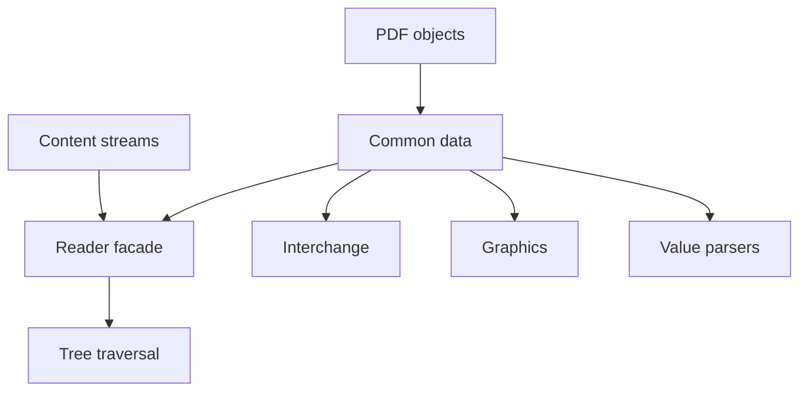
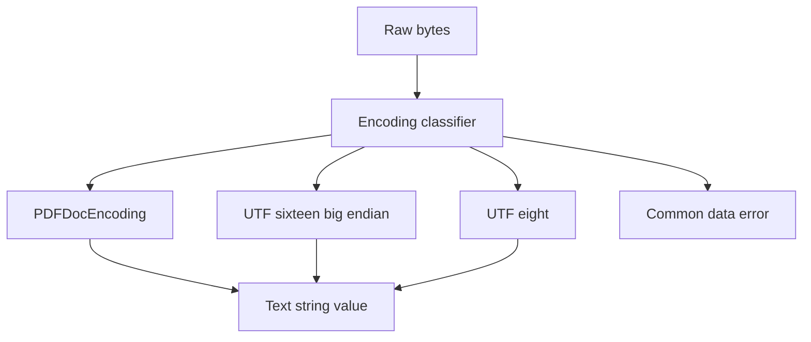
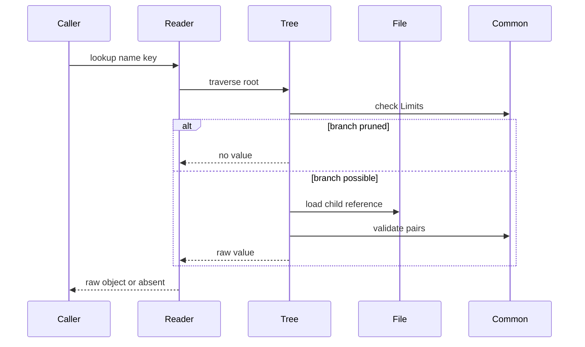
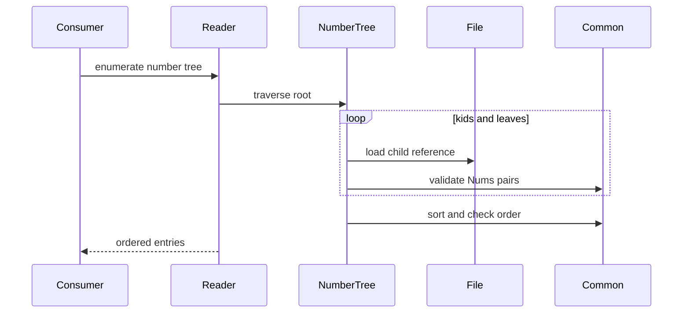
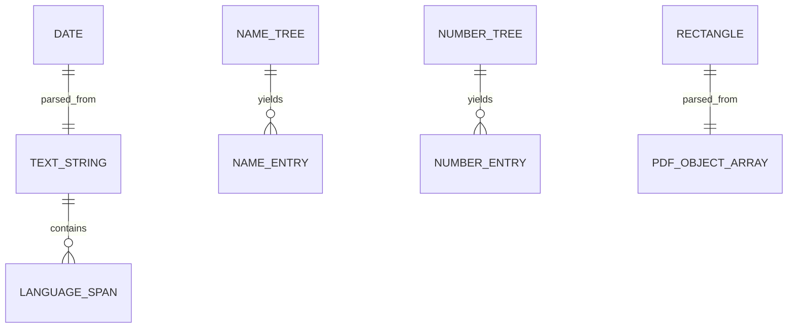

# Design Document

## Overview
This feature delivers ISO 32000-2:2020 clause 7.9 common data structures for the MoonBit `trkbt10/pdf` library. It adds typed, read-side interpretation for text strings, ASCII strings, byte strings, text streams, dates, rectangles, name trees, and number trees while preserving the existing raw `PdfObject` model.

Library users and downstream reader, graphics, and interchange features use these APIs to validate document-hierarchy values consistently. The feature introduces a small `src/common_data` package for pure value semantics and updates `src/reader` tree traversal and compatibility facades without changing low-level parsing or content-stream string semantics.

### Goals
- Preserve raw PDF object parsing while adding opt-in 7.9 value interpretation.
- Decode text strings from PDFDocEncoding, UTF-16BE with BOM, and UTF-8 with BOM.
- Validate ASCII strings, byte strings, and unencoded text stream bytes without applying content-stream text rules.
- Parse PDF date strings into a typed value while preserving the exact source bytes.
- Centralize rectangle validation for four-number arrays, including zero width or zero height.
- Harden name-tree and number-tree lookup and enumeration around key ordering, pair-array shape, indirect child references, and cycle detection.
- Keep existing reader public APIs source-compatible where practical.

### Non-Goals
- Changing `PdfObject::String`, `PdfStream`, `PdfName`, `ObjectId`, lexer behavior, parser behavior, xref lookup, stream filter decoding, or content-stream parsing.
- PDF writing, value mutation, date formatting, date arithmetic, time-zone conversion to system time, or metadata synchronization.
- Unicode normalization, full BCP 47 registry validation, ISO 3166 registry validation, or language negotiation.
- Semantic interpretation of name-tree or number-tree values beyond returning raw `PdfObject` values.
- Moving indirect object loading out of `src/reader` or introducing a generic resolver abstraction before a second package needs it.

## Boundary Commitments

### This Spec Owns
- `src/common_data` pure value models and validators for 7.9 string qualifications, text-string decoding, text-stream byte validation, PDF dates, rectangles, byte-wise name-tree key comparison, integer number-tree key comparison, and tree pair-array validation.
- A local PDFDocEncoding decode table used only by document-hierarchy text-string APIs.
- Reader integration that delegates common value parsing to `src/common_data` while preserving existing `PdfDocument`, `PdfPage`, name-tree, number-tree, and rectangle contracts.
- Name-tree lookup and enumeration validation in `src/reader`, including `Kids`, `Names`, `Limits`, byte-wise key ordering, non-overlapping child ranges, indirect child references, and cycle detection.
- Number-tree lookup and enumeration validation in `src/reader`, including `Kids`, `Nums`, integer key ordering, duplicate-key rejection, indirect child references, and cycle detection.
- Feature-specific diagnostics that distinguish malformed common data from lower-level parse errors where public error envelopes allow it.

### Out of Boundary
- Low-level object syntax, literal string escape decoding, hexadecimal string token parsing, stream envelope parsing, indirect-object parsing, and xref resolution.
- Content-stream string interpretation for glyph selection or text showing operators.
- File specification dictionaries, functions, encryption strings, font encodings, CMap decoding, ToUnicode mapping, rendering, or graphics-state behavior.
- XML metadata parsing or semantic comparison of PDF date strings against XMP dates.
- Eager loading of entire trees when a bounded lookup can use `Limits` to prune name-tree branches.
- Replacing existing `GraphicsRect` or `@reader.PdfRectangle` public contracts unless compatibility can be preserved through aliases or wrappers.

### Allowed Dependencies
- MoonBit standard library only.
- `src/common_data` may import `trkbt10/pdf/src/objects`.
- `src/reader` may import `trkbt10/pdf/src/common_data` and continue importing `objects`, `lexer`, `parser`, `filters`, `content`, `graphics`, and `interchange`.
- `src/interchange` and `src/graphics` may import `src/common_data` for date, text-string, and rectangle validation when they own document-hierarchy objects.
- `src/content` must not use `common_data` text-string interpretation for content-stream string operands.
- Local specification excerpts under `spec/extracted/7.9-common-data-structures.spec.txt` and `spec/extracted/7.9-common-data.md`.

### Revalidation Triggers
- Any public shape change to `PdfObject`, `PdfStream`, `PdfDictionary`, `PdfName`, `ObjectId`, `PdfFile::load_object`, `PdfDocumentError`, `PdfRectangle`, `PdfNameTreeEntry`, or `PdfNumberTreeEntry`.
- Any change to whether `PdfStream.data` is encoded or decoded at a call site that uses text-stream validation.
- Any new dependency from `objects`, `lexer`, `parser`, `filters`, or `content` back into `reader` or another downstream package.
- Any decision to validate content-stream strings with common data text-string semantics.
- Any change to tree lookup ordering, exact byte-key equality, integer key comparison, duplicate-key policy, `Limits` pruning, missing-object behavior, or cycle detection.
- Any change to PDFDocEncoding mapping, UTF BOM recognition, date defaulting rules, or rectangle coordinate preservation.

## Architecture

### Existing Architecture Analysis
The repository already stores PDF string objects as raw bytes in `PdfObject::String(Bytes)` and keeps name equality byte-based. Reader features currently expose `PdfRectangle`, Catalog name-tree lookup, name-tree enumeration, and private number-tree traversal for page labels and structure features. Interchange features preserve document dates as exact bytes, and graphics features define separate `GraphicsRect` geometry values.

The common data semantics in 7.9 are downstream interpretations of parsed PDF objects. They belong below reader integrations but above low-level syntax parsing. A pure `common_data` package keeps value validation reusable without allowing document-hierarchy semantics to leak into the object parser or content stream parser.

### Architecture Pattern & Boundary Map



**Architecture Integration**:
- Selected pattern: pure common value package plus reader-owned traversal. `common_data` validates direct values; `reader` resolves indirect objects and exposes document APIs.
- Domain boundaries: low-level syntax stays in `objects`, `lexer`, and `parser`; stream decoding stays in `filters`; document hierarchy traversal stays in `reader`; content-stream string semantics stay in `content`.
- Existing patterns preserved: standard-library-only implementation, package-per-directory layout, `///|` block boundaries, `pub(all)` inspectable models, `suberror` diagnostics, lazy indirect-reference loading, generated `.mbti` review, and package-local tests.
- New components rationale: text strings, dates, rectangles, and tree key checks are reused by multiple domains; tree traversal remains close to `PdfFile::load_object`.
- Steering compliance: the design is read-only, byte-oriented, independently testable, and avoids external dependencies.

### Technology Stack

| Layer | Choice / Version | Role in Feature | Notes |
|-------|------------------|-----------------|-------|
| Language | MoonBit project toolchain | Typed common-data models, validators, and reader integration | Use explicit structs, enums, raised `suberror` values, and package-local tests. |
| Object model | `trkbt10/pdf/src/objects` | Raw strings, streams, arrays, dictionaries, names, references, and numbers | No object-model changes. |
| Common data | `trkbt10/pdf/src/common_data` | Clause 7.9 pure parsing and validation | New package, imports only `objects`. |
| Reader | `trkbt10/pdf/src/reader` | Lazy name-tree and number-tree traversal over `PdfFile` | Delegates value validation to `common_data`. |
| Build and test | `moon check`, `moon test`, `moon fmt`, `moon info` | Validation and public API review | `moon info` must show only intentional API changes. |

## File Structure Plan

### Directory Structure

```text
src/
├── common_data/
│   ├── moon.pkg                      # Imports only trkbt10/pdf/src/objects
│   ├── error.mbt                     # PdfCommonDataError diagnostics
│   ├── types.mbt                     # Text, date, rectangle, and tree entry value models
│   ├── string_types.mbt              # ASCII, byte-string, text-string, and text-stream validators
│   ├── pdf_doc_encoding.mbt          # Fixed PDFDocEncoding byte-to-Unicode mapping
│   ├── date.mbt                      # PDF date parser and defaulted field model
│   ├── rectangle.mbt                 # Four-number rectangle parser over PdfObject arrays
│   ├── tree.mbt                      # Byte and integer key comparison, pair-array and Limits validation
│   ├── string_types_wbtest.mbt       # BOM, PDFDocEncoding, ASCII, byte-string, text-stream tests
│   ├── date_wbtest.mbt               # Prefix, field order, defaults, offsets, and legacy apostrophe tests
│   ├── rectangle_wbtest.mbt          # Four-number and zero-size rectangle tests
│   └── tree_wbtest.mbt               # Byte order, integer order, pair-array, and Limits tests
├── reader/
│   ├── moon.pkg                      # Add trkbt10/pdf/src/common_data import
│   ├── document_error.mbt            # Add common-data wrapping only if needed by public APIs
│   ├── document_types.mbt            # Preserve reader-facing PdfRectangle and tree entry contracts
│   ├── common_data_bridge.mbt        # Convert common-data results into PdfDocumentError and reader facades
│   ├── navigation_common.mbt         # Delegate generic rectangle and string checks to common_data
│   ├── name_dictionary.mbt           # Keep Catalog Names access and name-tree traversal
│   ├── number_tree.mbt               # Keep number-tree traversal for PageLabels and structure consumers
│   ├── page_labels.mbt               # Continue using number-tree traversal through stable helper contracts
│   ├── common_data_bridge_wbtest.mbt # Reader error mapping and compatibility tests
│   ├── name_tree_wbtest.mbt          # Extend with sorting, Limits, overlap, pruning, and cycle cases
│   └── number_tree_wbtest.mbt        # Add ordering, malformed Nums, invalid Kids, and cycle cases
├── interchange/
│   ├── moon.pkg                      # Add common_data import if date/text validation is adopted here
│   ├── document_info.mbt             # Use common date/text validators for Info strings where exposed
│   └── page_piece.mbt                # Use common date validation while preserving exact bytes
├── graphics/
│   ├── moon.pkg                      # Add common_data import only for document-object rectangle parsing
│   ├── pattern_validation.mbt        # Optionally delegate BBox array validation without changing GraphicsRect
│   └── form_xobject.mbt              # Optionally delegate BBox validation without changing FormXObject
└── content/
    └── no planned common_data use     # Content-stream strings keep content-specific semantics
```

### Modified Files
- `src/reader/moon.pkg` - Add `trkbt10/pdf/src/common_data`.
- `src/reader/document_types.mbt` - Preserve reader public type names; add aliases or conversion helpers to common-data models only when `moon info` confirms compatibility.
- `src/reader/navigation_common.mbt` - Replace duplicated rectangle and primitive string checks with bridge calls where diagnostics remain equivalent.
- `src/reader/name_dictionary.mbt` - Delegate byte comparison, pair-array shape checks, and `Limits` validation to `common_data`; keep `PdfFile::load_object` traversal.
- `src/reader/number_tree.mbt` - Delegate integer pair-array and ordering checks to `common_data`; keep `PdfFile::load_object` traversal.
- `src/reader/page_labels.mbt` - Revalidate behavior after number-tree helper hardening; no semantic change to page label formatting.
- `src/interchange/moon.pkg`, `src/interchange/document_info.mbt`, `src/interchange/page_piece.mbt` - Adopt common date/text validators when doing so does not alter exact-byte preservation.
- `src/graphics/moon.pkg`, `src/graphics/pattern_validation.mbt`, `src/graphics/form_xobject.mbt` - Adopt common rectangle validation only at document-object boundaries and convert to `GraphicsRect`.
- `src/reader/pkg.generated.mbti`, `src/interchange/pkg.generated.mbti`, `src/graphics/pkg.generated.mbti`, and `src/common_data/pkg.generated.mbti` - Regenerated by `moon info` after implementation.

### Component to File Mapping

| Component | Primary Files |
|-----------|---------------|
| CommonDataValueModel | `src/common_data/types.mbt`, `src/common_data/error.mbt` |
| TextStringCodec | `src/common_data/string_types.mbt`, `src/common_data/pdf_doc_encoding.mbt` |
| DateParser | `src/common_data/date.mbt` |
| RectangleParser | `src/common_data/rectangle.mbt` |
| TreeCore | `src/common_data/tree.mbt` |
| ReaderCommonDataBridge | `src/reader/common_data_bridge.mbt`, `src/reader/document_error.mbt` |
| NameTreeTraversal | `src/reader/name_dictionary.mbt` |
| NumberTreeTraversal | `src/reader/number_tree.mbt`, `src/reader/page_labels.mbt` |
| InterchangeCommonDataAdoption | `src/interchange/document_info.mbt`, `src/interchange/page_piece.mbt` |
| GraphicsCommonDataAdoption | `src/graphics/pattern_validation.mbt`, `src/graphics/form_xobject.mbt` |

## System Flows

### Text String Interpretation



The classifier uses leading bytes only: UTF-16BE BOM, UTF-8 BOM, otherwise PDFDocEncoding. The output retains source bytes and records encoding; decoding errors fail fast.

### Name Tree Lookup



`common_data` validates direct node shapes and comparisons. `reader` owns child loading, missing-object behavior, and cycle detection.

### Number Tree Enumeration



Enumeration returns raw values in numeric key order and preserves the reader error envelope used by PageLabels and structure consumers.

## Requirements Traceability

| Requirement | Summary | Components | Interfaces | Flows |
|-------------|---------|------------|------------|-------|
| 0.1 | Common 7.9 structures are document-hierarchy data built from 7.3 objects and not content-stream semantics. | CommonDataValueModel, ReaderCommonDataBridge | `PdfCommonDataError`, reader bridge contracts | Text String Interpretation |
| 0.2 | String objects are qualified as text, ASCII, or byte strings. | TextStringCodec, CommonDataValueModel | `classify_pdf_string`, `validate_ascii_string`, `validate_byte_string` | Text String Interpretation |
| 0.3 | Text strings use PDFDocEncoding, UTF-16BE BOM, or UTF-8 BOM and must handle supplementary Unicode. | TextStringCodec | `parse_text_string`, PDFDocEncoding table | Text String Interpretation |
| 0.4 | Unicode text strings may contain language escape sequences. | TextStringCodec | `PdfLanguageSpan`, language escape scan result | Text String Interpretation |
| 0.5 | PDFDocEncoded strings use single-byte PDFDocEncoding. | TextStringCodec | `decode_pdf_doc_encoding` | Text String Interpretation |
| 0.6 | Byte strings preserve arbitrary 8-bit bytes with unknown character encoding. | TextStringCodec | `validate_byte_string`, raw bytes contract | Text String Interpretation |
| 0.7 | Text streams validate unencoded bytes using text-string requirements. | TextStringCodec | `validate_text_stream_bytes` | Text String Interpretation |
| 0.8 | Dates follow PDF date string field order, defaults, and time-zone syntax. | DateParser, InterchangeCommonDataAdoption | `parse_pdf_date`, `parse_pdf_date_object` | None |
| 0.9 | Rectangles are arrays of four numbers and zero width or height is allowed. | RectangleParser, ReaderCommonDataBridge, GraphicsCommonDataAdoption | `parse_pdf_rectangle`, reader and graphics conversion helpers | None |
| 0.10 | Name trees use string keys, ordered byte-wise, node dictionaries, `Kids`, `Names`, and `Limits`. | TreeCore, NameTreeTraversal | `lookup_name_tree`, `enumerate_name_tree`, `validate_name_tree_pairs` | Name Tree Lookup |
| 0.11 | Number trees use integer keys, ordered numeric pairs, `Kids`, and `Nums`. | TreeCore, NumberTreeTraversal | `enumerate_number_tree`, `lookup_number_tree_le`, `validate_number_tree_pairs` | Number Tree Enumeration |

## Components and Interfaces

| Component | Domain | Intent | Req Coverage | Key Dependencies | Contracts |
|-----------|--------|--------|--------------|------------------|-----------|
| CommonDataValueModel | Common data | Defines typed 7.9 value shapes and diagnostics. | 0.1-0.11 | `objects` P0 | Service, State |
| TextStringCodec | Common data | Classifies and decodes string bytes outside content streams. | 0.2-0.7 | CommonDataValueModel P0 | Service |
| DateParser | Common data | Parses PDF date strings without time normalization. | 0.8 | TextStringCodec P0 | Service, State |
| RectangleParser | Common data | Parses four-number rectangle arrays. | 0.9 | `objects.PdfObject` P0 | Service, State |
| TreeCore | Common data | Validates tree pair arrays, ordering, and limits. | 0.10, 0.11 | `objects.PdfObject` P0 | Service |
| ReaderCommonDataBridge | Reader | Maps common-data results into reader public models and errors. | 0.1, 0.8, 0.9 | CommonDataValueModel P0, PdfDocumentError P0 | Service |
| NameTreeTraversal | Reader | Resolves and searches Catalog name trees lazily. | 0.10 | `PdfFile::load_object` P0, TreeCore P0 | Service |
| NumberTreeTraversal | Reader | Resolves and enumerates number trees lazily. | 0.11 | `PdfFile::load_object` P0, TreeCore P0 | Service |
| InterchangeCommonDataAdoption | Interchange | Reuses date and text validation where exact bytes remain authoritative. | 0.2, 0.8 | CommonDataValueModel P1 | Service |
| GraphicsCommonDataAdoption | Graphics | Reuses rectangle validation for document-object BBox arrays. | 0.9 | RectangleParser P1 | Service |

### Common Data Package

#### CommonDataValueModel

| Field | Detail |
|-------|--------|
| Intent | Provide shared value and error types for 7.9 interpretation. |
| Requirements | 0.1-0.11 |

**Responsibilities & Constraints**
- Define typed models without owning object loading or caller-specific semantics.
- Preserve exact source bytes for strings and dates.
- Represent decoded text with its encoding and language escape metadata.
- Keep structs and enums explicit; avoid unsafe casts and untyped maps.

**Dependencies**
- Inbound: TextStringCodec, DateParser, RectangleParser, TreeCore - shared models and errors (P0).
- Inbound: reader, interchange, graphics - optional consumers (P1).
- Outbound: `@objects.PdfObject`, `@objects.PdfDictionary`, `@objects.PdfStream`, `@objects.PdfName` - raw source values (P0).

**Contracts**: Service [x] / API [ ] / Event [ ] / Batch [ ] / State [x]

##### Service Interface

```moonbit
pub(all) suberror PdfCommonDataError {
  ExpectedString(String)
  InvalidTextString(String)
  InvalidAsciiString(String)
  InvalidDate(Bytes, String)
  InvalidRectangle(String)
  InvalidTreeNode(String)
}

pub(all) enum PdfStringKind {
  Text(PdfTextString)
  Ascii(Bytes)
  Byte(Bytes)
}
```

- Preconditions: Inputs are already parsed PDF objects or unencoded byte streams.
- Postconditions: Returned values preserve raw bytes and expose typed interpretation.
- Invariants: No function resolves indirect references, decodes stream filters, or interprets content-stream text operands.

#### TextStringCodec

| Field | Detail |
|-------|--------|
| Intent | Decode document-hierarchy text strings and validate ASCII, byte, and text stream inputs. |
| Requirements | 0.2, 0.3, 0.4, 0.5, 0.6, 0.7 |

**Responsibilities & Constraints**
- Detect UTF-16BE and UTF-8 only from the required BOM bytes.
- Decode non-BOM text strings with PDFDocEncoding.
- Preserve arbitrary bytes for byte strings without requiring character validity.
- Validate ASCII strings as 7-bit byte sequences.
- Scan Unicode ESC language sequences and expose them as metadata without enforcing registry membership.

**Dependencies**
- Inbound: DateParser - date strings are text strings after object-level extraction (P0).
- Inbound: reader and interchange APIs - human-readable fields (P1).
- Outbound: CommonDataValueModel and local PDFDocEncoding table (P0).

**Contracts**: Service [x] / API [ ] / Event [ ] / Batch [ ] / State [ ]

##### Service Interface

```moonbit
pub fn parse_text_string(Bytes) -> PdfTextString raise PdfCommonDataError
pub fn validate_text_stream_bytes(Bytes) -> PdfTextString raise PdfCommonDataError
pub fn validate_ascii_string(Bytes) -> Bytes raise PdfCommonDataError
pub fn validate_byte_string(Bytes) -> Bytes
pub fn decode_pdf_doc_encoding(Bytes) -> String raise PdfCommonDataError
```

- Preconditions: `validate_text_stream_bytes` receives unencoded stream bytes; callers must apply filters first.
- Postconditions: Text decoding either returns a full typed value or raises an invalid text-string error.
- Invariants: PDFDocEncoding decoding is deterministic and does not depend on locale.

#### DateParser

| Field | Detail |
|-------|--------|
| Intent | Parse PDF date strings into typed fields while retaining source bytes. |
| Requirements | 0.8 |

**Responsibilities & Constraints**
- Require `D:` and four-digit year.
- Accept optional fields only when all preceding fields are present.
- Apply defaults: month and day default to `1`; hour, minute, and second default to `0`.
- Parse `+`, `-`, and `Z` offsets, including accepted legacy terminating apostrophe behavior.
- Preserve raw bytes and avoid system time conversion.

**Dependencies**
- Inbound: interchange metadata and page-piece APIs - date validation and byte preservation (P1).
- Outbound: TextStringCodec - string extraction and no-whitespace validation (P0).

**Contracts**: Service [x] / API [ ] / Event [ ] / Batch [ ] / State [x]

##### Service Interface

```moonbit
pub fn parse_pdf_date(Bytes) -> PdfDate raise PdfCommonDataError
pub fn parse_pdf_date_object(@objects.PdfObject) -> PdfDate raise PdfCommonDataError
```

- Preconditions: Object input must be a string object.
- Postconditions: Parsed fields are range-checked and defaulted; raw bytes are unchanged.
- Invariants: No calendar normalization, leap-year validation, or conversion to UTC is performed.

#### RectangleParser

| Field | Detail |
|-------|--------|
| Intent | Validate rectangle arrays consistently across reader and graphics document objects. |
| Requirements | 0.9 |

**Responsibilities & Constraints**
- Require an array of exactly four numeric objects.
- Preserve coordinate order as lower-left x, lower-left y, upper-right x, upper-right y.
- Allow equal x coordinates or equal y coordinates.
- Do not normalize, reorder, transform, or clip coordinates.

**Dependencies**
- Inbound: ReaderCommonDataBridge and GraphicsCommonDataAdoption - typed rectangle construction (P0).
- Outbound: `@objects.PdfObject` number extraction (P0).

**Contracts**: Service [x] / API [ ] / Event [ ] / Batch [ ] / State [x]

##### Service Interface

```moonbit
pub fn parse_pdf_rectangle(@objects.PdfObject) -> PdfRectangle raise PdfCommonDataError
```

- Preconditions: Input is a direct array object; indirect resolution is caller-owned.
- Postconditions: Returned rectangle has four `Double` coordinates.
- Invariants: Zero width and zero height are valid.

#### TreeCore

| Field | Detail |
|-------|--------|
| Intent | Provide pure key comparison and node-array validation for name and number trees. |
| Requirements | 0.10, 0.11 |

**Responsibilities & Constraints**
- Compare name-tree keys byte by byte, with shorter keys before longer keys sharing the same prefix.
- Compare number-tree keys numerically as integers.
- Validate `Names` and `Nums` arrays have even length and correct key object types.
- Validate name-tree `Limits` as two strings and check lower bound does not exceed upper bound.
- Detect local duplicate or descending keys in a leaf pair array before entries are returned.

**Dependencies**
- Inbound: NameTreeTraversal and NumberTreeTraversal - traversal-time validation (P0).
- Outbound: `@objects.PdfObject` shapes (P0).

**Contracts**: Service [x] / API [ ] / Event [ ] / Batch [ ] / State [ ]

##### Service Interface

```moonbit
pub fn compare_name_tree_keys(Bytes, Bytes) -> Int
pub fn compare_number_tree_keys(Int, Int) -> Int
pub fn validate_name_tree_pairs(@objects.PdfObject) -> Array[PdfNameTreeEntry] raise PdfCommonDataError
pub fn validate_number_tree_pairs(@objects.PdfObject) -> Array[PdfNumberTreeEntry] raise PdfCommonDataError
pub fn validate_name_tree_limits(@objects.PdfObject) -> (Bytes, Bytes) raise PdfCommonDataError
```

- Preconditions: Inputs are direct node entries after reader lookup.
- Postconditions: Returned entries are in source order and have valid key/value pair shapes.
- Invariants: TreeCore never resolves `Kids`; traversal owns indirect references.

### Reader Integration

#### ReaderCommonDataBridge

| Field | Detail |
|-------|--------|
| Intent | Keep reader public contracts stable while reusing common data validation. |
| Requirements | 0.1, 0.8, 0.9 |

**Responsibilities & Constraints**
- Convert `PdfCommonDataError` into `PdfDocumentError` with the owning object id or key context.
- Preserve `@reader.PdfRectangle` and tree entry API compatibility.
- Centralize conversions from common rectangle and date models into reader-specific records where needed.

**Dependencies**
- Inbound: `navigation_common.mbt`, annotations, articles, page accessors - common validation (P0).
- Outbound: `src/common_data` - pure validation (P0).
- Outbound: `PdfDocumentError` - public reader diagnostics (P0).

**Contracts**: Service [x] / API [ ] / Event [ ] / Batch [ ] / State [ ]

##### Service Interface

```moonbit
fn reader_rectangle(
  value : @objects.PdfObject,
  owner : @objects.PdfName,
  label : String,
) -> PdfRectangle raise PdfDocumentError

fn reader_common_error(
  owner : @objects.PdfName,
  label : String,
  error : @common_data.PdfCommonDataError,
) -> PdfDocumentError
```

- Preconditions: Callers provide the diagnostic owner used by existing reader errors.
- Postconditions: Existing reader behavior remains source-compatible except for stricter 7.9 validation where requirements require it.
- Invariants: The bridge does not load objects or change public object ownership.

#### NameTreeTraversal

| Field | Detail |
|-------|--------|
| Intent | Resolve Catalog name trees lazily and return raw values by exact byte key. |
| Requirements | 0.10 |

**Responsibilities & Constraints**
- Root node contains either `Kids` or `Names`, not both.
- Child entries in `Kids` are indirect references.
- Leaf `Names` arrays contain string keys and raw values in ascending byte order.
- Root nodes do not require `Limits`; non-root intermediate and leaf nodes use `Limits` to constrain lookup pruning.
- Enumeration rejects duplicate keys and child ranges that overlap or appear out of order.
- Traversal tracks visited indirect object ids and raises cycle errors.

**Dependencies**
- Inbound: `PdfDocument::lookup_name`, `PdfDocument::name_tree_entries` - public lookup and enumeration (P0).
- Outbound: `PdfFile::load_object` - lazy child loading (P0).
- Outbound: TreeCore - key comparison and pair validation (P0).

**Contracts**: Service [x] / API [ ] / Event [ ] / Batch [ ] / State [ ]

##### Service Interface

```moonbit
fn lookup_name_tree(
  file : PdfFile,
  root : @objects.PdfObject,
  key : Bytes,
) -> @objects.PdfObject? raise PdfDocumentError

fn enumerate_name_tree(
  file : PdfFile,
  root : @objects.PdfObject,
) -> Array[PdfNameTreeEntry] raise PdfDocumentError
```

- Preconditions: `root` is the Catalog name-tree category root object or indirect reference.
- Postconditions: Lookup returns the first exact byte-key match or absence; enumeration returns ordered entries.
- Invariants: Values remain raw `PdfObject` values and are not interpreted by this component.

#### NumberTreeTraversal

| Field | Detail |
|-------|--------|
| Intent | Resolve number trees lazily for PageLabels and structure consumers. |
| Requirements | 0.11 |

**Responsibilities & Constraints**
- Root node contains either `Kids` or `Nums`, not both.
- Child entries in `Kids` are indirect references.
- Leaf `Nums` arrays contain integer keys and raw values in ascending numeric order.
- Enumeration rejects duplicate integer keys and descending leaf key order.
- Traversal tracks visited indirect object ids and raises cycle errors.
- Lookup helpers may support less-than-or-equal lookup for PageLabels without changing the generic enumeration contract.

**Dependencies**
- Inbound: PageLabels and structure tree consumers - ordered number-tree entries (P0).
- Outbound: `PdfFile::load_object` - lazy child loading (P0).
- Outbound: TreeCore - pair validation and numeric ordering (P0).

**Contracts**: Service [x] / API [ ] / Event [ ] / Batch [ ] / State [ ]

##### Service Interface

```moonbit
fn enumerate_number_tree(
  file : PdfFile,
  root : @objects.PdfObject,
  owner : @objects.PdfName,
) -> Array[PdfNumberTreeEntry] raise PdfDocumentError

fn lookup_number_tree_le(
  file : PdfFile,
  root : @objects.PdfObject,
  key : Int,
  owner : @objects.PdfName,
) -> PdfNumberTreeEntry? raise PdfDocumentError
```

- Preconditions: `root` is a number-tree root object or indirect reference.
- Postconditions: Entries are returned in ascending integer-key order.
- Invariants: Values remain raw `PdfObject` values; consumer-specific value parsing is out of scope.

### Cross-Package Adoption

#### InterchangeCommonDataAdoption

| Field | Detail |
|-------|--------|
| Intent | Reuse common date and text validation while preserving exact metadata bytes. |
| Requirements | 0.2, 0.8 |

**Responsibilities & Constraints**
- Validate Info dictionary text string and date fields only at public interchange validation boundaries.
- Preserve raw bytes in existing interchange models.
- Avoid parsing XML metadata date values.

**Dependencies**
- Inbound: reader interchange facade - document metadata access (P1).
- Outbound: TextStringCodec and DateParser - optional validation (P1).

**Contracts**: Service [x] / API [ ] / Event [ ] / Batch [ ] / State [ ]

##### Service Interface
- Implementation uses existing `validate_document_info` and page-piece validation entry points; no new public interchange method is required unless validation results need to expose parsed dates.
- Preconditions: Existing interchange callers already pass resolved dictionaries or streams.
- Postconditions: Raw date and string bytes remain available.
- Invariants: Metadata XML parsing remains unsupported.

#### GraphicsCommonDataAdoption

| Field | Detail |
|-------|--------|
| Intent | Reuse rectangle validation for document-object bounding boxes without changing graphics geometry. |
| Requirements | 0.9 |

**Responsibilities & Constraints**
- Validate BBox arrays through common rectangle logic where source data is a PDF document object.
- Convert the common rectangle to existing `GraphicsRect`.
- Do not use common rectangle parsing for content-stream `re` operators.

**Dependencies**
- Inbound: pattern and Form XObject validators - BBox parsing (P1).
- Outbound: RectangleParser - four-number PDF object validation (P1).

**Contracts**: Service [x] / API [ ] / Event [ ] / Batch [ ] / State [ ]

##### Service Interface
- Implementation keeps existing `required_graphics_rect` and `optional_graphics_rect` public behavior, optionally delegating the PDF object array validation to `common_data`.
- Preconditions: Inputs are dictionary BBox entries, not graphics path operators.
- Postconditions: Existing `GraphicsRect` records remain unchanged.
- Invariants: No rendering or coordinate transformation occurs.

## Data Models

### Domain Model
- `PdfTextString` is a value object with raw bytes, selected encoding, decoded text, and optional language spans.
- `PdfDate` is a value object with raw bytes, defaulted date/time fields, and optional UTC relationship.
- `PdfRectangle` is a value object with four coordinates in source order.
- `PdfNameTreeEntry` and `PdfNumberTreeEntry` are key/value entries whose values remain raw `PdfObject` values.
- Reader tree traversal is a service over `PdfFile`, not a persisted aggregate.



### Logical Data Model

**Structure Definition**:
- `PdfTextEncoding`: `PDFDocEncoding`, `UTF16BE`, `UTF8`.
- `PdfLanguageSpan`: language code bytes, optional country code bytes, and byte range or decoded position where the language applies.
- `PdfDate`: `year`, `month`, `day`, `hour`, `minute`, `second`, `offset`, and `raw`.
- `PdfUtcOffset`: `GMT`, `LaterThanUT(hours, minutes)`, `EarlierThanUT(hours, minutes)`, or `UnspecifiedGMT`.
- `PdfRectangle`: `left`, `bottom`, `right`, `top`.
- Name-tree natural key: exact `Bytes`.
- Number-tree natural key: `Int`.

**Consistency & Integrity**:
- Text strings keep decoded text and raw bytes together; decoded text never replaces raw bytes.
- Dates preserve raw bytes and default missing fields deterministically.
- Tree entries are sorted by their required key comparison before public enumeration is returned.
- Reader cycle detection uses indirect object ids; direct dictionaries cannot participate in identity-based cycle checks.

### Data Contracts & Integration

**Package Data Transfer**
- `common_data` accepts `@objects.PdfObject`, `@objects.PdfStream`, `Bytes`, and arrays from already parsed objects.
- `reader` converts common errors into `PdfDocumentError` and returns existing reader models.
- `interchange` and `graphics` adopt common validators only at document-object validation boundaries.

**Backward Compatibility**
- Existing `@reader.PdfRectangle`, `PdfNameTreeEntry`, `PdfNumberTreeEntry`, and name-tree public methods remain available.
- If MoonBit aliases do not preserve generated interface shape, reader keeps local structs and conversion helpers.

## Error Handling

### Error Strategy
Common data validation fails fast with `PdfCommonDataError`. Reader-facing APIs wrap these errors into `PdfDocumentError` with existing owner context so callers do not need to import `common_data` unless they call it directly.

### Error Categories and Responses
- Invalid type: expected string, array, number, integer key, or dictionary entry shape is absent or wrong; raise the package-specific validation error.
- Invalid text encoding: malformed UTF-16BE, malformed UTF-8, undefined PDFDocEncoding byte, or malformed language escape; preserve the raw bytes only in diagnostic-safe summaries.
- Invalid date: missing `D:`, missing year, invalid field range, skipped optional field, malformed offset, or whitespace in the date string.
- Invalid rectangle: not four values or any coordinate is not a number; equal coordinate pairs are accepted.
- Invalid tree: both `Kids` and leaf array present, neither present, invalid child reference, malformed pair array, descending keys, invalid limits, or indirect cycle.
- Reader dependency failure: `PdfFile::load_object` errors are wrapped as existing reader errors and are not converted to common-data errors.

### Monitoring
No runtime monitoring is added. The library reports typed errors through MoonBit raised-error contracts and validates behavior through focused tests.

## Testing Strategy

### Unit Tests
- `src/common_data/string_types_wbtest.mbt`: verify PDFDocEncoding default decoding, UTF-16BE BOM decoding with supplementary characters, UTF-8 BOM decoding, malformed byte rejection, ASCII string rejection for high-bit bytes, byte-string raw preservation, and language escape extraction.
- `src/common_data/date_wbtest.mbt`: verify `D:` prefix, required year, defaulted month/day/time fields, optional field ordering, `+`, `-`, `Z`, missing offset behavior, range checks, no-whitespace rule, and legacy terminating apostrophe acceptance.
- `src/common_data/rectangle_wbtest.mbt`: verify integer and real coordinates, array arity, non-number rejection, source order preservation, zero width, and zero height.
- `src/common_data/tree_wbtest.mbt`: verify byte-wise name key ordering including prefix cases, integer ordering, pair-array arity, key type checks, duplicate or descending key rejection, and name-tree limit validation.

### Integration Tests
- `src/reader/common_data_bridge_wbtest.mbt`: verify reader error mapping for invalid rectangles, dates, and text strings while preserving existing public reader model names.
- `src/reader/name_tree_wbtest.mbt`: extend coverage for `Limits` pruning, invalid root shape, invalid child references, cycle detection, sorted keys, non-overlapping ranges, exact byte lookup, and raw value preservation.
- `src/reader/number_tree_wbtest.mbt`: add coverage for malformed `Nums`, invalid `Kids`, cycle detection, sorted integer keys, and `lookup_number_tree_le` behavior used by PageLabels.
- `src/interchange/*_wbtest.mbt`: verify Info and page-piece date validation preserves exact bytes and wraps common-data failures through existing interchange errors.
- `src/graphics/*_wbtest.mbt`: verify BBox parsing still produces `GraphicsRect` and content-stream rectangle operators remain unaffected.

### Regression and Public API Tests
- Run `moon check` to validate package dependency direction and type contracts.
- Run targeted tests for `src/common_data`, `src/reader`, `src/interchange`, `src/graphics`, and `src/content` to catch accidental content-string behavior changes.
- Run `moon info` and review generated `.mbti` diffs for intended public API additions and reader compatibility.
- Run `moon fmt` before final implementation handoff.

### Performance and Boundary Tests
- Name-tree lookup with multiple `Kids` branches must avoid loading pruned branches when `Limits` excludes the search key.
- Tree traversal must reject indirect cycles without unbounded recursion.
- Text-string decoding tests should include large byte strings to confirm linear processing and no repeated concatenation hot path.

## Security Considerations
- Text and date decoding must not execute scripts, resolve external resources, open files, or evaluate action dictionaries.
- Malformed UTF and tree structures must fail deterministically without out-of-bounds array access.
- Byte strings may contain arbitrary binary data and must not be logged in full by default diagnostics.
- Tree traversal must use visited sets to prevent cyclic indirect object denial of service.

## Performance & Scalability
- Text string, date, and rectangle parsing are linear in the input size or constant for rectangles.
- Name-tree lookup should use `Limits` to prune branches and avoid reading the entire tree when possible.
- Enumeration necessarily visits all reachable nodes but must validate pair arrays incrementally and sort only the collected entry list.
- No global caches are added in `common_data`; reader can continue using existing `PdfFile` object cache behavior.

## Migration Strategy
- Add `src/common_data` first with standalone tests and no downstream imports.
- Update `src/reader` bridge and tree traversal to call common helpers while preserving generated reader API shape.
- Adopt common validators in `interchange` and `graphics` only after reader compatibility is confirmed.
- Re-run `moon info`; if aliases change public reader names unexpectedly, keep reader-local wrapper structs and conversions instead of forcing a breaking API change.
