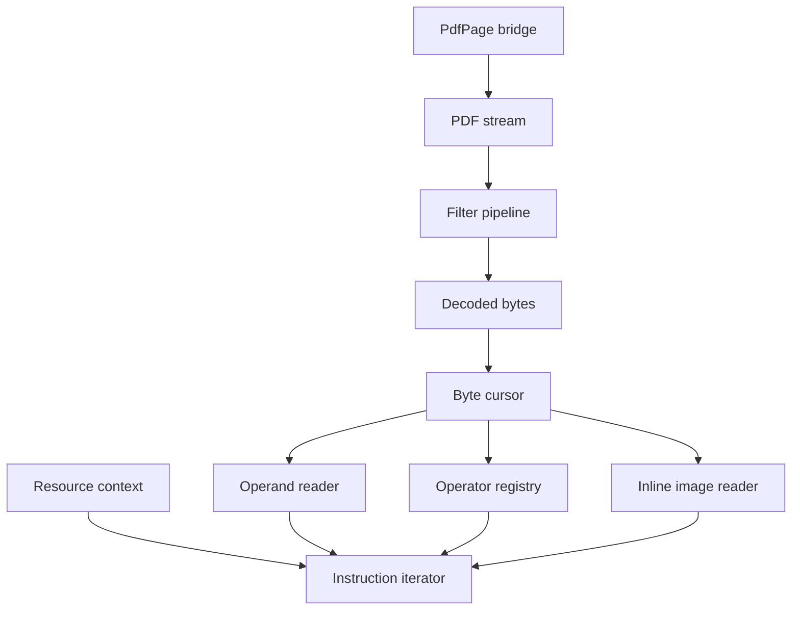
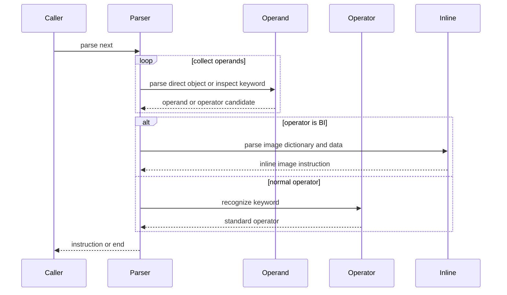
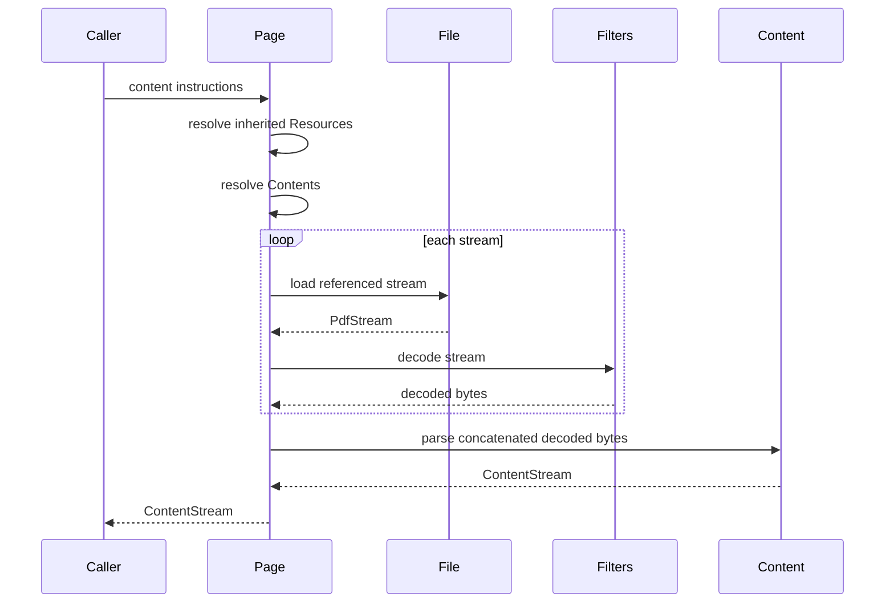
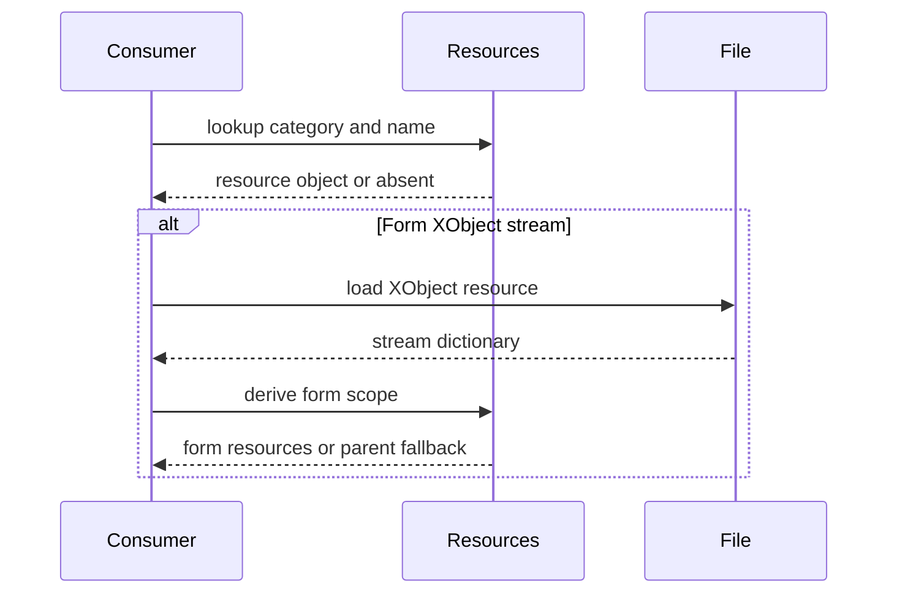
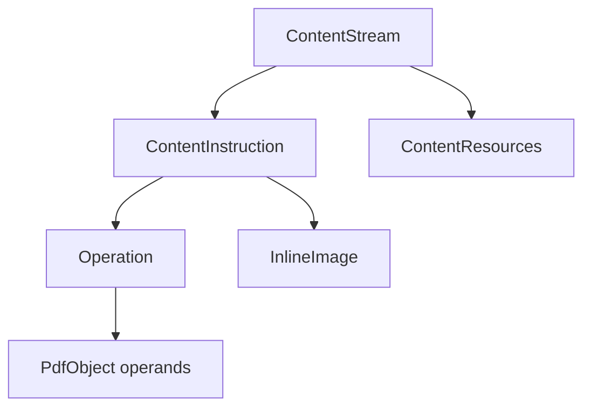

# Design Document

## Overview
This feature delivers PDF content stream parsing for the MoonBit `trkbt10/pdf` library. It reads decoded content stream bytes as sequential PDF instructions, recognizes all standard content stream operators from Annex A, handles inline images, and exposes resource-context lookup for downstream graphics, text, and extraction layers.

Library users and downstream phases use this layer to move from page/document structure to syntactic content instructions. The feature adds a reusable `src/content` package and thin `src/reader` page-integration APIs without changing the existing object parser, filter pipeline, xref reader, or document traversal contracts.

### Goals
- Parse decoded content stream bytes into ordered instructions containing direct `PdfObject` operands and a recognized operator.
- Recognize the complete standard operator vocabulary named by the requirements, including compatibility and inline image operators.
- Resolve page and stream resource dictionaries into a typed resource context and provide named resource lookup.
- Integrate with `PdfPage` so page Contents streams are loaded, decoded, concatenated, and parsed through one public workflow.
- Preserve byte offsets and typed errors for malformed content streams.

### Non-Goals
- Executing graphics state, text state, path painting, color management, font handling, XObject rendering, or text extraction.
- Validating every operator's arity and operand type beyond syntax-level direct-object restrictions.
- Interpreting image data, color spaces, fonts, shadings, marked-content properties, or procedure sets.
- Changing `PdfObject`, `PdfStream`, stream filter semantics, xref/object loading, page tree traversal, or inherited page attribute rules.
- PDF writing, content stream serialization, repair heuristics, encryption, or permission handling.

## Boundary Commitments

### This Spec Owns
- The `src/content` package and its public content stream parsing API.
- Content-stream direct operand parsing for numbers, strings, names, arrays, dictionaries, booleans, and null values.
- Recognition of standard PDF content stream operators listed in Annex A.
- Instruction iteration as `(operands, operator)` for normal operators and a distinct inline-image instruction for `BI`/`ID`/`EI`.
- Inline image dictionary parsing, abbreviated key expansion, raw image byte capture, and byte-offset diagnostics.
- Resource context modeling for `ExtGState`, `ColorSpace`, `Pattern`, `Shading`, `XObject`, `Font`, `Properties`, and deprecated `ProcSet`.
- Reader-side page integration that resolves page Contents and inherited Resources, decodes streams through `src/filters`, concatenates multiple Contents streams with LF separation, and delegates parsing to `src/content`.

### Out of Boundary
- Changing the existing object parser to understand content operators.
- Treating content-stream operands as indirect references. Content streams may refer to external objects only through named resources.
- Rendering, graphics state mutation, text extraction, glyph decoding, color conversion, marked-content interpretation, or XObject execution.
- Fetching or recursively parsing Form XObjects when a `Do` instruction is encountered. This spec provides the resource scope API needed by future consumers.
- Stream filter implementation or filter parameter semantics. Those remain in `src/filters`.
- Page tree inheritance mechanics. The reader bridge consumes existing `PdfPage::resources()` behavior.

### Allowed Dependencies
- MoonBit standard library only.
- `src/content` may import `trkbt10/pdf/src/objects`, `src/lexer`, and `src/filters`.
- `src/reader` may import `trkbt10/pdf/src/content` for page content bridge APIs and content-error wrapping.
- Existing dependency direction remains valid: `objects <- lexer <- parser`; `objects <- filters`; `objects, lexer, filters <- content`; `objects, lexer, parser, filters, content <- reader`.
- Local specification excerpts under `spec/extracted/7.8-content-streams.spec.txt` and `spec/extracted/annex-a-operators.spec.txt`.

### Revalidation Triggers
- Any public shape change to `PdfObject`, `PdfName`, `PdfDictionary`, `PdfStream`, `PdfParseError`, `ByteCursor`, `Lexer`, or filter decoding APIs.
- Any change to whether `PdfStream.data` stores encoded or decoded bytes.
- Any change to `PdfPage::contents()`, `PdfPage::resources()`, `PdfPage::resolve_entry()`, `PdfFile::load_object()`, or `PdfDocumentError`.
- Adding operator arity/type validation, rendering semantics, text extraction, recursive XObject parsing, or graphics state execution to this layer.
- Adding support for non-page content contexts that require new resource ownership rules, such as Type 3 glyph streams or annotation appearance streams.
- Any change to inline image terminator scanning or abbreviated key expansion semantics.

## Architecture

### Existing Architecture Analysis
The repository already implements `objects`, `lexer`, `parser`, `filters`, and `reader`. The object parser correctly handles ISO 32000-2 object syntax but reports ordinary content operators as invalid object tokens. The filter pipeline decodes `PdfStream` data without changing the invariant that `PdfStream.data` is raw encoded bytes. The reader and document layers expose `PdfFile`, `PdfDocument`, and `PdfPage`, including inherited page Resources and raw Contents access.

This feature adds content-stream syntax as a downstream package rather than changing lower object parsing. Page-specific integration stays in `src/reader` because only that package owns `PdfPage`, `PdfFile::load_object`, inherited Resources, and document errors.

### Architecture Pattern & Boundary Map



**Architecture Integration**:
- Selected pattern: dedicated syntax parser with reader bridge. The content parser owns instruction syntax; reader owns document/page object resolution.
- Domain boundaries: `src/content` has no `PdfFile` or `PdfPage` knowledge. `src/reader` loads page streams and supplies decoded bytes plus resources.
- Existing patterns preserved: package-per-directory layout, byte-oriented parsing, standard-library-only implementation, typed `suberror` diagnostics, `///|` block separation, and package-local tests.
- New components rationale: content operands, operator recognition, inline images, resource context, and page integration each have distinct validation rules and can be tested independently.
- Steering compliance: the design preserves lazy object loading, zero-copy orientation where practical, and independent layer validation.

### Technology Stack

| Layer | Choice / Version | Role in Feature | Notes |
|-------|------------------|-----------------|-------|
| Language | MoonBit, project toolchain | Content parser and public APIs | Use typed structs, `pub(all) enum`, and `suberror`. |
| Lexical parsing | `trkbt10/pdf/src/lexer` | Byte cursor, separator handling, string/name readers | No change to lexer behavior. |
| Data model | `trkbt10/pdf/src/objects` | Operands, dictionaries, names, streams, object IDs | No object-model change. |
| Stream decoding | `trkbt10/pdf/src/filters` | Decode page and raw content streams before parsing | Content parser also exposes decoded-byte entry points. |
| Page integration | `trkbt10/pdf/src/reader` | Resolve Contents streams and inherited Resources | Reader imports content, not the reverse. |
| Build and test | `moon check`, `moon test`, `moon fmt`, `moon info` | Validation and API review | `moon info` must show intended `content` and `reader` API additions. |

## File Structure Plan

### Directory Structure

```text
src/
├── content/
│   ├── moon.pkg                     # Imports objects, lexer, filters
│   ├── types.mbt                    # ContentInstruction, ContentOperator, PdfInlineImage, ContentStream
│   ├── operator.mbt                 # StandardContentOperator enum and byte-keyword recognition
│   ├── error.mbt                    # PdfContentError with byte offsets and filter wrapping
│   ├── resources.mbt                # ContentResources, ResourceCategory, lookup and Form XObject scope rules
│   ├── parser.mbt                   # ContentStreamParser state and parse_next iteration
│   ├── operand.mbt                  # Direct operand parser for content streams
│   ├── inline_image.mbt             # BI dictionary, ID transition, EI scanning, abbreviation expansion
│   ├── stream_input.mbt             # parse_decoded_content, parse_content_stream, stream concatenation helpers
│   ├── operator_wbtest.mbt          # Annex A operator mapping and unknown operator behavior
│   ├── operand_wbtest.mbt           # Direct objects, arrays, dictionaries, illegal refs and streams
│   ├── inline_image_wbtest.mbt      # BI ID EI parsing, raw bytes, abbreviated keys, malformed image data
│   ├── resources_wbtest.mbt         # Resource category validation, lookup, form scope selection
│   └── parser_test.mbt              # Public instruction iteration over decoded content bytes
└── reader/
    ├── moon.pkg                     # Add content import
    ├── document_error.mbt           # Add ContentError wrapper around @content.PdfContentError
    ├── page_content.mbt             # PdfPage content stream and instruction bridge APIs
    ├── page_content_wbtest.mbt      # Page Contents resolution, Resources inheritance, filter decode, array concat
    └── pdf20_content_examples_wbtest.mbt # Bundled PDF 2.0 page content smoke tests
```

### Modified Files
- `src/reader/moon.pkg` - Add `trkbt10/pdf/src/content` import.
- `src/reader/document_error.mbt` - Add `ContentError(@content.PdfContentError)` so page content APIs can raise `PdfDocumentError`.
- `src/reader/document_structure.mbt` - No required edit unless implementation chooses to keep `PdfPage` content methods near existing page entry methods. Preferred placement is `page_content.mbt`.
- `src/reader/pkg.generated.mbti` and `src/content/pkg.generated.mbti` - Regenerated by `moon info` after implementation.
- `moon.pkg`, `cmd/main/*`, `src/objects/*`, `src/parser/*`, and `src/filters/*` - No planned changes.

### Existing Files Consumed Without Modification
- `src/lexer/cursor.mbt` - Existing byte cursor and offset tracking used by `ContentStreamParser`.
- `src/lexer/lexer.mbt` - Existing regular-token, separator, string, and name lexical behavior used by `ContentOperandReader`.
- `src/filters/pipeline.mbt` - Existing `decode_stream` API used by stream-input helpers and the reader bridge.
- `src/reader/document_structure.mbt` - Existing `PdfPage::contents()`, `PdfPage::resources()`, and `PdfPage::resolve_entry()` APIs consumed by `page_content.mbt`.
- `src/reader/object_loader.mbt` - Existing `PdfFile::load_object()` behavior consumed indirectly by page content resolution.

## System Flows

### Decoded Content Instruction Iteration



The parser never creates `PdfObject::Ref` from `N G R` in content streams. A regular keyword becomes an operator candidate; unknown operators raise `PdfContentError` unless compatibility depth is active.

### Page Content Parsing



Contents arrays are concatenated in array order with one LF byte between decoded stream bodies before parsing. Missing Contents returns an empty content stream with the resolved page resource context.

### Resource Lookup and Form Scope



Resource lookup returns raw `PdfObject` values. The parser does not recursively interpret `Do`, fonts, color spaces, or marked-content properties.

## Requirements Traceability

| Requirement | Summary | Components | Interfaces | Flows |
|-------------|---------|------------|------------|-------|
| 1.1 | Parse PDF object operands before operators | ContentOperandReader, ContentStreamParser | `parse_next`, `parse_decoded_content` | Decoded Content Instruction Iteration |
| 1.2 | Recognize operator keywords as regular-character sequences | OperatorRegistry, ContentStreamParser | `recognize_operator` | Decoded Content Instruction Iteration |
| 1.3 | Produce ordered operand/operator instruction sequence | ContentStreamParser, ContentStream | `parse_all`, `ContentInstruction::Operation` | Decoded Content Instruction Iteration |
| 1.4 | Handle `BI`, `ID`, and `EI` inline image data specially | InlineImageReader, PdfInlineImage | `ContentInstruction::InlineImage` | Decoded Content Instruction Iteration |
| 2.1 | Recognize graphics state operators | OperatorRegistry, StandardContentOperator | `recognize_operator` | Decoded Content Instruction Iteration |
| 2.2 | Recognize path construction operators | OperatorRegistry, StandardContentOperator | `recognize_operator` | Decoded Content Instruction Iteration |
| 2.3 | Recognize path painting operators | OperatorRegistry, StandardContentOperator | `recognize_operator` | Decoded Content Instruction Iteration |
| 2.4 | Recognize clipping operators | OperatorRegistry, StandardContentOperator | `recognize_operator` | Decoded Content Instruction Iteration |
| 2.5 | Recognize text operators | OperatorRegistry, StandardContentOperator | `recognize_operator` | Decoded Content Instruction Iteration |
| 2.6 | Recognize color operators | OperatorRegistry, StandardContentOperator | `recognize_operator` | Decoded Content Instruction Iteration |
| 2.7 | Recognize XObject and inline image operators | OperatorRegistry, InlineImageReader | `recognize_operator`, `parse_inline_image` | Decoded Content Instruction Iteration |
| 2.8 | Recognize marked content operators | OperatorRegistry, StandardContentOperator | `recognize_operator` | Decoded Content Instruction Iteration |
| 2.9 | Recognize compatibility operators | OperatorRegistry, CompatibilityTracker | `BX`, `EX` state handling | Decoded Content Instruction Iteration |
| 2.10 | Recognize shading operator | OperatorRegistry, StandardContentOperator | `recognize_operator` | Decoded Content Instruction Iteration |
| 3.1 | Obtain resource dictionary from page or inherited ancestors | ReaderPageContentBridge, ContentResources | `PdfPage::content_resources` | Page Content Parsing |
| 3.2 | Support all required resource categories | ContentResources, ResourceCategory | `ResourceCategory`, `lookup_resource` | Resource Lookup and Form Scope |
| 3.3 | Resolve named resources from category subdictionaries | ContentResources | `lookup_resource(category, name)` | Resource Lookup and Form Scope |
| 3.4 | Use Form XObject Resources over page resources when present | ContentResources | `for_form_xobject` | Resource Lookup and Form Scope |
| 4.1 | Accept decoded bytes and resources and yield instructions one at a time | ContentStreamParser | `parse_next` | Decoded Content Instruction Iteration |
| 4.2 | Include operator name and operand array as `PdfObject` values | ContentInstruction | `Operation(operator, operands, offset)` | Decoded Content Instruction Iteration |
| 4.3 | Handle multiple page Contents streams with LF separation | ReaderPageContentBridge | `PdfPage::content_stream` | Page Content Parsing |
| 4.4 | Return clear malformed-content errors with byte offsets | PdfContentError, ContentStreamParser | `PdfContentError` variants | Decoded Content Instruction Iteration |
| 5.1 | Collect inline image key-value pairs until `ID` | InlineImageReader | `parse_inline_image_dict` | Decoded Content Instruction Iteration |
| 5.2 | Read raw bytes after `ID` until `EI` | InlineImageReader | `read_inline_image_data` | Decoded Content Instruction Iteration |
| 5.3 | Represent inline image dictionary and raw bytes in one instruction | PdfInlineImage, ContentInstruction | `ContentInstruction::InlineImage` | Decoded Content Instruction Iteration |
| 5.4 | Handle abbreviated inline image key names | InlineImageReader | `expand_inline_image_key` | Decoded Content Instruction Iteration |
| 6.1 | Accept page reference and resolve Contents and Resources | ReaderPageContentBridge | `PdfPage::content_stream`, `PdfPage::content_instructions` | Page Content Parsing |
| 6.2 | Decode content streams with filter pipeline before parsing | ReaderPageContentBridge, FilterPipeline | `@filters.decode_stream` | Page Content Parsing |
| 6.3 | Handle single stream and array-of-stream Contents | ReaderPageContentBridge | `resolve_page_content_streams` | Page Content Parsing |

## Components and Interfaces

| Component | Domain / Layer | Intent | Req Coverage | Key Dependencies | Contracts |
|-----------|----------------|--------|--------------|------------------|-----------|
| ContentStreamParser | content parser | Iterate decoded bytes into content instructions | 1.1, 1.2, 1.3, 4.1, 4.2, 4.4 | ContentOperandReader P0, OperatorRegistry P0, InlineImageReader P0 | Service, State |
| ContentOperandReader | content parser | Parse legal direct PDF operands in content streams | 1.1, 4.2 | lexer P0, objects P0 | Service |
| OperatorRegistry | content operator | Map regular keywords to standard operators | 1.2, 2.1, 2.2, 2.3, 2.4, 2.5, 2.6, 2.7, 2.8, 2.9, 2.10 | Annex A local excerpt P0 | Service |
| CompatibilityTracker | content operator | Track `BX`/`EX` depth and unknown-operator ignoring | 2.9, 4.4 | OperatorRegistry P0 | State |
| InlineImageReader | content inline image | Parse `BI` dictionary, `ID`, raw bytes, and `EI` | 1.4, 5.1, 5.2, 5.3, 5.4 | lexer P0, objects P0 | Service |
| ContentResources | content resources | Validate resource dictionary categories and look up names | 3.2, 3.3, 3.4 | objects P0 | Service, State |
| ContentStream | content model | Store parsed instruction sequence and associated resources | 1.3, 4.1, 4.2, 5.3 | ContentInstruction P0, ContentResources P0 | State |
| PdfContentError | content diagnostics | Report malformed content, illegal operands, inline image failures, and filter failures | 4.4, 5.1, 5.2 | objects.PdfParseError P0, filters.PdfFilterError P0 | Service |
| ReaderPageContentBridge | reader integration | Resolve page Contents and Resources and delegate parsing | 3.1, 4.3, 6.1, 6.2, 6.3 | PdfPage P0, PdfFile P0, filters P0, content P0 | Service |

### Content Package

#### ContentStreamParser

| Field | Detail |
|-------|--------|
| Intent | Own sequential content-stream parsing over decoded bytes. |
| Requirements | 1.1, 1.2, 1.3, 4.1, 4.2, 4.4 |

**Responsibilities & Constraints**
- Own parser state, byte offsets, operand accumulation, instruction ordering, and end-of-input handling.
- Accept only decoded bytes. Filter decoding is available through helper APIs but the parser core never decodes filters.
- Treat dictionaries, arrays, strings, names, numbers, booleans, and null as direct operands.
- Reject stream objects, indirect object definitions, and indirect references as content operands.
- Clear the operand accumulator after every emitted instruction.
- Track compatibility sections so unknown operators outside `BX`/`EX` are errors and unknown operators inside compatibility sections are ignored with their accumulated operands.

**Dependencies**
- Inbound: raw content API and reader page bridge - parse requests (P0).
- Outbound: ContentOperandReader - direct object parsing (P0).
- Outbound: OperatorRegistry - operator recognition (P0).
- Outbound: InlineImageReader - inline image special case (P0).
- External: `@lexer.ByteCursor`, `@lexer.Lexer` - byte movement and ordinary tokens (P0).

**Contracts**: Service [x] / API [ ] / Event [ ] / Batch [ ] / State [x]

##### Service Interface
```moonbit
pub fn parse_decoded_content(
  input : Bytes,
  resources : ContentResources,
) -> ContentStream raise PdfContentError

pub fn ContentStreamParser::new(
  input : Bytes,
  resources : ContentResources,
) -> ContentStreamParser

pub fn ContentStreamParser::parse_next(
  self : ContentStreamParser,
) -> ContentInstruction? raise PdfContentError
```
- Preconditions: `input` contains bytes after stream filter decoding; `resources` is the current resource context for this stream.
- Postconditions: Each returned instruction preserves source order and start byte offset.
- Invariants: Parser byte offsets are relative to the concatenated decoded content bytes supplied to the parser.

#### ContentOperandReader

| Field | Detail |
|-------|--------|
| Intent | Parse direct PDF object operands under content-stream restrictions. |
| Requirements | 1.1, 4.2, 4.4 |

**Responsibilities & Constraints**
- Reuse lexer string and name readers for byte-identical behavior with object parsing.
- Parse arrays and dictionaries recursively as direct operands.
- Treat regular tokens that are not `true`, `false`, `null`, integer, or real numbers as operator candidates.
- Do not perform `N G R` indirect-reference lookahead.
- Reject dictionary syntax errors, unterminated arrays, invalid numbers, and unexpected delimiters with content errors that preserve lexer offsets.

**Dependencies**
- Inbound: ContentStreamParser - operand collection (P0).
- Outbound: `@lexer.ByteCursor`, `@lexer.Lexer`, `@lexer.read_literal_string`, `@lexer.read_hex_string`, `@lexer.read_name` (P0).
- Outbound: `@objects.PdfObject`, `@objects.PdfName`, `@objects.PdfDictionary` (P0).

**Contracts**: Service [x] / API [ ] / Event [ ] / Batch [ ] / State [ ]

##### Service Interface
```moonbit
enum OperandReadResult {
  Operand(@objects.PdfObject)
  OperatorCandidate(Bytes, Int64)
  EndOfInput(Int64)
}
```
- Preconditions: Cursor is positioned at the next content token or separator.
- Postconditions: Operand values are direct objects only.
- Invariants: A regular operator candidate is not consumed further by object parser semantics.

#### OperatorRegistry

| Field | Detail |
|-------|--------|
| Intent | Recognize Annex A standard content stream operators from exact byte keywords. |
| Requirements | 1.2, 2.1, 2.2, 2.3, 2.4, 2.5, 2.6, 2.7, 2.8, 2.9, 2.10 |

**Responsibilities & Constraints**
- Define `StandardContentOperator` as a matchable public enum with stable variant names for all required standard operators.
- Map exact operator bytes such as `q`, `Q`, `cm`, `f*`, `T*`, `'`, and `"` to enum variants.
- Distinguish `BI` as the inline-image start operator.
- Distinguish `ID` and `EI` as inline-image grammar tokens, not ordinary instructions outside inline-image parsing.
- Report unknown operator keywords unless compatibility depth allows ignoring them.

**Dependencies**
- Inbound: ContentStreamParser - recognition of operator candidates (P0).
- Outbound: local Annex A operator table encoded in `operator.mbt` (P0).

**Contracts**: Service [x] / API [ ] / Event [ ] / Batch [ ] / State [ ]

##### Service Interface
```moonbit
pub(all) enum StandardContentOperator {
  SaveGraphicsState
  RestoreGraphicsState
  ConcatMatrix
  SetLineWidth
  SetLineCap
  SetLineJoin
  SetMiterLimit
  SetLineDash
  SetRenderingIntent
  SetFlatness
  SetExtGState
  MoveTo
  LineTo
  CurveTo
  CurveToInitialReplicated
  CurveToFinalReplicated
  ClosePath
  Rectangle
  Stroke
  CloseAndStroke
  FillNonzero
  FillNonzeroDeprecated
  FillEvenOdd
  FillStrokeNonzero
  FillStrokeEvenOdd
  CloseFillStrokeNonzero
  CloseFillStrokeEvenOdd
  EndPath
  ClipNonzero
  ClipEvenOdd
  BeginText
  EndText
  SetCharacterSpacing
  SetWordSpacing
  SetHorizontalScaling
  SetTextLeading
  SetTextFont
  SetTextRenderingMode
  SetTextRise
  MoveTextPosition
  MoveTextPositionSetLeading
  SetTextMatrix
  MoveToNextLine
  ShowText
  ShowTextAdjusted
  QuoteShowText
  DoubleQuoteShowText
  SetStrokingColorSpace
  SetNonstrokingColorSpace
  SetStrokingColor
  SetStrokingColorSpecial
  SetNonstrokingColor
  SetNonstrokingColorSpecial
  SetStrokingGray
  SetNonstrokingGray
  SetStrokingRgb
  SetNonstrokingRgb
  SetStrokingCmyk
  SetNonstrokingCmyk
  InvokeXObject
  BeginInlineImage
  BeginInlineImageData
  EndInlineImage
  BeginMarkedContentPoint
  DefineMarkedContentPoint
  BeginMarkedContent
  BeginMarkedContentWithProperties
  EndMarkedContent
  BeginCompatibility
  EndCompatibility
  PaintShading
  SetGlyphWidth
  SetGlyphWidthAndBoundingBox
}

pub fn recognize_operator(
  keyword : Bytes,
) -> StandardContentOperator?
```
- Preconditions: `keyword` is a regular token from content stream lexical scanning.
- Postconditions: Known operators map to exactly one enum variant; unknown keywords return `None`.
- Invariants: Operator matching is byte-exact and case-sensitive.

#### InlineImageReader

| Field | Detail |
|-------|--------|
| Intent | Own the non-token raw-byte grammar between `BI`, `ID`, and `EI`. |
| Requirements | 1.4, 5.1, 5.2, 5.3, 5.4 |

**Responsibilities & Constraints**
- After `BI`, collect key-value pairs until the `ID` operator token.
- Expand abbreviated inline image keys into canonical `PdfName` keys for the required abbreviations.
- After `ID`, consume the single required white-space byte before image data.
- Read raw bytes until the terminating `EI` operator candidate with valid delimiter context.
- Return one `PdfInlineImage` value containing dictionary, raw bytes, and offsets.

**Dependencies**
- Inbound: ContentStreamParser - `BI` special case (P0).
- Outbound: ContentOperandReader - key/value operand parsing before `ID` (P0).
- Outbound: `@objects.PdfDictionary`, `Bytes` (P0).

**Contracts**: Service [x] / API [ ] / Event [ ] / Batch [ ] / State [ ]

##### Service Interface
```moonbit
pub(all) struct PdfInlineImage {
  dict : @objects.PdfDictionary
  data : Bytes
  start_offset : Int64
  data_offset : Int64
  end_offset : Int64
}
```
- Preconditions: Parser has consumed the `BI` operator keyword.
- Postconditions: Cursor is positioned after the terminating `EI`.
- Invariants: `data` contains the raw image bytes exactly as found between `ID` and `EI`, excluding the mandatory single white-space byte after `ID`.

#### ContentResources

| Field | Detail |
|-------|--------|
| Intent | Represent the current resource dictionary and provide category/name lookup. |
| Requirements | 3.2, 3.3, 3.4 |

**Responsibilities & Constraints**
- Normalize and validate supported resource categories: `ExtGState`, `ColorSpace`, `Pattern`, `Shading`, `XObject`, `Font`, `Properties`, and `ProcSet`.
- For dictionary-backed categories, return raw `PdfObject` values by resource name.
- Treat absent categories and absent resource names as `None`, not malformed content.
- Treat malformed category values as `PdfContentError` when a category is explicitly accessed.
- For Form XObject streams, choose the stream dictionary `Resources` entry when present; otherwise fall back to the parent/page resource context.

**Dependencies**
- Inbound: ContentStreamParser and downstream consumers - resource context (P0).
- Inbound: ReaderPageContentBridge - page resource construction (P0).
- Outbound: `@objects.PdfDictionary`, `@objects.PdfName`, `@objects.PdfObject` (P0).

**Contracts**: Service [x] / API [ ] / Event [ ] / Batch [ ] / State [x]

##### Service Interface
```moonbit
pub(all) enum ResourceCategory {
  ExtGState
  ColorSpace
  Pattern
  Shading
  XObject
  Font
  Properties
  ProcSet
}

pub fn ContentResources::from_dictionary(
  dict : @objects.PdfDictionary,
) -> ContentResources

pub fn ContentResources::lookup(
  self : ContentResources,
  category : ResourceCategory,
  name : @objects.PdfName,
) -> @objects.PdfObject? raise PdfContentError

pub fn ContentResources::for_form_xobject(
  parent : ContentResources,
  stream : @objects.PdfStream,
) -> ContentResources raise PdfContentError
```
- Preconditions: `dict` is the current resource dictionary associated with the stream.
- Postconditions: Lookups preserve raw resource values without indirect resolution inside `src/content`.
- Invariants: Resource names are exact `PdfName` byte values.

### Reader Integration Layer

#### ReaderPageContentBridge

| Field | Detail |
|-------|--------|
| Intent | Public page-level bridge from document structure to content parsing. |
| Requirements | 3.1, 4.3, 6.1, 6.2, 6.3 |

**Responsibilities & Constraints**
- Resolve inherited page Resources through `PdfPage::resources()`.
- Resolve the page Contents entry through `PdfPage::resolve_entry(/Contents)`.
- Accept absent Contents as an empty content stream.
- Accept a single stream or an array of streams/references; reject non-stream content entries.
- Decode each `PdfStream` using `@filters.decode_stream` before parsing.
- Concatenate multiple decoded streams with one LF byte between adjacent streams.
- Delegate instruction parsing to `@content.parse_decoded_content`.

**Dependencies**
- Inbound: library callers - page content parsing (P0).
- Outbound: PdfPage and PdfFile internals - Contents and Resources resolution (P0).
- Outbound: `@filters.decode_stream` - stream decoding (P0).
- Outbound: `@content.ContentResources`, `@content.ContentStream`, `@content.PdfContentError` (P0).

**Contracts**: Service [x] / API [ ] / Event [ ] / Batch [ ] / State [ ]

##### Service Interface
```moonbit
pub fn PdfPage::content_resources(
  self : PdfPage,
) -> @content.ContentResources raise PdfDocumentError

pub fn PdfPage::content_stream(
  self : PdfPage,
) -> @content.ContentStream raise PdfDocumentError

pub fn PdfPage::content_instructions(
  self : PdfPage,
) -> Array[@content.ContentInstruction] raise PdfDocumentError
```
- Preconditions: `PdfPage` belongs to a valid `PdfDocument`.
- Postconditions: Returned instructions are parsed from decoded page contents in document-defined Contents order.
- Invariants: Errors raised from content or filters are wrapped as `PdfDocumentError`.

## Data Models

### Domain Model
- `ContentStream` is the aggregate root for one parsed content byte sequence. It owns the associated `ContentResources` and ordered `ContentInstruction` values.
- `ContentInstruction` is either a normal operator instruction or an inline image instruction.
- `ContentResources` is a value object that represents the current resource dictionary scope.
- `PdfInlineImage` is a value object containing expanded image dictionary keys and exact raw image bytes.



### Logical Data Model

**Structure Definition**:
- `ContentStream`: `resources : ContentResources`, `instructions : Array[ContentInstruction]`.
- `ContentInstruction::Operation`: `operator : StandardContentOperator`, `operands : Array[PdfObject]`, `offset : Int64`.
- `ContentInstruction::InlineImage`: `image : PdfInlineImage`.
- `PdfInlineImage`: `dict : PdfDictionary`, `data : Bytes`, `start_offset : Int64`, `data_offset : Int64`, `end_offset : Int64`.
- `ContentResources`: `dict : PdfDictionary` plus category lookup helpers.

**Consistency & Integrity**:
- Instruction order matches byte order in the decoded input.
- Instruction offsets are relative to the decoded input or concatenated decoded page input.
- Operand arrays are immutable to callers through value return conventions.
- Resource lookup never mutates resource dictionaries or resolves indirect references internally.

### Data Contracts & Integration

**API Data Transfer**
- Public APIs exchange MoonBit values only: `Bytes`, `PdfObject`, `PdfDictionary`, `PdfStream`, `ContentStream`, `ContentInstruction`, and typed errors.
- There is no JSON, network, database, or file-system serialization contract in this feature.

**Cross-Package Data Management**
- `src/content` consumes raw `PdfStream` and `PdfDictionary` values without owning indirect object loading.
- `src/reader` resolves page-level indirect objects before invoking content parsing.
- `src/filters` remains the only owner of stream filter transformation semantics.

## Error Handling

### Error Strategy
- `PdfContentError` is the content package error boundary and includes byte offsets for malformed content.
- Lexer and object parse failures are converted or wrapped so callers see content-stream context rather than file-object parser context.
- Filter failures are wrapped when `parse_content_stream` or reader page bridge APIs decode a `PdfStream`.
- Reader page APIs convert content failures into `PdfDocumentError::ContentError`.

### Error Categories and Responses
- Malformed content syntax: unexpected EOF, unexpected delimiter, invalid number, invalid dictionary, illegal indirect reference, or illegal stream operand. Response: raise `PdfContentError` with offset and reason.
- Unknown operator: outside compatibility sections, raise `PdfContentError`; inside compatibility sections, ignore the unknown operator and accumulated operands.
- Inline image failure: missing `ID`, missing required white-space after `ID`, missing `EI`, malformed key/value pairs, or invalid abbreviation. Response: raise `PdfContentError` with image start or current offset.
- Resource failure: malformed explicit category value or invalid Form XObject resource shape. Response: raise `PdfContentError`.
- Page integration failure: missing referenced Contents stream, non-stream Contents element, filter error, or content parse error. Response: raise `PdfDocumentError`.

### Monitoring
No runtime monitoring or logging is introduced. Test diagnostics rely on typed errors and offsets. Future CLI or application layers can format these errors without changing parser contracts.

## Testing Strategy

### Unit Tests
- `operator_wbtest.mbt`: verify every operator required by 2.1 through 2.10 maps from exact bytes to the expected enum variant, including `f*`, `B*`, `b*`, `T*`, `'`, and `"`.
- `operand_wbtest.mbt`: parse numeric, string, name, array, dictionary, boolean, and null operands before operators; reject indirect references and stream-like constructs.
- `inline_image_wbtest.mbt`: parse `BI` dictionaries, consume `ID` white-space, capture raw data, terminate on valid `EI`, and expand abbreviated keys for 5.1 through 5.4.
- `resources_wbtest.mbt`: validate category lookup, absent categories, malformed category values, and Form XObject resource override/fallback behavior.
- `parser_test.mbt`: iterate decoded content bytes one instruction at a time and verify operand clearing after each operator.

### Integration Tests
- Reader page content test for a single direct Contents stream with inherited Resources from a parent `Pages` node.
- Reader page content test for an array of referenced Contents streams decoded and concatenated with LF separation.
- Filter integration test where a FlateDecode page content stream is decoded by `@filters.decode_stream` before content parsing.
- Error integration test where malformed content inside a page stream becomes `PdfDocumentError::ContentError`.
- Compatibility-section test where unknown operators raise outside `BX`/`EX` but are ignored inside balanced compatibility sections.

### E2E / Fixture Tests
- Parse content instructions from bundled PDF 2.0 simple example pages and assert at least one recognized drawing or text instruction.
- Parse a synthetic page containing a Form XObject resource and verify `ContentResources::for_form_xobject` chooses stream Resources when present.
- Parse a synthetic page with inline image content and verify one inline image instruction is emitted with dictionary and raw bytes.

### Performance / Load
- Parse a large synthetic content stream with thousands of simple operators and verify linear progress without repeated whole-buffer reparsing.
- Parse a Contents array with multiple streams and verify concatenation performs one bounded aggregation before parsing.
- Inline image scanning test with large raw data validates no tokenization of image bytes occurs.

## Security Considerations
- Content stream bytes are untrusted input. All parsing must bounds-check byte access through `ByteCursor` or equivalent helpers.
- Inline image scanning must not read beyond decoded input when `EI` is missing.
- The parser does not allocate based on unvalidated declared image dimensions. It stores only the raw bytes present in the stream.
- Filter decompression risks remain owned by `src/filters`; page integration propagates filter errors and does not retry or repair malformed streams.

## Performance & Scalability
- Parsing is linear in decoded byte length except resource dictionary map lookups.
- Normal instructions accumulate operands only until the next operator, so memory usage is proportional to parsed output plus the largest single instruction's operand list.
- Inline image data is captured as `Bytes`. The implementation should avoid tokenizing or recursively copying the raw image payload.
- Page Contents arrays are concatenated once with LF separators to preserve standard semantics and stable offsets for parser diagnostics.

## Supporting References
- Standard operator coverage is encoded in `src/content/operator.mbt` from `spec/extracted/annex-a-operators.spec.txt`.
- Inline image abbreviation coverage is encoded in `src/content/inline_image.mbt` from ISO inline image rules referenced by 5.4.
