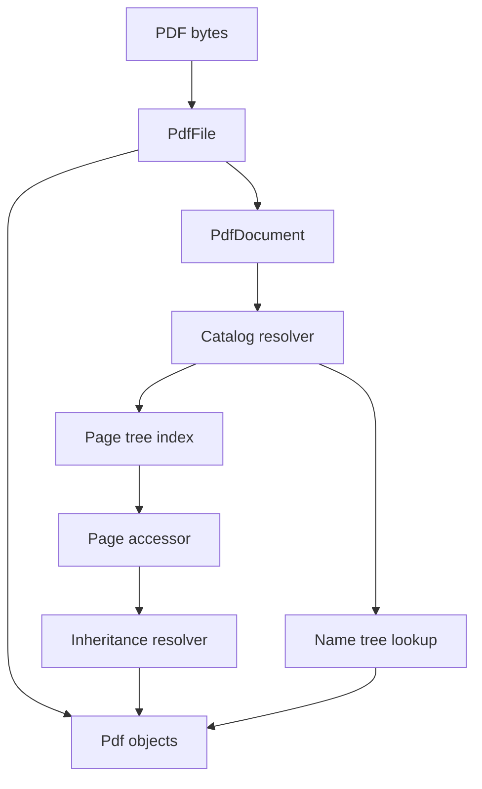
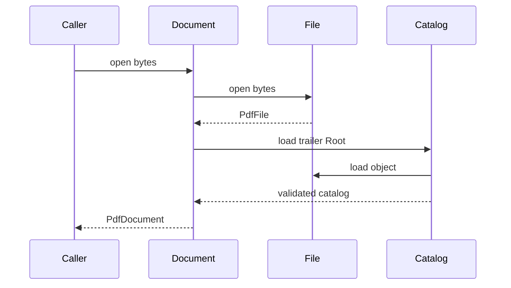
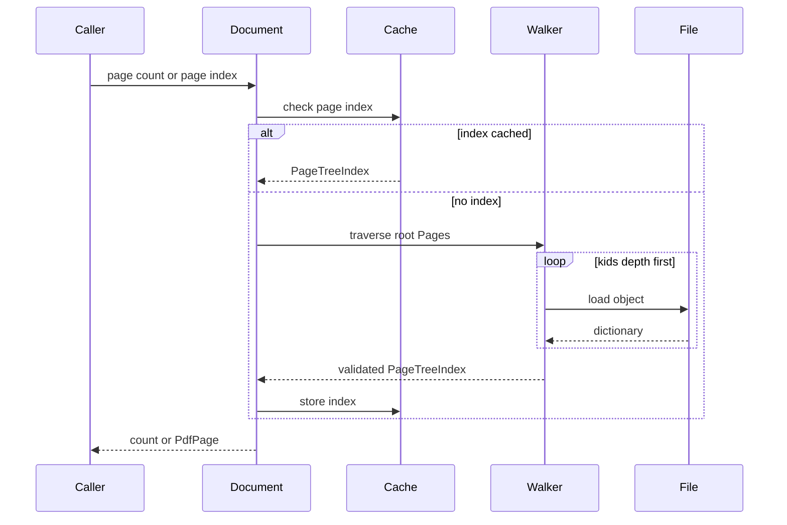
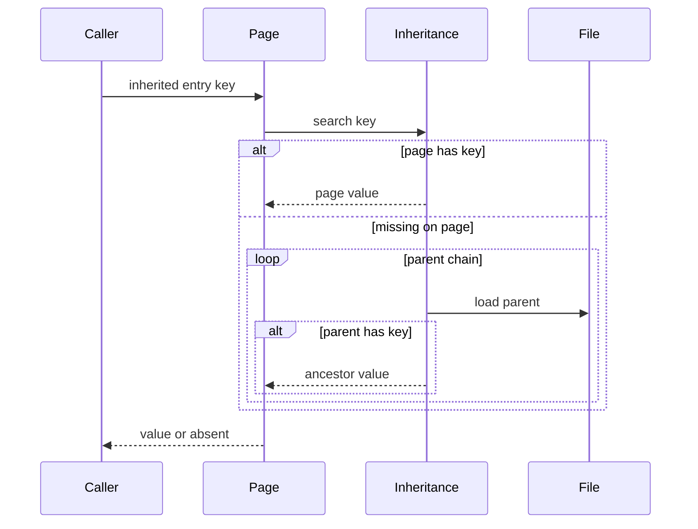
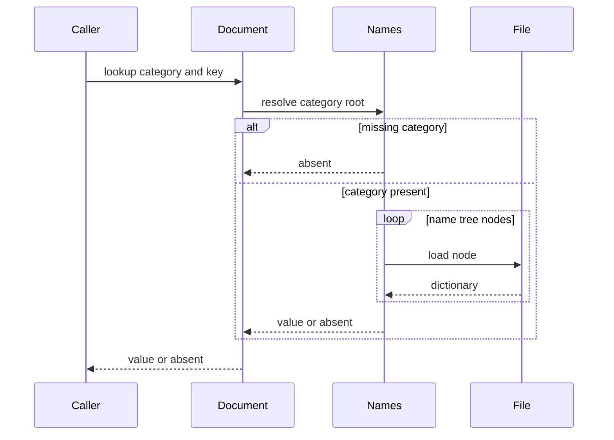
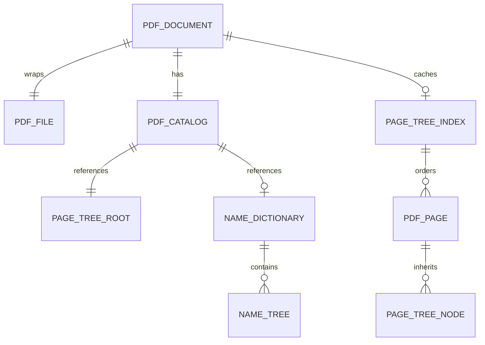

# Design Document

## Overview
This feature delivers PDF document-structure access for the MoonBit `trkbt10/pdf` library. It resolves the document Catalog from the latest trailer `Root`, validates the Page tree, exposes ordered page access, resolves selected page entries on demand, and supports page attribute inheritance per ISO 32000-2:2020 §7.7.

Library users and downstream phases use this layer to move from file-level object lookup to document-level navigation. The feature extends the existing `src/reader` package by adding a `PdfDocument` facade over `PdfFile`; it does not change low-level object parsing, xref handling, stream decoding, or content interpretation.

### Goals
- Resolve and validate the Catalog dictionary and its required `Pages` reference.
- Traverse the Page tree lazily and cache a flat page index in document order.
- Provide typed access to structural page attributes such as boxes, resources, contents, rotation, annotations, and parent references.
- Resolve inheritable page entries from the nearest ancestor `Pages` node without merging composite values.
- Provide name dictionary and name-tree lookup for the categories required by this spec.
- Validate bundled PDF 2.0 examples through public document-structure APIs.

### Non-Goals
- Interpreting content stream operators, fonts, annotations, outlines, metadata XML, structure trees, JavaScript, destinations, or named page semantics.
- Rendering, page layout, coordinate transformation, or applying `Rotate`, `UserUnit`, or page boxes to graphics.
- PDF writing, page tree mutation, page insertion, page deletion, or repair heuristics for malformed page trees.
- Encryption and permission handling beyond the existing file-structure and filter boundaries.
- Replacing `PdfFile::load_object` or changing `PdfObject`, `PdfStream`, `ObjectId`, parser, filter, or xref semantics.

## Boundary Commitments

### This Spec Owns
- Public document-structure facade APIs in `src/reader`, centered on `PdfDocument`.
- Catalog resolution from `TrailerInfo.root`, Catalog type validation, required `Pages` reference extraction, and raw recognition of selected optional Catalog entries.
- Page tree traversal from the Catalog `Pages` root, including `Pages` node validation, `Kids` validation, leaf `Page` detection, document-order flattening, cycle detection, and `Count` consistency checks.
- Page object structural access for direct and inherited entries owned by §7.7: `MediaBox`, `CropBox`, `Resources`, `Contents`, `Rotate`, `UserUnit`, `Annots`, and `Parent`.
- Typed `PdfRectangle` normalization for page boundary arrays after direct or inherited lookup.
- Name dictionary access from Catalog `Names` and lookup within named name-tree categories.
- Document-level errors for invalid Catalog, Page tree, Page object, inherited attribute, name tree, reader wrapping, and page-index failures.

### Out of Boundary
- Lower-level PDF syntax, indirect-object parsing, cross-reference resolution, object stream extraction, and stream filter decoding.
- Semantic interpretation of optional Catalog entries such as `PageLabels`, `Outlines`, `Metadata`, `MarkInfo`, `StructTreeRoot`, and `Lang`; this spec only recognizes and exposes raw values.
- Semantic interpretation of name-tree values for destinations, appearances, JavaScript, named pages, templates, embedded files, or alternate presentations.
- Content stream decoding beyond object loading and existing filter behavior.
- Validation of page resources, annotation dictionaries, action dictionaries, logical structure, fonts, images, or rendering-related defaults outside §7.7.
- Linearized PDF access strategies; inherited attributes are supported for general PDF files even though linearized conforming files should specify page attributes explicitly.

### Allowed Dependencies
- MoonBit standard library only.
- Existing local package direction remains unchanged: `src/reader` imports `src/objects`, `src/lexer`, `src/parser`, and `src/filters`; no upstream package imports `src/reader`.
- Existing `PdfFile::open`, `PdfFile::load_object`, `TrailerInfo`, `PdfReaderError`, `PdfObject`, `PdfName`, `PdfDictionary`, and `ObjectId` contracts.
- Local specification excerpts under `spec/extracted/7.7-document-structure.spec.txt`, `spec/extracted/7.7-document-structure.md`, and supporting common data references when name-tree details are needed.
- Bundled sample PDFs under `spec/pdf20examples/`.

### Revalidation Triggers
- Any public shape change to `PdfFile`, `TrailerInfo`, `PdfFile::load_object`, `PdfFile::root_ref`, `PdfReaderError`, `PdfObject`, `PdfDictionary`, `PdfName`, or `ObjectId`.
- Any change to missing-object behavior, xref merge priority, object-stream caching, or whether `PdfStream.data` stores raw encoded bytes.
- Any dependency direction change involving `objects`, `lexer`, `parser`, `filters`, or `reader`.
- Any decision to move document-structure APIs out of `src/reader` into a new package.
- Any addition of typed semantics for Catalog optional entries, name-tree values, content streams, resources, annotations, metadata, or logical structure.
- Any change to page traversal guarantees, page-index base, inherited-entry fallback behavior, or exact name-tree key representation.

## Architecture

### Existing Architecture Analysis
The repository already implements `objects`, `lexer`, `parser`, `filters`, and `reader`. The `reader` package opens a PDF byte buffer, parses file structure, merges xref sections, exposes the latest trailer, and lazily loads indirect objects. This feature builds directly on that layer and keeps all lower packages unchanged.

The existing steering direction is `objects <- lexer <- parser <- reader`, with `filters` used by `reader` for structural stream decoding. Document structure is a downstream interpretation of loaded dictionaries, so it belongs in `src/reader` and depends on `PdfFile::load_object` rather than direct parser entry points.

### Architecture Pattern & Boundary Map



**Architecture Integration**:
- Selected pattern: document facade over lazy file reader. `PdfDocument` owns document-level validation and caches while `PdfFile` remains the file-structure aggregate.
- Domain boundaries: Catalog and Page tree contracts belong to the document layer; raw object syntax belongs to `objects` and `parser`; file offsets and xref lookup belong to `PdfFile`.
- Existing patterns preserved: MoonBit package-per-directory layout, standard-library-only dependencies, typed `suberror` diagnostics, `///|` block separation, lazy indirect-reference resolution, and package-local tests.
- New components rationale: Catalog resolution, Page tree indexing, page entry access, inheritance, and name-tree lookup have separate validation rules and can be tested independently inside `src/reader`.
- Steering compliance: the design keeps byte-oriented parsing and lazy object loading while adding no external dependencies.

### Technology Stack

| Layer | Choice / Version | Role in Feature | Notes |
|-------|------------------|-----------------|-------|
| Language | MoonBit, project toolchain | Document-structure implementation and public APIs | Use explicit structs, enums, `suberror`, and raised errors. |
| Data model | `trkbt10/pdf/src/objects` | Dictionaries, names, references, arrays, streams, and raw values | No object-model changes. |
| File access | `trkbt10/pdf/src/reader` | Existing `PdfFile` open, trailer, and lazy object loading | New document files remain in this package. |
| Data structures | Standard `Bytes`, `Array`, `Map` | Name-tree keys, page arrays, page-index cache, visited sets | No external storage. |
| Build and test | `moon check`, `moon test`, `moon fmt`, `moon info` | Validation and public API review | `moon info` must show intended reader API additions only. |

## File Structure Plan

### Directory Structure

```text
src/
├── reader/
│   ├── moon.pkg                         # Existing imports remain sufficient
│   ├── document_error.mbt               # PdfDocumentError and reader-error wrapping
│   ├── document_types.mbt               # PdfDocument, PdfCatalog, PdfPage, PdfRectangle, PageTreeIndex, NameTreeCategory
│   ├── document_structure.mbt           # PdfDocument::open, PdfFile::document, catalog, page_count, page
│   ├── catalog.mbt                      # Catalog dictionary loading, Type validation, optional entry capture
│   ├── page_tree.mbt                    # Lazy Page tree traversal, Count validation, page order cache
│   ├── page.mbt                         # Page object loading and direct page entry accessors
│   ├── inheritance.mbt                  # Inheritable entry resolution through Parent links
│   ├── name_tree.mbt                    # Catalog Names access and name-tree key lookup
│   ├── document_structure_wbtest.mbt    # Catalog facade and lazy traversal tests
│   ├── page_tree_wbtest.mbt             # Kids, Count, cycle, order, and index tests
│   ├── page_wbtest.mbt                  # MediaBox, Resources, Contents, Rotate, UserUnit, Annots tests
│   ├── inheritance_wbtest.mbt           # Nearest ancestor and absent inherited entry tests
│   ├── name_tree_wbtest.mbt             # Names dictionary categories, leaf and intermediate lookup tests
│   └── pdf20_document_examples_wbtest.mbt # Bundled PDF 2.0 document-structure validation
└── objects/
    └── no planned changes               # Revalidate if PdfObject, PdfName, PdfDictionary, or ObjectId changes
```

### Modified Files
- `src/reader/pkg.generated.mbti` - Regenerated by `moon info` after adding public document APIs and `PdfDocumentError`.
- `src/reader/moon.pkg` - No planned import change; update only if implementation adds a new local package dependency, which this design does not require.
- `src/reader/document.mbt` - Optional small bridge placement for `PdfFile::document`; if added here, it must only delegate to `document_structure.mbt` behavior.
- `moon.pkg`, `pdf.mbt`, `cmd/main/*` - No planned changes unless the project later chooses root re-exports or CLI behavior.

## System Flows

### Document Open and Catalog Resolution



`PdfDocument::open` is a convenience path. Callers that already hold a `PdfFile` use `PdfFile::document`, which starts at the Catalog step and preserves the existing file cache.

### Lazy Page Enumeration



The walker validates `Kids`, `Count`, and leaf `Page` dictionaries during the first page-index build. Later page APIs read from the cached ordered index.

### Page Inherited Entry Lookup



The resolver returns the first value found. It never merges dictionaries or arrays and returns absence when the key is not present on the page or any ancestor.

### Name Tree Lookup



Lookup uses exact PDF string bytes as keys. Malformed name-tree node shapes raise a document error; missing optional categories and missing keys return absence.

## Requirements Traceability

| Requirement | Summary | Components | Interfaces | Flows |
|-------------|---------|------------|------------|-------|
| 1.1 | Follow trailer `Root` indirect reference | DocumentFacade, CatalogResolver | `PdfFile::document`, `load_catalog` | Document Open and Catalog Resolution |
| 1.2 | Verify Catalog `Type` is `Catalog` | CatalogResolver, PdfDocumentError | `load_catalog` | Document Open and Catalog Resolution |
| 1.3 | Extract required Catalog `Pages` reference | CatalogResolver, PdfCatalog | `PdfCatalog.pages_ref` | Document Open and Catalog Resolution |
| 1.4 | Recognize optional Catalog entries | CatalogResolver, PdfCatalog | `PdfCatalog::entry` | Document Open and Catalog Resolution |
| 2.1 | Recognize `Pages` nodes with `Kids` and `Count` | PageTreeWalker, PageTreeIndex | `ensure_page_index` | Lazy Page Enumeration |
| 2.2 | Recursively traverse `Kids` entries | PageTreeWalker | `traverse_pages_node` | Lazy Page Enumeration |
| 2.3 | Verify `Count` against leaf pages | PageTreeWalker, PdfDocumentError | `validate_count` | Lazy Page Enumeration |
| 2.4 | Produce flat ordered page references | PageTreeIndex | `PdfDocument::pages`, `PdfDocument::page` | Lazy Page Enumeration |
| 3.1 | Recognize page objects with `Type /Page` | PageAccessor, PageTreeWalker | `load_page` | Lazy Page Enumeration |
| 3.2 | Provide `MediaBox` access | PageAccessor, InheritanceResolver, PdfRectangle | `PdfPage::media_box` | Page Inherited Entry Lookup |
| 3.3 | Provide optional page entries | PageAccessor | `PdfPage::crop_box`, `resources`, `contents`, `rotate`, `user_unit`, `annots`, `parent_ref` | Page Inherited Entry Lookup |
| 3.4 | Resolve indirect references in page entries on demand | PageAccessor, DocumentFacade | `PdfPage::resolve_entry` | Page Inherited Entry Lookup |
| 4.1 | Search ancestors when page omits inheritable entry | InheritanceResolver | `PdfPage::inherited_entry` | Page Inherited Entry Lookup |
| 4.2 | Support `Resources`, `MediaBox`, `CropBox`, `Rotate` inheritance | InheritanceResolver, PageAccessor | typed page entry methods | Page Inherited Entry Lookup |
| 4.3 | Use nearest ancestor value | InheritanceResolver | `resolve_inherited_entry` | Page Inherited Entry Lookup |
| 4.4 | Return absent when no source defines entry | InheritanceResolver | `PdfPage::inherited_entry` | Page Inherited Entry Lookup |
| 5.1 | Resolve optional Catalog `Names` entry | NameDictionaryReader, CatalogResolver | `PdfDocument::names_dict` | Name Tree Lookup |
| 5.2 | Lookup required name-tree categories | NameDictionaryReader, NameTreeReader | `PdfDocument::lookup_name` | Name Tree Lookup |
| 5.3 | Map string keys to values | NameTreeReader | exact `Bytes` key lookup | Name Tree Lookup |
| 6.1 | Report total page count | DocumentFacade, PageTreeIndex | `PdfDocument::page_count` | Lazy Page Enumeration |
| 6.2 | Return page by zero-based index | DocumentFacade, PageAccessor | `PdfDocument::page` | Lazy Page Enumeration |
| 6.3 | Error for out-of-range indices | DocumentFacade, PdfDocumentError | `PageIndexOutOfRange` | Lazy Page Enumeration |
| 6.4 | Traverse pages lazily on first need | DocumentFacade, PageTreeIndex cache | `ensure_page_index` | Lazy Page Enumeration |
| 7.1 | Validate simple PDF 2.0 Catalog, pages, first MediaBox | PDF 2.0 tests, DocumentFacade, PageAccessor | public document APIs | Document Open and Catalog Resolution, Lazy Page Enumeration |
| 7.2 | Validate multi-page count against root `Count` | PDF 2.0 tests, PageTreeWalker | `PdfDocument::page_count` | Lazy Page Enumeration |
| 7.3 | Validate inherited Resources from ancestor | PDF 2.0 tests, InheritanceResolver | `PdfPage::resources` | Page Inherited Entry Lookup |

## Components and Interfaces

| Component | Domain / Layer | Intent | Req Coverage | Key Dependencies | Contracts |
|-----------|----------------|--------|--------------|------------------|-----------|
| DocumentFacade | reader document API | Open document handles and expose Catalog, page, and name APIs | 1.1, 6.1, 6.2, 6.3, 6.4, 7.1, 7.2 | PdfFile P0, CatalogResolver P0, PageTreeWalker P0 | Service, State |
| CatalogResolver | reader catalog | Resolve trailer Root and validate Catalog dictionary | 1.1, 1.2, 1.3, 1.4, 5.1 | PdfFile P0, objects P0 | Service |
| PageTreeWalker | reader page tree | Traverse `Pages` nodes and build ordered page index | 2.1, 2.2, 2.3, 2.4, 3.1, 6.1, 6.4, 7.2 | PdfFile P0, CatalogResolver P0 | Service, State |
| PageTreeIndex | reader cache model | Store ordered pages and parent ancestry after successful traversal | 2.4, 6.1, 6.2, 6.3, 6.4 | PageTreeWalker P0 | State |
| PageAccessor | reader page API | Provide direct and typed page entry access | 3.1, 3.2, 3.3, 3.4, 7.1 | PdfFile P0, InheritanceResolver P0 | Service, State |
| InheritanceResolver | reader page inheritance | Resolve inheritable entries through Parent links | 4.1, 4.2, 4.3, 4.4, 7.3 | PdfFile P0, PageAccessor P0 | Service |
| NameDictionaryReader | reader names | Resolve Catalog Names and category roots | 5.1, 5.2 | CatalogResolver P0, PdfFile P0 | Service |
| NameTreeReader | reader name tree | Lookup exact string keys in a name-tree root | 5.2, 5.3 | PdfFile P0, objects P0 | Service |
| PdfDocumentError | reader diagnostics | Report document-structure failures and wrap reader errors | 1.2, 2.3, 3.1, 5.3, 6.3 | PdfReaderError P0, objects P0 | Service |

### Document API Layer

#### DocumentFacade

| Field | Detail |
|-------|--------|
| Intent | Public facade that converts file-structure access into document-structure access. |
| Requirements | 1.1, 6.1, 6.2, 6.3, 6.4, 7.1, 7.2 |

**Responsibilities & Constraints**
- Provide `PdfDocument::open` for complete PDF bytes and `PdfFile::document` for already opened files.
- Resolve and validate the Catalog during document creation.
- Keep Page tree traversal lazy until `page_count`, `pages`, or `page(index)` is called.
- Preserve the underlying `PdfFile` lazy object cache and never bypass `PdfFile::load_object`.
- Treat page indices as zero-based.

**Dependencies**
- Inbound: library users and tests - document access (P0).
- Outbound: `PdfFile` - file open, trailer, and object loading (P0).
- Outbound: CatalogResolver - Catalog validation (P0).
- Outbound: PageTreeWalker and NameDictionaryReader - lazy document data (P0).

**Contracts**: Service [x] / API [ ] / Event [ ] / Batch [ ] / State [x]

##### Service Interface
```moonbit
pub struct PdfDocument

pub fn PdfDocument::open(input : Bytes) -> PdfDocument raise PdfDocumentError
pub fn PdfFile::document(self : PdfFile) -> PdfDocument raise PdfDocumentError
pub fn PdfDocument::catalog(self : PdfDocument) -> PdfCatalog
pub fn PdfDocument::page_count(self : PdfDocument) -> Int raise PdfDocumentError
pub fn PdfDocument::pages(self : PdfDocument) -> Array[PdfPage] raise PdfDocumentError
pub fn PdfDocument::page(self : PdfDocument, index : Int) -> PdfPage raise PdfDocumentError
```
- Preconditions: Input bytes are a complete PDF file for `PdfDocument::open`; `PdfFile::document` receives an opened `PdfFile`.
- Postconditions: The returned document has a validated Catalog and an unresolved page index.
- Invariants: `page_count` and `page(index)` use the same cached `PageTreeIndex` after first traversal.

### Catalog Layer

#### CatalogResolver

| Field | Detail |
|-------|--------|
| Intent | Resolve and validate the document Catalog from the latest trailer root reference. |
| Requirements | 1.1, 1.2, 1.3, 1.4, 5.1 |

**Responsibilities & Constraints**
- Load the object referenced by `PdfFile::root_ref`.
- Require the resolved object to be a dictionary.
- Require `/Type /Catalog`.
- Require `/Pages` as an indirect reference and store it as `PdfCatalog.pages_ref`.
- Recognize optional `PageLabels`, `Names`, `Outlines`, `Metadata`, `MarkInfo`, `StructTreeRoot`, and `Lang` entries without interpreting their downstream semantics.

**Dependencies**
- Inbound: DocumentFacade and NameDictionaryReader - Catalog metadata (P0).
- Outbound: `PdfFile::load_object` - Catalog object loading (P0).
- Outbound: objects package - dictionary and name validation (P0).

**Contracts**: Service [x] / API [ ] / Event [ ] / Batch [ ] / State [ ]

##### Service Interface
```moonbit
pub struct PdfCatalog {
  object_id : @objects.ObjectId
  dict : @objects.PdfDictionary
  pages_ref : @objects.ObjectId
}

fn load_catalog(file : PdfFile) -> PdfCatalog raise PdfDocumentError
pub fn PdfCatalog::entry(
  self : PdfCatalog,
  key : @objects.PdfName
) -> @objects.PdfObject?
pub fn PdfCatalog::names_entry(self : PdfCatalog) -> @objects.PdfObject?
```
- Preconditions: `file` was opened by `PdfFile::open`.
- Postconditions: `pages_ref` points to the root Page tree node declared by the Catalog.
- Invariants: Optional entries remain raw `PdfObject` values.

### Page Tree Layer

#### PageTreeWalker

| Field | Detail |
|-------|--------|
| Intent | Build the ordered page index from the Catalog root Page tree node. |
| Requirements | 2.1, 2.2, 2.3, 2.4, 3.1, 6.1, 6.4, 7.2 |

**Responsibilities & Constraints**
- Load the root `Pages` node from `PdfCatalog.pages_ref`.
- Require every page tree node to have `/Type /Pages`, `/Kids` as an array of indirect references, and `/Count` as a non-negative integer.
- Traverse `Kids` left-to-right depth-first.
- Accept only child dictionaries with `/Type /Pages` or `/Type /Page`.
- Count leaf `Page` objects and compare against each traversed `Pages` node `Count`.
- Track visited page tree node references to reject cycles and repeated intermediate nodes.

**Dependencies**
- Inbound: DocumentFacade - page index creation (P0).
- Outbound: `PdfFile::load_object` - node and page loading (P0).
- Outbound: PageTreeIndex - ordered cache output (P0).
- External: MoonBit `Array` and `Map` - traversal stacks and visited sets (P0).

**Contracts**: Service [x] / API [ ] / Event [ ] / Batch [ ] / State [x]

##### Service Interface
```moonbit
fn ensure_page_index(document : PdfDocument) -> PageTreeIndex raise PdfDocumentError
fn build_page_tree_index(
  file : PdfFile,
  catalog : PdfCatalog
) -> PageTreeIndex raise PdfDocumentError
```
- Preconditions: `catalog.pages_ref` was validated as an indirect reference.
- Postconditions: The returned index contains every leaf page in document order.
- Invariants: A successful index has a leaf count equal to the root `Count`.

#### PageTreeIndex

| Field | Detail |
|-------|--------|
| Intent | Store the stable result of Page tree traversal for count and zero-based index APIs. |
| Requirements | 2.4, 6.1, 6.2, 6.3, 6.4 |

**Responsibilities & Constraints**
- Preserve the ordered page records returned by PageTreeWalker.
- Provide constant-time page count.
- Validate negative and out-of-range indices before returning a page.
- Preserve each page's known parent reference and ancestor chain for later inheritance validation.

**Dependencies**
- Inbound: DocumentFacade and PageAccessor - count and page construction (P0).
- Outbound: PageTreeRecord model - stored page metadata (P0).

**Contracts**: Service [ ] / API [ ] / Event [ ] / Batch [ ] / State [x]

##### State Management
- State model: `PageTreeIndex` stores `Array[PageTreeRecord]`.
- Persistence and consistency: The index is in-memory only and tied to one `PdfDocument`.
- Concurrency strategy: The project has no shared concurrent runtime contract; repeated calls observe the same cached index after first build.

### Page Access Layer

#### PageAccessor

| Field | Detail |
|-------|--------|
| Intent | Represent one page and expose structural page entries. |
| Requirements | 3.1, 3.2, 3.3, 3.4, 7.1 |

**Responsibilities & Constraints**
- Store the page reference, raw page dictionary, parent reference, zero-based index, and owning file handle.
- Require `/Type /Page` for pages returned by `PdfDocument::page`.
- Provide direct entry lookup without inheritance for non-inheritable entries.
- Provide typed rectangle access for `MediaBox` and `CropBox` after inheritance lookup.
- Provide raw object access for `Resources`, `Contents`, `Annots`, and other downstream-owned values.
- Resolve indirect references in page entries only when the caller asks for resolution, including direct references and top-level reference elements in arrays such as `Contents` or `Annots`.

**Dependencies**
- Inbound: DocumentFacade and tests - page access (P0).
- Outbound: InheritanceResolver - inherited entries (P0).
- Outbound: `PdfFile::load_object` - on-demand reference resolution (P0).
- Outbound: objects package - value typing (P0).

**Contracts**: Service [x] / API [ ] / Event [ ] / Batch [ ] / State [x]

##### Service Interface
```moonbit
pub struct PdfPage

pub(all) struct PdfRectangle {
  left : Double
  bottom : Double
  right : Double
  top : Double
}

pub fn PdfPage::index(self : PdfPage) -> Int
pub fn PdfPage::object_id(self : PdfPage) -> @objects.ObjectId
pub fn PdfPage::parent_ref(self : PdfPage) -> @objects.ObjectId?
pub fn PdfPage::entry(
  self : PdfPage,
  key : @objects.PdfName
) -> @objects.PdfObject?
pub fn PdfPage::inherited_entry(
  self : PdfPage,
  key : @objects.PdfName
) -> @objects.PdfObject? raise PdfDocumentError
pub fn PdfPage::resolve_entry(
  self : PdfPage,
  key : @objects.PdfName
) -> @objects.PdfObject? raise PdfDocumentError
pub fn PdfPage::media_box(self : PdfPage) -> PdfRectangle? raise PdfDocumentError
pub fn PdfPage::crop_box(self : PdfPage) -> PdfRectangle? raise PdfDocumentError
pub fn PdfPage::resources(self : PdfPage) -> @objects.PdfObject? raise PdfDocumentError
pub fn PdfPage::contents(self : PdfPage) -> @objects.PdfObject?
pub fn PdfPage::rotate(self : PdfPage) -> Int? raise PdfDocumentError
pub fn PdfPage::user_unit(self : PdfPage) -> Double? raise PdfDocumentError
pub fn PdfPage::annots(self : PdfPage) -> @objects.PdfObject?
```
- Preconditions: `PdfPage` is constructed from a validated `PageTreeIndex` record.
- Postconditions: Entry methods return raw values or typed values without interpreting downstream semantics. `resolve_entry` returns a loaded object for a direct reference and an array with top-level references loaded when the selected entry is an array.
- Invariants: `MediaBox`, `CropBox`, `Resources`, and `Rotate` use inheritance; `Contents`, `UserUnit`, `Annots`, and `Parent` are direct page entries.

#### InheritanceResolver

| Field | Detail |
|-------|--------|
| Intent | Resolve page attributes from the page and nearest ancestor `Pages` nodes. |
| Requirements | 4.1, 4.2, 4.3, 4.4, 7.3 |

**Responsibilities & Constraints**
- Support only `Resources`, `MediaBox`, `CropBox`, and `Rotate` as inheritable keys for this spec.
- Check the page dictionary first, then each parent `Pages` node via `Parent` references.
- Stop at the first definition and return that value as-is.
- Return `None` when no definition exists.
- Reject parent-chain cycles and malformed parent objects.
- Never merge dictionaries, arrays, or inherited values.

**Dependencies**
- Inbound: PageAccessor - inherited entry and typed methods (P0).
- Outbound: `PdfFile::load_object` - parent node loading (P0).
- Outbound: objects package - dictionary and name values (P0).

**Contracts**: Service [x] / API [ ] / Event [ ] / Batch [ ] / State [ ]

##### Service Interface
```moonbit
fn resolve_inherited_entry(
  page : PdfPage,
  key : @objects.PdfName
) -> @objects.PdfObject? raise PdfDocumentError
```
- Preconditions: `key` is one of `Resources`, `MediaBox`, `CropBox`, or `Rotate`.
- Postconditions: The returned value is the nearest definition or absent.
- Invariants: Composite inherited values are whole-value replacements.

### Name Dictionary Layer

#### NameDictionaryReader

| Field | Detail |
|-------|--------|
| Intent | Resolve the optional Catalog `Names` dictionary and expose category roots. |
| Requirements | 5.1, 5.2 |

**Responsibilities & Constraints**
- Treat missing Catalog `Names` as absence, not an error.
- Resolve direct or indirect `Names` entries to dictionaries.
- Recognize categories `Dests`, `AP`, `JavaScript`, `Pages`, `Templates`, `EmbeddedFiles`, and `AlternatePresentations`.
- Leave category value semantics to downstream specs.

**Dependencies**
- Inbound: DocumentFacade - name dictionary access (P0).
- Outbound: CatalogResolver - raw `Names` entry (P0).
- Outbound: `PdfFile::load_object` - indirect dictionary loading (P0).
- Outbound: NameTreeReader - per-category lookup (P0).

**Contracts**: Service [x] / API [ ] / Event [ ] / Batch [ ] / State [ ]

##### Service Interface
```moonbit
pub(all) enum NameTreeCategory {
  Dests
  AP
  JavaScript
  Pages
  Templates
  EmbeddedFiles
  AlternatePresentations
}

pub fn PdfDocument::names_dict(
  self : PdfDocument
) -> @objects.PdfDictionary? raise PdfDocumentError
pub fn PdfDocument::lookup_name(
  self : PdfDocument,
  category : NameTreeCategory,
  key : Bytes
) -> @objects.PdfObject? raise PdfDocumentError
```
- Preconditions: `key` is the exact PDF string byte sequence.
- Postconditions: Missing `Names`, missing category, or missing key returns `None`.
- Invariants: Lookup does not interpret the returned value.

#### NameTreeReader

| Field | Detail |
|-------|--------|
| Intent | Search one name-tree root by exact string key. |
| Requirements | 5.2, 5.3 |

**Responsibilities & Constraints**
- Support leaf nodes with `/Names [key value ...]`.
- Support intermediate nodes with `/Kids` arrays of indirect references.
- Use `/Limits` when present to skip child subtrees whose byte range cannot contain the key.
- Resolve indirect node references on demand.
- Validate that name keys are string objects and preserve exact bytes.
- Detect cycles in name-tree nodes.

**Dependencies**
- Inbound: NameDictionaryReader - category lookup (P0).
- Outbound: `PdfFile::load_object` - node loading (P0).
- Outbound: objects package - arrays, dictionaries, strings, and references (P0).

**Contracts**: Service [x] / API [ ] / Event [ ] / Batch [ ] / State [ ]

##### Service Interface
```moonbit
fn lookup_name_tree(
  file : PdfFile,
  root : @objects.PdfObject,
  key : Bytes
) -> @objects.PdfObject? raise PdfDocumentError
```
- Preconditions: `root` is a name-tree root object or an indirect reference to one.
- Postconditions: The returned value is the mapped raw object or absent.
- Invariants: Key comparison is lexicographic over exact bytes.

### Diagnostics Layer

#### PdfDocumentError

| Field | Detail |
|-------|--------|
| Intent | Report document-structure validation failures separately from file-structure failures. |
| Requirements | 1.2, 2.3, 3.1, 5.3, 6.3 |

**Responsibilities & Constraints**
- Wrap `PdfReaderError` when document APIs call file APIs.
- Distinguish invalid Catalog, Page tree, Page object, inherited attribute, name tree, page index, and traversal cycle failures.
- Include `ObjectId` context when the failing object is known.
- Use absence for optional entries and missing inherited entries instead of raising errors.

**Dependencies**
- Inbound: all document-structure components - diagnostics (P0).
- Outbound: PdfReaderError - wrapped file-structure failures (P0).
- Outbound: objects.ObjectId and objects.PdfName - context values (P0).

**Contracts**: Service [x] / API [ ] / Event [ ] / Batch [ ] / State [ ]

##### Service Interface
```moonbit
pub(all) suberror PdfDocumentError {
  ReaderError(PdfReaderError)
  InvalidCatalog(@objects.ObjectId, String)
  InvalidPageTree(@objects.ObjectId, String)
  InvalidPage(@objects.ObjectId, String)
  InvalidInheritedAttribute(@objects.ObjectId, @objects.PdfName, String)
  InvalidNameTree(@objects.PdfName, String)
  PageIndexOutOfRange(Int, Int)
  CycleDetected(@objects.ObjectId, String)
}
```

## Data Models

### Domain Model
- `PdfDocument` is the aggregate root for document-structure access over one opened `PdfFile`.
- `PdfCatalog` is the validated Catalog dictionary and required root Page tree reference.
- `PageTreeIndex` is the lazily built, ordered list of leaf page records.
- `PdfPage` is the public view of one page dictionary and its structural access methods.
- `PdfRectangle` is the typed value object for page boundary arrays.
- Name-tree lookup is a read-only traversal over Catalog category roots.



### Logical Data Model

**Structure Definition**:
- `PdfDocument`: opened `PdfFile`, validated `PdfCatalog`, and lazy page-index cache.
- `PdfCatalog`: Catalog object ID, raw Catalog dictionary, required `pages_ref`, and raw optional entries.
- `PageTreeRecord`: page object ID, page dictionary, zero-based index, parent reference, and known ancestor node references.
- `PageTreeIndex`: ordered `Array[PageTreeRecord]`.
- `PdfPage`: document handle plus one `PageTreeRecord`.
- `PdfRectangle`: four `Double` coordinates from a four-number array.
- `NameTreeCategory`: enum for `Dests`, `AP`, `JavaScript`, `Pages`, `Templates`, `EmbeddedFiles`, and `AlternatePresentations`.

**Consistency & Integrity**:
- `PdfDocument` creation succeeds only after Catalog validation.
- `PageTreeIndex` exists only after a complete successful traversal.
- `PageTreeIndex.pages.length()` equals the root `Pages` node `Count`.
- Every page returned by `PdfDocument::page` has `/Type /Page`.
- Parent-chain inheritance stops at the Page tree root or raises on malformed cycles.
- Name tree lookup treats a missing optional Catalog `Names` entry as absence.

### Data Contracts & Integration

**Public Document Contract**
- Input: complete PDF bytes for `PdfDocument::open`, or an existing `PdfFile` for `PdfFile::document`.
- Output: `PdfDocument` with a validated Catalog and lazy document navigation.
- Page index: zero-based.
- Missing optional entries: return `None`.
- Missing inherited entries: return `None`.
- Malformed structure: raise `PdfDocumentError`.
- Reader failures: wrap `PdfReaderError` as `PdfDocumentError::ReaderError`.

**Upstream Reader Contract**
- Use `PdfFile::root_ref` as the authoritative Catalog reference.
- Use `PdfFile::load_object` for every indirect reference.
- Preserve `PdfObject::Null` missing-object semantics and translate unexpected nulls at required structural positions into document errors.

**Object Contract**
- Dictionary keys use exact `PdfName` byte equality.
- Name-tree keys use exact `Bytes` from PDF string objects.
- Raw downstream-owned values remain `PdfObject`.

## Error Handling

### Error Strategy
Document APIs fail fast for required structural contracts and return absence for optional document entries. The first call that needs Page tree traversal either stores a complete valid `PageTreeIndex` or raises a document error without leaving a partial page index as public state.

### Error Categories and Responses
- Reader wrapping: `PdfReaderError` from file opening or object loading becomes `ReaderError`.
- Catalog errors: missing Root object, non-dictionary Catalog, missing or wrong `/Type`, or missing non-reference `/Pages` becomes `InvalidCatalog`.
- Page tree errors: non-dictionary nodes, wrong `/Type`, malformed `Kids`, malformed `Count`, repeated Pages nodes, or Count mismatch becomes `InvalidPageTree` or `CycleDetected`.
- Page errors: leaf objects without `/Type /Page`, malformed `Parent`, malformed direct page entries, or invalid page reference shapes become `InvalidPage`.
- Inheritance errors: malformed ancestor nodes, unsupported inheritable keys, malformed inherited rectangles, or parent-chain cycles become `InvalidInheritedAttribute` or `CycleDetected`.
- Name tree errors: malformed `Names`, `Kids`, `Limits`, non-string keys, odd leaf arrays, or non-reference child nodes become `InvalidNameTree`.
- Index errors: negative or out-of-range page indices become `PageIndexOutOfRange(requested, count)`.

### Monitoring
There is no runtime telemetry layer in this library. Tests must assert error variants and object context directly. Future CLI or application integrations can format `PdfDocumentError` without changing document-structure semantics.

## Testing Strategy

### Unit Tests
- `document_structure_wbtest.mbt`: `PdfFile::document` resolves trailer `Root`, validates `/Type /Catalog`, extracts `/Pages`, captures optional Catalog entries, and does not build the page index during document creation.
- `page_tree_wbtest.mbt`: Page tree traversal accepts nested `Pages` nodes, preserves depth-first `Kids` order, validates `Kids` references, rejects non-Page children, rejects repeated Pages nodes, and catches root and intermediate `Count` mismatches.
- `page_wbtest.mbt`: Page access validates `/Type /Page`, returns `Parent`, `Contents`, `UserUnit`, and `Annots` direct entries, parses four-number `MediaBox` and `CropBox`, and rejects malformed rectangle arrays.
- `inheritance_wbtest.mbt`: inherited `Resources`, `MediaBox`, `CropBox`, and `Rotate` prefer page values, then nearest ancestor values, return absent when undefined, and never merge resource dictionaries.
- `name_tree_wbtest.mbt`: `Names` absence returns `None`, each required category is recognized, leaf `/Names` arrays map exact byte keys to values, intermediate `/Kids` traversal works, `/Limits` pruning is respected, and malformed arrays raise `InvalidNameTree`.

### Integration Tests
- Open a synthetic single-page document through `PdfDocument::open`, read Catalog, call `page_count`, fetch page index 0, and read first page `MediaBox`.
- Open a synthetic nested Page tree with multiple pages and assert document-order page references match left-to-right depth-first traversal.
- Open a synthetic document where root `Pages` defines `Resources` and a leaf page omits it, then assert `PdfPage::resources` returns the ancestor dictionary.
- Resolve a page `Contents` indirect reference on demand with `PdfPage::resolve_entry` and verify it delegates to `PdfFile::load_object`.
- Lookup `EmbeddedFiles` and `JavaScript` name-tree entries by exact byte key and verify missing keys return `None`.

### E2E Tests
- Open `spec/pdf20examples/Simple PDF 2.0 file.pdf`, resolve Catalog, enumerate pages, fetch page 0, and read `MediaBox`.
- Open a bundled multi-page or synthetic multi-page PDF 2.0 fixture and verify `PdfDocument::page_count` equals root `Count`.
- Open a fixture with inherited `Resources` from an ancestor `Pages` node and verify the leaf page returns the inherited dictionary.

### Performance Tests
- Verify `PdfDocument::open` validates Catalog without traversing the Page tree.
- Verify the first `page_count` or `page(index)` call builds the Page tree index once and subsequent page calls reuse the cached index.
- Verify `PdfDocument::page` avoids loading content stream targets unless `resolve_entry` is called.
- Verify name-tree lookup uses `/Limits` to skip unrelated subtrees when limits are present.

## Security Considerations
- Document structure traversal never executes JavaScript, actions, content streams, annotations, embedded files, or external references.
- Every indirect-reference traversal tracks visited nodes to prevent infinite loops from cycles.
- All required dictionary and array shapes are validated before indexing into arrays.
- Name-tree lookup returns raw values and does not dereference external file specifications or embedded file streams by default.

## Performance & Scalability
- `PdfDocument::open` is proportional to file-structure open cost plus one Catalog object load.
- Page tree traversal is lazy and occurs only on first page count or page index access.
- Page index construction is linear in the number of Page tree nodes and leaf pages.
- Page entry access loads ancestors only for inherited keys and can use known ancestry from `PageTreeIndex`.
- Name tree lookup is proportional to traversed name-tree nodes and can prune subtrees when `/Limits` are available.

## Migration Strategy
No data migration is required. This feature adds public document-structure APIs to `src/reader`. Existing `PdfFile::open`, `PdfFile::load_object`, and file-structure tests continue to work unchanged. Downstream consumers should revalidate if they rely on root-package re-exports, public `src/reader/pkg.generated.mbti`, or any revalidation trigger listed above.
