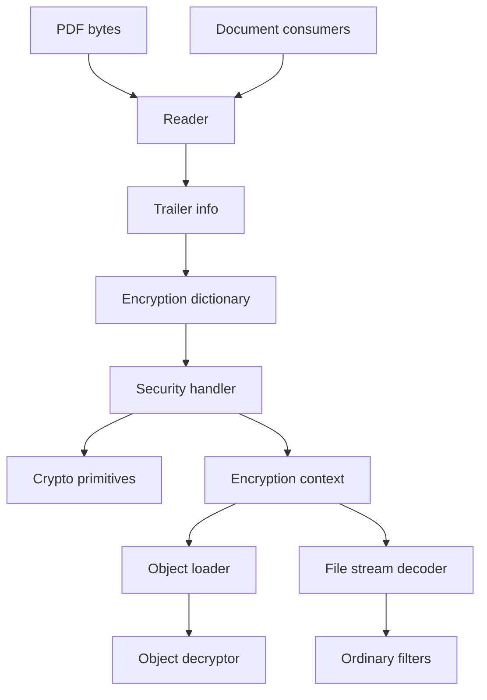
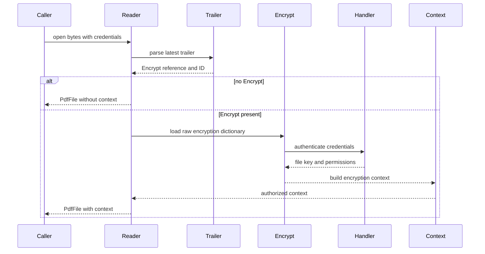
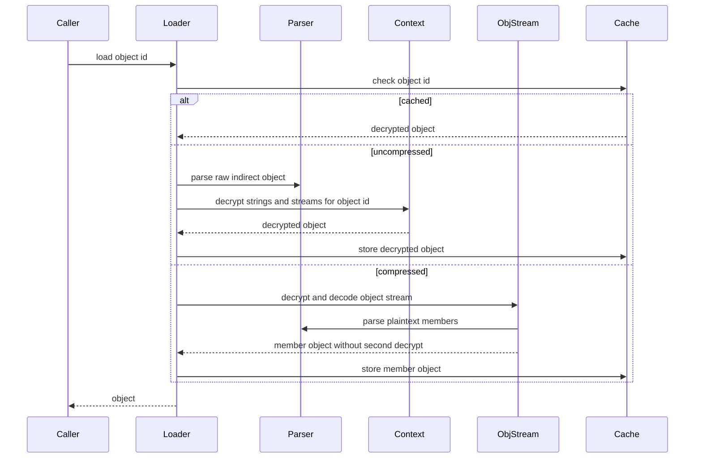
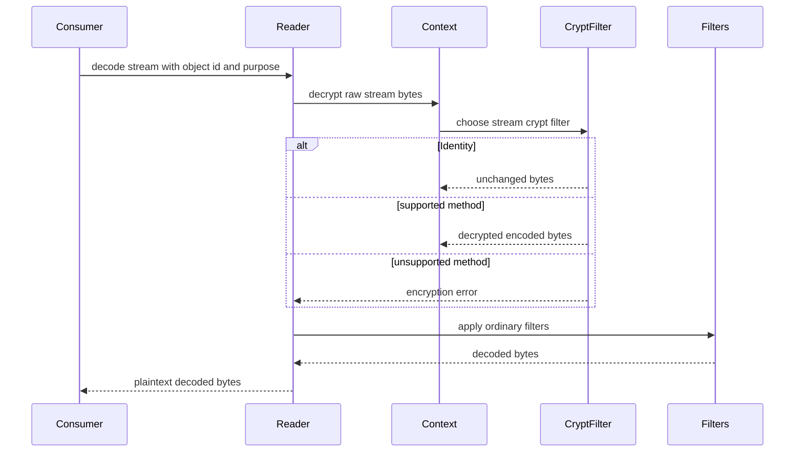
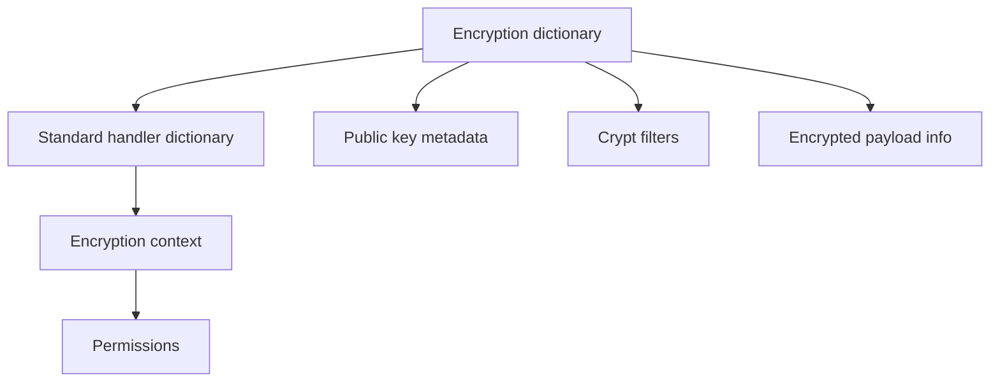
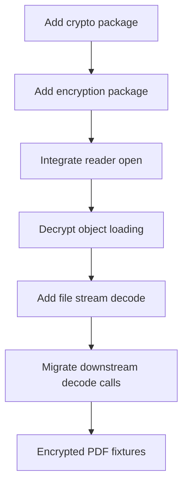

# Design Document

## Overview
This feature delivers ISO 32000-2:2020 section 7.6 encryption support for the MoonBit `trkbt10/pdf` reader. It detects encrypted documents from the trailer, authenticates standard password-based security handlers, derives file encryption keys, decrypts encrypted strings and streams with object context, and integrates crypt filters before ordinary stream filters.

Library implementers and downstream document, content, graphics, and interchange layers use this through `PdfFile` APIs. The feature changes the current reader from "encrypted structural data is rejected" to "encrypted standard-security documents can be opened with credentials and decoded through reader-owned helpers", while leaving PDF writing, rendering enforcement, and certificate stores outside this scope.

### Goals
- Parse common encryption dictionaries, standard security handler dictionaries, crypt filter dictionaries, public-key dictionary metadata, and encrypted payload dictionaries.
- Authenticate standard security handler documents for revisions 2, 3, 4, and 6, with PDF 2.0 revision 6 as the primary conformance path.
- Decrypt eligible strings and streams according to object id, generation number, stream purpose, crypt filter configuration, and documented exceptions.
- Provide file-aware stream decode APIs that decrypt before applying ordinary filters and that support Identity, V2, AESV2, and AESV3 crypt filters.
- Return typed, explicit errors for missing credentials, invalid credentials, unsupported security handlers, unsupported algorithms, malformed encryption dictionaries, and permission validation failures.

### Non-Goals
- PDF writing or creation of encrypted output files.
- Enforcement of viewer permissions in rendering or UI workflows; this spec parses and exposes permissions.
- CMS/X.509 private-key discovery, certificate stores, or public-key decryption.
- Whole-file encryption outside the PDF security model.
- General-purpose cryptographic library API or security hardening claims beyond PDF parser interoperability.
- Changing `PdfStream.data` from raw file bytes to decoded bytes.

## Boundary Commitments

### This Spec Owns
- The `src/encryption` package and all encryption-domain data models, errors, dictionary parsing, key derivation, password authentication, permission decoding, crypt filter selection, and object-context decryption.
- The `src/crypto` internal package with narrow primitives required by PDF encryption: RC4, MD5, SHA-256, SHA-384, SHA-512, AES block operations, AES-CBC, AES-ECB, PKCS 7 padding, no-padding mode checks, and byte-order helpers.
- Reader integration for encrypted document state, credential-based opening, decrypted object loading, decrypted stream decoding, encrypted object streams, and crypt-filtered stream overrides.
- Wrapper-document metadata parsing for encrypted payload file specifications.
- Typed diagnostics for unsupported public-key security handlers and unsupported custom crypt filters.

### Out of Boundary
- Ownership of PDF object syntax, lexer behavior, indirect-object envelope parsing, and raw `PdfStream` construction. Those remain in `objects`, `lexer`, and `parser`.
- Ownership of ordinary stream filters such as FlateDecode, LZWDecode, ASCII filters, and image filters. Those remain in `filters` and downstream graphics packages.
- Ownership of document rendering, UI permission enforcement, annotation editing, form filling, printing, or copying behavior.
- CMS, ASN.1, X.509, private key storage, certificate matching, and platform keychain integration.
- Adding external MoonBit packages, native crypto bindings, or target-specific runtime prerequisites.
- Decrypting strings inside the encryption dictionary, trailer `ID` values, or signature dictionary `Contents` hexadecimal strings.

### Allowed Dependencies
- MoonBit standard library only.
- `src/crypto` imports only MoonBit standard library packages.
- `src/encryption` may import `trkbt10/pdf/src/objects`, `trkbt10/pdf/src/common_data`, and `trkbt10/pdf/src/crypto`.
- `src/reader` may import `trkbt10/pdf/src/encryption` and keep existing imports of `objects`, `lexer`, `parser`, `filters`, `content`, `graphics`, and `interchange`.
- `src/filters` must not import `src/encryption` or `src/reader`; crypt filter orchestration stays in `reader` and `encryption`.
- Dependency direction: `crypto <- encryption <- reader`; `objects <- encryption`; `common_data <- encryption`; `filters <- reader`. No upstream package imports `reader`.
- Local normative sources under `spec/extracted/7.6-encryption.spec.txt` and approved requirements under `.kiro/specs/pdf-encryption/requirements.md`.

### Revalidation Triggers
- Any public shape change to `PdfObject`, `PdfName`, `PdfDictionary`, `PdfStream`, `ObjectId`, `IndirectObject`, `PdfParseError`, `TrailerInfo`, `PdfFileId`, or `PdfFile`.
- Any change to the raw-vs-decoded ownership of `PdfStream.data`.
- Any change to `@filters.decode_stream` ordering, supported filter names, or `Crypt` filter behavior.
- Any change to how `PdfFile::load_object` caches, resolves compressed objects, or parses object streams.
- Introducing external crypto dependencies, native bindings, CMS/X.509 support, or runtime key stores.
- Adding PDF writing, permission enforcement, or whole-file wrapper payload auto-opening.
- Changing password preprocessing semantics, crypt filter defaulting, or stream decryption order.

## Architecture

### Existing Architecture Analysis
The repository already has a layered parser and reader. `objects` stores byte-oriented PDF values, `parser` reads indirect objects and raw streams, `filters` decodes ordinary stream filters, and `reader` owns trailer parsing, xref resolution, lazy object loading, object streams, and structural stream decoding. `TrailerInfo` already exposes an optional `encrypt` object reference and file `ID` values.

The current `pdf-filters` design explicitly excludes encryption and treats `Crypt` as unsupported. Several downstream packages call `@filters.decode_stream` directly. This feature keeps parser and filter boundaries intact by adding `src/encryption` and routing encrypted object and stream access through `PdfFile` methods that have access to trailer state, credentials, object id, generation number, and stream purpose.

### Architecture Pattern & Boundary Map



**Architecture Integration**:
- Selected pattern: reader-owned encryption context with a dedicated encryption package and an internal crypto package.
- Domain boundaries: `encryption` decides whether and how bytes decrypt; `reader` decides when decryption is applied; `filters` still only decodes ordinary stream encodings.
- Existing patterns preserved: package-per-directory layout, standard-library-only implementation, typed `suberror` diagnostics, byte-stream parsing, lazy object resolution, white-box tests for private algorithms, and `moon info` public API review.
- New components rationale: encryption dictionaries, password algorithms, symmetric transforms, crypt filter routing, and reader integration each need separate tests and review boundaries.
- Steering compliance: parser layers remain independent, byte buffers stay authoritative, no external dependency is introduced, and each layer remains testable in isolation.

### Technology Stack

| Layer | Choice / Version | Role in Feature | Notes |
|-------|------------------|-----------------|-------|
| Language | MoonBit, project toolchain | Encryption models, crypto primitives, reader integration | Use explicit structs, `pub(all) enum` where external pattern matching is intended, and `suberror` diagnostics. |
| Object model | `trkbt10/pdf/src/objects` | Encryption dictionary values, string bytes, stream dictionaries, object ids | No parser state is added to `objects`. |
| Text support | `trkbt10/pdf/src/common_data` | PDFDocEncoding and UTF decoding support for password preprocessing | Revision 6 adds SASLprep-oriented preprocessing in `encryption`. |
| Crypto | New `trkbt10/pdf/src/crypto` | PDF-required digest, cipher, mode, and padding primitives | Internal support package; no broad public crypto API. |
| Encryption | New `trkbt10/pdf/src/encryption` | Security handlers, file keys, crypt filters, object decryption | Depends on `objects`, `common_data`, and `crypto`. |
| Reader | Existing `trkbt10/pdf/src/reader` | Open encrypted files, cache context, load decrypted objects, decode decrypted streams | `PdfFile::open` remains available for unencrypted files. |
| Filters | Existing `trkbt10/pdf/src/filters` | Ordinary stream filter decoding after decryption | `Crypt` orchestration does not move into `filters`. |

## File Structure Plan

### Directory Structure

```text
src/
├── crypto/
│   ├── moon.pkg                       # Standard-library-only package metadata
│   ├── error.mbt                      # PdfCryptoError for invalid keys, padding, and block sizes
│   ├── bytes.mbt                      # Little-endian, big-endian, xor, and fixed-length helpers
│   ├── md5.mbt                        # MD5 digest for revision 4 and earlier algorithms
│   ├── sha2.mbt                       # SHA-256, SHA-384, and SHA-512 digest helpers
│   ├── rc4.mbt                        # RC4 stream transform for deprecated V2 paths
│   ├── aes.mbt                        # AES block cipher key schedule and block decrypt encrypt
│   ├── aes_modes.mbt                  # AES-CBC and AES-ECB with padding mode selection
│   ├── padding.mbt                    # PKCS 7 add remove validation helpers
│   ├── md5_wbtest.mbt                 # RFC 1321 digest vectors
│   ├── sha2_wbtest.mbt                # SHA-2 digest vectors
│   ├── rc4_wbtest.mbt                 # RC4 known-answer vectors for PDF compatibility
│   ├── aes_wbtest.mbt                 # AES and mode vectors
│   └── padding_wbtest.mbt             # PKCS 7 and no-padding validation
├── encryption/
│   ├── moon.pkg                       # Imports objects, common_data, crypto
│   ├── error.mbt                      # PdfEncryptionError domain diagnostics
│   ├── types.mbt                      # Core enums, keys, permissions, credentials, contexts
│   ├── dictionary.mbt                 # Common encryption dictionary parser
│   ├── standard_dictionary.mbt        # Standard security handler entries and validation
│   ├── public_key_dictionary.mbt      # Public-key metadata parser and unsupported diagnostics
│   ├── crypt_filter.mbt               # CF, StmF, StrF, EFF, DecodeParms Name selection
│   ├── permissions.mbt                # Standard and public-key permission bit interpretation
│   ├── password.mbt                   # Revision-specific password preprocessing
│   ├── standard_r4.mbt                # Revision 2 3 4 algorithms, RC4 and AESV2 key derivation
│   ├── standard_r6.mbt                # Revision 6 authentication, Algorithm 2.B, Perms validation
│   ├── decrypt.mbt                    # String stream object decryption entry points
│   ├── object_transform.mbt           # Recursive string and stream decryption with exception rules
│   ├── wrapper_payload.mbt            # EncryptedPayload dictionary parsing
│   ├── dictionary_wbtest.mbt          # Dictionary field validation tests
│   ├── crypt_filter_wbtest.mbt        # Crypt filter defaults, Identity, and unsupported CFM tests
│   ├── standard_r4_wbtest.mbt         # Deprecated revision algorithm vectors
│   ├── standard_r6_wbtest.mbt         # Revision 6 authentication and permission vectors
│   ├── object_transform_wbtest.mbt    # Exception and double-decryption tests
│   └── wrapper_payload_wbtest.mbt     # Encrypted wrapper metadata tests
└── reader/
    ├── types.mbt                      # Add encryption context and encrypted object stream state
    ├── error.mbt                      # Wrap PdfEncryptionError
    ├── document.mbt                   # Add credential-aware open entry points and context setup
    ├── object_loader.mbt              # Decrypt indirect objects and encrypted object streams
    ├── stream_decode.mbt              # Decrypt streams before ordinary filters
    ├── page_content.mbt               # Use file-aware stream decoding for page Contents
    ├── xobjects.mbt                   # Preserve object id and stream context for XObjects
    ├── interchange_metadata.mbt       # Respect EncryptMetadata and Identity crypt filter cases
    ├── multimedia_common.mbt          # Preserve embedded file stream purpose for EFF
    ├── encryption_wbtest.mbt          # Reader-level encrypted PDF fixtures
    ├── object_loader_wbtest.mbt       # Add decrypted string stream object and object stream cases
    ├── stream_decode_wbtest.mbt       # Add encrypted Flate and Crypt filter ordering tests
    └── public_api_wbtest.mbt          # Add credential workflows and unencrypted compatibility
```

### Modified Files
- `src/reader/moon.pkg` - Add `trkbt10/pdf/src/encryption`.
- `src/reader/types.mbt` - Add `encryption : @encryption.EncryptionContext?`, encrypted object-stream bookkeeping, and credential-open options if not kept in a separate reader file.
- `src/reader/error.mbt` - Add `EncryptionError(@encryption.PdfEncryptionError)`.
- `src/reader/document.mbt` - Keep `PdfFile::open(input)` for unencrypted and empty-password documents; add credential-aware open and authorization methods.
- `src/reader/object_loader.mbt` - Decrypt loaded indirect objects after parsing and before cache insertion; avoid double-decrypting compressed object-stream members.
- `src/reader/stream_decode.mbt` - Replace xref encryption rejection with decrypt-before-filter logic for authorized standard-security contexts; keep unsupported errors for unsupported handlers.
- `src/reader/page_content.mbt`, `src/content/stream_input.mbt`, `src/interchange/metadata.mbt`, `src/graphics/icc_profile.mbt`, `src/graphics/pattern.mbt`, `src/graphics/shading_mesh.mbt`, `src/graphics/interpreter.mbt`, `src/graphics/image.mbt` - Migrate file-context paths to reader-aware stream decoding where encrypted documents can reach them; pure unit helpers may keep direct filter tests for already plaintext streams.
- `src/filters/error.mbt` and `src/filters/pipeline.mbt` - No ownership change; only revalidate if `Crypt` unsupported behavior or filter name normalization must be surfaced differently.
- `pkg.generated.mbti`, `src/crypto/pkg.generated.mbti`, `src/encryption/pkg.generated.mbti`, `src/reader/pkg.generated.mbti` - Generated or updated by `moon info`.

## System Flows

### Open Encrypted Document



`PdfFile::open(input)` remains compatible for unencrypted files. If `/Encrypt` exists and the default empty user password fails, the no-credential open path raises a typed credential error rather than silently returning encrypted bytes.

### Load Decrypted Object



The cache stores decrypted values for authorized files. The raw byte buffer remains unchanged.

### Decode Stream Bytes



Decryption always precedes ordinary filter decoding. A stream-level `Crypt` filter override is consumed by the encryption layer before the remaining ordinary filters are sent to `src/filters`.

## Requirements Traceability

| Requirement | Summary | Components | Interfaces | Flows |
|-------------|---------|------------|------------|-------|
| 0.1 | Encrypted PDF files protect contents from unauthorized access | EncryptionContext, ReaderEncryptionIntegration | `PdfFile::open_with_credentials`, `EncryptionCredentials` | Open Encrypted Document |
| 0.2 | Encryption dictionary, trailer detection, encrypted object scope, exclusions, V, CF, StmF, StrF, EFF | EncryptionDictionaryParser, CryptFilterRegistry, ObjectDecryptor | `parse_encryption_dictionary`, `decrypt_pdf_object`, `resolve_crypt_filter` | Open Encrypted Document, Load Decrypted Object, Decode Stream Bytes |
| 0.3 | Supported algorithms and AES padding rules | CryptoPrimitives, EncryptionAlgorithm | `PdfCipherMethod`, `decrypt_bytes` | Decode Stream Bytes |
| 0.4 | Deprecated Algorithm 1 object-key derivation for RC4 and AESV2 | StandardR4Handler, CryptoPrimitives | `derive_object_key_r4`, `decrypt_object_data_r4` | Load Decrypted Object, Decode Stream Bytes |
| 0.5 | Algorithm 1.A AES-256 direct file-key decryption and filter ordering | StandardR6Handler, StreamDecryptor | `decrypt_aesv3_data`, `decode_encrypted_stream` | Decode Stream Bytes |
| 0.6 | Standard security handler passwords, permissions, revisions, crypt filter limits, SASLprep | StandardSecurityHandler, PasswordPreprocessor, Permissions | `authenticate_standard`, `preprocess_password`, `permissions` | Open Encrypted Document |
| 0.7 | Standard encryption dictionary entries R, O, U, OE, UE, P, Perms, EncryptMetadata | StandardEncryptionDictionaryParser, Permissions | `parse_standard_dictionary`, `parse_standard_permissions` | Open Encrypted Document |
| 0.8 | File encryption key algorithm split by revision | StandardSecurityHandler | `authenticate_standard` | Open Encrypted Document |
| 0.9 | Revision 4 and earlier Algorithm 2 file key computation | StandardR4Handler, CryptoPrimitives | `compute_file_key_r4` | Open Encrypted Document |
| 0.10 | Revision 6 Algorithm 2.A file key retrieval and Perms check | StandardR6Handler, Permissions | `retrieve_file_key_r6`, `validate_perms_r6` | Open Encrypted Document |
| 0.11 | Revision 6 Algorithm 2.B iterative hash | StandardR6Handler, CryptoPrimitives | `algorithm_2b_hash` | Open Encrypted Document |
| 0.12 | Password algorithm output roles for O, U, OE, UE, Perms | StandardSecurityHandler | `StandardEncryptionDictionary`, `StandardAuthResult` | Open Encrypted Document |
| 0.13 | Algorithm 3 O-entry value for revision 4 and earlier | StandardR4Handler | `compute_owner_entry_r4` | Open Encrypted Document |
| 0.14 | Algorithm 4 U-entry value for revision 2 | StandardR4Handler | `compute_user_entry_r2` | Open Encrypted Document |
| 0.15 | Algorithm 5 U-entry value for revisions 3 and 4 | StandardR4Handler | `compute_user_entry_r34` | Open Encrypted Document |
| 0.16 | Algorithm 6 user password authentication for revision 4 and earlier | StandardR4Handler | `authenticate_user_r4` | Open Encrypted Document |
| 0.17 | Algorithm 7 owner password authentication for revision 4 and earlier | StandardR4Handler | `authenticate_owner_r4` | Open Encrypted Document |
| 0.18 | Algorithm 8 U and UE computation for revision 6 | StandardR6Handler | `compute_user_entries_r6` | Open Encrypted Document |
| 0.19 | Algorithm 9 O and OE computation for revision 6 | StandardR6Handler | `compute_owner_entries_r6` | Open Encrypted Document |
| 0.20 | Algorithm 10 Perms computation for revision 6 | StandardR6Handler, Permissions | `compute_perms_r6` | Open Encrypted Document |
| 0.21 | Algorithm 11 user password authentication for revision 6 | StandardR6Handler | `authenticate_user_r6` | Open Encrypted Document |
| 0.22 | Algorithm 12 owner password authentication for revision 6 | StandardR6Handler | `authenticate_owner_r6` | Open Encrypted Document |
| 0.23 | Algorithm 13 revision 6 permission validation | StandardR6Handler, Permissions | `validate_perms_r6` | Open Encrypted Document |
| 0.24 | Public-key handler model and recipient access | PublicKeyDictionaryParser, UnsupportedHandlerDiagnostics | `parse_public_key_dictionary` | Open Encrypted Document |
| 0.25 | Public-key dictionary fields, SubFilter values, recipient permissions | PublicKeyDictionaryParser, Permissions | `PublicKeyEncryptionDictionary`, `PublicKeyPermissions` | Open Encrypted Document |
| 0.26 | Public-key CMS algorithms and file-key derivation | PublicKeyDictionaryParser, UnsupportedHandlerDiagnostics | `UnsupportedSecurityHandler` | Open Encrypted Document |
| 0.27 | Crypt filters, Identity, CFM, AuthEvent, Length, Recipients, EncryptMetadata | CryptFilterRegistry, StreamDecryptor | `resolve_stream_crypt_filter`, `decode_crypt_filtered_stream` | Decode Stream Bytes |
| 0.28 | Unencrypted wrapper document and encrypted payload dictionary | EncryptedPayloadParser, ReaderWrapperMetadata | `parse_encrypted_payload_dictionary` | Open Encrypted Document |

## Components and Interfaces

| Component | Domain / Layer | Intent | Req Coverage | Key Dependencies | Contracts |
|-----------|----------------|--------|--------------|------------------|-----------|
| CryptoPrimitives | crypto | Provide narrow PDF-required digest, cipher, mode, and padding primitives | 0.3, 0.4, 0.5, 0.9, 0.10, 0.11, 0.13-0.23, 0.26 | MoonBit standard library P0 | Service |
| EncryptionDictionaryParser | encryption | Parse common encryption dictionary entries and choose handler metadata | 0.2, 0.7, 0.24, 0.25, 0.27 | objects P0 | Service, State |
| StandardSecurityHandler | encryption | Authenticate passwords and produce file keys and permissions | 0.6, 0.8-0.23 | CryptoPrimitives P0, PasswordPreprocessor P0 | Service |
| CryptFilterRegistry | encryption | Resolve default and stream-specific crypt filters | 0.2, 0.6, 0.27 | EncryptionDictionaryParser P0 | Service, State |
| ObjectDecryptor | encryption | Decrypt eligible strings and streams with object context and exception rules | 0.2, 0.4, 0.5, 0.27 | CryptFilterRegistry P0, CryptoPrimitives P0 | Service |
| PublicKeyDictionaryParser | encryption | Parse public-key handler metadata and return explicit unsupported decryption diagnostics | 0.24, 0.25, 0.26 | objects P0 | Service, State |
| EncryptedPayloadParser | encryption | Parse wrapper-document encrypted payload dictionaries | 0.28 | objects P0 | Service |
| ReaderEncryptionIntegration | reader | Build context from trailer and credentials; expose file-aware load and decode APIs | 0.1, 0.2, 0.5, 0.27, 0.28 | encryption P0, filters P0, parser P0 | Service, State |

### Crypto Layer

#### CryptoPrimitives

| Field | Detail |
|-------|--------|
| Intent | Provide deterministic, byte-oriented primitives needed by PDF encryption algorithms. |
| Requirements | 0.3, 0.4, 0.5, 0.9, 0.10, 0.11, 0.13, 0.14, 0.15, 0.18, 0.19, 0.20, 0.26 |

**Responsibilities & Constraints**
- Owns byte transforms only: no PDF dictionary parsing and no credential policy.
- Accepts explicit `Bytes` keys and data; rejects invalid key sizes, IV sizes, padding, and block lengths.
- Supports AES-CBC with PKCS 7 padding for string and stream data, AES-CBC without padding for OE and UE, AES-ECB without padding for Perms, RC4 for deprecated revisions, and SHA/MD5 digests for key derivation.
- Remains an implementation-support package; public APIs expose only what `encryption` needs.

**Dependencies**
- Inbound: `encryption` - PDF-specific algorithm use (P0).
- Outbound: MoonBit standard library - byte arrays and numeric operations (P0).
- External: FIPS 197, RFC 1321, RFC 8018 - vector and behavior references (P1).

**Contracts**: Service [x] / API [ ] / Event [ ] / Batch [ ] / State [ ]

##### Service Interface

```moonbit
pub fn md5_digest(input : Bytes) -> Bytes raise PdfCryptoError
pub fn sha256_digest(input : Bytes) -> Bytes raise PdfCryptoError
pub fn sha384_digest(input : Bytes) -> Bytes raise PdfCryptoError
pub fn sha512_digest(input : Bytes) -> Bytes raise PdfCryptoError
pub fn rc4_transform(key : Bytes, data : Bytes) -> Bytes raise PdfCryptoError
pub fn aes_cbc_decrypt(key : Bytes, iv : Bytes, data : Bytes, padding : PaddingMode) -> Bytes raise PdfCryptoError
pub fn aes_cbc_encrypt(key : Bytes, iv : Bytes, data : Bytes, padding : PaddingMode) -> Bytes raise PdfCryptoError
pub fn aes_ecb_decrypt_block(key : Bytes, data : Bytes) -> Bytes raise PdfCryptoError
```

- Preconditions: keys, IVs, and block lengths match the selected primitive.
- Postconditions: output length follows the selected mode and padding.
- Invariants: crypto APIs do not inspect PDF objects and do not cache document state.

**Implementation Notes**
- Validation: every primitive has independent known-answer vectors before encryption fixtures are enabled.
- Risks: crypto correctness is high-risk; implementation tasks must keep the package small and vector-driven.

### Encryption Layer

#### EncryptionDictionaryParser

| Field | Detail |
|-------|--------|
| Intent | Convert raw PDF encryption dictionaries into typed security handler configuration. |
| Requirements | 0.2, 0.7, 0.24, 0.25, 0.27 |

**Responsibilities & Constraints**
- Parses `Filter`, optional `SubFilter`, `V`, `Length`, `CF`, `StmF`, `StrF`, and `EFF`.
- Dispatches `/Standard` dictionaries to `StandardSecurityHandler` metadata.
- Parses public-key handler fields enough to report accurate unsupported diagnostics and permissions metadata.
- Validates direct-object requirements for encryption dictionary strings where required.

**Dependencies**
- Inbound: `reader` - loads raw encryption dictionary (P0).
- Outbound: `objects` - PDF names, dictionaries, strings, arrays, integers, booleans (P0).
- Outbound: `CryptFilterRegistry` - typed crypt filter map construction (P0).

**Contracts**: Service [x] / API [ ] / Event [ ] / Batch [ ] / State [x]

##### Service Interface

```moonbit
pub fn parse_encryption_dictionary(
  dict : @objects.PdfDictionary,
  file_id : FileIdentifier?,
) -> EncryptionDictionary raise PdfEncryptionError
```

- Preconditions: `dict` is the resolved value of trailer `/Encrypt`.
- Postconditions: required handler fields are present and typed, or a field-specific error is raised.
- Invariants: absence of trailer `/Encrypt` is handled by `reader`, not by this parser.

#### StandardSecurityHandler

| Field | Detail |
|-------|--------|
| Intent | Authenticate standard password credentials and derive the file encryption key. |
| Requirements | 0.6, 0.8, 0.9, 0.10, 0.11, 0.12, 0.13, 0.14, 0.15, 0.16, 0.17, 0.18, 0.19, 0.20, 0.21, 0.22, 0.23 |

**Responsibilities & Constraints**
- Supports revisions 2, 3, 4, and 6 for reading encrypted documents.
- Applies revision 4 and earlier padding, PDFDocEncoding-compatible byte handling, MD5 iteration, RC4 loops, and object-key derivation.
- Applies revision 6 SASLprep preprocessing, UTF-8 truncation to 127 bytes, Algorithm 2.B, AES-256 OE/UE decryption, and Perms validation.
- Exposes owner vs user access mode and parsed permission flags.

**Dependencies**
- Inbound: `ReaderEncryptionIntegration` - credential authentication (P0).
- Outbound: `CryptoPrimitives` - digest and cipher operations (P0).
- Outbound: `PasswordPreprocessor` - revision-specific password bytes (P0).
- Outbound: `Permissions` - permission flag interpretation and validation (P0).

**Contracts**: Service [x] / API [ ] / Event [ ] / Batch [ ] / State [x]

##### Service Interface

```moonbit
pub fn authenticate_standard(
  dictionary : StandardEncryptionDictionary,
  credentials : EncryptionCredentials,
  file_id : Bytes?,
) -> StandardAuthResult raise PdfEncryptionError
```

- Preconditions: dictionary fields have already been type-checked.
- Postconditions: returns file key, access mode, permissions, revision, V value, and crypt filter configuration on success.
- Invariants: invalid credentials never expose a partial file key.

#### CryptFilterRegistry

| Field | Detail |
|-------|--------|
| Intent | Resolve default and stream-specific crypt filters into decryption methods. |
| Requirements | 0.2, 0.6, 0.27 |

**Responsibilities & Constraints**
- Owns standard `Identity` semantics.
- Resolves `StmF`, `StrF`, and `EFF` defaults and stream-level `Crypt` filter `DecodeParms` names.
- Supports `V2`, `AESV2`, and `AESV3` where the authenticated handler provides compatible file keys.
- Reports unsupported `None`, custom handler-owned methods, unknown CFM values, and authorization failures explicitly.

**Dependencies**
- Inbound: `ObjectDecryptor`, `ReaderStreamDecoder` - filter lookup (P0).
- Outbound: `EncryptionDictionaryParser` - typed crypt filter definitions (P0).
- Outbound: `CryptoPrimitives` - selected byte transform execution (P0).

**Contracts**: Service [x] / API [ ] / Event [ ] / Batch [ ] / State [x]

##### Service Interface

```moonbit
pub fn resolve_string_filter(context : EncryptionContext) -> CryptFilter raise PdfEncryptionError
pub fn resolve_stream_filter(
  context : EncryptionContext,
  dict : @objects.PdfDictionary,
  purpose : StreamDecryptPurpose,
) -> CryptFilter raise PdfEncryptionError
pub fn strip_consumed_crypt_filter(dict : @objects.PdfDictionary) -> @objects.PdfDictionary raise PdfEncryptionError
```

- Preconditions: context is authorized or explicitly unencrypted.
- Postconditions: returns a concrete filter or an unsupported/unauthorized error.
- Invariants: ordinary filters that remain after a `Crypt` override preserve their original order.

#### ObjectDecryptor

| Field | Detail |
|-------|--------|
| Intent | Recursively decrypt strings and streams while preserving ISO exceptions. |
| Requirements | 0.2, 0.4, 0.5, 0.27 |

**Responsibilities & Constraints**
- Decrypts `PdfObject::String` values using the containing indirect object id unless the current path is exempt.
- Decrypts `PdfObject::Stream.data` before ordinary filters but leaves the stream dictionary structure intact.
- Exempts trailer `ID`, encryption dictionary strings, signature dictionary `Contents` hexadecimal strings, and strings inside encrypted streams or object streams that have already been decrypted as enclosing stream bytes.
- Does not decrypt integers, booleans, names, arrays as containers, dictionaries as containers, references, or null values.

**Dependencies**
- Inbound: `ReaderEncryptionIntegration` - object load path (P0).
- Outbound: `CryptFilterRegistry` - string and stream filter selection (P0).
- Outbound: `CryptoPrimitives` - byte transforms (P0).

**Contracts**: Service [x] / API [ ] / Event [ ] / Batch [ ] / State [ ]

##### Service Interface

```moonbit
pub fn decrypt_pdf_object(
  context : EncryptionContext,
  object_id : @objects.ObjectId,
  object : @objects.PdfObject,
  scope : ObjectDecryptScope,
) -> @objects.PdfObject raise PdfEncryptionError

pub fn decrypt_stream_bytes(
  context : EncryptionContext,
  object_id : @objects.ObjectId,
  stream : @objects.PdfStream,
  purpose : StreamDecryptPurpose,
) -> DecryptedStream raise PdfEncryptionError
```

- Preconditions: `object_id` is the containing indirect object id.
- Postconditions: encrypted bytes are replaced by plaintext bytes for supported handlers.
- Invariants: exempt paths are never decrypted; object stream members are not decrypted twice.

#### PublicKeyDictionaryParser

| Field | Detail |
|-------|--------|
| Intent | Represent public-key encryption metadata and fail decryption with precise unsupported errors. |
| Requirements | 0.24, 0.25, 0.26 |

**Responsibilities & Constraints**
- Parses `SubFilter` values `adbe.pkcs7.s3`, `adbe.pkcs7.s4`, and `adbe.pkcs7.s5`.
- Parses `Recipients` placement in the encryption dictionary or crypt filter dictionary.
- Parses public-key permission flags.
- Returns `UnsupportedSecurityHandler` when decryption would require CMS or private-key operations.

**Dependencies**
- Inbound: `EncryptionDictionaryParser` - public-key dispatch (P0).
- Outbound: `objects` - dictionary and byte string parsing (P0).

**Contracts**: Service [x] / API [ ] / Event [ ] / Batch [ ] / State [x]

##### Service Interface

```moonbit
pub fn parse_public_key_dictionary(
  dict : @objects.PdfDictionary,
) -> PublicKeyEncryptionDictionary raise PdfEncryptionError
```

- Preconditions: `Filter` is not `/Standard` or `SubFilter` is a public-key value.
- Postconditions: public-key metadata is available for diagnostics.
- Invariants: no CMS object is decrypted in this phase.

#### EncryptedPayloadParser

| Field | Detail |
|-------|--------|
| Intent | Parse encrypted payload dictionaries in unencrypted wrapper documents. |
| Requirements | 0.28 |

**Responsibilities & Constraints**
- Validates `Type /EncryptedPayload` when present.
- Requires `Subtype` and parses optional `Version`.
- Leaves collection, associated-file array, and embedded-file name-tree ownership in existing reader/document packages while providing the payload dictionary parser.

**Dependencies**
- Inbound: `reader` file-specification and wrapper validation paths (P1).
- Outbound: `objects` - dictionary names and strings (P0).

**Contracts**: Service [x] / API [ ] / Event [ ] / Batch [ ] / State [ ]

##### Service Interface

```moonbit
pub fn parse_encrypted_payload_dictionary(
  dict : @objects.PdfDictionary,
) -> EncryptedPayloadInfo raise PdfEncryptionError
```

- Preconditions: caller has found a file specification dictionary `EP` entry.
- Postconditions: returns cryptographic filter subtype and optional version.
- Invariants: parsing wrapper metadata does not auto-open the embedded encrypted PDF.

### Reader Layer

#### ReaderEncryptionIntegration

| Field | Detail |
|-------|--------|
| Intent | Attach encryption context to `PdfFile` and provide safe object and stream access. |
| Requirements | 0.1, 0.2, 0.5, 0.27, 0.28 |

**Responsibilities & Constraints**
- Resolves the trailer `/Encrypt` reference without decrypting the encryption dictionary.
- Attempts the empty user password for no-credential open, then raises `MissingCredentials` if authentication fails.
- Adds credential-aware open APIs while preserving unencrypted `PdfFile::open(input)`.
- Stores decrypted object cache entries only after object-context transformation.
- Provides stream decode helpers that decrypt raw stream bytes, remove consumed `Crypt` filter entries, and then call `@filters.decode_stream_bytes`.

**Dependencies**
- Inbound: downstream document consumers - open/load/decode APIs (P0).
- Outbound: `encryption` - context building and byte decryption (P0).
- Outbound: `filters` - ordinary filter decoding after decryption (P0).
- Outbound: `parser` - raw indirect-object parsing (P0).

**Contracts**: Service [x] / API [x] / Event [ ] / Batch [ ] / State [x]

##### Service Interface

```moonbit
pub fn PdfFile::open(input : Bytes) -> PdfFile raise PdfReaderError
pub fn PdfFile::open_with_credentials(
  input : Bytes,
  credentials : @encryption.EncryptionCredentials,
) -> PdfFile raise PdfReaderError
pub fn PdfFile::encryption_status(self : PdfFile) -> @encryption.EncryptionStatus
pub fn PdfFile::permissions(self : PdfFile) -> @encryption.DocumentPermissions?
pub fn PdfFile::decode_stream(
  self : PdfFile,
  object_id : @objects.ObjectId,
  stream : @objects.PdfStream,
  purpose : @encryption.StreamDecryptPurpose,
) -> Bytes raise PdfReaderError
```

- Preconditions: encrypted files require successful context setup before protected object access.
- Postconditions: public object loads return decrypted `PdfObject` values when supported and authorized.
- Invariants: `PdfStream.data` in parser output remains raw; decoded stream bytes are returned by explicit decode APIs.

##### API Contract

| Method | Input | Response | Errors |
|--------|-------|----------|--------|
| `PdfFile::open` | file bytes | unencrypted file or encrypted file authenticated with empty user password | `MissingCredentials`, `InvalidCredentials`, malformed encryption dictionary, unsupported handler |
| `PdfFile::open_with_credentials` | file bytes and credentials | authorized `PdfFile` | invalid credentials, unsupported handler, malformed dictionary |
| `PdfFile::load_object` | object id | decrypted object or null for absent object | parse, invalid object location, encryption errors |
| `PdfFile::decode_stream` | object id, raw stream, purpose | decrypted and decoded bytes | crypt filter, crypto, ordinary filter, permission or authorization errors |

## Data Models

### Domain Model
- `EncryptionDictionary` is the aggregate root for encryption configuration. It includes common dictionary entries, handler kind, V value, key length, crypt filters, default string and stream filters, embedded-file filter, and handler-specific payload.
- `StandardEncryptionDictionary` owns standard handler entries: R, O, U, OE, UE, P, Perms, EncryptMetadata.
- `EncryptionContext` is the authenticated runtime state: handler kind, file encryption key, permissions, access mode, crypt filter registry, metadata encryption flag, and object-stream decryption tracking.
- `FileIdentifier` is an encryption-layer value object copied from trailer `ID` bytes so `src/encryption` does not import `src/reader`.
- `CryptFilter` is a value object: name, CFM, AuthEvent, length, optional recipients, and metadata encryption flag.
- `DocumentPermissions` is a decoded permission set, not an enforcement engine.
- `EncryptionCredentials` is a caller-provided password container.
- `EncryptedPayloadInfo` models wrapper payload dictionaries.



### Logical Data Model

**Structure Definition**:
- `EncryptionDictionary.handler` is one of `Standard`, `PublicKey`, or `Unsupported`.
- `StandardEncryptionDictionary.revision` maps to R values 2, 3, 4, or 6; R 5 is rejected as deprecated proprietary use.
- `CipherVersion` maps V values 1, 2, 3, 4, and 5; V 0 and unknown values are errors.
- `CryptFilterMethod` maps `Identity`, `None`, `V2`, `AESV2`, `AESV3`, and `Unsupported(name)`.
- `StreamDecryptPurpose` distinguishes regular streams, xref streams, object streams, metadata streams, embedded file streams, and stream-level Crypt overrides.

**Consistency & Integrity**:
- V, R, Length, CFM, and key length must agree before decryption starts.
- Revision 6 `Perms` validation must pass before returning an authorized context.
- A crypt filter referenced by `StmF`, `StrF`, `EFF`, or stream `DecodeParms` must exist in `CF` unless it is a standard name.
- Object stream members inherit the decryption state of the containing object stream and are not individually decrypted again.

### Data Contracts & Integration

**API Data Transfer**
- Credentials are passed as `EncryptionCredentials`, not as global state.
- Decrypted stream bytes are returned as `Bytes`; raw streams are not mutated.
- Permission information is exposed as a typed value with raw permission bits retained for audit and compatibility.

**Cross-Package Data Management**
- `reader` owns the only mutable encryption context attached to `PdfFile`.
- `encryption` returns pure values or transformed bytes and does not resolve indirect references.
- `filters` receives a dictionary with consumed `Crypt` filter entries removed or normalized by `reader`.

## Error Handling

### Error Strategy
Encryption failures are explicit and typed. `src/encryption` raises `PdfEncryptionError`; `src/crypto` raises `PdfCryptoError`; `src/reader` wraps encryption failures in `PdfReaderError::EncryptionError`. The implementation never falls back to returning encrypted bytes as if they were plaintext.

### Error Categories and Responses
- Credential errors: missing password, invalid user password, invalid owner password, or unsupported empty-password open.
- Dictionary errors: missing required keys, wrong object types, unsupported V/R/CFM/SubFilter values, invalid Length, invalid direct-object requirements.
- Algorithm errors: invalid key length, invalid IV length, malformed padding, invalid AES block length, invalid Perms marker, permission mismatch.
- Scope errors: encrypted object requested without authorization, unsupported public-key handler, unsupported custom crypt filter, encrypted external handler stream.
- Integration errors: ordinary filter decode failure after decryption, object stream double-decryption guard failure, encrypted xref stream failure.

### Monitoring
The library has no runtime logging subsystem. Observability is through precise error variants, object ids, filter names, handler names, and offsets where the reader can supply them.

## Testing Strategy

### Unit Tests
- `src/crypto/*_wbtest.mbt`: validate MD5, SHA-2, RC4, AES block modes, PKCS 7 padding, and byte-order helpers with independent vectors for 0.3, 0.4, 0.5, 0.9, 0.10, and 0.11.
- `src/encryption/standard_r4_wbtest.mbt`: verify Algorithms 2 through 7, object-key derivation, RC4 iteration order, AESV2 salt handling, and deprecated revision compatibility for 0.9, 0.13, 0.14, 0.15, 0.16, and 0.17.
- `src/encryption/standard_r6_wbtest.mbt`: verify Algorithms 2.A, 2.B, 8 through 13, SASLprep preprocessing, OE/UE decryption, and Perms validation for 0.10, 0.11, 0.18, 0.19, 0.20, 0.21, 0.22, and 0.23.
- `src/encryption/crypt_filter_wbtest.mbt`: verify `Identity`, `StmF`, `StrF`, `EFF`, stream `Crypt` overrides, AuthEvent defaults, invalid CFM, and Length validation for 0.2 and 0.27.
- `src/encryption/object_transform_wbtest.mbt`: verify string and stream decryption exceptions for trailer ID, encryption dictionary strings, signature Contents, object streams, external file streams, and embedded file streams for 0.2.

### Integration Tests
- `src/reader/encryption_wbtest.mbt`: open unencrypted files, encrypted empty-password files, encrypted user-password files, encrypted owner-password files, invalid-password files, and unsupported public-key files for 0.1, 0.6, and 0.24 through 0.26.
- `src/reader/object_loader_wbtest.mbt`: load encrypted strings, encrypted streams, encrypted object streams, and compressed object members without double-decryption for 0.2, 0.4, and 0.5.
- `src/reader/stream_decode_wbtest.mbt`: verify decrypt-before-Flate ordering, AESV3 CBC IV extraction, PKCS padding removal, and stream-level `Crypt` filter dictionary handling for 0.5 and 0.27.
- `src/reader/page_content_wbtest.mbt` and graphics/interchange affected tests: verify document consumers use file-aware stream decoding for page contents, metadata, form XObjects, patterns, shadings, ICC profiles, and images.
- `src/reader/wrapper_payload_wbtest.mbt`: verify encrypted payload dictionary parsing and wrapper diagnostics for 0.28.

### E2E Tests
- Add small synthetic encrypted PDF fixtures for revision 4 AESV2, revision 6 AESV3, encrypted Flate content streams, Identity metadata streams, and encrypted object streams.
- Exercise `PdfFile::open_with_credentials`, `load_object`, `PdfPage::content_stream`, metadata access, and a graphics path that invokes a form XObject from encrypted content.
- Verify invalid credentials fail before protected content is exposed.

### Performance and Load
- Validate decryption cost is linear in stream size for RC4 and AES-CBC paths.
- Verify Algorithm 2.B loop bounds and memory allocation do not scale beyond password and U/O entry sizes.
- Verify object cache stores decrypted objects once and does not repeatedly decrypt the same object.
- Verify large encrypted streams are transformed in bounded chunks where practical without changing public `Bytes` contracts.

## Security Considerations

- This feature handles passwords, file encryption keys, and decrypted document bytes. The design keeps these in `EncryptionContext` and avoids exposing intermediate keys through public APIs.
- Revision 6 password preprocessing must implement SASLprep requirements before UTF-8 truncation. If the implementation cannot fully validate a Unicode profile case, it must return an explicit preprocessing error rather than silently using a different password byte sequence.
- Permission bits are parsed and exposed. Enforcement remains out of scope because this library has no UI or editing subsystem.
- Deprecated RC4, MD5, R 2 through 4, V 1 through 4, and AESV2 paths are supported for reading existing PDFs but reported as deprecated metadata where exposed.
- Public-key security handlers are not decrypted in this phase. Returning unsupported diagnostics is safer than partial CMS parsing without private-key validation.

## Performance & Scalability

- Object decryption occurs during lazy object loading and is cached with the object value.
- Stream decryption is performed before ordinary filter decoding and should avoid extra copies where MoonBit `Bytes` slicing allows it, especially for IV extraction.
- Algorithm 2.B uses bounded iteration control from the standard and operates on password/key-sized data; tests must guard against accidental unbounded growth.
- Structural streams remain decoded on demand, preserving the existing reader behavior for xref streams and object streams.

## Migration Strategy



- Phase 1: add crypto primitives and vector tests without reader integration.
- Phase 2: add encryption dictionary parsing, standard handler authentication, and crypt filter selection.
- Phase 3: attach encryption context to `PdfFile` and decrypt object loading.
- Phase 4: add file-aware stream decode and migrate downstream direct filter calls.
- Phase 5: add encrypted fixture coverage and wrapper/public-key unsupported diagnostics.

Rollback is file-local by phase: reader integration should not merge until crypto and encryption package tests pass independently.

## Supporting References
- `research.md` records discovery details and build-vs-adopt rationale.
- `spec/extracted/7.6-encryption.spec.txt` is the local normative excerpt for encryption behavior.
- `.kiro/specs/pdf-filters/design.md` defines ordinary filter ownership and the prior `Crypt` non-goal.
