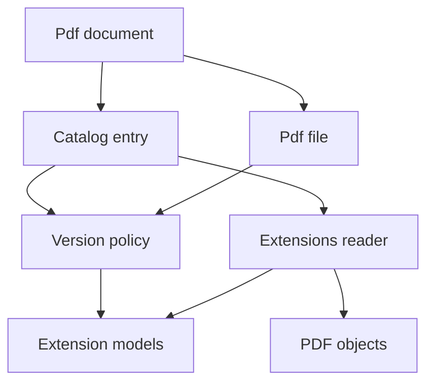
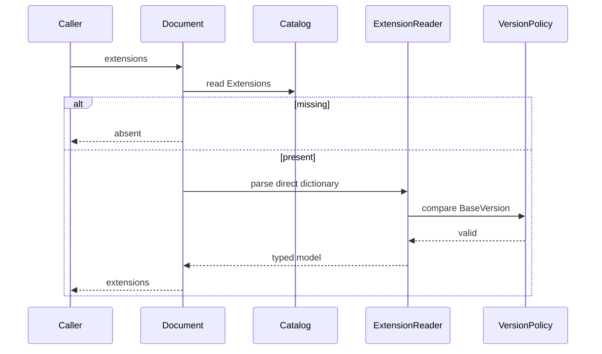
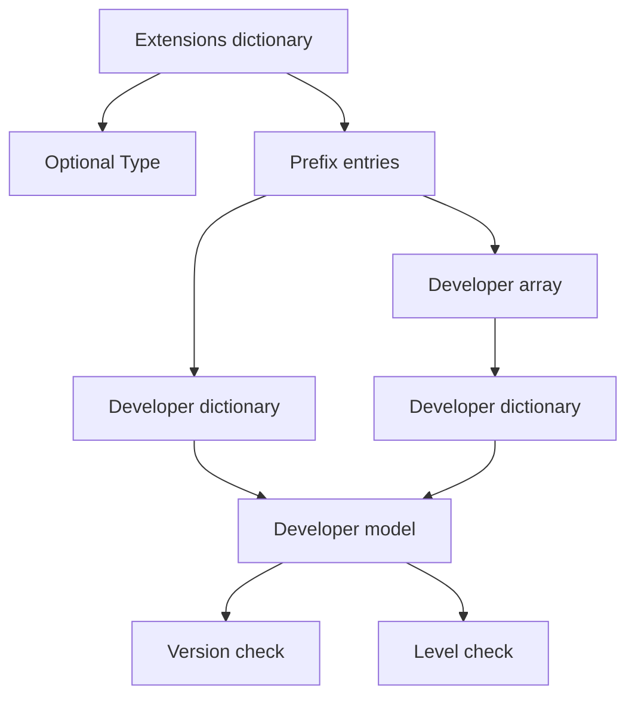

# Design Document

## Overview

This feature delivers typed read access to the ISO 32000-2:2020 clause 7.12 Catalog `Extensions` dictionary for the MoonBit `trkbt10/pdf` parser library. It lets library users inspect developer extension prefixes, base versions, extension levels, documentation URLs, and revision strings while preserving the raw PDF dictionaries for forward compatibility.

The feature extends the existing `src/reader` document facade because `/Extensions` is a Catalog entry and validation depends on both the file header version and the optional Catalog `Version` entry. It does not validate live PDF Registry membership, execute extension behavior, load external documentation URLs, or change low-level PDF object parsing.

### Goals
- Expose an optional `PdfDocument::extensions` accessor for the Catalog `Extensions` dictionary.
- Validate `Extensions` and developer extension dictionaries as direct objects with the required typed entries.
- Support both single developer dictionaries and PDF 2.0 arrays of developer dictionaries under the same prefix.
- Parse and compare `BaseVersion` names as integer `PdfVersion` pairs against the file header and optional Catalog `Version`.
- Preserve exact prefix names, URL bytes, revision bytes, and raw dictionaries for caller-specific extension policy.

### Non-Goals
- PDF writing, mutation, or generation of extension dictionaries.
- Runtime execution or semantic interpretation of developer-defined extensions.
- Network access, URL dereferencing, or validation that a URL is reachable.
- Built-in PDF Registry synchronization or proof that a prefix is registered.
- Changes to `PdfObject`, `PdfName`, object parsing, xref merging, stream decoding, page traversal, or Catalog loading.

## Boundary Commitments

### This Spec Owns
- Reader-layer public models for Catalog `Extensions`, prefix groups, and developer extension dictionaries.
- Public `PdfDocument::extensions` access that returns absence when `/Extensions` is missing and raises a reader document error when a present dictionary is malformed.
- Direct-object validation for the `Extensions` dictionary, prefix values, developer extension dictionaries, and known developer dictionary entries.
- Validation of optional `Type` values: `/Extensions` for the outer dictionary and `/DeveloperExtensions` for developer dictionaries when present.
- Required `BaseVersion` name parsing, required `ExtensionLevel` integer parsing, and monotonic-level validation for multiple entries with the same prefix and base version in array form.
- Optional PDF 2.0 `URL` and `ExtensionRevision` parsing as byte-preserving strings.
- Version comparison against `PdfFile::version` and optional Catalog `Version`.

### Out of Boundary
- Low-level PDF syntax parsing, dictionary construction, duplicate-key handling, indirect-object parsing, xref lookup, object streams, and stream filters.
- Registry membership validation for prefix names beyond preserving exact non-`Type` Catalog dictionary keys.
- Interpretation of developer extension behavior, feature flags, custom objects, custom operators, or custom validation rules introduced by an extension.
- Fetching, normalizing, validating, or caching URL targets.
- Public root-package re-exports or CLI behavior.

### Allowed Dependencies
- MoonBit standard library only.
- Existing local package direction remains unchanged: `src/reader` may use existing imports, and no upstream package imports `src/reader`.
- Existing `PdfDocument`, `PdfCatalog`, `PdfFile::version`, `PdfCatalog::entry`, `PdfObject`, `PdfDictionary`, `PdfName`, `PdfVersion`, `ObjectId`, and `PdfDocumentError` contracts.
- Local extracted source text under `spec/extracted/7.12-extensions.spec.txt` and the approved requirements in `.kiro/specs/pdf-extensions/requirements.md`.

### Revalidation Triggers
- Any public shape change to `PdfDocument`, `PdfCatalog`, `PdfFile`, `PdfFile::version`, `PdfCatalog::entry`, `PdfObject`, `PdfDictionary`, `PdfName`, `PdfVersion`, `ObjectId`, or `PdfDocumentError`.
- Any change to Catalog `Version` handling or header version parsing.
- Any package dependency direction change or addition of a non-standard dependency.
- Any decision to enforce PDF Registry prefix membership inside the library.
- Any future feature that consumes developer extension entries to alter parser behavior.
- Any change to direct-object semantics, missing Catalog entry behavior, or `PdfObject::Ref` representation.

## Architecture

### Existing Architecture Analysis

The repository already has a `src/reader` document facade that opens a `PdfFile`, resolves the trailer Root Catalog, validates `/Type /Catalog`, and exposes raw Catalog entries through `PdfCatalog::entry`. `PdfFile::version` exposes the header version as `PdfVersion`, and Catalog optional entries can be read without changing lower-level packages.

Extensions are document-level metadata. They require Catalog access and version context but do not require page traversal, stream decoding, filters, content interpretation, graphics, or external services. The design therefore follows the existing reader-layer pattern used for Catalog metadata: focused public model types, a `PdfDocument` accessor, package-private parser helpers, raw dictionary retention, and white-box tests.

### Architecture Pattern & Boundary Map



**Architecture Integration**:
- Selected pattern: reader-layer Catalog metadata extension with local direct-object validation.
- Domain boundaries: `reader` owns Catalog extension interpretation; `objects` owns raw value representation; callers own registry and extension behavior policy.
- Existing patterns preserved: standard-library-only implementation, package-local files, `pub(all)` inspectable models, raised `PdfDocumentError`, `///|` block boundaries, and `moon info` API review.
- New components rationale: extension parsing has a strict direct-object rule that conflicts with generic reader reference-resolution helpers, so it needs a dedicated parser.
- Steering compliance: the design remains read-only, byte-oriented, lazy, and free of external dependencies.

### Technology Stack

| Layer | Choice / Version | Role in Feature | Notes |
|-------|------------------|-----------------|-------|
| Language | MoonBit project toolchain | Typed reader models and parser helpers | Use explicit structs, enums, raised errors, and package-local tests. |
| PDF object model | `trkbt10/pdf/src/objects` | Names, dictionaries, arrays, strings, integers, refs, nulls | No object-model changes. |
| Document access | `trkbt10/pdf/src/reader` | Catalog access, file version, reader errors | Primary implementation package. |
| Data structures | MoonBit standard `Array`, `Map`, `Bytes` | Prefix groups, raw dictionaries, lookup helpers | No external storage. |
| Validation | `moon check`, `moon test`, `moon fmt`, `moon info` | Type checking, tests, formatting, API review | `moon info` must show intended reader API additions only. |

## File Structure Plan

### Directory Structure

```text
src/
├── reader/
│   ├── extensions_types.mbt          # Public PdfExtensions, prefix group, and developer extension models
│   ├── extensions.mbt                # PdfDocument::extensions and package-private parser helpers
│   ├── extensions_wbtest.mbt         # Valid examples, malformed directness, version, array, and optional-entry tests
│   ├── catalog.mbt                   # Optional helper for Catalog Version or Extensions entry if needed
│   ├── document_error.mbt            # Add InvalidExtension diagnostic
│   ├── document_types.mbt            # No planned change unless models are consolidated here by project style
│   └── pkg.generated.mbti            # Regenerate after public API additions
└── objects/
    └── no planned changes            # Revalidate if PdfObject, PdfName, PdfDictionary, or Ref changes
```

### Modified Files
- `src/reader/document_error.mbt` - Add `InvalidExtension(@objects.ObjectId?, @objects.PdfName?, String)` or an equivalent extension-specific diagnostic that can identify the Catalog object and relevant prefix/key.
- `src/reader/catalog.mbt` - Add `PdfCatalog::extensions_entry` and `PdfCatalog::version_entry` only if implementation benefits from named helpers; `PdfCatalog::entry` is already sufficient.
- `src/reader/pkg.generated.mbti` - Regenerate with `moon info` after adding public extension models and accessors.
- `src/reader/moon.pkg` - No planned dependency change.

### Component to File Mapping

| Component | Primary Files |
|-----------|---------------|
| ExtensionAccess | `src/reader/extensions.mbt`, `src/reader/extensions_wbtest.mbt` |
| ExtensionModel | `src/reader/extensions_types.mbt`, `src/reader/pkg.generated.mbti` |
| ExtensionDirectValidator | `src/reader/extensions.mbt`, `src/reader/extensions_wbtest.mbt` |
| ExtensionVersionPolicy | `src/reader/extensions.mbt`, `src/reader/extensions_wbtest.mbt` |
| ExtensionDiagnostics | `src/reader/document_error.mbt`, `src/reader/extensions_wbtest.mbt` |
| CatalogExtensionHelpers | `src/reader/catalog.mbt`, `src/reader/extensions.mbt` |

## System Flows

### Catalog Extensions Access



Missing `/Extensions` is not an error. A present non-dictionary, indirect dictionary, malformed developer dictionary, or invalid version raises `InvalidExtension`.

### Developer Prefix Parsing



The `Type` key is structural metadata. Every other key is preserved as a developer prefix name and mapped to one or more developer extension dictionaries.

## Requirements Traceability

| Requirement | Summary | Components | Interfaces | Flows |
|-------------|---------|------------|------------|-------|
| 0.1 | Catalog may contain direct `Extensions` dictionary with prefix keys and direct developer dictionaries. | ExtensionAccess, ExtensionDirectValidator, ExtensionModel | `PdfDocument::extensions`, `PdfExtensions`, `PdfExtensionPrefixEntry` | Catalog Extensions Access, Developer Prefix Parsing |
| 0.2 | `Extensions` dictionary optional `Type` and prefix dictionary or array values. | ExtensionAccess, ExtensionDirectValidator | `parse_extensions_dictionary`, prefix group model | Developer Prefix Parsing |
| 0.3 | Developer dictionary `Type`, `BaseVersion`, `ExtensionLevel`, `URL`, and `ExtensionRevision` entries. | ExtensionModel, ExtensionDirectValidator | `PdfDeveloperExtension` | Developer Prefix Parsing |
| 0.4 | `BaseVersion` syntax and comparison against header and Catalog version. | ExtensionVersionPolicy | `parse_extension_version_name`, `compare_pdf_versions` | Catalog Extensions Access |
| 0.5 | `ExtensionLevel` integer semantics and monotonic ordering per BaseVersion. | ExtensionAccess, ExtensionVersionPolicy | level validation in array form | Developer Prefix Parsing |
| 0.6 | Optional `URL` string points to developer documentation. | ExtensionModel, ExtensionDirectValidator | `PdfDeveloperExtension.url` | Developer Prefix Parsing |

## Components and Interfaces

| Component | Domain / Layer | Intent | Req Coverage | Key Dependencies | Contracts |
|-----------|----------------|--------|--------------|------------------|-----------|
| ExtensionAccess | Reader Catalog API | Expose optional typed Catalog extension metadata. | 0.1, 0.2, 0.5 | PdfDocument P0, PdfCatalog P0, ExtensionModel P0 | Service |
| ExtensionModel | Reader model | Store prefix groups and developer extension dictionaries. | 0.1, 0.2, 0.3, 0.6 | objects P0, PdfVersion P0 | State |
| ExtensionDirectValidator | Reader parser | Enforce direct-object and type constraints. | 0.1, 0.2, 0.3, 0.6 | PdfObject P0, PdfDocumentError P0 | Service |
| ExtensionVersionPolicy | Reader parser | Parse and compare extension version names. | 0.4, 0.5 | PdfVersion P0, PdfCatalog P0, PdfFile P0 | Service |
| ExtensionDiagnostics | Reader diagnostics | Report malformed extension metadata. | 0.1, 0.2, 0.3, 0.4, 0.5, 0.6 | PdfDocumentError P0 | Service |

### Reader Extension Layer

#### ExtensionAccess

| Field | Detail |
|-------|--------|
| Intent | Provide the public document-level accessor for Catalog `Extensions`. |
| Requirements | 0.1, 0.2, 0.5 |

**Responsibilities & Constraints**
- Return `None` when the Catalog has no `/Extensions` entry.
- Reject `PdfObject::Ref` for the `/Extensions` entry instead of resolving it.
- Require a present `/Extensions` value to be a direct dictionary.
- Parse all non-`Type` keys as developer prefix entries.
- Preserve the raw outer dictionary and raw prefix values for audit and forward compatibility.
- Use the document file header and optional Catalog `Version` when validating developer `BaseVersion` entries.

**Dependencies**
- Inbound: library users and tests - extension metadata access (P0).
- Outbound: `PdfDocument.catalog` private state - Catalog entry access (P0).
- Outbound: `PdfFile::version` - header version comparison (P0).
- Outbound: ExtensionDirectValidator and ExtensionVersionPolicy - parsing and validation (P0).

**Contracts**: Service [x] / API [ ] / Event [ ] / Batch [ ] / State [ ]

##### Service Interface
```moonbit
pub fn PdfDocument::extensions(
  self : PdfDocument
) -> PdfExtensions? raise PdfDocumentError
```
- Preconditions: `self` is a document created through `PdfDocument::open` or `PdfFile::document`.
- Postconditions: Missing `/Extensions` returns `None`; present and valid metadata returns a complete typed model.
- Invariants: No indirect object inside the extension tree is resolved.

#### ExtensionModel

| Field | Detail |
|-------|--------|
| Intent | Represent the outer Extensions dictionary and its developer prefix groups. |
| Requirements | 0.1, 0.2, 0.3, 0.6 |

**Responsibilities & Constraints**
- Preserve exact prefix names as `@objects.PdfName`.
- Represent both single dictionary and array forms as an array of developer entries under one prefix.
- Preserve developer dictionary raw data and the raw prefix value.
- Store URL and revision strings as `Bytes` without decoding or dereferencing.
- Store parsed `BaseVersion` as `PdfVersion` for reliable comparison.

**Dependencies**
- Inbound: ExtensionAccess - public return type (P0).
- Outbound: `@objects.PdfName`, `@objects.PdfObject`, and `@objects.PdfDictionary` - raw identity and payload preservation (P0).
- Outbound: `PdfVersion` - parsed base version (P0).

**Contracts**: Service [ ] / API [ ] / Event [ ] / Batch [ ] / State [x]

##### State Management
```moonbit
pub(all) struct PdfExtensions {
  prefixes : Array[PdfExtensionPrefixEntry]
  raw_dict : @objects.PdfDictionary
}

pub(all) struct PdfExtensionPrefixEntry {
  prefix : @objects.PdfName
  developers : Array[PdfDeveloperExtension]
  raw_value : @objects.PdfObject
}

pub(all) struct PdfDeveloperExtension {
  prefix : @objects.PdfName
  base_version : PdfVersion
  extension_level : Int
  url : Bytes?
  extension_revision : Bytes?
  raw_dict : @objects.PdfDictionary
}
```
- State model: The model is an immutable snapshot of the parsed Catalog extension metadata.
- Persistence and consistency: Values are in-memory only and tied to one opened document.
- Concurrency strategy: No shared runtime state is introduced.

#### ExtensionDirectValidator

| Field | Detail |
|-------|--------|
| Intent | Enforce the clause 7.12 direct-object and dictionary-entry rules. |
| Requirements | 0.1, 0.2, 0.3, 0.6 |

**Responsibilities & Constraints**
- Validate optional outer `/Type` as direct name `/Extensions`.
- Treat every non-`Type` outer dictionary key as a prefix entry.
- Accept a direct developer dictionary for PDF 1.7-compatible form.
- Accept an array of direct developer dictionaries only when the document version policy allows PDF 2.0 entries.
- Validate optional developer `/Type` as direct name `/DeveloperExtensions`.
- Require direct `/BaseVersion` as a name and direct `/ExtensionLevel` as an integer.
- Validate optional `/URL` and `/ExtensionRevision` as direct strings.
- Reject `PdfObject::Ref` for known entries and reject arrays containing non-dictionary or indirect developer entries.

**Dependencies**
- Inbound: ExtensionAccess - structural parsing (P0).
- Outbound: ExtensionDiagnostics - error reporting (P0).
- Outbound: ExtensionVersionPolicy - BaseVersion parsing and PDF 2.0 feature gating (P0).

**Contracts**: Service [x] / API [ ] / Event [ ] / Batch [ ] / State [ ]

##### Service Interface
```moonbit
fn parse_extensions_dictionary(
  value : @objects.PdfObject,
  context : ExtensionParseContext
) -> PdfExtensions raise PdfDocumentError

fn parse_developer_extension(
  prefix : @objects.PdfName,
  value : @objects.PdfObject,
  context : ExtensionParseContext
) -> PdfDeveloperExtension raise PdfDocumentError
```
- Preconditions: `context` carries Catalog object id, header version, and optional Catalog version.
- Postconditions: The returned model contains only structurally valid direct extension data.
- Invariants: References are never followed and registry membership is never inferred.

#### ExtensionVersionPolicy

| Field | Detail |
|-------|--------|
| Intent | Parse version names and validate version-dependent extension rules. |
| Requirements | 0.4, 0.5 |

**Responsibilities & Constraints**
- Parse `BaseVersion` and Catalog `Version` name bytes as two non-negative integer components separated by one PERIOD byte.
- Compare versions by `(major, minor)` integer pairs, never as real numbers.
- Require `BaseVersion <= PdfFile::version`.
- Require `BaseVersion <= Catalog /Version` when Catalog `Version` is present.
- Treat array form, `URL`, and `ExtensionRevision` as PDF 2.0-only syntax unless the document version policy indicates PDF 2.0 support.
- Validate monotonic `ExtensionLevel` ordering within one prefix array for entries that share the same `BaseVersion`.

**Dependencies**
- Inbound: ExtensionDirectValidator - version checks (P0).
- Outbound: `PdfVersion` - parsed representation (P0).
- Outbound: `PdfCatalog::entry` - optional Catalog `Version` source (P0).

**Contracts**: Service [x] / API [ ] / Event [ ] / Batch [ ] / State [ ]

##### Service Interface
```moonbit
fn parse_extension_version_name(
  name : @objects.PdfName,
  label : String
) -> PdfVersion raise PdfDocumentError

fn validate_base_version(
  base : PdfVersion,
  context : ExtensionParseContext
) -> Unit raise PdfDocumentError

fn compare_pdf_versions(left : PdfVersion, right : PdfVersion) -> Int
```
- Preconditions: Names come from direct `PdfObject::Name` values.
- Postconditions: Valid `BaseVersion` values are not greater than the header or optional Catalog version.
- Invariants: Version comparison is integer tuple comparison.

#### ExtensionDiagnostics

| Field | Detail |
|-------|--------|
| Intent | Distinguish malformed extension metadata from other document errors. |
| Requirements | 0.1, 0.2, 0.3, 0.4, 0.5, 0.6 |

**Responsibilities & Constraints**
- Include the Catalog object id when the error is rooted in Catalog `/Extensions`.
- Include the developer prefix or offending key when available.
- Use messages that identify the violated directness, type, required-entry, or version rule.
- Wrap no low-level reader errors because this parser does not load indirect objects.

**Dependencies**
- Inbound: ExtensionAccess, ExtensionDirectValidator, ExtensionVersionPolicy - malformed metadata reporting (P0).
- Outbound: `PdfDocumentError` - public error envelope (P0).

**Contracts**: Service [x] / API [ ] / Event [ ] / Batch [ ] / State [ ]

##### Service Interface
```moonbit
pub(all) suberror PdfDocumentError {
  InvalidExtension(@objects.ObjectId?, @objects.PdfName?, String)
}
```
- Preconditions: Error source is an extension dictionary or a version policy check.
- Postconditions: Callers can separate extension validation failures from Catalog, page-tree, navigation, form, or multimedia failures.
- Invariants: Errors do not trigger indirect-object loading.

## Data Models

### Domain Model
- `PdfExtensions` is the aggregate rooted at Catalog `/Extensions`.
- `PdfExtensionPrefixEntry` is keyed by the exact developer prefix `PdfName`.
- `PdfDeveloperExtension` is one developer extension dictionary for one prefix and one `BaseVersion`.
- `PdfVersion` is reused for parsed `BaseVersion` and optional Catalog `Version`.
- Raw dictionaries remain available so future extension-specific policies can inspect unknown direct entries.

### Logical Data Model

**Structure Definition**:
- One `PdfExtensions` contains zero or more `PdfExtensionPrefixEntry` values after excluding the optional `Type` entry.
- One prefix entry contains one developer dictionary in dictionary form or one or more developer dictionaries in array form.
- `PdfDeveloperExtension.base_version` and `extension_level` are required.
- `url` and `extension_revision` are optional byte strings.
- Natural key for grouping is `(prefix, base_version)`.

**Consistency & Integrity**:
- The outer dictionary, prefix values, developer dictionaries, and known entries are direct objects.
- `BaseVersion` is no greater than the file header version and no greater than Catalog `Version` when present.
- Array-form entries with the same `(prefix, base_version)` have monotonically increasing `ExtensionLevel` values in array order.
- Unknown prefix names are preserved exactly; registry membership is not asserted.

## Error Handling

### Error Strategy
- Missing `/Extensions` returns `None`.
- A present malformed `/Extensions` tree raises `InvalidExtension`.
- Direct-object violations fail at the first offending object and are not repaired by resolving references.
- Version syntax and ordering violations raise `InvalidExtension` with the relevant label.
- PDF 2.0-only array, `URL`, or `ExtensionRevision` use in a document below PDF 2.0 raises `InvalidExtension`.

### Error Categories and Responses
- **Absent optional metadata**: Return `None` without error.
- **Structural errors**: Non-dictionary `/Extensions`, invalid optional `Type`, malformed prefix value, missing required developer fields, wrong field types, or indirect values raise `InvalidExtension`.
- **Version errors**: Invalid version-name syntax, `BaseVersion` greater than the header version, `BaseVersion` greater than Catalog `Version`, or non-monotonic levels raise `InvalidExtension`.
- **External-policy gaps**: Unregistered prefix suspicion is not represented as an error because no registry source is part of this feature.

### Monitoring
No runtime monitoring, logging, or metrics are added. Validation is synchronous and side-effect free.

## Testing Strategy

### Unit Tests
- `extensions_wbtest.mbt`: parse the minimal single-prefix dictionary form from 0.6 and verify prefix, `BaseVersion`, `ExtensionLevel`, and raw dictionary preservation for 0.1, 0.2, 0.3.
- `extensions_wbtest.mbt`: parse the PDF 2.0 array form with repeated `ISO_` prefix and verify two developer entries, URL bytes, and level ordering for 0.2, 0.3, 0.5, 0.6.
- `extensions_wbtest.mbt`: reject invalid outer `/Type`, invalid developer `/Type`, missing `BaseVersion`, missing `ExtensionLevel`, and wrong scalar types for 0.2, 0.3.
- `extensions_wbtest.mbt`: reject indirect `/Extensions`, indirect prefix values, indirect array members, and indirect developer entries for 0.1, 0.2, 0.3, 0.6.
- `extensions_wbtest.mbt`: verify version-name parsing and tuple comparison, including avoiding floating-point ordering for 0.4.

### Integration Tests
- Open a fixture with `%PDF-2.0`, Catalog `/Version /2.0`, and the examples from 0.6 through `PdfDocument::open`, then call `PdfDocument::extensions`.
- Open a fixture with header `%PDF-1.7` and `BaseVersion /2.0`; verify `PdfDocument::extensions` raises `InvalidExtension` for 0.4.
- Open a fixture with header `%PDF-2.0`, Catalog `/Version /1.7`, and `BaseVersion /2.0`; verify Catalog version comparison fails for 0.4.
- Open a fixture with header below PDF 2.0 and an array prefix value or `ExtensionRevision`; verify PDF 2.0-only syntax is rejected for 0.2, 0.3.

### E2E Tests
- Use a full minimal PDF fixture containing Catalog `/Extensions` and one page; verify `PdfDocument::page_count` still works and `PdfDocument::extensions` returns the extension model without triggering page traversal changes.

### Performance and Scalability
- Validate that extension parsing is linear in the number of prefix entries and developer dictionaries.
- Avoid indirect loading and URL access, so parsing cost is bounded by the already-loaded Catalog dictionary.

## Security Considerations
- URLs are preserved as bytes and are never fetched, normalized, or executed.
- Developer extension semantics are not executed; the typed API is metadata-only.
- Rejecting indirect references in the extension tree prevents hidden object graph traversal and cycle risks for this feature.

## Performance & Scalability
- The parser performs one pass over the direct `Extensions` dictionary and any direct arrays.
- It allocates model arrays proportional to prefix count and developer dictionary count.
- No caches, file reads, stream decoding, or recursive object loading are introduced.

## Supporting References
- `spec/extracted/7.12-extensions.spec.txt` - Source clause for `Extensions`, developer extension dictionaries, `BaseVersion`, `ExtensionLevel`, and `URL`.
- `.kiro/specs/pdf-extensions/research.md` - Discovery findings, version policy rationale, and registry-prefix boundary decision.
