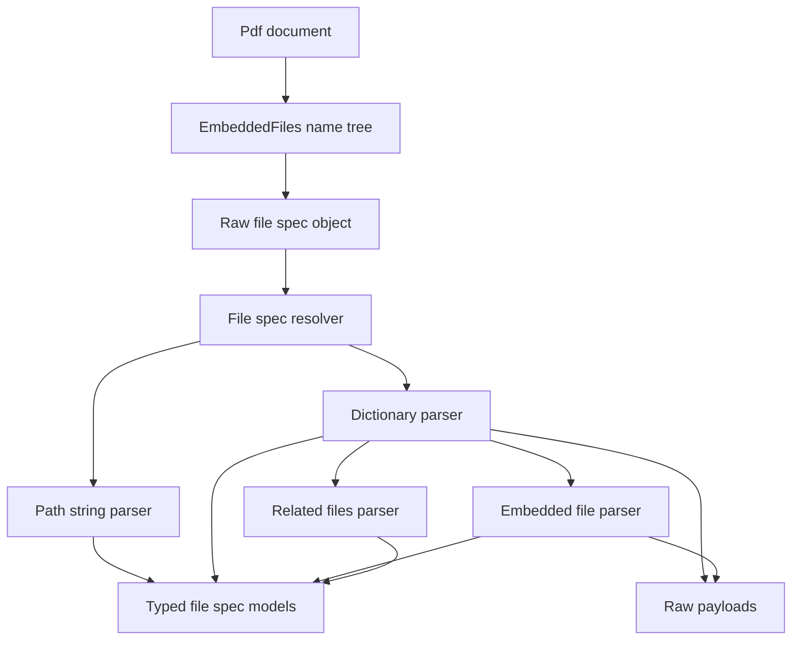
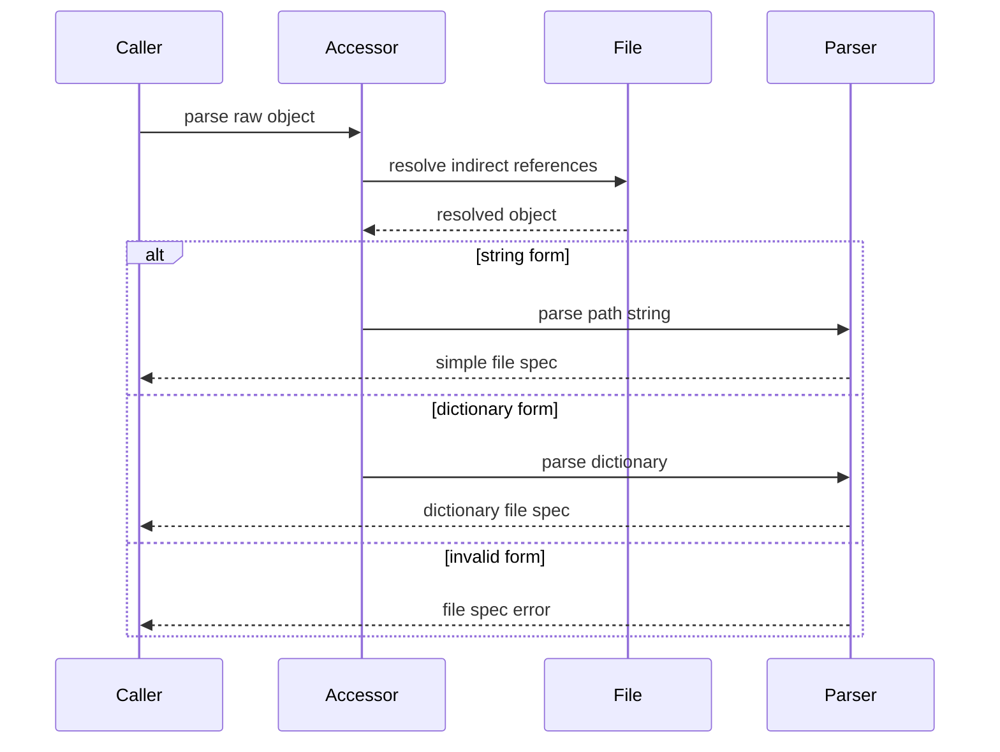
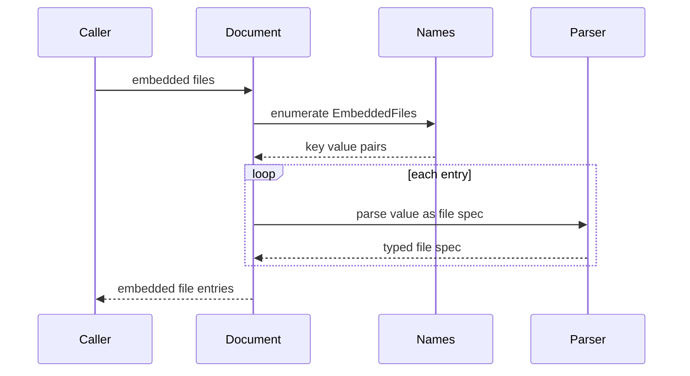
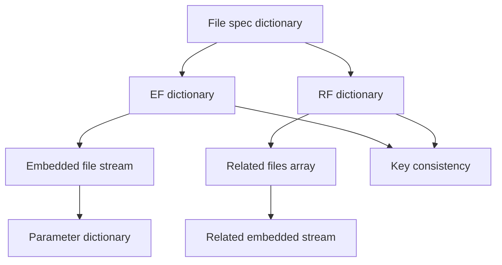
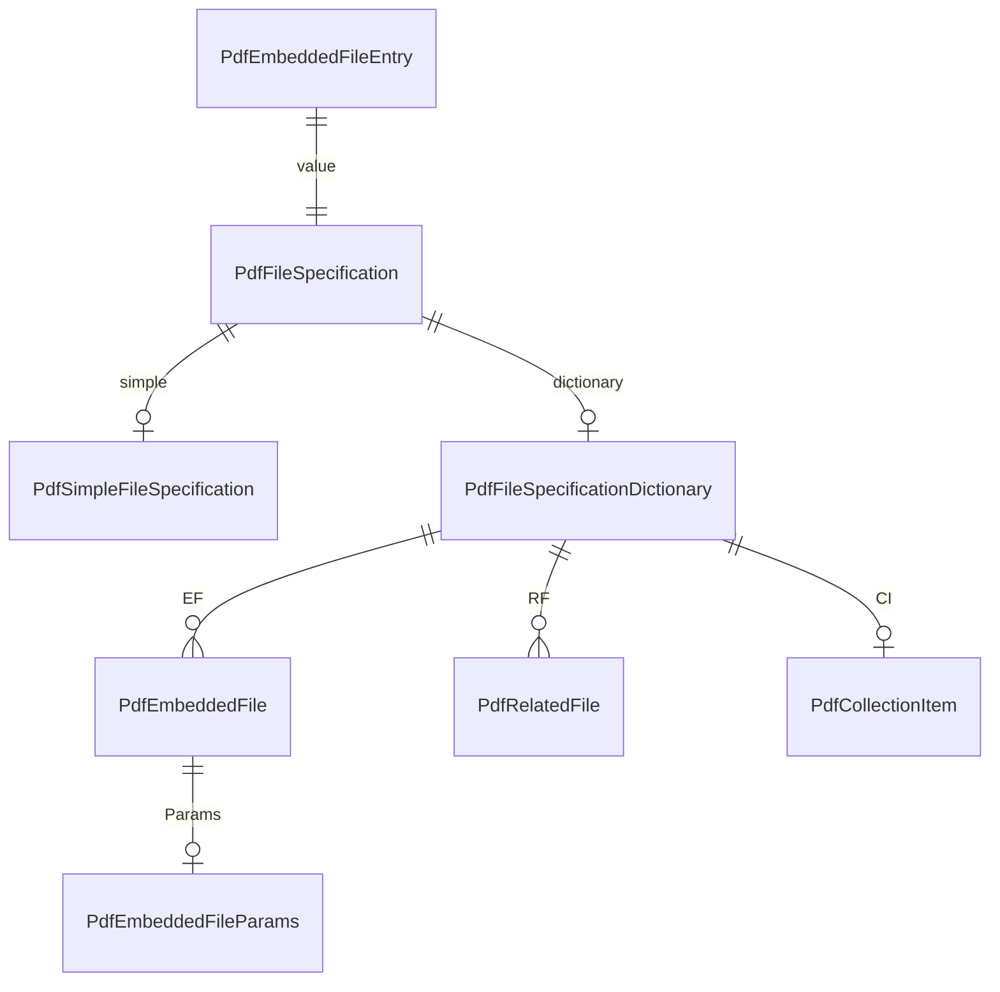

# Design Document

## Overview

This feature delivers typed ISO 32000-2:2020 clause 7.11 file-specification metadata for the MoonBit `trkbt10/pdf` parser library. It converts raw file-specification objects from the reader layer into byte-preserving models for simple file-specification strings, full file-specification dictionaries, embedded-file stream descriptors, related files, URL file-system entries, and collection item dictionaries.

Library users and adjacent reader features use this to inspect file attachments, document-level embedded files, associated files, action file targets, collection files, and other raw file-specification operands without executing external effects. The feature extends `src/reader` and keeps lower PDF object parsing, stream envelope parsing, filter decoding, xref handling, encryption, filesystem access, and network access unchanged.

### Goals
- Parse string and dictionary file specifications into typed, byte-preserving reader models.
- Parse simple file-specification strings into components, absolute/relative classification, escaped literal solidus handling, and pure path normalization helpers.
- Parse file-specification dictionary entries, including `F`/`UF` precedence, `FS /URL`, deprecated platform entries, volatility, file identifiers, embedded-file mappings, related files, descriptions, collection items, thumbnails, encrypted payload references, and associated-file relationships.
- Expose document-level `EmbeddedFiles` name-tree entries as typed file specifications while preserving existing raw collection/action/annotation fields.
- Parse embedded-file stream dictionaries and embedded-file parameter dictionaries without extracting, decrypting, fetching, launching, or writing payload data.
- Validate malformed file-specification structures with a reader-layer diagnostic distinct from low-level parser and adjacent-domain errors.

### Non-Goals
- Opening local files, resolving host filesystem paths, launching applications, fetching URLs, submitting forms, or following external references.
- Writing, extracting to disk, recompressing, encrypting, decrypting, or mutating embedded files.
- Executing viewer behavior for file attachments, associated files, portable collections, encrypted payload documents, or launch actions.
- Full MIME grammar parsing, MIME parameter interpretation, MD5 checksum computation, checksum trust decisions, or security-policy enforcement.
- Replacing existing raw action, annotation, multimedia, structure, form, or collection fields with typed file-specification fields in this phase.
- PDF generation, repair heuristics for malformed file-spec dictionaries, or source-location storage in `PdfFile`.

## Boundary Commitments

### This Spec Owns
- Public reader-layer models for file specifications, file-specification paths, file-specification dictionaries, embedded-file descriptors, related-file arrays, file-identifier pairs, collection item dictionaries, and associated-file relationship names.
- Public `PdfDocument` and raw-object parsing APIs that resolve file-specification strings, dictionaries, indirect references, and `EmbeddedFiles` name-tree values into typed models.
- Byte-preserving simple file-specification string parsing: component splitting on unescaped `/`, literal `/` unescaping, absolute/relative classification, empty component preservation, and `..` normalization helpers.
- Pure relative-resolution helpers for non-URL file-specification paths and URL path references when the caller supplies an explicit base path or base URL.
- Validation of file-specification dictionary shape, required entries, `UF` precedence for reader-selected names, `EF`/`RF` consistency, indirect-object requirements for embedded file specifications, and PDF 2.0 `AFRelationship` defaults.
- Embedded-file stream descriptor parsing for `Type`, `Subtype`, `Params`, size, dates, Mac metadata, and 16-byte checksum shape.
- Raw hand-off preservation for collection item schema values, encrypted payload dictionaries, thumbnails, embedded-file streams, extension file-system names, and unknown dictionary keys.

### Out of Boundary
- Low-level PDF syntax parsing, indirect object syntax, xref resolution, stream `Length` validation, stream filter implementation, object-stream caching, and raw `PdfObject` representation.
- Filesystem access, URL/network access, process launching, document navigation side effects, viewer prompts, or sandbox enforcement.
- Decryption of encrypted payload documents or encrypted embedded-file streams.
- Embedded-file payload decoding as a public extraction API, writing payloads to disk, or MIME-specific content interpretation.
- Collection UI generation, collection schema field rendering, collection item editing, or portable collection sorting behavior beyond preserving `CI`.
- Action execution, annotation activation, multimedia playback, JavaScript execution, form submission/import, rendering, logical structure interpretation, or associated-file semantic processing beyond structural relationship names.
- Automatic absolute path derivation from `PdfDocument::open` bytes; callers own source-location context.

### Allowed Dependencies
- MoonBit standard library only; no third-party URI, MIME, checksum, filesystem, or networking packages.
- Existing local upstream packages already imported by `src/reader`: `objects`, `lexer`, `parser`, `filters`, `content`, `graphics`, and `interchange`.
- Existing reader contracts: `PdfDocument`, `PdfFile`, `PdfFile::load_object`, `PdfDocument::name_tree_entries`, `NameTreeCategory::EmbeddedFiles`, `PdfObject`, `PdfDictionary`, `PdfStream`, `PdfName`, `ObjectId`, and `PdfDocumentError`.
- Existing exact-byte storage for PDF strings and names.
- Local specification excerpts under `spec/extracted/7.11-file-specifications.spec.txt` and adjacent existing specs documenting raw file-specification hand-off fields.

### Revalidation Triggers
- Any public shape change to `PdfObject`, `PdfDictionary`, `PdfStream`, `PdfName`, `ObjectId`, `PdfFile`, `PdfFile::load_object`, `PdfDocument`, `PdfDocument::name_tree_entries`, `NameTreeCategory`, or `PdfDocumentError`.
- Any change to whether `PdfStream.data` stores raw encoded bytes or decoded bytes.
- Any package dependency direction change or addition of a non-standard dependency.
- Any future API that stores a source filesystem or URL location in `PdfFile`.
- Any future encryption, associated-files, collection, form, annotation, multimedia, action, JavaScript, rendering, or extraction feature that replaces raw file-specification or embedded-file payload fields.
- Any implementation that begins opening files, fetching URLs, launching applications, decoding encrypted payloads, extracting files to disk, computing trust decisions from checksums, or mutating PDF dictionaries.

## Architecture

### Existing Architecture Analysis

The repository already exposes file-specification operands as raw `PdfObject` values in `src/reader`: document collections enumerate `EmbeddedFiles`, action models preserve `F` operands, annotations preserve file attachment `FS` and associated-file `AF`, multimedia models preserve embedded assets, and structure/form-adjacent models preserve file-related operands. This feature is the typed structural owner for those raw values.

The existing `PdfDocument` facade wraps `PdfFile`, provides lazy `load_object`, and supports exact-byte name-tree enumeration. The design stays in `src/reader` so file-specification parsing can resolve indirect references, detect cycles, use existing name-tree data, and add public APIs without changing lower syntax packages.

### Architecture Pattern & Boundary Map



**Architecture Integration**:
- Selected pattern: focused reader-layer structural extension over existing raw hand-off values.
- Domain boundaries: `reader` owns clause 7.11 structural interpretation; lower packages own raw PDF objects and file loading; caller applications own external effects and source-location context.
- Existing patterns preserved: standard-library-only implementation, byte-oriented parsing, lazy indirect-reference loading, `pub(all)` public models, `suberror` diagnostics, raw dictionary retention, `///|` blocks, and white-box tests.
- New components rationale: simple string parsing, dictionary parsing, embedded-file stream parsing, related-files parsing, and document-level embedded-file access each have different validation rules and should be separately testable.
- Steering compliance: the feature remains read-only, byte-preserving, lazy, package-local, and free of new dependencies.

### Technology Stack

| Layer | Choice / Version | Role in Feature | Notes |
|-------|------------------|-----------------|-------|
| Language | MoonBit project toolchain | Typed models, parser helpers, public accessors, tests | Use explicit structs, `pub(all)` enums, `suberror`, and raised errors. |
| PDF object model | `trkbt10/pdf/src/objects` | Names, strings, arrays, dictionaries, streams, references, nulls | No object-model changes. |
| Document access | `trkbt10/pdf/src/reader` | `PdfDocument`, `PdfFile::load_object`, name-tree enumeration, document errors | Primary implementation package. |
| Stream metadata | Existing `PdfStream` plus optional `src/filters` caller path | Preserve raw embedded-file stream and dictionary metadata | This feature does not add an extraction API. |
| Data structures | MoonBit standard `Bytes`, `Array`, `Map` | Byte paths, component arrays, file mappings, visited sets | No external storage. |
| Validation | `moon check`, `moon test`, `moon fmt`, `moon info` | Type checking, reader tests, formatting, public API review | `moon info` must show intended `src/reader` API additions only. |

## File Structure Plan

### Directory Structure

```text
src/
├── reader/
│   ├── file_spec_types.mbt              # Public file specification, path, embedded-file, related-file, collection item models
│   ├── file_spec_common.mbt             # Keys, diagnostics, source context, object resolution, primitive readers, cycle guards
│   ├── file_spec_string.mbt             # Simple file-specification string component parser and path normalization helpers
│   ├── file_spec_dictionary.mbt         # File specification dictionary parser and F/UF/platform/AFRelationship validation
│   ├── embedded_file.mbt                # Embedded-file stream and parameter dictionary descriptors
│   ├── related_files.mbt                # Related-files array parsing and RF-to-EF key consistency validation
│   ├── file_spec_accessors.mbt          # Public PdfDocument and raw-object parsing APIs, EmbeddedFiles enumeration
│   ├── file_spec_string_wbtest.mbt      # Component splitting, escaped solidus, absolute/relative, .. normalization tests
│   ├── file_spec_dictionary_wbtest.mbt  # String/dictionary forms, required keys, Type, F/UF precedence, URL tests
│   ├── embedded_file_wbtest.mbt         # EF streams, Params, checksum length, subtype, indirect requirement tests
│   ├── related_files_wbtest.mbt         # RF pair arrays, EF key matching, malformed arrays, related stream tests
│   ├── file_spec_accessors_wbtest.mbt   # EmbeddedFiles name-tree enumeration and raw field parser integration tests
│   ├── document_error.mbt               # Add InvalidFileSpecification diagnostic
│   ├── collection.mbt                   # Keep raw collection file specs; optionally add typed accessor delegation only
│   ├── annotations.mbt                  # Keep raw FS and AF fields; typed parser consumes them on demand
│   ├── action_types.mbt                 # Keep raw file_specification fields; typed parser consumes them on demand
│   └── pkg.generated.mbti               # Regenerate after public API additions
└── objects/
    └── no planned changes               # Revalidate if PdfObject, PdfDictionary, PdfStream, PdfName, or ObjectId changes
```

### Modified Files
- `src/reader/document_error.mbt` - Add `InvalidFileSpecification(@objects.ObjectId?, String)` or equivalent file-specification diagnostic while preserving existing error variants.
- `src/reader/collection.mbt` - Preserve `PdfCollectionFile.file_spec` as raw `PdfObject`; add only small delegating helpers if collection tests need typed file-spec access.
- `src/reader/annotations.mbt` - Preserve raw file attachment `FS` and associated-file `AF` fields; do not deep-parse during annotation enumeration.
- `src/reader/action_types.mbt`, `src/reader/action_destinations.mbt`, `src/reader/action_external.mbt` - Preserve raw action file-specification fields; typed parsing is opt-in through file-specification accessors.
- `src/reader/pkg.generated.mbti` - Regenerate and review public API additions with `moon info`.
- `src/reader/moon.pkg` - No planned dependency change; update only if implementation proves an existing local import is missing.

### Component to File Mapping

| Component | Primary Files |
|-----------|---------------|
| FileSpecModel | `src/reader/file_spec_types.mbt`, `src/reader/pkg.generated.mbti` |
| FileSpecCommonParser | `src/reader/file_spec_common.mbt`, `src/reader/document_error.mbt` |
| FileSpecStringParser | `src/reader/file_spec_string.mbt`, `src/reader/file_spec_string_wbtest.mbt` |
| FileSpecDictionaryParser | `src/reader/file_spec_dictionary.mbt`, `src/reader/file_spec_dictionary_wbtest.mbt` |
| EmbeddedFileParser | `src/reader/embedded_file.mbt`, `src/reader/embedded_file_wbtest.mbt` |
| RelatedFilesParser | `src/reader/related_files.mbt`, `src/reader/related_files_wbtest.mbt` |
| FileSpecAccessors | `src/reader/file_spec_accessors.mbt`, `src/reader/name_dictionary.mbt`, `src/reader/file_spec_accessors_wbtest.mbt` |
| RawBoundaryPolicy | `src/reader/file_spec_types.mbt`, `src/reader/action_types.mbt`, `src/reader/annotations.mbt`, `src/reader/collection.mbt` |

## System Flows

### Raw File Specification Parsing



The accessor records source provenance. Dictionary entries that require indirect file-specification dictionaries fail when the source was direct.

### EmbeddedFiles Name Tree



Absent `EmbeddedFiles` returns an empty array. Malformed present name-tree values raise a file-specification or name-tree diagnostic according to the failing boundary.

### Embedded File and Related Files



The file-specification dictionary parser validates `EF` before `RF`. Related-files entries are accepted only when the corresponding `RF` key also exists in `EF`.

## Requirements Traceability

| Requirement | Summary | Components | Interfaces | Flows |
|-------------|---------|------------|------------|-------|
| 0.1 | Support string and dictionary file specifications and distinguish external versus embedded references structurally | FileSpecModel, FileSpecAccessors, FileSpecDictionaryParser | `parse_file_spec`, `PdfFileSpecification` | Raw File Specification Parsing |
| 0.2 | Parse simple file-specification strings as byte components with escaped literal solidus handling | FileSpecStringParser | `parse_file_spec_path` | Raw File Specification Parsing |
| 0.3 | Classify absolute and relative paths and provide pure relative path and URL path resolution helpers | FileSpecStringParser | `resolve_file_spec_path`, `resolve_file_spec_url_path` | Raw File Specification Parsing |
| 0.4 | Parse file-specification dictionary entries, defaults, precedence, embedded mappings, related mappings, collection item, thumbnail, encrypted payload, and associated relationship metadata | FileSpecDictionaryParser, EmbeddedFileParser, RelatedFilesParser | `parse_file_spec_dictionary`, `PdfFileSpecificationDictionary` | Embedded File and Related Files |
| 0.5 | Parse embedded-file stream descriptors, parameter dictionaries, document-level embedded file enumeration, and raw stream retention | EmbeddedFileParser, FileSpecAccessors | `parse_embedded_file_stream`, `embedded_files` | EmbeddedFiles Name Tree, Embedded File and Related Files |
| 0.6 | Parse related-files arrays as string and stream pairs and enforce RF to EF key consistency | RelatedFilesParser, FileSpecDictionaryParser | `parse_related_files`, `PdfRelatedFile` | Embedded File and Related Files |
| 0.7 | Recognize `FS /URL`, treat `F` as URL bytes, and expose URL path validation and resolution helpers without fetching | FileSpecDictionaryParser, FileSpecStringParser | `is_url_file_spec`, `resolve_file_spec_url_path` | Raw File Specification Parsing |
| 0.8 | Parse collection item dictionaries and preserve schema-dependent collection item fields structurally | FileSpecDictionaryParser, FileSpecModel | `PdfCollectionItem` | Raw File Specification Parsing |

## Components and Interfaces

| Component | Domain | Intent | Req Coverage | Key Dependencies | Contracts |
|-----------|--------|--------|--------------|------------------|-----------|
| FileSpecModel | reader public API | Public typed data structures for clause 7.11 | 0.1, 0.4, 0.5, 0.6, 0.8 | objects P0 | State |
| FileSpecCommonParser | reader parser substrate | Shared keys, diagnostics, source context, and indirect resolution | 0.1, 0.4, 0.5, 0.6 | PdfFile::load_object P0, PdfDocumentError P0 | Service |
| FileSpecStringParser | reader parser | Parse and normalize byte-oriented file-specification paths | 0.2, 0.3, 0.7 | Bytes P0 | Service |
| FileSpecDictionaryParser | reader parser | Convert file-specification dictionaries into typed models | 0.1, 0.4, 0.7, 0.8 | FileSpecStringParser P0, EmbeddedFileParser P0, RelatedFilesParser P0 | Service |
| EmbeddedFileParser | reader parser | Describe embedded-file streams and parameter dictionaries | 0.5 | objects.PdfStream P0, filters boundary P2 | Service |
| RelatedFilesParser | reader parser | Parse RF arrays and validate EF key correspondence | 0.6 | EmbeddedFileParser P0 | Service |
| FileSpecAccessors | reader public API | Parse raw values and enumerate document embedded files | 0.1, 0.5 | PdfDocument P0, NameTreeReader P0 | Service |
| RawBoundaryPolicy | reader compatibility | Preserve existing raw fields and parse typed values on demand | 0.1, 0.4, 0.5 | actions P1, annotations P1, collections P1 | State |

### Reader Models

#### FileSpecModel

| Field | Detail |
|-------|--------|
| Intent | Expose byte-preserving file-specification data without external effects. |
| Requirements | 0.1, 0.4, 0.5, 0.6, 0.8 |

**Responsibilities & Constraints**
- Represent a file specification as either simple string form or dictionary form.
- Preserve exact raw strings, dictionaries, streams, names, and unknown keys.
- Store reader-selected filename data using `UF` when present and `F` otherwise.
- Keep encrypted payload, collection item, thumbnail, deprecated platform, and extension data structural only.

**Dependencies**
- Inbound: file-specification parsers and accessors - model construction (P0).
- Outbound: `@objects.PdfObject`, `PdfDictionary`, `PdfStream`, `PdfName`, `ObjectId` - raw payload identity (P0).
- External: none.

**Contracts**: Service [ ] / API [ ] / Event [ ] / Batch [ ] / State [x]

##### State Model
- `PdfFileSpecification`: discriminated public enum with `Simple(PdfSimpleFileSpecification)` and `Full(PdfFileSpecificationDictionary)`.
- `PdfSimpleFileSpecification`: raw string bytes, parsed `PdfFileSpecPath`, and raw source object.
- `PdfFileSpecPath`: raw bytes, absolute flag, ordered byte components, normalized components when requested, and an invalid-escape diagnostic only when parsing is requested.
- `PdfFileSpecificationDictionary`: source `ObjectId?`, file system name, `F`, `UF`, reader-selected file name, deprecated platform names, identifier pair, volatility flag, embedded files map, related files map, description, collection item, thumbnail stream, encrypted payload dictionary, associated-file relationship, raw dictionary.
- `PdfEmbeddedFile`: key name, stream object id if known, raw `PdfStream`, subtype name, parameters, and raw dictionary.
- `PdfEmbeddedFileParams`: size, creation date, modification date, Mac dictionary, checksum bytes, raw dictionary.
- `PdfRelatedFile`: name string, embedded-file stream descriptor, and raw pair values.
- `PdfCollectionItem`: raw dictionary and optional `Type /CollectionItem` validation result.
- `PdfAssociatedFileRelationship`: `Source`, `Data`, `Alternative`, `Supplement`, `EncryptedPayload`, `FormData`, `Schema`, `Unspecified`, or `Other(PdfName)`.

**Implementation Notes**
- Public enums that callers pattern-match use `pub(all) enum`; structs whose fields callers inspect use `pub(all) struct`.
- Dates remain raw `PdfObject` or bytes unless existing common-data date decoding is added elsewhere.
- Unknown names and second-class names remain preserved instead of rejected.

### Parser Substrate

#### FileSpecCommonParser

| Field | Detail |
|-------|--------|
| Intent | Resolve raw file-specification objects with source provenance and shared diagnostics. |
| Requirements | 0.1, 0.4, 0.5, 0.6 |

**Responsibilities & Constraints**
- Resolve indirect references through `PdfFile::load_object` with object-id cycle detection.
- Preserve whether the file-specification dictionary source was indirect.
- Provide primitive readers for names, strings, dictionaries, arrays, streams, refs, booleans, and integers with file-spec-specific errors.
- Convert low-level reader failures into `PdfDocumentError::ReaderError`.

**Dependencies**
- Inbound: FileSpecAccessors, FileSpecDictionaryParser, EmbeddedFileParser, RelatedFilesParser (P0).
- Outbound: `PdfFile::load_object`, `PdfDocumentError`, `@objects` types (P0).
- External: none.

**Contracts**: Service [x] / API [ ] / Event [ ] / Batch [ ] / State [ ]

##### Service Interface
```moonbit
fn resolve_file_spec_object(
  file : PdfFile,
  value : @objects.PdfObject,
  context : String,
) -> PdfResolvedFileSpecObject raise PdfDocumentError

fn file_spec_error(
  owner : @objects.ObjectId?,
  reason : String,
) -> PdfDocumentError
```
- Preconditions: `value` is a raw PDF object from a file-specification entry or an `EmbeddedFiles` name-tree value.
- Postconditions: Returned resolved object includes the resolved `PdfObject`, source `ObjectId?`, and indirect provenance.
- Invariants: Cycles are rejected before recursion continues; direct dictionaries remain direct for indirect-only validation.

**Implementation Notes**
- Add `InvalidFileSpecification` to `PdfDocumentError`; do not overload navigation, action, annotation, multimedia, or structure errors.
- Keep context strings short and stable for tests.

#### FileSpecStringParser

| Field | Detail |
|-------|--------|
| Intent | Interpret the standard byte path syntax for simple file specifications. |
| Requirements | 0.2, 0.3, 0.7 |

**Responsibilities & Constraints**
- Split raw bytes into components separated by unescaped `/`.
- Treat escaped literal `/` as part of a component by removing the PDF file-specification reverse solidus marker during component parsing.
- Preserve empty components and raw bytes.
- Classify absolute paths by leading `/`.
- Normalize `..` components only through explicit helper calls and only after an absolute path is derived.
- For URL file-system helpers, enforce relative path-only input and percent-escape bytes that are unsafe or non-ASCII before base resolution.

**Dependencies**
- Inbound: FileSpecDictionaryParser, FileSpecAccessors, tests (P0).
- Outbound: `Bytes`, `Array` (P0).
- External: RFC 3986 path rules as local byte logic (P1).

**Contracts**: Service [x] / API [ ] / Event [ ] / Batch [ ] / State [ ]

##### Service Interface
```moonbit
pub fn parse_file_spec_path(raw : Bytes) -> PdfFileSpecPath raise PdfDocumentError

pub fn normalize_file_spec_path(path : PdfFileSpecPath) -> PdfFileSpecPath

pub fn resolve_file_spec_path(
  base : PdfFileSpecPath,
  relative : PdfFileSpecPath,
) -> PdfFileSpecPath raise PdfDocumentError

pub fn resolve_file_spec_url_path(
  base_url : Bytes,
  relative_path : PdfFileSpecPath,
) -> Bytes raise PdfDocumentError
```
- Preconditions: `raw` is the byte value from a PDF string after PDF string decoding by the lower parser.
- Postconditions: Component arrays preserve byte order and empty components; URL helper output is ASCII URL bytes.
- Invariants: Helpers never query the host filesystem or network.

**Implementation Notes**
- Reject malformed escape sequences only when they make component separation ambiguous.
- The URL helper accepts only relative path components; scheme, authority, query, fragment, and parameters in the relative value are rejected.

### File Specification Parsing

#### FileSpecDictionaryParser

| Field | Detail |
|-------|--------|
| Intent | Parse dictionary-form file specifications and enforce clause 7.11 dictionary contracts. |
| Requirements | 0.1, 0.4, 0.7, 0.8 |

**Responsibilities & Constraints**
- Accept only dictionary objects for full file specifications.
- Validate `Type /Filespec` when present and require it when `EF`, `EP`, or `RF` is present.
- Read `FS` as an optional file-system name; recognize `URL` as the only PDF-defined standard value while preserving other names.
- Validate `F`, `UF`, `DOS`, `Mac`, and `Unix` as strings when present.
- Require `F` when `DOS`, `Mac`, and `Unix` are all absent. Use `UF` instead of `F` for reader-selected file name when present.
- Preserve PDF 2.0 encrypted-payload privacy notes as design boundary; do not infer or validate original file names.
- Validate optional `ID` as exactly two byte strings when present.
- Default `V` to false.
- Parse `EF`, `RF`, `Desc`, `CI`, `Thumb`, `EP`, and `AFRelationship`.

**Dependencies**
- Inbound: FileSpecAccessors (P0).
- Outbound: FileSpecStringParser, EmbeddedFileParser, RelatedFilesParser, FileSpecModel (P0).
- External: none.

**Contracts**: Service [x] / API [ ] / Event [ ] / Batch [ ] / State [ ]

##### Service Interface
```moonbit
fn parse_file_spec_dictionary(
  file : PdfFile,
  source : PdfResolvedFileSpecObject,
) -> PdfFileSpecificationDictionary raise PdfDocumentError
```
- Preconditions: `source.object` is a `PdfObject::Dictionary`.
- Postconditions: Returned model contains defaulted `volatile` and `associated_relationship`, selected file-name precedence, and raw dictionary.
- Invariants: If `EF` or `RF` exists, `source.object_id` is required and `Type` must be `/Filespec`; if `RF` exists, `EF` exists.

**Implementation Notes**
- `CI` must be an indirect reference per the table; resolve it only enough to validate or return a `PdfCollectionItem` source model.
- `Thumb` is a stream object descriptor only; image interpretation remains outside this feature.
- Unknown `FS` names remain accepted and preserved.

#### EmbeddedFileParser

| Field | Detail |
|-------|--------|
| Intent | Parse embedded-file stream metadata without extracting the payload. |
| Requirements | 0.5 |

**Responsibilities & Constraints**
- Resolve `EF` dictionary values to embedded-file streams.
- Validate optional stream `Type` as `/EmbeddedFile` when present.
- Preserve `Subtype` as a `PdfName`; do not parse MIME parameters.
- Parse optional `Params` dictionary and its `Size`, `CreationDate`, `ModDate`, `Mac`, and `CheckSum` entries.
- Validate `CheckSum` as a 16-byte string when present.
- Preserve raw stream dictionary and raw stream data exactly.

**Dependencies**
- Inbound: FileSpecDictionaryParser, RelatedFilesParser (P0).
- Outbound: `@objects.PdfStream`, FileSpecCommonParser (P0).
- External: existing `filters` package remains caller-accessible but is not invoked by default (P2).

**Contracts**: Service [x] / API [ ] / Event [ ] / Batch [ ] / State [ ]

##### Service Interface
```moonbit
fn parse_embedded_file_stream(
  file : PdfFile,
  key : @objects.PdfName,
  value : @objects.PdfObject,
  owner : @objects.ObjectId?,
) -> PdfEmbeddedFile raise PdfDocumentError
```
- Preconditions: `value` is the `EF` dictionary value for key `F`, `UF`, or an accepted extension key.
- Postconditions: Returned descriptor contains the raw stream and parsed metadata.
- Invariants: The parser does not decode, decrypt, copy to disk, or interpret payload bytes.

**Implementation Notes**
- `Subtype` and `Params` are required only when the embedded file stream is used as an associated file. Because association context can come from later specs, this parser records absence and lets associated-file consumers enforce stronger constraints when they own that context.
- `Size` describes uncompressed payload bytes and is not used to allocate buffers.

#### RelatedFilesParser

| Field | Detail |
|-------|--------|
| Intent | Parse `RF` related-file arrays and enforce key alignment with `EF`. |
| Requirements | 0.6 |

**Responsibilities & Constraints**
- Validate `RF` as a dictionary.
- For each `RF` key, require the same key in the parsed `EF` map.
- Resolve each `RF` dictionary value as an array of string and embedded-file stream pairs.
- Require even array length and string first elements.
- Preserve related file name bytes and raw stream descriptors.

**Dependencies**
- Inbound: FileSpecDictionaryParser (P0).
- Outbound: EmbeddedFileParser (P0).
- External: none.

**Contracts**: Service [x] / API [ ] / Event [ ] / Batch [ ] / State [ ]

##### Service Interface
```moonbit
fn parse_related_files(
  file : PdfFile,
  rf_dict : @objects.PdfDictionary,
  ef_keys : Array[@objects.PdfName],
  owner : @objects.ObjectId?,
) -> Map[@objects.PdfName, Array[PdfRelatedFile]] raise PdfDocumentError
```
- Preconditions: `EF` has already been parsed and `ef_keys` represents its keys.
- Postconditions: Returned map contains one array per related-file key.
- Invariants: No `RF` key exists without a matching `EF` key.

**Implementation Notes**
- Related embedded-file streams use the same descriptor parser as primary `EF` streams.
- The parser does not infer systematic file-name variations; it records the explicit related names provided by the PDF.

### Public Accessors

#### FileSpecAccessors

| Field | Detail |
|-------|--------|
| Intent | Provide additive public APIs for typed file-specification parsing and embedded-file enumeration. |
| Requirements | 0.1, 0.5 |

**Responsibilities & Constraints**
- Parse a raw `PdfObject` as a file specification using a `PdfDocument` or `PdfFile` context.
- Enumerate document-level `EmbeddedFiles` name-tree entries and parse each value as a file specification.
- Provide helper methods for raw file-spec values already exposed by actions, annotations, collections, forms, structures, and multimedia without replacing those fields.
- Preserve exact name-tree entry keys as bytes.

**Dependencies**
- Inbound: library callers, existing reader feature tests (P0).
- Outbound: `PdfDocument::name_tree_entries`, FileSpecCommonParser, FileSpecDictionaryParser (P0).
- External: none.

**Contracts**: Service [x] / API [x] / Event [ ] / Batch [ ] / State [ ]

##### Service Interface
```moonbit
pub fn PdfDocument::parse_file_spec(
  self : PdfDocument,
  value : @objects.PdfObject,
) -> PdfFileSpecification raise PdfDocumentError

pub fn PdfFile::parse_file_spec(
  self : PdfFile,
  value : @objects.PdfObject,
) -> PdfFileSpecification raise PdfDocumentError

pub fn PdfDocument::embedded_files(
  self : PdfDocument,
) -> Array[PdfEmbeddedFileEntry] raise PdfDocumentError
```
- Preconditions: `value` is a raw file-specification object from a PDF dictionary, action, annotation, name tree, or adjacent feature.
- Postconditions: `embedded_files` returns entries in the same sorted order as name-tree enumeration.
- Invariants: Existing raw fields remain unchanged; parsing is opt-in.

##### API Contract
| Method | Receiver | Input | Response | Errors |
|--------|----------|-------|----------|--------|
| `parse_file_spec` | `PdfDocument` | raw `PdfObject` | `PdfFileSpecification` | `InvalidFileSpecification`, `ReaderError`, `CycleDetected` |
| `parse_file_spec` | `PdfFile` | raw `PdfObject` | `PdfFileSpecification` | `InvalidFileSpecification`, `ReaderError`, `CycleDetected` |
| `embedded_files` | `PdfDocument` | none | `Array[PdfEmbeddedFileEntry]` | `InvalidNameTree`, `InvalidFileSpecification`, `ReaderError`, `CycleDetected` |

**Implementation Notes**
- `PdfEmbeddedFileEntry` contains the name-tree key bytes, the typed file specification, and the raw name-tree value.
- Collection-specific folder IDs remain owned by collection parsing. The file-spec accessor does not reinterpret bracketed collection keys.

#### RawBoundaryPolicy

| Field | Detail |
|-------|--------|
| Intent | Keep adjacent reader APIs compatible while making clause 7.11 typed parsing available. |
| Requirements | 0.1, 0.4, 0.5 |

**Responsibilities & Constraints**
- Leave existing public raw fields in action, annotation, collection, multimedia, structure, and form-related models unchanged.
- Document typed parser hand-off as the authoritative clause 7.11 interpretation path.
- Avoid eager parsing during unrelated feature enumeration to preserve current performance and failure behavior.

**Dependencies**
- Inbound: Existing public APIs and adjacent specs (P1).
- Outbound: FileSpecAccessors for opt-in parsing (P0).
- External: none.

**Contracts**: Service [ ] / API [ ] / Event [ ] / Batch [ ] / State [x]

##### State Management
- Existing raw fields continue to store `@objects.PdfObject` or arrays of raw objects.
- Typed file-specification results are computed on demand and are not cached in this feature.
- Future caches require revalidation because malformed file specs currently fail at accessor time, not at document-open time.

**Implementation Notes**
- This avoids turning unrelated calls such as `document.annotations()` or `document.actions()` into file-specification validation points.

## Data Models

### Domain Model



The aggregate root is `PdfFileSpecification`. It owns the parsed structural view and retains raw values. Embedded files and related files are child descriptors, not extracted resources.

### Logical Data Model

**Structure Definition**:
- `PdfFileSpecification` has exactly one shape: simple string or dictionary.
- `PdfFileSpecPath` stores raw bytes plus parsed components. Component order is significant.
- `PdfFileSpecificationDictionary` has optional names, strings, dictionaries, stream descriptors, and raw payloads keyed by PDF names.
- `PdfEmbeddedFileEntry` links an `EmbeddedFiles` name-tree key to a typed `PdfFileSpecification`.
- `PdfRelatedFile` belongs under one RF key and contains one file-name string plus one embedded-file stream descriptor.

**Consistency & Integrity**:
- `UF` overrides `F` only for the reader-selected name; both raw fields remain available.
- `V` defaults to false and `AFRelationship` defaults to `Unspecified`.
- `RF` requires `EF`, and every `RF` key requires a matching `EF` key.
- `EF`, `RF`, and `EP` require dictionary `Type /Filespec` and indirect source provenance.
- `CheckSum`, when present, contains exactly 16 bytes.

### Data Contracts & Integration

**API Data Transfer**
- All public data is returned as MoonBit structs/enums, not serialized JSON.
- Raw PDF strings stay `Bytes`; names stay `PdfName`; unknown values stay `PdfObject`.
- No API returns host filesystem paths or performs source-location inference.

**Cross-Service Data Management**
- Existing raw action, annotation, collection, multimedia, form, and structure fields remain source data for file-specification parsing.
- Future adjacent specs can call `parse_file_spec` without importing a new package.

## Error Handling

### Error Strategy

File-specification parsing fails fast on malformed structure and wraps lower reader failures. Optional absent entries use ISO defaults or `None` rather than errors. Effects outside parser scope are never attempted, so they cannot fail inside this feature.

### Error Categories and Responses
- Invalid raw object: values that are neither string nor dictionary raise `InvalidFileSpecification`.
- Invalid string path: malformed escape sequences or disallowed URL relative-path constructs raise `InvalidFileSpecification`.
- Invalid dictionary: wrong `Type`, missing required `F`, malformed `ID`, non-string file entries, malformed `EF`, missing required `EF` for `RF`, or invalid `AFRelationship` type raise `InvalidFileSpecification`.
- Invalid embedded stream: non-stream `EF` value, invalid optional `Type`, malformed `Params`, non-integer `Size`, or non-16-byte `CheckSum` raises `InvalidFileSpecification`.
- Invalid related files: odd arrays, non-string names, non-stream values, or `RF` key without matching `EF` raises `InvalidFileSpecification`.
- Object loading failures: lower `PdfReaderError` values are wrapped as `PdfDocumentError::ReaderError`.
- Cycles: indirect object cycles are reported through the existing `CycleDetected` pattern or the file-specification diagnostic, following implementation consistency with adjacent reader domains.

### Monitoring

No runtime monitoring is added. Validation is through deterministic parser errors and test coverage. Callers that extract or fetch resources own their own logging and security controls.

## Testing Strategy

- Unit Tests: `file_spec_string_wbtest.mbt` verifies `in\\/out` parses to one component containing `in/out`, absolute path detection, empty component preservation, relative path classification, `..` normalization after base resolution, and rejection of URL relative values that contain scheme, authority, query, fragment, or parameters for 0.2, 0.3, and 0.7.
- Unit Tests: `file_spec_dictionary_wbtest.mbt` verifies string form, dictionary form, `Type /Filespec` requirements, missing `F` when platform entries are absent, `UF` selected-name precedence, `FS /URL` URL byte preservation, deprecated platform string validation, `ID` two-byte-string validation, `V` default false, and `AFRelationship` default or unknown-name preservation for 0.1, 0.4, and 0.7.
- Unit Tests: `embedded_file_wbtest.mbt` verifies `EF` dictionary stream resolution, indirect file-spec requirement when `EF` exists, embedded stream `Type /EmbeddedFile` validation, `Subtype` retention, `Params` parsing, `Size`, dates, `Mac`, 16-byte `CheckSum`, and raw stream preservation for 0.5.
- Unit Tests: `related_files_wbtest.mbt` verifies `RF` requires `EF`, `RF` keys match `EF` keys, related-files arrays have even string/stream pairs, malformed pair values fail, and related embedded streams reuse embedded-file descriptors for 0.6.
- Integration Tests: `file_spec_accessors_wbtest.mbt` builds a document with an `EmbeddedFiles` name tree, verifies `PdfDocument::embedded_files` returns typed entries in byte-key order, verifies malformed file-spec values surface file-specification diagnostics, and verifies absent `EmbeddedFiles` returns an empty array for 0.5.
- Integration Tests: Existing action, annotation, and collection tests continue to pass with raw file-spec fields unchanged; new tests call `parse_file_spec` on representative raw values from remote Go-To, Launch, file attachment, associated files, and collection files for 0.1 and 0.4.
- Performance/Load: Large `EmbeddedFiles` name-tree enumeration should remain linear in enumerated entries and should not decode embedded payload bytes. Tests include a multi-entry tree to verify parsing does not copy stream data beyond existing `PdfStream` storage for 0.5.

## Security Considerations

- File specifications are untrusted PDF data. This feature exposes metadata only and performs no file, network, process, or viewer side effects.
- URL values remain bytes unless callers explicitly process them. The pure URL helper only resolves path bytes against a caller-supplied base and never fetches.
- Embedded-file payloads remain raw PDF streams. Extraction, antivirus scanning, temporary-file handling, sandbox prompts, and content-type trust are caller responsibilities.
- The optional checksum is a structural 16-byte value and is not a cryptographic trust signal in this feature.
- Encrypted payload dictionaries and `AFRelationship /EncryptedPayload` are preserved structurally; decryption and permission policy belong to encryption features.

## Performance & Scalability

- File-specification parsing is lazy and opt-in. Document open, page enumeration, action parsing, annotation parsing, and collection parsing do not eagerly validate all file specs.
- Embedded-file stream data is not copied or decoded by file-specification parsing; descriptors reference the existing `PdfStream` value.
- Path parsing is linear in the number of bytes in the file-specification string.
- `EmbeddedFiles` enumeration scales with the existing name-tree enumeration behavior and parsed entry count.

## Supporting References

- Local ISO excerpt: `spec/extracted/7.11-file-specifications.spec.txt`.
- Upstream reader contracts: `.kiro/specs/pdf-document-structure/design.md`.
- Existing raw hand-off contracts: `.kiro/specs/pdf-interactive-navigation/design.md`, `.kiro/specs/pdf-actions/design.md`, `.kiro/specs/pdf-annotations/design.md`, `.kiro/specs/pdf-multimedia/design.md`.
- Discovery and rationale: `.kiro/specs/pdf-file-specs/research.md`.
