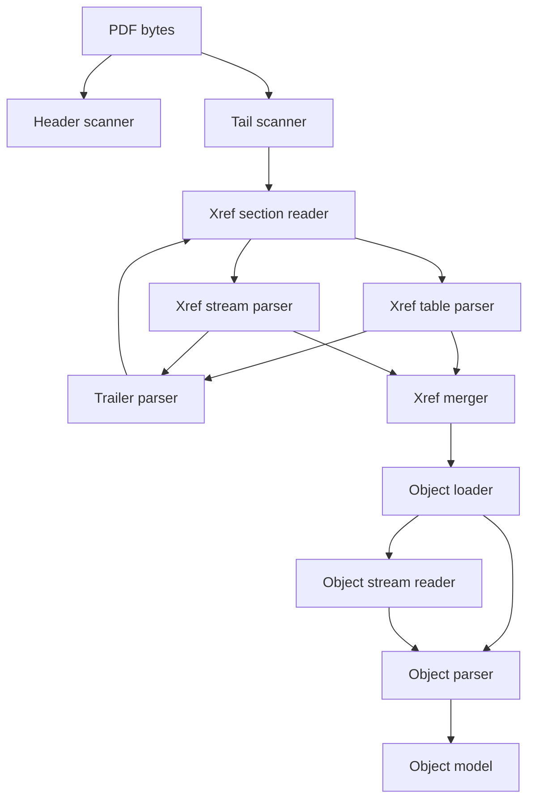
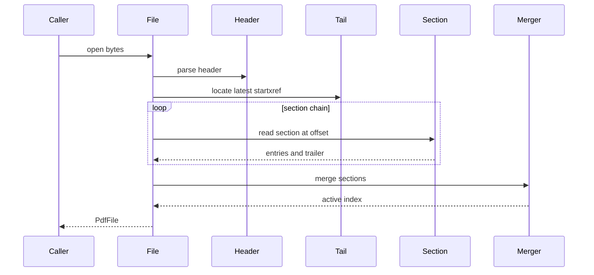
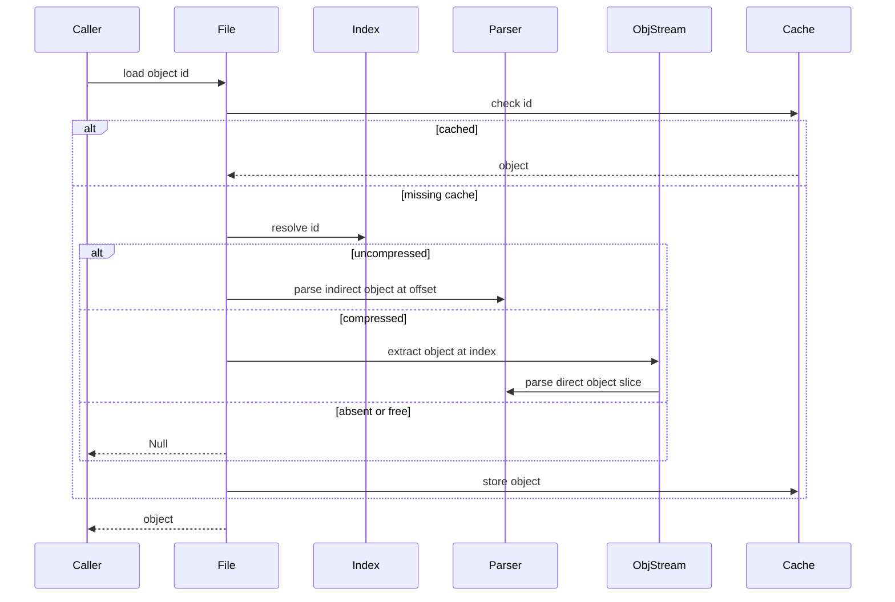
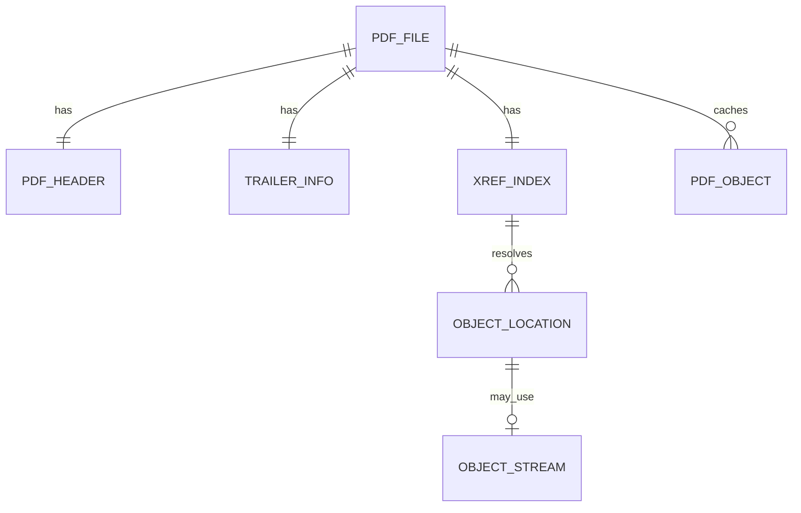

# Design Document

## Overview
This feature delivers the PDF file-structure reader for the MoonBit `trkbt10/pdf` library. It opens a byte buffer as a PDF file, parses the header, locates the latest cross-reference section from the file end, follows incremental-update links, and builds a merged random-access index for indirect objects.

Library implementers and later document-structure layers use this reader to resolve `ObjectId` values to `PdfObject` values on demand. The feature adds a downstream `reader` package that depends on the implemented `objects`, `lexer`, and `parser` packages without moving file-level responsibilities into the object parser.

### Goals
- Parse PDF file header, traditional cross-reference tables, trailers, incremental updates, cross-reference streams, hybrid-reference files, and object streams required by ISO 32000-2 section 7.5.
- Provide a type-safe lazy random-access API that returns `PdfObject::Null` for missing indirect objects.
- Preserve byte-accurate offsets, section provenance, and clear reader errors for malformed file structure.
- Validate the Annex H and bundled PDF 2.0 examples named by the requirements.

### Non-Goals
- General document-structure interpretation such as Catalog, Pages, Page tree traversal, resources, content operators, fonts, or rendering.
- General PDF stream filter implementation. This spec defines the structural stream decoding boundary and supports unfiltered structural streams; the later `pdf-filters` spec owns full filter coverage.
- Encryption and decryption. Cross-reference streams using encrypted or crypt-filtered structural data are rejected.
- PDF writing, linearized PDF optimization, network-range loading, or repair heuristics for corrupted xref data.

## Boundary Commitments

### This Spec Owns
- `src/reader` package and its public file-opening and object-loading API.
- Header parsing, including version validation, binary indicator detection, and `%PDF-` base offset tracking.
- Reverse tail scanning for the last `%%EOF`, `startxref`, and latest cross-reference offset.
- Traditional xref table parsing, trailer dictionary validation, `Prev` chain traversal, incremental merge, and hybrid `XRefStm` ordering.
- Cross-reference stream dictionary validation and binary entry decoding into the shared xref entry model.
- Object-stream header parsing and extraction of compressed generation-0 direct objects.
- Lazy object loading from uncompressed offsets or compressed object locations, including cache ownership.
- Reader-specific error categories and offset rebasing from parser errors.

### Out of Boundary
- Changing the meaning of `PdfObject`, `ObjectId`, `PdfStream`, or existing parser semantics from `pdf-objects`.
- Resolving Catalog, Page tree, Info dictionary, encryption dictionary, metadata, content streams, or any downstream document semantics.
- Implementing standard stream filters beyond the structural decoder boundary. Unsupported filters produce explicit reader errors.
- Decrypting streams, strings, object streams, or cross-reference streams.
- Heuristic scanning for objects when xref data is malformed or absent.
- Treating linearization dictionaries or network access hints as authoritative for object lookup.

### Allowed Dependencies
- MoonBit standard library only.
- Local packages in this direction: `src/reader` imports `src/objects`, `src/lexer`, and `src/parser`; no upstream package imports `src/reader`.
- Local ISO excerpts under `spec/extracted/7.5-file-structure.md`, `spec/extracted/7.5-file-structure.spec.txt`, and `spec/extracted/annex-h-examples.spec.txt`.
- Bundled sample PDFs under `spec/pdf20examples/`.
- Future optional dependency: `src/filters` may be introduced by the later `pdf-filters` spec and plugged into `StructuralStreamDecoder` after revalidation.

### Revalidation Triggers
- Any public API change to `PdfObject`, `PdfName`, `PdfDictionary`, `PdfStream`, `ObjectId`, `IndirectObject`, `PdfParseError`, `ByteCursor`, or parser entry points.
- Any change to whether `PdfStream.data` is encoded or decoded.
- Any change to stream `Length` handling, indirect-object parsing, or direct-object trailing input behavior.
- Any change to xref merge priority, `Prev` traversal order, hybrid `XRefStm` ordering, or missing-object behavior.
- Introduction of `src/filters`, encryption support, or document-structure parsing that consumes `TrailerInfo` or `PdfFile::load_object`.
- Any change to the coordinate system for byte offsets.

## Architecture

### Existing Architecture Analysis
The repository already contains `objects`, `lexer`, and `parser` packages that implement Phase 1. The object layer exposes `PdfObject::Ref`, `PdfObject::Null`, `PdfStream`, `ObjectId`, and typed accessors. The lexer exposes marker tokens, byte cursor primitives, and EOL behavior. The parser exposes direct-object, all-object, and indirect-object entry points.

This feature adds the missing downstream file-structure layer. It respects the steering dependency direction `objects <- lexer <- parser <- reader` and keeps all file-level state, xref indexing, lazy cache behavior, and incremental-update logic out of the lower parser packages.

### Architecture Pattern & Boundary Map



**Architecture Integration**:
- Selected pattern: layered reader with normalized index. Format-specific parsers produce common section records, and the loader consumes only the merged index.
- Domain boundaries: raw byte location logic belongs to `ByteSource`; structural metadata belongs to reader types; direct object syntax remains in `parser`; object values remain in `objects`.
- Existing patterns preserved: package-per-directory layout, standard-library-only implementation, `suberror` diagnostics, byte-stream parsing, lazy indirect reference resolution, and package-local tests.
- New components rationale: xref tables, xref streams, object streams, and incremental merges have distinct validation rules but share one random-access output.
- Steering compliance: downstream `reader` adds file structure without introducing external dependencies or reversing package imports.

### Technology Stack

| Layer | Choice / Version | Role in Feature | Notes |
|-------|------------------|-----------------|-------|
| Language | MoonBit, project toolchain | Reader implementation and public APIs | Use typed structs, enums, `suberror`, and `Result`-compatible raised errors. |
| Parsing dependencies | `trkbt10/pdf/src/objects`, `src/lexer`, `src/parser` | Direct object parsing, indirect object parsing, object model, byte primitives | No upstream dependency on reader. |
| Data structures | Standard `Bytes`, `Array`, `Map` | File buffer, xref sections, trailer dictionaries, cache, object stream tables | No external storage. |
| Build and test | `moon check`, `moon test`, `moon fmt`, `moon info` | Validation and public API review | `moon info` must show only intended reader API additions. |

## File Structure Plan

### Directory Structure

```text
src/
├── reader/
│   ├── moon.pkg                  # Imports objects, lexer, parser
│   ├── types.mbt                 # PdfVersion, PdfHeader, TrailerInfo, XrefEntry, ObjectLocation, PdfFile
│   ├── error.mbt                 # PdfReaderError and parser-error wrapping with file offsets
│   ├── byte_source.mbt           # Buffer slicing, EOF scanning helpers, PDF-relative to physical offset conversion
│   ├── header.mbt                # %PDF-X.Y parsing, valid version set, binary indicator detection
│   ├── tail.mbt                  # Last %%EOF lookup, startxref lookup, decimal offset parsing
│   ├── xref_section.mbt          # Dispatch table vs stream sections, Prev traversal, hybrid XRefStm ordering
│   ├── trailer.mbt               # trailer dictionary parsing and Size, Root, Prev, Encrypt, Info, ID, XRefStm validation
│   ├── xref_table.mbt            # xref keyword, subsection headers, exact 20-byte table entries
│   ├── xref_stream.mbt           # /XRef indirect stream parsing, W and Index validation, big-endian entry decoding
│   ├── stream_decode.mbt         # StructuralStreamDecoder boundary for xref and object stream decoded bytes
│   ├── xref_merge.mbt            # Prev traversal ordering, hybrid priority, free-entry removal, active index creation
│   ├── object_loader.mbt         # Resolve ObjectLocation, parse uncompressed objects, delegate compressed locations
│   ├── object_stream.mbt         # /ObjStm dictionary validation, header pairs, compressed object extraction
│   ├── document.mbt              # PdfFile::open, load_object, trailer/root accessors, lazy cache
│   ├── header_wbtest.mbt         # Header and offset-base white-box tests
│   ├── xref_table_wbtest.mbt     # Traditional xref table and trailer fixture tests
│   ├── xref_stream_wbtest.mbt    # Synthetic xref stream W, Index, Type 0, Type 1, Type 2 tests
│   ├── object_stream_wbtest.mbt  # Synthetic object stream extraction tests
│   └── public_api_test.mbt       # Black-box open and load_object flows
└── parser/
    └── no planned changes        # Revalidate if consumed-offset APIs become necessary
```

### Modified Files
- `moon.pkg` - No required change unless the root package intentionally re-exports selected reader APIs.
- `cmd/main/moon.pkg` - No required change for this spec.
- `cmd/main/main.mbt` - No required change for this spec.
- `src/parser/*` - No planned change. If implementation requires a public consumed-offset parser result, that change must be reviewed against `pdf-objects` revalidation triggers.

## System Flows

### Open File and Build Index



The section loop reads the latest section first. For hybrid-reference files, the section reader processes the current table, then the `XRefStm` stream, then follows `Prev`.

### Lazy Object Loading



`PdfObject::Ref` values remain references. Only explicit reader calls resolve them, so downstream document parsers can control traversal and cycle handling.

## Requirements Traceability

| Requirement | Summary | Components | Interfaces | Flows |
|-------------|---------|------------|------------|-------|
| 1.1, 1.2, 1.3, 1.4, 1.5 | Header version, EOL, binary indicator, offset base | HeaderScanner, ByteSource, PdfHeader | `parse_header`, `physical_offset` | Open File and Build Index |
| 2.1, 2.2, 2.3, 2.4 | Reverse scan from final EOF to startxref | TailScanner, ByteSource | `find_last_eof`, `read_startxref` | Open File and Build Index |
| 3.1, 3.2, 3.3, 3.4, 3.5, 3.6, 3.7, 3.8 | Traditional xref table and fixed entries | XrefTableParser, XrefEntry | `parse_xref_table_section` | Open File and Build Index |
| 4.1, 4.2, 4.3, 4.4, 4.5, 4.6, 4.7 | Trailer dictionary entries | TrailerParser, TrailerInfo | `parse_trailer_info` | Open File and Build Index |
| 5.1, 5.2, 5.3, 5.4 | Incremental update merge | XrefSectionReader, XrefMerger | `read_section_chain`, `merge_sections` | Open File and Build Index, Lazy Object Loading |
| 6.1, 6.2, 6.3, 6.4, 6.5, 6.6 | Object stream access | ObjectStreamReader, StructuralStreamDecoder, ObjectLoader | `load_compressed_object` | Lazy Object Loading |
| 7.1, 7.2, 7.3, 7.4, 7.5, 7.6, 7.7, 7.8 | Cross-reference stream parsing | XrefStreamParser, StructuralStreamDecoder, XrefEntry | `parse_xref_stream_section` | Open File and Build Index |
| 8.1, 8.2 | Hybrid-reference priority | XrefSectionReader, XrefMerger | `read_hybrid_xref_stream`, `merge_sections` | Open File and Build Index |
| 9.1, 9.2, 9.3, 9.4, 9.5 | Random-access object loading | PdfFile, ObjectLoader, ObjectStreamReader, Cache | `PdfFile::load_object`, `PdfFile::resolve_object` | Lazy Object Loading |
| 10.1, 10.2, 10.3, 10.4 | Annex H and bundled sample validation | Public API tests, fixture tests | `PdfFile::open`, `PdfFile::load_object` | Open File and Build Index, Lazy Object Loading |

## Components and Interfaces

| Component | Domain / Layer | Intent | Req Coverage | Key Dependencies | Contracts |
|-----------|----------------|--------|--------------|------------------|-----------|
| ByteSource | reader byte access | Own file buffer slicing and offset conversion | 1.5, 2.1, 2.4, 9.2 | `Bytes` P0 | Service, State |
| HeaderScanner | reader header | Parse version and establish offset base | 1.1, 1.2, 1.3, 1.4, 1.5 | ByteSource P0 | Service |
| TailScanner | reader tail | Locate final EOF and latest startxref | 2.1, 2.2, 2.3, 2.4 | ByteSource P0 | Service |
| XrefSectionReader | reader section traversal | Dispatch table or stream sections and preserve hybrid and Prev traversal order | 2.3, 5.1, 8.1, 8.2 | XrefTableParser P0, XrefStreamParser P0, TrailerParser P0 | Service, State |
| XrefTableParser | reader xref table | Parse traditional fixed-width xref sections | 3.1, 3.2, 3.3, 3.4, 3.5, 3.6, 3.7, 3.8 | ByteSource P0, TrailerParser P0 | Service |
| TrailerParser | reader trailer | Parse and validate trailer dictionary entries | 4.1, 4.2, 4.3, 4.4, 4.5, 4.6, 4.7 | parser P0, objects P0 | Service |
| XrefStreamParser | reader xref stream | Parse `/XRef` stream dictionaries and entry bytes | 7.1, 7.2, 7.3, 7.4, 7.5, 7.6, 7.7, 7.8 | parser P0, StructuralStreamDecoder P0 | Service |
| XrefMerger | reader index | Merge table, stream, hybrid, and Prev sections into one active map | 5.1, 5.2, 5.3, 5.4, 8.2, 9.1 | XrefEntry P0 | Service, State |
| StructuralStreamDecoder | reader stream boundary | Provide decoded bytes for structural streams or explicit unsupported errors | 6.2, 6.3, 7.3, 7.8, 9.3 | PdfStream P0, future filters P1 | Service |
| ObjectLoader | reader object access | Resolve active locations, parse uncompressed objects, and delegate compressed objects | 9.1, 9.2, 9.3, 9.4, 9.5 | XrefIndex P0, parser P0, ObjectStreamReader P0 | Service |
| ObjectStreamReader | reader compressed objects | Extract generation-0 direct objects from `/ObjStm` streams | 6.1, 6.2, 6.3, 6.4, 6.5, 6.6, 9.3 | parser P0, StructuralStreamDecoder P0 | Service, State |
| PdfFile | reader public API | Open files, expose trailer metadata, and lazily load objects | 5.4, 9.1, 9.2, 9.3, 9.4, 9.5, 10.1, 10.2, 10.3, 10.4 | all reader components P0 | Service, State |
| PdfReaderError | reader diagnostics | Report file-structure failures with file offsets and categories | 1.2, 1.3, 2.1, 2.3, 3.3, 3.7, 4.2, 6.6, 7.8 | objects.PdfParseError P0 | Service |

### Reader State Layer

#### ByteSource

| Field | Detail |
|-------|--------|
| Intent | Provide safe byte access and coordinate conversion between PDF-relative offsets and physical buffer indexes. |
| Requirements | 1.5, 2.1, 2.4, 9.2 |

**Responsibilities & Constraints**
- Own the input `Bytes` for the lifetime of `PdfFile`.
- Convert every xref offset through `PdfHeader.base_offset`.
- Reject negative offsets and offsets outside the buffer before slicing.
- Preserve raw bytes. It never normalizes EOL or decodes streams.

**Dependencies**
- Inbound: all reader parsers and loaders - safe slicing and lookup (P0).
- Outbound: MoonBit `Bytes` - storage (P0).

**Contracts**: Service [x] / API [ ] / Event [ ] / Batch [ ] / State [x]

##### Service Interface
```moonbit
pub struct ByteSource

fn ByteSource::new(input : Bytes, base_offset : Int64) -> ByteSource
fn ByteSource::physical_offset(self : ByteSource, pdf_offset : Int64) -> Int64 raise PdfReaderError
fn ByteSource::slice_from_pdf_offset(self : ByteSource, pdf_offset : Int64) -> Bytes raise PdfReaderError
fn ByteSource::slice_range(self : ByteSource, physical_start : Int64, length : Int64) -> Bytes raise PdfReaderError
```
- Preconditions: `base_offset` is the physical index of the `%` byte in `%PDF-`.
- Postconditions: Returned slices are within the original buffer.
- Invariants: Xref offsets remain PDF-relative until this boundary converts them.

#### PdfFile

| Field | Detail |
|-------|--------|
| Intent | Public reader handle that owns parsed file metadata, merged xref index, and lazy object cache. |
| Requirements | 5.4, 9.1, 9.2, 9.3, 9.4, 9.5, 10.1, 10.2, 10.3, 10.4 |

**Responsibilities & Constraints**
- `open` performs structural discovery and xref merge, but does not eagerly parse every indirect object.
- `load_object` returns `PdfObject::Null` for missing, deleted, or generation-mismatched references.
- Cache entries are keyed by full `ObjectId`.
- Compressed objects are generation 0 only.

**Dependencies**
- Inbound: downstream document parsers and tests - object access (P0).
- Outbound: HeaderScanner, TailScanner, XrefSectionReader, XrefMerger, ObjectLoader - reader lifecycle (P0).
- Outbound: objects package - public object values (P0).

**Contracts**: Service [x] / API [ ] / Event [ ] / Batch [ ] / State [x]

##### Service Interface
```moonbit
pub struct PdfFile

pub fn PdfFile::open(input : Bytes) -> PdfFile raise PdfReaderError
pub fn PdfFile::version(self : PdfFile) -> PdfVersion
pub fn PdfFile::trailer(self : PdfFile) -> TrailerInfo
pub fn PdfFile::root_ref(self : PdfFile) -> @objects.ObjectId
pub fn PdfFile::load_object(
  self : PdfFile,
  id : @objects.ObjectId
) -> @objects.PdfObject raise PdfReaderError
```
- Preconditions: Input is a complete byte buffer for one PDF file.
- Postconditions: `open` has a merged active index or raises a structure error.
- Invariants: Object lookup never scans the body heuristically when xref data is absent.

### Structure Parsing Layer

#### HeaderScanner

| Field | Detail |
|-------|--------|
| Intent | Parse `%PDF-X.Y`, validate accepted versions, and establish PDF-relative offset base. |
| Requirements | 1.1, 1.2, 1.3, 1.4, 1.5 |

**Responsibilities & Constraints**
- Locate the `%PDF-` header marker and record the physical `%` byte position.
- Accept only `1.0` through `1.7` and `2.0`.
- Require CR, LF, or CRLF immediately after version digits.
- Detect a following comment line containing at least four bytes with values >= 128.

**Dependencies**
- Inbound: PdfFile open flow (P0).
- Outbound: ByteSource raw byte reads (P0).

**Contracts**: Service [x] / API [ ] / Event [ ] / Batch [ ] / State [ ]

##### Service Interface
```moonbit
fn parse_header(input : Bytes) -> PdfHeader raise PdfReaderError
```

#### TailScanner

| Field | Detail |
|-------|--------|
| Intent | Find the last EOF marker and parse the latest startxref offset. |
| Requirements | 2.1, 2.2, 2.3, 2.4 |

**Responsibilities & Constraints**
- Search backward for the final `%%EOF` marker.
- Search backward from that marker to the nearest preceding `startxref`.
- Parse the following decimal integer as a PDF-relative xref offset.
- Ignore earlier EOF markers created by incremental updates during initial discovery.

**Dependencies**
- Inbound: PdfFile open flow (P0).
- Outbound: ByteSource raw byte reads (P0).

**Contracts**: Service [x] / API [ ] / Event [ ] / Batch [ ] / State [ ]

##### Service Interface
```moonbit
fn find_latest_startxref(source : ByteSource) -> Int64 raise PdfReaderError
```

#### XrefTableParser

| Field | Detail |
|-------|--------|
| Intent | Parse traditional `xref` sections and their trailer dictionaries. |
| Requirements | 3.1, 3.2, 3.3, 3.4, 3.5, 3.6, 3.7, 3.8, 4.1 |

**Responsibilities & Constraints**
- Require `xref` on its own line at the target offset.
- Parse subsection headers as two non-negative integers.
- Parse every entry as exactly 20 bytes including the two-byte EOL sequence.
- Accept only entry markers `n` and `f`.
- Validate object 0 as free with generation 65535 when object 0 appears in the merged table basis.
- Reject comments between `xref` and `trailer`.

**Dependencies**
- Inbound: XrefSectionReader - table sections (P0).
- Outbound: TrailerParser - trailer after table entries (P0).

**Contracts**: Service [x] / API [ ] / Event [ ] / Batch [ ] / State [ ]

##### Service Interface
```moonbit
fn parse_xref_table_section(
  source : ByteSource,
  pdf_offset : Int64
) -> XrefSection raise PdfReaderError
```

#### XrefSectionReader

| Field | Detail |
|-------|--------|
| Intent | Read the cross-reference section chain in the exact priority order used by merge. |
| Requirements | 2.3, 5.1, 8.1, 8.2 |

**Responsibilities & Constraints**
- Determine whether a section offset points to a traditional `xref` table or an indirect `/XRef` stream.
- For traditional table trailers, read `XRefStm` immediately after the current table section and before `Prev`.
- Follow `Prev` offsets after current and hybrid sections.
- Track visited offsets and reject cycles.

**Dependencies**
- Inbound: PdfFile open flow (P0).
- Outbound: XrefTableParser - traditional sections (P0).
- Outbound: XrefStreamParser - stream sections (P0).
- Outbound: TrailerParser - trailer metadata used for traversal (P0).

**Contracts**: Service [x] / API [ ] / Event [ ] / Batch [ ] / State [x]

##### Service Interface
```moonbit
fn read_section_chain(
  source : ByteSource,
  latest_startxref : Int64,
  version : PdfVersion
) -> Array[XrefSection] raise PdfReaderError
```

#### TrailerParser

| Field | Detail |
|-------|--------|
| Intent | Convert the dictionary after `trailer` or an `/XRef` stream dictionary into validated file metadata. |
| Requirements | 4.1, 4.2, 4.3, 4.4, 4.5, 4.6, 4.7, 8.1 |

**Responsibilities & Constraints**
- Validate required `Size` as a direct integer.
- Validate required `Root` as an indirect reference.
- Recognize optional `Prev`, `Encrypt`, `Info`, `ID`, and `XRefStm`.
- Require `ID` to be an array of two direct byte strings when version is PDF 2.0.
- Preserve the raw trailer dictionary for downstream consumers without interpreting document structure.

**Dependencies**
- Inbound: XrefTableParser and XrefStreamParser - trailer conversion (P0).
- Outbound: parser package - dictionary object parsing (P0).
- Outbound: objects accessors - typed entry validation (P0).

**Contracts**: Service [x] / API [ ] / Event [ ] / Batch [ ] / State [ ]

##### Service Interface
```moonbit
fn parse_trailer_info(
  dict : @objects.PdfDictionary,
  version : PdfVersion,
  offset~ : Int64
) -> TrailerInfo raise PdfReaderError
```

#### XrefStreamParser

| Field | Detail |
|-------|--------|
| Intent | Parse an indirect `/Type /XRef` stream into xref entries and trailer metadata. |
| Requirements | 7.1, 7.2, 7.3, 7.4, 7.5, 7.6, 7.7, 7.8 |

**Responsibilities & Constraints**
- Parse the indirect object at `startxref` or `XRefStm` offset and require a stream with `/Type /XRef`.
- Validate `Size`, `W`, and optional `Index` as direct objects.
- Default `Index` to `[0 Size]`.
- Decode fields with widths from `W`, using big-endian order.
- Default missing type field to type 1 when `W[0]` is zero.
- Treat unsupported entry types as missing objects rather than active object locations.
- Reject encrypted or `/Crypt`-filtered xref streams.

**Dependencies**
- Inbound: XrefSectionReader - stream sections (P0).
- Outbound: parser package - indirect stream parsing (P0).
- Outbound: StructuralStreamDecoder - decoded entry bytes (P0).
- Outbound: TrailerParser - trailer-equivalent dictionary entries (P0).

**Contracts**: Service [x] / API [ ] / Event [ ] / Batch [ ] / State [ ]

##### Service Interface
```moonbit
fn parse_xref_stream_section(
  source : ByteSource,
  pdf_offset : Int64,
  version : PdfVersion
) -> XrefSection raise PdfReaderError
```

### Index and Loading Layer

#### XrefMerger

| Field | Detail |
|-------|--------|
| Intent | Produce one authoritative active object map from all parsed xref sections. |
| Requirements | 5.1, 5.2, 5.3, 5.4, 8.2, 9.1 |

**Responsibilities & Constraints**
- Traverse latest section first.
- For hybrid tables, apply current table entries before the `XRefStm` stream entries, then follow `Prev`.
- Keep the first entry seen for an object number and generation according to priority.
- Remove active object locations when the winning entry is free.
- Detect cycles in `Prev` chains.

**Dependencies**
- Inbound: PdfFile open flow (P0).
- Outbound: XrefEntry and ObjectLocation types (P0).

**Contracts**: Service [x] / API [ ] / Event [ ] / Batch [ ] / State [x]

##### Service Interface
```moonbit
fn merge_sections(sections : Array[XrefSection]) -> XrefIndex raise PdfReaderError
fn XrefIndex::resolve(
  self : XrefIndex,
  id : @objects.ObjectId
) -> ObjectLocation?
```

#### StructuralStreamDecoder

| Field | Detail |
|-------|--------|
| Intent | Return decoded bytes for xref and object streams while keeping general filter logic out of reader parsers. |
| Requirements | 6.2, 6.3, 7.3, 7.8, 9.3 |

**Responsibilities & Constraints**
- Accept streams with no `Filter` entry as already decoded.
- Reject `/Crypt` filters and encrypted xref streams.
- Reject unsupported filters with `PdfReaderError::UnsupportedFilter`.
- Keep call sites explicit: only xref streams and object streams use this boundary in this spec.

**Dependencies**
- Inbound: XrefStreamParser and ObjectStreamReader - decoded structural data (P0).
- Outbound: objects package - `PdfStream` and dictionary entries (P0).
- External future: `src/filters` - full PDF filter decoding after revalidation (P1).

**Contracts**: Service [x] / API [ ] / Event [ ] / Batch [ ] / State [ ]

##### Service Interface
```moonbit
fn decode_structural_stream(
  stream : @objects.PdfStream,
  purpose : StructuralStreamPurpose,
  offset~ : Int64
) -> Bytes raise PdfReaderError
```

#### ObjectStreamReader

| Field | Detail |
|-------|--------|
| Intent | Load objects stored inside `/ObjStm` streams. |
| Requirements | 6.1, 6.2, 6.3, 6.4, 6.5, 6.6, 9.3 |

**Responsibilities & Constraints**
- Require the container indirect object to be a stream with `/Type /ObjStm`.
- Validate `N` and `First` as required direct non-negative integers.
- Parse exactly `N` header pairs from decoded bytes before `First`.
- Use the requested xref type-2 index to choose the corresponding object entry.
- Parse each object from its object slice without `obj` or `endobj` keywords.
- Reject stream objects stored inside an object stream.
- Cache decoded object-stream tables by object-stream object ID.

**Dependencies**
- Inbound: ObjectLoader - compressed object lookup (P0).
- Outbound: StructuralStreamDecoder - decoded object stream bytes (P0).
- Outbound: parser package - direct object parsing (P0).

**Contracts**: Service [x] / API [ ] / Event [ ] / Batch [ ] / State [x]

##### Service Interface
```moonbit
fn load_compressed_object(
  file : PdfFile,
  location : CompressedObjectLocation
) -> @objects.PdfObject raise PdfReaderError
```

#### ObjectLoader

| Field | Detail |
|-------|--------|
| Intent | Resolve one object ID through the active xref index and parse the target object lazily. |
| Requirements | 9.1, 9.2, 9.3, 9.4, 9.5 |

**Responsibilities & Constraints**
- Resolve `ObjectId` to `ObjectLocation` through `XrefIndex`.
- Return `PdfObject::Null` for absent, deleted, or generation-mismatched references.
- Parse type-1 locations with `parse_indirect_object` at the resolved file offset.
- Verify parsed indirect-object ID matches the requested ID.
- Delegate type-2 locations to `ObjectStreamReader`.

**Dependencies**
- Inbound: PdfFile::load_object - lazy public lookup (P0).
- Outbound: XrefIndex - active object location (P0).
- Outbound: parser package - uncompressed indirect objects (P0).
- Outbound: ObjectStreamReader - compressed object locations (P0).

**Contracts**: Service [x] / API [ ] / Event [ ] / Batch [ ] / State [ ]

##### Service Interface
```moonbit
fn load_object_at_location(
  file : PdfFile,
  id : @objects.ObjectId,
  location : ObjectLocation
) -> @objects.PdfObject raise PdfReaderError
```

### Diagnostics Layer

#### PdfReaderError

| Field | Detail |
|-------|--------|
| Intent | Report file-structure errors separately from object syntax errors. |
| Requirements | 1.2, 1.3, 2.1, 2.3, 3.3, 3.7, 4.2, 6.6, 7.8 |

**Responsibilities & Constraints**
- Distinguish invalid header, missing tail markers, invalid xref data, invalid trailer, unsupported filters, invalid object stream, invalid object location, `Prev` cycles, and wrapped parse errors.
- Include PDF-relative offset and physical offset where relevant.
- Wrap `PdfParseError` from lower packages without losing context.

**Dependencies**
- Inbound: all reader components - diagnostics (P0).
- Outbound: objects.PdfParseError - wrapped parser errors (P0).

**Contracts**: Service [x] / API [ ] / Event [ ] / Batch [ ] / State [ ]

##### Service Interface
```moonbit
pub(all) suberror PdfReaderError {
  InvalidHeader(Int64, String)
  MissingTailMarker(String)
  InvalidXref(Int64, String)
  InvalidTrailer(Int64, String)
  InvalidObjectStream(Int64, String)
  InvalidObjectLocation(@objects.ObjectId, String)
  UnsupportedFilter(Int64, String)
  PrevChainCycle(Int64)
  ParseObjectError(Int64, @objects.PdfParseError)
}
```

## Data Models

### Domain Model
- `PdfFile` is the aggregate root for an opened PDF byte buffer.
- `PdfHeader` owns version, binary indicator, and offset base.
- `TrailerInfo` owns file-level trailer entries required for later document parsing.
- `XrefSection` represents one parsed cross-reference section from a table or stream.
- `XrefIndex` is the resolved active object-location map after merge.
- `ObjectLocation` is either uncompressed file offset or compressed object-stream location.



### Logical Data Model

**Structure Definition**:
- `PdfVersion`: major and minor integer pair. Valid values are `1.0` through `1.7` and `2.0`.
- `PdfHeader`: `version`, `base_offset`, and `has_binary_indicator`.
- `TrailerInfo`: `size`, `root`, optional `prev`, optional `encrypt`, optional `info`, optional `id`, optional `xref_stm`, and raw dictionary.
- `XrefEntry`: `Free`, `InUse`, or `Compressed`.
- `ObjectLocation`: `Uncompressed(pdf_offset, generation)` or `Compressed(object_stream_id, index)`.
- `XrefIndex`: map from `ObjectId` to `ObjectLocation`.

**Consistency & Integrity**:
- `TrailerInfo.size` limits the object numbers considered active; entries above `Size - 1` are ignored.
- Object 0 is free with generation 65535 in valid traditional table data.
- For a given object ID, the latest-priority section wins.
- Free winning entries remove an object from the active lookup map.
- Type 2 compressed entries are valid only for generation 0.

### Data Contracts & Integration

**Public Reader Contract**
- Input: complete `Bytes` for one PDF file.
- Output: `PdfFile` handle with version, trailer, and lazy `load_object`.
- Missing references: return `PdfObject::Null`.
- Malformed structure: raise `PdfReaderError`.
- Malformed object syntax at a resolved location: raise `PdfReaderError::ParseObjectError`.

**Upstream Parser Contract**
- Use `parse_indirect_object` for uncompressed type-1 object locations.
- Use `parse_all_objects` on exact object stream member slices and require exactly one direct object.
- Use object accessors for dictionary value validation.

## Error Handling

### Error Strategy
Reader errors fail fast during `PdfFile::open` for invalid global structure and during `load_object` for invalid object locations or compressed-object data. Missing objects are not errors during lookup; they return `PdfObject::Null` to satisfy the reader contract.

### Error Categories and Responses
- Header errors: invalid marker, unsupported version, missing required EOL, or offset-base inconsistency produce `InvalidHeader`.
- Tail errors: missing final `%%EOF`, missing `startxref`, or invalid startxref integer produce `MissingTailMarker` or `InvalidXref`.
- Xref errors: malformed table rows, invalid subsection ranges, invalid xref stream `W` or `Index`, or out-of-bounds offsets produce `InvalidXref`.
- Trailer errors: missing or incorrectly typed `Size`, `Root`, `Prev`, `Info`, `ID`, or `XRefStm` entries produce `InvalidTrailer`.
- Object stream errors: invalid `/ObjStm` dictionary, bad header pairs, out-of-range object index, stream object stored inside an object stream, or non-zero compressed generation produce `InvalidObjectStream`.
- Filter boundary errors: unsupported structural stream filters and crypt filters produce `UnsupportedFilter`.
- Parser errors: lower-level `PdfParseError` is wrapped in `ParseObjectError` with the file offset of the object being parsed.

### Monitoring
There is no runtime telemetry layer in this library. Tests must assert error variants and offsets directly. Future CLI or application integrations can format `PdfReaderError` for logs without changing reader semantics.

## Testing Strategy

### Unit Tests
- `header_wbtest.mbt`: parse `%PDF-1.0` through `%PDF-1.7` and `%PDF-2.0`, reject invalid versions, require EOL, detect binary indicator, and assert base offset for prefixed input.
- `tail_wbtest.mbt`: choose the last `%%EOF`, locate its preceding `startxref`, parse decimal offsets, and reject missing markers.
- `xref_table_wbtest.mbt`: parse single and multiple subsections, exact 20-byte `n` and `f` entries, each allowed two-byte EOL form, object 0 validation, and malformed row rejection.
- `trailer_wbtest.mbt`: validate `Size`, `Root`, `Prev`, `Encrypt`, `Info`, PDF 2.0 `ID`, and `XRefStm` typing.
- `xref_stream_wbtest.mbt`: parse required `Type`, `Size`, `W`, default `Index`, big-endian fields, type defaults when `W[0]` is zero, type 0, type 1, type 2, and unsupported entry types.

### Integration Tests
- Open a synthetic minimal traditional-table PDF and load Catalog, Pages, Page, content stream, and metadata objects by `ObjectId`.
- Open a synthetic incremental-update PDF with two sections and verify the later object wins while deleted objects resolve to `Null`.
- Open a synthetic hybrid-reference fixture and verify lookup priority is current table, then `XRefStm`, then `Prev`.
- Load a synthetic unfiltered `/ObjStm` containing multiple direct objects and reject an attempted stream object member.
- Wrap object syntax failures from a resolved offset as `PdfReaderError::ParseObjectError`.

### E2E Tests
- Parse the Annex H.2 minimal PDF fixture and access all listed indirect objects.
- Parse the Annex H.3 simple text string fixture and access font resources plus content stream objects.
- Parse `spec/pdf20examples/Simple PDF 2.0 file.pdf` and load all in-use indirect objects from its xref table.
- Parse `spec/pdf20examples/PDF 2.0 via incremental save.pdf`, follow `Prev`, and resolve modified objects to their latest versions.

### Performance Tests
- Verify `PdfFile::open` reads xref and trailer data without parsing every in-use object.
- Verify `load_object` parses only requested objects and memoizes repeated loads.
- Verify xref table parsing handles many fixed-width entries with linear time in entry count.
- Verify object stream decoding is cached per object stream object ID.

## Security Considerations
- Cross-reference streams are never decrypted in this spec; encrypted or `/Crypt`-filtered structural streams are rejected.
- All offsets and lengths are bounds-checked before slicing to avoid out-of-range reads.
- `Prev` traversal tracks visited offsets to prevent infinite loops.
- The reader does not execute content streams, JavaScript, actions, fonts, images, or external file references.

## Performance & Scalability
- `PdfFile::open` is proportional to the number of cross-reference sections and entries, not the number or size of all objects.
- Object bodies are parsed lazily on first access.
- Object stream decoded bytes and header indexes are cached per object stream to avoid repeated parsing.
- Traditional xref table entries are parsed from raw fixed-width byte ranges to avoid token allocation.

## Migration Strategy
No data migration is required. This is a new `src/reader` package. Downstream specs must revalidate after any revalidation trigger, especially changes to reader public APIs, xref merge priority, offset coordinate handling, or structural stream decoding.
