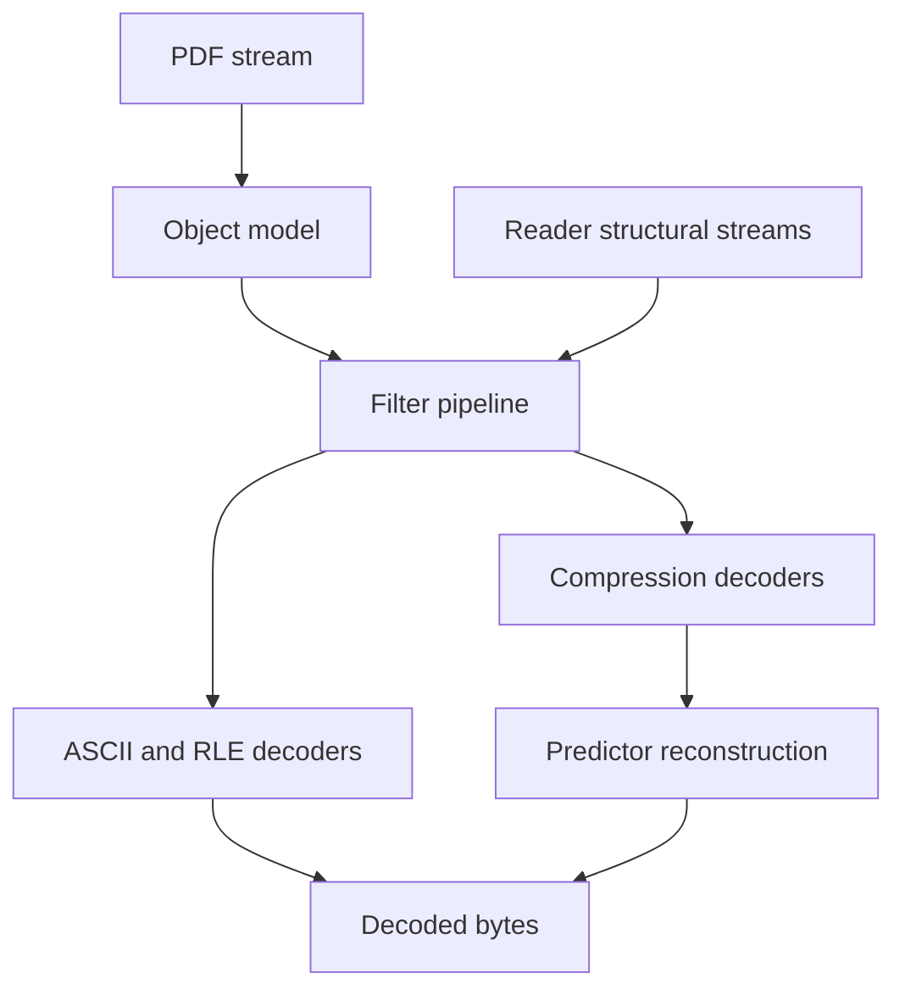
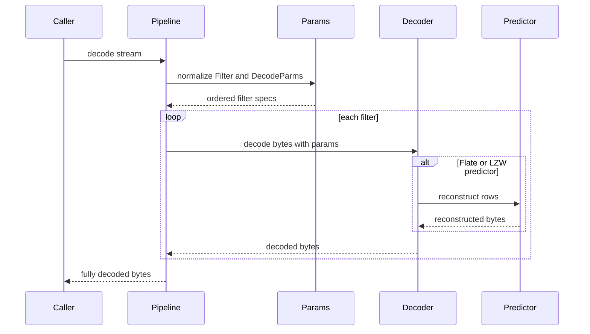
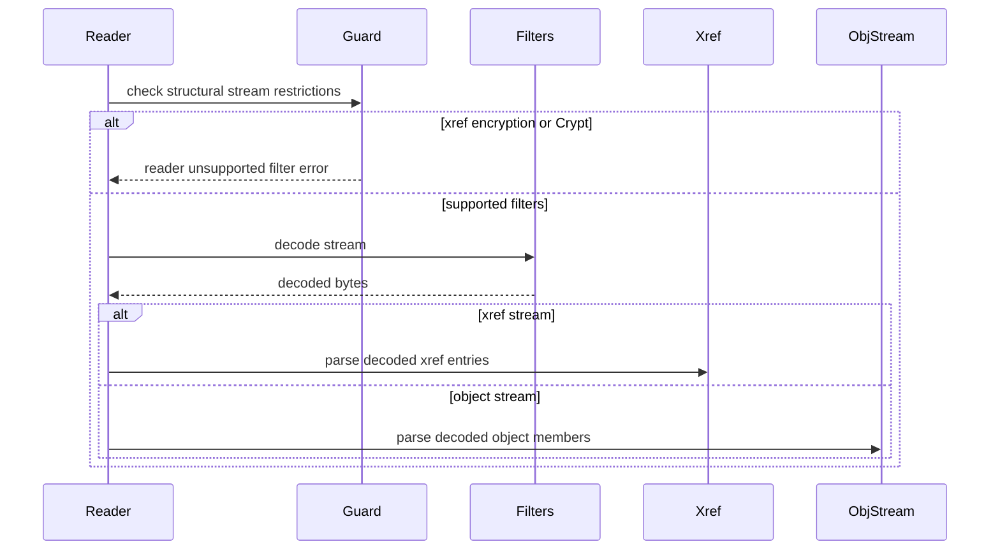

# Design Document

## Overview
This feature delivers ISO 32000-2:2020 section 7.4 stream filter decoding for the MoonBit `trkbt10/pdf` library. It converts encoded PDF stream bytes into decoded bytes through a type-safe filter pipeline covering ASCIIHexDecode, ASCII85Decode, FlateDecode, LZWDecode, and RunLengthDecode.

Library implementers and downstream reader/document layers use this package to decode structural streams now and content or image streams in later phases. The feature changes the current file-structure behavior by replacing explicit filter rejection for Flate-compressed xref and object streams with real decoding while preserving unsupported-filter failures for image and crypt filters.

### Goals
- Provide a reusable `src/filters` package that decodes stream bytes from a `Filter` and `DecodeParms` dictionary contract.
- Support chained filters, aligned decode parameters, shared Flate/LZW predictors, zlib/deflate decompression, LZW decompression, and byte-oriented ASCII/RLE filters.
- Integrate with `src/reader` so compressed cross-reference streams and object streams decode on demand.
- Return typed, descriptive errors that include the filter name and failure reason.

### Non-Goals
- PDF encryption, security handlers, or the `Crypt` filter.
- Image-specific filters: CCITTFaxDecode, JBIG2Decode, DCTDecode, and JPXDecode.
- PDF writing, stream encoding, compression, or recompression.
- Content stream operator parsing, image interpretation, color management, or rendering.
- Changing `PdfStream.data` from raw encoded bytes to decoded bytes.

## Boundary Commitments

### This Spec Owns
- The `src/filters` package and its public stream decode API.
- Normalization of `Filter` and `DecodeParms` entries into an ordered pipeline.
- Decoders for ASCIIHexDecode, ASCII85Decode, FlateDecode, LZWDecode, and RunLengthDecode.
- Shared Flate/LZW predictor parsing and reconstruction for `Predictor` values 1, 2, and 10 through 15.
- Pure MoonBit zlib container validation, DEFLATE decoding, LZW code-stream decoding, and RunLength decoding.
- Filter-level error categories and unsupported-filter diagnostics.
- Reader integration at the existing structural stream decode boundary.

### Out of Boundary
- Ownership of PDF object parsing, stream envelope parsing, stream `Length` validation, and `PdfStream` construction. Those remain in `objects`, `lexer`, and `parser`.
- Ownership of xref entry parsing, object-stream member extraction, lazy object loading, and reader cache behavior. Those remain in `reader`.
- Any change that treats raw `PdfStream.data` as already decoded.
- Any native zlib binding, vendored compression package, or non-standard-library runtime dependency.
- External file streams through `FFilter` and `FDecodeParms`.
- Decryption and crypt filter configuration from the encryption dictionary.

### Allowed Dependencies
- MoonBit standard library only.
- `src/filters` may import `trkbt10/pdf/src/objects` for `PdfDictionary`, `PdfObject`, `PdfName`, and `PdfStream`.
- `src/reader` may import `trkbt10/pdf/src/filters` for structural stream decoding.
- Dependency direction: `objects <- lexer <- parser`; `objects <- filters <- reader`; `parser <- reader`. No upstream package imports `filters` or `reader`.
- Local specification excerpts under `spec/extracted/7.3-objects.md`, `spec/extracted/7.4-filters.spec.txt`, and `spec/extracted/7.5-file-structure.md`.

### Revalidation Triggers
- Any public shape change to `PdfObject`, `PdfName`, `PdfDictionary`, or `PdfStream`.
- Any change to the raw-vs-decoded ownership of `PdfStream.data`.
- Any introduction of native compression bindings, external compression packages, or target-specific runtime prerequisites.
- Any reader error contract change beyond wrapping filter failures at stream decode call sites.
- Adding support for `Crypt`, CCITTFaxDecode, JBIG2Decode, DCTDecode, JPXDecode, `FFilter`, or `FDecodeParms`.
- Any change to predictor parameter semantics, row-width calculation, or LZW `EarlyChange` behavior.

## Architecture

### Existing Architecture Analysis
The repository already has `objects`, `lexer`, `parser`, and `reader` packages. `PdfStream` stores a dictionary and raw bytes read by `Length`; `reader` currently rejects filtered structural streams through `decode_structural_stream`. This feature adds `filters` as a reusable package between `objects` and `reader`, avoiding changes to parser semantics and keeping stream decoding out of file-structure parsing.

### Architecture Pattern & Boundary Map



**Architecture Integration**:
- Selected pattern: dedicated decoder package with a normalized pipeline. Dictionary interpretation happens once, then each decoder consumes and returns bytes.
- Domain boundaries: `filters` owns byte transformation; `reader` owns when structural streams are decoded; `parser` owns raw stream extraction.
- Existing patterns preserved: package-per-directory layout, standard-library-only implementation, typed `suberror` diagnostics, white-box tests for private algorithms, and `moon info` public API review.
- New components rationale: pipeline parsing, predictors, zlib/deflate, and LZW are independent enough to test separately but cohesive under one filter package.
- Steering compliance: byte-stream parsing, independent layer tests, and dependency direction are maintained without external dependencies.

### Technology Stack

| Layer | Choice / Version | Role in Feature | Notes |
|-------|------------------|-----------------|-------|
| Language | MoonBit, project toolchain | Filter implementation and public APIs | Use explicit structs, enums, `suberror`, and raised errors. |
| Data structures | Standard `Bytes`, `Array`, `Map` | Encoded input, decoded output, filter specs, LZW tables, Huffman tables | No external storage. |
| Parsing dependencies | `trkbt10/pdf/src/objects` | Stream dictionary and object model access | `filters` does not import parser or reader. |
| Compression | Pure MoonBit zlib and DEFLATE implementation | FlateDecode support | Covers decoding only; no encoder. |
| Build and test | `moon check`, `moon test`, `moon fmt`, `moon info` | Validation and public API review | `moon info` must show intended `filters` API and reader error additions. |

## File Structure Plan

### Directory Structure

```text
src/
├── filters/
│   ├── moon.pkg                  # Imports objects only
│   ├── types.mbt                 # FilterName, DecodeParams, FilterSpec, FilterPipeline
│   ├── error.mbt                 # PdfFilterError with filter name and reason
│   ├── pipeline.mbt              # Public decode_stream entry point and pipeline execution
│   ├── params.mbt                # Filter and DecodeParms dictionary normalization
│   ├── ascii_hex.mbt             # ASCIIHexDecode implementation
│   ├── ascii85.mbt               # ASCII85Decode implementation
│   ├── run_length.mbt            # RunLengthDecode implementation
│   ├── predictor.mbt             # TIFF and PNG predictor parameter parsing and reconstruction
│   ├── lzw.mbt                   # LZWDecode code table, bit reader, EarlyChange handling
│   ├── zlib.mbt                  # zlib header and Adler-32 validation
│   ├── deflate.mbt               # DEFLATE block loop and LZ77 copy handling
│   ├── huffman.mbt               # Fixed and dynamic Huffman table construction and decode
│   ├── bit_reader.mbt            # Bit-level reading helpers for LZW and DEFLATE
│   ├── pipeline_test.mbt         # Black-box public API pipeline tests
│   ├── ascii_hex_wbtest.mbt      # ASCIIHex edge cases and malformed input
│   ├── ascii85_wbtest.mbt        # ASCII85 groups, z, partial groups, malformed input
│   ├── run_length_wbtest.mbt     # literal runs, repeat runs, EOD, malformed runs
│   ├── predictor_wbtest.mbt      # Predictor parameter parsing and TIFF PNG reconstruction
│   ├── lzw_wbtest.mbt            # LZW vectors, clear EOD, code-width transitions, EarlyChange
│   └── flate_wbtest.mbt          # zlib, DEFLATE block types, Huffman, checksum and malformed data
├── reader/
│   ├── moon.pkg                  # Add filters import
│   ├── error.mbt                 # Add filter decode error wrapper
│   ├── stream_decode.mbt         # Delegate supported structural streams to filters
│   └── stream_decode_wbtest.mbt  # Update rejection and successful Flate structural stream tests
└── objects/
    └── no planned changes        # Revalidate if PdfStream or dictionary contracts change
```

### Modified Files
- `src/reader/moon.pkg` - Add `trkbt10/pdf/src/filters` import.
- `src/reader/error.mbt` - Add a reader error variant that preserves structural stream offset and the underlying `PdfFilterError`.
- `src/reader/stream_decode.mbt` - Keep xref encryption/Crypt guard, then call `@filters.decode_stream(stream)` for supported stream filters.
- `src/reader/stream_decode_wbtest.mbt` - Replace previous Flate rejection expectation with successful decode cases and retain unsupported/Crypt rejection tests.
- `src/reader/xref_stream_wbtest.mbt`, `src/reader/object_stream_wbtest.mbt`, `src/reader/public_api_wbtest.mbt` - Add compressed structural stream fixtures that exercise reader integration.
- `pkg.generated.mbti`, `src/reader/pkg.generated.mbti`, `src/filters/pkg.generated.mbti` - Generated or updated by `moon info` after implementation.

## System Flows

### Stream Decode Pipeline



The pipeline validates filter and parameter shapes before applying the first transform. Each transform receives only the bytes produced by the previous transform and its own optional parameter dictionary.

### Reader Structural Stream Integration



The reader remains authoritative for xref-specific encryption restrictions. The filter package remains authoritative for filter dictionary semantics and byte transformation failures.

## Requirements Traceability

| Requirement | Summary | Components | Interfaces | Flows |
|-------------|---------|------------|------------|-------|
| 1.1, 1.2, 1.3, 1.4, 1.5 | Single or chained filters with aligned DecodeParms return final decoded bytes | FilterPipeline, DecodeParamsParser, FilterSpec | `decode_stream`, `normalize_pipeline` | Stream Decode Pipeline |
| 2.1, 2.2, 2.3, 2.4 | ASCIIHex hex pairs, whitespace, odd final digit, and EOD marker | ASCIIHexDecoder | `decode_ascii_hex` | Stream Decode Pipeline |
| 3.1, 3.2, 3.3, 3.4, 3.5 | ASCII85 groups, `z`, final partial group, EOD marker, and whitespace | ASCII85Decoder | `decode_ascii85` | Stream Decode Pipeline |
| 4.1, 4.2, 4.3, 4.4, 4.5 | Flate zlib/deflate plus predictor reconstruction | ZlibDecoder, DeflateDecoder, HuffmanDecoder, Predictor | `decode_flate`, `apply_predictor` | Stream Decode Pipeline |
| 5.1, 5.2, 5.3, 5.4, 5.5 | LZW code stream, clear/EOD, width growth, predictors, EarlyChange | LZWDecoder, BitReader, Predictor | `decode_lzw`, `apply_predictor` | Stream Decode Pipeline |
| 6.1, 6.2, 6.3 | RunLength literal runs, repeat runs, and EOD | RunLengthDecoder | `decode_run_length` | Stream Decode Pipeline |
| 7.1, 7.2, 7.3 | Unsupported filters return descriptive name-bearing errors and never pass through silently | FilterPipeline, PdfFilterError, ReaderStreamDecoder | `PdfFilterError::UnsupportedFilter`, reader wrapper | Stream Decode Pipeline, Reader Structural Stream Integration |
| 8.1, 8.2, 8.3, 8.4 | Reader object streams and xref streams call filter decoder and propagate named failures | ReaderStreamDecoder, FilterPipeline, PdfReaderError wrapper | `decode_structural_stream`, `decode_stream` | Reader Structural Stream Integration |

## Components and Interfaces

| Component | Domain / Layer | Intent | Req Coverage | Key Dependencies | Contracts |
|-----------|----------------|--------|--------------|------------------|-----------|
| FilterPipeline | filters public API | Normalize dictionary entries and apply filters in order | 1.1, 1.2, 1.5, 7.3 | DecodeParamsParser P0, all decoders P0 | Service |
| DecodeParamsParser | filters model | Convert `Filter` and `DecodeParms` object shapes into typed specs | 1.1, 1.2, 1.3, 1.4 | objects.PdfDictionary P0 | Service, State |
| PdfFilterError | filters diagnostics | Report malformed data, invalid parameters, and unsupported filters with names | 7.1, 7.2, 7.3, 8.4 | objects.PdfName P1 | Service |
| ASCIIHexDecoder | filters decoder | Decode ASCII hexadecimal streams | 2.1, 2.2, 2.3, 2.4 | Byte helpers P0 | Service |
| ASCII85Decoder | filters decoder | Decode ASCII base-85 streams | 3.1, 3.2, 3.3, 3.4, 3.5 | Byte helpers P0 | Service |
| RunLengthDecoder | filters decoder | Decode byte-oriented run-length streams | 6.1, 6.2, 6.3 | Byte helpers P0 | Service |
| Predictor | filters postprocessor | Reconstruct TIFF and PNG predicted bytes after Flate or LZW | 4.2, 4.3, 4.4, 4.5, 5.4 | DecodeParams P0 | Service |
| LZWDecoder | filters compression | Decode PDF LZW code streams and apply predictor | 5.1, 5.2, 5.3, 5.4, 5.5 | BitReader P0, Predictor P0 | Service, State |
| ZlibDecoder | filters compression | Validate zlib wrapper and Adler-32 around DEFLATE payload | 4.1 | DeflateDecoder P0 | Service |
| DeflateDecoder | filters compression | Decode stored, fixed Huffman, and dynamic Huffman DEFLATE blocks | 4.1 | BitReader P0, HuffmanDecoder P0 | Service, State |
| HuffmanDecoder | filters compression | Build and read canonical Huffman code tables for DEFLATE | 4.1 | BitReader P0 | Service, State |
| BitReader | filters utility | Provide deterministic bit order readers for LZW and DEFLATE | 4.1, 5.1 | Bytes P0 | Service, State |
| ReaderStreamDecoder | reader integration | Apply filters to structural streams while preserving xref-specific restrictions | 8.1, 8.2, 8.3, 8.4 | filters.decode_stream P0, PdfReaderError P0 | Service |

### Filters Package

#### FilterPipeline

| Field | Detail |
|-------|--------|
| Intent | Public entry point that converts a stream dictionary and encoded bytes into fully decoded bytes. |
| Requirements | 1.1, 1.2, 1.3, 1.4, 1.5, 7.3 |

**Responsibilities & Constraints**
- Accept a `PdfStream` or an equivalent dictionary plus raw bytes without resolving indirect references.
- Apply filters in the exact order specified by the `Filter` entry.
- Treat a missing `Filter` entry as already decoded bytes.
- Reject malformed filter names, malformed parameter shapes, and unsupported filters before returning data.
- Preserve the invariant that each decoder owns one byte-to-byte transform and does not inspect later filters.

**Dependencies**
- Inbound: reader and future document/content stream consumers - stream decoding (P0).
- Outbound: DecodeParamsParser - normalized filter specs (P0).
- Outbound: individual decoders - byte transforms (P0).
- External: MoonBit standard `Bytes`, `Array`, `Map` - storage (P0).

**Contracts**: Service [x] / API [ ] / Event [ ] / Batch [ ] / State [ ]

##### Service Interface
```moonbit
pub fn decode_stream(stream : @objects.PdfStream) -> Bytes raise PdfFilterError
pub fn decode_stream_bytes(
  dict : @objects.PdfDictionary,
  data : Bytes,
) -> Bytes raise PdfFilterError
```
- Preconditions: `stream.data` or `data` contains the raw encoded bytes from the PDF stream object; `dict` is the direct stream dictionary produced by the parser.
- Postconditions: The returned `Bytes` are the result of every supported filter in order.
- Invariants: The input stream and dictionary are not mutated; unsupported filters never pass through as identity transforms.

**Implementation Notes**
- Integration: `decode_stream` delegates to `decode_stream_bytes` so reader and future callers can use either shape.
- Validation: Pipeline normalization must complete before the first transform is applied.
- Risks: If `DecodeParms` is an indirect reference, this package rejects it because it does not own object resolution.

#### DecodeParamsParser

| Field | Detail |
|-------|--------|
| Intent | Interpret stream dictionary filter entries into typed decoder inputs. |
| Requirements | 1.1, 1.2, 1.3, 1.4 |

**Responsibilities & Constraints**
- Support `Filter` as a single name or an array of names.
- Support `DecodeParms` as omitted, a dictionary for a single filter, or an array aligned to a filter array.
- Treat a `DecodeParms` array `Null` item as no parameters for that filter.
- Reject mismatched filter and parameter array lengths.

**Dependencies**
- Inbound: FilterPipeline - normalized specs (P0).
- Outbound: objects.PdfDictionary and PdfObject - source object shapes (P0).

**Contracts**: Service [x] / API [ ] / Event [ ] / Batch [ ] / State [x]

##### Service Interface
```moonbit
priv fn normalize_pipeline(
  dict : @objects.PdfDictionary,
) -> FilterPipeline raise PdfFilterError
```
- Preconditions: `dict` is the stream dictionary after parser null-normalization.
- Postconditions: Returns ordered specs, or an empty pipeline when `Filter` is absent.
- Invariants: Every `FilterSpec` has exactly one `FilterName` and at most one parameter dictionary.

#### PdfFilterError

| Field | Detail |
|-------|--------|
| Intent | Provide typed filter diagnostics with enough context for callers to identify the failing filter. |
| Requirements | 7.1, 7.2, 7.3, 8.4 |

**Responsibilities & Constraints**
- Include the filter name for unsupported and decoder-specific failures.
- Distinguish malformed dictionary shape, invalid decode parameters, malformed encoded data, and unsupported filter names.
- Avoid reader offsets; callers that own file offsets wrap this error.

**Dependencies**
- Inbound: every decoder and pipeline parser - failure reporting (P0).
- Outbound: MoonBit `suberror` - typed raised error (P0).

**Contracts**: Service [x] / API [ ] / Event [ ] / Batch [ ] / State [ ]

##### Service Interface
```moonbit
pub(all) suberror PdfFilterError {
  InvalidFilterSpec(String)
  InvalidDecodeParms(String, String)
  UnsupportedFilter(String)
  DecodeError(String, String)
}
```
- Preconditions: The first string for filter-specific variants is the PDF filter name as text.
- Postconditions: Callers can format errors without inspecting raw dictionary values.
- Invariants: `UnsupportedFilter` is used only for known but unimplemented or unknown filter names.

### Byte-Oriented Decoders

#### ASCIIHexDecoder

| Field | Detail |
|-------|--------|
| Intent | Convert ASCII hexadecimal bytes to binary bytes. |
| Requirements | 2.1, 2.2, 2.3, 2.4 |

**Responsibilities & Constraints**
- Ignore PDF white-space bytes.
- Stop at `>` and ignore bytes after EOD only at the stream-filter level.
- Pad an odd final hex digit with zero.
- Reject non-hex, non-whitespace, non-EOD bytes before EOD.

**Dependencies**
- Inbound: FilterPipeline - ASCIIHexDecode stage (P0).
- Outbound: PdfFilterError - malformed data (P0).

**Contracts**: Service [x] / API [ ] / Event [ ] / Batch [ ] / State [ ]

##### Service Interface
```moonbit
priv fn decode_ascii_hex(data : Bytes) -> Bytes raise PdfFilterError
```
- Preconditions: `data` is the encoded ASCIIHex stream data.
- Postconditions: Returns decoded binary bytes up to the first EOD marker.
- Invariants: Output length is `ceil(hex_digit_count / 2)`.

#### ASCII85Decoder

| Field | Detail |
|-------|--------|
| Intent | Convert ASCII base-85 encoded bytes to binary bytes. |
| Requirements | 3.1, 3.2, 3.3, 3.4, 3.5 |

**Responsibilities & Constraints**
- Decode complete five-character groups into four bytes.
- Treat `z` only as an abbreviation for a whole zero group outside a partial group.
- Decode a final partial group by padding with `u` and emitting `group_length - 1` bytes.
- Stop only at `~>` and reject malformed `~` sequences.
- Reject impossible base-85 values above `2^32 - 1`.

**Dependencies**
- Inbound: FilterPipeline - ASCII85Decode stage (P0).
- Outbound: PdfFilterError - malformed data (P0).

**Contracts**: Service [x] / API [ ] / Event [ ] / Batch [ ] / State [ ]

##### Service Interface
```moonbit
priv fn decode_ascii85(data : Bytes) -> Bytes raise PdfFilterError
```
- Preconditions: `data` is the encoded ASCII85 stream data.
- Postconditions: Returns decoded binary bytes up to `~>`.
- Invariants: `z` never appears inside a non-empty group; final partial group length is 2 through 4 encoded chars.

#### RunLengthDecoder

| Field | Detail |
|-------|--------|
| Intent | Decode PDF byte-oriented run-length streams. |
| Requirements | 6.1, 6.2, 6.3 |

**Responsibilities & Constraints**
- Copy `length + 1` literal bytes for length bytes 0 through 127.
- Repeat one following byte `257 - length` times for length bytes 129 through 255.
- Stop at length byte 128.
- Reject truncated literal or repeat runs.

**Dependencies**
- Inbound: FilterPipeline - RunLengthDecode stage (P0).
- Outbound: PdfFilterError - malformed runs (P0).

**Contracts**: Service [x] / API [ ] / Event [ ] / Batch [ ] / State [ ]

##### Service Interface
```moonbit
priv fn decode_run_length(data : Bytes) -> Bytes raise PdfFilterError
```
- Preconditions: `data` is encoded RunLengthDecode stream data.
- Postconditions: Returns decoded bytes up to EOD.
- Invariants: No bytes after EOD affect output.

### Compression Decoders

#### Predictor

| Field | Detail |
|-------|--------|
| Intent | Apply PDF TIFF and PNG predictor reconstruction after Flate or LZW decompression. |
| Requirements | 4.2, 4.3, 4.4, 4.5, 5.4 |

**Responsibilities & Constraints**
- Parse defaults: `Predictor = 1`, `Colors = 1`, `BitsPerComponent = 8`, `Columns = 1`.
- Support `Predictor` 1, 2, and 10 through 15.
- For PNG predictors, consume one filter byte per row and support row filter types 0 through 4.
- Calculate row bytes as `ceil(Colors * BitsPerComponent * Columns / 8)`.
- Reject unsupported predictor values and inconsistent row lengths.

**Dependencies**
- Inbound: FlateDecoder and LZWDecoder - post-decompression reconstruction (P0).
- Outbound: DecodeParams - parameter access (P0).

**Contracts**: Service [x] / API [ ] / Event [ ] / Batch [ ] / State [ ]

##### Service Interface
```moonbit
priv fn apply_predictor(
  filter_name : String,
  data : Bytes,
  params : DecodeParams,
) -> Bytes raise PdfFilterError
```
- Preconditions: `data` is fully decompressed but still predictor-encoded.
- Postconditions: Returns reconstructed bytes according to `Predictor`.
- Invariants: Predictor 1 returns the decompressed bytes unchanged.

#### LZWDecoder

| Field | Detail |
|-------|--------|
| Intent | Decode PDF LZW code streams and apply optional predictor reconstruction. |
| Requirements | 5.1, 5.2, 5.3, 5.4, 5.5 |

**Responsibilities & Constraints**
- Read high-order-bit-first codes from 9 to 12 bits.
- Initialize fixed codes 0 through 257, require clear-table startup, and recognize clear code 256 and EOD code 257.
- Add table entries according to the previous sequence plus first byte of the current sequence.
- Implement `EarlyChange` default 1 and accepted values 0 or 1.
- Reject table overflow, missing EOD, invalid codes, and unsupported `EarlyChange` values.

**Dependencies**
- Inbound: FilterPipeline - LZWDecode stage (P0).
- Outbound: BitReader - code extraction (P0).
- Outbound: Predictor - optional reconstruction (P0).

**Contracts**: Service [x] / API [ ] / Event [ ] / Batch [ ] / State [x]

##### Service Interface
```moonbit
priv fn decode_lzw(
  data : Bytes,
  params : DecodeParams,
) -> Bytes raise PdfFilterError
```
- Preconditions: `data` is a PDF LZW code stream.
- Postconditions: Returns decoded and predictor-reconstructed bytes.
- Invariants: Code width never exceeds 12 bits; code table never exceeds 4096 entries.

#### ZlibDecoder and DeflateDecoder

| Field | Detail |
|-------|--------|
| Intent | Decode zlib-wrapped DEFLATE data for FlateDecode. |
| Requirements | 4.1, 4.2 |

**Responsibilities & Constraints**
- Validate zlib CMF/FLG, compression method, window-size constraints, and check bits.
- Reject preset dictionary streams because this spec has no external dictionary contract.
- Decode DEFLATE stored, fixed Huffman, and dynamic Huffman blocks.
- Enforce distance references only to already produced bytes.
- Validate Adler-32 over the uncompressed DEFLATE output.
- Apply predictor reconstruction after successful decompression.

**Dependencies**
- Inbound: FilterPipeline - FlateDecode stage (P0).
- Outbound: BitReader and HuffmanDecoder - DEFLATE parsing (P0).
- Outbound: Predictor - optional reconstruction (P0).

**Contracts**: Service [x] / API [ ] / Event [ ] / Batch [ ] / State [x]

##### Service Interface
```moonbit
priv fn decode_flate(
  data : Bytes,
  params : DecodeParams,
) -> Bytes raise PdfFilterError
```
- Preconditions: `data` is zlib-wrapped DEFLATE stream data.
- Postconditions: Returns decompressed and predictor-reconstructed bytes.
- Invariants: Checksum mismatch, invalid block structure, and invalid Huffman tables are decode errors.

### Reader Integration

#### ReaderStreamDecoder

| Field | Detail |
|-------|--------|
| Intent | Decode reader structural streams through `filters` while preserving file-structure restrictions. |
| Requirements | 8.1, 8.2, 8.3, 8.4, 7.1, 7.2 |

**Responsibilities & Constraints**
- Keep xref stream encryption dictionary rejection before general decoding.
- Keep `Crypt` rejection for structural streams.
- Delegate all supported filters to `@filters.decode_stream`.
- Wrap `PdfFilterError` with structural stream offset so reader callers can report file context.

**Dependencies**
- Inbound: XrefStreamParser and ObjectStreamReader - decoded structural bytes (P0).
- Outbound: filters.decode_stream - stream decoding (P0).
- Outbound: PdfReaderError - reader-facing failure (P0).

**Contracts**: Service [x] / API [ ] / Event [ ] / Batch [ ] / State [ ]

##### Service Interface
```moonbit
fn decode_structural_stream(
  stream : @objects.PdfStream,
  purpose : StructuralStreamPurpose,
  offset~ : Int64,
) -> Bytes raise PdfReaderError
```
- Preconditions: `stream` is the parsed xref or object stream object and `offset` is its PDF offset.
- Postconditions: Returns decoded bytes or raises a reader error that includes offset and filter failure detail.
- Invariants: Xref streams with encryption or Crypt filters never reach the general filter decoder.

## Data Models

### Domain Model
- `FilterPipeline` is an ordered list of `FilterSpec` values.
- `FilterSpec` pairs one `FilterName` with optional `DecodeParams`.
- `DecodeParams` is a typed view over the optional parameter dictionary with defaults applied at component boundaries.
- `PdfFilterError` is the only error type raised by `src/filters`.

### Logical Data Model

```moonbit
priv enum FilterName {
  ASCIIHexDecode
  ASCII85Decode
  FlateDecode
  LZWDecode
  RunLengthDecode
  Unsupported(String)
}

priv struct DecodeParams {
  predictor : Int
  colors : Int
  bits_per_component : Int
  columns : Int
  early_change : Int
  raw : @objects.PdfDictionary?
}

priv struct FilterSpec {
  name : FilterName
  params : DecodeParams
}

priv type FilterPipeline = Array[FilterSpec]
```

**Consistency & Integrity**
- Default parameter values are applied when a decoder requests typed parameters, not when a parameter dictionary is absent.
- Malformed parameters raise before algorithm-specific decoding continues.
- Every unsupported or unknown name is represented explicitly and raises `UnsupportedFilter(name)`.

### Data Contracts & Integration
- Input contract: `PdfStream.dict` contains direct PDF objects from parser; `PdfStream.data` contains raw encoded bytes.
- Output contract: `Bytes` returned by `decode_stream` are fully decoded for all supported filters in the chain.
- Reader contract: `decode_structural_stream` maps filter package failures to `PdfReaderError` without changing xref/object stream parsing APIs.

## Error Handling

### Error Strategy
Filter errors fail fast and include the filter name whenever a specific filter is responsible. Pipeline-shape errors use `InvalidFilterSpec` when no single decoder owns the fault. Reader integration wraps filter errors with the structural stream offset.

### Error Categories and Responses
- Invalid filter specification: malformed `Filter` or `DecodeParms` object shape, mismatched arrays, or indirect parameters where direct dictionaries are required.
- Invalid decode parameters: unsupported predictor, invalid `Colors`, invalid `BitsPerComponent`, invalid `Columns`, or invalid `EarlyChange`.
- Malformed encoded data: bad ASCII characters, missing EOD where required, truncated run, invalid LZW code, invalid zlib header, invalid DEFLATE block, or checksum mismatch.
- Unsupported filters: CCITTFaxDecode, JBIG2Decode, DCTDecode, JPXDecode, Crypt, and unknown names.
- Reader structural failures: xref encryption/Crypt rejection stays `PdfReaderError`; other filter failures are wrapped with stream offset.

### Monitoring
There is no runtime telemetry layer in this library. Tests assert exact error variants, filter names, and relevant reasons. Future CLI/application integrations can format `PdfFilterError` or wrapped `PdfReaderError` without changing decoding semantics.

## Testing Strategy

- Unit Tests: `ascii_hex_wbtest.mbt` covers hex pairs, whitespace, odd digit padding, EOD, invalid characters, and missing EOD behavior per 2.1 through 2.4.
- Unit Tests: `ascii85_wbtest.mbt` covers five-character groups, `z`, partial groups, `~>` EOD, whitespace, impossible values, and invalid `z` placement per 3.1 through 3.5.
- Unit Tests: `run_length_wbtest.mbt` covers literal runs, repeat runs, EOD, truncated literals, and truncated repeat runs per 6.1 through 6.3.
- Unit Tests: `lzw_wbtest.mbt` covers clear-table startup, EOD, 9-to-12-bit transitions, table reset, special current-code case, `EarlyChange` 0 and 1, predictor handoff, and malformed codes per 5.1 through 5.5.
- Unit Tests: `flate_wbtest.mbt` covers zlib header validation, stored blocks, fixed Huffman blocks, dynamic Huffman blocks, back-references, Adler-32 mismatch, and predictor handoff per 4.1 through 4.5.
- Unit Tests: `predictor_wbtest.mbt` covers predictor defaults, TIFF predictor 2, PNG filter bytes 0 through 4, row width from `Columns`, `Colors`, `BitsPerComponent`, and invalid row lengths per 4.2 through 4.5 and 5.4.
- Integration Tests: `pipeline_test.mbt` covers single-name filter, filter array order, dictionary `DecodeParms`, array `DecodeParms`, null parameter entries, mismatched arrays, and unsupported names per 1.1 through 1.5 and 7.1 through 7.3.
- Integration Tests: reader white-box tests cover FlateDecode xref streams, FlateDecode object streams, filter-chain failure propagation, filter name preservation, and Crypt rejection per 8.1 through 8.4.
- Performance/Load: tests cover large RunLength repeat expansion, LZW table limit 4096, DEFLATE repeated distance copy, and bounded rejection of invalid dynamic Huffman tables.

## Security Considerations
- The `Crypt` filter remains unsupported and is never treated as identity.
- Xref streams with encryption indicators remain rejected at the reader boundary before filter decoding.
- DEFLATE distance references are validated against produced output to avoid reading uninitialized bytes.
- Decoders reject malformed input rather than attempting repair or resynchronization.

## Performance & Scalability
- Decoding is eager per stream because downstream parser components require complete decoded bytes for xref and object stream interpretation.
- Each filter stage owns a new `Bytes` result; the pipeline does not mutate `PdfStream.data`.
- LZW table size is capped at 4096 entries by the PDF format.
- DEFLATE output grows through validated literal and back-reference writes; invalid references fail immediately.
- Predictor reconstruction operates row-by-row and keeps only the previous row plus current output row state.
