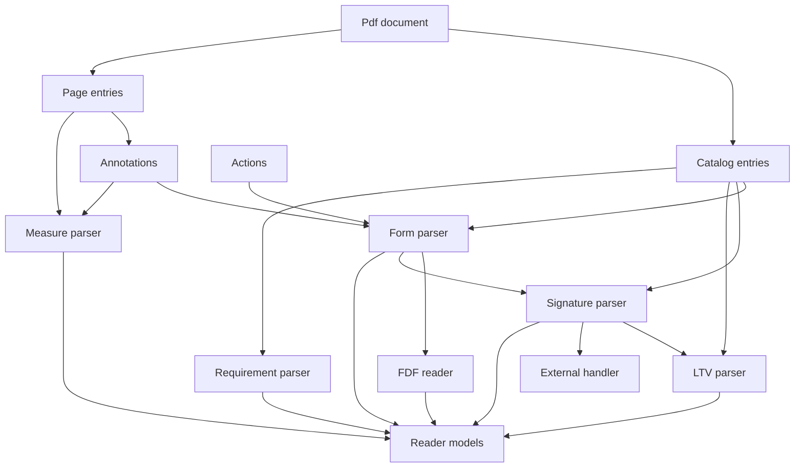
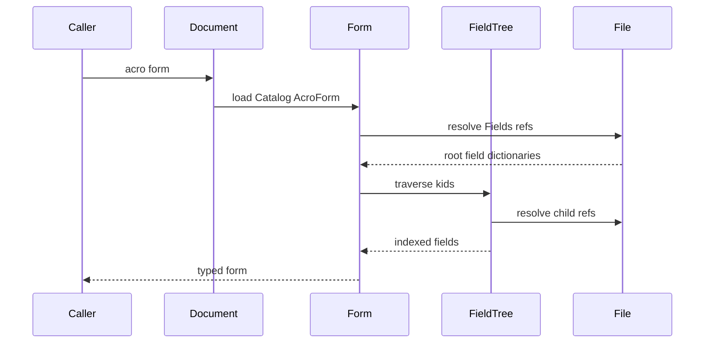
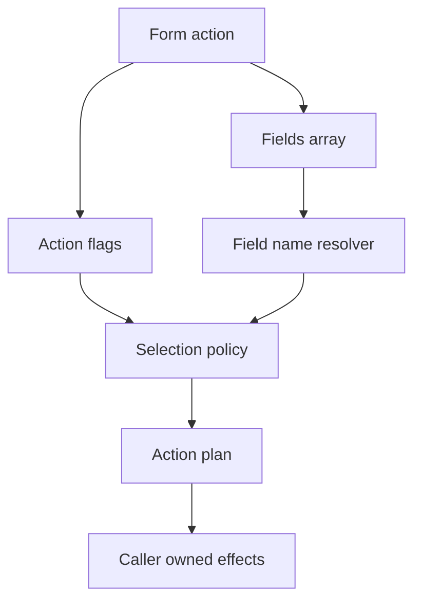
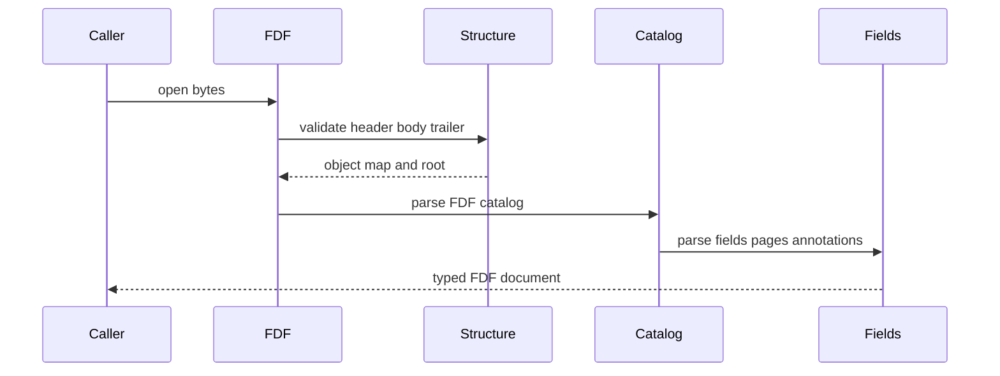
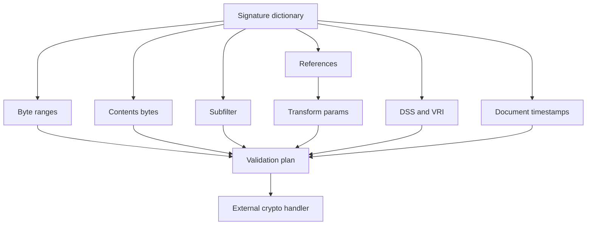
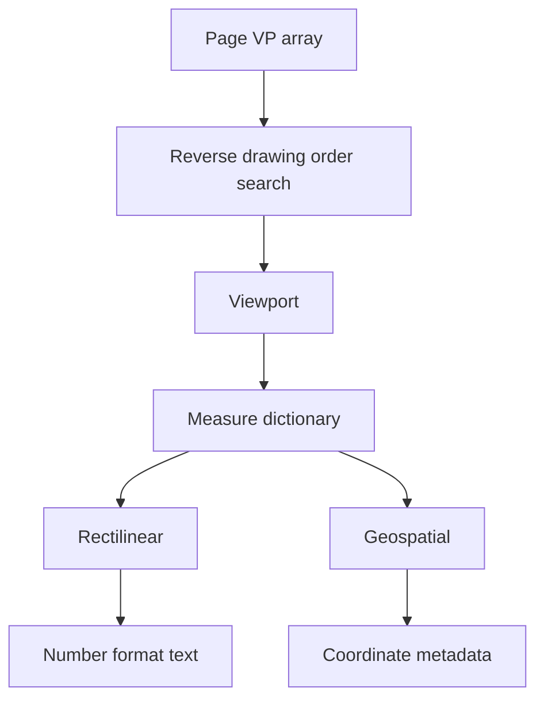
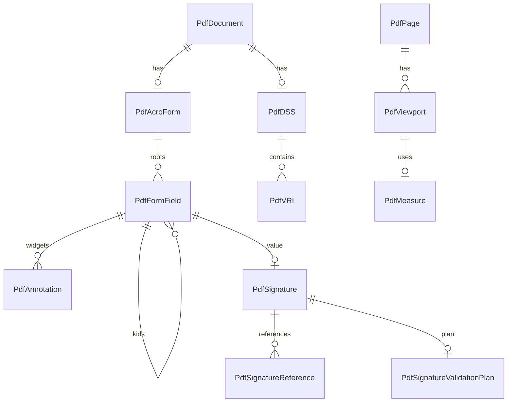

# Design Document

## Overview

This feature delivers structural reader support for ISO 32000-2:2020 clauses 12.7 through 12.11 in the MoonBit `trkbt10/pdf` parser library. It extends `src/reader` with typed access to AcroForm field trees, FDF files, form actions, signature dictionaries, long-term validation metadata, permissions, legal attestations, measurement dictionaries, geospatial descriptors, and Catalog requirement dictionaries.

The implementation keeps the library in parser mode. It exposes document-owned structure and deterministic validation plans, but it does not fill forms, regenerate appearances, submit network requests, write FDF/PDF output, execute ECMAScript, validate cryptographic trust, or transform geospatial coordinates.

### Goals
- Expose the Catalog `AcroForm` dictionary as a typed field tree with inherited field attributes, fully qualified field names, field flags, values, variable text descriptors, and widget links.
- Replace the current raw submit, reset, import, widget, measurement, and signature boundaries with typed structural parsers while keeping existing raw hand-off fields available where adjacent behavior is out of scope.
- Add an FDF reader for caller-provided FDF bytes, including FDF catalog, fields, pages, annotations, JavaScript descriptors, embedded FDF references, and difference streams.
- Expose PDF-owned signature structures and validation plans: byte ranges, signature references, DocMDP, FieldMDP, UR, PAdES metadata, DSS, VRI, document timestamps, permissions, and legal attestations.
- Parse viewport, rectilinear measure, geospatial measure, point data, and Catalog requirement dictionaries without adding external dependencies.

### Non-Goals
- PDF writing, incremental update generation, FDF writing, form filling, appearance stream regeneration, template instantiation, or document mutation.
- Network transport for submit actions, URL fetching, file-system import, HTTP encoding, XFDF generation, or MIME handling.
- ECMAScript execution, calculate/validate/format action effects, UI event dispatch, focus handling, or interactive processor state.
- Built-in CMS, CAdES, PAdES, PKIX, OCSP, CRL, RFC 3161 timestamp, digest, trust-store, or certificate-path validation.
- Encryption, decryption, encrypted embedded FDF processing, permission enforcement runtime, or security-handler behavior.
- GIS projection, EPSG lookup, WKT interpretation, geospatial coordinate conversion, or rendering measurements on a page.

## Boundary Commitments

### This Spec Owns
- Public reader APIs for AcroForm access from `PdfDocument`, including field tree enumeration, field-name lookup, inherited attribute resolution, field type classification, widgets, and form calculation order metadata.
- Public models for button, text, choice, and signature field dictionaries, including common and field-specific flags.
- Public models for variable text descriptors and default appearance metadata as parser data, not as generated appearance streams.
- Typed form action structures for submit, reset, and import actions, plus deterministic field-selection plans that do not mutate or transmit data.
- FDF parsing from caller-supplied bytes into typed catalog, FDF dictionary, fields, pages, templates, named page references, annotations, JavaScript descriptors, and raw difference streams.
- PDF-specific digital signature structures: signature dictionaries, seed values, certificate seed values, signature references, transform parameters, byte ranges, permission dictionaries, DSS, VRI, document timestamps, and legal attestations.
- Signature validation-plan contracts that gather byte slices and PDF-owned metadata for an external cryptographic handler.
- Page viewport, measure, rectilinear number-format, geospatial descriptor, point-data, annotation-measure, and Catalog requirement parsing.
- Reader-layer diagnostics for malformed forms, FDF, signatures, LTV data, measurement data, and requirement dictionaries.

### Out of Boundary
- Low-level PDF object syntax, xref, object-stream, stream-filter, and raw `PdfObject` semantics already owned by upstream packages.
- Rendering form widgets, calculating text layout, updating appearance streams, or interpreting default appearance operators beyond structural validation and raw storage.
- Form value mutation, reset execution, import application, submit serialization, HTTP GET/POST, XFDF, HTML form encoding, or PDF submission.
- Cryptographic proof of trust, ASN.1 parsing, CMS signature validation, digest computation, certificate path validation, revocation checking, timestamp validation, and policy enforcement.
- Validation of signed document modifications beyond exposing transform parameters, signed byte ranges, revision ordering inputs, and handler work items.
- GIS transformation or coordinate-system math from EPSG/WKT to page/object coordinates.
- Enforcement of Catalog requirements, encryption requirements, usage rights, DocMDP permissions, or FieldMDP locks.

### Allowed Dependencies
- MoonBit standard library only.
- Existing package direction remains unchanged: `objects`, `lexer`, `parser`, `filters`, `content`, and `graphics` stay upstream of `reader`.
- Existing `PdfDocument`, `PdfCatalog`, `PdfPage`, `PdfFile::open`, `PdfFile::load_object`, `PdfFile::trailer`, `PdfObject`, `PdfDictionary`, `PdfName`, `PdfStream`, `ObjectId`, `PdfAnnotation`, `PdfAction`, `PdfDocumentError`, name-tree, and page-tree contracts.
- Local extracted source text: `spec/extracted/12.7-12.11-forms-signatures.spec.txt`.
- Stable external standards may be referenced only as handler contract vocabulary: RFC 5652, RFC 5280, RFC 6960, RFC 3161, RFC 5816, RFC 5035, ETSI EN 319 122, and ETSI EN 319 142.

### Revalidation Triggers
- Any public shape change to `PdfDocument`, `PdfCatalog`, `PdfPage`, `PdfFile`, `PdfObject`, `PdfDictionary`, `PdfName`, `PdfStream`, `ObjectId`, `PdfAnnotation`, `PdfAction`, or `PdfDocumentError`.
- Any addition of non-standard-library dependencies, cryptographic libraries, GIS/projection libraries, network libraries, or filesystem APIs.
- Any decision to move forms, FDF, signatures, or measurement parsing out of `src/reader`.
- Any future form writer, PDF writer, appearance generator, JavaScript runtime, encryption feature, permission enforcement layer, or built-in signature validator.
- Any change to xref merge, incremental update, raw byte storage, stream decoding, or object-loading behavior that affects signature byte ranges, FDF parsing, DSS streams, or document timestamp evidence.

## Architecture

### Existing Architecture Analysis

`src/reader` already owns document-level interpretation: Catalog resolution, Page tree traversal, name trees, annotations, actions, optional content, graphics entry points, and lazy indirect-object loading. The existing annotation parser preserves widget form data and `Measure` entries raw, and the existing action parser preserves submit/reset/import form action payloads in `PdfFormActionRaw`.

Forms, signatures, measurement dictionaries, and Catalog requirements all need private access to `PdfDocument.file`, lazy object resolution, page identity, annotation raw fields, action raw payloads, and Catalog entries. Therefore this feature remains a focused reader-layer structural extension rather than introducing new downstream packages.

### Architecture Pattern & Boundary Map



**Architecture Integration**:
- Selected pattern: reader-layer structural extension with handler boundaries for cryptography and GIS.
- Domain boundaries: `reader` owns PDF dictionary structure and reference traversal; external handlers own cryptographic validation, network effects, JavaScript, writing, and geospatial transformation.
- Existing patterns preserved: standard-library-only implementation, package-local files, `pub(all)` externally inspectable enums, `pub struct` readable records, `suberror` diagnostics, `///|` blocks, lazy indirect loading, and white-box tests.
- Steering compliance: byte-oriented parsing and lazy object access are preserved. No external dependency is introduced.

### Technology Stack

| Layer | Choice / Version | Role in Feature | Notes |
|-------|------------------|-----------------|-------|
| Language | MoonBit project toolchain | Typed models and parser APIs | Use explicit structs, enums, `suberror`, and raised errors. |
| Object model | `trkbt10/pdf/src/objects` | Names, strings, arrays, dictionaries, streams, refs, and raw values | No object-model changes. |
| File/document access | `trkbt10/pdf/src/reader` | Catalog, pages, annotations, actions, xref-backed object loading | Primary implementation package. |
| Content/graphics descriptors | Existing `content` and `graphics` imports | Raw appearance and resource boundaries | No rendering or content execution. |
| Crypto/GIS | External handler contracts only | Signature trust and coordinate conversion | No built-in dependency in this spec. |
| Validation | `moon check`, `moon test`, `moon fmt`, `moon info` | Type checking, tests, formatting, public API review | `moon info` must show intended `src/reader` API additions only. |

## File Structure Plan

### Directory Structure

```text
src/
├── reader/
│   ├── document_types.mbt                  # Add public forms, FDF, signature, measure, and requirement models
│   ├── document_error.mbt                  # Add InvalidForm, InvalidFDF, InvalidSignature, InvalidMeasure, InvalidRequirement variants
│   ├── catalog.mbt                         # Add small Catalog entry helpers for AcroForm, Perms, Legal, DSS, Requirements
│   ├── actions.mbt                         # Preserve typed action API; form actions delegate to form action parsing
│   ├── action_types.mbt                    # Replace PdfFormActionRaw payload shape with typed form action models compatibly
│   ├── action_external.mbt                 # Parse SubmitForm, ResetForm, ImportData into form action structures
│   ├── annotations.mbt                     # Preserve widget and Measure raw fields; expose bridge helpers for forms and measures
│   ├── name_dictionary.mbt                 # Reuse Pages and Templates name-tree categories for named pages
│   ├── forms_types.mbt                     # Package-local organization for form model declarations if document_types grows too large
│   ├── forms.mbt                           # Public PdfDocument::acro_form, fields, field lookup, field selection plans
│   ├── form_field_tree.mbt                 # Field dictionary traversal, inheritance, fully qualified names, cycle checks
│   ├── form_field_types.mbt                # Button, text, choice, signature-field parsing and flag decoding
│   ├── form_variable_text.mbt              # DA, Q, DS, RV, DR descriptors and defaulting checks
│   ├── form_actions.mbt                    # Submit, reset, import action parsing and deterministic field-selection plans
│   ├── fdf_types.mbt                       # FDF public model declarations if document_types grows too large
│   ├── fdf.mbt                             # Public PdfFDF::open and top-level FDF catalog access
│   ├── fdf_file_structure.mbt              # FDF header, object body, optional xref, trailer, root validation
│   ├── fdf_catalog.mbt                     # FDF catalog, FDF dictionary, JavaScript, embedded FDF descriptors
│   ├── fdf_fields.mbt                      # FDF fields, icon fit, AP, APRef, SetFf, ClrFf, SetF, ClrF
│   ├── fdf_pages.mbt                       # FDF pages, templates, named page references, rename flag
│   ├── fdf_annotations.mbt                 # FDF annotation dictionaries and Page requirement
│   ├── signatures_types.mbt                # Signature public model declarations if document_types grows too large
│   ├── signatures.mbt                      # Public signature enumeration, signature fields, byte ranges, validation plans
│   ├── signature_seed_values.mbt           # SV and certificate seed value dictionaries
│   ├── signature_transforms.mbt            # Signature reference, DocMDP, FieldMDP, UR transform parameters
│   ├── signature_ltv.mbt                   # DSS, VRI, validation evidence ordering, document timestamps
│   ├── permissions.mbt                     # Catalog Perms, DocMDP, UR3, legal attestation parsing
│   ├── requirements.mbt                    # Catalog Requirements and support assessment metadata
│   ├── measurement_types.mbt               # Measure public model declarations if document_types grows too large
│   ├── measurement.mbt                     # Page VP, annotation Measure, rectilinear measure, number format algorithm
│   ├── geospatial.mbt                      # GEO measure, GCS, DCS, EPSG, WKT, point data structural parsing
│   ├── forms_wbtest.mbt                    # AcroForm, field tree, inheritance, qualified names, widget links
│   ├── form_field_types_wbtest.mbt         # Button, text, choice, signature field flags and malformed cases
│   ├── form_actions_wbtest.mbt             # Submit, reset, import actions and field-selection plans
│   ├── fdf_wbtest.mbt                      # FDF header, body, trailer, catalog, field and page tests
│   ├── signatures_wbtest.mbt               # Signature dictionaries, byte ranges, refs, seed values, validation plan tests
│   ├── signature_ltv_wbtest.mbt            # DSS, VRI, timestamp, evidence ordering tests
│   ├── permissions_wbtest.mbt              # Perms, DocMDP, UR3, legal attestation tests
│   ├── measurement_wbtest.mbt              # VP selection, measure dictionaries, number formatting tests
│   ├── geospatial_wbtest.mbt               # GEO, GCS, DCS, point data structural tests
│   ├── requirements_wbtest.mbt             # Catalog Requirements parsing and support assessment tests
│   └── pkg.generated.mbti                  # Regenerate with moon info after public API additions
└── objects/
    └── no planned changes                  # Revalidate if PdfObject, PdfName, PdfDictionary, PdfStream, or ObjectId changes
```

### Modified Files
- `src/reader/document_types.mbt` - Add public model surface. If file size becomes difficult to review, place declarations in the listed `*_types.mbt` files inside the same package.
- `src/reader/document_error.mbt` - Add domain-specific diagnostics while preserving existing variants.
- `src/reader/catalog.mbt` - Add helper methods for `AcroForm`, `Perms`, `Legal`, `DSS`, and `Requirements`.
- `src/reader/actions.mbt`, `src/reader/action_types.mbt`, `src/reader/action_external.mbt` - Promote form actions from raw payloads to typed form action structures while retaining raw dictionaries.
- `src/reader/annotations.mbt` - Add bridge helpers for widget form dictionaries and `Measure` entries without changing existing annotation enumeration semantics.
- `src/reader/pkg.generated.mbti` - Regenerate and review intended public API additions with `moon info`.
- `src/reader/moon.pkg` - No planned dependency change.

### Component to File Mapping

| Component | Primary Files |
|-----------|---------------|
| AcroFormReader | `src/reader/forms.mbt`, `src/reader/forms_types.mbt`, `src/reader/forms_wbtest.mbt` |
| FormModel | `src/reader/document_types.mbt`, `src/reader/forms_types.mbt` |
| FieldTreeResolver | `src/reader/form_field_tree.mbt`, `src/reader/forms_wbtest.mbt` |
| FieldAttributeResolver | `src/reader/form_field_tree.mbt`, `src/reader/forms_wbtest.mbt` |
| FieldNameIndex | `src/reader/form_field_tree.mbt`, `src/reader/forms_wbtest.mbt` |
| FieldTypeParser | `src/reader/form_field_types.mbt`, `src/reader/form_field_types_wbtest.mbt` |
| ButtonFieldParser | `src/reader/form_field_types.mbt`, `src/reader/form_field_types_wbtest.mbt` |
| TextFieldParser | `src/reader/form_field_types.mbt`, `src/reader/form_field_types_wbtest.mbt` |
| ChoiceFieldParser | `src/reader/form_field_types.mbt`, `src/reader/form_field_types_wbtest.mbt` |
| SignatureFieldParser | `src/reader/form_field_types.mbt`, `src/reader/signatures.mbt`, `src/reader/signatures_wbtest.mbt` |
| SignatureSeedParser | `src/reader/signature_seed_values.mbt`, `src/reader/signatures_wbtest.mbt` |
| VariableTextParser | `src/reader/form_variable_text.mbt`, `src/reader/forms_wbtest.mbt` |
| WidgetBridge | `src/reader/annotations.mbt`, `src/reader/forms.mbt`, `src/reader/forms_wbtest.mbt` |
| FormActionParser | `src/reader/form_actions.mbt`, `src/reader/action_external.mbt`, `src/reader/form_actions_wbtest.mbt` |
| FieldSelectionPlanner | `src/reader/form_actions.mbt`, `src/reader/form_actions_wbtest.mbt` |
| NamedPageReader | `src/reader/name_dictionary.mbt`, `src/reader/fdf_pages.mbt`, `src/reader/fdf_wbtest.mbt` |
| NonInteractiveMarker | `src/reader/forms.mbt`, `src/reader/forms_wbtest.mbt` |
| FDFReader | `src/reader/fdf.mbt`, `src/reader/fdf_types.mbt`, `src/reader/fdf_wbtest.mbt` |
| FDFStructureParser | `src/reader/fdf_file_structure.mbt`, `src/reader/fdf_wbtest.mbt` |
| FDFCatalogParser | `src/reader/fdf_catalog.mbt`, `src/reader/fdf_wbtest.mbt` |
| FDFFieldParser | `src/reader/fdf_fields.mbt`, `src/reader/fdf_wbtest.mbt` |
| FDFPageParser | `src/reader/fdf_pages.mbt`, `src/reader/fdf_wbtest.mbt` |
| FDFTemplateParser | `src/reader/fdf_pages.mbt`, `src/reader/fdf_wbtest.mbt` |
| FDFAnnotationParser | `src/reader/fdf_annotations.mbt`, `src/reader/fdf_wbtest.mbt` |
| SignatureReader | `src/reader/signatures.mbt`, `src/reader/signatures_types.mbt`, `src/reader/signatures_wbtest.mbt` |
| SignatureTransformParser | `src/reader/signature_transforms.mbt`, `src/reader/signatures_wbtest.mbt` |
| SignatureValidationPlanner | `src/reader/signatures.mbt`, `src/reader/signature_ltv.mbt`, `src/reader/signatures_wbtest.mbt` |
| LTVReader | `src/reader/signature_ltv.mbt`, `src/reader/signature_ltv_wbtest.mbt` |
| DocumentTimestampReader | `src/reader/signature_ltv.mbt`, `src/reader/signature_ltv_wbtest.mbt` |
| PermissionsReader | `src/reader/permissions.mbt`, `src/reader/permissions_wbtest.mbt` |
| LegalAttestationReader | `src/reader/permissions.mbt`, `src/reader/permissions_wbtest.mbt` |
| MeasurementReader | `src/reader/measurement.mbt`, `src/reader/measurement_types.mbt`, `src/reader/measurement_wbtest.mbt` |
| NumberFormatFormatter | `src/reader/measurement.mbt`, `src/reader/measurement_wbtest.mbt` |
| GeospatialMeasureParser | `src/reader/geospatial.mbt`, `src/reader/geospatial_wbtest.mbt` |
| CoordinateSystemParser | `src/reader/geospatial.mbt`, `src/reader/geospatial_wbtest.mbt` |
| PointDataParser | `src/reader/geospatial.mbt`, `src/reader/geospatial_wbtest.mbt` |
| RequirementReader | `src/reader/requirements.mbt`, `src/reader/requirements_wbtest.mbt` |

## System Flows

### AcroForm Field Tree



The traversal tracks visited indirect field objects, computes inherited attributes from ancestors, and builds one fully qualified field-name index reused by form actions, FDF import plans, and signature locks.

### Form Action Selection



The plan identifies included, excluded, no-value, no-export, submit format, import source, and reset targets. It never sends data or mutates a PDF.

### FDF Parse



FDF uses PDF object syntax but has FDF-specific file rules: `%FDF-1.2` header, optional xref, generation 0 objects, no duplicate object numbers, no incremental update semantics, and direct or indirect FDF field children.

### Signature Validation Plan



`PdfSignatureValidationPlan` is PDF-owned input gathering. A handler result is required before any caller can claim cryptographic validity or trust.

### Measurement Lookup



The last viewport whose `BBox` contains the first measurement point is selected. Rectilinear number formatting is implemented locally; geospatial transformation is preserved as metadata.

## Requirements Traceability

| Requirement | Summary | Components | Interfaces | Flows |
|-------------|---------|------------|------------|-------|
| 0.1 | Interactive and non-interactive form distinction | FormModel, NonInteractiveMarker | `PdfAcroForm`, raw PrintField marker notes | AcroForm Field Tree |
| 0.2 | Interactive forms, hierarchy, terminal and non-terminal fields, widgets | AcroFormReader, FieldTreeResolver, WidgetBridge | `PdfDocument::acro_form`, `PdfFormField` | AcroForm Field Tree |
| 0.3 | Interactive form dictionary, Fields, NeedAppearances, SigFlags, CO, DR, DA, Q, XFA | AcroFormReader, VariableTextParser, SignatureDiscovery | `PdfAcroForm` | AcroForm Field Tree |
| 0.4 | Field dictionaries, inherited common entries, common flags | FieldTreeResolver, FieldAttributeResolver | `PdfFormFieldCommon`, `PdfFieldFlags` | AcroForm Field Tree |
| 0.5 | Fully qualified field names and duplicate-name consistency | FieldNameIndex | `PdfFormField.full_name`, `PdfDocument::form_field` | AcroForm Field Tree |
| 0.6 | Variable text entries and appearance-generation metadata | VariableTextParser | `PdfVariableTextDescriptor` | AcroForm Field Tree |
| 0.7 | Field type classification | FieldTypeParser | `PdfFormFieldKind` | AcroForm Field Tree |
| 0.8 | Button flags and behavior categories | ButtonFieldParser | `PdfButtonField`, `PdfButtonFieldFlags` | AcroForm Field Tree |
| 0.9 | Push-button value restrictions | ButtonFieldParser | `PdfButtonField::PushButton` | AcroForm Field Tree |
| 0.10 | Check box values, appearances, Opt export values | ButtonFieldParser, WidgetBridge | `PdfButtonField::CheckBox` | AcroForm Field Tree |
| 0.11 | Radio button state and RadiosInUnison | ButtonFieldParser, WidgetBridge | `PdfButtonField::Radio` | AcroForm Field Tree |
| 0.12 | Text field flags, values, MaxLen, file-select notes | TextFieldParser, VariableTextParser | `PdfTextField` | AcroForm Field Tree |
| 0.13 | Choice field flags, Opt, TI, I, multi-select values | ChoiceFieldParser | `PdfChoiceField` | AcroForm Field Tree |
| 0.14 | Signature fields, Lock, SV, visibility constraints | SignatureFieldParser, SignatureSeedParser, WidgetBridge | `PdfSignatureField` | Signature Validation Plan |
| 0.15 | Form action family | FormActionParser | `PdfFormAction` | Form Action Selection |
| 0.16 | Submit-form action flags, fields, formats, precedence | FormActionParser, FieldSelectionPlanner | `PdfSubmitFormAction`, `PdfFormSelectionPlan` | Form Action Selection |
| 0.17 | Reset-form action selection and default value plan | FormActionParser, FieldSelectionPlanner | `PdfResetFormAction` | Form Action Selection |
| 0.18 | Import-data action source descriptor | FormActionParser | `PdfImportDataAction` | Form Action Selection |
| 0.19 | Named pages and Templates name-tree use | NamedPageReader, FDFTemplateParser | `PdfNamedPage`, `PdfFDFTemplate` | FDF Parse |
| 0.20 | FDF purpose and file constraints | FDFReader, FDFStructureParser | `PdfFDF::open` | FDF Parse |
| 0.21 | FDF file elements | FDFStructureParser | `PdfFDFFileStructure` | FDF Parse |
| 0.22 | FDF header `%FDF-1.2` | FDFStructureParser | `PdfFDF.header_version` | FDF Parse |
| 0.23 | FDF body objects | FDFStructureParser | `PdfFDFObjectStore` | FDF Parse |
| 0.24 | FDF trailer Root | FDFStructureParser | `PdfFDFTrailer` | FDF Parse |
| 0.25 | FDF catalog and FDF dictionary | FDFCatalogParser | `PdfFDFCatalog`, `PdfFDFDictionary` | FDF Parse |
| 0.26 | FDF fields, icon fit, AP, APRef, actions | FDFFieldParser | `PdfFDFField`, `PdfIconFit` | FDF Parse |
| 0.27 | FDF pages, templates, named page refs, rename flag | FDFPageParser | `PdfFDFPage`, `PdfFDFTemplate` | FDF Parse |
| 0.28 | FDF annotation Page entry | FDFAnnotationParser | `PdfFDFAnnotation` | FDF Parse |
| 0.29 | Non-interactive forms via PrintField attributes | NonInteractiveMarker | raw structure marker | AcroForm Field Tree |
| 0.30 | Digital signature types and signature dictionary overview | SignatureReader, SignatureValidationPlanner | `PdfSignature`, `PdfSignatureValidationPlan` | Signature Validation Plan |
| 0.31 | Transform methods overview | SignatureTransformParser | `PdfSignatureReference` | Signature Validation Plan |
| 0.32 | DocMDP transform and permissions | SignatureTransformParser, PermissionsReader | `PdfDocMDPTransform` | Signature Validation Plan |
| 0.33 | DocMDP validation inputs | SignatureValidationPlanner | `PdfSignatureValidationPlan.doc_mdp` | Signature Validation Plan |
| 0.34 | FieldMDP transform and field locks | SignatureTransformParser, FieldSelectionPlanner | `PdfFieldMDPTransform`, `PdfSignatureFieldLock` | Signature Validation Plan |
| 0.35 | Signature interoperability and SubFilter support | SignatureReader | `PdfSignatureSubFilter` | Signature Validation Plan |
| 0.36 | PKCS #1 structural support and deprecation | SignatureReader | `PdfPKCS1SignatureDescriptor` | Signature Validation Plan |
| 0.37 | CMS signature structural support | SignatureReader, SignatureValidationPlanner | `PdfCMSSignatureDescriptor` | Signature Validation Plan |
| 0.38 | CMS revocation information boundary | SignatureValidationPlanner | `PdfRevocationEvidenceRef` | Signature Validation Plan |
| 0.39 | PAdES and CAdES profile boundary | SignatureReader | `PdfPAdESDescriptor` | Signature Validation Plan |
| 0.40 | PAdES signature dictionary restrictions | SignatureReader | `PdfPAdESDescriptor` | Signature Validation Plan |
| 0.41 | PAdES signed attribute handler requirements | SignatureValidationPlanner | handler work items | Signature Validation Plan |
| 0.42 | PAdES profiles and policy metadata | SignatureValidationPlanner | `PdfPAdESProfileHints` | Signature Validation Plan |
| 0.43 | PAdES validation steps | SignatureValidationPlanner | `PdfSignatureHandlerWork` | Signature Validation Plan |
| 0.44 | PAdES revocation model | SignatureValidationPlanner, LTVReader | `PdfRevocationPolicyInputs` | Signature Validation Plan |
| 0.45 | Current-time revocation inputs | SignatureValidationPlanner | `PdfValidationTime::Current` | Signature Validation Plan |
| 0.46 | Past-time revocation inputs | SignatureValidationPlanner, DocumentTimestampReader | `PdfValidationTime::Timestamped` | Signature Validation Plan |
| 0.47 | LTV dictionary families | LTVReader | `PdfLongTermValidation` | Signature Validation Plan |
| 0.48 | DSS purpose and evidence storage | LTVReader | `PdfDocumentSecurityStore` | Signature Validation Plan |
| 0.49 | DSS dictionary entries | LTVReader | `PdfDSS` | Signature Validation Plan |
| 0.50 | VRI dictionaries | LTVReader | `PdfVRI` | Signature Validation Plan |
| 0.51 | VRI evidence search order | SignatureValidationPlanner | `PdfValidationEvidenceOrder` | Signature Validation Plan |
| 0.52 | Document timestamp purpose | DocumentTimestampReader | `PdfDocumentTimestamp` | Signature Validation Plan |
| 0.53 | Initial document timestamp dictionary | DocumentTimestampReader | `PdfDocumentTimestamp` | Signature Validation Plan |
| 0.54 | Subsequent document timestamp dictionaries and DSS updates | DocumentTimestampReader, LTVReader | timestamp chain metadata | Signature Validation Plan |
| 0.55 | Catalog permissions dictionary | PermissionsReader | `PdfPermissions` | Signature Validation Plan |
| 0.56 | Legal content attestation dictionary | LegalAttestationReader | `PdfLegalAttestation` | Signature Validation Plan |
| 0.57 | Viewports and measure dictionaries | MeasurementReader | `PdfPage::viewports`, `PdfMeasure` | Measurement Lookup |
| 0.58 | Number format array algorithm | NumberFormatFormatter | `PdfNumberFormatArray::format` | Measurement Lookup |
| 0.59 | Geospatial content support metadata | GeospatialMeasureParser | `PdfGeospatialMeasure` | Measurement Lookup |
| 0.60 | Geospatial measure dictionary entries | GeospatialMeasureParser | `PdfGeospatialMeasure` | Measurement Lookup |
| 0.61 | Geographic coordinate system dictionary | CoordinateSystemParser | `PdfCoordinateSystem::Geographic` | Measurement Lookup |
| 0.62 | Projected coordinate system dictionary | CoordinateSystemParser | `PdfCoordinateSystem::Projected` | Measurement Lookup |
| 0.63 | Point data dictionary | PointDataParser | `PdfPointData` | Measurement Lookup |
| 0.64 | Catalog Requirements dictionaries | RequirementReader | `PdfDocumentRequirement` | AcroForm Field Tree |

## Components and Interfaces

| Component | Domain | Intent | Req Coverage | Key Dependencies | Contracts |
|-----------|--------|--------|--------------|------------------|-----------|
| AcroFormReader | Forms | Load Catalog `AcroForm` and root field metadata | 0.1-0.7 | Catalog P0, Object loader P0 | Service, State |
| FieldTreeResolver | Forms | Traverse field trees, resolve inherited attributes, build names | 0.2-0.6 | Object loader P0, Widget annotations P1 | Service, State |
| FieldTypeParser | Forms | Parse button, text, choice, and signature field-specific dictionaries | 0.7-0.14 | FieldTreeResolver P0 | Service |
| FormActionParser | Forms actions | Parse submit, reset, import and compute field selection plans | 0.15-0.18 | Actions P0, FieldNameIndex P0 | Service |
| FDFReader | FDF | Parse caller-provided FDF bytes and expose typed FDF data | 0.20-0.28 | Parser P0, Objects P0 | Service |
| SignatureReader | Signatures | Parse signature dictionaries and signature field links | 0.14, 0.30-0.42, 0.52-0.54 | Forms P1, Object loader P0 | Service |
| SignatureValidationPlanner | Signatures | Gather PDF-owned validation inputs for external handlers | 0.30-0.54 | SignatureReader P0, LTVReader P0 | Service |
| LTVReader | Signatures | Parse DSS, VRI, and document timestamp evidence | 0.47-0.54 | Catalog P0, Object loader P0 | Service |
| PermissionsReader | Signatures | Parse Catalog `Perms`, DocMDP, UR3, and legal attestations | 0.55-0.56 | SignatureReader P1 | Service |
| MeasurementReader | Measurement | Parse page viewports, annotation measures, number formats | 0.57-0.58 | Page P0, Annotations P1 | Service |
| GeospatialMeasureParser | Measurement | Parse GEO measures, coordinate systems, and point data | 0.59-0.63 | MeasurementReader P0 | Service |
| RequirementReader | Requirements | Parse Catalog `Requirements` and support assessment metadata | 0.64 | Catalog P0, SignatureReader P2 | Service |

### Forms

#### AcroFormReader

| Field | Detail |
|-------|--------|
| Intent | Convert Catalog `AcroForm` into a typed document-global form aggregate. |
| Requirements | 0.1, 0.2, 0.3, 0.4, 0.5, 0.6, 0.7 |

**Responsibilities & Constraints**
- Validate `Fields` as root field references and preserve `NeedAppearances`, `SigFlags`, `CO`, `DR`, `DA`, `Q`, and `XFA`.
- Build the field-name index once per call result; no persistent mutation is required in `PdfDocument`.
- Keep `DR`, `DA`, `XFA`, and appearance resources structural. No appearance stream is generated.

**Service Interface**
```moonbit
pub fn PdfDocument::acro_form(Self) -> PdfAcroForm? raise PdfDocumentError
pub fn PdfDocument::form_fields(Self) -> Array[PdfFormField] raise PdfDocumentError
pub fn PdfDocument::form_field(Self, Bytes) -> PdfFormField? raise PdfDocumentError
```

Preconditions: the document Catalog is valid.  
Postconditions: missing `AcroForm` returns `None` or an empty field array; malformed present data raises `InvalidForm`.  
Invariants: fully qualified field names are period-separated and partial names containing a period are diagnosed.

#### FieldTreeResolver

| Field | Detail |
|-------|--------|
| Intent | Traverse field dictionaries and resolve inherited field attributes without unbounded recursion. |
| Requirements | 0.2, 0.4, 0.5, 0.6, 0.8-0.14 |

**Responsibilities & Constraints**
- Distinguish non-terminal fields, terminal fields, widget-only child dictionaries, and merged field/widget dictionaries.
- Resolve inheritable `FT`, `Ff`, `V`, `DV`, `DA`, `Q`, and type-specific inherited entries from ancestors.
- Track visited indirect objects and parent ownership to reject cycles and ambiguous parentage.

**Implementation Notes**
- Signature fields must report a diagnostic if they refer to more than one widget annotation.
- Duplicate fully qualified field names are allowed only when `FT`, `V`, and `DV` remain consistent.
- Widget appearance data remains in annotation models and is linked by raw object identity or merged dictionary provenance.

#### FieldTypeParser

| Field | Detail |
|-------|--------|
| Intent | Map terminal field dictionaries to typed button, text, choice, and signature field variants. |
| Requirements | 0.7-0.14 |

**Responsibilities & Constraints**
- Decode field flags by bit position and expose unknown/reserved bits without inventing semantics.
- Validate push-button absence of permanent `V` and `DV`.
- Preserve raw `V`, `DV`, `Opt`, `AP`, `AS`, `Lock`, and `SV` entries where the consuming behavior is outside this parser.

**Service Interface**
```moonbit
pub(all) enum PdfFormFieldKind {
  Button(PdfButtonField)
  Text(PdfTextField)
  Choice(PdfChoiceField)
  Signature(PdfSignatureField)
  Unknown(@objects.PdfName, @objects.PdfDictionary)
}
```

### Form Actions

#### FormActionParser

| Field | Detail |
|-------|--------|
| Intent | Promote submit, reset, and import action dictionaries to typed structural plans. |
| Requirements | 0.15, 0.16, 0.17, 0.18 |

**Responsibilities & Constraints**
- Parse submit flags, reset flags, action `Fields`, URL/file specification raw values, `CharSet`, and import source.
- Compute field-selection plans against the AcroForm field-name index when a document context is available.
- Respect `NoExport` precedence in submit plans. No values are serialized or transmitted.

**Service Interface**
```moonbit
pub fn PdfDocument::submit_form_plan(Self, PdfSubmitFormAction) -> PdfFormSelectionPlan raise PdfDocumentError
pub fn PdfDocument::reset_form_plan(Self, PdfResetFormAction) -> PdfFormSelectionPlan raise PdfDocumentError
```

Preconditions: action dictionaries have already been parsed by `PdfDocument::parse_action` or equivalent action APIs.  
Postconditions: plans contain selected field names and raw values only.  
Invariants: include/exclude logic includes descendants of listed fields.

### FDF

#### FDFReader

| Field | Detail |
|-------|--------|
| Intent | Parse a standalone FDF byte buffer without treating it as a normal PDF document. |
| Requirements | 0.20-0.28 |

**Responsibilities & Constraints**
- Validate `%FDF-1.2` header, object generations, duplicate object numbers, optional xref, trailer Root, and FDF catalog.
- Parse FDF fields, pages, templates, named page references, annotations with required `Page`, JavaScript descriptors, embedded FDF references, and `Differences`.
- Preserve encrypted embedded FDF descriptors raw. No RC4 or MD5 encryption support is added.

**Service Interface**
```moonbit
pub struct PdfFDF
pub fn PdfFDF::open(Bytes) -> PdfFDF raise PdfDocumentError
pub fn PdfFDF::catalog(Self) -> PdfFDFCatalog
pub fn PdfFDF::fields(Self) -> Array[PdfFDFField] raise PdfDocumentError
```

Preconditions: caller supplies complete FDF bytes.  
Postconditions: malformed FDF raises `InvalidFDF`; valid FDF returns typed structural data.  
Invariants: FDF import/export remains a plan or payload, never a mutation.

### Signatures

#### SignatureReader

| Field | Detail |
|-------|--------|
| Intent | Parse PDF signature dictionaries and classify signature-related structures. |
| Requirements | 0.14, 0.30-0.42, 0.52-0.54 |

**Responsibilities & Constraints**
- Parse signature dictionaries, `ByteRange`, `Contents`, `Cert`, `Reference`, `Changes`, signer metadata, `Prop_Build`, seed values, and certificate seed values.
- Classify `SubFilter` values including deprecated PKCS #1 and PKCS #7 names, `ETSI.CAdES.detached`, and `ETSI.RFC3161`.
- Preserve CMS, CAdES, PKCS #1, certificates, OCSP, CRL, and timestamp bytes raw.

**Service Interface**
```moonbit
pub fn PdfDocument::signatures(Self) -> Array[PdfSignature] raise PdfDocumentError
pub fn PdfDocument::signature_validation_plans(Self) -> Array[PdfSignatureValidationPlan] raise PdfDocumentError
```

Preconditions: the document can be opened through `PdfDocument`.  
Postconditions: no cryptographic validity is asserted.  
Invariants: byte ranges are structural ranges over the original PDF bytes and are validated for shape and bounds before being exposed.

#### SignatureValidationPlanner

| Field | Detail |
|-------|--------|
| Intent | Gather PDF-owned inputs and handler work items for signature validation. |
| Requirements | 0.30-0.54 |

**Responsibilities & Constraints**
- Expose byte ranges, contents bytes, subfilter, digest method hints, transform parameters, DSS/VRI evidence, document timestamp chain, validation-time candidates, and revocation evidence locations.
- Produce explicit handler work items for digest validation, CMS/CAdES/PKCS #1 validation, certificate-path validation, revocation checking, timestamp validation, and policy validation.
- Never mark a signature valid, invalid, trusted, or legally binding without handler output.

**Implementation Notes**
- DocMDP and FieldMDP modification analysis is represented as constraints and signed revision boundaries. Object-diff validation is handler or future-feature owned unless explicitly added later.
- DSS VRI lookup order is `VRI`, then DSS global arrays, then embedded signature evidence.

#### PermissionsReader

| Field | Detail |
|-------|--------|
| Intent | Parse Catalog permissions and legal attestation metadata. |
| Requirements | 0.55, 0.56 |

**Responsibilities & Constraints**
- Parse `Perms.DocMDP`, `Perms.UR3`, and legal attestation counters.
- Preserve permission-handler and security-handler enforcement as caller-owned behavior.
- Expose deprecated UR and media/action counters without suppressing them.

### Measurement And Requirements

#### MeasurementReader

| Field | Detail |
|-------|--------|
| Intent | Parse page and annotation measurement metadata and implement rectilinear number formatting. |
| Requirements | 0.57, 0.58 |

**Responsibilities & Constraints**
- Parse page `VP` arrays, viewport `BBox`, `Measure`, `PtData`, and annotation `Measure` dictionaries.
- Select the last matching viewport for a point by reverse drawing order.
- Implement the number-format array algorithm with decimal, fraction, rounding, truncation, grouping, label prefix/suffix, and spacing rules.

**Service Interface**
```moonbit
pub fn PdfPage::viewports(Self) -> Array[PdfViewport] raise PdfDocumentError
pub fn PdfPage::viewport_for_point(Self, PdfPoint) -> PdfViewport? raise PdfDocumentError
pub fn PdfNumberFormatArray::format(Self, Double) -> Bytes raise PdfDocumentError
```

#### GeospatialMeasureParser

| Field | Detail |
|-------|--------|
| Intent | Parse GEO measure dictionaries and preserve coordinate-system metadata. |
| Requirements | 0.59, 0.60, 0.61, 0.62, 0.63 |

**Responsibilities & Constraints**
- Parse `Bounds`, `GCS`, `DCS`, `PDU`, `GPTS`, `LPTS`, `PCSM`, geographic/projected coordinate systems, EPSG/WKT exclusivity, and point data tuples.
- Validate required shapes and array cardinality.
- Do not perform EPSG lookup, WKT parsing, or coordinate transformation.

#### RequirementReader

| Field | Detail |
|-------|--------|
| Intent | Parse Catalog `Requirements` as capability metadata before script execution is considered by consumers. |
| Requirements | 0.64 |

**Responsibilities & Constraints**
- Parse `S`, `V`, `RH`, `Penalty`, `Encrypt`, and `DigSig`.
- Report deterministic support status for library-known requirement types as parser metadata.
- Preserve encryption, digital-signature, and handler-specific payloads raw.

## Data Models

### Domain Model



### Logical Data Model
- `PdfAcroForm` is a document-global aggregate rooted at Catalog `AcroForm`.
- `PdfFormField` has natural identity from indirect object id when available and logical identity from fully qualified field name.
- `PdfFDF` is a standalone aggregate over a caller-supplied byte buffer and object store. It is not a `PdfDocument`.
- `PdfSignature` is a PDF dictionary aggregate. `PdfSignatureValidationPlan` is derived, immutable, and handler-facing.
- `PdfDSS` and `PdfVRI` are evidence catalogs; they do not imply successful validation.
- `PdfMeasure` is shared by page viewports and annotation measure entries.

### Consistency & Integrity
- Field tree traversal rejects indirect cycles and ambiguous parent references.
- Field inheritance resolves from the nearest ancestor only and does not merge composite values.
- Signature byte ranges must contain offset/length pairs, be non-negative, remain within the original file, and avoid overlapping in a way that makes handler input ambiguous.
- FDF object numbers must be unique, generation 0, and not rely on incremental update semantics.
- Geospatial coordinate-system dictionaries require exactly one of EPSG or WKT.

## Error Handling

### Error Strategy
- Add reader-layer error variants so domain failures stay distinct from low-level parsing failures:
  - `InvalidForm(@objects.ObjectId?, String)`
  - `InvalidFDF(@objects.ObjectId?, String)`
  - `InvalidSignature(@objects.ObjectId?, String)`
  - `InvalidMeasure(@objects.ObjectId?, String)`
  - `InvalidRequirement(@objects.ObjectId?, String)`
- Preserve `ReaderError`, `InvalidAnnotation`, `InvalidAction`, and `CycleDetected` behavior.
- Missing optional structures return `None` or empty arrays. Present malformed structures raise a domain-specific diagnostic.

### Error Categories and Responses
- Malformed structure: wrong dictionary key type, missing required key, invalid array length, illegal bit-value relationship, or invalid name.
- Unsupported behavior: cryptographic validation, encrypted FDF, geospatial transform, network submit, appearance generation, JavaScript execution. These are represented as raw payloads or handler work items, not runtime errors unless a caller explicitly asks this library to perform the behavior.
- Integrity risk: field cycles, duplicate inconsistent names, invalid signature byte ranges, duplicate FDF object numbers, and conflicting coordinate-system keys raise errors.

## Testing Strategy

### Unit Tests
- Field inheritance, fully qualified names, duplicate-name consistency, widget merging, and cycle detection in `forms_wbtest.mbt`.
- Button, text, choice, and signature field flag decoding and field-specific validation in `form_field_types_wbtest.mbt`.
- Submit/reset/import field-selection plans, `NoExport` precedence, include/exclude descendant behavior, and no-value inclusion in `form_actions_wbtest.mbt`.
- Number format array decimal/fraction/round/truncate behavior and viewport reverse-order selection in `measurement_wbtest.mbt`.
- EPSG/WKT exclusivity, `GPTS`/`LPTS` cardinality, `PCSM` priority metadata, and point-data tuple validation in `geospatial_wbtest.mbt`.

### Integration Tests
- End-to-end AcroForm parsing from minimal PDF fixtures with fields, widgets, actions, and signatures.
- FDF open path with header, body, trailer, catalog, fields, pages, templates, annotations, JavaScript descriptors, and difference stream cases.
- Signature validation-plan extraction from signed-structure fixtures with ByteRange, Contents, Reference, DocMDP, FieldMDP, DSS, VRI, and timestamp dictionaries.
- Catalog `Perms`, `Legal`, `DSS`, and `Requirements` parsing through `PdfDocument`.
- Existing annotations and actions tests remain passing after replacing raw form-action payload internals.

### Validation Commands
- `moon check`
- `moon test src/reader`
- `moon fmt`
- `moon info`

## Security Considerations

- Cryptographic operations are explicitly external. The API names and documentation must not imply trust validation without handler output.
- Signature `Contents`, certificate, OCSP, CRL, timestamp, DSS, and VRI bytes may contain sensitive or large data. APIs should expose raw bytes without logging them.
- Submit and import actions expose file specifications and URLs as data only. No network or filesystem side effects occur.
- Password text fields are parsed structurally. The library does not redact or protect stored values; callers must treat field values as sensitive.
- Encrypted embedded FDF descriptors are preserved raw. No RC4, MD5, or password handling is added.

## Performance & Scalability

- Field tree, signature, FDF, DSS/VRI, and viewport traversals are lazy per public call and bounded by visited indirect-object sets.
- Raw streams and byte strings should be preserved by reference where existing `PdfObject` and `PdfStream` contracts allow it.
- Signature byte-range plans should expose ranges and raw `Contents` without copying the full signed content into one buffer unless a caller asks for handler input materialization.
- Large DSS arrays and FDF annotation arrays are parsed linearly and should not require quadratic name or object lookups.

## Migration Strategy

- Existing raw APIs remain available where already public: annotation widget raw fields, annotation `Measure` raw values during transition, and action raw dictionaries.
- `PdfFormActionRaw` should either remain as a compatibility wrapper or be aliased to typed form action records until downstream tests migrate.
- `pkg.generated.mbti` changes are expected and must be reviewed after `moon info`.
- No data migration, storage migration, or runtime rollout is required.

## Supporting References

- `spec/extracted/12.7-12.11-forms-signatures.spec.txt` - local source text for all requirements in this spec.
- `.kiro/specs/pdf-forms-signatures/research.md` - discovery findings, build-vs-adopt decisions, and risk notes.
- `.kiro/specs/pdf-document-structure/design.md` - Catalog, Page, and name-tree ownership used by this design.
- `.kiro/specs/pdf-annotations/design.md` - widget and annotation `Measure` raw boundaries extended by this design.
- `.kiro/specs/pdf-actions/design.md` - submit/reset/import action raw boundaries replaced by this design.
