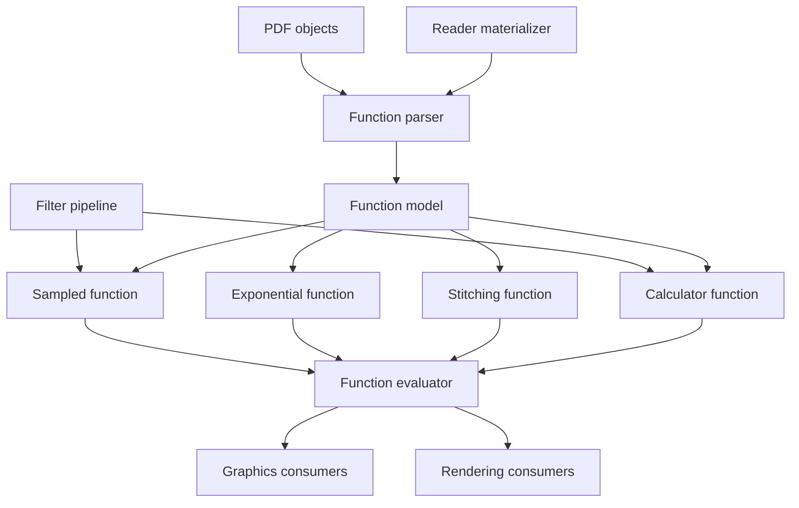
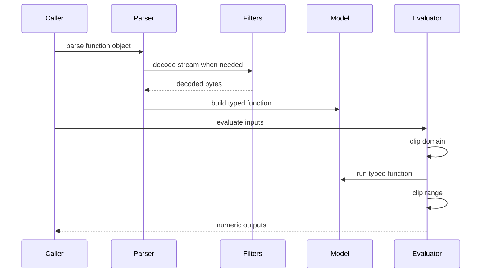
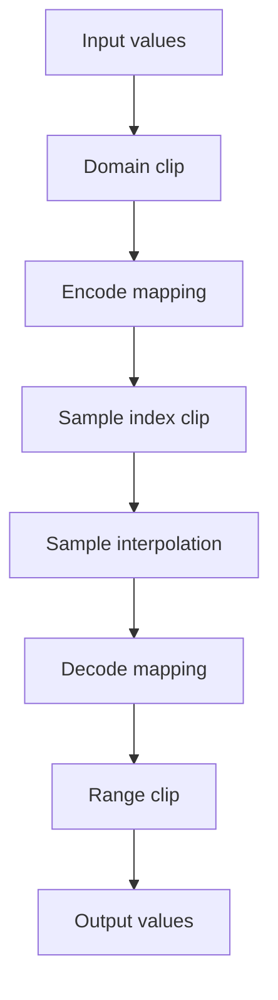
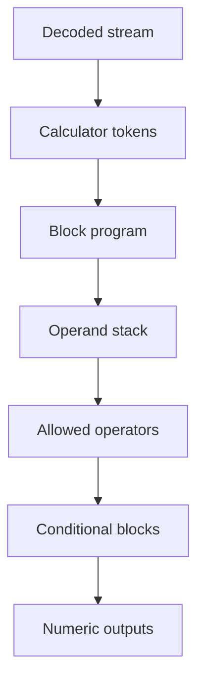
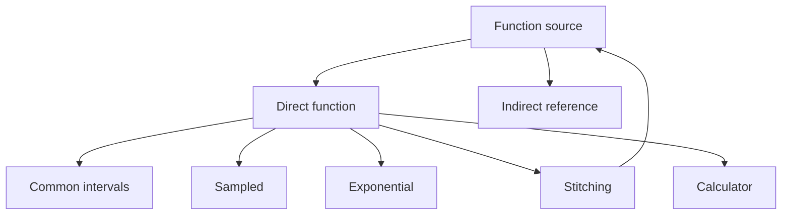

# Design Document

## Overview

This feature delivers ISO 32000-2 clause 7.10 PDF function semantics as a reusable MoonBit package. It parses, validates, and evaluates Type 0 sampled functions, Type 2 exponential interpolation functions, Type 3 stitching functions, and Type 4 PostScript calculator functions while preserving common domain and range clipping rules.

Library users and downstream PDF domains use this to turn raw function dictionaries and streams into typed numerical transformations. The feature adds `src/functions` and narrows selected consumer integration points without moving document loading into function evaluation, adding a renderer, or implementing a full PostScript interpreter.

### Goals
- Represent common function dictionaries with typed `FunctionType`, `Domain`, optional `Range`, input arity, and output arity contracts.
- Parse and evaluate Type 0 sampled functions from decoded stream bytes, including size, bit width, order, encode, decode, sample ordering, and range clipping.
- Parse and evaluate Type 2 exponential interpolation functions, including `C0`, `C1`, `N`, inferred output count, and optional output range clipping.
- Parse and evaluate Type 3 stitching functions with direct or materialized subfunctions, bounds, encode pairs, domain partition selection, and subfunction output compatibility.
- Parse and evaluate Type 4 calculator functions with the allowed PDF calculator syntax and operator set from requirement `0.6`.
- Keep stream decoding, indirect object loading, colour conversion, rendering, halftoning, and full PostScript execution outside the wrong packages.

### Non-Goals
- PDF writing, function object serialization, or function stream recompression.
- Full PostScript language interpretation, including procedures, variables, names, strings, arrays, dictionaries, save/restore, file I/O, or graphics operators.
- Device colour conversion, tint-transform rendering policy, transfer-function application to pixels, halftone screening, shading rasterization, or transparency compositing.
- Loading indirect objects inside `src/functions`.
- Changing the raw-byte ownership of `@objects.PdfStream.data`.
- Adding external PDF, PostScript, numerical, compression, or colour-management dependencies.

## Boundary Commitments

### This Spec Owns
- The `src/functions` package and its public parser, typed model, evaluator, error, and limit contracts.
- Common function dictionary validation for `FunctionType`, `Domain`, required and optional `Range`, dimensionality, and clipping.
- Type 0 sampled function validation and evaluation, including stream decoding through `filters`, MSB-first sample bit extraction, sample table shape, encode/decode defaults, interpolation order, and output clipping.
- Type 2 exponential interpolation validation and evaluation, including `C0`, `C1`, `N`, one-input arity, output arity, and numeric preconditions.
- Type 3 stitching function validation and evaluation, including one-input arity, `Functions`, `Bounds`, `Encode`, subdomain selection, degenerate bound handling, and subfunction compatibility.
- Type 4 calculator stream parsing and evaluation for the required arithmetic, relational, boolean, bitwise, conditional, and stack operators.
- Explicit implementation limits for decoded bytes, sample counts, function dimensions, recursion depth, calculator token count, stack depth, and evaluation steps.
- Consumer integration points that replace raw direct function objects with typed function sources where current packages already preserve function fields.

### Out of Boundary
- `src/objects`, `src/lexer`, and `src/parser` remain authoritative for generic PDF object syntax, stream envelope parsing, stream `Length`, and raw `PdfObject` construction.
- `src/filters` remains authoritative for PDF stream filter decoding.
- `src/content` remains authoritative for content-stream operator syntax and operands.
- `src/graphics` remains authoritative for colour spaces, graphics state, patterns, shadings, transparency structures, and device-independent graphics events.
- `src/rendering` remains authoritative for raster output, transfer application, colour conversion, halftones, and scan conversion.
- `src/reader` remains authoritative for lazy indirect object loading and page/document materialization.
- Functions not represented by PDF FunctionType `0`, `2`, `3`, or `4`.

### Allowed Dependencies
- `src/functions` may depend on `moonbitlang/core/math`, `trkbt10/pdf/src/objects`, and `trkbt10/pdf/src/filters`.
- `src/functions` must not import `lexer`, `parser`, `content`, `graphics`, `rendering`, or `reader`.
- `src/graphics` may import `src/functions` to parse tint transforms, shading functions, and soft-mask transfer functions after direct materialization.
- `src/rendering` may import `src/functions` to evaluate transfer functions, halftone spot functions, and rendering parameter functions.
- `src/reader` may import `src/functions` to materialize indirect function objects and expose document-level helper APIs.
- No external libraries are introduced.

### Revalidation Triggers
- Any public shape change to `@objects.PdfObject`, `@objects.PdfDictionary`, `@objects.PdfStream`, or `@objects.ObjectId`.
- Any change to the raw-vs-decoded ownership of `PdfStream.data` or to `@filters.decode_stream`.
- Any change to public function model types, `FunctionSource`, `PdfFunction`, `FunctionLimits`, `PdfFunctionError`, or evaluator arity behavior.
- Any change that makes `src/functions` import `reader`, `graphics`, `rendering`, `content`, `parser`, or `lexer`.
- Any change that adds full PostScript language features or renderer-specific colour policy to `src/functions`.
- Any public shape change to graphics colour-space tint transforms, shading `Function` fields, transparency transfer functions, rendering transfer refs, or reader materialization helpers.

## Architecture

### Existing Architecture Analysis

The repository already parses PDF objects, dictionaries, and streams, and it decodes stream filters through `src/filters`. Existing higher-level packages preserve functions as raw `PdfObject` values: colour spaces store tint transforms, shadings store `Function` entries, soft masks store transfer functions, and rendering devices store transfer-function references. This keeps the current system structurally correct but leaves common function clipping, validation, and Type 4 calculator semantics unowned.

The existing dependency direction is preserved. `functions` sits above `objects` and `filters`, while `graphics`, `rendering`, and `reader` can consume it. `functions` never opens files, traverses pages, resolves indirect references, or depends on rendering policy.

### Architecture Pattern & Boundary Map



**Architecture Integration**:
- Selected pattern: reusable low-level function domain package with typed parser and evaluator.
- Domain boundaries: `objects` owns raw syntax, `filters` owns stream decoding, `functions` owns clause 7.10 semantics, `reader` owns indirect materialization, and downstream packages own how evaluated numbers are used.
- Existing patterns preserved: package-per-directory layout, standard-library-only implementation, `pub(all)` inspectable models, `suberror` diagnostics, package-local tests, and `moon info` public API review.
- New components rationale: common validation, sampled sample-table handling, exponential functions, stitching dispatch, calculator parsing, and evaluator limits each have distinct invariants and tests.
- Steering compliance: byte-oriented stream handling, lazy object loading outside semantic packages, independent testability, and no external dependencies are maintained.

### Technology Stack

| Layer | Choice / Version | Role in Feature | Notes |
|-------|------------------|-----------------|-------|
| Language | MoonBit project toolchain | Typed function models, parser, evaluator, and tests | Use `///|`, explicit enums and structs, and `suberror`. |
| Object model | `trkbt10/pdf/src/objects` | Function dictionaries, streams, arrays, numbers, booleans, refs | No object-model change planned. |
| Stream filters | `trkbt10/pdf/src/filters` | Decode Type 0 and Type 4 function streams before interpreting bytes | `PdfStream.data` stays raw encoded bytes. |
| Math | `moonbitlang/core/math` | `pow`, trig, logarithm, square root, rounding, and numeric helpers | Guard invalid numeric domains with function errors. |
| Graphics consumers | `trkbt10/pdf/src/graphics` | Tint transforms, shading functions, soft-mask transfer functions | Consume typed function sources after direct materialization. |
| Rendering consumers | `trkbt10/pdf/src/rendering` | Transfer functions, halftone spot functions, and provider replacement | Rendering remains owner of pixel policy. |
| Reader integration | `trkbt10/pdf/src/reader` | Materialize indirect function objects and wrap function errors | Reader imports functions, not the reverse. |

## File Structure Plan

### Directory Structure

```text
src/
├── functions/
│   ├── moon.pkg                         # Imports math, objects, and filters only
│   ├── error.mbt                        # PdfFunctionError and typed diagnostics
│   ├── limits.mbt                       # FunctionLimits and checked guard helpers
│   ├── model.mbt                        # FunctionSource, PdfFunction, FunctionCommon, intervals, variants
│   ├── validation.mbt                   # Dictionary accessors, numeric arrays, domain and range validation
│   ├── parser.mbt                       # parse_function_object and FunctionType dispatch
│   ├── evaluator.mbt                    # Shared evaluate contract, arity, clipping, dispatch
│   ├── sampled.mbt                      # Type 0 model parsing, sample table, interpolation contract
│   ├── sample_bits.mbt                  # MSB-first bit reader for sampled values
│   ├── exponential.mbt                  # Type 2 model parsing and evaluation
│   ├── stitching.mbt                    # Type 3 model parsing, bounds, encode, subfunction dispatch
│   ├── calculator_token.mbt             # Type 4 token scanner with comments and braces
│   ├── calculator_parser.mbt            # Type 4 block structure and operator validation
│   ├── calculator_eval.mbt              # Type 4 stack evaluator and operator dispatch
│   ├── public_api_test.mbt              # Black-box parse and evaluate API tests
│   ├── validation_wbtest.mbt            # Domain, range, arity, clipping, and limit validation
│   ├── sampled_wbtest.mbt               # Type 0 stream, bit packing, encode, decode, interpolation tests
│   ├── exponential_wbtest.mbt           # Type 2 C0 C1 N and range clipping tests
│   ├── stitching_wbtest.mbt             # Type 3 bounds, encode, subfunction compatibility tests
│   └── calculator_wbtest.mbt            # Type 4 syntax, operators, conditionals, stack errors
├── graphics/
│   ├── moon.pkg                         # Add functions import
│   ├── colour_space.mbt                 # Store typed tint transform function sources
│   ├── pattern_shading.mbt              # Store typed shading function sources
│   ├── shading_mesh.mbt                 # Use typed optional function source when Function is present
│   ├── soft_mask.mbt                    # Store typed soft-mask transfer function source
│   ├── pattern_wbtest.mbt               # Update shading Function fixtures to typed functions
│   ├── colour_space_wbtest.mbt          # Add tint-transform parse and unresolved reference tests
│   └── pkg.generated.mbti               # Regenerated by moon info
├── rendering/
│   ├── moon.pkg                         # Add functions import when rendering function evaluation is wired
│   ├── device.mbt                       # Replace raw transfer refs with typed function refs if public API changes
│   ├── error.mbt                        # Wrap PdfFunctionError for provider and evaluation failures if needed
│   └── pkg.generated.mbti               # Regenerated by moon info if public API changes
└── reader/
    ├── moon.pkg                         # Add functions import
    ├── functions.mbt                    # Materialize indirect function objects and parse via functions package
    ├── functions_wbtest.mbt             # Indirect function materialization and error wrapping tests
    └── pkg.generated.mbti               # Regenerated by moon info if public APIs are added
```

### Modified Files
- `src/graphics/moon.pkg` - Add `trkbt10/pdf/src/functions` import; keep no external dependency.
- `src/graphics/colour_space.mbt` - Replace direct raw tint-transform fields with `@functions.FunctionSource` for direct or unresolved functions.
- `src/graphics/pattern_shading.mbt` - Replace raw shading `Function` fields with typed `@functions.FunctionSource` or arrays of function sources where the PDF dictionary allows arrays.
- `src/graphics/shading_mesh.mbt` - Use typed optional function sources to determine whether mesh colour data contains one parametric value or component values.
- `src/graphics/soft_mask.mbt` - Represent soft-mask `TR` as identity, direct typed function, or unresolved function reference.
- `src/rendering/device.mbt` - Revalidate `TransferFunctionRef` and other function references when rendering begins using typed evaluation.
- `src/rendering/error.mbt` - Add a wrapper only if rendering APIs expose function evaluation failures directly.
- `src/reader/moon.pkg` - Add `trkbt10/pdf/src/functions` import for materialization helpers.
- `src/reader/functions.mbt` - Add helper functions for loading indirect function objects and parsing them without changing `src/functions` dependency direction.
- `src/functions/pkg.generated.mbti`, `src/graphics/pkg.generated.mbti`, `src/rendering/pkg.generated.mbti`, and `src/reader/pkg.generated.mbti` - Regenerated through `moon info` after implementation.

### Existing Files Consumed Without Modification
- `src/objects/types.mbt` - `PdfObject`, `PdfDictionary`, `PdfStream`, and `ObjectId`.
- `src/objects/accessors.mbt` - Existing object accessors remain available to packages that already depend on objects.
- `src/filters/pipeline.mbt` - `decode_stream` for Type 0 samples and Type 4 calculator source bytes.
- `src/graphics/pattern_validation.mbt` - Package-local helper style to mirror in `src/functions/validation.mbt`; no cross-package dependency.
- `src/lexer/*` - Existing lexer remains unchanged because Type 4 braces are function-local syntax.

### Component to File Mapping

| Component | Primary Files |
|-----------|---------------|
| FunctionModel | `src/functions/model.mbt`, `src/functions/limits.mbt` |
| FunctionParser | `src/functions/parser.mbt`, `src/functions/validation.mbt` |
| SampledFunctionModel | `src/functions/sampled.mbt`, `src/functions/sample_bits.mbt` |
| ExponentialFunctionModel | `src/functions/exponential.mbt` |
| StitchingFunctionModel | `src/functions/stitching.mbt` |
| CalculatorFunctionModel | `src/functions/calculator_token.mbt`, `src/functions/calculator_parser.mbt`, `src/functions/calculator_eval.mbt` |
| FunctionEvaluator | `src/functions/evaluator.mbt`, type-specific function files |
| GraphicsFunctionIntegration | `src/graphics/colour_space.mbt`, `src/graphics/pattern_shading.mbt`, `src/graphics/soft_mask.mbt` |
| ReaderFunctionBridge | `src/reader/functions.mbt` |

## System Flows

### Function Parsing and Evaluation



All function types share arity validation, input domain clipping, optional output range clipping, and typed error reporting. Type-specific evaluators own only their representation-specific computation.

### Sampled Function Evaluation



The sample reader treats decoded stream bytes as a continuous high-order-bit-first bit stream. It validates that the stream contains the required sample values and ignores only trailing padding bits that are outside the declared sample table.

### Calculator Function Evaluation



Curly-brace blocks are parsed as conditional syntax only. The evaluator rejects names outside the allowed operator list, composite objects, unbalanced braces, stack underflow, type mismatches, and output arity mismatches.

## Requirements Traceability

| Requirement | Summary | Components | Interfaces | Flows |
|-------------|---------|------------|------------|-------|
| 0.1 | Common static numerical function contract, function types, domain clipping, range clipping, and interpolation helper | FunctionModel, FunctionParser, FunctionEvaluator | `FunctionCommon`, `PdfFunction`, `evaluate`, `interpolate` | Function Parsing and Evaluation |
| 0.2 | Type 0 sampled function stream, size, bit packing, encode, decode, interpolation, and sample ordering | SampledFunctionModel, FunctionEvaluator | `SampledFunction`, `SampleOrder`, `SampleTable` | Sampled Function Evaluation |
| 0.3 | Type 2 exponential interpolation with C0, C1, N, one input, inferred output count, and range clipping | ExponentialFunctionModel, FunctionEvaluator | `ExponentialFunction` | Function Parsing and Evaluation |
| 0.4 | Type 3 stitching with subfunctions, bounds, encode pairs, subdomain selection, and degenerate cases | StitchingFunctionModel, FunctionEvaluator | `StitchingFunction`, `FunctionSource` | Function Parsing and Evaluation |
| 0.5 | Type 4 calculator function stream with numbers, booleans, comments, no composite data, no procedures, no variables, and no names beyond operators | CalculatorFunctionModel | `CalculatorProgram`, `CalculatorToken` | Calculator Function Evaluation |
| 0.6 | Type 4 arithmetic, relational, boolean, bitwise, conditional, and stack operators with PDF brace syntax | CalculatorFunctionModel, FunctionEvaluator | `CalculatorOperator`, `CalculatorValue` | Calculator Function Evaluation |

## Components and Interfaces

| Component | Domain | Intent | Req Coverage | Key Dependencies | Contracts |
|-----------|--------|--------|--------------|------------------|-----------|
| FunctionModel | Functions domain | Represent common and type-specific PDF functions | 0.1-0.6 | `objects` P0 | State, Service |
| FunctionParser | Functions domain | Parse raw PDF function objects into typed function sources | 0.1-0.6 | `objects` P0, `filters` P0 | Service |
| SampledFunctionModel | Functions domain | Decode and evaluate Type 0 sampled function tables | 0.2 | FunctionModel P0, `filters` P0 | Service, State |
| ExponentialFunctionModel | Functions domain | Evaluate Type 2 exponential interpolation functions | 0.3 | FunctionModel P0, `math` P0 | Service, State |
| StitchingFunctionModel | Functions domain | Select and evaluate Type 3 subfunctions across partitioned domains | 0.4 | FunctionModel P0, FunctionEvaluator P0 | Service, State |
| CalculatorFunctionModel | Functions domain | Parse and execute the Type 4 calculator subset | 0.5, 0.6 | `filters` P0, `math` P0 | Service, State |
| FunctionEvaluator | Functions domain | Apply common evaluation contract around type-specific evaluators | 0.1-0.6 | FunctionModel P0 | Service |
| GraphicsFunctionIntegration | Graphics consumers | Replace raw direct function fields with typed function sources | 0.1-0.6 | `functions` P0, `graphics` P0 | State |
| ReaderFunctionBridge | Reader integration | Materialize indirect function objects without reversing dependencies | 0.1, 0.4 | `reader` P0, `functions` P0 | Service |

### Functions Domain

#### FunctionModel

| Field | Detail |
|-------|--------|
| Intent | Provide the canonical typed representation for PDF FunctionType `0`, `2`, `3`, and `4`. |
| Requirements | 0.1, 0.2, 0.3, 0.4, 0.5, 0.6 |

**Responsibilities & Constraints**
- Represent direct and unresolved indirect function sources explicitly.
- Store `Domain` as ordered numeric intervals and optional `Range` as output intervals.
- Represent each function type as a typed variant with type-specific parameters.
- Preserve arity, output count, and raw stream summaries needed for public inspection.
- Keep rendering policy and indirect object loading out of the model.

**Dependencies**
- Inbound: FunctionParser - constructs typed models from PDF objects (P0).
- Inbound: FunctionEvaluator - reads models for evaluation (P0).
- Outbound: `objects` - stores refs and original stream or dictionary metadata when needed (P0).

**Contracts**: Service [x] / API [ ] / Event [ ] / Batch [ ] / State [x]

##### Service Interface
```moonbit
pub(all) enum FunctionSource {
  DirectFunction(PdfFunction)
  IndirectFunction(@objects.ObjectId)
}

pub(all) enum PdfFunction {
  Sampled(SampledFunction)
  Exponential(ExponentialFunction)
  Stitching(StitchingFunction)
  Calculator(CalculatorFunction)
}

pub(all) struct FunctionCommon {
  domain : Array[FunctionInterval]
  range : Array[FunctionInterval]?
}
```
- Preconditions: `Domain` and `Range` intervals are validated before model construction.
- Postconditions: `PdfFunction` variants always have a known input count and output count.
- Invariants: `FunctionSource::IndirectFunction` is never evaluated without materialization.

#### FunctionParser

| Field | Detail |
|-------|--------|
| Intent | Convert raw PDF dictionaries, streams, and refs into `FunctionSource` values. |
| Requirements | 0.1, 0.2, 0.3, 0.4, 0.5, 0.6 |

**Responsibilities & Constraints**
- Accept dictionary, stream, or indirect reference objects.
- Validate `FunctionType` values `0`, `2`, `3`, and `4`.
- Decode Type 0 and Type 4 streams through `filters.decode_stream`.
- Apply `FunctionLimits` before allocating sample tables or calculator programs.
- Reject unsupported object shapes and malformed dictionaries with `PdfFunctionError`.

**Dependencies**
- Inbound: GraphicsFunctionIntegration, Rendering consumers, ReaderFunctionBridge - parse direct function objects (P0).
- Outbound: `objects` - read dictionaries, arrays, streams, numbers, booleans, names, and refs (P0).
- Outbound: `filters` - decode stream-backed function data (P0).

**Contracts**: Service [x] / API [ ] / Event [ ] / Batch [ ] / State [ ]

##### Service Interface
```moonbit
pub fn parse_function_object(
  object : @objects.PdfObject,
  limits : FunctionLimits,
  offset : Int64,
) -> FunctionSource raise PdfFunctionError

pub fn parse_direct_function(
  object : @objects.PdfObject,
  limits : FunctionLimits,
  offset : Int64,
) -> PdfFunction raise PdfFunctionError
```
- Preconditions: Callers pass a raw function object or a materialized indirect object value.
- Postconditions: Direct dictionaries and streams produce `DirectFunction`; refs produce `IndirectFunction`.
- Invariants: The parser does not load indirect references and does not mutate stream bytes.

#### SampledFunctionModel

| Field | Detail |
|-------|--------|
| Intent | Represent and evaluate Type 0 sampled functions from decoded sample streams. |
| Requirements | 0.2 |

**Responsibilities & Constraints**
- Validate `Size`, `BitsPerSample`, optional `Order`, optional `Encode`, required `Range`, optional `Decode`, and sample stream length.
- Decode sample values as a continuous high-order-bit-first bit stream without per-byte padding.
- Preserve first-dimension-fastest table indexing.
- Evaluate using encode mapping, sample-table clipping, interpolation, decode mapping, and range clipping.
- Treat `Order 3` as cubic interpolation only when dimensional size permits; otherwise ignore it according to requirement `0.2`.

**Dependencies**
- Inbound: FunctionParser - constructs sampled functions (P0).
- Inbound: FunctionEvaluator - dispatches Type 0 evaluation (P0).
- Outbound: `filters` - decoded stream bytes (P0).

**Contracts**: Service [x] / API [ ] / Event [ ] / Batch [ ] / State [x]

##### Service Interface
```moonbit
pub(all) struct SampledFunction {
  common : FunctionCommon
  size : Array[Int]
  bits_per_sample : Int
  order : SampleOrder
  encode : Array[FunctionInterval]
  decode : Array[FunctionInterval]
  table : SampleTable
}
```
- Preconditions: `Range` exists and determines output count.
- Postconditions: The sample table contains `product(Size) * output_count` values.
- Invariants: `Size` entries are positive and `BitsPerSample` is one of `1`, `2`, `4`, `8`, `12`, `16`, `24`, or `32`.

#### ExponentialFunctionModel

| Field | Detail |
|-------|--------|
| Intent | Represent and evaluate Type 2 exponential interpolation functions. |
| Requirements | 0.3 |

**Responsibilities & Constraints**
- Validate one-input `Domain`.
- Parse default `C0` as `[0.0]`, default `C1` as `[1.0]`, and required `N`.
- Validate `C0` and `C1` have matching lengths and infer output count.
- Reject or fail evaluation for values where `N` is non-integer and clipped input is negative, or `N` is negative and clipped input is zero.
- Clip outputs to optional `Range` when present.

**Dependencies**
- Inbound: FunctionParser - constructs exponential functions (P0).
- Inbound: FunctionEvaluator - dispatches Type 2 evaluation (P0).
- Outbound: `math` - exponentiation and numeric helpers (P0).

**Contracts**: Service [x] / API [ ] / Event [ ] / Batch [ ] / State [x]

##### Service Interface
```moonbit
pub(all) struct ExponentialFunction {
  common : FunctionCommon
  c0 : Array[Double]
  c1 : Array[Double]
  exponent : Double
}
```
- Preconditions: `Domain` has exactly one interval.
- Postconditions: Evaluation returns `c0.length()` outputs.
- Invariants: `c0.length() == c1.length()`.

#### StitchingFunctionModel

| Field | Detail |
|-------|--------|
| Intent | Represent and evaluate Type 3 stitching functions over one input domain. |
| Requirements | 0.4 |

**Responsibilities & Constraints**
- Validate one-input `Domain`, required `Functions`, required `Bounds`, and required `Encode`.
- Preserve subfunctions as `FunctionSource` values and require direct functions before evaluation.
- Validate `Bounds.length() == Functions.length() - 1` and `Encode.length() == 2 * Functions.length()`.
- Select half-open and closed intervals according to the requirement, including degenerate first and last bound cases.
- Encode the selected input into the selected subfunction domain and validate compatible output dimensionality.

**Dependencies**
- Inbound: FunctionParser - constructs stitching functions (P0).
- Inbound: FunctionEvaluator - dispatches Type 3 evaluation and recursive subfunction calls (P0).
- Outbound: FunctionEvaluator - evaluates selected subfunction (P0).

**Contracts**: Service [x] / API [ ] / Event [ ] / Batch [ ] / State [x]

##### Service Interface
```moonbit
pub(all) struct StitchingFunction {
  common : FunctionCommon
  functions : Array[FunctionSource]
  bounds : Array[Double]
  encode : Array[FunctionInterval]
}
```
- Preconditions: Callers materialize indirect subfunctions before evaluation.
- Postconditions: Evaluation returns the selected subfunction outputs clipped by the stitching range when present.
- Invariants: `functions.length() >= 1`; `bounds` are ordered and inside the stitching domain.

#### CalculatorFunctionModel

| Field | Detail |
|-------|--------|
| Intent | Parse and evaluate the Type 4 PostScript calculator subset. |
| Requirements | 0.5, 0.6 |

**Responsibilities & Constraints**
- Decode the function stream, parse comments, numbers, booleans, operators, and brace-delimited conditional blocks.
- Reject composite data structures, variables, unknown names, procedures, and unbalanced braces.
- Evaluate allowed arithmetic, relational, boolean, bitwise, conditional, and stack operators.
- Enforce calculator token, stack, recursion, and evaluation-step limits.
- Produce numeric outputs matching `Range` output count.

**Dependencies**
- Inbound: FunctionParser - constructs calculator functions (P0).
- Inbound: FunctionEvaluator - dispatches Type 4 evaluation (P0).
- Outbound: `filters` - decoded calculator source bytes (P0).
- Outbound: `math` - trigonometric, logarithmic, exponential, and rounding helpers (P0).

**Contracts**: Service [x] / API [ ] / Event [ ] / Batch [ ] / State [x]

##### Service Interface
```moonbit
pub(all) enum CalculatorValue {
  Number(Double)
  Boolean(Bool)
}

pub(all) struct CalculatorFunction {
  common : FunctionCommon
  program : CalculatorProgram
}
```
- Preconditions: Type 4 `Range` exists and determines numeric output count.
- Postconditions: Evaluation leaves exactly the output numeric values required by the range.
- Invariants: The program contains only allowed operators and literal values.

#### FunctionEvaluator

| Field | Detail |
|-------|--------|
| Intent | Provide the shared evaluation contract used by all function consumers. |
| Requirements | 0.1, 0.2, 0.3, 0.4, 0.5, 0.6 |

**Responsibilities & Constraints**
- Validate input count against domain count.
- Clip inputs to domain before type-specific evaluation.
- Dispatch to the function variant evaluator.
- Clip outputs to range when present.
- Validate output count and apply recursion and step limits.

**Dependencies**
- Inbound: GraphicsFunctionIntegration, Rendering consumers, ReaderFunctionBridge, public callers (P0).
- Outbound: type-specific function components - perform representation-specific evaluation (P0).

**Contracts**: Service [x] / API [ ] / Event [ ] / Batch [ ] / State [ ]

##### Service Interface
```moonbit
pub fn PdfFunction::evaluate(
  self : PdfFunction,
  inputs : Array[Double],
  limits : FunctionLimits,
) -> Array[Double] raise PdfFunctionError

pub fn evaluate_function_source(
  source : FunctionSource,
  inputs : Array[Double],
  limits : FunctionLimits,
) -> Array[Double] raise PdfFunctionError
```
- Preconditions: `source` is direct unless the caller accepts an unresolved-reference error.
- Postconditions: Returned values satisfy `Range` if present.
- Invariants: Common clipping is applied exactly once around type-specific evaluation.

### Consumer Integration

#### GraphicsFunctionIntegration

| Field | Detail |
|-------|--------|
| Intent | Replace raw direct function fields in graphics models with typed function sources. |
| Requirements | 0.1-0.6 |

**Responsibilities & Constraints**
- Parse direct tint transforms in Separation and DeviceN colour spaces through `@functions`.
- Parse direct shading functions and optional mesh functions through `@functions`.
- Parse direct soft-mask transfer functions through `@functions`.
- Preserve unresolved references when graphics cannot materialize them.
- Keep function evaluation out of graphics unless a graphics-level structural check requires it.

**Dependencies**
- Inbound: existing graphics parsers (P0).
- Outbound: `functions` - typed parsing and validation (P0).

**Contracts**: Service [ ] / API [ ] / Event [ ] / Batch [ ] / State [x]

**Implementation Notes**
- Integration: Update public model fields only where the current public API already exposes function-bearing objects.
- Validation: Graphics tests must cover direct function parse success, indirect preservation, and invalid function errors wrapped into `PdfGraphicsError`.
- Risks: Public API changes require `moon info` review and may affect rendering and reader callers.

#### ReaderFunctionBridge

| Field | Detail |
|-------|--------|
| Intent | Materialize indirect function objects without coupling `src/functions` to `src/reader`. |
| Requirements | 0.1, 0.4 |

**Responsibilities & Constraints**
- Load indirect function objects through existing reader object loading APIs.
- Parse loaded objects through `@functions.parse_direct_function`.
- Provide helper APIs only where current reader workflows need function materialization.
- Wrap `PdfFunctionError` in document-level diagnostics without losing the underlying reason.

**Dependencies**
- Inbound: page, graphics, rendering, or resource bridge APIs (P1).
- Outbound: `functions` - parse materialized function objects (P0).
- Outbound: reader object loading - resolve indirect references (P0).

**Contracts**: Service [x] / API [ ] / Event [ ] / Batch [ ] / State [ ]

##### Service Interface
```moonbit
pub fn PdfFile::load_function(
  self : PdfFile,
  object_id : @objects.ObjectId,
  limits : @functions.FunctionLimits,
) -> @functions.PdfFunction raise PdfDocumentError
```
- Preconditions: The referenced object exists and is a function dictionary or stream.
- Postconditions: The returned function is direct and ready for evaluation.
- Invariants: `src/functions` remains unaware of `PdfFile`.

## Data Models

### Domain Model
- `FunctionSource` is the boundary object for direct versus unresolved indirect functions.
- `PdfFunction` is the aggregate root for a parsed direct function.
- `FunctionCommon` owns domain and range intervals shared by all function types.
- Type-specific value objects own `SampledFunction`, `ExponentialFunction`, `StitchingFunction`, and `CalculatorFunction`.
- `FunctionLimits` is a caller-visible guardrail model rather than a hidden global constant.



### Logical Data Model

**Structure Definition**:
- `FunctionInterval` stores `min : Double` and `max : Double`; construction requires `min <= max`.
- `FunctionCommon.domain.length()` is the input count.
- `FunctionCommon.range.length()` is the output count when present.
- Type 0 and Type 4 require `range`.
- Type 2 output count is `C0.length()`.
- Type 3 output count is the subfunction output count unless `range` is present; incompatible subfunction outputs are invalid.

**Consistency & Integrity**:
- All arrays derived from PDF dictionaries are copied into typed model arrays to avoid caller mutation through dictionary aliases.
- Decoded stream bytes are read during parsing and summarized or stored according to `FunctionLimits`.
- Sample table indexing uses first dimension fastest and output components in `Range` order.
- Type 4 calculator programs contain only literal values, allowed operators, and conditional blocks.

### Data Contracts & Integration

**Public Function API**

| Contract | Input | Output | Errors |
|----------|-------|--------|--------|
| Parse source | `PdfObject`, `FunctionLimits`, offset | `FunctionSource` | Invalid object, unsupported type, malformed dictionary, filter failure, limit exceeded |
| Parse direct | `PdfObject`, `FunctionLimits`, offset | `PdfFunction` | Same as parse source plus unresolved reference rejection |
| Evaluate direct | `PdfFunction`, numeric inputs, limits | numeric outputs | Arity mismatch, unresolved subfunction, numeric domain failure, stack failure, limit exceeded |
| Materialize reader function | `PdfFile`, `ObjectId`, limits | `PdfFunction` | Reader load failure, parse failure |

## Error Handling

### Error Strategy
`src/functions` reports all failures through `PdfFunctionError`. Downstream packages wrap this error at their package boundary rather than converting it to strings only.

### Error Categories and Responses
- **InvalidFunction**: malformed dictionary, missing required entry, wrong object type, unsupported `FunctionType`, invalid interval, invalid array length, invalid sample bit width.
- **EvaluationFailure**: input arity mismatch, output arity mismatch, numeric precondition failure, NaN or infinity where not accepted, invalid calculator operation.
- **UnresolvedFunctionReference**: evaluation requested on an unresolved indirect function or Type 3 subfunction.
- **LimitExceeded**: decoded stream, sample table, recursion, stack, token, or step limit exceeded.
- **FilterFailure**: Type 0 or Type 4 stream decoding failed through `@filters.PdfFilterError`.

### Monitoring
No runtime monitoring is introduced. Tests and public errors are the validation surface for this library feature.

## Testing Strategy

- Unit Tests: Validate `Domain` and `Range` interval construction, input clipping, output clipping, interpolation helper behavior, arity checks, and limit errors in `validation_wbtest.mbt`.
- Unit Tests: Validate Type 0 sample decoding for 1, 2, 4, 8, 12, 16, 24, and 32 bit samples; first-dimension-fastest indexing; default `Encode`; default `Decode`; insufficient stream bytes; and `Order` handling in `sampled_wbtest.mbt`.
- Unit Tests: Validate Type 2 defaults, multi-output `C0` and `C1`, negative and non-integer exponent preconditions, and range clipping in `exponential_wbtest.mbt`.
- Unit Tests: Validate Type 3 `Functions`, `Bounds`, `Encode`, k equals 1, first-bound and last-bound degeneracy, indirect subfunction rejection during evaluation, and output compatibility in `stitching_wbtest.mbt`.
- Unit Tests: Validate Type 4 scanner and evaluator for every operator category in `0.6`, comments, nested conditional blocks, stack errors, type errors, unsupported syntax, and output count checks in `calculator_wbtest.mbt`.
- Integration Tests: Validate graphics colour-space tint transforms, shading functions, mesh optional functions, and soft-mask transfer functions parse through `@functions` while unresolved refs remain explicit.
- Integration Tests: Validate reader materialization of indirect Type 2 and Type 3 functions and wrapping of `PdfFunctionError` in document errors.
- Integration Tests: Validate rendering transfer-function references can use typed direct functions without changing raster policy ownership.
- Performance/Limit Tests: Validate checked multiplication for sample counts, maximum decoded stream bytes, maximum calculator tokens, maximum stack depth, and recursion depth for nested stitching functions.

## Security Considerations

- Function streams are untrusted input. The parser must enforce `FunctionLimits` before allocating arrays or running calculator programs.
- Type 4 does not execute file, system, graphics, or dynamic name operations.
- Indirect references are materialized only by `reader`, preserving existing lazy loading and document error boundaries.
- Unsupported or malformed calculator syntax fails closed with `PdfFunctionError`.

## Performance & Scalability

- Type 0 parsing uses checked multiplication for `product(Size) * output_count` and rejects declarations exceeding `FunctionLimits.max_sample_values`.
- Type 0 evaluation should avoid copying the full sample table per call; the parsed function owns the decoded table.
- Type 3 recursion depth is bounded by `FunctionLimits.max_recursion_depth`.
- Type 4 evaluation is bounded by token count, stack depth, and step count.
- Large sampled functions can be valid PDF but may exceed default implementation limits; callers can opt into higher limits explicitly.

## Supporting References

- `spec/extracted/7.10-functions.spec.txt` - Local clause 7.10 extraction and operator list.
- `.kiro/specs/pdf-functions/research.md` - Discovery log and design decision rationale.
