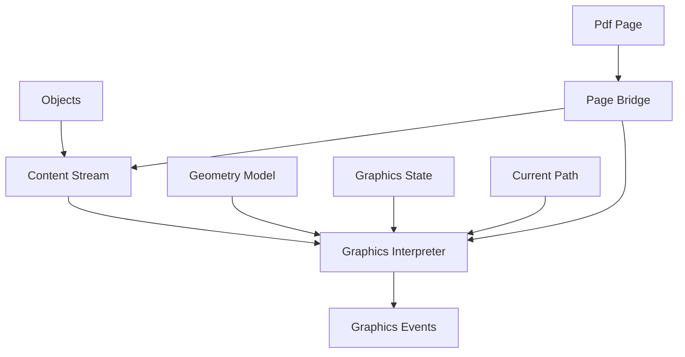
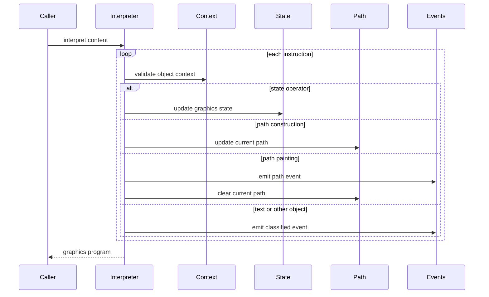
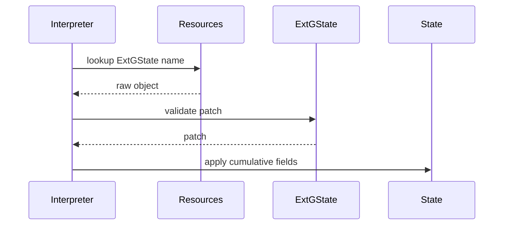
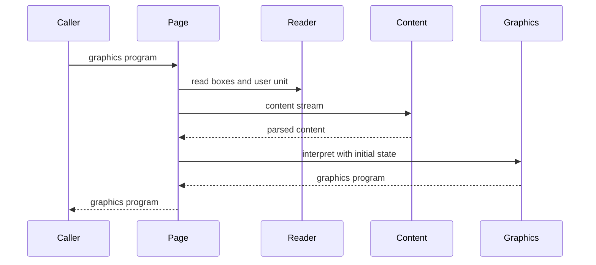
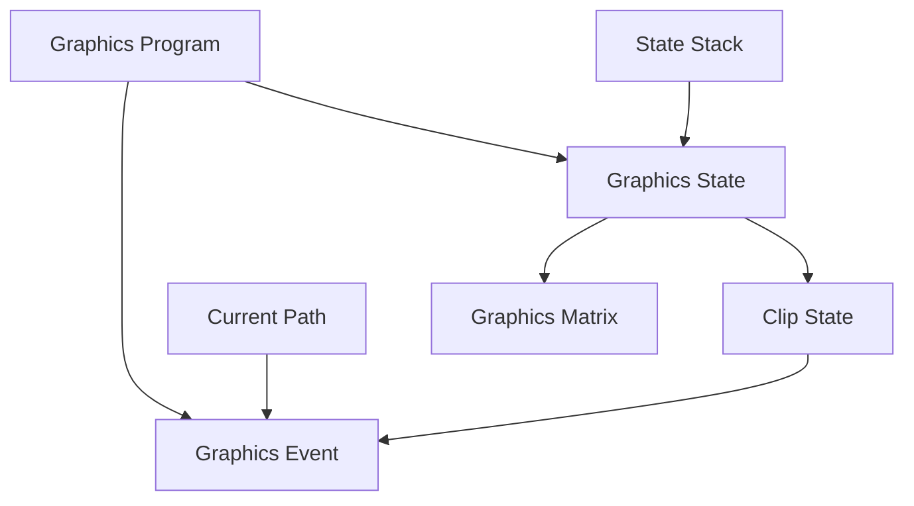

# Design Document

## Overview
This feature delivers a graphics interpretation layer for ISO 32000-2:2020 section 8.1 through 8.5. It consumes parsed content-stream instructions, models coordinate transformations, graphics state, graphics state stack behavior, current path construction, path painting, and clipping updates, and emits typed graphics events for downstream consumers.

Library users and later phases use this layer to understand graphics semantics without rendering. The design adds a reusable `src/graphics` package and a thin reader bridge that can interpret a page's parsed content stream using existing page geometry APIs.

### Goals
- Model PDF affine matrices, coordinate-space relationships, and CTM concatenation in ISO order.
- Track graphics state parameters, stack save/restore, and cumulative ExtGState dictionary application.
- Track current path construction, path-painting modes, fill rules, and pending clipping behavior.
- Validate graphics-object context rules that are semantic rather than lexical.
- Expose page-level graphics interpretation through `PdfPage` without making `src/graphics` depend on `src/reader`.

### Non-Goals
- Rendering, rasterization, scan conversion, device color conversion, antialiasing, or pixel output.
- Font handling, glyph decoding, text layout, or text extraction.
- Color-space semantics, patterns, shadings, transparency compositing, blend-mode execution, soft-mask execution, halftone execution, transfer-function execution, or overprint output behavior.
- Recursive Form XObject execution, image decoding, image rendering, marked-content structure interpretation, optional-content evaluation, or 3D artwork.
- Replacing `src/content` operator recognition, operand parsing, inline-image parsing, stream decoding, or resource lookup.
- PDF writing or content-stream serialization.

## Boundary Commitments

### This Spec Owns
- The `src/graphics` package and its public graphics interpretation API.
- Geometry value types for points, rectangles, affine matrices, paths, subpaths, and path segments.
- Graphics state modeling for CTM, clipping path approximation, line width, cap, join, miter limit, dash pattern, rendering intent, flatness, stroke adjustment, overprint values, transparency-related raw parameters, and PDF 2.0 black-point/halftone-origin fields.
- Graphics state stack behavior for `q` and `Q`.
- ExtGState resource lookup through `@content.ContentResources` and cumulative application of dictionary entries.
- Current path lifecycle and path operator semantics for `m`, `l`, `c`, `v`, `y`, `h`, and `re`.
- Path-painting and clipping event emission for `S`, `s`, `f`, `F`, `f*`, `B`, `B*`, `b`, `b*`, `n`, `W`, and `W*`.
- Graphics-object context validation for content stream level, path object, and text object boundaries as required by section 8.2.
- Reader-side page bridge APIs that derive initial graphics context from `PdfPage` metadata and existing page content parsing.

### Out of Boundary
- The `src/content` package remains authoritative for content instruction syntax, operator recognition, operands, inline images, and resources.
- The `src/reader` package remains authoritative for object loading, page tree traversal, inherited page attributes, stream decoding, and document errors.
- Color, text, XObject, image, shading, marked-content, transparency, rendering, and optional-content semantics beyond event classification are deferred to later specs.
- The graphics interpreter does not load indirect objects, execute `Do`, parse Form XObject streams, resolve fonts, decode image samples, or calculate final painted pixels.
- Device-specific CTM construction is not hard-coded. Callers may supply an initial CTM; the default page bridge uses identity as a modeling baseline.
- The current path is not owned by `GraphicsState` and must not be saved or restored by the graphics state stack.

### Allowed Dependencies
- MoonBit standard library only.
- `src/graphics` may import `trkbt10/pdf/src/objects` and `trkbt10/pdf/src/content`.
- `src/reader` may import `trkbt10/pdf/src/graphics` for page graphics bridge APIs.
- Existing dependency direction remains valid: `objects <- lexer <- parser`; `objects <- filters`; `objects, lexer, filters <- content`; `objects, content <- graphics`; `objects, lexer, parser, filters, content, graphics <- reader`.
- Local specification excerpts under `spec/extracted/8.1-8.5-graphics-state.spec.txt`.

### Revalidation Triggers
- Any public shape change to `@content.ContentInstruction`, `@content.ContentOperation`, `@content.StandardContentOperator`, `@content.ContentStream`, or `@content.ContentResources`.
- Any change to `PdfPage::media_box`, `PdfPage::crop_box`, `PdfPage::rotate`, `PdfPage::user_unit`, `PdfPage::content_stream`, or `PdfPage::content_resources`.
- Any change to `@objects.PdfObject`, `@objects.PdfDictionary`, `@objects.PdfName`, or `@objects.PdfStream`.
- Adding color-space execution, text-state execution, XObject execution, image rendering, shading execution, transparency compositing, or scan conversion.
- Changing ExtGState ownership from raw/deferred fields to executed rendering semantics.
- Changing whether the graphics state stack saves the current path.
- Adding a device backend that computes output-device CTMs or pixel-level clipping.

## Architecture

### Existing Architecture Analysis
The repository already implements object parsing, stream filtering, document/page access, and content-stream parsing. `src/content` provides a syntactic instruction layer with standard operator variants, raw operands, inline image instructions, and scoped resources. `src/reader` exposes page boxes, rotation, UserUnit, inherited resources, and parsed content streams.

This feature adds a semantic graphics layer downstream of content parsing. It does not modify the lexer, parser, filters, object model, content parser, or page tree traversal. Page-specific construction stays in `src/reader` because only reader owns `PdfPage` and document error wrapping.

### Architecture Pattern & Boundary Map



**Architecture Integration**:
- Selected pattern: semantic interpreter over parsed instruction events. Syntax parsing and document loading remain in their existing packages.
- Domain boundaries: `src/graphics` interprets `@content.ContentStream`; `src/reader` builds page initial state and handles page-level errors.
- Existing patterns preserved: package-per-directory layout, standard-library-only implementation, typed `suberror` diagnostics, package-local tests, `///|` block separation, and `moon info` generated interface review.
- New components rationale: matrix math, graphics state, ExtGState patching, current path lifecycle, object context validation, and page initial state each have distinct contracts and tests.
- Steering compliance: the design keeps layers independently testable and avoids rendering or platform-specific dependencies.

### Technology Stack

| Layer | Choice / Version | Role in Feature | Notes |
|-------|------------------|-----------------|-------|
| Language | MoonBit, project toolchain | Graphics interpreter and typed value models | Use `pub(all) enum`, structs, and `suberror`. |
| Upstream syntax | `trkbt10/pdf/src/content` | Provides parsed instructions, operators, inline images, and resource lookup | No change to content parsing. |
| Object model | `trkbt10/pdf/src/objects` | Raw resource dictionaries and deferred ExtGState values | No object-model change. |
| Page integration | `trkbt10/pdf/src/reader` | Supplies page geometry and content stream to graphics bridge | Reader imports graphics, not the reverse. |
| Build and test | `moon check`, `moon test`, `moon fmt`, `moon info` | Validation and public API review | `moon info` must show intended `graphics` and `reader` API additions. |

## File Structure Plan

### Directory Structure

```text
src/
├── graphics/
│   ├── moon.pkg                         # Imports objects and content
│   ├── error.mbt                        # PdfGraphicsError with instruction offsets and resource failures
│   ├── geometry.mbt                     # GraphicsPoint, GraphicsRect, GraphicsMatrix and matrix operations
│   ├── path.mbt                         # CurrentPath, GraphicsPath, subpaths, segments, fill and clip rules
│   ├── state.mbt                        # GraphicsState, GraphicsStateStack, dash pattern, stroke parameters
│   ├── ext_gstate.mbt                   # ExtGStatePatch lookup, validation, and cumulative application
│   ├── object_context.mbt               # Content stream, path object, and text object context validation
│   ├── interpreter.mbt                  # GraphicsInterpreter, GraphicsProgram, GraphicsEvent emission
│   ├── geometry_wbtest.mbt              # Matrix operations, CTM order, inverse behavior
│   ├── state_wbtest.mbt                 # Initial state, q and Q stack behavior, line parameters
│   ├── ext_gstate_wbtest.mbt            # ExtGState lookup, typed patching, malformed dictionaries
│   ├── path_wbtest.mbt                  # Path construction lifecycle, current point, painting clear behavior
│   ├── object_context_wbtest.mbt        # Section 8.2 object context validation
│   └── interpreter_test.mbt             # Public interpretation over @content.ContentStream
└── reader/
    ├── moon.pkg                         # Add graphics import
    ├── document_error.mbt               # Add GraphicsError wrapper around @graphics.PdfGraphicsError
    ├── graphics.mbt                     # PdfPage graphics initial state and page graphics APIs
    └── graphics_wbtest.mbt              # Page bridge tests for boxes, UserUnit, Rotate, content parsing, errors
```

### Modified Files
- `src/reader/moon.pkg` - Add `trkbt10/pdf/src/graphics` import.
- `src/reader/document_error.mbt` - Add `GraphicsError(@graphics.PdfGraphicsError)` so page graphics APIs preserve graphics failures.
- `src/reader/pkg.generated.mbti` and `src/graphics/pkg.generated.mbti` - Regenerated by `moon info` after implementation.
- `moon.pkg`, `cmd/main/*`, `src/objects/*`, `src/lexer/*`, `src/parser/*`, `src/filters/*`, and `src/content/*` - No planned changes.

### Existing Files Consumed Without Modification
- `src/content/pkg.generated.mbti` - Public contract for content instructions, operations, resources, and operators.
- `src/content/resources.mbt` - `ContentResources::lookup_resource` for `ExtGState`.
- `src/reader/document_structure.mbt` - `PdfPage` box, rotation, UserUnit, and content accessors consumed by reader bridge.
- `src/objects/types.mbt` - `PdfObject`, `PdfName`, `PdfDictionary`, and `PdfStream` used by graphics state and ExtGState models.

## System Flows

### Content Stream Graphics Interpretation



The interpreter consumes already parsed instructions. It never re-tokenizes bytes, loads indirect objects, or executes rendering.

### ExtGState Application



Missing ExtGState names and malformed dictionaries raise `PdfGraphicsError`. Deferred entries remain stored as raw `PdfObject` values for later phases.

### Page Graphics Bridge



Reader owns page metadata and wraps content or graphics failures as document errors.

## Requirements Traceability

| Requirement | Summary | Components | Interfaces | Flows |
|-------------|---------|------------|------------|-------|
| 1 | Clause 8 graphics operators describe page appearance while rendering remains separate | GraphicsInterpreter, GraphicsEvent | `interpret_content` | Content Stream Graphics Interpretation |
| 2 | Graphics objects are static content-stream descriptions with context rules | GraphicsObjectContext, GraphicsInterpreter | `GraphicsObjectContext::accept` | Content Stream Graphics Interpretation |
| 2.1 | Coordinate-system overview | GraphicsMatrix, GraphicsInitialState | `GraphicsInitialState` | Page Graphics Bridge |
| 2.2 | Coordinate pairs and transformation matrices | GraphicsPoint, GraphicsMatrix | `transform_point` | Content Stream Graphics Interpretation |
| 2.3 | Device space is output-device dependent | GraphicsInitialState, ReaderGraphicsBridge | `GraphicsPageOptions` | Page Graphics Bridge |
| 2.4 | User space, CropBox, Rotate, UserUnit, and CTM | ReaderGraphicsBridge, GraphicsInitialState | `PdfPage::graphics_initial_state` | Page Graphics Bridge |
| 2.5 | Other coordinate spaces are acknowledged but deferred | GraphicsEvent, GraphicsObjectContext | Classified text, image, form, pattern, and shading events | Content Stream Graphics Interpretation |
| 2.6 | Coordinate-space relationships depend on transformations | GraphicsMatrix, GraphicsState | `GraphicsState::ctm` | Content Stream Graphics Interpretation |
| 2.7 | Common transformations | GraphicsMatrix | `translation`, `scale`, `rotation`, `skew` | Content Stream Graphics Interpretation |
| 2.8 | Matrix math and CTM premultiplication | GraphicsMatrix, GraphicsInterpreter | `concat_ctm` | Content Stream Graphics Interpretation |
| 3 | Graphics state group | GraphicsState, GraphicsInterpreter | `GraphicsState` | Content Stream Graphics Interpretation |
| 3.1 | Initial graphics state parameters | GraphicsState, GraphicsInitialState | `GraphicsState::initial` | Page Graphics Bridge |
| 3.2 | Graphics state stack | GraphicsStateStack | `save`, `restore` | Content Stream Graphics Interpretation |
| 3.3 | Device-independent state parameter details | GraphicsState | `GraphicsState` fields | Content Stream Graphics Interpretation |
| 3.4 | Line width semantics | StrokeParameters | `line_width` | Content Stream Graphics Interpretation |
| 3.5 | Line cap styles | LineCapStyle | `line_cap` | Content Stream Graphics Interpretation |
| 3.6 | Line join styles | LineJoinStyle | `line_join` | Content Stream Graphics Interpretation |
| 3.7 | Miter limit | StrokeParameters | `miter_limit` | Content Stream Graphics Interpretation |
| 3.8 | Line dash pattern | DashPattern | `DashPattern::from_operands` | Content Stream Graphics Interpretation |
| 3.9 | Graphics state operators | GraphicsInterpreter, ExtGStateResolver | `apply_graphics_state_operator` | ExtGState Application |
| 3.10 | Graphics state parameter dictionaries | ExtGStatePatch, ExtGStateResolver | `apply_ext_gstate` | ExtGState Application |
| 3.11 | Path and clipping overview | CurrentPath, ClipState | `GraphicsEvent::ClipChanged` | Content Stream Graphics Interpretation |
| 3.12 | Path construction operators | CurrentPath | `apply_path_operator` | Content Stream Graphics Interpretation |
| 3.13 | Cubic Bezier curves | PathSegment | `CurveTo` segment variants | Content Stream Graphics Interpretation |
| 3.14 | Path-painting operators | GraphicsInterpreter, GraphicsEvent | `PathPaintOperation` | Content Stream Graphics Interpretation |
| 3.15 | Stroking dependencies | GraphicsState, PathSnapshot | `GraphicsEvent::PathPainted` | Content Stream Graphics Interpretation |
| 3.16 | Filling overview | FillRule, PathSnapshot | `FillMode` | Content Stream Graphics Interpretation |
| 3.17 | Non-zero winding rule | FillRule | `FillRule::NonZero` | Content Stream Graphics Interpretation |
| 3.18 | Even-odd rule | FillRule | `FillRule::EvenOdd` | Content Stream Graphics Interpretation |
| 3.19 | Clipping path operators | PendingClip, ClipState | `apply_clip_rule` | Content Stream Graphics Interpretation |

## Components and Interfaces

| Component | Domain | Intent | Requirement Coverage | Key Dependencies | Contracts |
|-----------|--------|--------|----------------------|------------------|-----------|
| GraphicsGeometry | Geometry | Model points, rectangles, matrices, and path coordinates | 2.1, 2.2, 2.6, 2.7, 2.8 | None | Service |
| GraphicsState | State | Store current graphics parameters and stack snapshots | 3, 3.1, 3.2, 3.3, 3.4, 3.5, 3.6, 3.7, 3.8 | GraphicsGeometry | State |
| ExtGStateResolver | Resources | Resolve and apply `gs` dictionaries | 3.9, 3.10 | `@content.ContentResources`, `@objects.PdfObject` | Service |
| CurrentPath | Path | Track internal current path and current point | 3.11, 3.12, 3.13 | GraphicsGeometry | State |
| GraphicsObjectContext | Validation | Enforce content stream, path, and text object context rules | 2, 3.12, 3.14, 3.19 | `@content.StandardContentOperator` | State |
| GraphicsInterpreter | Interpreter | Consume content instructions and emit graphics events | 1, 2, 3.1-3.19 | GraphicsState, CurrentPath, ExtGStateResolver | Service, State |
| ReaderGraphicsBridge | Reader Integration | Interpret a `PdfPage` with page-derived initial state | 2.3, 2.4, 3.1 | `@reader.PdfPage`, `@graphics` | API |

### Geometry Layer

#### GraphicsGeometry

| Field | Detail |
|-------|--------|
| Intent | Provide PDF affine matrix and geometry primitives. |
| Requirements | 2.1, 2.2, 2.6, 2.7, 2.8 |

**Responsibilities & Constraints**
- Represent `GraphicsPoint`, `GraphicsRect`, and `GraphicsMatrix` using `Double` values.
- Represent PDF six-number matrices `[a b c d e f]` and apply point transformation as `x' = a*x + c*y + e`, `y' = b*x + d*y + f`.
- Concatenate `cm` transformations using PDF premultiplication order.
- Provide determinant and optional inverse without rejecting non-invertible matrices during interpretation.

**Dependencies**
- Inbound: GraphicsState and GraphicsInterpreter - CTM and path coordinate math (P0).
- Outbound: none.
- External: MoonBit standard library numeric operations (P0).

**Contracts**: Service [x] / API [ ] / Event [ ] / Batch [ ] / State [ ]

##### Service Interface
```moonbit
pub(all) struct GraphicsMatrix {
  a : Double
  b : Double
  c : Double
  d : Double
  e : Double
  f : Double
}

pub fn GraphicsMatrix::identity() -> GraphicsMatrix
pub fn GraphicsMatrix::from_six(a : Double, b : Double, c : Double, d : Double, e : Double, f : Double) -> GraphicsMatrix
pub fn GraphicsMatrix::concat(transform : GraphicsMatrix, current : GraphicsMatrix) -> GraphicsMatrix
pub fn GraphicsMatrix::transform_point(self : GraphicsMatrix, point : GraphicsPoint) -> GraphicsPoint
pub fn GraphicsMatrix::determinant(self : GraphicsMatrix) -> Double
pub fn GraphicsMatrix::inverse(self : GraphicsMatrix) -> GraphicsMatrix?
```
- Preconditions: `from_six` receives numeric operands already converted by the interpreter.
- Postconditions: `concat(transform, current)` returns `transform x current`.
- Invariants: Matrix values are preserved as supplied; no device normalization is applied.

### State Layer

#### GraphicsState

| Field | Detail |
|-------|--------|
| Intent | Store graphics-state parameters and support `q` and `Q`. |
| Requirements | 3, 3.1, 3.2, 3.3, 3.4, 3.5, 3.6, 3.7, 3.8 |

**Responsibilities & Constraints**
- Store CTM, clipping path state, stroking and nonstroking raw color slots, line width, cap, join, miter limit, dash pattern, rendering intent, flatness, stroke adjustment, device-dependent values, and deferred transparency values.
- Initialize page state from `GraphicsInitialState`.
- Save and restore complete `GraphicsState` snapshots with LIFO semantics.
- Exclude `CurrentPath` and `PendingClip` from saved state.
- Validate simple operand ranges: nonnegative line width, line cap in `0..=2`, line join in `0..=2`, nonnegative dash elements with not-all-zero nonempty arrays, and flatness in `0..=100`.

**Dependencies**
- Inbound: GraphicsInterpreter - applies operators (P0).
- Outbound: GraphicsGeometry - CTM and clipping path representation (P0).
- External: none.

**Contracts**: Service [ ] / API [ ] / Event [ ] / Batch [ ] / State [x]

##### State Management
- State model: `GraphicsState` plus `GraphicsStateStack`.
- Persistence & consistency: in-memory per interpretation; no repository or file persistence.
- Concurrency strategy: no shared mutable global state; each interpreter owns its state.

#### ExtGStateResolver

| Field | Detail |
|-------|--------|
| Intent | Resolve `gs` resource names and apply cumulative dictionary patches. |
| Requirements | 3.9, 3.10 |

**Responsibilities & Constraints**
- Require the `gs` operand to be a name.
- Look up the name in `ContentResources` category `ExtGState`.
- Require the resolved value to be a dictionary or an already resolved dictionary object.
- Validate and apply known simple entries: `LW`, `LC`, `LJ`, `ML`, `D`, `RI`, `FL`, `SA`, `OP`, `op`, `OPM`, `BM`, `SMask`, `CA`, `ca`, `AIS`, `TK`, `UseBlackPtComp`, and `HTO`.
- Preserve deferred entries `Font`, `BG`, `BG2`, `UCR`, `UCR2`, `TR`, `TR2`, `HT`, and `SM` as raw typed fields without executing their later-phase semantics.
- Treat absent dictionary keys as no change so repeated `gs` invocations are cumulative.

**Dependencies**
- Inbound: GraphicsInterpreter - handles `SetExtGState` (P0).
- Outbound: `@content.ContentResources` - resource lookup (P0).
- Outbound: `@objects.PdfObject` - dictionary values and raw deferred entries (P0).

**Contracts**: Service [x] / API [ ] / Event [ ] / Batch [ ] / State [ ]

##### Service Interface
```moonbit
pub(all) struct ExtGStatePatch {
  line_width : Double?
  line_cap : LineCapStyle?
  line_join : LineJoinStyle?
  miter_limit : Double?
  dash_pattern : DashPattern?
  rendering_intent : @objects.PdfName?
  flatness : Double?
  raw_entries : @objects.PdfDictionary
}

pub fn resolve_ext_gstate(
  resources : @content.ContentResources,
  name : @objects.PdfName,
  offset : Int64
) -> ExtGStatePatch raise PdfGraphicsError

pub fn GraphicsState::apply_ext_gstate(self : GraphicsState, patch : ExtGStatePatch) -> Unit raise PdfGraphicsError
```
- Preconditions: `name` is the operand of a `gs` operation.
- Postconditions: Only present entries mutate state; missing entries preserve prior values.
- Invariants: Deferred raw entries are stored but not executed.

### Path Layer

#### CurrentPath

| Field | Detail |
|-------|--------|
| Intent | Maintain the internal current path and current point. |
| Requirements | 3.11, 3.12, 3.13 |

**Responsibilities & Constraints**
- Begin subpaths with `m` and rectangle subpaths with `re`.
- Apply `l`, `c`, `v`, `y`, and `h` only when the current point is defined.
- Implement the special rule where consecutive `m` operations in the current path cause the later `m` to override the previous one.
- Expand `re` into a complete closed rectangular subpath in the path model.
- Preserve curve control points exactly; do not flatten curves.
- Keep current path outside `GraphicsState` and clear it after path painting or end-path operations.

**Dependencies**
- Inbound: GraphicsInterpreter - path operators (P0).
- Outbound: GraphicsGeometry - points and rectangles (P0).
- External: none.

**Contracts**: Service [ ] / API [ ] / Event [ ] / Batch [ ] / State [x]

##### State Management
- State model: `CurrentPath` holds ordered `PathSubpath` values, current point, and last construction operator.
- Persistence & consistency: in-memory only; path snapshots are copied into emitted paint or clip events before clearing.
- Concurrency strategy: interpreter-local state only.

### Validation Layer

#### GraphicsObjectContext

| Field | Detail |
|-------|--------|
| Intent | Enforce section 8.2 graphics-object context rules. |
| Requirements | 2, 3.12, 3.14, 3.19 |

**Responsibilities & Constraints**
- Track `ContentStreamLevel`, `PathObject`, and `TextObject`.
- Enter `PathObject` on `m` or `re`; remain in it for path construction and pending clipping operators.
- Require path painting to terminate `PathObject` and return to content-stream level.
- Enter and leave `TextObject` on `BT` and `ET`; emit text boundary events without interpreting clause 9 text state.
- Classify XObject invocation, inline images, shading, marked-content, color, and text operations without executing their later-phase details.
- Reject graphics-state operators inside an active path object when section 8.2 disallows them.

**Dependencies**
- Inbound: GraphicsInterpreter - validates every instruction (P0).
- Outbound: `@content.StandardContentOperator` - operator categories (P0).
- External: none.

**Contracts**: Service [ ] / API [ ] / Event [ ] / Batch [ ] / State [x]

##### State Management
- State model: a small enum plus marked text-object active flag.
- Persistence & consistency: in-memory per content stream.
- Concurrency strategy: no shared state.

### Interpreter Layer

#### GraphicsInterpreter

| Field | Detail |
|-------|--------|
| Intent | Convert content instructions into a graphics program of stateful events. |
| Requirements | 1, 2, 2.1-2.8, 3, 3.1-3.19 |

**Responsibilities & Constraints**
- Iterate `@content.ContentInstruction` values in order.
- Validate operator operands for graphics-state, path, clipping, and path-painting operators.
- Update CTM by applying `cm` with six numeric operands.
- Update graphics state for `q`, `Q`, `w`, `J`, `j`, `M`, `d`, `ri`, `i`, and `gs`.
- Update current path for path construction operators.
- Record pending clipping for `W` and `W*` and apply it only when the succeeding path-painting operator terminates the path.
- Emit path paint events containing path snapshot, graphics-state snapshot, paint mode, fill rule, and source offset.
- Emit classified events for text boundaries, XObject invocation, inline images, shading painting, marked content, color operators, and unhandled future-domain operators.
- Raise typed errors with source offsets for bad operands, stack underflow, invalid path state, invalid context, missing resources, and malformed ExtGState dictionaries.

**Dependencies**
- Inbound: callers and ReaderGraphicsBridge - interpretation entry points (P0).
- Outbound: `@content.ContentStream` - instruction input and resource context (P0).
- Outbound: GraphicsState, CurrentPath, ExtGStateResolver, GraphicsObjectContext - stateful semantics (P0).
- External: none.

**Contracts**: Service [x] / API [ ] / Event [x] / Batch [ ] / State [x]

##### Service Interface
```moonbit
pub(all) struct GraphicsInitialState {
  ctm : GraphicsMatrix
  initial_clip : GraphicsPath?
  user_unit : Double
  page_rotate : Int
}

pub(all) struct GraphicsProgram {
  events : Array[GraphicsEvent]
  final_state : GraphicsState
}

pub fn interpret_content(
  content : @content.ContentStream,
  initial : GraphicsInitialState
) -> GraphicsProgram raise PdfGraphicsError
```
- Preconditions: `content` was produced by `src/content` and contains direct operands.
- Postconditions: Events preserve instruction order and contain snapshots needed by downstream phases.
- Invariants: The interpreter does not mutate input content, load objects, decode streams, or render.

##### Event Contract
- Published events: `StateSaved`, `StateRestored`, `StateChanged`, `PathPainted`, `ClipChanged`, `TextObjectBegan`, `TextObjectEnded`, `ExternalObjectInvoked`, `InlineImageSeen`, `ShadingSeen`, `MarkedContentSeen`, `ColorOperatorSeen`, `IgnoredFutureDomainOperator`.
- Subscribed events: none.
- Ordering / delivery guarantees: event array order matches input instruction order; events are emitted synchronously in a single pass.

### Reader Integration Layer

#### ReaderGraphicsBridge

| Field | Detail |
|-------|--------|
| Intent | Expose page-level graphics interpretation without adding reader dependencies to graphics. |
| Requirements | 2.3, 2.4, 3.1 |

**Responsibilities & Constraints**
- Build `GraphicsInitialState` from `PdfPage::media_box`, `PdfPage::crop_box`, `PdfPage::rotate`, `PdfPage::user_unit`, and optional caller-supplied initial CTM.
- Use CropBox when available, otherwise MediaBox, for the initial clipping path.
- Use UserUnit default `1.0` when absent.
- Require valid page box data for page-level interpretation.
- Call `PdfPage::content_stream()` and pass the parsed content stream to `@graphics.interpret_content`.
- Wrap `PdfGraphicsError` as `PdfDocumentError::GraphicsError`.

**Dependencies**
- Inbound: document users calling page graphics APIs (P0).
- Outbound: `@content` through existing `PdfPage::content_stream()` (P0).
- Outbound: `@graphics` - initial state and interpretation (P0).

**Contracts**: Service [ ] / API [x] / Event [ ] / Batch [ ] / State [ ]

##### API Contract
| Method | Receiver | Request | Response | Errors |
|--------|----------|---------|----------|--------|
| `graphics_initial_state` | `PdfPage` | `GraphicsPageOptions` | `@graphics.GraphicsInitialState` | `PdfDocumentError` |
| `graphics_program` | `PdfPage` | `GraphicsPageOptions` | `@graphics.GraphicsProgram` | `PdfDocumentError` |
| `graphics_events` | `PdfPage` | `GraphicsPageOptions` | `Array[@graphics.GraphicsEvent]` | `PdfDocumentError` |

## Data Models

### Domain Model
- `GraphicsMatrix`: affine transformation value for coordinate-space mapping.
- `GraphicsState`: current graphics parameters, excluding current path.
- `GraphicsStateStack`: LIFO stack of `GraphicsState` snapshots.
- `CurrentPath`: internal current path under construction.
- `GraphicsPath`: immutable path snapshot stored in paint and clip events.
- `ClipState`: accumulated clipping path model, represented as successive intersections of path snapshots and fill rules.
- `ExtGStatePatch`: cumulative dictionary update from `gs`.
- `GraphicsProgram`: ordered interpretation output and final state.



### Logical Data Model

**Structure Definition**:
- `GraphicsMatrix` has six `Double` fields: `a`, `b`, `c`, `d`, `e`, `f`.
- `GraphicsPoint` has `x` and `y` `Double` fields.
- `PathSegment` variants: line, curve, close, rectangle expansion segments.
- `PathSubpath` stores start point, ordered segments, current point, and closed flag.
- `DashPattern` stores `Array[Double]` and normalized phase.
- `GraphicsState` stores stroke parameters and raw deferred graphics parameters.
- `GraphicsEvent` stores the source instruction offset and enough state/path snapshot data for downstream consumers.

**Consistency & Integrity**:
- State stack underflow raises `PdfGraphicsError`.
- Current path operations requiring a current point fail when undefined.
- Path painting requires a defined current path.
- Clipping rule is pending until a path-painting operator terminates the path.
- `q` and `Q` never save or restore `CurrentPath`.

### Physical Data Model
No persistent storage, database schema, or serialized format is introduced. All graphics data is in-memory MoonBit values derived from parsed content streams.

## Error Handling

`PdfGraphicsError` is the package boundary for graphics failures:

```moonbit
pub(all) suberror PdfGraphicsError {
  BadOperand(Int64, String)
  InvalidGraphicsState(Int64, String)
  GraphicsStackUnderflow(Int64)
  InvalidPathState(Int64, String)
  InvalidObjectContext(Int64, String)
  ResourceFailure(Int64, String)
  ContentFailure(@content.PdfContentError)
}
```

- Operand errors include the operator offset and expected shape.
- Resource failures distinguish missing ExtGState names from malformed resource objects.
- Reader bridge wraps graphics errors in `PdfDocumentError::GraphicsError`.
- Content parsing failures remain `PdfDocumentError::ContentError` when raised before graphics interpretation.

## Testing Strategy

### Unit Tests
- Matrix tests cover identity, translation, scale, rotation, skew, point transformation, determinant, optional inverse, and `cm` premultiplication for 2.1, 2.2, 2.6, 2.7, and 2.8.
- Graphics state tests cover initial defaults, UserUnit propagation, line width, cap, join, miter, dash validation, flatness validation, rendering intent storage, `q`/`Q`, and stack underflow for 3.1 through 3.9.
- ExtGState tests cover lookup by name, cumulative patches, supported simple keys, deferred raw keys, malformed `D`, bad cap/join values, missing names, and non-dictionary resources for 3.10.
- Path tests cover `m`, consecutive `m` override, `l`, `c`, `v`, `y`, `h`, `re`, current-point errors, path painting clear behavior, `s`/`b` close behavior, fill rules, and pending clip application for 3.11 through 3.19.
- Object context tests cover path object start/end rules, disallowed graphics-state operators inside path objects, text object boundaries, classified XObject/inline image/shading events, and invalid `ET` or nested `BT` behavior for 2 and 2.5.

### Integration Tests
- Interpret synthetic content streams from `@content.parse_decoded_content` and assert event ordering, state snapshots, and final state.
- Interpret a page through `PdfPage::graphics_program` and verify CropBox or MediaBox initial clipping, Rotate, UserUnit, and parsed content are used.
- Verify `gs` uses page resources from `ContentResources` and does not load indirect objects itself.
- Verify malformed page content remains a content error and malformed graphics semantics becomes a graphics error at the reader boundary.

### Regression Tests
- Large content streams with thousands of simple graphics operators complete in one pass without repeated whole-stream scanning.
- Deep but balanced `q`/`Q` stacks restore state correctly and do not restore current path.
- Many subpaths and curves preserve order and snapshots without flattening.

## Security and Performance

- The graphics interpreter is deterministic and does not perform file I/O, network I/O, FFI, or platform-specific rendering.
- Interpretation is linear in the number of content instructions plus path segments.
- Matrix and state updates are constant-time per operator.
- Path snapshots copy only when emitting events that need immutable path history.
- No unbounded recursion is introduced; Form XObject execution is out of boundary.

## Implementation Notes

- Keep public APIs small until downstream text, color, XObject, and rendering specs require more.
- Prefer package-local white-box tests for state and path internals and black-box tests for public interpretation APIs.
- Run `moon check`, `moon test src/graphics`, `moon test src/reader`, `moon fmt`, and `moon info` after implementation.
