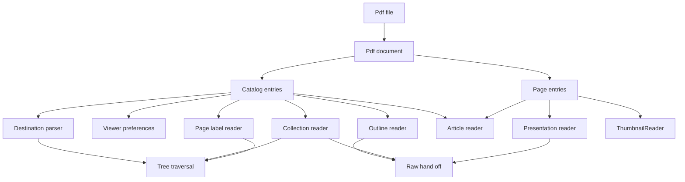
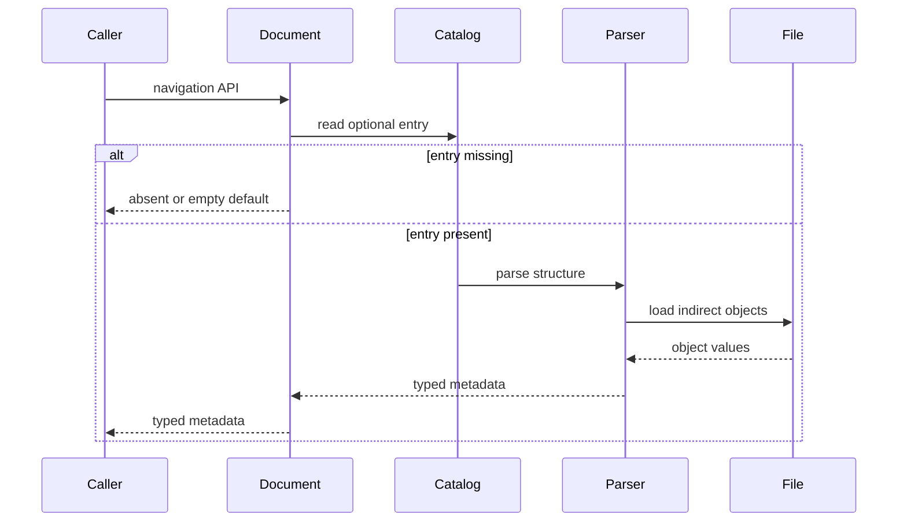
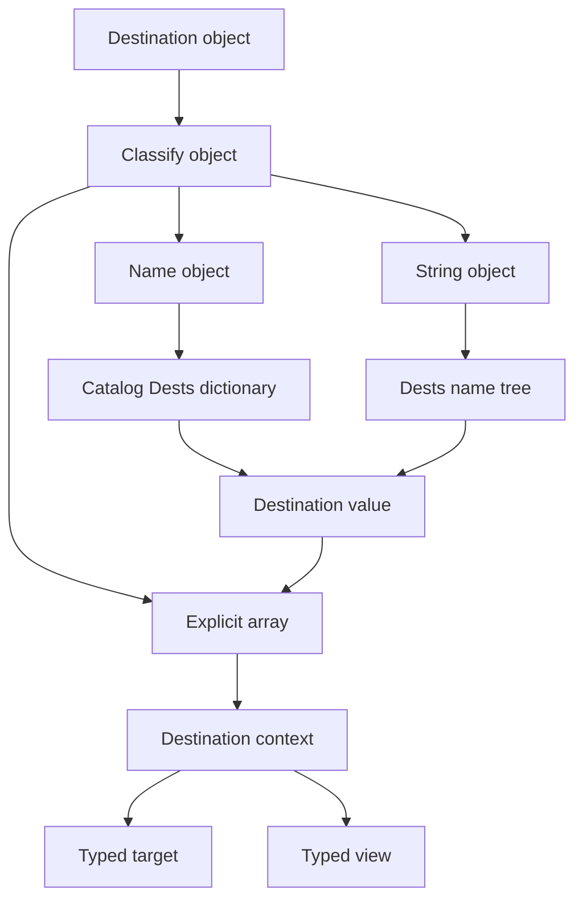
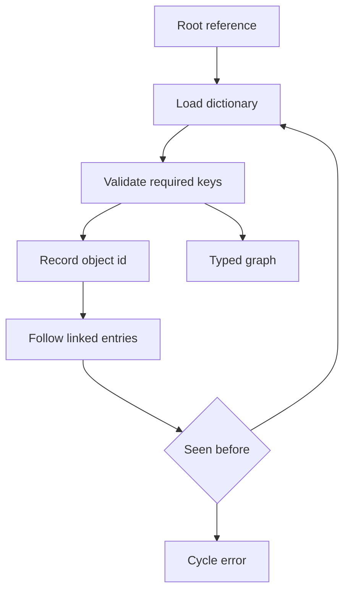
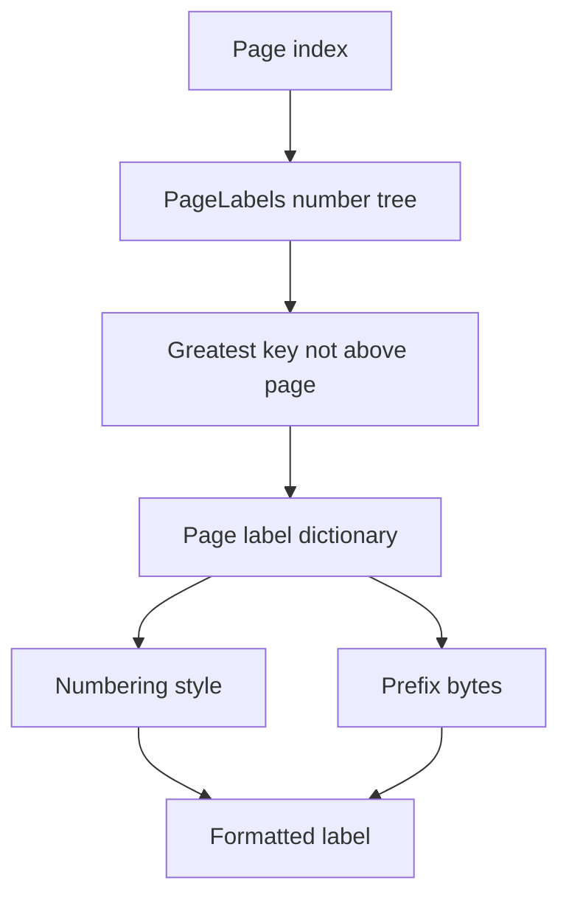
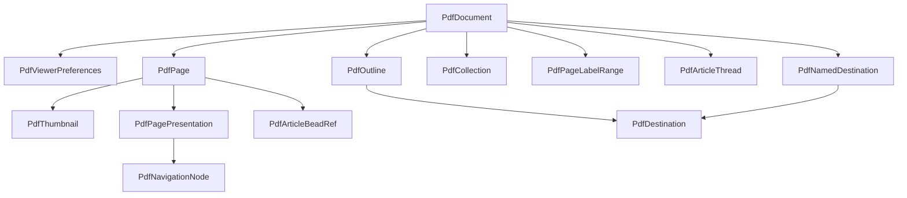

# Design Document

## Overview

This feature delivers typed interactive-navigation metadata for the MoonBit `trkbt10/pdf` parser library. It extends the existing `src/reader` document facade so library users can inspect viewer preferences, destinations, outlines, thumbnails, collections, navigators, page labels, articles, presentations, and sub-page navigation structures described by ISO 32000-2:2020 clauses 12.1 through 12.4.

The feature changes the current reader layer from exposing these Catalog and Page entries as mostly raw objects to exposing typed structural models with bounded validation. It does not execute viewer behavior, actions, JavaScript, annotations, rendering, previews, file opening, or presentation UI.

### Goals
- Parse Catalog-level navigation metadata through `PdfDocument` while preserving lazy object loading.
- Parse Page-level navigation metadata through `PdfPage` without changing page-tree traversal semantics.
- Reuse bounded indirect-reference traversal for destinations, outlines, folders, articles, navigation nodes, name trees, and number trees.
- Expose raw action, file specification, annotation, metadata, and logical-structure values at clear ownership boundaries for adjacent specs.
- Validate malformed navigation structures with reader-layer errors that are distinct from low-level syntax and xref failures.

### Non-Goals
- Interactive PDF processor UI behavior such as hiding toolbars, opening outline panes, selecting collection layouts, previewing files, or advancing slides.
- Action execution, JavaScript, URI handling, Go-To action semantics, annotation activation, multimedia, forms, signatures, measurement, geospatial features, or document requirements.
- Rendering thumbnails, pages, transitions, navigators, optional content, or collection previews.
- Full file-specification parsing, embedded-file extraction, filesystem access, or collection item editing.
- Full logical-structure semantics; structure destinations only resolve the page reference needed by this feature.
- PDF writing or mutation of Catalog, Page, collection folder, free-list, page-label, article, or navigation-node structures.

## Boundary Commitments

### This Spec Owns
- Public reader APIs for interactive-navigation metadata on `PdfDocument` and `PdfPage`.
- Typed models for viewer preferences, destination syntax, named destinations, outline hierarchy, thumbnail descriptors, collection dictionaries, collection folders, navigators, page-label ranges, article threads, presentation settings, and navigation nodes.
- Reusable name-tree enumeration and number-tree range lookup in `src/reader`.
- Bounded indirect-reference traversal with cycle detection for linked navigation object graphs.
- Defaults and fallback semantics explicitly stated in clauses 12.2 through 12.4, such as viewer-preference defaults, collection view defaults, page-label start defaults, transition defaults, and absent page duration behavior.
- Raw hand-off contracts for action dictionaries, file specifications, structure elements, metadata streams, annotation dictionaries, and unknown extensible names.

### Out of Boundary
- Low-level PDF syntax parsing, xref merging, object stream extraction, stream decoding policy, and `PdfObject` representation.
- Rendering or applying viewer preferences, thumbnails, transitions, navigators, optional content, or presentation timing.
- Action dictionary semantics and execution, including Go-To, remote Go-To, embedded Go-To, thread actions, transition actions, URI, launch, and JavaScript.
- Annotation dictionaries and link annotation activation.
- File specification dictionaries, embedded-file streams, collection item editing, encrypted payload processing, and external file access.
- Complete structure-tree traversal and structure element interpretation beyond the page fallback needed for structure destinations.
- Text-string Unicode normalization beyond byte-preserving storage and validation hooks.

### Allowed Dependencies
- MoonBit standard library only; no third-party packages.
- Existing local dependency direction remains unchanged: `objects`, `lexer`, `parser`, `filters`, `content`, and `graphics` stay upstream of or already imported by `reader`; no upstream package imports `reader`.
- Existing `PdfDocument`, `PdfCatalog`, `PdfPage`, `PdfFile::load_object`, `PdfObject`, `PdfDictionary`, `PdfName`, `ObjectId`, and `PdfDocumentError` contracts.
- Existing Catalog entry access, Page entry access, Page tree indexing, and exact-byte name-tree lookup behavior.
- Local extracted specification text under `spec/extracted/12.1-12.4-interactive-navigation.spec.txt`, `spec/extracted/7.7-document-structure.spec.txt`, `spec/extracted/7.9-common-data.md`, and `spec/extracted/7.11-file-specs.md`.

### Revalidation Triggers
- Any public shape change to `PdfDocument`, `PdfCatalog`, `PdfPage`, `PdfFile::load_object`, `PdfObject`, `PdfDictionary`, `PdfName`, `ObjectId`, or `PdfDocumentError`.
- Any change to the package dependency direction or addition of a non-standard dependency.
- Any decision to move navigation metadata out of `src/reader` into a new package.
- Any future typed action, annotation, file-specification, embedded-file, logical-structure, optional-content, or renderer API that replaces a raw hand-off field in this design.
- Any change to name-tree key comparison, number-tree traversal, page-index base, page-object identity, or first-page fallback behavior.
- Any implementation that begins executing UI behavior, JavaScript, actions, presentation timing, file opening, or rendering.

## Architecture

### Existing Architecture Analysis

The repository already has a `src/reader` document facade that resolves the Catalog, validates the Page tree, exposes page access, resolves inherited page attributes, and supports Catalog name-tree lookup. Interactive navigation is a downstream interpretation of Catalog and Page dictionaries, so it belongs in `src/reader` and uses the already validated document facade.

The existing name-tree implementation supports exact lookup by byte key. This feature needs enumeration for named destinations and collection file lists, plus number-tree lookup for page labels. The architecture extends those helpers rather than duplicating tree traversal in feature-specific parsers.

### Architecture Pattern & Boundary Map



**Architecture Integration**:
- Selected pattern: focused reader-layer domain extension over the existing lazy document facade.
- Domain boundaries: `reader` owns structural navigation extraction; lower packages own PDF objects and file loading; adjacent specs own actions, annotations, embedded files, rendering, and logical structure.
- Existing patterns preserved: standard-library-only implementation, package-local files, `pub(all)` externally inspectable types, `suberror` diagnostics, `///|` block boundaries, lazy indirect-reference loading, and white-box tests for package-private helpers.
- New components rationale: each ISO subdomain has a separate parser because defaults, validation rules, and object graph shapes differ, while shared tree and traversal helpers prevent duplicated low-level traversal policy.
- Steering compliance: the feature remains byte-oriented, lazy, testable in `src/reader`, and free of new dependencies.

### Technology Stack

| Layer | Choice / Version | Role in Feature | Notes |
|-------|------------------|-----------------|-------|
| Language | MoonBit project toolchain | Typed navigation models and reader APIs | Follow existing `///|`, `suberror`, and `pub(all)` conventions. |
| PDF object model | `trkbt10/pdf/src/objects` | Names, arrays, dictionaries, strings, streams, references, nulls | No object model changes. |
| File and document access | `trkbt10/pdf/src/reader` | Catalog, Page, object loading, name-tree lookup | Primary implementation package. |
| Data structures | MoonBit standard library `Array`, `Map`, `Bytes` | Tree traversal, visited sets, byte keys, range lookup | No external storage. |
| Validation | `moon check`, `moon test`, `moon fmt`, `moon info` | Type checking, package tests, formatting, public API review | `moon info` must show intended `src/reader` API additions only. |

## File Structure Plan

### Directory Structure

```text
src/
├── reader/
│   ├── document_types.mbt              # Add public navigation model types that belong to document or page facades
│   ├── document_error.mbt              # Add PdfNavigationError wrapping or navigation-specific variants
│   ├── catalog.mbt                     # Add small Catalog entry helpers for navigation keys
│   ├── name_dictionary.mbt             # Extend existing name-tree lookup with enumeration support
│   ├── navigation_common.mbt           # Shared object loading, type accessors, cycle guards, numeric helpers
│   ├── number_tree.mbt                 # Number-tree traversal and range lookup for PageLabels
│   ├── viewer_preferences.mbt          # ViewerPreferences dictionary parsing and defaults
│   ├── destination.mbt                 # Explicit, structure, and named destination parsing
│   ├── outline.mbt                     # Outline root and outline-item linked-list traversal
│   ├── thumbnail.mbt                   # Page Thumb entry and thumbnail descriptor validation
│   ├── collection.mbt                  # Collection dictionary, schema, sort, colors, split, file list, navigator
│   ├── collection_folder.mbt           # Folder tree traversal and embedded-file folder association
│   ├── page_labels.mbt                 # PageLabels number-tree parsing and label formatting
│   ├── articles.mbt                    # Thread and bead traversal plus page bead access
│   ├── presentation.mbt                # Dur, Trans, PresSteps, and navigation-node parsing
│   ├── navigation_tree_wbtest.mbt      # Name-tree enumeration, number-tree lookup, cycle guard tests
│   ├── viewer_preferences_wbtest.mbt   # Viewer preference defaults and validation tests
│   ├── destination_wbtest.mbt          # Explicit, named, local, remote, and structure destination tests
│   ├── outline_wbtest.mbt              # Outline hierarchy, linked-list order, style, and cycle tests
│   ├── thumbnail_wbtest.mbt            # Thumbnail stream descriptor and invalid thumbnail tests
│   ├── collection_wbtest.mbt           # Collection schema, sorting, folders, files, navigator tests
│   ├── page_labels_wbtest.mbt          # Page label range and formatter tests
│   ├── articles_wbtest.mbt             # Thread, bead, and page B entry tests
│   └── presentation_wbtest.mbt         # Transition, duration, PresSteps, and navigation-node tests
└── objects/
    └── no planned changes              # Revalidate if object model contracts change
```

### Modified Files
- `src/reader/document_types.mbt` - Add externally inspectable navigation structs and enums. Keep package-private traversal state out of public types.
- `src/reader/document_error.mbt` - Add navigation-specific error reporting while preserving existing document-structure errors.
- `src/reader/catalog.mbt` - Add helper methods for `ViewerPreferences`, `OpenAction`, `Dests`, `Outlines`, `Collection`, `PageLabels`, and `Threads` entries.
- `src/reader/name_dictionary.mbt` - Keep existing exact lookup and add name-tree entry enumeration with the same byte comparison and cycle policy.
- `src/reader/page_tree.mbt` - Expose only package-private helpers needed for first-page fallback and page object identity checks.
- `src/reader/pkg.generated.mbti` - Regenerate with `moon info` after public API additions.
- `src/reader/moon.pkg` - No planned dependency change; update only if implementation proves an already local import is missing.

### Component to File Mapping

| Component | Primary Files |
|-----------|---------------|
| NavigationBoundary | `src/reader/document_types.mbt`, `src/reader/viewer_preferences.mbt`, `src/reader/destination.mbt`, `src/reader/outline.mbt`, `src/reader/collection.mbt`, `src/reader/page_labels.mbt`, `src/reader/articles.mbt`, `src/reader/presentation.mbt` |
| NavigationCommon | `src/reader/navigation_common.mbt`, `src/reader/document_error.mbt` |
| NameTreeReader | `src/reader/name_dictionary.mbt`, `src/reader/navigation_tree_wbtest.mbt` |
| NumberTreeReader | `src/reader/number_tree.mbt`, `src/reader/navigation_tree_wbtest.mbt` |
| ViewerPreferencesReader | `src/reader/viewer_preferences.mbt`, `src/reader/viewer_preferences_wbtest.mbt` |
| DestinationParser | `src/reader/destination.mbt`, `src/reader/destination_wbtest.mbt` |
| OutlineReader | `src/reader/outline.mbt`, `src/reader/outline_wbtest.mbt` |
| ThumbnailReader | `src/reader/thumbnail.mbt`, `src/reader/thumbnail_wbtest.mbt` |
| CollectionReader | `src/reader/collection.mbt`, `src/reader/collection_wbtest.mbt` |
| CollectionFolderReader | `src/reader/collection_folder.mbt`, `src/reader/collection_wbtest.mbt` |
| PageLabelReader | `src/reader/page_labels.mbt`, `src/reader/page_labels_wbtest.mbt` |
| ArticleReader | `src/reader/articles.mbt`, `src/reader/articles_wbtest.mbt` |
| PresentationReader | `src/reader/presentation.mbt`, `src/reader/presentation_wbtest.mbt` |
| RawHandOffPolicy | `src/reader/document_types.mbt`, `src/reader/navigation_common.mbt` |

## System Flows

### Catalog Navigation Metadata



Missing optional navigation entries return absence or an empty collection according to the API contract. Malformed present entries raise `PdfNavigationError`.

### Destination Resolution



The caller supplies destination context so the first array element is interpreted as local page reference, local structure reference, remote page index, or remote structure ID bytes without guessing.

### Linked Navigation Graph Traversal



Outlines, collection folders, article beads, and navigation nodes share this traversal policy: indirect dictionaries are loaded lazily, required keys are validated per domain, visited object IDs are tracked, and cycles fail fast.

### Page Label Lookup



Page-label formatting is deterministic and local to `src/reader`; it never changes the zero-based page index exposed by `PdfDocument::page`.

## Requirements Traceability

| Requirement | Summary | Components | Interfaces | Flows |
|-------------|---------|------------|------------|-------|
| 1 | Interactive navigation scope and exclusions | NavigationBoundary, RawHandOffPolicy | `PdfDocument` navigation APIs | Catalog Navigation Metadata |
| 2 | Viewer preferences dictionary | ViewerPreferencesReader | `PdfDocument::viewer_preferences` | Catalog Navigation Metadata |
| 2.1 | Document overview through outlines and thumbnails | OutlineReader, ThumbnailReader | `PdfDocument::outline`, `PdfPage::thumbnail` | Catalog Navigation Metadata |
| 2.2 | Destination model and use sites | DestinationParser, RawHandOffPolicy | `parse_destination`, named destination APIs | Destination Resolution |
| 2.3 | Explicit destination syntax | DestinationParser | `PdfDestination`, `PdfDestinationView` | Destination Resolution |
| 2.4 | Structure destinations | DestinationParser | `DestinationContext::LocalStructure`, fallback page helper | Destination Resolution |
| 2.5 | Named destinations | DestinationParser, NameTreeReader | `PdfDocument::named_destination`, `PdfDocument::named_destinations` | Destination Resolution |
| 2.6 | Document outline | OutlineReader, DestinationParser, RawHandOffPolicy | `PdfDocument::outline` | Linked Navigation Graph Traversal |
| 2.7 | Thumbnail images | ThumbnailReader | `PdfPage::thumbnail` | Catalog Navigation Metadata |
| 2.8 | Portable collections | CollectionReader, NameTreeReader, RawHandOffPolicy | `PdfDocument::collection` | Catalog Navigation Metadata |
| 2.9 | Collection hierarchical folders | CollectionFolderReader, NameTreeReader | `PdfCollection.folders`, `PdfCollection.files` | Linked Navigation Graph Traversal |
| 2.10 | Navigators | CollectionReader | `PdfCollection.navigator` | Catalog Navigation Metadata |
| 2.11 | Page-level navigation scope | NavigationBoundary, PageLabelReader, ArticleReader, PresentationReader | `PdfPage` navigation APIs | Catalog Navigation Metadata |
| 2.12 | Page labels | PageLabelReader, NumberTreeReader | `PdfDocument::page_label`, `PdfDocument::page_label_ranges` | Page Label Lookup |
| 2.13 | Articles | ArticleReader | `PdfDocument::threads`, `PdfPage::article_beads` | Linked Navigation Graph Traversal |
| 2.14 | Presentations | PresentationReader | `PdfPage::presentation` | Catalog Navigation Metadata |
| 2.15 | Sub-page navigation | PresentationReader, RawHandOffPolicy | `PdfPage::navigation_nodes` | Linked Navigation Graph Traversal |

## Components and Interfaces

| Component | Domain | Intent | Req Coverage | Key Dependencies | Contracts |
|-----------|--------|--------|--------------|------------------|-----------|
| NavigationBoundary | Reader facade | Keep parser-library ownership separate from viewer behavior and adjacent specs | 1, 2.11 | `PdfDocument` P0, `PdfPage` P0 | API |
| NavigationCommon | Reader helpers | Provide object loading, typed accessors, numeric parsing, and cycle guards | 2.3, 2.6, 2.8, 2.9, 2.13, 2.15 | `PdfFile` P0, `objects` P0 | Service |
| NameTreeReader | Reader helpers | Lookup and enumerate name-tree entries by exact byte keys | 2.5, 2.8, 2.9 | Existing `name_dictionary.mbt` P0 | Service |
| NumberTreeReader | Reader helpers | Find page-label range values by page index | 2.12 | `PdfFile` P0, `objects` P0 | Service |
| ViewerPreferencesReader | Catalog navigation | Parse ViewerPreferences with defaults and constrained names | 2 | Catalog P0 | Service, State |
| DestinationParser | Document navigation | Parse explicit, structure, and named destinations with context-aware targets | 2.2, 2.3, 2.4, 2.5 | NameTreeReader P0, Page tree P1 | Service, State |
| OutlineReader | Document navigation | Traverse outline root and item linked lists in display order | 2.1, 2.6 | DestinationParser P0, NavigationCommon P0 | Service, State |
| ThumbnailReader | Page navigation | Validate and expose page thumbnail image stream metadata | 2.1, 2.7 | `PdfPage` P0, `objects` P0 | Service, State |
| CollectionReader | Document navigation | Parse collection dictionary, schema, sorting, colors, split, files, and navigator | 2.8, 2.10 | NameTreeReader P0, CollectionFolderReader P0 | Service, State |
| CollectionFolderReader | Document navigation | Traverse folder tree and associate EmbeddedFiles entries with folder IDs | 2.9 | NavigationCommon P0, NameTreeReader P0 | Service, State |
| PageLabelReader | Page navigation | Parse page-label ranges and format labels for page indices | 2.11, 2.12 | NumberTreeReader P0, Page tree P0 | Service, State |
| ArticleReader | Page navigation | Parse thread dictionaries, bead rings, and page bead arrays | 2.11, 2.13 | NavigationCommon P0, `PdfPage` P0 | Service, State |
| PresentationReader | Page navigation | Parse Dur, Trans, PresSteps, and navigation-node links | 2.11, 2.14, 2.15 | NavigationCommon P0, RawHandOffPolicy P0 | Service, State |
| RawHandOffPolicy | Integration boundary | Preserve raw values owned by actions, annotations, file specs, rendering, and structure specs | 1, 2.2, 2.6, 2.8, 2.13, 2.15 | `objects` P0 | State |

### Reader Navigation Layer

#### NavigationCommon

| Field | Detail |
|-------|--------|
| Intent | Centralize PDF object validation and traversal safeguards used by navigation parsers. |
| Requirements | 2.3, 2.6, 2.8, 2.9, 2.13, 2.15 |

**Responsibilities & Constraints**
- Load indirect objects through `PdfFile::load_object` and wrap low-level failures.
- Validate expected dictionary, stream, array, name, string, integer, number, boolean, and reference shapes.
- Track visited `ObjectId` values for linked structures and tree traversal.
- Keep helpers package-private unless a public reader API needs the contract.

**Dependencies**
- Inbound: all navigation parsers - shared structural validation (P0).
- Outbound: `PdfFile` - lazy object loading (P0).
- Outbound: `objects` - PDF value inspection (P0).

**Contracts**: Service [x] / API [ ] / Event [ ] / Batch [ ] / State [ ]

##### Service Interface
```moonbit
fn load_navigation_object(file : PdfFile, id : @objects.ObjectId) -> @objects.PdfObject raise PdfNavigationError
fn require_navigation_dictionary(object : @objects.PdfObject, context : String) -> @objects.PdfDictionary raise PdfNavigationError
fn mark_visited(seen : Map[@objects.ObjectId, Bool], id : @objects.ObjectId, context : String) -> Unit raise PdfNavigationError
```
- Preconditions: callers pass object IDs from already parsed PDF objects.
- Postconditions: loaded values preserve lazy reader semantics and do not mutate `PdfFile`.
- Invariants: cycle checks are based on indirect object identity, not dictionary equality.

#### ViewerPreferencesReader

| Field | Detail |
|-------|--------|
| Intent | Parse the Catalog `ViewerPreferences` dictionary into typed settings with ISO defaults. |
| Requirements | 2 |

**Responsibilities & Constraints**
- Return `None` when the Catalog has no `ViewerPreferences` entry.
- Default absent boolean entries to `false` where specified.
- Preserve implementation-dependent entries such as `Duplex`, `PickTrayByPDFSize`, `PrintPageRange`, and `NumCopies` as optional typed values.
- Treat unrecognized `PrintScaling` as `AppDefault`; validate `Enforce` names against the allowed list.
- Store deprecated page-boundary preference names as typed enum values without rendering or printing behavior.

**Dependencies**
- Inbound: `PdfDocument::viewer_preferences` - public facade (P0).
- Outbound: Catalog entry access - source dictionary (P0).
- Outbound: NavigationCommon - type validation (P0).

**Contracts**: Service [x] / API [x] / Event [ ] / Batch [ ] / State [x]

##### Service Interface
```moonbit
pub fn PdfDocument::viewer_preferences(self : PdfDocument) -> PdfViewerPreferences? raise PdfDocumentError
```
- Preconditions: `PdfDocument` has a validated Catalog.
- Postconditions: missing dictionary returns `None`; present malformed dictionary raises a navigation error.
- Invariants: returned values describe author preferences only and never change application UI.

#### DestinationParser

| Field | Detail |
|-------|--------|
| Intent | Parse direct and indirect destination syntax with explicit caller context. |
| Requirements | 2.2, 2.3, 2.4, 2.5 |

**Responsibilities & Constraints**
- Parse view forms `XYZ`, `Fit`, `FitH`, `FitV`, `FitR`, `FitB`, `FitBH`, and `FitBV`.
- Preserve `null` and `0` zoom retention semantics in the `XYZ` view model.
- Resolve legacy Catalog `Dests` dictionary entries and Catalog `Names` dictionary `Dests` name-tree entries.
- Accept named destinations represented by name objects or byte strings.
- Support local page reference, local structure reference, remote page index, and remote structure ID target contexts.
- Resolve the page for local structure destinations only as far as required by 2.4; full logical-structure ownership remains out of boundary.

**Dependencies**
- Inbound: OutlineReader and future actions/annotations - destination parsing (P1).
- Outbound: NameTreeReader - named destination lookup and enumeration (P0).
- Outbound: Page tree helpers - first-page fallback and page reference validation (P1).
- Outbound: NavigationCommon - typed object access (P0).

**Contracts**: Service [x] / API [x] / Event [ ] / Batch [ ] / State [x]

##### Service Interface
```moonbit
pub fn PdfDocument::named_destination(self : PdfDocument, key : Bytes) -> PdfDestination? raise PdfDocumentError
pub fn PdfDocument::named_destinations(self : PdfDocument) -> Array[PdfNamedDestination] raise PdfDocumentError
fn parse_destination(object : @objects.PdfObject, context : DestinationContext) -> PdfDestination raise PdfNavigationError
```
- Preconditions: named-destination lookup keys use exact PDF string bytes.
- Postconditions: missing named destination returns `None`; malformed destination value raises a navigation error.
- Invariants: action dictionaries remain raw and are never executed.

#### OutlineReader

| Field | Detail |
|-------|--------|
| Intent | Expose the document outline hierarchy in display order. |
| Requirements | 2.1, 2.6 |

**Responsibilities & Constraints**
- Parse the Catalog `Outlines` root when present.
- Traverse `First`, `Last`, `Prev`, `Next`, `Parent`, and child links as indirect dictionaries.
- Preserve outline item `Title` bytes, color components, style flags, count sign, destination, action dictionary, and structure element reference.
- Enforce `Dest` and `A` mutual exclusion by reporting malformed items when both are present.
- Return raw `A` and `SE` objects without action or structure semantics.

**Dependencies**
- Inbound: `PdfDocument::outline` - public facade (P0).
- Outbound: DestinationParser - optional item destinations (P0).
- Outbound: RawHandOffPolicy - raw actions and structure elements (P0).
- Outbound: NavigationCommon - linked-list traversal and cycles (P0).

**Contracts**: Service [x] / API [x] / Event [ ] / Batch [ ] / State [x]

##### Service Interface
```moonbit
pub fn PdfDocument::outline(self : PdfDocument) -> PdfOutline? raise PdfDocumentError
```
- Preconditions: Catalog `Outlines`, when present, resolves to a dictionary.
- Postconditions: returned top-level items appear in linked-list order.
- Invariants: open or closed state is metadata only; the parser does not manage UI visibility.

#### CollectionReader and CollectionFolderReader

| Field | Detail |
|-------|--------|
| Intent | Parse portable collection metadata, navigator metadata, and folder associations. |
| Requirements | 2.8, 2.9, 2.10 |

**Responsibilities & Constraints**
- Parse collection `Schema`, `D`, `View`, `Sort`, `Colors`, `Split`, `Navigator`, and `Folders`.
- Enumerate `EmbeddedFiles` name-tree entries to identify collection members.
- Preserve file specification values as raw `PdfObject` values.
- Parse folder IDs, names, parent-child-sibling links, folder metadata, thumbnail references, free ID ranges, and collection item dictionaries.
- Associate file keys with folder IDs using byte-preserving parsing of the `<id>` prefix. Nonconforming keys belong to the root folder.
- Preserve unknown navigator layout names while ensuring at least one standard fallback layout is present.

**Dependencies**
- Inbound: `PdfDocument::collection` - public facade (P0).
- Outbound: NameTreeReader - EmbeddedFiles enumeration (P0).
- Outbound: NavigationCommon - folder traversal and validation (P0).
- Outbound: ThumbnailReader - folder thumbnail descriptor where feasible (P2).
- Outbound: RawHandOffPolicy - file specifications and collection item dictionaries (P0).

**Contracts**: Service [x] / API [x] / Event [ ] / Batch [ ] / State [x]

##### Service Interface
```moonbit
pub fn PdfDocument::collection(self : PdfDocument) -> PdfCollection? raise PdfDocumentError
```
- Preconditions: Catalog `Collection`, when present, is a dictionary.
- Postconditions: file entries are enumerated from `EmbeddedFiles`; absent `EmbeddedFiles` produces an empty file list.
- Invariants: no embedded file is opened, decoded, previewed, edited, or written.

#### PageLabelReader

| Field | Detail |
|-------|--------|
| Intent | Convert PageLabels number-tree ranges into labels for zero-based page indices. |
| Requirements | 2.11, 2.12 |

**Responsibilities & Constraints**
- Parse the Catalog `PageLabels` number tree and require a range for page index `0` when the tree is present.
- Select the greatest range key less than or equal to the requested page index.
- Support decimal, uppercase Roman, lowercase Roman, uppercase alphabetic, lowercase alphabetic, and prefix-only labels.
- Validate `St >= 1` and default missing `St` to `1`.
- Keep `PdfDocument::page` zero-based indexing unchanged.

**Dependencies**
- Inbound: `PdfDocument::page_label`, `PdfDocument::page_label_ranges` - public facades (P0).
- Outbound: NumberTreeReader - range lookup and enumeration (P0).
- Outbound: Page tree index - page count bounds (P0).

**Contracts**: Service [x] / API [x] / Event [ ] / Batch [ ] / State [x]

##### Service Interface
```moonbit
pub fn PdfDocument::page_label(self : PdfDocument, index : Int) -> String? raise PdfDocumentError
pub fn PdfDocument::page_label_ranges(self : PdfDocument) -> Array[PdfPageLabelRange] raise PdfDocumentError
```
- Preconditions: page index is zero-based.
- Postconditions: absent `PageLabels` returns `None` for `page_label` and an empty array for ranges.
- Invariants: labels are display metadata and never replace page indices.

#### ArticleReader

| Field | Detail |
|-------|--------|
| Intent | Expose article threads and bead navigation metadata. |
| Requirements | 2.11, 2.13 |

**Responsibilities & Constraints**
- Parse Catalog `Threads` as an array of thread dictionaries.
- Traverse bead rings from the thread `F` entry through `N` and `V`.
- Validate bead page reference `P` and rectangle `R`.
- Expose thread information dictionary and metadata stream as raw objects.
- Parse Page `B` entry as bead references in drawing order.

**Dependencies**
- Inbound: `PdfDocument::threads`, `PdfPage::article_beads` - public facades (P0).
- Outbound: NavigationCommon - circular list traversal and rectangle parsing (P0).
- Outbound: RawHandOffPolicy - info and metadata dictionaries (P0).

**Contracts**: Service [x] / API [x] / Event [ ] / Batch [ ] / State [x]

##### Service Interface
```moonbit
pub fn PdfDocument::threads(self : PdfDocument) -> Array[PdfArticleThread] raise PdfDocumentError
pub fn PdfPage::article_beads(self : PdfPage) -> Array[PdfArticleBeadRef] raise PdfDocumentError
```
- Preconditions: `Threads`, when present, is an array.
- Postconditions: absent `Threads` or Page `B` returns an empty array.
- Invariants: thread navigation is metadata only; the parser does not scroll or follow beads.

#### PresentationReader

| Field | Detail |
|-------|--------|
| Intent | Expose page presentation timing, transition metadata, and sub-page navigation nodes. |
| Requirements | 2.11, 2.14, 2.15 |

**Responsibilities & Constraints**
- Parse Page `Dur` as optional display duration; absence means no automatic advance.
- Parse `Trans` transition dictionary with style defaults and style-specific optional entries.
- Parse Page `PresSteps` as the primary navigation node when present.
- Traverse navigation nodes through `Next` and `Prev` with cycle detection.
- Preserve `NA` and `PA` action dictionaries as raw values.

**Dependencies**
- Inbound: `PdfPage::presentation`, `PdfPage::navigation_nodes` - public facades (P0).
- Outbound: NavigationCommon - transition and linked-node parsing (P0).
- Outbound: RawHandOffPolicy - raw action dictionaries (P0).

**Contracts**: Service [x] / API [x] / Event [ ] / Batch [ ] / State [x]

##### Service Interface
```moonbit
pub fn PdfPage::presentation(self : PdfPage) -> PdfPagePresentation raise PdfDocumentError
pub fn PdfPage::navigation_nodes(self : PdfPage) -> Array[PdfNavigationNode] raise PdfDocumentError
```
- Preconditions: Page dictionary has already been validated by document structure.
- Postconditions: missing optional entries return defaults or empty arrays.
- Invariants: presentation timing, transitions, and optional-content state changes are not executed.

## Data Models

### Domain Model



The aggregate root remains `PdfDocument`. `PdfPage` is a handle into the document facade, not a separate storage owner. Navigation models are immutable snapshots of parsed metadata returned by reader APIs.

### Logical Data Model

**Structure Definition**:
- `PdfViewerPreferences` stores booleans, enum preferences, page-boundary names, print options, enforce names, and implementation-dependent optional values.
- `PdfDestination` stores a `PdfDestinationTarget` and `PdfDestinationView`. Target variants distinguish local page refs, local structure refs, remote page indices, and remote structure IDs.
- `PdfNamedDestination` stores the byte key, source kind, destination, and optional raw attributes from destination dictionaries.
- `PdfOutline` stores root count and ordered top-level `PdfOutlineItem` values. Each item stores title bytes, count, style, color, optional destination, optional raw action, optional raw structure element, and children.
- `PdfThumbnail` stores the page index, raw stream object, dimensions, colour-space classification, bits per component, decode array, and byte status. It does not decode or render samples.
- `PdfCollection` stores schema fields, initial document key, view mode, sort keys, color suggestions, split settings, navigator layouts, file entries, and optional folder tree.
- `PdfPageLabelRange` stores start page index, style, prefix bytes, and start number.
- `PdfArticleThread` stores a first-bead reference, ordered bead list, raw info dictionary, and raw metadata stream.
- `PdfPagePresentation` stores optional duration, optional transition dictionary metadata, and optional primary navigation node.
- `PdfNavigationNode` stores raw forward and backward actions plus next and previous node references.

**Consistency & Integrity**:
- Object graph identity uses `ObjectId`; direct dictionaries without object IDs are parsed as values but cannot participate in cycle identity.
- Name-tree keys remain exact `Bytes`; display decoding is not part of equality.
- Page labels use zero-based page indices and never alter page access.
- Missing optional entries return `None` or empty arrays. Present malformed entries raise `PdfNavigationError`.
- Raw hand-off fields preserve the original `PdfObject` so adjacent specs can reinterpret them without lossy conversion.

### Data Contracts & Integration

**API Data Transfer**
- All public navigation APIs return MoonBit structs and enums, not JSON or external serialization.
- Public enum types that callers need to pattern match use `pub(all)`.
- Raw hand-off fields use `@objects.PdfObject` or `@objects.PdfName` with documented ownership boundaries.

**Cross-Spec Integration**
- `pdf-actions` consumes raw action fields and may later replace them with typed action APIs.
- `pdf-annotations` owns link annotations and annotation activation; this spec only exposes destinations reusable by that future work.
- Future file-specification work owns file specification dictionaries and embedded-file stream semantics.
- Future logical-structure work owns complete structure-tree semantics; this spec only implements the page fallback needed for local structure destinations.
- Rendering and graphics specs own transition effects, optional content visualization, image rendering, and page preview behavior.

## Error Handling

### Error Strategy
- Add a navigation-specific error category, either `PdfNavigationError` wrapped by `PdfDocumentError` or dedicated `PdfDocumentError` variants if implementation keeps one error type.
- Wrap `PdfReaderError` only when object loading fails; do not collapse malformed navigation dictionaries into low-level reader errors.
- Treat absent optional structures as absence, not failure.
- Treat present but malformed structures as failures with the object ID or key context when available.
- Fail fast on cycles in outlines, folders, beads, navigation nodes, name trees, and number trees.

### Error Categories and Responses
- Invalid type: a required dictionary, stream, array, name, string, number, boolean, or reference has the wrong `PdfObject` variant.
- Invalid value: a constrained name, flag bit, color component, page index, label start, folder ID, free-list range, split percentage, or transition direction violates the allowed range.
- Invalid graph: a linked list, tree, or ring has a cycle, missing required link, repeated object, mismatched parent, or malformed root.
- Missing required entry: a present structure omits a required key such as outline item `Title`, collection field `Subtype`, folder `ID`, thread `F`, bead `R`, or navigation fallback layout.
- Boundary violation: an implementation attempts to execute an action, open an embedded file, render a transition, or mutate a collection structure.

### Monitoring
There is no runtime monitoring or logging layer in this parser library. Validation is through returned values, raised errors, package tests, and `moon info` API review.

## Testing Strategy

### Unit Tests
- `viewer_preferences_wbtest.mbt`: verify defaults for absent booleans, valid enum parsing, `PrintScaling` fallback to `AppDefault`, `Enforce` validation, and malformed dictionary errors for 2.
- `destination_wbtest.mbt`: cover all explicit destination views, `null` retention values, named destination lookup in Catalog `Dests` and Names `Dests`, local structure target fallback, remote page index, and remote structure ID bytes for 2.2, 2.3, 2.4, 2.5.
- `outline_wbtest.mbt`: verify linked-list order, child hierarchy, count sign, color and style flags, `Dest` and `A` exclusion, raw action preservation, and cycle errors for 2.6.
- `collection_wbtest.mbt`: verify schema fields, sort arrays and default ascending values, colors, split defaults, `D` initial document selection metadata, navigator fallback layouts, raw file specification preservation, and empty EmbeddedFiles behavior for 2.8 and 2.10.
- `collection_wbtest.mbt` and `navigation_tree_wbtest.mbt`: verify folder IDs, sibling name restrictions at the byte validation boundary, free ranges, folder file association by `<id>` prefix, root fallback for nonconforming keys, and folder cycles for 2.9.
- `page_labels_wbtest.mbt`: verify number-tree lookup, required page index `0`, decimal, Roman, alphabetic, prefix-only labels, `St` default, and invalid `St` for 2.12.
- `articles_wbtest.mbt`: verify thread arrays, bead rings, page bead `B` drawing order, rectangle parsing, metadata hand-off, and cycle limits for 2.13.
- `presentation_wbtest.mbt`: verify `Dur`, transition defaults, style-specific fields, `Di /None`, `PresSteps`, raw `NA` and `PA` action hand-off, and navigation-node cycles for 2.14 and 2.15.

### Integration Tests
- Build synthetic PDFs with Catalog `ViewerPreferences`, `Outlines`, `Dests`, `Collection`, `PageLabels`, `Threads`, and Page `Thumb`, `Dur`, `Trans`, `PresSteps`, and `B` entries, then access them through `PdfDocument` and `PdfPage` APIs.
- Reuse existing document-structure fixtures to verify new APIs do not change page count, page ordering, inherited page attribute lookup, or exact Catalog entry access.
- Verify name-tree enumeration and existing exact lookup agree on shared entries for named destinations and EmbeddedFiles.
- Verify malformed optional navigation entries raise navigation errors while missing optional entries return `None` or empty arrays.
- Run `moon info` and inspect `src/reader/pkg.generated.mbti` to ensure public API changes are intentional and limited to reader navigation.

### E2E and UI Tests
- Not applicable. The project is a parser library and this spec does not add UI, CLI behavior, rendering, or action execution.

### Performance and Robustness
- Test large name trees, number trees, outline lists, folder trees, bead rings, and navigation-node lists with linear traversal expectations.
- Test repeated public API calls to ensure expensive page-index traversal remains cached and navigation parsing does not mutate document state.
- Test cycle and repeated-reference cases to ensure traversal terminates deterministically.

## Optional Sections

### Security Considerations
- Raw action dictionaries are exposed but never executed.
- JavaScript, URI, launch, embedded-file opening, and filesystem access are out of boundary.
- Collection file specifications and metadata streams are preserved as raw objects and not decoded into external resources by this feature.
- Cycle detection prevents malformed PDFs from causing unbounded traversal in navigation object graphs.
- Byte strings are preserved; text decoding is display-only where needed and must not drive equality or normalization-sensitive decisions.

### Performance & Scalability
- Navigation parsing remains lazy at API boundaries; document opening continues to resolve only the existing Catalog and Page tree requirements.
- Tree traversal uses `Map[ObjectId, Bool]` visited sets for indirect object graphs.
- Name-tree enumeration is linear in entries returned; exact lookup may continue to use `Limits` pruning.
- Page-label lookup uses number-tree traversal and range selection rather than scanning every page.
- No decoded image samples, embedded files, rendered previews, or transition frames are materialized.

### Migration Strategy
- No data migration is required.
- Existing document-structure APIs remain source-compatible.
- New APIs are additive in `src/reader`; any public API expansion must be reviewed through `moon info`.

## Supporting References

- `.kiro/specs/pdf-interactive-navigation/requirements.md` - authoritative requirements and numeric IDs for this design.
- `.kiro/specs/pdf-interactive-navigation/research.md` - discovery findings, pattern evaluation, decisions, risks, and synthesis notes.
- `spec/extracted/12.1-12.4-interactive-navigation.spec.txt` - local ISO 32000-2:2020 clause excerpt used to derive the requirements.
- `.kiro/specs/pdf-document-structure/design.md` - upstream document facade, Catalog, Page tree, Page, and name dictionary contracts.
- `.kiro/specs/pdf-actions/requirements.md` - adjacent action dictionary ownership boundary.
- `.kiro/specs/pdf-annotations/requirements.md` - adjacent annotation ownership boundary.
- `.kiro/steering/product.md`, `.kiro/steering/tech.md`, `.kiro/steering/structure.md` - project-wide product, technology, and layout guidance.
