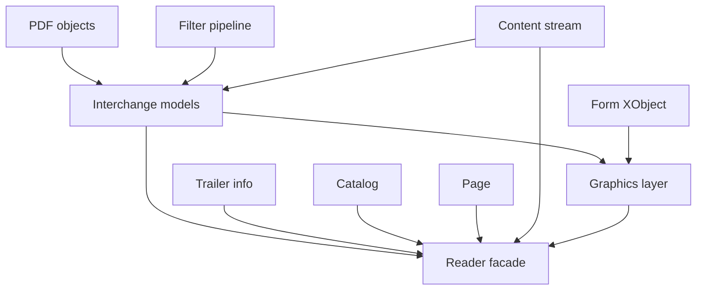
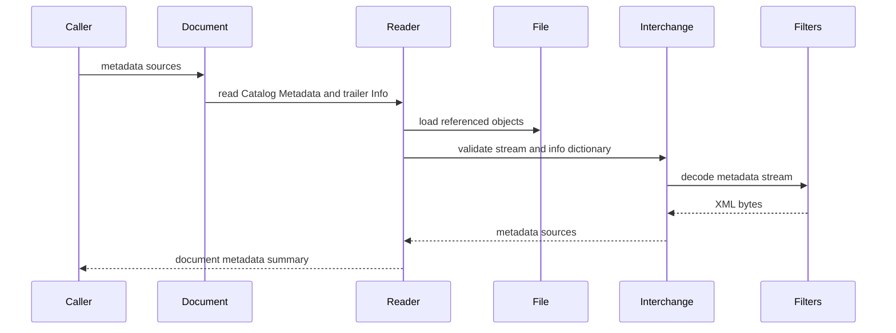
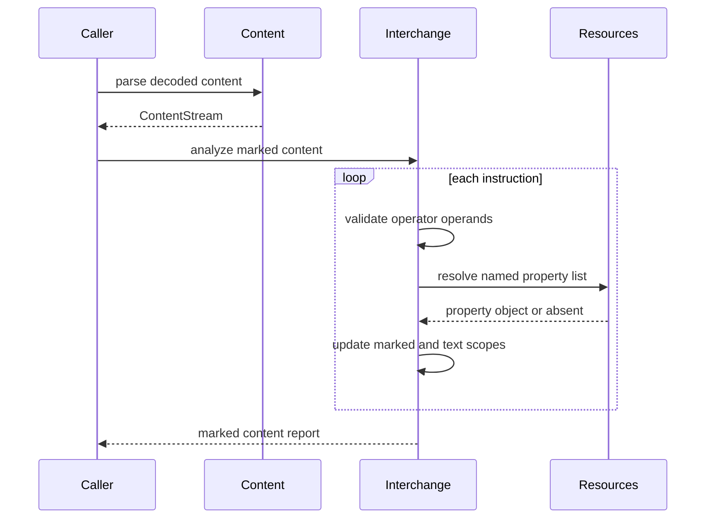
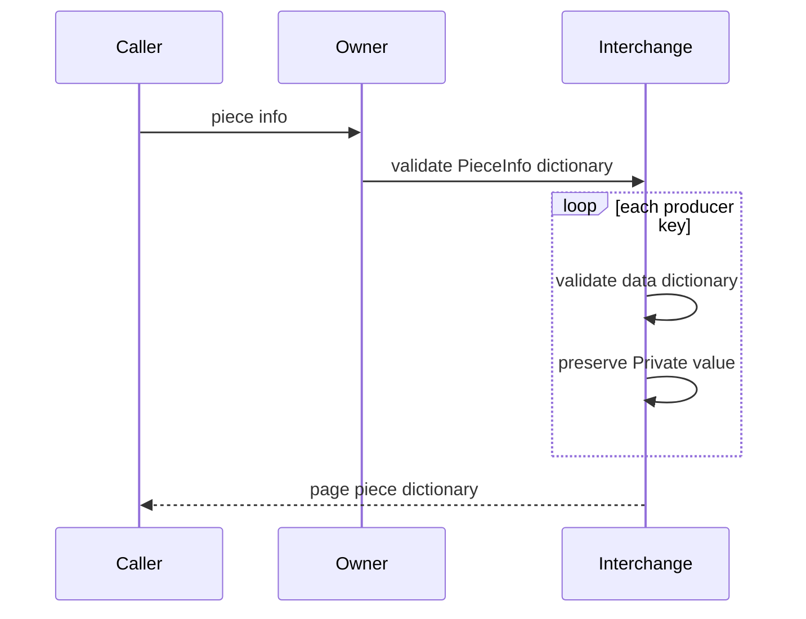
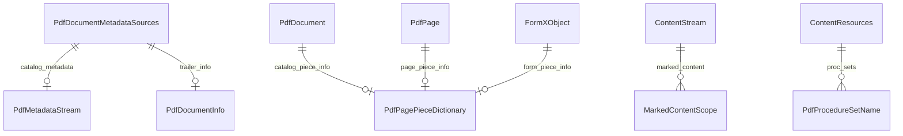

# Design Document

## Overview
This feature delivers read-side support for ISO 32000-2:2020 clause 14.1 through 14.6 interchange basics in the MoonBit `trkbt10/pdf` library. It exposes document metadata sources, validates metadata streams, surfaces the document information dictionary, provides file identifier access, validates page-piece dictionaries, and adds structural analysis for procedure sets and marked-content property lists.

Library users and later extraction, accessibility, logical-structure, and writer phases use this layer to inspect interchange metadata without changing final page appearance. The design extends existing `reader`, `content`, and `graphics` APIs and introduces a small `interchange` package for shared value models; it does not add PDF writing, XMP semantic parsing, PostScript procedure execution, rendering, logical structure, or Tagged PDF behavior.

### Goals
- Validate and expose document-level and object-level metadata streams as raw XML metadata payloads.
- Resolve and expose the trailer `Info` document information dictionary with typed known keys and raw preservation.
- Provide file identifier comparison helpers over the existing `PdfFileId` model.
- Validate Catalog, Page, and Form XObject `PieceInfo` dictionaries while preserving private producer data.
- Validate predefined `ProcSet` names without changing raw resource lookup behavior.
- Analyze marked-content operators for operand shape, balanced scopes, property-list references, and BT/ET nesting.

### Non-Goals
- PDF writing, incremental update creation, metadata mutation, file identifier generation, or MD5 digest computation.
- Parsing XMP XML into semantic Dublin Core, XMP, or PDF schema fields.
- Rendering, PostScript procedure execution, printer communication, or operator implementation lookup from `ProcSet`.
- Logical structure, Tagged PDF, accessibility role mapping, associated files, document parts, prepress support, web capture, or clauses 14.7 through 14.13.
- Changing low-level `PdfObject`, lexer, parser, xref, stream filter, page tree, content parsing, graphics interpretation, or rendering contracts except where explicitly listed.

## Boundary Commitments

### This Spec Owns
- A shared `src/interchange` package for generic clause 14.1 through 14.6 value models and validation helpers that do not require reader-owned object loading.
- Reader-level APIs that expose document metadata streams, document information dictionaries, file identifiers, and Catalog/Page `PieceInfo`.
- Content-level APIs that validate `ProcSet` names and marked-content structural rules over parsed content instructions.
- Graphics Form XObject preservation of validated or raw `PieceInfo` data through the shared interchange model.
- Read-side diagnostics for metadata source presence and exact-byte date comparisons when both sources are available.
- Clear handoff boundaries for future logical structure, Tagged PDF, associated files, and writer specs.

### Out of Boundary
- Writer behavior from 2.4 and 3: no new document creation, metadata synchronization, identifier generation, incremental update mutation, or hash policy.
- XMP grammar validation beyond metadata stream shape and byte preservation.
- XML namespace interpretation, multilingual title extraction, author list extraction, date normalization, or semantic equivalence between XMP and Info entries.
- Rendering or printing use of procedure sets.
- Interpreting private `PieceInfo.Private` payloads.
- Resolving logical structure, MCIDs, structure parent trees, role maps, accessibility attributes, or Tagged PDF semantics.
- Evaluating optional-content visibility. Existing `graphics` optional-content behavior remains authoritative for visibility.

### Allowed Dependencies
- MoonBit standard library only.
- `src/interchange` may import `trkbt10/pdf/src/objects`, `src/filters`, and `src/content`.
- `src/content` may add local files for `ProcSet` and marked-content analysis using `objects` and existing content parser types.
- `src/graphics` may import `src/interchange` for Form XObject `PieceInfo` preservation and may continue importing `objects`, `content`, and `filters`.
- `src/reader` may import `src/interchange`, `src/content`, and `src/graphics` for document/page bridges and error wrapping.
- Existing local specification excerpts under `spec/extracted/14.1-14.6-interchange-basics.spec.txt`.

### Revalidation Triggers
- Any public shape change to `PdfObject`, `PdfName`, `PdfDictionary`, `PdfStream`, `ObjectId`, `PdfFile`, `TrailerInfo`, `PdfFileId`, `ContentInstruction`, `ContentOperation`, `ContentResources`, or `FormXObject`.
- Any change to whether `PdfStream.data` stores encoded or decoded bytes.
- Adding an XML parser, date parser, hash dependency, PDF writer, incremental-update writer, or metadata mutation API.
- Moving optional-content visibility, logical structure, Tagged PDF, associated files, or document parts into this spec.
- Changing package dependency direction involving `objects`, `filters`, `content`, `interchange`, `graphics`, or `reader`.
- Tightening raw resource lookup behavior for deprecated `ProcSet` instead of keeping typed validation opt-in.

## Architecture

### Existing Architecture Analysis
The repository already implements low-level PDF objects, stream filters, file reading, document structure, content stream parsing, graphics interpretation, XObjects, and optional content. `TrailerInfo.id` and `TrailerInfo.info` exist in `src/reader/types.mbt`, `read_trailer_file_id` already validates PDF 2.0 trailer identifiers, and `PdfCatalog::entry` exposes raw Catalog entries including `Metadata` and `PieceInfo`.

The `src/content` package already recognizes `MP`, `DP`, `BMC`, `BDC`, and `EMC`, and `ContentResources` already exposes `Properties` and deprecated `ProcSet` resource categories. The `src/graphics` interpreter currently treats marked-content operators as events and optional-content visibility controls, while `FormXObject` preserves metadata but not page-piece dictionaries. This feature adds structural interchange validation around those existing surfaces.

### Architecture Pattern & Boundary Map



**Architecture Integration**:
- Selected pattern: shared structural validators with owner-specific bridges. `interchange` owns generic clause 14 shapes; `reader`, `content`, and `graphics` expose them where the source object lives.
- Domain boundaries: file loading and Catalog/Page traversal remain in `reader`; syntax parsing and resource dictionaries remain in `content`; Form XObject dictionary validation remains in `graphics`; generic metadata and page-piece shapes live in `interchange`.
- Existing patterns preserved: package-per-directory layout, standard-library-only dependencies, typed structs/enums, `suberror` diagnostics, `///|` block separation, lazy object loading, and package-local tests.
- New components rationale: metadata streams, Info dictionaries, file identifiers, page-piece dictionaries, procedure sets, and marked content have different source objects but share interchange semantics.
- Steering compliance: the design remains read-only, byte-oriented, independently testable, and avoids external dependencies.

### Technology Stack

| Layer | Choice / Version | Role in Feature | Notes |
|-------|------------------|-----------------|-------|
| Language | MoonBit project toolchain | Typed interchange models and APIs | Use explicit structs, `pub(all) enum`, and `suberror`. |
| Object model | `trkbt10/pdf/src/objects` | Names, dictionaries, streams, strings, arrays, refs, and raw payloads | No object-model changes. |
| Stream decoding | `trkbt10/pdf/src/filters` | Decode metadata stream bytes when exposed through reader APIs | No new filters. |
| Content model | `trkbt10/pdf/src/content` | Procedure sets, marked-content operators, resources, property lists | Add opt-in structural analysis. |
| Graphics model | `trkbt10/pdf/src/graphics` | Form XObject `PieceInfo` preservation and optional-content coexistence | No rendering behavior changes. |
| Reader model | `trkbt10/pdf/src/reader` | Trailer, Catalog, Page, object loading, public document APIs | Add interchange facade methods. |
| Build and test | `moon check`, `moon test`, `moon fmt`, `moon info` | Validation and public API review | `moon info` must show intended API additions. |

## File Structure Plan

### Directory Structure

```text
src/
├── interchange/
│   ├── moon.pkg                         # Imports objects, filters, content
│   ├── error.mbt                        # PdfInterchangeError with component labels
│   ├── types.mbt                        # Shared metadata, info, file-id, page-piece, ProcSet, marked-content models
│   ├── metadata.mbt                     # Metadata stream shape validation and decoded-byte wrapper
│   ├── document_info.mbt                # Info dictionary known-key extraction and raw preservation
│   ├── file_id.mbt                      # PdfFileId comparison helpers and reference match result
│   ├── page_piece.mbt                   # PieceInfo and data dictionary validation
│   ├── proc_set.mbt                     # Predefined procedure-set name validation
│   ├── marked_content.mbt               # Marked-content operands, property lists, scope analyzer
│   ├── metadata_wbtest.mbt              # Metadata stream Type/Subtype and payload tests
│   ├── document_info_wbtest.mbt         # Info known keys, text-string typing, Trapped names
│   ├── page_piece_wbtest.mbt            # PieceInfo entries, LastModified, Private preservation
│   ├── proc_set_wbtest.mbt              # Predefined ProcSet name validation
│   └── marked_content_wbtest.mbt        # Scope, property-list, and BT/ET nesting tests
├── content/
│   ├── resources.mbt                    # Existing raw ProcSet and Properties resource lookup remains unchanged
│   └── parser.mbt                       # Existing parser remains the source of ContentStream instructions
├── graphics/
│   ├── moon.pkg                         # Add interchange import
│   ├── form_xobject.mbt                 # Add PieceInfo validation and preservation to FormXObject
│   ├── interpreter.mbt                  # Continue optional-content visibility, optionally reuse property normalization
│   └── xobject_wbtest.mbt               # Extend Form XObject PieceInfo coverage
└── reader/
    ├── moon.pkg                         # Add interchange import
    ├── document_error.mbt               # Add InterchangeError wrapper or InvalidInterchange variant
    ├── document_types.mbt               # Add public document metadata summary types if kept in reader
    ├── interchange_metadata.mbt         # PdfDocument metadata stream and Info dictionary APIs
    ├── interchange_piece_info.mbt       # PdfDocument and PdfPage PieceInfo APIs
    ├── interchange_file_id.mbt          # PdfFile file-id and match helper APIs
    ├── interchange_metadata_wbtest.mbt  # Catalog Metadata, trailer Info, and decoded stream tests
    ├── interchange_piece_info_wbtest.mbt # Catalog and Page PieceInfo tests
    ├── interchange_file_id_wbtest.mbt   # File-id exact and version-match tests
    └── pdf20_interchange_wbtest.mbt     # Bundled PDF 2.0 smoke tests for metadata and ID access
```

### Modified Files
- `src/content/moon.pkg` - No planned import change; `interchange` imports `content`, not the reverse.
- `src/graphics/moon.pkg` - Add `trkbt10/pdf/src/interchange` for `PieceInfo` models.
- `src/reader/moon.pkg` - Add `trkbt10/pdf/src/interchange`.
- `src/content/resources.mbt` - No planned behavior change; typed procedure-set extraction lives in `src/interchange/proc_set.mbt` and consumes existing raw `ContentResources` APIs.
- `src/graphics/form_xobject.mbt` - Add `piece_info : @interchange.PdfPagePieceDictionary?` or a raw fallback field if validation fails must remain deferred by caller choice.
- `src/reader/document_error.mbt` - Add interchange error wrapping so reader APIs do not collapse metadata and page-piece failures into unrelated navigation errors.
- `src/reader/pkg.generated.mbti`, `src/content/pkg.generated.mbti`, `src/graphics/pkg.generated.mbti`, and `src/interchange/pkg.generated.mbti` - Regenerated by `moon info`.

### Component to File Mapping

| Component | Primary Files |
|-----------|---------------|
| InterchangeValueModel | `src/interchange/types.mbt`, `src/interchange/error.mbt` |
| MetadataStreamReader | `src/interchange/metadata.mbt`, `src/reader/interchange_metadata.mbt` |
| DocumentInfoReader | `src/interchange/document_info.mbt`, `src/reader/interchange_metadata.mbt` |
| FileIdentifierAccess | `src/interchange/file_id.mbt`, `src/reader/interchange_file_id.mbt`, `src/reader/trailer.mbt` |
| PagePieceReader | `src/interchange/page_piece.mbt`, `src/reader/interchange_piece_info.mbt`, `src/graphics/form_xobject.mbt` |
| ProcedureSetValidator | `src/interchange/proc_set.mbt`, `src/interchange/proc_set_wbtest.mbt`, `src/content/resources.mbt` |
| MarkedContentAnalyzer | `src/interchange/marked_content.mbt`, `src/interchange/marked_content_wbtest.mbt`, `src/graphics/interpreter.mbt` |
| MetadataSourceDiagnostics | `src/interchange/types.mbt`, `src/reader/interchange_metadata.mbt` |

## System Flows

### Document Metadata Access



The reader resolves indirect objects because only `reader` owns `PdfFile::load_object`. `interchange` validates the resolved stream or dictionary and preserves raw bytes for consumers.

### Marked-Content Analysis



The analyzer treats a Page `Contents` array as one stream when the reader bridge has already concatenated decoded stream bytes. BMC/BDC sequences must close before the content stream ends.

### Page-Piece Access



The owner is `PdfDocument`, `PdfPage`, or `FormXObject`. Private data is never interpreted.

## Requirements Traceability

| Requirement | Summary | Components | Interfaces | Flows |
|-------------|---------|------------|------------|-------|
| 1 | Clause 14.1 interchange scope and exclusions | InterchangeValueModel | Boundary commitments, package dependency rules | Document Metadata Access |
| 2 | Deprecated procedure sets | ProcedureSetValidator | `ContentResources::proc_sets`, `PdfProcedureSetName` | Marked-Content Analysis |
| 2.1 | Metadata overview and source choices | MetadataStreamReader, DocumentInfoReader | `PdfDocument::metadata_sources`, `PdfDocumentMetadataSources` | Document Metadata Access |
| 2.2 | Metadata stream dictionaries and object-level metadata | MetadataStreamReader | `PdfMetadataStream`, `validate_metadata_stream` | Document Metadata Access |
| 2.3 | Trailer Info document information dictionary | DocumentInfoReader | `PdfDocumentInfo`, `PdfDocument::document_info` | Document Metadata Access |
| 2.4 | Metadata reconciliation writer rules | MetadataStreamReader, DocumentInfoReader | `PdfMetadataSourceDiagnostics` | Document Metadata Access |
| 3 | File identifiers | FileIdentifierAccess | `PdfFile::file_id`, `PdfFileIdMatch` | Document Metadata Access |
| 4 | Page-piece dictionaries | PagePieceReader | `PdfPagePieceDictionary`, `PdfDocument::piece_info`, `PdfPage::piece_info` | Page-Piece Access |
| 4.1 | Marked-content operators and nesting | MarkedContentAnalyzer | `MarkedContentReport`, `MarkedContentScope` | Marked-Content Analysis |
| 4.2 | Property lists and named resources | MarkedContentAnalyzer | `MarkedContentProperty`, `resolve_marked_content_property` | Marked-Content Analysis |

## Components and Interfaces

| Component | Domain / Layer | Intent | Req Coverage | Key Dependencies | Contracts |
|-----------|----------------|--------|--------------|------------------|-----------|
| InterchangeValueModel | `src/interchange` | Shared structural models and errors for clause 14 basics | 1, 2.1, 2.2, 2.3, 3, 4, 4.1, 4.2 | objects P0 | Service |
| MetadataStreamReader | `src/interchange`, `src/reader` | Validate metadata streams and expose raw XML bytes | 2.1, 2.2, 2.4 | objects P0, filters P1, reader object loading P0 | Service |
| DocumentInfoReader | `src/interchange`, `src/reader` | Load and validate trailer Info dictionaries | 2.1, 2.3, 2.4 | TrailerInfo P0, objects P0 | Service |
| FileIdentifierAccess | `src/interchange`, `src/reader` | Expose and compare trailer file identifiers | 3 | TrailerInfo P0 | Service |
| PagePieceReader | `src/interchange`, `src/reader`, `src/graphics` | Validate `PieceInfo` dictionaries for document, page, and form owners | 4 | objects P0, reader page access P0, FormXObject P1 | Service |
| ProcedureSetValidator | `src/interchange`, `src/content` | Validate deprecated `ProcSet` resource names | 2 | ContentResources P0 | Service |
| MarkedContentAnalyzer | `src/interchange`, `src/content` | Validate marked-content operators, properties, and scope nesting | 4.1, 4.2 | ContentStream P0, ContentResources P0 | Service |

### Shared Interchange Layer

#### InterchangeValueModel

| Field | Detail |
|-------|--------|
| Intent | Define reusable value models and errors without reader, graphics, or writer ownership |
| Requirements | 1, 2.1, 2.2, 2.3, 3, 4, 4.1, 4.2 |

**Responsibilities & Constraints**
- Own `PdfInterchangeError` for malformed metadata streams, Info dictionaries, file identifier references, page-piece dictionaries, procedure sets, and marked-content structures.
- Define shared structs/enums that carry raw `PdfObject`, `PdfDictionary`, `PdfStream`, `PdfName`, `ObjectId`, and `Bytes` values without copying more than necessary.
- Avoid imports from `reader` and `graphics` to prevent dependency cycles.

**Dependencies**
- Inbound: `reader`, `graphics`, optional content callers - consume shared models (P0).
- Outbound: `objects` - raw PDF object values (P0).
- Outbound: `filters` - metadata stream decoding when the stream is available (P1).
- Outbound: `content` - marked-content instruction and resource contracts (P0).

**Contracts**: Service [x]

##### Service Interface
```moonbit
pub(all) suberror PdfInterchangeError {
  InvalidMetadata(@objects.ObjectId?, String)
  InvalidDocumentInfo(@objects.ObjectId?, String)
  InvalidFileIdentifier(String)
  InvalidPagePiece(@objects.ObjectId?, String)
  InvalidProcedureSet(String)
  InvalidMarkedContent(Int64, String)
  FilterError(@filters.PdfFilterError)
  ContentError(@content.PdfContentError)
}
```
- Preconditions: Callers pass already parsed `PdfObject` values and owner identifiers where available.
- Postconditions: Errors identify the component type and the owner object when known.
- Invariants: Shared models never mutate `PdfFile`, `PdfDocument`, `PdfPage`, or graphics interpreter state.

### Reader Metadata Layer

#### MetadataStreamReader

| Field | Detail |
|-------|--------|
| Intent | Resolve and validate metadata streams while preserving raw XML metadata |
| Requirements | 2.1, 2.2, 2.4 |

**Responsibilities & Constraints**
- Validate `/Type /Metadata` and `/Subtype /XML` for metadata streams.
- Decode stream bytes through existing filters when exposed from reader APIs.
- Expose document-level metadata from Catalog `Metadata`.
- Provide helper validation for object-level `Metadata` entries when the owning component passes a stream or dictionary.
- Preserve raw XML bytes; do not parse XMP schemas.

**Dependencies**
- Inbound: `PdfDocument::metadata_stream`, object-specific readers (P0).
- Outbound: `PdfFile::load_object` through reader bridge (P0).
- Outbound: `@filters.decode_stream` for metadata stream bytes (P1).
- External: ISO 16684-1 XMP grammar is referenced but not parsed (P2).

**Contracts**: Service [x]

##### Service Interface
```moonbit
pub(all) struct PdfMetadataStream {
  object_id : @objects.ObjectId?
  raw_stream : @objects.PdfStream
  xml : Bytes
}

pub fn PdfDocument::metadata_stream(
  self : PdfDocument
) -> PdfMetadataStream? raise PdfDocumentError
```
- Preconditions: Catalog `Metadata`, if present, resolves to a metadata stream.
- Postconditions: A valid stream has `/Type /Metadata`, `/Subtype /XML`, decoded `xml`, and raw stream preservation.
- Invariants: XMP element names, namespaces, dates, and language alternatives remain uninterpreted.

#### DocumentInfoReader

| Field | Detail |
|-------|--------|
| Intent | Resolve trailer `Info` and expose known document information dictionary entries |
| Requirements | 2.1, 2.3, 2.4 |

**Responsibilities & Constraints**
- Resolve `TrailerInfo.info` to an indirect dictionary when present.
- Expose known keys: `Title`, `Author`, `Subject`, `Keywords`, `Creator`, `Producer`, `CreationDate`, `ModDate`, and `Trapped`.
- Validate all known non-date metadata fields as text strings when present.
- Validate `Trapped` as the names `True`, `False`, or `Unknown`; default remains `Unknown` when absent.
- Preserve raw dictionary and unknown entries.

**Dependencies**
- Inbound: `PdfDocument::document_info`, `PdfDocument::metadata_sources` (P0).
- Outbound: `TrailerInfo.info`, `PdfFile::load_object`, `objects` (P0).

**Contracts**: Service [x]

##### Service Interface
```moonbit
pub(all) enum PdfTrappedStatus {
  True
  False
  Unknown
}

pub(all) struct PdfDocumentInfo {
  object_id : @objects.ObjectId?
  title : Bytes?
  author : Bytes?
  subject : Bytes?
  keywords : Bytes?
  creator : Bytes?
  producer : Bytes?
  creation_date : Bytes?
  mod_date : Bytes?
  trapped : PdfTrappedStatus
  raw_dict : @objects.PdfDictionary
}

pub fn PdfDocument::document_info(
  self : PdfDocument
) -> PdfDocumentInfo? raise PdfDocumentError
```
- Preconditions: Trailer `Info`, if present, is an indirect reference already validated by file-structure parsing.
- Postconditions: Known entries are typed or rejected with interchange diagnostics.
- Invariants: Date strings remain raw bytes; no timezone or chronological normalization occurs.

#### Metadata Source Diagnostics

| Field | Detail |
|-------|--------|
| Intent | Represent read-side source presence and exact-byte comparisons without writer mutation |
| Requirements | 2.4 |

**Responsibilities & Constraints**
- Report which metadata sources are present.
- Compare `CreationDate` and `ModDate` only when both compared values are available as raw bytes.
- Distinguish `Equivalent`, `Different`, `OnlyInfo`, `OnlyMetadataStream`, and `NotEvaluated`.
- Do not change either source.

**Contracts**: Service [x]

##### Service Interface
```moonbit
pub(all) enum PdfMetadataDateComparison {
  Equivalent
  Different
  OnlyInfo
  OnlyMetadataStream
  NotEvaluated
}

pub(all) struct PdfMetadataSourceDiagnostics {
  creation_date : PdfMetadataDateComparison
  mod_date : PdfMetadataDateComparison
}
```
- Preconditions: Date bytes have been extracted from supported read-side sources. XMP extraction is not supported by this spec, so stream-only XMP dates normally produce `NotEvaluated`.
- Postconditions: The diagnostic is informational and has no mutation side effects.
- Invariants: Writer reconciliation remains out of boundary.

### File Identifier Layer

#### FileIdentifierAccess

| Field | Detail |
|-------|--------|
| Intent | Expose and compare trailer file identifiers |
| Requirements | 3 |

**Responsibilities & Constraints**
- Provide a direct `PdfFile::file_id` convenience over `PdfFile::trailer().id`.
- Compare a reference identifier pair against the current file's `PdfFileId`.
- Classify exact match, first-only version match, mismatch, and missing ID.
- Do not generate file identifiers.

**Dependencies**
- Inbound: library users, reference XObject consumers, future file-spec consumers (P0).
- Outbound: `TrailerInfo.id` and existing `PdfFileId` (P0).

**Contracts**: Service [x]

##### Service Interface
```moonbit
pub(all) enum PdfFileIdMatch {
  ExactFileAndVersion
  SameOriginalDifferentVersion
  DifferentFile
  MissingCurrentIdentifier
}

pub fn PdfFile::file_id(self : PdfFile) -> PdfFileId?
pub fn PdfFileId::compare_reference(
  self : PdfFileId,
  reference : PdfFileId
) -> PdfFileIdMatch
```
- Preconditions: `PdfFileId` values come from validated trailer ID arrays or caller-supplied reference data.
- Postconditions: Exact comparison uses byte-string equality only.
- Invariants: Identifier uniqueness generation is a writer concern.

### Page-Piece Layer

#### PagePieceReader

| Field | Detail |
|-------|--------|
| Intent | Validate and expose private page-piece dictionaries without interpreting producer data |
| Requirements | 4 |

**Responsibilities & Constraints**
- Parse `PieceInfo` dictionaries from Catalog, Page, and Form XObject owners.
- Treat each key as a producer or well-known data-type name and each value as a data dictionary.
- Require `LastModified` as a raw date string in each data dictionary.
- Preserve optional `Private` as raw `PdfObject`.
- Compare `LastModified` only by exact byte equality when callers choose to compare freshness.

**Dependencies**
- Inbound: `PdfDocument::piece_info`, `PdfPage::piece_info`, `FormXObject` validation (P0).
- Outbound: `objects` dictionaries and strings (P0).
- Outbound: `reader` Catalog/Page access and `graphics` Form XObject validation (P1).

**Contracts**: Service [x]

##### Service Interface
```moonbit
pub(all) struct PdfPagePieceData {
  owner_name : @objects.PdfName
  last_modified : Bytes
  private : @objects.PdfObject?
  raw_dict : @objects.PdfDictionary
}

pub(all) struct PdfPagePieceDictionary {
  object_id : @objects.ObjectId?
  entries : Array[PdfPagePieceData]
  raw_dict : @objects.PdfDictionary
}

pub fn PdfDocument::piece_info(
  self : PdfDocument
) -> PdfPagePieceDictionary? raise PdfDocumentError

pub fn PdfPage::piece_info(
  self : PdfPage
) -> PdfPagePieceDictionary? raise PdfDocumentError
```
- Preconditions: The owner dictionary has an optional `PieceInfo` entry.
- Postconditions: Each data dictionary includes `LastModified`; `Private` remains raw.
- Invariants: Private data is opaque and no chronological ordering is performed.

### Content Interchange Layer

#### ProcedureSetValidator

| Field | Detail |
|-------|--------|
| Intent | Validate deprecated procedure-set names from resource dictionaries |
| Requirements | 2 |

**Responsibilities & Constraints**
- Recognize predefined names `PDF`, `Text`, `ImageB`, `ImageC`, and `ImageI`.
- Expose typed names from a `ProcSet` resource array through an interchange helper.
- Preserve existing raw `ContentResources::lookup_resource(ProcSet, name)` behavior for compatibility.
- Report malformed `ProcSet` entries through content or interchange errors.

**Dependencies**
- Inbound: content resource consumers, reader or graphics consumers, and tests (P0).
- Outbound: `ContentResources::category_object(ProcSet)` (P0).

**Contracts**: Service [x]

##### Service Interface
```moonbit
pub(all) enum PdfProcedureSetName {
  PDF
  Text
  ImageB
  ImageC
  ImageI
}

pub fn parse_proc_sets(
  resources : @content.ContentResources
) -> Array[PdfProcedureSetName] raise PdfContentError
```
- Preconditions: A `ProcSet` resource, if present, is an array.
- Postconditions: All entries are predefined procedure-set names.
- Invariants: Procedure sets are not executed or sent to PostScript devices.

#### MarkedContentAnalyzer

| Field | Detail |
|-------|--------|
| Intent | Validate marked-content operator structure and property-list references |
| Requirements | 4.1, 4.2 |

**Responsibilities & Constraints**
- Validate operand arity and operand types for `MP`, `DP`, `BMC`, `BDC`, and `EMC`.
- Track nested BMC/BDC scopes and reject unmatched or unclosed `EMC`.
- Track `BT`/`ET` text objects and reject crossing BMC/BDC/EMC with BT/ET.
- Normalize property lists as direct dictionaries, named `Properties` resources, or absent/null.
- Reject indirect references inside inline property dictionaries by relying on existing content direct-object parsing and explicit validation.
- Preserve property list dictionaries raw for optional content, Tagged PDF, object metadata, associated files, and future consumers.

**Dependencies**
- Inbound: library users, graphics optional-content integration, future logical-structure parsers (P0).
- Outbound: `ContentStream.instructions`, `ContentResources`, `ContentOperation` (P0).

**Contracts**: Service [x]

##### Service Interface
```moonbit
pub(all) struct MarkedContentScope {
  tag : @objects.PdfName
  property : MarkedContentProperty?
  begin_offset : Int64
  end_offset : Int64?
}

pub(all) enum MarkedContentProperty {
  Inline(@objects.PdfDictionary)
  Named(@objects.PdfName, @objects.PdfObject)
  Null
}

pub(all) struct MarkedContentReport {
  points : Array[MarkedContentScope]
  sequences : Array[MarkedContentScope]
}

pub fn analyze_marked_content(
  stream : @content.ContentStream
) -> MarkedContentReport raise PdfInterchangeError
```
- Preconditions: Input content stream has already been decoded and parsed by `src/content`.
- Postconditions: All marked-content sequences are balanced within the input stream.
- Invariants: The analyzer does not evaluate visibility, role maps, structure parents, MCIDs, or accessibility semantics.

## Data Models

### Domain Model



The aggregate roots are owner-specific: `PdfDocument` owns document metadata access, `PdfPage` owns page `PieceInfo`, `FormXObject` owns form `PieceInfo`, and `ContentStream` owns marked-content analysis. Shared structs are value objects.

### Logical Data Model

- `PdfMetadataStream`: optional object id, raw `PdfStream`, decoded XML bytes.
- `PdfDocumentInfo`: optional object id, known text-string entries, raw date bytes, `PdfTrappedStatus`, raw dictionary.
- `PdfFileIdMatch`: exact byte-comparison result for first and second identifier strings.
- `PdfPagePieceDictionary`: optional owner object id, ordered data entries, raw dictionary.
- `PdfPagePieceData`: producer name, `LastModified` raw date bytes, optional raw `Private`, raw data dictionary.
- `MarkedContentReport`: marked-content points and sequences preserving tags, properties, and offsets.

### Data Contracts & Integration

- Reader APIs resolve indirect references before passing objects to `interchange`.
- `PdfMetadataStream.xml` stores decoded stream bytes; `raw_stream.data` remains the original encoded stream data consistent with existing `PdfStream` behavior.
- `PdfDocumentInfo` date fields are byte strings from PDF text strings; no normalized date type is introduced.
- `MarkedContentProperty::Named` stores both the resource name and resolved resource object so later consumers can decide whether to load indirect objects.
- `PieceInfo.Private` remains raw and may be any `PdfObject`.

## Error Handling

### Error Strategy
- Low-level trailer `ID` shape errors remain `PdfReaderError::InvalidTrailer`.
- Reader facade errors wrap interchange validation as `PdfDocumentError::InvalidInterchange` or `PdfDocumentError::InterchangeError`, whichever fits the existing error-style implementation.
- Content resource and marked-content analysis errors preserve decoded-byte offsets.
- Metadata stream filter failures wrap existing `@filters.PdfFilterError`.
- Missing optional metadata, Info, PieceInfo, and ProcSet entries return `None` or empty arrays rather than errors.

### Error Categories and Responses
- Malformed metadata stream: wrong type, wrong subtype, non-stream owner entry, or filter decode failure.
- Malformed Info dictionary: non-dictionary object, known non-date keys not strings, invalid `Trapped` name.
- Malformed file identifier reference: caller-supplied reference does not contain two byte strings.
- Malformed PieceInfo: non-dictionary `PieceInfo`, non-dictionary data entry, missing or non-string `LastModified`.
- Malformed ProcSet: non-array category or name outside predefined set when typed validation is requested.
- Malformed marked content: wrong operand count or type, missing named property resource, unbalanced BMC/BDC/EMC, or crossing BT/ET nesting.

### Monitoring
No runtime telemetry is introduced. Tests assert exact error variants and messages. Public APIs preserve enough raw owner context for callers to log or report malformed interchange structures.

## Testing Strategy

### Unit Tests
- `src/interchange/metadata_wbtest.mbt`: validate `/Type /Metadata`, `/Subtype /XML`, optional stream decoding, and raw stream preservation for 2.2.
- `src/interchange/document_info_wbtest.mbt`: validate known Info dictionary text keys, raw date bytes, `Trapped` default and allowed names for 2.3.
- `src/interchange/page_piece_wbtest.mbt`: validate multiple producer entries, missing `LastModified`, exact-byte date comparison, and opaque `Private` values for 4.
- `src/interchange/proc_set_wbtest.mbt`: validate all five predefined names and reject unknown names for 2.
- `src/interchange/marked_content_wbtest.mbt`: validate MP/DP/BMC/BDC/EMC operand types, nested scopes, unbalanced EMC, and BT/ET crossing cases for 4.1 and 4.2.

### Integration Tests
- `src/reader/interchange_metadata_wbtest.mbt`: open a synthetic document with Catalog `Metadata`, trailer `Info`, and PDF 2.0 ID, then verify `PdfDocument::metadata_sources` and `PdfDocument::document_info` for 2.1, 2.2, 2.3, and 3.
- `src/reader/interchange_piece_info_wbtest.mbt`: read Catalog and Page `PieceInfo` from a synthetic document and ensure page-private data is preserved for 4.
- `src/graphics/xobject_wbtest.mbt`: validate Form XObject `PieceInfo` is captured alongside existing `Metadata`, `StructParent`, and `StructParents` behavior for 4.
- `src/interchange/marked_content_wbtest.mbt`: parse decoded content bytes with BMC/BDC/EMC and named property resources, then run the analyzer over the resulting `ContentStream` for 4.1 and 4.2.
- `src/interchange/proc_set_wbtest.mbt`: validate typed extraction of `PDF`, `Text`, `ImageB`, `ImageC`, and `ImageI` using existing `ContentResources` behavior for 2.

### E2E / Public API Tests
- `src/reader/pdf20_interchange_wbtest.mbt`: parse bundled PDF 2.0 examples and verify file ID, Catalog metadata stream access when present, and non-failing absence for optional Info/PieceInfo.
- `src/reader/public_api_wbtest.mbt`: extend Annex H metadata fixture checks to use `PdfDocument::metadata_stream` instead of raw Catalog access for 2.2.
- `src/reader/pdf20_examples_wbtest.mbt`: verify existing page count, content, graphics, and optional-content tests continue to pass after `interchange` package introduction.

### Performance / Load
- Marked-content analysis is linear in `ContentStream.instructions.length()` and uses a stack bounded by marked-content nesting depth.
- Metadata stream decoding uses the existing filter pipeline and does not parse XML into a DOM.
- Page-piece dictionary validation is linear in the number of producer entries.
- File identifier comparison is constant time over two byte-string equality checks.

## Security Considerations

- Metadata XML is exposed as bytes and never executed.
- JavaScript, XMP extension schemas, embedded files, associated files, and private `PieceInfo.Private` payloads are not interpreted.
- Metadata and private payloads may contain sensitive information; APIs preserve them intentionally and leave redaction or policy handling to callers.
- No hashing or identifier generation is introduced, avoiding accidental use of MD5 for new security-sensitive behavior.

## Performance & Scalability

- All new APIs remain lazy and opt-in. Opening a `PdfDocument` does not automatically decode metadata streams or analyze marked content.
- Reader metadata access loads only the referenced Metadata or Info objects requested by the caller.
- `MarkedContentAnalyzer` operates on already parsed content streams and does not re-tokenize decoded bytes.
- Shared interchange validators avoid copying raw dictionaries and streams except where decoded metadata bytes are explicitly requested.

## Migration Strategy

- Existing raw accessors continue to work: `PdfCatalog::entry`, `PdfPage::entry`, `ContentResources::lookup_resource`, and `FormXObject.metadata` are not removed.
- New typed APIs are additive. Existing tests should pass without behavior changes unless they opt into stricter typed validation.
- `moon info` output must be reviewed to confirm only intended public API additions in `src/interchange`, `src/content`, `src/graphics`, and `src/reader`.
- Future writer, XMP, logical-structure, Tagged PDF, and associated-files specs must revalidate the out-of-boundary commitments before reusing these models.
