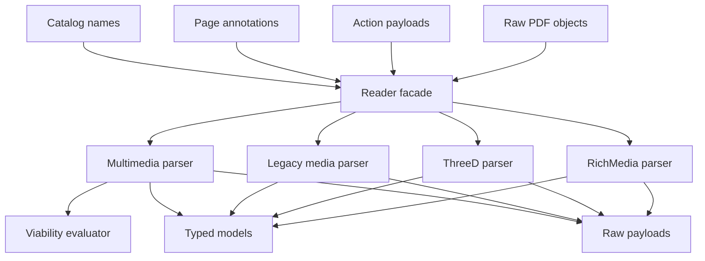
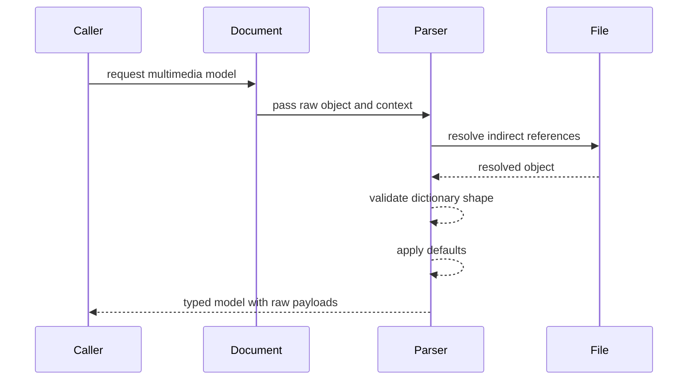
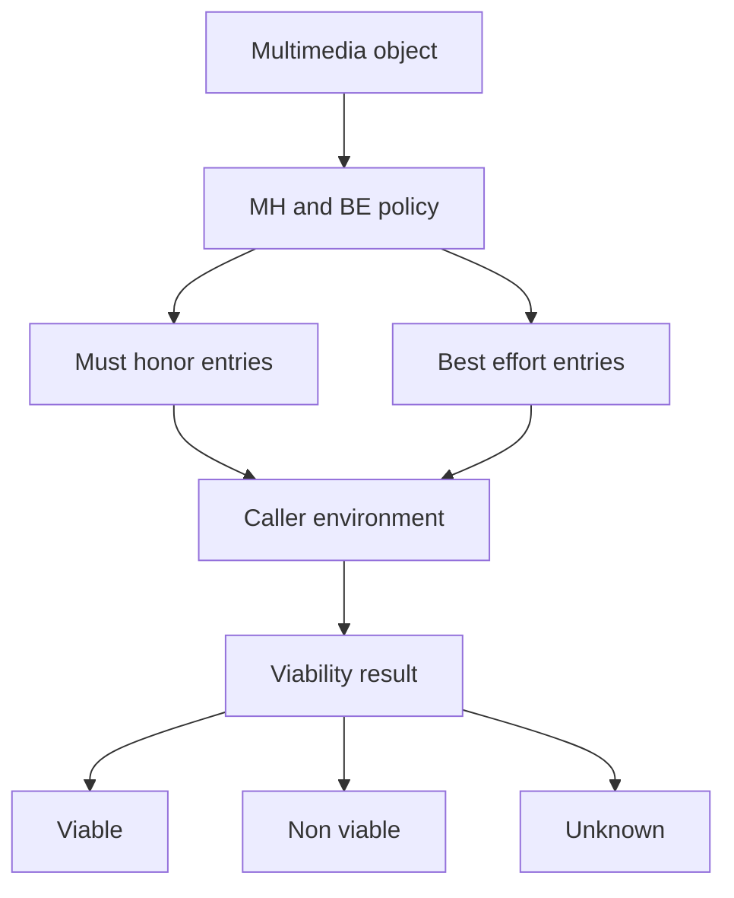
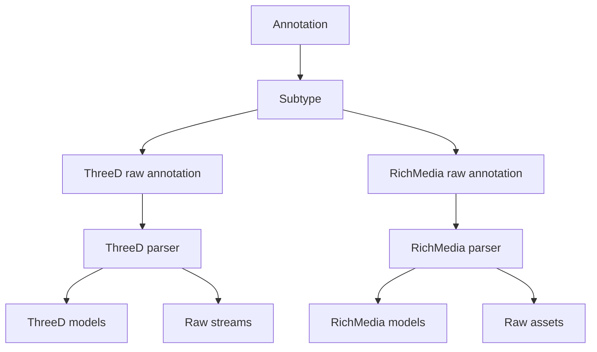
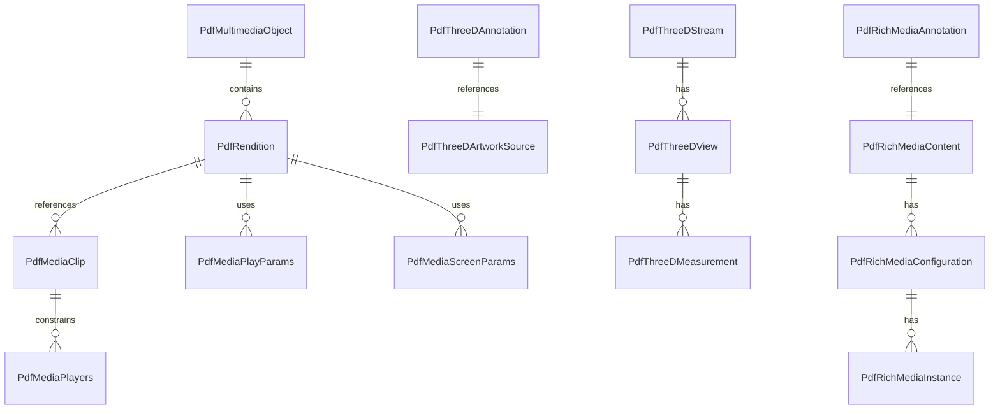

# Design Document

## Overview

This feature delivers typed structural parsing for PDF multimedia, legacy sound/movie constructs, alternate presentations, 3D artwork metadata, and RichMedia annotation metadata in the MoonBit `trkbt10/pdf` parser library. It lets library users inspect ISO 32000-2:2020 clause 13 dictionaries through explicit reader-layer models while preserving raw PDF objects for opaque media payloads and future extension keys.

The feature extends `src/reader` because multimedia structures are reached through Catalog name trees, page annotations, action payloads, streams, and lazy indirect-object resolution. It does not play media, render 3D, decode U3D or PRC stream contents, execute ECMAScript, open external files, fetch URLs, mutate annotations, or display UI.

### Goals
- Parse multimedia framework dictionaries for renditions, media clips, play parameters, screen parameters, offsets, durations, players, software identifiers, and monitor specifiers.
- Parse deprecated sound, movie, and alternate presentation structures into typed metadata while retaining raw objects.
- Parse 3D annotation, stream, view, projection, render, lighting, cross-section, node, markup, unit, and measurement dictionaries.
- Parse RichMedia annotation settings, activation/deactivation, animation, presentation, content, assets, configurations, instances, views, and view parameters.
- Provide side-effect-free validation and viability metadata with explicit unknown, non-viable, and best-effort outcomes.
- Preserve compatibility with existing raw annotation and action APIs by adding typed accessors beside them.

### Non-Goals
- Media playback, player selection side effects, temporary file creation, external URL fetching, URI normalization, or file extraction.
- U3D or PRC decoding, 3D rendering, camera math execution, keyframe playback, lighting simulation, cross-section rendering, or measurement drawing.
- ECMAScript execution, RichMedia runtime command dispatch, save/load event delivery, script sandboxing, or UI toolbar/window behavior.
- PDF writing, mutation of annotations or name trees, creation of projection annotations, checksum generation as a security control, or repair of malformed dictionaries.
- Changes to `src/objects`, `src/lexer`, `src/parser`, `src/filters`, `src/content`, `src/graphics`, or `src/rendering` package responsibilities.

## Boundary Commitments

### This Spec Owns
- Reader-layer public models for clause 13 multimedia, legacy sound/movie, alternate presentation, 3D, 3D measurement, and RichMedia dictionaries.
- Public `PdfDocument` typed accessors that resolve raw annotation, stream, action, and name-tree values into multimedia models on demand.
- Shared structural validation for required keys, dictionary subtype names, numeric ranges, array lengths, default values, and bounded indirect-reference traversal.
- Pure media viability modeling for MH/BE dictionaries, media criteria, players, software identifiers, version arrays, and monitor specifiers when the caller supplies an environment.
- Raw dictionary, stream, file specification, script, asset, state data, and unknown-key preservation for forward compatibility.
- Tests proving that every required/defaulted structural behavior maps to the parsed models without executing runtime behavior.

### Out of Boundary
- Low-level PDF object syntax, xref loading, stream filter decoding, content stream interpretation, 2D graphics rendering, and existing document/page traversal semantics.
- Action execution and event dispatch for Rendition, Sound, Movie, GoTo3DView, RichMediaExecute, JavaScript, page triggers, annotation triggers, or presentation triggers.
- Playback engines, media-player inventory discovery, operating-system inspection, bandwidth measurement, monitor querying, temporary-file permission enforcement, and document security permission evaluation.
- Decoding or interpreting U3D, PRC, SVG, image, audio, video, embedded file, ECMAScript, and RichMedia opaque state payloads.
- UI decisions for floating windows, toolbars, navigation panes, context clicks, screen annotations, 3D annotation activation, or RichMedia activation.
- Changing existing `PdfAnnotationSpecific::ThreeDRaw` and `PdfAnnotationSpecific::RichMediaRaw` enum variants into eagerly parsed variants.

### Allowed Dependencies
- MoonBit standard library only.
- Existing upstream packages: `objects`, `lexer`, `parser`, `filters`, `content`, and `graphics` as already imported by `src/reader/moon.pkg`.
- Existing reader components: `PdfDocument`, `PdfPage`, `PdfAnnotation`, `PdfFile::load_object`, `PdfCatalog`, name-tree enumeration, action parsing, annotation parsing, measure/geospatial structural helpers, and `PdfDocumentError`.
- Local extracted specification text under `.kiro/specs/pdf-multimedia/requirements.md` and `spec/extracted/13-multimedia.spec.txt`.
- External standard references only as parse-time identifiers: RFC 3986 URI syntax, RFC 2045 content type strings, RFC 1321 MD5 checksum bytes, ISO 14739-1 PRC stream payload identity.

### Revalidation Triggers
- Any public shape change to `PdfObject`, `PdfDictionary`, `PdfStream`, `PdfName`, `ObjectId`, `PdfDocument`, `PdfPage`, `PdfAnnotation`, `PdfAnnotationSpecific`, `NameTreeCategory`, `PdfActionKind`, or `PdfDocumentError`.
- Any decision to replace raw 3D/RichMedia annotation variants with eager typed enum variants.
- Any implementation that adds a media runtime, ECMAScript runtime, U3D/PRC decoder, renderer, URL/file access, checksum computation dependency, or OS/monitor/player discovery.
- Any package dependency direction change or new non-standard dependency.
- Any future file-specification, embedded-file extraction, rendering, security, forms, or action-execution spec that claims ownership of currently raw multimedia payloads.

## Architecture

### Existing Architecture Analysis

The repository already has a reader facade that resolves Catalog, Pages, annotations, name trees, actions, measure dictionaries, geospatial dictionaries, and graphics setup lazily. Existing annotation parsing recognizes `Sound`, `Movie`, `Screen`, `Projection`, `3D`, and `RichMedia` subtypes, but 3D and RichMedia are currently raw. Existing action parsing already treats multimedia-related actions as structural metadata and keeps runtime payloads raw.

The design follows the established `src/reader` pattern: public `pub(all)` models, package-local parser helpers, raw dictionary retention, `PdfDocumentError` diagnostics, bounded indirect-object traversal, and white-box tests. Lower packages continue to own byte/object parsing only.

### Architecture Pattern & Boundary Map



**Architecture Integration**:
- Selected pattern: reader-layer structural extension with raw payload preservation and optional pure evaluation.
- Domain boundaries: `reader` owns PDF clause 13 dictionary interpretation; runtime systems remain caller-owned.
- Existing patterns preserved: no external dependencies, lazy indirect resolution, `pub(all)` data models, raw dictionary retention, `suberror` diagnostics, and `///|` file blocks.
- New components rationale: clause 13 is broad enough to require separate parser files for multimedia framework, players, legacy media, 3D, 3D measurements, and RichMedia.
- Steering compliance: the design remains byte-oriented, read-only, zero-copy where possible, and package-local.

### Technology Stack

| Layer | Choice / Version | Role in Feature | Notes |
|-------|------------------|-----------------|-------|
| Language | MoonBit project toolchain | Typed models, parser helpers, tests | Use explicit structs/enums and raised `PdfDocumentError` values. |
| PDF object model | `trkbt10/pdf/src/objects` | Names, dictionaries, arrays, streams, strings, numbers, refs | No changes planned. |
| Document access | `trkbt10/pdf/src/reader` | Catalog, name trees, annotations, object loading, actions | Primary implementation package. |
| Graphics data | Existing `src/graphics` and reader geometry models | Rectangles, color arrays, raw form XObjects | No 3D rendering or U3D/PRC decoding. |
| External standards | RFC 3986, RFC 2045, RFC 1321, ISO 14739-1 | Identifier and payload context | Preserve bytes and shape; no runtime dependency. |
| Validation | `moon check`, `moon test`, `moon fmt`, `moon info` | Type checking, behavioral tests, API review | `moon info` must show intended reader API additions only. |

## File Structure Plan

### Directory Structure

```text
src/
├── reader/
│   ├── multimedia_types.mbt              # Public clause 13 data models shared by all multimedia parsers
│   ├── multimedia_common.mbt             # Keys, diagnostics, primitive readers, object resolution, cycle guards
│   ├── multimedia_framework.mbt          # Renditions, media clips, play/screen params, offsets, durations
│   ├── multimedia_players.mbt            # Media players, player info, software IDs, version arrays, monitor specifiers
│   ├── multimedia_viability.mbt          # Pure environment-based viability evaluation for MH and BE dictionaries
│   ├── multimedia_legacy.mbt             # Sound objects, movie dictionaries, activation dictionaries, slideshows
│   ├── multimedia_3d.mbt                 # 3D annotations, streams, references, activations, views, projections
│   ├── multimedia_3d_appearance.mbt      # 3D background, render modes, lighting, cross sections, nodes
│   ├── multimedia_3d_measurement.mbt     # 3D units, markup ExData, measurement dictionaries, projection links
│   ├── multimedia_rich_media.mbt         # RichMedia annotations, settings, activation, presentation, content
│   ├── multimedia_rich_media_assets.mbt  # Assets name-tree validation, configurations, instances, view params
│   ├── multimedia_accessors.mbt          # Public PdfDocument/PdfAnnotation typed accessors
│   ├── multimedia_framework_wbtest.mbt   # 13.2 framework parsing, defaults, MH/BE tests
│   ├── multimedia_players_wbtest.mbt     # Player matching, software URI, version array, monitor tests
│   ├── multimedia_legacy_wbtest.mbt      # Sound, movie, alternate presentation tests
│   ├── multimedia_3d_wbtest.mbt          # 3D annotation, stream, view, projection, node tests
│   ├── multimedia_3d_measurement_wbtest.mbt # 3D units, measurements, markup ExData tests
│   ├── multimedia_rich_media_wbtest.mbt  # RichMedia settings, content, assets, view params tests
│   ├── document_types.mbt                # May receive only small shared geometry aliases if needed
│   ├── document_error.mbt                # Add InvalidMultimedia diagnostic
│   ├── annotations.mbt                   # Preserve existing raw variants; no eager deep parsing
│   ├── actions.mbt                       # Keep multimedia actions structural; reuse raw payloads
│   ├── name_dictionary.mbt               # Reuse AlternatePresentations name-tree access
│   └── pkg.generated.mbti                # Regenerate after public API additions
└── objects/
    └── no planned changes
```

### Modified Files
- `src/reader/document_error.mbt` - Add `InvalidMultimedia(@objects.ObjectId?, String)` for clause 13 structural diagnostics.
- `src/reader/document_types.mbt` - Add only small shared public value objects here if they are broadly reused by existing reader APIs; otherwise keep multimedia models in `multimedia_types.mbt`.
- `src/reader/annotations.mbt` - Keep current raw 3D/RichMedia annotation variants and existing Sound/Movie/Screen shallow parsing; do not introduce eager deep parsing.
- `src/reader/actions.mbt` and `src/reader/action_media.mbt` - Keep action payloads raw and allow multimedia typed accessors to parse `PdfRenditionAction.rendition`, `PdfGoTo3DViewAction.view`, and `PdfRichMediaExecuteAction.command` when explicitly requested.
- `src/reader/name_dictionary.mbt` - Reuse `AlternatePresentations` enumeration for slideshow parsing; no traversal semantics change.
- `src/reader/pkg.generated.mbti` - Regenerate and review public API changes after implementation.

### Component to File Mapping

| Component | Primary Files |
|-----------|---------------|
| MultimediaModel | `src/reader/multimedia_types.mbt`, `src/reader/pkg.generated.mbti` |
| MultimediaCommonParser | `src/reader/multimedia_common.mbt`, `src/reader/document_error.mbt` |
| MultimediaFrameworkParser | `src/reader/multimedia_framework.mbt`, `src/reader/multimedia_framework_wbtest.mbt` |
| MediaPlayerPolicy | `src/reader/multimedia_players.mbt`, `src/reader/multimedia_players_wbtest.mbt` |
| MediaViabilityEvaluator | `src/reader/multimedia_viability.mbt`, `src/reader/multimedia_framework_wbtest.mbt` |
| LegacyMediaParser | `src/reader/multimedia_legacy.mbt`, `src/reader/multimedia_legacy_wbtest.mbt` |
| ThreeDParser | `src/reader/multimedia_3d.mbt`, `src/reader/multimedia_3d_wbtest.mbt` |
| ThreeDAppearanceParser | `src/reader/multimedia_3d_appearance.mbt`, `src/reader/multimedia_3d_wbtest.mbt` |
| ThreeDMeasurementParser | `src/reader/multimedia_3d_measurement.mbt`, `src/reader/multimedia_3d_measurement_wbtest.mbt` |
| RichMediaParser | `src/reader/multimedia_rich_media.mbt`, `src/reader/multimedia_rich_media_wbtest.mbt` |
| RichMediaAssetParser | `src/reader/multimedia_rich_media_assets.mbt`, `src/reader/multimedia_rich_media_wbtest.mbt` |
| MultimediaAccessors | `src/reader/multimedia_accessors.mbt`, `src/reader/name_dictionary.mbt`, `src/reader/annotations.mbt` |

## System Flows

### Typed Multimedia Access



The accessor parses only the requested object graph. It raises `InvalidMultimedia` for malformed required structure and preserves raw objects for opaque adjacent-domain payloads.

### MH and BE Viability



The evaluator is pure. Unknown MH keys or values can make the relevant object non-viable; unknown BE keys are preserved and ignored for viability.

### 3D and RichMedia Annotation Parsing



Existing annotation parsing remains shallow. Deep models are produced only through `PdfDocument` accessors so indirect references and cycles are handled consistently.

## Requirements Traceability

| Requirement | Summary | Components | Interfaces | Flows |
|-------------|---------|------------|------------|-------|
| 1 | Clause 13 multimedia feature scope | MultimediaModel, MultimediaAccessors | Clause 13 typed model family | Typed Multimedia Access |
| 1.1 | Multimedia constructs and action hand-off overview | MultimediaFrameworkParser, MultimediaAccessors | `parse_media_rendition`, raw action payload hand-off | Typed Multimedia Access |
| 1.2 | MH/BE viability semantics and defaults | MediaViabilityEvaluator, MultimediaFrameworkParser | `PdfMediaViabilityEnvironment`, `evaluate_media_viability` | MH and BE Viability |
| 1.3 | Common rendition dictionary entries and criteria | MultimediaFrameworkParser, MediaViabilityEvaluator | `PdfRendition`, `PdfMediaCriteria` | MH and BE Viability |
| 1.4 | Media rendition C/P/SP relationships | MultimediaFrameworkParser | `PdfMediaRendition`, `PdfMediaClip`, `PdfMediaPlayParams`, `PdfMediaScreenParams` | Typed Multimedia Access |
| 1.5 | Selector rendition depth-first choice | MultimediaFrameworkParser, MediaViabilityEvaluator | `PdfSelectorRendition`, `select_first_viable_rendition` | MH and BE Viability |
| 1.6 | Common media clip entries | MultimediaFrameworkParser | `PdfMediaClip`, `PdfMediaClipKind` | Typed Multimedia Access |
| 1.7 | Media clip data, permissions, content type, base URL | MultimediaFrameworkParser, MediaPlayerPolicy | `PdfMediaClipData`, `PdfMediaPermissions`, `PdfMediaBaseUrlPolicy` | Typed Multimedia Access |
| 1.8 | Media clip sections and offsets | MultimediaFrameworkParser, MediaViabilityEvaluator | `PdfMediaClipSection`, `PdfMediaOffset` | Typed Multimedia Access |
| 1.9 | Media play parameters and durations | MultimediaFrameworkParser | `PdfMediaPlayParams`, `PdfMediaDuration`, `PdfTimespan` | Typed Multimedia Access |
| 1.10 | Media screen parameters and floating windows | MultimediaFrameworkParser | `PdfMediaScreenParams`, `PdfFloatingWindowParams` | Typed Multimedia Access |
| 1.11 | Media offset dictionaries | MultimediaFrameworkParser | `PdfMediaOffset` | Typed Multimedia Access |
| 1.12 | Timespan dictionaries | MultimediaFrameworkParser | `PdfTimespan` | Typed Multimedia Access |
| 1.13 | Other multimedia object grouping | MultimediaFrameworkParser, MediaPlayerPolicy | Shared clause 13 models | Typed Multimedia Access |
| 1.14 | Media players dictionary | MediaPlayerPolicy | `PdfMediaPlayers`, `PdfMediaPlayerInfo` | MH and BE Viability |
| 1.15 | Media player eligibility algorithm | MediaPlayerPolicy, MediaViabilityEvaluator | `media_player_may_be_used` | MH and BE Viability |
| 1.16 | Media player info dictionary | MediaPlayerPolicy | `PdfMediaPlayerInfo` | MH and BE Viability |
| 1.17 | Software identifier dictionary | MediaPlayerPolicy | `PdfSoftwareIdentifier` | MH and BE Viability |
| 1.18 | Software identifier matching algorithm | MediaPlayerPolicy | `software_identifier_matches` | MH and BE Viability |
| 1.19 | Software URI parsing | MediaPlayerPolicy | `PdfSoftwareNameUri` | MH and BE Viability |
| 1.20 | Version array comparison | MediaPlayerPolicy | `PdfVersionArray`, `compare_version_arrays` | MH and BE Viability |
| 1.21 | Monitor specifier values | MediaPlayerPolicy, MultimediaFrameworkParser | `PdfMonitorSpecifier` | MH and BE Viability |
| 2 | Deprecated sound object metadata | LegacyMediaParser, MultimediaAccessors | `parse_sound_object`, `PdfSoundObject` | Typed Multimedia Access |
| 3 | Deprecated movie dictionary and activation metadata | LegacyMediaParser, MultimediaAccessors | `parse_movie_dictionary`, `PdfMovieActivation` | Typed Multimedia Access |
| 4 | Alternate presentation slideshow name-tree metadata | LegacyMediaParser, MultimediaAccessors | `alternate_presentations`, `PdfSlideShow` | Typed Multimedia Access |
| 4.1 | 3D annotation entries and activation states | ThreeDParser, ThreeDAppearanceParser | `parse_three_d_annotation`, `PdfThreeDAnnotation`, `PdfThreeDActivation` | 3D and RichMedia Annotation Parsing |
| 4.2 | 3D streams, animation style, references | ThreeDParser | `PdfThreeDStream`, `PdfThreeDAnimationStyle`, `PdfThreeDReference` | 3D and RichMedia Annotation Parsing |
| 4.3 | 3D views, camera data, overlays, nodes | ThreeDParser, ThreeDAppearanceParser, ThreeDMeasurementParser | `PdfThreeDView`, `PdfThreeDNode`, `PdfThreeDMatrix` | 3D and RichMedia Annotation Parsing |
| 4.4 | Projection dictionaries | ThreeDParser | `PdfThreeDProjection` | 3D and RichMedia Annotation Parsing |
| 4.5 | 3D coordinate systems and matrices | ThreeDParser | `PdfThreeDVector`, `PdfThreeDMatrix` | 3D and RichMedia Annotation Parsing |
| 4.6 | Persistent 3D measurements overview | ThreeDMeasurementParser | `PdfThreeDMeasurement` | 3D and RichMedia Annotation Parsing |
| 4.7 | 3D units dictionary and scaling | ThreeDMeasurementParser | `PdfThreeDUnits`, `resolve_three_d_units` | 3D and RichMedia Annotation Parsing |
| 4.8 | 3D measurement and projection annotation links | ThreeDMeasurementParser | `PdfThreeDMeasurement`, `PdfThreeDProjectionExData` | 3D and RichMedia Annotation Parsing |
| 4.9 | RichMedia framework overview | RichMediaParser | `PdfRichMediaAnnotation` | 3D and RichMedia Annotation Parsing |
| 4.10 | RichMedia annotation entries | RichMediaParser | `parse_rich_media_annotation`, `PdfRichMediaAnnotation` | 3D and RichMedia Annotation Parsing |
| 4.11 | RichMediaSettings dictionary | RichMediaParser | `PdfRichMediaSettings` | 3D and RichMedia Annotation Parsing |
| 4.12 | RichMediaActivation dictionary | RichMediaParser | `PdfRichMediaActivation` | 3D and RichMedia Annotation Parsing |
| 4.13 | RichMediaDeactivation dictionary | RichMediaParser | `PdfRichMediaDeactivation` | 3D and RichMedia Annotation Parsing |
| 4.14 | RichMediaAnimation dictionary | RichMediaParser | `PdfRichMediaAnimation` | 3D and RichMedia Annotation Parsing |
| 4.15 | RichMediaPresentation dictionary | RichMediaParser | `PdfRichMediaPresentation` | 3D and RichMedia Annotation Parsing |
| 4.16 | RichMediaWindow and position dictionaries | RichMediaParser | `PdfRichMediaWindow`, `PdfRichMediaPosition` | 3D and RichMedia Annotation Parsing |
| 4.17 | RichMediaContent dictionary | RichMediaParser, RichMediaAssetParser | `PdfRichMediaContent` | 3D and RichMedia Annotation Parsing |
| 4.18 | RichMedia assets name tree | RichMediaAssetParser | `PdfRichMediaAsset`, `validate_rich_media_asset_name` | 3D and RichMedia Annotation Parsing |
| 4.19 | RichMediaConfiguration dictionary | RichMediaAssetParser | `PdfRichMediaConfiguration` | 3D and RichMedia Annotation Parsing |
| 4.20 | RichMediaInstance dictionary | RichMediaAssetParser | `PdfRichMediaInstance` | 3D and RichMedia Annotation Parsing |
| 4.21 | Extended RichMedia view dictionary | RichMediaParser, ThreeDParser | `PdfRichMediaView` | 3D and RichMedia Annotation Parsing |
| 4.22 | View Params dictionary | RichMediaAssetParser | `PdfRichMediaViewParams` | 3D and RichMedia Annotation Parsing |
| 4.23 | Saving state data relationship | RichMediaAssetParser | `PdfRichMediaViewParams.data` raw retention | 3D and RichMedia Annotation Parsing |
| 4.24 | Loading state data relationship | RichMediaAssetParser | `PdfRichMediaViewParams.data` raw retention | 3D and RichMedia Annotation Parsing |

## Components and Interfaces

| Component | Domain | Intent | Req Coverage | Key Dependencies | Contracts |
|-----------|--------|--------|--------------|------------------|-----------|
| MultimediaModel | Reader models | Public typed data for clause 13 objects | 1.1-1.21, 2, 3, 4, 4.1-4.24 | `PdfObject` P0 | State |
| MultimediaCommonParser | Reader parser | Shared structural parsing and diagnostics | 1.1-1.21, 4.1-4.24 | `PdfFile::load_object` P0 | Service |
| MultimediaFrameworkParser | Reader parser | Renditions, clips, parameters, offsets, durations | 1.1-1.13 | MultimediaCommonParser P0 | Service |
| MediaPlayerPolicy | Reader parser | Players, software IDs, versions, monitors | 1.14-1.21 | MultimediaCommonParser P0 | Service |
| MediaViabilityEvaluator | Reader policy | Pure MH/BE and player viability evaluation | 1.2-1.5, 1.7-1.10, 1.14-1.21 | MediaPlayerPolicy P0 | Service |
| LegacyMediaParser | Reader parser | Deprecated sound, movie, slideshow metadata | 2, 3, 4 | Name-tree access P0 | Service |
| ThreeDParser | Reader parser | 3D annotations, streams, refs, views, projections | 4.1-4.5 | Annotation raw data P0 | Service |
| ThreeDAppearanceParser | Reader parser | 3D background, render, lighting, cross-section, node state | 4.3, 4.4 | ThreeDParser P0 | Service |
| ThreeDMeasurementParser | Reader parser | 3D units, measurements, markup, projection links | 4.6-4.8 | ThreeDParser P0 | Service |
| RichMediaParser | Reader parser | RichMedia annotation, settings, presentation, content | 4.9-4.17, 4.21 | Annotation raw data P0 | Service |
| RichMediaAssetParser | Reader parser | Assets, configurations, instances, view params | 4.18-4.20, 4.22-4.24 | Name-tree validation P0 | Service |
| MultimediaAccessors | Reader facade | Public entry points from document, annotations, actions, name trees | 1.1, 2, 3, 4, 4.1, 4.10 | `PdfDocument` P0 | Service |

### Reader Models

#### MultimediaModel

| Field | Detail |
|-------|--------|
| Intent | Provide public typed records and enums for all parsed multimedia structures. |
| Requirements | 1.1-1.21, 2, 3, 4, 4.1-4.24 |

**Responsibilities & Constraints**
- Define explicit MoonBit `pub(all)` structs/enums for all public multimedia parser outputs.
- Preserve `raw_dict`, `raw_stream`, or raw `PdfObject` fields on every model that represents a PDF dictionary or opaque payload.
- Represent unknown enumerated names with `Unknown(@objects.PdfName)` variants where ISO allows forward extension.
- Keep opaque data as `Bytes`, `PdfObject`, `PdfStream`, or `PdfDictionary`; do not normalize or execute it.

**Dependencies**
- Inbound: All multimedia parsers - construct models (P0).
- Outbound: `objects` - primitive PDF values (P0).
- External: None.

**Contracts**: Service [ ] / API [ ] / Event [ ] / Batch [ ] / State [x]

**Implementation Notes**
- Public models live in `multimedia_types.mbt` unless a small value object must be reused by existing non-multimedia reader APIs.
- Models use exact-byte strings for PDF string data.
- Raw retention is required for future extension keys and for consumers that need unsupported runtime payloads.

### Parser Services

#### MultimediaCommonParser

| Field | Detail |
|-------|--------|
| Intent | Centralize clause 13 structural reads, diagnostics, object resolution, and cycle checks. |
| Requirements | 1.1-1.21, 4.1-4.24 |

**Responsibilities & Constraints**
- Provide package-private helpers for required/optional dictionary entries, direct-object checks, range checks, array arity checks, name matching, and default application.
- Resolve indirect references lazily through `PdfFile::load_object` with path-based cycle detection.
- Raise `PdfDocumentError::InvalidMultimedia` with contextual messages for malformed required structure.

**Dependencies**
- Inbound: All multimedia parser components (P0).
- Outbound: `PdfFile::load_object`, `PdfDocumentError`, `PdfObject` (P0).
- External: None.

**Contracts**: Service [x] / API [ ] / Event [ ] / Batch [ ] / State [ ]

##### Service Interface
```moonbit
fn multimedia_dictionary(value : @objects.PdfObject, owner : @objects.ObjectId?, label : String) -> @objects.PdfDictionary raise PdfDocumentError
fn resolve_multimedia_object(file : PdfFile, value : @objects.PdfObject, label : String) -> (@objects.ObjectId?, @objects.PdfObject) raise PdfDocumentError
fn multimedia_number_array(value : @objects.PdfObject, length : Int, owner : @objects.ObjectId?, label : String) -> Array[Double] raise PdfDocumentError
fn multimedia_name(value : @objects.PdfObject, owner : @objects.ObjectId?, label : String) -> @objects.PdfName raise PdfDocumentError
```
- Preconditions: The caller supplies the raw value and context label from a known multimedia entry.
- Postconditions: Required shape violations raise `InvalidMultimedia`; optional unknown entries remain available in raw dictionaries.
- Invariants: Helper functions never execute payloads or inspect host runtime state.

#### MultimediaFrameworkParser

| Field | Detail |
|-------|--------|
| Intent | Parse PDF 1.5 multimedia framework dictionaries and defaults. |
| Requirements | 1.1-1.13 |

**Responsibilities & Constraints**
- Parse media and selector renditions, media clip data and sections, media permissions, media play parameters, media screen parameters, media offsets, media durations, and timespans.
- Apply ISO defaults such as default play parameters, screen rectangle playback, duration intrinsic/default values, timespan subtype requirements, and offset defaults.
- Preserve file specifications, form XObjects, streams, external URL strings, and unknown future entries raw.

**Dependencies**
- Inbound: MultimediaAccessors, MediaViabilityEvaluator (P0).
- Outbound: MultimediaCommonParser, MediaPlayerPolicy (P0).
- External: None.

**Contracts**: Service [x] / API [ ] / Event [ ] / Batch [ ] / State [ ]

##### Service Interface
```moonbit
pub fn PdfDocument::parse_rendition(self : PdfDocument, value : @objects.PdfObject) -> PdfRendition raise PdfDocumentError
pub fn PdfDocument::parse_media_clip(self : PdfDocument, value : @objects.PdfObject) -> PdfMediaClip raise PdfDocumentError
pub fn PdfDocument::parse_media_play_params(self : PdfDocument, value : @objects.PdfObject) -> PdfMediaPlayParams raise PdfDocumentError
pub fn PdfDocument::parse_media_screen_params(self : PdfDocument, value : @objects.PdfObject) -> PdfMediaScreenParams raise PdfDocumentError
```
- Preconditions: `value` is a dictionary or an indirect reference resolving to a dictionary.
- Postconditions: Returned model includes parsed known fields, defaults, raw dictionary, and raw child payloads.
- Invariants: Selector traversal for parsing is structural; player choice occurs only in the pure viability component.

#### MediaPlayerPolicy

| Field | Detail |
|-------|--------|
| Intent | Parse and compare player, software identifier, version, and monitor metadata. |
| Requirements | 1.14-1.21 |

**Responsibilities & Constraints**
- Parse `MU`, `A`, `NU`, media player info dictionaries, software identifier dictionaries, version arrays, software URI names, OS arrays, and monitor specifier names.
- Implement version-array comparison including empty-array infinity semantics and zero padding.
- Implement software-identifier matching against caller-supplied software identity.

**Dependencies**
- Inbound: MediaViabilityEvaluator, MultimediaFrameworkParser (P0).
- Outbound: MultimediaCommonParser (P0).
- External: RFC 3986 context for URI scheme parsing (P2).

**Contracts**: Service [x] / API [ ] / Event [ ] / Batch [ ] / State [ ]

##### Service Interface
```moonbit
pub fn compare_version_arrays(left : PdfVersionArray, right : PdfVersionArray) -> Int
pub fn software_identifier_matches(identifier : PdfSoftwareIdentifier, software : PdfSoftwareIdentity) -> PdfViabilityDecision
pub fn media_player_may_be_used(policy : PdfMediaPlayerPolicy, player : PdfSoftwareIdentity, content_type : Bytes?) -> PdfViabilityDecision
```
- Preconditions: Parsed version arrays contain non-negative integers or have already been marked non-viable.
- Postconditions: Decisions are `Viable`, `NonViable`, or `Unknown`.
- Invariants: Matching does not query installed software; it only compares supplied data.

#### MediaViabilityEvaluator

| Field | Detail |
|-------|--------|
| Intent | Evaluate MH/BE and media criteria without side effects. |
| Requirements | 1.2-1.5, 1.7-1.10, 1.14-1.21 |

**Responsibilities & Constraints**
- Evaluate required and best-effort entries using caller-supplied `PdfMediaViabilityEnvironment`.
- Treat unknown MH entries or unrecognized MH values as non-viable where ISO requires it.
- Ignore unknown BE entries for viability while preserving them in raw dictionaries.
- Return a decision trace that identifies which entry caused non-viability or uncertainty.

**Dependencies**
- Inbound: Callers that need media suitability checks (P1).
- Outbound: MultimediaFrameworkParser, MediaPlayerPolicy (P0).
- External: None.

**Contracts**: Service [x] / API [ ] / Event [ ] / Batch [ ] / State [ ]

##### Service Interface
```moonbit
pub fn evaluate_rendition_viability(rendition : PdfRendition, environment : PdfMediaViabilityEnvironment) -> PdfViabilityReport
pub fn select_first_viable_rendition(selector : PdfSelectorRendition, environment : PdfMediaViabilityEnvironment) -> PdfRenditionSelection
```
- Preconditions: Input models were produced by multimedia parsers.
- Postconditions: Reports are deterministic for the supplied environment.
- Invariants: No playback, player launch, network access, monitor query, or permission prompt occurs.

#### LegacyMediaParser

| Field | Detail |
|-------|--------|
| Intent | Parse deprecated sound, movie, and slideshow structures. |
| Requirements | 2, 3, 4 |

**Responsibilities & Constraints**
- Parse sound stream dictionaries including sampling rate, channels, bits per sample, encoding, compression names, and raw stream data.
- Parse movie dictionaries and activation dictionaries including start/duration raw time values, rate, volume, mode, floating-window scale, and position.
- Enumerate `AlternatePresentations` name-tree entries and parse slideshow dictionaries with resource name trees and start resources.

**Dependencies**
- Inbound: MultimediaAccessors (P0).
- Outbound: `PdfDocument::name_tree_entries`, MultimediaCommonParser (P0).
- External: None.

**Contracts**: Service [x] / API [ ] / Event [ ] / Batch [ ] / State [ ]

##### Service Interface
```moonbit
pub fn PdfDocument::parse_sound_object(self : PdfDocument, value : @objects.PdfObject) -> PdfSoundObject raise PdfDocumentError
pub fn PdfDocument::parse_movie_dictionary(self : PdfDocument, value : @objects.PdfObject) -> PdfMovieDictionary raise PdfDocumentError
pub fn PdfDocument::alternate_presentations(self : PdfDocument) -> Array[PdfAlternatePresentation] raise PdfDocumentError
```
- Preconditions: Sound values resolve to streams; movie/slideshow values resolve to dictionaries.
- Postconditions: Deprecated structures are inspectable but not played.
- Invariants: The parser does not extract external files or media samples.

#### ThreeDParser

| Field | Detail |
|-------|--------|
| Intent | Parse 3D annotation, stream, reference, activation, view, projection, and coordinate metadata. |
| Requirements | 4.1-4.5 |

**Responsibilities & Constraints**
- Parse 3D annotation dictionaries from raw annotation data without changing `PdfAnnotationSpecific`.
- Parse 3D streams and 3D reference dictionaries, preserving raw U3D/PRC stream data.
- Parse activation states, default view selectors, 12-number matrices, 3D vectors, projection dictionaries, background, render modes, lighting, cross sections, and nodes.
- Validate structural relationships such as view references into `VA` arrays when enough data is available locally.

**Dependencies**
- Inbound: MultimediaAccessors, RichMediaParser (P0).
- Outbound: MultimediaCommonParser, ThreeDAppearanceParser, ThreeDMeasurementParser (P0).
- External: ISO 14739-1 context for PRC identity (P2).

**Contracts**: Service [x] / API [ ] / Event [ ] / Batch [ ] / State [ ]

##### Service Interface
```moonbit
pub fn PdfDocument::parse_three_d_annotation(self : PdfDocument, annotation : PdfAnnotation) -> PdfThreeDAnnotation? raise PdfDocumentError
pub fn PdfDocument::parse_three_d_stream(self : PdfDocument, value : @objects.PdfObject) -> PdfThreeDStream raise PdfDocumentError
pub fn PdfDocument::parse_three_d_view(self : PdfDocument, value : @objects.PdfObject) -> PdfThreeDView raise PdfDocumentError
```
- Preconditions: Annotation subtype is `ThreeD` for annotation parsing; stream values resolve to streams or valid reference dictionaries where required.
- Postconditions: Structural model carries activation, view, units, and raw stream payload references.
- Invariants: U3D/PRC payload bytes are not decoded and 3D transforms are not applied to geometry.

#### ThreeDAppearanceParser

| Field | Detail |
|-------|--------|
| Intent | Parse 3D background, render-mode, lighting, cross-section, and node appearance metadata. |
| Requirements | 4.3, 4.4 |

**Responsibilities & Constraints**
- Parse background dictionaries, projection-adjacent appearance defaults, render mode dictionaries, lighting scheme dictionaries, cross-section dictionaries, and 3D node dictionaries.
- Preserve unknown render and lighting modes according to the ISO forward-compatible behavior.
- Validate 3D color arrays, opacity ranges, cross-section orientation arrays, and node matrix arity.

**Dependencies**
- Inbound: ThreeDParser, RichMediaParser (P0).
- Outbound: MultimediaCommonParser (P0).
- External: None.

**Contracts**: Service [x] / API [ ] / Event [ ] / Batch [ ] / State [ ]

##### Service Interface
```moonbit
fn parse_three_d_background(value : @objects.PdfObject, owner : @objects.ObjectId?) -> PdfThreeDBackground raise PdfDocumentError
fn parse_three_d_render_mode(value : @objects.PdfObject, owner : @objects.ObjectId?) -> PdfThreeDRenderMode raise PdfDocumentError
fn parse_three_d_node(value : @objects.PdfObject, owner : @objects.ObjectId?) -> PdfThreeDNode raise PdfDocumentError
```
- Preconditions: The caller has already established that the enclosing structure is a 3D or RichMedia 3D context.
- Postconditions: Appearance-related defaults are materialized and raw dictionaries are preserved.
- Invariants: No lighting, projection, clipping, or node transform is rendered.

#### ThreeDMeasurementParser

| Field | Detail |
|-------|--------|
| Intent | Parse 3D units, persistent measurements, 3D markup ExData, and projection links. |
| Requirements | 4.6-4.8 |

**Responsibilities & Constraints**
- Parse 3D units scale sets and expose the ISO mapping from model units to display units as a pure calculation.
- Parse linear, perpendicular, angular, radial, and comment-note measurement dictionaries with required 3D points/vectors.
- Parse Markup3D and 3DM ExData dictionaries and preserve MD5 bytes as checksum metadata.
- Preserve projection annotation references and measurement comment associations raw.

**Dependencies**
- Inbound: ThreeDParser, RichMediaParser (P0).
- Outbound: MultimediaCommonParser (P0).
- External: RFC 1321 context for MD5 bytes (P2).

**Contracts**: Service [x] / API [ ] / Event [ ] / Batch [ ] / State [ ]

##### Service Interface
```moonbit
pub fn resolve_three_d_units(units : PdfThreeDUnits) -> PdfThreeDResolvedUnits
pub fn PdfDocument::parse_three_d_measurement(self : PdfDocument, value : @objects.PdfObject) -> PdfThreeDMeasurement raise PdfDocumentError
pub fn PdfDocument::parse_three_d_markup_exdata(self : PdfDocument, value : @objects.PdfObject) -> PdfThreeDMarkupExData raise PdfDocumentError
```
- Preconditions: Measurement subtype names are present where required.
- Postconditions: Invalid required point/vector arrays raise `InvalidMultimedia`; optional comment links remain raw.
- Invariants: No measurement drawing, node visibility query, checksum verification, or projection annotation creation occurs.

#### RichMediaParser

| Field | Detail |
|-------|--------|
| Intent | Parse RichMedia annotation settings, presentation, content, views, and runtime state carriers. |
| Requirements | 4.9-4.17, 4.21-4.24 |

**Responsibilities & Constraints**
- Parse RichMedia annotations from raw annotation data without changing `PdfAnnotationSpecific`.
- Parse settings, activation, deactivation, animation, presentation, windows, positions, content dictionaries, and extended view dictionaries.
- Preserve script file references, view snapshot streams, and opaque state data.
- Validate default selection rules for activation configuration and views when content arrays are present.

**Dependencies**
- Inbound: MultimediaAccessors (P0).
- Outbound: MultimediaCommonParser, ThreeDParser, RichMediaAssetParser (P0).
- External: None.

**Contracts**: Service [x] / API [ ] / Event [ ] / Batch [ ] / State [ ]

##### Service Interface
```moonbit
pub fn PdfDocument::parse_rich_media_annotation(self : PdfDocument, annotation : PdfAnnotation) -> PdfRichMediaAnnotation? raise PdfDocumentError
pub fn PdfDocument::parse_rich_media_settings(self : PdfDocument, value : @objects.PdfObject) -> PdfRichMediaSettings raise PdfDocumentError
pub fn PdfDocument::parse_rich_media_content(self : PdfDocument, value : @objects.PdfObject) -> PdfRichMediaContent raise PdfDocumentError
```
- Preconditions: Annotation subtype is `RichMedia` for annotation parsing.
- Postconditions: Returned model exposes settings/content and raw runtime payloads.
- Invariants: No ECMAScript, activation event, toolbar, context menu, or media runtime behavior is executed.

#### RichMediaAssetParser

| Field | Detail |
|-------|--------|
| Intent | Parse RichMedia assets, configurations, instances, and view parameters. |
| Requirements | 4.18-4.20, 4.22-4.24 |

**Responsibilities & Constraints**
- Validate RichMedia asset name-tree keys against length, null-character, forbidden-character, final-period, and F/UF matching rules.
- Parse configurations and instance arrays while preserving embedded file specifications raw.
- Parse view parameters linking instances to opaque data used for save/load state relationships.

**Dependencies**
- Inbound: RichMediaParser (P0).
- Outbound: `PdfDocument::name_tree_entries`, MultimediaCommonParser (P0).
- External: RFC 3986 context for relative URI names (P2).

**Contracts**: Service [x] / API [ ] / Event [ ] / Batch [ ] / State [ ]

##### Service Interface
```moonbit
pub fn validate_rich_media_asset_name(name : Bytes) -> Bool
pub fn PdfDocument::parse_rich_media_configuration(self : PdfDocument, value : @objects.PdfObject) -> PdfRichMediaConfiguration raise PdfDocumentError
pub fn PdfDocument::parse_rich_media_instance(self : PdfDocument, value : @objects.PdfObject) -> PdfRichMediaInstance raise PdfDocumentError
```
- Preconditions: Asset values resolve to file specification dictionaries where validation is requested.
- Postconditions: Invalid required asset shapes raise `InvalidMultimedia`.
- Invariants: The parser does not open embedded files or interpret state data.

#### MultimediaAccessors

| Field | Detail |
|-------|--------|
| Intent | Expose public parse entry points from document, annotations, actions, and catalog names. |
| Requirements | 1.1, 2, 3, 4, 4.1, 4.10 |

**Responsibilities & Constraints**
- Provide explicit methods that parse raw `PdfAnnotation`, `PdfAction` payloads, raw `PdfObject` values, and `AlternatePresentations` name-tree entries.
- Return `None` for annotation subtype mismatches and absent optional entries.
- Preserve existing annotation/action raw APIs.

**Dependencies**
- Inbound: Library callers (P0).
- Outbound: All multimedia parser services, `PdfDocument`, `PdfAnnotation`, `PdfAction` (P0).
- External: None.

**Contracts**: Service [x] / API [x] / Event [ ] / Batch [ ] / State [ ]

##### Service Interface
```moonbit
pub fn PdfDocument::annotation_multimedia(self : PdfDocument, annotation : PdfAnnotation) -> PdfMultimediaAnnotation? raise PdfDocumentError
pub fn PdfDocument::parse_multimedia_object(self : PdfDocument, value : @objects.PdfObject) -> PdfMultimediaObject raise PdfDocumentError
pub fn PdfDocument::alternate_presentations(self : PdfDocument) -> Array[PdfAlternatePresentation] raise PdfDocumentError
```
- Preconditions: Caller owns the `PdfDocument` that loaded the annotation or object.
- Postconditions: Typed models are fully detached structural values with raw data retained.
- Invariants: Accessors do not mutate `PdfDocument`, annotations, actions, name trees, or payload streams.

## Data Models

### Domain Model



- `PdfMultimediaObject` is a tagged union for media renditions, media clips, legacy objects, 3D structures, and RichMedia structures parsed from raw PDF objects.
- `PdfMhBePolicy` represents must-honor and best-effort dictionaries while preserving raw entries and defaulted effective values.
- `PdfViabilityDecision` is `Viable`, `NonViable`, or `Unknown`, with reports carrying entry-level reasons.
- `PdfThreeDVector` is a three-number value; `PdfThreeDMatrix` is a 12-number matrix; neither performs rendering.
- `PdfRichMediaContent` can be shared by multiple annotations; `PdfRichMediaSettings` is annotation-specific.

### Logical Data Model

**Structure Definition**:
- Every parsed dictionary model has `raw_dict : @objects.PdfDictionary`.
- Every parsed stream model has `raw_stream : @objects.PdfStream` or a raw `PdfObject` reference when the payload type is intentionally opaque.
- Required PDF names are converted to precise enums with unknown variants only where the spec allows future values.
- Required arrays validate arity and numeric range at parse time.
- Cross-references that require membership checks store both the raw reference and a validation status when the target array is available.

**Consistency & Integrity**:
- Indirect-reference traversal is bounded by object ID path checks.
- Raw references are not loaded unless the requested typed accessor needs their dictionary shape.
- Default values are materialized into typed fields while the original absence remains visible through `raw_dict`.
- RichMedia assets validate filename restrictions and F/UF equality only in the asset parser, not in name-tree traversal.

### Data Contracts & Integration

**API Data Transfer**
- Public methods accept existing `PdfDocument`, `PdfAnnotation`, `PdfAction`, or `PdfObject` values.
- Public methods return MoonBit structs/enums or `None` for absent/mismatched optional data.
- Errors use `PdfDocumentError::InvalidMultimedia` for malformed clause 13 dictionaries and `PdfDocumentError::ReaderError` for lower file-loading failures.

**Cross-Service Data Management**
- Existing raw annotation and action fields remain authoritative for low-level preservation.
- Multimedia typed models are derived views and do not mutate the underlying `PdfDocument`.
- Re-parsing is acceptable; cache additions are out of scope unless performance tests show repeated traversal costs that exceed existing reader patterns.

## Error Handling

### Error Strategy
- Missing optional entries receive ISO default values.
- Missing required entries, wrong object kinds, invalid array lengths, invalid numeric ranges, and invalid required names raise `InvalidMultimedia`.
- Unknown names become `Unknown(name)` when ISO defines forward-compatible behavior; otherwise they are represented as non-viable or invalid according to the dictionary context.
- Opaque payloads that are not owned by this feature are preserved raw rather than rejected unless ISO requires a local dictionary or stream shape.

### Error Categories and Responses
- Structural errors: malformed dictionaries, arrays, names, ranges, or required relationships raise `InvalidMultimedia`.
- Reader errors: indirect object load failures are wrapped as existing reader errors.
- Cycle errors: recursive media clip sections, selector renditions, 3D references, or RichMedia structures raise a cycle diagnostic with object context.
- Viability outcomes: runtime capability mismatches return non-viable reports instead of parser errors unless the dictionary itself is malformed.

### Monitoring
No runtime logging or monitoring is added. Validation evidence is produced through unit tests, white-box tests, and `moon info` API review.

## Testing Strategy

### Unit Tests
- `multimedia_framework_wbtest.mbt`: verify rendition required `S`, media vs selector variants, selector empty arrays, default play/screen params, MH/BE precedence, duration and timespan validation, and offset subtype validation for 1.1-1.13.
- `multimedia_players_wbtest.mbt`: verify software URI scheme matching, case-sensitive software names, OS matching, version-array padding/infinity, negative version rejection, MU/A/NU player eligibility, and monitor specifier defaults for 1.14-1.21.
- `multimedia_legacy_wbtest.mbt`: verify sound object stream fields, sound defaults, movie dictionary required file specification, movie activation defaults, and slideshow Type/Subtype/StartResource validation for 2, 3, and 4.
- `multimedia_3d_wbtest.mbt`: verify 3D annotation 3DD/3DV/3DA/3DB/3DU fields, 3D stream U3D/PRC subtype handling, default view precedence, activation defaults, projection subtype rules, matrix/vector arity, render mode/lighting unknown-name handling, cross-section defaults, and node fields for 4.1-4.5.
- `multimedia_3d_measurement_wbtest.mbt`: verify units scale resolution, invalid unit scale-without-label ignoring, measurement subtype required fields, point/vector arity, optional projection annotation references, Markup3D ExData, and 3DM ExData for 4.6-4.8.
- `multimedia_rich_media_wbtest.mbt`: verify RichMedia annotation required content, default settings behavior, activation/deactivation defaults, animation defaults, presentation/window/position defaults, content default views, asset filename validation, configuration/instance relationships, view snapshots, view params, and opaque state data retention for 4.9-4.24.

### Integration Tests
- Parse a fixture page with Screen, 3D, RichMedia, Sound, Movie, and Projection annotations and confirm raw annotation APIs still return the same raw values while typed accessors return deep models.
- Parse a fixture Catalog `AlternatePresentations` name tree and verify ordered slideshow entries through `PdfDocument::alternate_presentations`.
- Parse a Rendition action fixture and pass its raw `R` payload into `parse_rendition` without changing action behavior.
- Parse RichMedia content with shared content referenced by two annotations and verify parsing does not duplicate or mutate raw objects.
- Parse selector rendition trees with nested selectors and confirm pure viability selection is deterministic for supplied environments.

### Performance
- Add a fixture with nested but acyclic selector renditions, media clip sections, and RichMedia arrays to confirm traversal is bounded and proportional to requested objects.
- Add cycle fixtures for selector renditions, media clip sections, 3D reference dictionaries, and RichMedia indirect arrays to confirm early cycle diagnostics.
- Avoid decoding stream payloads in tests except where existing reader file loading already returns raw stream bytes.

### Public API Review
- Run `moon check`.
- Run targeted reader tests with `moon test src/reader`.
- Run `moon fmt`.
- Run `moon info` and review `src/reader/pkg.generated.mbti` for intended multimedia additions only.

## Security Considerations

- Media, RichMedia, and 3D features are security-sensitive because they can reference external files, scripts, UI windows, and runtime players. This design parses metadata only.
- URI strings, content type strings, script streams, file specifications, and RichMedia state data remain raw and are not executed, fetched, normalized, or opened.
- Temporary-file permissions from media permissions dictionaries are parsed as policy metadata only; no temporary files are created.
- MD5 bytes in 3D markup are checksum metadata only and are not treated as a security guarantee.
- Window title, context-click, toolbar, and transparent background settings are parsed but not acted upon.

## Performance & Scalability

- Parsing is lazy and accessor-driven; deep multimedia structures are not parsed during ordinary page or annotation enumeration.
- Stream data for U3D, PRC, audio, video, images, scripts, and embedded assets is preserved as existing `PdfStream`/`PdfObject` data and not decoded by this feature.
- Cycle detection uses object ID paths and does not require global graph materialization.
- Repeated parsing may be optimized later only if benchmarks show a real need; caching is not part of the initial design.

## Migration Strategy

- Existing public raw annotation/action fields remain valid.
- New typed accessors are additive.
- `PdfAnnotationSpecific::ThreeDRaw` and `PdfAnnotationSpecific::RichMediaRaw` remain in place.
- `pkg.generated.mbti` changes are expected only for new multimedia public types, methods, and `InvalidMultimedia`.

## Supporting References

- Detailed discovery notes and trade-offs are recorded in `.kiro/specs/pdf-multimedia/research.md`.
- Primary local requirement source: `.kiro/specs/pdf-multimedia/requirements.md`.
