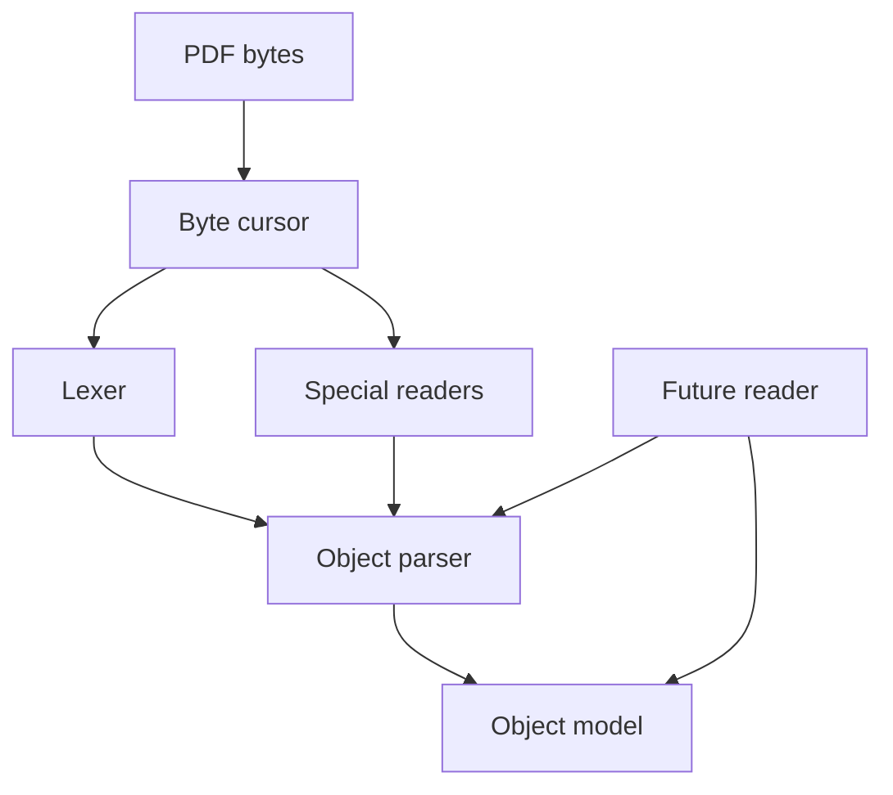
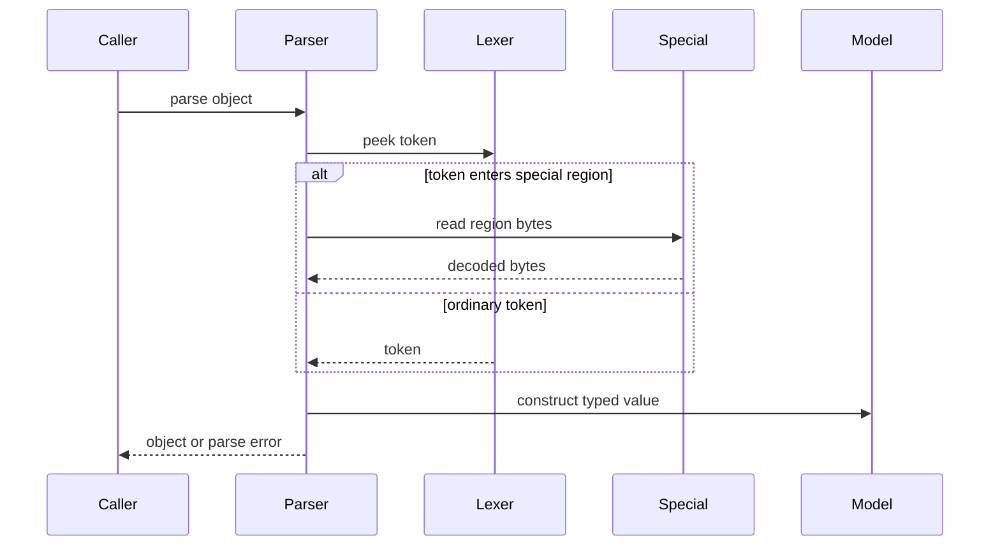
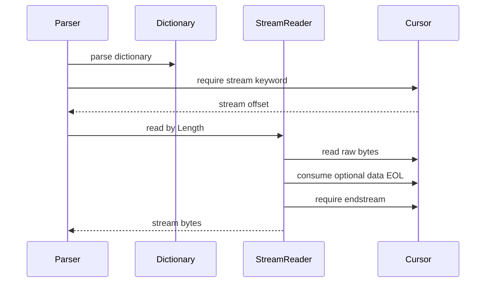
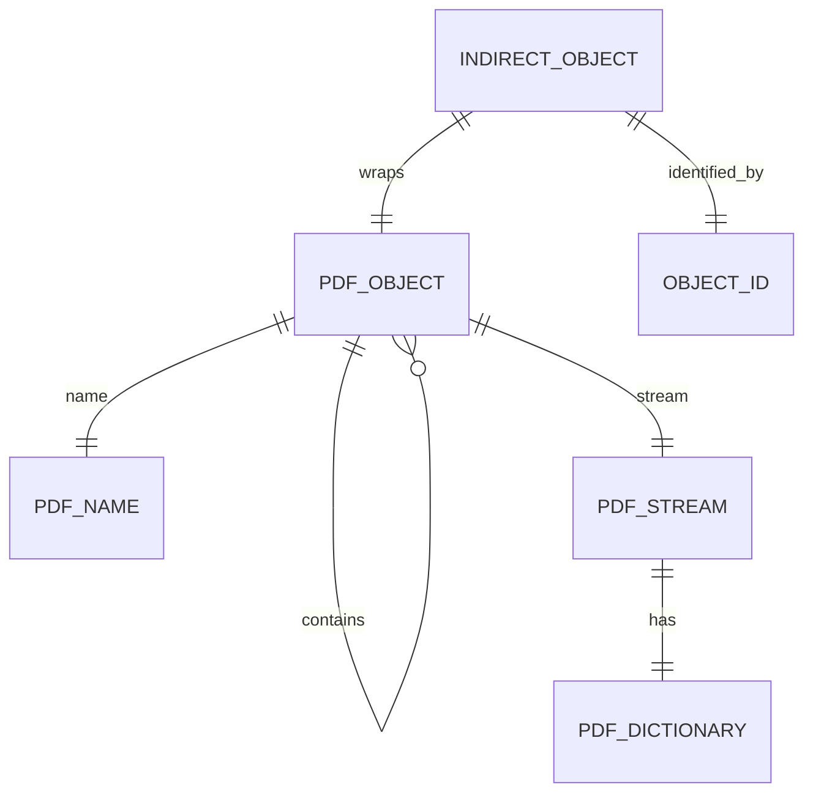

# Design Document

## Overview
This feature delivers the low-level PDF object syntax layer for the MoonBit `trkbt10/pdf` library. It reads PDF bytes according to ISO 32000-2:2020 clauses 7.2 and 7.3, classifies lexical regions, and parses the nine basic object types plus indirect references and indirect object definitions.

Library implementers and later parser layers use this as the stable foundation for file structure parsing, document structure parsing, and stream filter handling. The feature changes the current scaffold by introducing the `objects`, `lexer`, and `parser` packages under `src`.

### Goals
- Provide byte-accurate lexical handling for PDF white-space, delimiters, comments, strings, names, and stream data.
- Provide a type-safe MoonBit object model and parser API covering all required PDF object syntax.
- Preserve explicit offsets and parse error kinds for later diagnostics and validation.
- Expose enough structural marker handling for the file-structure layer without implementing file-structure parsing here.

### Non-Goals
- PDF file header, cross-reference table, trailer, object stream, or random-access reader parsing.
- Stream filter decoding, encryption, font handling, rendering, or content stream interpretation.
- Heuristic repair of malformed streams whose dictionary `Length` is incorrect.
- PDF writing or serialization APIs.

## Boundary Commitments

### This Spec Owns
- Byte classification for PDF lexical contexts outside strings, streams, and comments.
- EOL normalization and white-space/comment token separation for object-level parsing.
- Public value types for PDF names, object IDs, indirect objects, streams, and `PdfObject`.
- Parsing of Boolean, Integer, Real, String, Name, Array, Dictionary, Stream, Null, `Ref`, and indirect object definitions.
- Parse errors with byte offsets and precise error categories.
- Marker-token recognition for `%PDF-n.m` and `%%EOF` as lexical markers only.

### Out of Boundary
- Resolving indirect references against cross-reference data. This spec can represent `Ref`, but it does not load referenced objects.
- Resolving nonexistent indirect references to `Null` during file-level lookup. That responsibility belongs to the `reader` layer. This spec provides `PdfObject::Null` as a value and `PdfObject::Ref` as a reference, but does not perform resolution. Requirement 13.2 is deferred to the `pdf-file-structure` spec.
- Cross-reference tables, trailers, incremental updates, object streams, xref streams, and hybrid reference files.
- Stream filter decoding and decoded-length validation.
- Content stream operator parsing, Type 4 function parsing, and brace delimiters.

### Allowed Dependencies
- MoonBit standard library only: `Bytes`, `Array`, `Map`, numeric types, `Result`, `Option`, and `suberror`.
- Local packages in this direction: `src/objects` has no project imports; `src/lexer` imports `src/objects` (for `PdfParseError` only); `src/parser` imports `src/objects` and `src/lexer`.
- Local specification references under `spec/extracted/7.2-lexical.md` and `spec/extracted/7.3-objects.md`.
- Project tooling: `moon check`, `moon test`, `moon fmt`, and `moon info`.

### Revalidation Triggers
- Any change to `PdfObject`, `PdfName`, `PdfDictionary`, `PdfStream`, `ObjectId`, `IndirectObject`, or `PdfParseError`.
- Any change to whether the lexer emits or skips structural markers.
- Any change to stream `Length` handling, stream EOL validation, or cursor offset semantics.
- Any dependency direction change between `objects`, `lexer`, `parser`, and the future `reader` package.
- Any change from byte-sequence name equality to text-based equality.

## Architecture

### Existing Architecture Analysis
The repository contains MoonBit project metadata, a template CLI, steering files, local ISO excerpts, and downstream `pdf-file-structure` requirements. There is no existing object parser implementation, so this design introduces new packages while preserving the steering dependency direction `objects <- lexer <- parser <- reader`.

The future `reader` layer depends on this feature for object parsing, stream syntax, `Ref` representation, and null results for missing object resolution. This spec exposes those contracts but does not implement file-level lookup.

### Architecture Pattern & Boundary Map



**Architecture Integration**:
- Selected pattern: layered byte parser. The object model is pure data, the lexer owns byte-level lexical movement, and the parser owns object assembly and syntax validation.
- Domain boundaries: `objects` owns data contracts; `lexer` owns cursor movement and lexical regions; `parser` owns recursive PDF object construction.
- Existing patterns preserved: MoonBit package-per-directory layout, `///|` block separation, `suberror` diagnostics, and standard-library-only dependency policy.
- New components rationale: strings, names, comments, and streams are context-sensitive byte regions and need specialized readers rather than whole-file tokenization.
- Steering compliance: byte-stream parsing, zero-copy orientation, independent package testing, and dependency direction are maintained.

### Technology Stack

| Layer | Choice / Version | Role in Feature | Notes |
|-------|------------------|-----------------|-------|
| Language | MoonBit, project toolchain | Parser implementation and public APIs | Use `pub(all) enum` for externally matchable variants. |
| Data structures | Standard `Bytes`, `Array`, `Map` | String bytes, stream bytes, arrays, dictionaries | No external dependencies. |
| Error handling | MoonBit `suberror` and `raise` | Typed parse diagnostics | Include error kind and byte offset. |
| Build and test | `moon check`, `moon test`, `moon fmt`, `moon info` | Validation and public API review | `moon info` verifies intended public API changes. |

## File Structure Plan

### Directory Structure

```text
src/
├── objects/
│   ├── moon.pkg
│   ├── types.mbt              # PdfObject, PdfName, PdfDictionary, PdfStream, ObjectId, IndirectObject
│   ├── error.mbt              # PdfParseError suberror and offset-bearing diagnostics
│   ├── accessors.mbt          # Typed helpers for integer, number, dictionary, stream, and ref expectations
│   └── types_test.mbt         # Black-box object equality and accessor tests
├── lexer/
│   ├── moon.pkg
│   ├── cursor.mbt             # ByteCursor, offset tracking, peek/read, EOL recognition
│   ├── classifier.mbt         # white-space, delimiter, regular byte classification
│   ├── token.mbt              # PdfToken, delimiter tokens, marker tokens, token offsets
│   ├── lexer.mbt              # Ordinary token scanning, white-space collapse, comment skipping
│   ├── string_reader.mbt      # Literal and hexadecimal string readers
│   ├── name_reader.mbt        # Slash-prefixed name reader and #XX expansion
│   ├── lexer_wbtest.mbt       # Cursor, classification, comments, EOL, and token boundary white-box tests
│   └── string_name_test.mbt   # Black-box string, hex string, and name decoding tests
└── parser/
    ├── moon.pkg
    ├── parser.mbt             # ObjectParser state, recursive parse entry points, bounded lookahead
    ├── dictionary.mbt         # DictionaryBuilder, key validation, null normalization, duplicate rejection
    ├── stream.mbt             # StreamReader, Length validation, raw byte extraction, endstream validation
    ├── indirect.mbt           # ObjectId validation, indirect object definition parsing, Ref parsing
    ├── parser_test.mbt        # Boolean, numeric, null, array, dictionary, reference tests
    └── stream_indirect_test.mbt # Stream and indirect object integration tests
```

### Modified Files
- `moon.pkg` - Keep the root library package minimal; add imports only if the root package re-exports selected public APIs.
- `cmd/main/moon.pkg` - No required change for this spec. It may import the root library in a later CLI-oriented task.
- `cmd/main/main.mbt` - No required change for object parsing.

## System Flows

### General Object Parse Flow



### Stream Parse Flow



The parser never tokenizes stream data. `StreamReader` uses the dictionary `Length` entry as the authoritative byte count and validates only the syntactic envelope owned by this spec.

## Requirements Traceability

| Requirement | Summary | Components | Interfaces | Flows |
|-------------|---------|------------|------------|-------|
| 1.1, 1.2, 1.3, 1.4 | Byte class mapping and context exclusions | CharClassifier, Lexer, StringReader, StreamReader | `classify_byte`, cursor context readers | General Object Parse Flow, Stream Parse Flow |
| 2.1, 2.2, 2.3 | EOL, white-space collapse, delimiter token boundaries | ByteCursor, Lexer | `read_eol`, `skip_separators`, `next_token` | General Object Parse Flow |
| 3.1, 3.2, 3.3 | Ordinary comments and structural markers | Lexer | `skip_comment`, `PdfToken::HeaderMarker`, `PdfToken::EofMarker` | General Object Parse Flow |
| 4.1, 4.2, 4.3 | Boolean keywords | ObjectParser | `parse_object` | General Object Parse Flow |
| 5.1, 5.2, 5.3 | Signed decimal integers and rejected numeric syntaxes | ObjectParser, PdfParseError | `parse_integer_token`, `Integer` | General Object Parse Flow |
| 6.1, 6.2, 6.3, 6.4 | Real numbers and expected-number accessors | ObjectParser, Accessors | `parse_real_token`, `as_number`, `as_integer` | General Object Parse Flow |
| 7.1, 7.2, 7.3, 7.4, 7.5, 7.6, 7.7, 7.8 | Literal strings | StringReader, ObjectParser | `read_literal_string`, `PdfString` | General Object Parse Flow |
| 8.1, 8.2, 8.3, 8.4, 8.5 | Hex strings | StringReader, ObjectParser | `read_hex_string`, `PdfString` | General Object Parse Flow |
| 9.1, 9.2, 9.3, 9.4, 9.5, 9.6 | Names and byte-based equality | NameReader, PdfName | `read_name`, `PdfName::to_text` | General Object Parse Flow |
| 10.1, 10.2, 10.3, 10.4 | Arrays | ObjectParser | `Array(Array[PdfObject])` | General Object Parse Flow |
| 11.1, 11.2, 11.3, 11.4, 11.5, 11.6 | Dictionaries, keys, null omission, duplicate rejection | DictionaryBuilder, ObjectParser | `Dictionary(Map[PdfName, PdfObject])` | General Object Parse Flow |
| 12.1, 12.2, 12.3, 12.4, 12.5 | Stream syntax and dictionary entries | StreamReader, DictionaryBuilder, Accessors | `Stream(PdfStream)`, `as_integer` | Stream Parse Flow |
| 13.1, 13.2 | Null object as value; `Null` availability for reader layer | ObjectParser | `Null` | General Object Parse Flow |
| 14.1, 14.2, 14.3, 14.4 | Indirect object definitions and references | IndirectObjectParser, ObjectParser | `IndirectObject`, `Ref(ObjectId)` | General Object Parse Flow |
| 15.1, 15.2, 15.3, 15.4 | Two-token lookahead disambiguation | ObjectParser | bounded lookahead buffer | General Object Parse Flow |
| 16.1, 16.2, 16.3, 16.4, 16.5 | Type-safe model and diagnostics | PdfObject Model, PdfParseError | public object and error contracts | General Object Parse Flow, Stream Parse Flow |

## Components and Interfaces

| Component | Domain / Layer | Intent | Req Coverage | Key Dependencies | Contracts |
|-----------|----------------|--------|--------------|------------------|-----------|
| PdfObject Model | objects | Public recursive PDF object data model | 4.1, 4.2, 5.1, 6.1, 7.8, 8.5, 9.6, 10.1, 11.1, 12.1, 13.1, 14.2, 16.1, 16.2, 16.3, 16.4 | Standard `Bytes`, `Array`, `Map` P0 | Service, State |
| PdfParseError | objects | Typed diagnostics with byte offsets | 5.3, 6.4, 9.4, 11.2, 11.4, 12.2, 12.3, 14.1, 16.5 | MoonBit `suberror` P0 | Service |
| Accessors | objects | Typed validation helpers for expected object kinds | 6.3, 6.4, 12.3, 12.5 | PdfObject Model P0 | Service |
| ByteCursor | lexer | Single owner of byte offset movement | 1.4, 2.1, 7.5, 7.6, 12.2, 12.3, 12.4 | Standard `Bytes` P0 | Service, State |
| CharClassifier | lexer | Pure classification of bytes outside special regions | 1.1, 1.2, 1.3 | None P0 | Service |
| Lexer | lexer | Ordinary token scanning, separator collapse, comment handling | 2.2, 2.3, 3.1, 3.2, 3.3 | ByteCursor P0, CharClassifier P0 | Service, State |
| StringReader | lexer | Literal and hexadecimal string decoding | 7.1, 7.2, 7.3, 7.4, 7.5, 7.6, 7.7, 7.8, 8.1, 8.2, 8.3, 8.4, 8.5 | ByteCursor P0 | Service |
| NameReader | lexer | Slash-prefixed name decoding | 9.1, 9.2, 9.3, 9.4, 9.5, 9.6 | ByteCursor P0, CharClassifier P0 | Service |
| ObjectParser | parser | Recursive assembly of direct objects and references | 4.1, 4.2, 4.3, 5.1, 5.2, 6.1, 6.2, 10.1, 10.2, 10.3, 10.4, 13.1, 14.2, 15.1, 15.2, 15.3, 15.4 | Lexer P0, StringReader P0, NameReader P0, PdfObject Model P0 | Service, State |
| DictionaryBuilder | parser | Dictionary key validation and normalized map construction | 11.1, 11.2, 11.3, 11.4, 11.5, 11.6 | ObjectParser P0, PdfName P0, Map P0 | Service, State |
| StreamReader | parser | Stream envelope validation and raw byte extraction | 12.1, 12.2, 12.3, 12.4, 12.5 | DictionaryBuilder P0, ByteCursor P0, Accessors P0 | Service |
| IndirectObjectParser | parser | Object ID validation, indirect definitions, and references | 14.1, 14.2, 14.3, 14.4, 15.1, 15.2 | ObjectParser P0, Lexer P0 | Service |

### Objects Layer

#### PdfObject Model

| Field | Detail |
|-------|--------|
| Intent | Represent all parsed values in one type-safe public algebraic data type. |
| Requirements | 4.1, 4.2, 5.1, 6.1, 7.8, 8.5, 9.6, 10.1, 11.1, 12.1, 13.1, 14.2, 16.1, 16.2, 16.3, 16.4 |

**Responsibilities & Constraints**
- Own `PdfObject` as the public recursive enum for the nine basic object types plus the indirect reference variant.
- Own `PdfName` equality and hashing as exact byte-sequence semantics.
- Own `PdfStream` as normalized dictionary plus encoded `Bytes`.
- Own `ObjectId` as object number plus generation number. Object numbers are positive for definitions and references; generation numbers are non-negative.
- Keep string and stream data as `Bytes`; text interpretation belongs to explicit helper methods.

**Dependencies**
- Inbound: ObjectParser - constructs values (P0).
- Inbound: Future Reader - resolves references and consumes stream dictionaries (P1).
- Outbound: MoonBit standard `Bytes`, `Array`, `Map` - storage (P0).

**Contracts**: Service [x] / API [ ] / Event [ ] / Batch [ ] / State [x]

##### Service Interface
```moonbit
pub(all) enum PdfObject {
  Boolean(Bool)
  Integer(Int64)
  Real(Double)
  String(Bytes)
  Name(PdfName)
  Array(Array[PdfObject])
  Dictionary(PdfDictionary)
  Stream(PdfStream)
  Null
  Ref(ObjectId)
}

pub struct PdfName {
  bytes : Bytes
}

pub type PdfDictionary = Map[PdfName, PdfObject]

pub struct PdfStream {
  dict : PdfDictionary
  data : Bytes
}

pub struct ObjectId {
  object_number : Int
  generation_number : Int
}

pub struct IndirectObject {
  id : ObjectId
  value : PdfObject
  start_offset : Int64
  end_offset : Int64
}
```
- Preconditions: Constructors and parser-created values must enforce object ID sign rules where the syntax requires them.
- Postconditions: Parsed names are stored after `#XX` expansion; dictionaries contain no null-valued entries.
- Invariants: `PdfName` equality is byte equality; dictionary keys are `PdfName`; stream data is encoded raw bytes.

#### PdfParseError

| Field | Detail |
|-------|--------|
| Intent | Represent parse failures with an error kind and byte offset. |
| Requirements | 5.3, 6.4, 9.4, 11.2, 11.4, 12.2, 12.3, 14.1, 16.5 |

**Responsibilities & Constraints**
- Carry the offset of the byte or token that triggered the error.
- Distinguish lexical errors, syntax errors, type expectation errors, duplicate dictionary keys, invalid stream envelope, invalid object ID, and numeric overflow.
- Avoid untyped string-only failures at public parser boundaries.

**Dependencies**
- Inbound: Lexer, StringReader, NameReader, ObjectParser, DictionaryBuilder, StreamReader - raise typed errors (P0).
- Outbound: MoonBit `suberror` - error mechanism (P0).

**Contracts**: Service [x] / API [ ] / Event [ ] / Batch [ ] / State [ ]

##### Service Interface
```moonbit
pub(all) suberror PdfParseError {
  UnexpectedToken(offset : Int64, expected : String, actual : String)
  UnexpectedEof(offset : Int64, context : String)
  InvalidNumber(offset : Int64, lexeme : Bytes)
  NumericOverflow(offset : Int64, lexeme : Bytes)
  InvalidName(offset : Int64, reason : String)
  InvalidDictionary(offset : Int64, reason : String)
  InvalidStream(offset : Int64, reason : String)
  InvalidIndirectObject(offset : Int64, reason : String)
}
```
- Preconditions: All parser functions know their current cursor or token offset before raising.
- Postconditions: Errors contain enough context for black-box tests to assert both kind and offset.
- Invariants: Public parser APIs raise `PdfParseError`, not generic `Failure`.

#### Accessors

| Field | Detail |
|-------|--------|
| Intent | Validate object kinds where downstream or stream syntax expects a narrower type. |
| Requirements | 6.3, 6.4, 12.3, 12.5 |

**Responsibilities & Constraints**
- Provide `as_integer` for contexts where real numbers are invalid.
- Provide `as_number` for contexts where integer values may substitute for real values.
- Provide dictionary lookup helpers that return `Null` when a key is absent.

**Dependencies**
- Inbound: StreamReader - validates `Length` and optional `DL` (P0).
- Inbound: Future Reader - consumes typed object values (P1).
- Outbound: PdfObject Model, PdfParseError (P0).

**Contracts**: Service [x] / API [ ] / Event [ ] / Batch [ ] / State [ ]

##### Service Interface
```moonbit
pub fn PdfObject::as_integer(self : PdfObject, offset~ : Int64) -> Int64 raise PdfParseError
pub fn PdfObject::as_number(self : PdfObject, offset~ : Int64) -> Double raise PdfParseError
pub fn PdfObject::as_name(self : PdfObject, offset~ : Int64) -> PdfName raise PdfParseError
pub fn PdfObject::is_null(self : PdfObject) -> Bool
```
- Preconditions: The caller supplies the offset of the value or dictionary key being validated.
- Postconditions: `as_number` accepts `Integer` and `Real`; `as_integer` rejects `Real`.
- Invariants: Accessors do not resolve `Ref`.

### Lexer Layer

#### ByteCursor

| Field | Detail |
|-------|--------|
| Intent | Provide byte movement, peek, read, and offset tracking for all lexical and parser readers. |
| Requirements | 1.4, 2.1, 7.5, 7.6, 12.2, 12.3, 12.4 |

**Responsibilities & Constraints**
- Own the current byte offset as an `Int64`.
- Normalize CR, LF, and CRLF as a single EOL marker outside stream data.
- Provide a stream-specific EOL validator that accepts LF and CRLF after `stream`, and rejects CR alone.
- Provide raw byte reads for stream payloads without classification.

**Dependencies**
- Inbound: Lexer, StringReader, NameReader, StreamReader (P0).
- Outbound: Standard `Bytes` (P0).

**Contracts**: Service [x] / API [ ] / Event [ ] / Batch [ ] / State [x]

##### Service Interface
```moonbit
pub struct ByteCursor

pub fn ByteCursor::new(input : Bytes) -> ByteCursor
pub fn ByteCursor::offset(self : ByteCursor) -> Int64
pub fn ByteCursor::peek(self : ByteCursor) -> Byte?
pub fn ByteCursor::peek_n(self : ByteCursor, n : Int) -> Byte?
pub fn ByteCursor::read_byte(self : ByteCursor) -> Byte? raise PdfParseError
pub fn ByteCursor::read_eol(self : ByteCursor) -> Bool
pub fn ByteCursor::require_stream_eol(self : ByteCursor) -> Unit raise PdfParseError
pub fn ByteCursor::read_bytes(self : ByteCursor, length : Int64) -> Bytes raise PdfParseError
```
- Preconditions: `read_bytes` length is non-negative and fits implementation limits.
- Postconditions: Offset advances exactly by consumed bytes.
- Invariants: Raw stream reads do not normalize bytes.

#### CharClassifier

| Field | Detail |
|-------|--------|
| Intent | Classify bytes into exactly one lexical class outside special regions. |
| Requirements | 1.1, 1.2, 1.3 |

**Responsibilities & Constraints**
- Return white-space for exactly NUL, HT, LF, FF, CR, and SP.
- Return delimiter for exactly `(`, `)`, `<`, `>`, `[`, `]`, `/`, and `%`.
- Return regular for every other byte, including 0x80 through 0xFF and braces.

**Dependencies**
- Inbound: Lexer, NameReader tests (P0).
- Outbound: None.

**Contracts**: Service [x] / API [ ] / Event [ ] / Batch [ ] / State [ ]

##### Service Interface
```moonbit
pub(all) enum CharClass {
  WhiteSpace
  Delimiter
  Regular
}

pub fn classify_byte(byte : Byte) -> CharClass
pub fn is_white_space(byte : Byte) -> Bool
pub fn is_delimiter(byte : Byte) -> Bool
```
- Preconditions: Input is a single byte.
- Postconditions: Exactly one class is returned.
- Invariants: Classification is never called by `StringReader` or `StreamReader` for payload bytes.

#### Lexer

| Field | Detail |
|-------|--------|
| Intent | Convert ordinary byte regions into tokens while treating comments as separators. |
| Requirements | 2.2, 2.3, 3.1, 3.2, 3.3 |

**Responsibilities & Constraints**
- Collapse consecutive white-space outside special regions into a separator.
- Treat comments as one separator and skip through but not including EOL.
- Emit structural markers for `%PDF-n.m` and `%%EOF`.
- Terminate regular tokens on delimiters without consuming the delimiter unless the token API explicitly returns that delimiter.

**Dependencies**
- Inbound: ObjectParser, Future Reader (P0/P1).
- Outbound: ByteCursor P0, CharClassifier P0.

**Contracts**: Service [x] / API [ ] / Event [ ] / Batch [ ] / State [x]

##### Service Interface
```moonbit
pub(all) enum PdfToken {
  Regular(Bytes, offset : Int64)
  Delimiter(Byte, offset : Int64)
  DictStart(offset : Int64)
  DictEnd(offset : Int64)
  HeaderMarker(major : Int, minor : Int, offset : Int64)
  EofMarker(offset : Int64)
  EndOfInput(offset : Int64)
}

pub struct Lexer

pub fn Lexer::new(cursor : ByteCursor) -> Lexer
pub fn Lexer::next_token(self : Lexer) -> PdfToken raise PdfParseError
pub fn Lexer::peek_token(self : Lexer) -> PdfToken raise PdfParseError
pub fn Lexer::push_back(self : Lexer, token : PdfToken) -> Unit
pub fn Lexer::skip_separators(self : Lexer) -> Unit raise PdfParseError
```
- Preconditions: The cursor is not inside a literal string, hex string, name body, or stream data.
- Postconditions: Ordinary comments do not surface as object tokens; structural markers do surface.
- Invariants: Token offsets point at the first byte of the token or marker.

#### StringReader

| Field | Detail |
|-------|--------|
| Intent | Decode literal and hexadecimal strings from the cursor. |
| Requirements | 7.1, 7.2, 7.3, 7.4, 7.5, 7.6, 7.7, 7.8, 8.1, 8.2, 8.3, 8.4, 8.5 |

**Responsibilities & Constraints**
- Track balanced parentheses in literal strings.
- Decode named escapes, octal escapes, line continuations, and unescaped EOL normalization.
- Ignore backslashes before unknown escape characters.
- Decode hex pairs, ignore white-space inside hex strings, and pad odd final hex digit with zero.

**Dependencies**
- Inbound: ObjectParser (P0).
- Outbound: ByteCursor P0, PdfParseError P0.

**Contracts**: Service [x] / API [ ] / Event [ ] / Batch [ ] / State [ ]

##### Service Interface
```moonbit
pub fn read_literal_string(cursor : ByteCursor) -> Bytes raise PdfParseError
pub fn read_hex_string(cursor : ByteCursor) -> Bytes raise PdfParseError
```
- Preconditions: `read_literal_string` is called after consuming `(` or with cursor positioned at `(` by convention chosen in implementation; `read_hex_string` is called for single `<`, not `<<`.
- Postconditions: Returned `Bytes` contain decoded string bytes only, excluding delimiters.
- Invariants: White-space classification is not applied inside literal strings except for EOL normalization rules.

#### NameReader

| Field | Detail |
|-------|--------|
| Intent | Decode slash-prefixed PDF names. |
| Requirements | 9.1, 9.2, 9.3, 9.4, 9.5, 9.6 |

**Responsibilities & Constraints**
- Read regular characters after `/` until white-space or delimiter.
- Expand `#XX` where both digits are valid hexadecimal bytes.
- Reject decoded NUL bytes.
- Allow empty name when `/` is followed immediately by a separator, delimiter, or end of input.

**Dependencies**
- Inbound: ObjectParser (P0).
- Outbound: ByteCursor P0, CharClassifier P0, PdfName P0, PdfParseError P0.

**Contracts**: Service [x] / API [ ] / Event [ ] / Batch [ ] / State [ ]

##### Service Interface
```moonbit
pub fn read_name(cursor : ByteCursor) -> PdfName raise PdfParseError
```
- Preconditions: Cursor is positioned at `/` or immediately after `/` by implementation convention.
- Postconditions: Returned `PdfName` stores expanded bytes.
- Invariants: Text conversion is not part of parsing; equality remains byte based.

### Parser Layer

#### ObjectParser

| Field | Detail |
|-------|--------|
| Intent | Parse direct objects, arrays, dictionaries, streams, nulls, and references from lexical input. |
| Requirements | 4.1, 4.2, 4.3, 5.1, 5.2, 6.1, 6.2, 10.1, 10.2, 10.3, 10.4, 13.1, 14.2, 15.1, 15.2, 15.3, 15.4 |

**Responsibilities & Constraints**
- Parse case-sensitive keywords `true`, `false`, and `null`.
- Parse decimal integers and real numbers while rejecting non-decimal radix and exponent syntax.
- Parse nested arrays recursively.
- Use at most two-token lookahead to disambiguate integer pairs from `Ref` or indirect object headers.
- Dispatch context-specific readers for strings, names, dictionaries, and streams.

**Dependencies**
- Inbound: Public parse APIs, Future Reader (P0/P1).
- Outbound: Lexer P0, StringReader P0, NameReader P0, PdfObject Model P0, PdfParseError P0.

**Contracts**: Service [x] / API [ ] / Event [ ] / Batch [ ] / State [x]

##### Service Interface
```moonbit
pub struct ObjectParser

pub fn ObjectParser::new(input : Bytes) -> ObjectParser
pub fn ObjectParser::parse_object(self : ObjectParser) -> PdfObject raise PdfParseError
pub fn ObjectParser::parse_all_objects(self : ObjectParser) -> Array[PdfObject] raise PdfParseError
pub fn parse_object(input : Bytes) -> PdfObject raise PdfParseError
```
- Preconditions: Input begins at an object token or separator before an object token.
- Postconditions: Cursor stops immediately after the parsed object and any required object terminator consumed by that object.
- Invariants: Lookahead buffer never examines more than the second token after the first integer for reference/header disambiguation.

#### DictionaryBuilder

| Field | Detail |
|-------|--------|
| Intent | Parse and normalize dictionary key-value pairs. |
| Requirements | 11.1, 11.2, 11.3, 11.4, 11.5, 11.6 |

**Responsibilities & Constraints**
- Distinguish `<<` dictionary start from `<` hex string start.
- Require keys to be direct `Name` objects.
- Reject duplicate syntactic keys, including duplicates where one value is `Null`.
- Omit null-valued entries from the final map.
- Preserve all non-null entries in a `Map[PdfName, PdfObject]`.

**Dependencies**
- Inbound: ObjectParser, StreamReader (P0).
- Outbound: PdfName P0, PdfObject Model P0, PdfParseError P0, Map P0.

**Contracts**: Service [x] / API [ ] / Event [ ] / Batch [ ] / State [x]

##### Service Interface
```moonbit
pub fn parse_dictionary(parser : ObjectParser) -> PdfDictionary raise PdfParseError
```
- Preconditions: The parser has consumed or is positioned at `<<` according to implementation convention.
- Postconditions: Returned map has no duplicate keys and no entries whose value is `Null`.
- Invariants: Dictionary values may be any `PdfObject`, including nested arrays, dictionaries, and references.

#### StreamReader

| Field | Detail |
|-------|--------|
| Intent | Convert dictionary plus `stream` envelope into `PdfStream`. |
| Requirements | 12.1, 12.2, 12.3, 12.4, 12.5 |

**Responsibilities & Constraints**
- Detect a `stream` keyword immediately following a dictionary after valid separators.
- Require LF or CRLF after `stream`; reject CR alone.
- Read exact encoded byte count from required integer `Length`.
- Exclude the optional EOL before `endstream` from stream data.
- Recognize `Length`, `Filter`, `DecodeParms`, and `DL` dictionary entries syntactically without decoding filters.

**Dependencies**
- Inbound: ObjectParser (P0).
- Outbound: ByteCursor P0, Accessors P0, PdfStream P0, PdfParseError P0.

**Contracts**: Service [x] / API [ ] / Event [ ] / Batch [ ] / State [ ]

##### Service Interface
```moonbit
pub fn maybe_read_stream(
  parser : ObjectParser,
  dict : PdfDictionary,
  dict_end_offset : Int64
) -> PdfObject raise PdfParseError
```
- Preconditions: A dictionary has just been parsed and the cursor is positioned after `>>`.
- Postconditions: Returns `Stream(PdfStream)` if `stream` follows immediately; otherwise returns `Dictionary(dict)`.
- Invariants: Stream payload bytes are not passed through `Lexer`.

#### IndirectObjectParser

| Field | Detail |
|-------|--------|
| Intent | Parse indirect object definitions and references with valid object IDs. |
| Requirements | 14.1, 14.2, 14.3, 14.4, 15.1, 15.2 |

**Responsibilities & Constraints**
- Validate positive object number and non-negative generation number.
- Parse `N G R` as `PdfObject::Ref(ObjectId)`.
- Parse `N G obj ... endobj` as `IndirectObject`.
- Per ISO 32000-2 §7.3.8.1: "All streams shall be indirect objects." The parser shall reject a stream (dictionary followed by `stream` keyword) when parsing in direct-object mode (e.g. array elements, dictionary values). Streams are accepted only when the caller uses indirect-object parsing mode (`parse_indirect_object`). In direct-object mode, a dictionary followed by `stream` is parsed as a plain dictionary, and the `stream` keyword is left unconsumed for the caller to handle or reject.

**Dependencies**
- Inbound: Public parser APIs, Future Reader (P0/P1).
- Outbound: ObjectParser P0, Lexer P0, PdfObject Model P0, PdfParseError P0.

**Contracts**: Service [x] / API [ ] / Event [ ] / Batch [ ] / State [ ]

##### Service Interface
```moonbit
pub fn ObjectParser::parse_indirect_object(self : ObjectParser) -> IndirectObject raise PdfParseError
pub fn ObjectParser::parse_ref_or_integer(self : ObjectParser) -> PdfObject raise PdfParseError
```
- Preconditions: `parse_indirect_object` is called where an indirect object definition is expected.
- Postconditions: `parse_ref_or_integer` preserves the second integer as the next token if no `R` or `obj` follows.
- Invariants: `ObjectId` uniquely identifies an indirect object by object number and generation number.

## Data Models

### Domain Model
- `PdfObject` is the aggregate root for parsed direct values and references.
- `PdfName` is a byte-sequence value object.
- `PdfStream` combines a normalized dictionary and encoded stream bytes.
- `ObjectId` identifies an indirect object by object number and generation number.
- `IndirectObject` wraps `ObjectId`, object value, and source offsets.



### Logical Data Model
- `Boolean`: MoonBit `Bool`.
- `Integer`: signed decimal integer stored as `Int64`; overflow raises `NumericOverflow`.
- `Real`: decimal real stored as `Double`.
- `String`: decoded `Bytes` from literal or hexadecimal syntax.
- `Name`: `PdfName(bytes : Bytes)`.
- `Array`: `Array[PdfObject]`.
- `Dictionary`: `Map[PdfName, PdfObject]`, normalized to omit null-valued entries.
- `Stream`: `PdfStream(dict, data)`, where `data` is encoded raw stream bytes.
- `Null`: singleton enum case.
- `Ref`: `ObjectId`.

### Data Contracts & Integration
- Future file-structure parsing may call `parse_indirect_object` at known offsets.
- Future reference resolution returns `PdfObject::Null` when cross-reference lookup proves a referenced object does not exist; this spec only supplies `Null` and `Ref`.
- Future filter handling consumes `PdfStream.dict` entries `Filter`, `DecodeParms`, and `DL`; this spec validates only syntactic presence and basic type expectations required for `Length`.

## Error Handling

### Error Strategy
- Lexical errors raise `PdfParseError` from the cursor or reader with the current byte offset.
- Syntax errors raise `UnexpectedToken` or `UnexpectedEof` with expected context.
- Numeric conversion errors raise `InvalidNumber` or `NumericOverflow`.
- Contextual validation errors raise the narrowest available kind: `InvalidName`, `InvalidDictionary`, `InvalidStream`, or `InvalidIndirectObject`.

### Error Categories and Responses
- Invalid input bytes or syntax: return typed `PdfParseError`; no partial object is returned.
- Unexpected EOF: include the context, such as literal string, hex string, dictionary, array, stream data, or indirect object.
- Unsupported numeric syntax: reject radix and exponent forms before converting.
- Stream envelope errors: reject missing `Length`, non-integer `Length`, CR-alone after `stream`, too-short data, missing `endstream`, or extra non-white-space before `endobj` when parsing indirect streams.

### Monitoring
No runtime logging or metrics are introduced. Diagnostics are carried by returned or raised MoonBit errors and asserted in tests.

## Testing Strategy

### Unit Tests
- `classifier.mbt`: verify every byte maps to exactly one class; assert white-space bytes for 1.1, delimiter bytes for 1.2, regular bytes including braces and 0x80-0xFF for 1.3.
- `cursor.mbt`: verify CR, LF, and CRLF EOL normalization for 2.1 and stream-specific LF/CRLF acceptance plus CR-alone rejection for 12.2.
- `lexer.mbt`: verify separator collapse, delimiter token termination, ordinary comment skipping, and `%PDF-n.m` / `%%EOF` marker emission for 2.2, 2.3, 3.1, 3.2, 3.3.
- `string_reader.mbt`: verify balanced parentheses, named escapes, octal escapes, line continuation, EOL normalization, unknown escapes, and empty literal strings for 7.1 through 7.8.
- `string_reader.mbt`: verify hex decoding, upper/lowercase digits, ignored white-space, odd-digit padding, and empty hex strings for 8.1 through 8.5.
- `name_reader.mbt`: verify all examples from 9.5, empty name, NUL rejection, and byte equality independent of UTF-8 text conversion for 9.1 through 9.6.

### Integration Tests
- `parser_test.mbt`: parse `true`, `false`, `null`, integer examples, real examples, rejected exponent/radix numbers, and case-sensitive keyword failures for 4.1 through 6.4 and 13.1.
- `parser_test.mbt`: parse `[549 3.14 false (Ralph) /SomeName]`, nested arrays, `[]`, `<<>>`, nested dictionaries, duplicate keys, and null-valued dictionary entries for 10.1 through 11.6.
- `stream_indirect_test.mbt`: parse dictionary followed by stream with exact `Length`, zero-length stream, optional EOL before `endstream`, and filter-related dictionary entries for 12.1 through 12.5.
- `stream_indirect_test.mbt`: parse `12 0 obj (Brillig) endobj`, `12 0 R`, invalid object numbers, invalid generation numbers, and object ID uniqueness for 14.1 through 14.4.
- `parser_test.mbt`: verify two-token lookahead using `1 2 R`, `1 0 obj null endobj`, and `1 2 true`, confirming the second integer is preserved when no reference/header follows for 15.1 through 15.4.

### E2E / Fixture Tests
- Parse object fragments copied from `spec/extracted/7.3-objects.md` examples and assert exact `PdfObject` values.
- Parse indirect object fragments from Annex H examples only at object-fragment granularity; full file traversal is deferred to `pdf-file-structure`.
- Use `spec/pdf20examples/` only after the file-structure layer exists; this spec can add extracted object fixtures derived from those files but must not implement xref traversal.

### Performance / Load
- Verify large literal strings and stream payloads advance offsets without per-byte object allocation beyond output buffers.
- Verify deeply nested arrays and dictionaries either parse successfully within implementation limits or fail with typed overflow/depth errors if a defensive depth limit is introduced during implementation.
- Verify stream reads use exact byte slices or minimal copies compatible with MoonBit `Bytes`.

## Security Considerations
- Treat all PDF input as untrusted bytes. All cursor movement must be bounds checked.
- Reject integer overflow during numeric and `Length` parsing.
- Do not scan arbitrarily for `endstream` as a recovery heuristic; exact `Length` prevents accidental over-read into following objects.
- Do not interpret name bytes as trusted text for equality or dictionary lookup.

## Performance & Scalability
- The parser is single-pass over object byte ranges, except bounded lookahead and recursive descent into arrays and dictionaries.
- String and name decoding allocate only the decoded byte sequence.
- Stream parsing reads the encoded data as `Bytes` and leaves decoding to a later filter layer.
- Dictionary lookup uses `Map[PdfName, PdfObject]` with byte-based key equality.

## Migration Strategy
No data migration is required. This is a new foundational implementation. Downstream specs must revalidate when any public contracts listed in Revalidation Triggers change.
