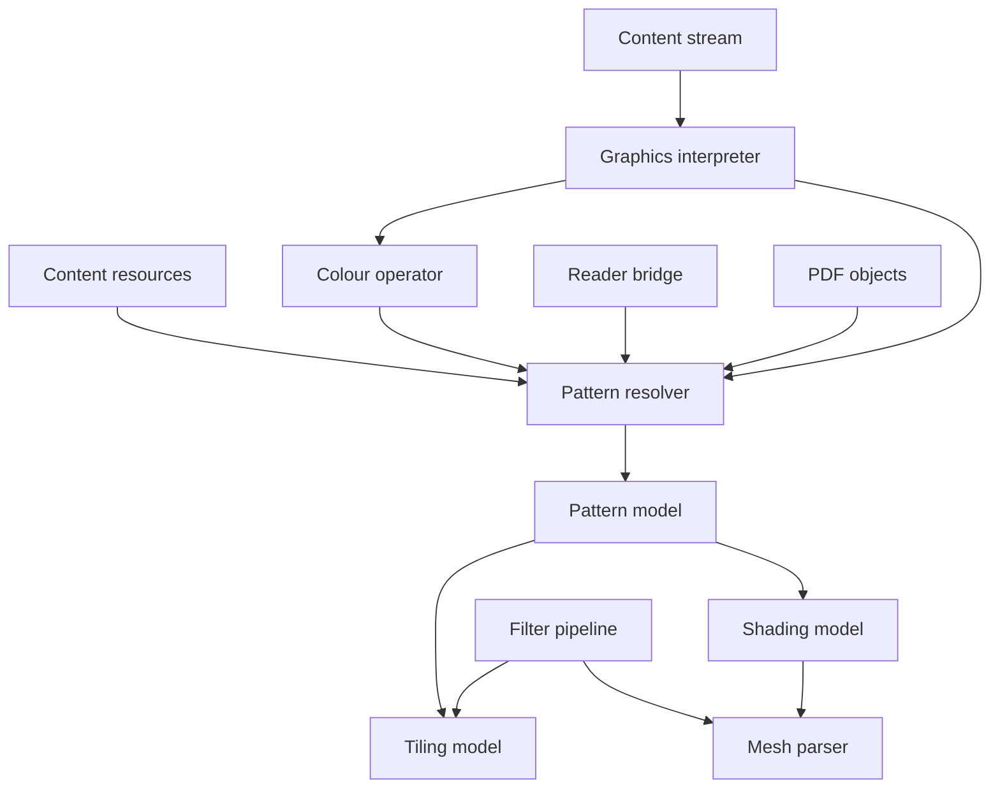
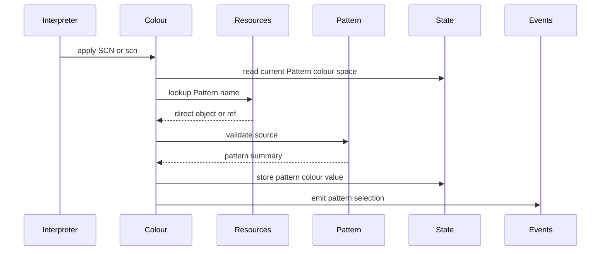
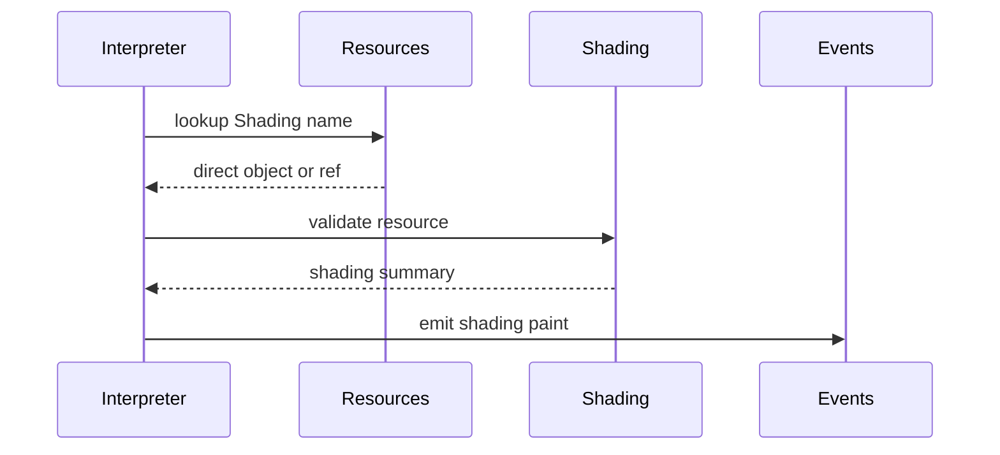
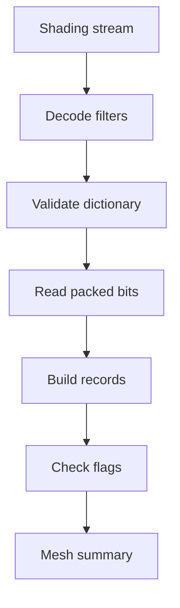
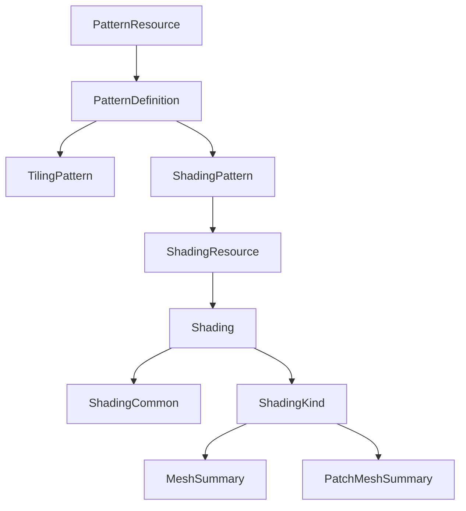

# Design Document

## Overview
This feature delivers ISO 32000-2 clause 8.7 pattern and shading resource semantics to the existing graphics interpretation layer. It validates Pattern resources, Shading resources, Type 1 tiling pattern streams, Type 2 shading pattern dictionaries, and `sh` operator resource usage while preserving the project boundary that graphics interpretation is not rendering.

Library users and later renderer phases use this to inspect pattern paints and gradient definitions as typed, validated PDF structures. The feature extends `src/graphics` and optional `src/reader` resource helpers without changing content-stream parsing or adding device colour management.

### Goals
- Represent Pattern resources as typed coloured tiling, uncoloured tiling, and shading pattern definitions.
- Validate tiling pattern dictionary entries, pattern matrices, resource dictionaries, and tiling paint compatibility with Pattern colour-space operands.
- Represent shading dictionaries for shading types 1 through 7 with common and type-specific structural validation.
- Resolve and validate `sh` operator Shading resources when direct objects or reader-loaded objects are available.
- Decode shading mesh streams only enough to validate bit packing, record completeness, flags, and required data shapes.
- Keep rendering, colour conversion, function evaluation, mesh tessellation, and transparency compositing out of scope.

### Non-Goals
- Painting tiling cells or gradients to pixels.
- Evaluating PDF function objects, tint transforms, colour interpolation output, smoothness tolerance, antialiasing, or overprint compositing.
- Executing fonts, text layout, image masks, XObjects, transparency groups, or recursive pattern content.
- Loading indirect objects from `src/graphics`.
- Changing `src/content` operator recognition or content operand parsing.
- Adding external PDF, graphics, colour, or mesh dependencies.

## Boundary Commitments

### This Spec Owns
- Typed pattern resource models for Type 1 tiling patterns and Type 2 shading patterns.
- Structural validation for pattern dictionaries, tiling pattern streams, pattern matrices, tiling `PaintType`, `TilingType`, `BBox`, nonzero `XStep` and `YStep`, and required `Resources`.
- Integration between Pattern colour values and Pattern resources where direct or reader-loaded resources are available.
- Typed shading dictionary models for common entries and shading types 1 through 7.
- Structural validation for shading colour spaces, background components, bounding boxes, function presence, domains, coordinates, extend arrays, bit widths, decode arrays, mesh record completeness, and patch edge flags.
- `sh` operator handling that resolves the `Shading` resource category and emits a validated shading paint event.
- Reader-owned helper APIs that can load indirect Pattern and Shading resources and delegate validation to `graphics`.

### Out of Boundary
- Device-specific rendering, rasterization, scan conversion, antialiasing, smoothness tolerance sampling, and final gradient output.
- Evaluation of PDF functions, sampled functions, stitching functions, tint transforms, or colour conversion formulas.
- Transparency model behavior, including `ExtGState` blending effects for shading patterns.
- Font, glyph, image mask, XObject, and recursive Form XObject execution inside tiling pattern content streams.
- Making `src/graphics` depend on `src/reader` or any object-loading service.
- General resource preloading outside Pattern and Shading resource helper paths.

### Allowed Dependencies
- `src/graphics` may depend on `objects`, `content`, `filters`, and `moonbitlang/core/math`.
- `src/reader` may depend on `graphics` and may load indirect resources before calling graphics pattern parsers.
- Existing colour-space APIs in `src/graphics/colour_space.mbt` remain the source of truth for `ColourSpace`, component counts, ranges, and Pattern colour-space underlying validation.
- Existing content APIs remain the source of truth for resource categories, content instructions, and `sh`, `SCN`, and `scn` operator syntax.
- No external libraries are introduced.

### Revalidation Triggers
- Any public shape change to `ColourSpace`, `ColourValue`, `ColourState`, `GraphicsState`, `GraphicsEvent`, or `GraphicsProgram`.
- Any change to `ContentResources::lookup_resource`, `ResourceCategory::Pattern`, `ResourceCategory::Shading`, `ContentOperation`, or `StandardContentOperator::PaintShading`.
- Any change that makes `graphics` load indirect objects or import `reader`.
- Any addition of function evaluation, rendering, raster output, transparency compositing, image-mask painting, or XObject execution.
- Any new dependency in `src/graphics/moon.pkg` or `src/reader/moon.pkg`.
- Any change to stream filter decoding semantics used by pattern cell streams or shading mesh streams.

## Architecture

### Existing Architecture Analysis
The current `content` package already recognizes `SCN`, `scn`, and `sh`, and exposes `Pattern` and `Shading` resource category lookup. The `graphics` package already stores Pattern colour-space values as a pattern name plus optional underlying components, and it records `sh` as `GraphicsEvent::ShadingSeen`. It does not validate Pattern resource dictionaries, Shading resources, or Pattern resource compatibility with Pattern colour-space operands.

The existing dependency direction is preserved: `content` parses syntax and resources; `graphics` interprets semantic graphics state and validates direct resource definitions; `reader` owns indirect object loading and page-level helper APIs. This feature extends the `graphics` semantic layer and adds optional reader helper APIs for indirect resources.

### Architecture Pattern & Boundary Map



**Architecture Integration**:
- Selected pattern: typed structural resource interpretation inside `graphics`, with reader-owned materialization for indirect resources.
- Domain boundaries: `content` owns syntax; `graphics` owns pattern and shading semantics for loaded objects; `reader` owns object loading.
- Existing patterns preserved: package-local MoonBit files, `pub(all)` inspectable models, `suberror` diagnostics, direct resource lookup, standard-library-only implementation, and `moon info` API review.
- New components rationale: Pattern dictionaries, tiling pattern streams, shading dictionaries, mesh data, and reader materialization each have different validation rules and failure modes.
- Steering compliance: the design stays parser-first, device-independent, and independently testable.

### Technology Stack

| Layer | Choice / Version | Role in Feature | Notes |
|-------|------------------|-----------------|-------|
| Language | MoonBit project toolchain | Typed pattern and shading models | Use `///|`, `pub(all) enum`, structs, and `suberror`. |
| Object model | `trkbt10/pdf/src/objects` | Pattern and shading dictionaries, streams, names, refs | No object-model change planned. |
| Content model | `trkbt10/pdf/src/content` | `SCN`, `scn`, `sh`, resources, parsed instructions | No content parser change planned. |
| Stream filters | `trkbt10/pdf/src/filters` | Decode tiling pattern content streams and shading mesh streams | Existing `decode_stream` reused. |
| Graphics runtime | `trkbt10/pdf/src/graphics` | Owns pattern and shading semantic validation | Primary implementation package. |
| Reader integration | `trkbt10/pdf/src/reader` | Optional indirect Pattern and Shading resource loading helpers | Reader imports graphics, not the reverse. |

## File Structure Plan

### Directory Structure

```text
src/
├── graphics/
│   ├── pattern.mbt                 # PatternResource, PatternSource, pattern dictionary parsing, resource lookup
│   ├── pattern_tiling.mbt          # TilingPattern, PaintType, TilingType, BBox, XStep, YStep, Resources, Matrix validation
│   ├── pattern_shading.mbt         # ShadingPattern, Shading, common shading dictionary entries, sh operator integration
│   ├── shading_types.mbt           # Shading type 1 through 7 parameter records and validation
│   ├── shading_mesh.mbt            # MSB bit reader and structural mesh or patch stream validation
│   ├── colour_operator.mbt         # Validate Pattern resources during SCN and scn when resource objects are available
│   ├── colour_state.mbt            # Add or adjust pattern paint state only if required by validated pattern events
│   ├── interpreter.mbt             # Replace raw ShadingSeen path with validated ShadingPainted or unresolved shading event
│   ├── state.mbt                   # Add cached or event-facing pattern paint summaries only if public state requires them
│   ├── error.mbt                   # Add pattern and shading specific PdfGraphicsError cases if existing cases are insufficient
│   ├── pattern_wbtest.mbt          # Pattern resource parsing, indirect source handling, Pattern colour compatibility
│   ├── pattern_tiling_wbtest.mbt   # Tiling dictionary required entries, defaults, invalid PaintType and TilingType
│   ├── pattern_shading_wbtest.mbt  # Shading pattern and direct sh resource validation
│   ├── shading_types_wbtest.mbt    # Type 1 to 3 dictionary validation and type 4 to 7 dictionary validation
│   ├── shading_mesh_wbtest.mbt     # Packed mesh and patch stream completeness, edge flags, decode-array validation
│   └── interpreter_test.mbt        # Public graphics program events for Pattern colour and sh flows
└── reader/
    ├── patterns.mbt                # PdfPage Pattern and Shading resource loading and validation helpers
    ├── patterns_wbtest.mbt         # Indirect Pattern and Shading resource loading, errors, and page resource integration
    └── pkg.generated.mbti          # Regenerated if reader public helpers are added
```

### Modified Files
- `src/graphics/moon.pkg` - Keep existing `objects`, `content`, `filters`, and `math` imports; add no external dependency.
- `src/graphics/colour_operator.mbt` - Resolve and validate Pattern resource names for `SCN` and `scn` when the Pattern resource object is direct or supplied as loaded context.
- `src/graphics/colour_state.mbt` - Preserve existing component and pattern-name invariants; add pattern paint metadata only if needed for public event/state consistency.
- `src/graphics/interpreter.mbt` - Validate `sh` operands through `Shading` resources and emit typed shading paint events or explicit unresolved indirect events.
- `src/graphics/error.mbt` - Add `InvalidPatternResource`, `InvalidShadingResource`, or reuse `ResourceFailure` and `InvalidGraphicsState` with source offsets.
- `src/graphics/pkg.generated.mbti` - Regenerate through `moon info` after public API changes.
- `src/reader/moon.pkg` - No new import expected because `graphics` is already imported.
- `src/reader/document_error.mbt` - Add wrappers only if new reader helpers expose new document-level failures beyond existing graphics errors.
- `src/reader/pkg.generated.mbti` - Regenerate through `moon info` if reader public APIs are added.

### Existing Files Consumed Without Modification
- `src/content/resources.mbt` - `ContentResources::lookup_resource(Pattern|Shading, name)`.
- `src/content/operator.mbt` - `SetStrokingColorSpecial`, `SetNonstrokingColorSpecial`, and `PaintShading`.
- `src/graphics/colour_space.mbt` - Pattern colour-space underlying validation and shading colour-space parsing.
- `src/graphics/colour_restriction.mbt` - `UncolouredTilingPattern` restricted graphics interpretation mode.
- `src/filters/pipeline.mbt` - `decode_stream` for tiling cell and shading mesh streams.

### Component to File Mapping

| Component | Primary Files |
|-----------|---------------|
| PatternResourceResolver | `src/graphics/pattern.mbt`, `src/graphics/colour_operator.mbt`, `src/graphics/interpreter.mbt` |
| PatternModel | `src/graphics/pattern.mbt`, `src/graphics/pattern_tiling.mbt`, `src/graphics/pattern_shading.mbt` |
| TilingPatternModel | `src/graphics/pattern_tiling.mbt`, `src/graphics/colour_restriction.mbt` |
| ShadingModel | `src/graphics/pattern_shading.mbt`, `src/graphics/shading_types.mbt` |
| MeshDataParser | `src/graphics/shading_mesh.mbt` |
| PatternGraphicsIntegration | `src/graphics/colour_operator.mbt`, `src/graphics/interpreter.mbt`, `src/graphics/state.mbt` |
| ReaderPatternBridge | `src/reader/patterns.mbt` |

## System Flows

### Pattern Colour Selection



Coloured tiling patterns and shading patterns require a Pattern colour space without an underlying space. Uncoloured tiling patterns require a Pattern colour space with an underlying non-Pattern colour space and numeric operands matching that underlying component count.

### Shading Operator



The `sh` operator does not use or mutate the current colour. Direct shading dictionaries are validated immediately; indirect references remain explicit unless a reader bridge has supplied a loaded object.

### Mesh Stream Validation



The mesh parser validates bit widths, decode-array length, byte padding, complete vertex or patch records, and legal edge flags. It does not tessellate, sample, interpolate, or paint.

## Requirements Traceability

| Requirement | Summary | Components | Interfaces | Flows |
|-------------|---------|------------|------------|-------|
| 0.1 | Patterns are Pattern colour-space paint values, not ordinary numeric colours | PatternModel, PatternGraphicsIntegration | `PatternResource`, pattern selection event | Pattern Colour Selection |
| 0.2 | Pattern dictionaries have PatternType and a pattern matrix mapped into parent content space | PatternModel, TilingPatternModel, ShadingModel | `GraphicsMatrix`, `parse_pattern_object` | Pattern Colour Selection |
| 0.3 | Type 1 tiling patterns are stream resources with PaintType, TilingType, BBox, XStep, YStep, Resources, and Matrix | TilingPatternModel | `TilingPattern`, `parse_tiling_pattern_stream` | Pattern Colour Selection |
| 0.4 | Coloured tiling patterns use only the pattern name as SCN or scn operand | PatternResourceResolver, PatternGraphicsIntegration | `PatternPaintType::Coloured` | Pattern Colour Selection |
| 0.5 | Uncoloured tiling patterns use underlying colour components plus pattern name | PatternResourceResolver, PatternGraphicsIntegration, TilingPatternModel | `PatternPaintType::Uncoloured` | Pattern Colour Selection |
| 0.6 | Type 2 shading patterns wrap a shading object plus optional matrix and ExtGState | ShadingModel, PatternModel | `ShadingPattern`, `parse_shading_pattern_dictionary` | Pattern Colour Selection |
| 0.7 | `sh` paints a named Shading resource without using current colour | PatternResourceResolver, ShadingModel, PatternGraphicsIntegration | `apply_shading_operator` | Shading Operator |
| 0.8 | Shading dictionaries share ShadingType, ColorSpace, Background, BBox, AntiAlias, and optional Function constraints | ShadingModel | `ShadingCommon`, `parse_shading_object` | Shading Operator |
| 0.9 | Shading colour-space rules affect interpolation policy and forbid Pattern spaces | ShadingModel | `parse_shading_colour_space` | Shading Operator |
| 0.10 | Shading types dispatch to type-specific dictionary entries | ShadingModel | `ShadingKind` | Shading Operator |
| 0.11 | Type 1 function-based shading validates Domain, Matrix, and required Function | ShadingModel | `FunctionBasedShading` | Shading Operator |
| 0.12 | Type 2 axial shading validates Coords, Domain, Function, and Extend | ShadingModel | `AxialShading` | Shading Operator |
| 0.13 | Type 3 radial shading validates circle coordinates, radii, Domain, Function, and Extend | ShadingModel | `RadialShading` | Shading Operator |
| 0.14 | Type 4 free-form Gouraud mesh validates stream bit widths, Decode, Function, and edge flags | ShadingModel, MeshDataParser | `FreeFormMeshShading`, `MeshSummary` | Mesh Stream Validation |
| 0.15 | Type 5 lattice mesh validates VerticesPerRow and stream vertex records | ShadingModel, MeshDataParser | `LatticeMeshShading`, `MeshSummary` | Mesh Stream Validation |
| 0.16 | Type 6 Coons patch mesh validates patch flags, control points, corner colours, and implicit edge data | ShadingModel, MeshDataParser | `CoonsPatchMeshShading`, `PatchMeshSummary` | Mesh Stream Validation |
| 0.17 | Type 7 tensor-product patch mesh validates tensor control point counts and patch edge data | ShadingModel, MeshDataParser | `TensorPatchMeshShading`, `PatchMeshSummary` | Mesh Stream Validation |

## Components and Interfaces

| Component | Domain | Intent | Req Coverage | Key Dependencies | Contracts |
|-----------|--------|--------|--------------|------------------|-----------|
| PatternResourceResolver | Graphics resources | Resolve Pattern and Shading resources and preserve indirect sources | 0.1-0.7 | `content` P0, `objects` P0 | Service |
| PatternModel | Graphics domain | Represent Pattern resources and shared pattern dictionary rules | 0.1, 0.2, 0.6 | PatternResourceResolver P0 | Service, State |
| TilingPatternModel | Graphics domain | Validate Type 1 tiling pattern streams and paint compatibility | 0.3-0.5 | `filters` P0, `content` P1 | Service, State |
| ShadingModel | Graphics domain | Validate Type 2 shading patterns and Shading resources | 0.6-0.13 | ColourSpace parser P0, `objects` P0 | Service, State |
| MeshDataParser | Graphics domain | Validate packed mesh and patch stream data for shading types 4 through 7 | 0.14-0.17 | `filters` P0 | Service |
| PatternGraphicsIntegration | Graphics interpreter | Apply Pattern colour and `sh` semantics to events and state | 0.1, 0.4-0.7 | PatternResourceResolver P0, GraphicsState P0 | Service, State |
| ReaderPatternBridge | Reader integration | Load indirect Pattern and Shading resources for page-level validation | 0.1-0.17 | `reader` P0, PatternModel P0 | API |

### Graphics Domain

#### PatternResourceResolver

| Field | Detail |
|-------|--------|
| Intent | Resolve Pattern and Shading resource names into direct validated definitions or explicit indirect sources. |
| Requirements | 0.1, 0.2, 0.4, 0.5, 0.7 |

**Responsibilities & Constraints**
- Look up `Pattern` and `Shading` resources through `ContentResources`.
- Validate direct dictionaries and streams through `PatternModel` or `ShadingModel`.
- Represent indirect references without loading them in `graphics`.
- Raise resource failures for missing names, wrong resource category shapes, and malformed direct resources.

**Dependencies**
- Inbound: `ColourOperatorInterpreter` - validates `SCN` and `scn` pattern names (P0).
- Inbound: `GraphicsInterpreter` - validates `sh` names (P0).
- Outbound: `ContentResources` - resource lookup (P0).
- Outbound: `PatternModel`, `ShadingModel` - direct object parsing (P0).

**Contracts**: Service [x] / API [ ] / Event [ ] / Batch [ ] / State [ ]

##### Service Interface
```moonbit
pub fn resolve_pattern_resource(
  resources : @content.ContentResources,
  name : @objects.PdfName,
  offset : Int64,
) -> PatternResource raise PdfGraphicsError

pub fn resolve_shading_resource(
  resources : @content.ContentResources,
  name : @objects.PdfName,
  offset : Int64,
) -> ShadingResource raise PdfGraphicsError
```
- Preconditions: `name` is the exact content-stream resource name operand.
- Postconditions: Direct resources are structurally validated; indirect resources carry the `ObjectId`.
- Invariants: The resolver never imports or calls `reader`.

#### PatternModel

| Field | Detail |
|-------|--------|
| Intent | Represent the common Pattern resource boundary and dispatch by `PatternType`. |
| Requirements | 0.1, 0.2, 0.6 |

**Responsibilities & Constraints**
- Parse `PatternType` and optional `Type /Pattern`.
- Dispatch `PatternType 1` to `TilingPatternModel` and `PatternType 2` to `ShadingPattern`.
- Parse `Matrix` as a six-number `GraphicsMatrix`, defaulting to identity.
- Preserve indirect pattern sources as unresolved references.

**Dependencies**
- Outbound: `TilingPatternModel` - Type 1 stream parsing (P0).
- Outbound: `ShadingModel` - Type 2 pattern parsing (P0).
- Outbound: `GraphicsMatrix` - matrix representation (P1).

**Contracts**: Service [x] / API [ ] / Event [ ] / Batch [ ] / State [x]

##### Service Interface
```moonbit
pub(all) enum PatternResource {
  DirectPattern(@objects.PdfName, PatternDefinition)
  IndirectPattern(@objects.PdfName, @objects.ObjectId)
}

pub(all) enum PatternDefinition {
  Tiling(TilingPattern)
  Shading(ShadingPattern)
}

pub fn parse_pattern_object(
  name : @objects.PdfName,
  object : @objects.PdfObject,
  defaults : ColourDefaults,
  offset : Int64,
) -> PatternResource raise PdfGraphicsError
```
- Preconditions: `object` is the value from a Pattern resource entry or a reader-loaded replacement.
- Postconditions: `PatternType` is known for direct objects.
- Invariants: A Type 1 pattern is a stream; a Type 2 pattern is a dictionary.

#### TilingPatternModel

| Field | Detail |
|-------|--------|
| Intent | Validate Type 1 tiling pattern stream dictionaries and pattern cell interpretation prerequisites. |
| Requirements | 0.3, 0.4, 0.5 |

**Responsibilities & Constraints**
- Validate `PatternType == 1`, `PaintType` in `1..2`, `TilingType` in `1..3`.
- Validate `BBox` rectangle with four numbers and preserve zero width or height as legal.
- Validate `XStep` and `YStep` are nonzero numbers.
- Require `Resources` to be a dictionary.
- Decode the pattern stream only when interpreting or validating pattern cell content.
- Mark uncoloured patterns so colour operators inside the cell run under `ColourRestriction::UncolouredTilingPattern`.

**Dependencies**
- Outbound: `filters.decode_stream` - decoded pattern cell bytes (P0).
- Outbound: `content.parse_decoded_content` - pattern cell syntax if implementation chooses to expose a cell program (P1).
- Outbound: `GraphicsInterpreter` - optional restricted interpretation of pattern cell instructions (P1).

**Contracts**: Service [x] / API [ ] / Event [ ] / Batch [ ] / State [x]

##### Service Interface
```moonbit
pub(all) enum PatternPaintType {
  Coloured
  Uncoloured
}

pub(all) enum TilingType {
  ConstantSpacing
  NoDistortion
  ConstantSpacingFast
}

pub(all) struct TilingPattern {
  paint_type : PatternPaintType
  tiling_type : TilingType
  bbox : GraphicsRect
  x_step : Double
  y_step : Double
  resources : @objects.PdfDictionary
  matrix : GraphicsMatrix
  stream : @objects.PdfStream
}
```
- Preconditions: The source stream dictionary belongs to a Pattern resource.
- Postconditions: Numeric fields are normalized to typed values and defaults are applied.
- Invariants: `x_step != 0.0`, `y_step != 0.0`, and `resources` is direct.

#### ShadingModel

| Field | Detail |
|-------|--------|
| Intent | Validate shading pattern dictionaries and named Shading resources. |
| Requirements | 0.6-0.13 |

**Responsibilities & Constraints**
- Validate common shading entries: `ShadingType`, `ColorSpace`, optional `Background`, optional `BBox`, and optional `AntiAlias`.
- Reject Pattern colour spaces for shading `ColorSpace`.
- Validate function presence where required while preserving function objects unevaluated.
- Enforce Indexed colour-space restrictions when a Function entry is present or when shading types 1 through 3 forbid Indexed.
- Parse Type 1, 2, and 3 geometric entries and default domains, matrices, and extend arrays.
- Parse Type 2 pattern dictionaries with optional `Matrix` and optional direct `ExtGState` dictionary.

**Dependencies**
- Outbound: `parse_colour_space_object` - shading colour-space parsing (P0).
- Outbound: `GraphicsMatrix`, `GraphicsRect` - geometry values (P0).
- Outbound: `MeshDataParser` - stream data validation for types 4 through 7 (P0).

**Contracts**: Service [x] / API [ ] / Event [ ] / Batch [ ] / State [x]

##### Service Interface
```moonbit
pub(all) struct ShadingPattern {
  shading : ShadingResource
  matrix : GraphicsMatrix
  ext_gstate : @objects.PdfDictionary?
}

pub(all) enum ShadingResource {
  DirectShading(@objects.PdfName?, Shading)
  IndirectShading(@objects.PdfName?, @objects.ObjectId)
}

pub(all) struct ShadingCommon {
  colour_space : ColourSpace
  background : Array[Double]?
  bbox : GraphicsRect?
  anti_alias : Bool
}

pub(all) struct Shading {
  common : ShadingCommon
  kind : ShadingKind
}

pub(all) enum ShadingKind {
  FunctionBased(FunctionBasedShading)
  Axial(AxialShading)
  Radial(RadialShading)
  FreeFormMesh(FreeFormMeshShading)
  LatticeMesh(LatticeMeshShading)
  CoonsPatchMesh(CoonsPatchMeshShading)
  TensorPatchMesh(TensorPatchMeshShading)
}
```
- Preconditions: Colour resources passed to the parser are direct or already materialized by reader.
- Postconditions: `ShadingType` dispatch is explicit and type-specific defaults are applied.
- Invariants: Shading `ColorSpace` is never `Pattern`.

#### MeshDataParser

| Field | Detail |
|-------|--------|
| Intent | Validate packed stream records for shading types 4 through 7 without rendering. |
| Requirements | 0.14, 0.15, 0.16, 0.17 |

**Responsibilities & Constraints**
- Validate allowed `BitsPerCoordinate`, `BitsPerComponent`, and `BitsPerFlag` values.
- Validate `Decode` length as coordinate pairs plus either colour component pairs or one parametric pair when `Function` is present.
- Decode stream bytes through `filters.decode_stream`.
- Verify Type 4 triangle sequences use complete records and legal edge flags.
- Verify Type 5 lattice streams contain complete rows with `VerticesPerRow >= 2`.
- Verify Type 6 and 7 patch streams contain at least one complete patch and legal edge flag sequences.
- Return counts and summaries, not geometric tessellations.

**Dependencies**
- Outbound: `filters.decode_stream` - decoded packed bytes (P0).
- Internal: graphics-local MSB bit reader - high-order bit stream reading (P0).

**Contracts**: Service [x] / API [ ] / Event [ ] / Batch [ ] / State [ ]

##### Service Interface
```moonbit
pub(all) struct MeshSummary {
  vertex_count : Int
  triangle_count : Int
  decoded_length : Int
}

pub(all) struct PatchMeshSummary {
  patch_count : Int
  decoded_length : Int
}
```
- Preconditions: Shading dictionary bit-width and decode entries have already been validated.
- Postconditions: Stream byte packing is consumed only through whole valid records.
- Invariants: Padding bits at the end of each vertex or patch record are ignored only where ISO permits them.

#### PatternGraphicsIntegration

| Field | Detail |
|-------|--------|
| Intent | Connect validated Pattern and Shading resources to graphics interpretation events and state. |
| Requirements | 0.1, 0.4, 0.5, 0.6, 0.7 |

**Responsibilities & Constraints**
- For `SCN` and `scn`, validate Pattern resource compatibility with the current Pattern colour space.
- Preserve current `ColourState` semantics for components and pattern names.
- Emit typed events that expose the validated pattern definition or unresolved indirect source.
- For `sh`, validate the named Shading resource and emit a shading paint event without changing current colour.

**Dependencies**
- Inbound: `GraphicsInterpreter` - operator dispatch (P0).
- Outbound: `PatternResourceResolver` - resource validation (P0).
- Outbound: `GraphicsState` - colour state mutation (P0).

**Contracts**: Service [x] / API [ ] / Event [x] / Batch [ ] / State [x]

##### Event Contract
- Published events:
  - `PatternColourSelected(offset, colour_use, pattern_resource, colour_value, state_snapshot)`
  - `ShadingPainted(offset, shading_resource, state_snapshot)`
- Ordering: Events are emitted at the same instruction position where `SCN`, `scn`, or `sh` is interpreted.
- Delivery: Events are in `GraphicsProgram.events` order and are not persisted outside the returned program.

### Reader Integration

#### ReaderPatternBridge

| Field | Detail |
|-------|--------|
| Intent | Provide page-level helpers that load indirect Pattern and Shading resources before validation. |
| Requirements | 0.1-0.17 |

**Responsibilities & Constraints**
- Use `PdfPage::resources()` and `PdfFile::load_object()` to resolve Pattern and Shading resource entries.
- Call graphics pattern and shading parsers with loaded objects.
- Wrap graphics failures in document-level errors only where the public reader API requires it.
- Keep recursive pattern execution and renderer-specific resource planning out of scope.

**Dependencies**
- Inbound: Library callers requesting page pattern or shading resource inspection (P1).
- Outbound: `reader` object loading APIs (P0).
- Outbound: `graphics` pattern parsers (P0).

**Contracts**: Service [ ] / API [x] / Event [ ] / Batch [ ] / State [ ]

##### API Contract
| Method | Input | Output | Errors |
|--------|-------|--------|--------|
| `PdfPage::pattern_resource` | Pattern resource name | `PatternResource` | Missing resource, missing object, malformed pattern |
| `PdfPage::shading_resource` | Shading resource name | `ShadingResource` | Missing resource, missing object, malformed shading |
| `PdfPage::pattern_resources` | None | Array of named `PatternResource` | Malformed resource category or object loading failure |

## Data Models

### Domain Model
- `PatternResource` is either a direct validated Pattern definition or an indirect object reference.
- `PatternDefinition` is either `TilingPattern` or `ShadingPattern`.
- `TilingPattern` owns the Type 1 pattern stream dictionary contract, pattern matrix, pattern cell resource dictionary, and paint compatibility metadata.
- `ShadingPattern` owns the Type 2 Pattern dictionary wrapper and references a `ShadingResource`.
- `ShadingResource` is either direct validated `Shading` or an indirect object reference.
- `Shading` combines `ShadingCommon` with a `ShadingKind`.
- `MeshSummary` and `PatchMeshSummary` describe structural validity, not paint geometry.

### Logical Data Model



**Consistency & Integrity**
- Direct Pattern resources always have a known `PatternType`.
- Tiling patterns always have a direct `Resources` dictionary and nonzero step values.
- Shading colour spaces never use Pattern.
- Function objects are preserved but not evaluated.
- Mesh and patch summaries are valid only for the decoded stream bytes and dictionary parameters used to produce them.

## Error Handling

### Error Strategy
Pattern and shading failures use `PdfGraphicsError` with decoded-content offsets for operator-triggered failures and caller-supplied offsets for resource parser failures. Missing resource names use `ResourceFailure`. Malformed dictionary fields, invalid defaults, unsupported stream shapes, and mesh record failures use `InvalidGraphicsState` or a more specific pattern/shading variant if added during implementation.

### Error Categories and Responses
- Resource errors: missing `Pattern` or `Shading` resource category, missing name, or wrong category shape raises `ResourceFailure`.
- Structural errors: invalid `PatternType`, `PaintType`, `TilingType`, `ShadingType`, required key absence, wrong type, invalid coordinate array length, invalid bit width, or invalid decode array raises `InvalidGraphicsState`.
- Operand errors: wrong `SCN`, `scn`, or `sh` operand count or type raises `BadOperand`.
- Filter errors: stream decoding failures are mapped into `InvalidGraphicsState` with filter context, matching existing colour stream handling.
- Indirect resources: unresolved indirect Pattern or Shading values are not structural errors in pure graphics parsing; reader helpers may raise document errors if loading fails.

## Testing Strategy

### Unit Tests
- `0.2`, `0.3`: Validate Pattern dictionaries reject missing or wrong `PatternType`, invalid `Type`, invalid `Matrix`, invalid `BBox`, invalid `PaintType`, invalid `TilingType`, missing `Resources`, and zero `XStep` or `YStep`.
- `0.4`, `0.5`: Verify `SCN` and `scn` accept coloured tiling patterns without components and uncoloured tiling patterns with underlying colour components, and reject mismatched Pattern colour-space shapes.
- `0.6`, `0.8`, `0.9`: Validate shading patterns and common shading dictionaries, including Pattern colour-space rejection, background component count, `BBox`, `AntiAlias`, and `ExtGState` shape.
- `0.11`, `0.12`, `0.13`: Validate Type 1, Type 2, and Type 3 shading defaults and required entries, including Indexed colour-space restrictions and invalid radii.
- `0.14`, `0.15`, `0.16`, `0.17`: Validate mesh stream bit widths, decode array lengths, complete records, legal edge flags, lattice row constraints, and patch implicit-data sequences.

### Integration Tests
- `0.1`, `0.4`, `0.5`: Interpret content streams selecting Pattern colours from direct Pattern resources and assert final colour state plus pattern selection events.
- `0.7`: Interpret a direct `sh` resource and assert the current colour state is unchanged while a shading paint event is emitted.
- `0.3`, `0.5`: Decode a tiling pattern stream and interpret the cell under `UncolouredTilingPattern` restriction to prove colour operators are ignored there.
- `0.6`, `0.8`: Validate a Type 2 shading pattern whose Shading entry is direct and whose Matrix defaults to identity.
- `0.1-0.17`: Reader helper tests load indirect Pattern and Shading resources from page resources and delegate to graphics parsers.

### Performance and Robustness
- Bound mesh parser allocation by rejecting unreasonable component counts, decode arrays, and record counts before allocating large arrays.
- Test truncated streams and streams with valid padding bits separately.
- Verify large but valid mesh streams produce summaries without retaining per-pixel or tessellated geometry.
- Run `moon check`, targeted `moon test src/graphics`, targeted `moon test src/reader`, `moon fmt`, and `moon info` during implementation.

## Performance & Scalability
- Pattern and shading parsing is linear in dictionary size plus decoded stream size.
- Mesh validation reads packed bits once and stores summaries rather than full rendered geometry.
- Stream decoding uses the existing filter pipeline and inherits its memory behavior.
- Rendering-oriented caching is not introduced in this spec.

## Supporting References
- Detailed discovery notes and trade-offs are recorded in `research.md`.
