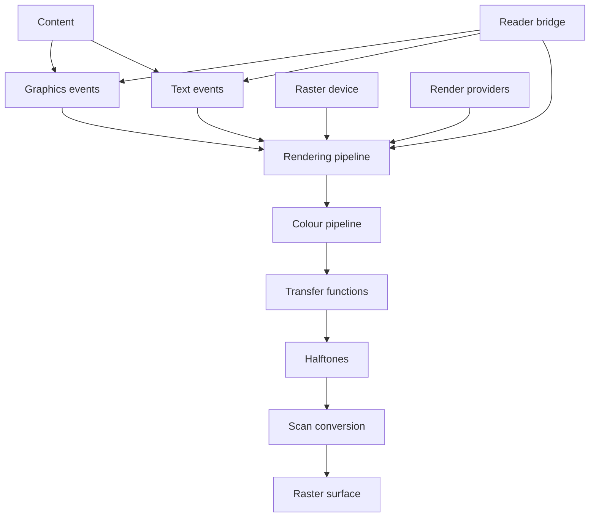
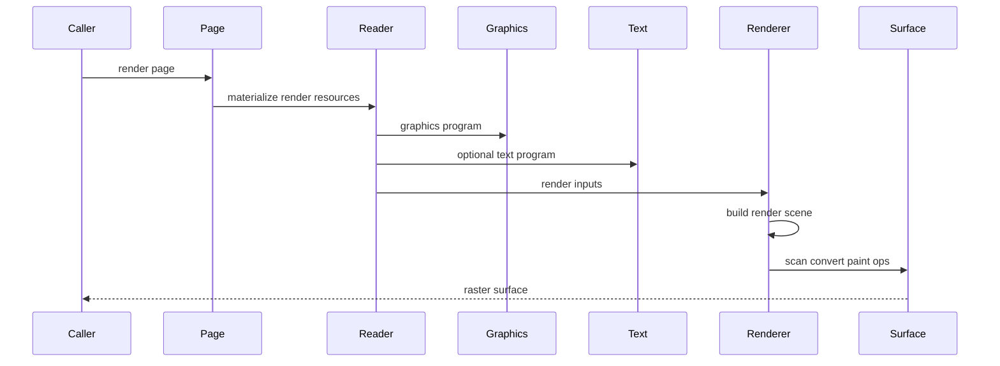
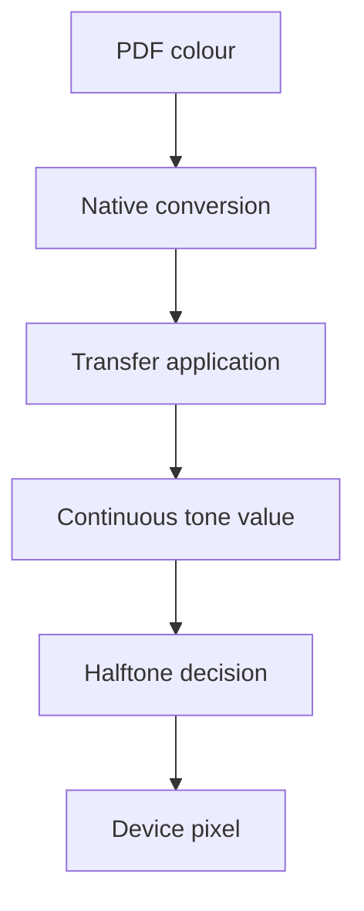
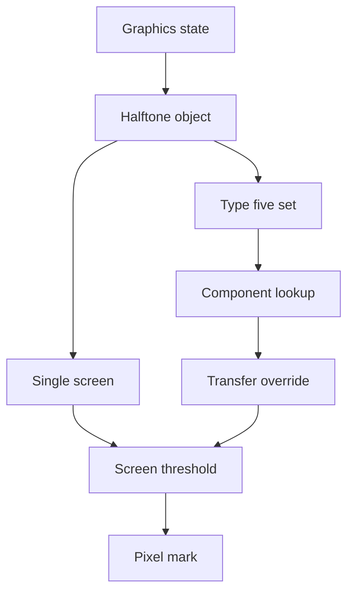
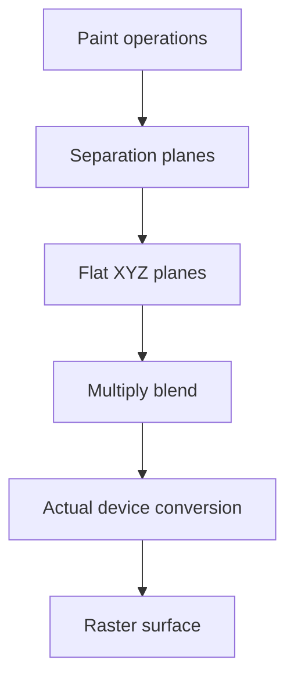

# Design Document

## Overview
This feature delivers the first device-dependent raster rendering layer for ISO 32000-2:2020 clause 10. It consumes previously interpreted graphics and text semantics, applies raster-device colour conversion policy, transfer functions, halftones, scan conversion, and separation simulation, and writes deterministic raster surface output for callers that provide the required device and provider configuration.

The primary users are MoonBit library users who need rendered page pixels or separation previews after parsing a PDF. The feature adds a downstream `src/rendering` package plus a reader bridge while preserving the existing parser-first architecture: `content` owns syntax, `graphics` owns device-independent page appearance events, `text` owns text semantics, `reader` owns document loading, and `rendering` owns raster output.

### Goals
- Model raster output devices, native colour spaces, process and spot colourants, output profiles, and render limits explicitly.
- Convert colours into the device native colour space through ISO classic formulas or caller-supplied CIE/ICC transforms.
- Apply black generation, undercolour removal, transfer functions, halftones, flatness, smoothness, scan conversion, and stroke adjustment according to clause 10.
- Render paths, images, shadings, and supplied glyph masks into a raster surface using existing graphics/text events.
- Support separation rendering and separation simulation without taking ownership of the full transparency model.

### Non-Goals
- PDF writing, content-stream serialization, display-window integration, printer-driver integration, GPU acceleration, or platform-specific raster APIs.
- Changing `objects`, `lexer`, `parser`, `filters`, `content`, `graphics`, or `text` ownership of their existing domains.
- Implementing a complete ICC colour management module in-project; strict CIE/ICC conversion uses a renderer provider contract.
- Implementing font program interpretation, system font lookup, glyph outline extraction, hinting, or antialiasing algorithms inside `src/rendering`.
- Implementing general transparency group compositing from clause 11 beyond the multiply blend required for separation simulation.

## Boundary Commitments

### This Spec Owns
- The `src/rendering` package and its public raster rendering API.
- Raster device configuration: dimensions, resolution, native colour space, process colourants, spot colourants, output profile metadata, halftone defaults, transfer defaults, and render limits.
- Raster surface and pixel-buffer models for device-native output and separation planes.
- The colour rendering pipeline from `@graphics.ColourSpace` and `@graphics.ColourValue` to native device component values.
- Classic DeviceGray, DeviceRGB, and DeviceCMYK conversion formulas, including black generation and undercolour removal hooks.
- Transfer-function selection and application, including graphics-state `TR` / `TR2` and halftone dictionary overrides.
- Halftone parsing and application for types 1, 5, 6, 10, and 16, predefined spot functions, threshold arrays, component lookup, and halftone origin handling.
- Scan conversion policy for flattened fills/strokes, image centre sampling, clipping, flatness tolerance, smoothness tolerance, and automatic stroke adjustment.
- Separation plane rendering and separation simulation to an actual device colour space.
- Reader-side page rendering bridge APIs that materialize indirect resources and wrap rendering errors.

### Out of Boundary
- `src/content` remains authoritative for content instruction syntax, operands, inline images, and resource dictionaries.
- `src/graphics` remains authoritative for graphics state, paths, colours, images, patterns, shadings, XObjects, optional-content visibility, and ordered graphics events.
- `src/text` remains authoritative for text state, font dictionaries, glyph decoding, Unicode mapping, and glyph paint intent.
- `src/reader` remains authoritative for object loading, page tree traversal, output-intent lookup, resource materialization, and document error wrapping.
- `src/rendering` does not import `src/reader`, open files, resolve indirect references by itself, or mutate parsed document objects.
- General transparency compositing, soft masks, knockout groups, blend modes beyond separation simulation multiply, and transparency presence analysis remain owned by `pdf-transparency`.
- Unsupported external codecs, unsupported ICC transforms, and unavailable glyph masks are explicit unsupported-rendering outcomes, not silent approximations.

### Allowed Dependencies
- MoonBit standard library only.
- `src/rendering` may import `moonbitlang/core/math`, `trkbt10/pdf/src/objects`, `trkbt10/pdf/src/content`, `trkbt10/pdf/src/filters`, `trkbt10/pdf/src/graphics`, and `trkbt10/pdf/src/text`.
- `src/reader` may import `src/rendering` and may also use `src/text` when constructing text render inputs.
- `src/rendering` may use provider contracts supplied by callers for CIE/ICC colour transforms and glyph masks; these are runtime values, not new package dependencies.
- Local specification excerpts under `spec/extracted/10-rendering.spec.txt` remain the primary implementation reference.

### Revalidation Triggers
- Any public shape change to `@graphics.GraphicsProgram`, `@graphics.GraphicsEvent`, `@graphics.GraphicsState`, `@graphics.ColourSpace`, `@graphics.ColourValue`, image descriptors, shading resources, pattern resources, or XObject events.
- Any public shape change to `@text.TextProgram`, `@text.TextEvent`, `@text.TextGlyphEvent`, `@text.TextPaintIntent`, or text rendering matrices.
- Any change to `@filters.decode_stream` or `@objects.PdfStream` encoded/decoded byte ownership.
- Adding a complete CMM, adding external dependencies, changing the no-reader-import boundary in `src/rendering`, or moving resource loading out of `reader`.
- Adding general transparency compositing or changing overprint semantics in `pdf-transparency`.
- Changing render strictness defaults for missing ICC transforms, missing transfer-function evaluation, missing glyph masks, or unsupported halftone definitions.

## Architecture

### Existing Architecture Analysis
The current repository already parses PDF objects and content streams, decodes supported structural streams, interprets graphics state and path semantics, validates colour spaces, validates images/XObjects/patterns/shadings, and defines text glyph events. These layers intentionally avoid final pixels. Rendering therefore sits after them and consumes their public state/event contracts.

`GraphicsState` already stores typed flatness, stroke adjustment, rendering intent, overprint, black point compensation, and halftone origin, while deferred ExtGState entries preserve `BG`, `BG2`, `UCR`, `UCR2`, `TR`, `TR2`, `HT`, and `SM` as raw PDF objects. This feature turns those deferred rendering parameters into renderer-owned policies without changing graphics interpretation.

### Architecture Pattern & Boundary Map



**Architecture Integration**:
- Selected pattern: downstream rendering pipeline with provider ports for device-dependent capabilities.
- Domain boundaries: semantic interpretation remains upstream; rasterization, device colour policy, and pixel output live in `src/rendering`; document loading lives in `src/reader`.
- Existing patterns preserved: package-per-directory layout, standard-library-only implementation, typed `suberror` diagnostics, package-local tests, `pub(all)` inspectable models, and `moon info` API review.
- New components rationale: device model, colour pipeline, transfer functions, halftones, scan conversion, separation rendering, and reader materialization each have different invariants and failure modes.
- Steering compliance: the design remains byte-oriented, explicit about lazy object loading, independently testable, and dependency-light.

### Technology Stack

| Layer | Choice / Version | Role in Feature | Notes |
|-------|------------------|-----------------|-------|
| Language | MoonBit project toolchain | Typed renderer, raster surface, and device models | Use `///|`, `pub(all)` structs/enums, and `suberror`. |
| Graphics semantics | `trkbt10/pdf/src/graphics` | Ordered paint events, state snapshots, paths, colours, images, patterns, shadings | No ownership change. |
| Text semantics | `trkbt10/pdf/src/text` | Optional glyph paint events and text rendering matrices | Rendering consumes supplied text programs. |
| Object model | `trkbt10/pdf/src/objects` | Raw functions, halftone dictionaries, profiles, streams, names, refs | Indirect refs must be materialized by reader/provider. |
| Filter pipeline | `trkbt10/pdf/src/filters` | Decode threshold-array and profile streams when supported | Unsupported filters produce explicit rendering errors. |
| Reader integration | `trkbt10/pdf/src/reader` | Page rendering APIs, output intent lookup, indirect resource loading | Reader imports rendering, not the reverse. |

## File Structure Plan

### Directory Structure

```text
src/
├── rendering/
│   ├── moon.pkg                         # Imports objects, content, filters, graphics, text, math
│   ├── error.mbt                        # PdfRenderingError and unsupported rendering diagnostics
│   ├── device.mbt                       # RasterDevice, NativeColourSpace, RenderOptions, limits
│   ├── surface.mbt                      # RasterSurface, PixelFormat, component buffers, pixel writes
│   ├── resources.mbt                    # RenderingResourceResolver and provider contracts
│   ├── scene.mbt                        # RenderScene and RenderPaintOp built from graphics and text events
│   ├── colour.mbt                       # Device colour values, classic conversions, CIE transform dispatch
│   ├── transfer.mbt                     # TransferFunctionSet, TR and TR2 resolution, additive conversion
│   ├── halftone.mbt                     # Halftone model, type 1, 5, 6, 10, 16 parsing and selection
│   ├── spot_function.mbt                # Predefined spot functions and sampled screen thresholds
│   ├── threshold.mbt                    # Threshold array storage, type 6, 10, 16 addressing, tiling
│   ├── scan_convert.mbt                 # Fill, stroke, image, glyph mask, clip, flatness, stroke adjustment
│   ├── renderer.mbt                     # Public render orchestration over scene, device, providers
│   ├── separation.mbt                   # Separation planes, overprint routing, simulation multiply blend
│   ├── device_wbtest.mbt                # Device validation, limits, native component invariants
│   ├── colour_wbtest.mbt                # Device conversion formulas, provider fallback, BG and UCR
│   ├── transfer_wbtest.mbt              # TR and TR2 precedence, subtractive additive form, gray special case
│   ├── halftone_wbtest.mbt              # Halftone dictionary validation and type 5 component dispatch
│   ├── threshold_wbtest.mbt             # Type 6, 10, 16 threshold addressing and bounds
│   ├── scan_convert_wbtest.mbt          # Half-open pixel rules, image centre sampling, stroke adjustment
│   ├── separation_wbtest.mbt            # Separation planes and separation simulation multiply
│   └── renderer_test.mbt                # Public rendering scenarios over constructed graphics programs
└── reader/
    ├── moon.pkg                         # Add text and rendering imports if absent
    ├── document_error.mbt               # Add RenderingError wrapper around @rendering.PdfRenderingError
    ├── rendering.mbt                    # PdfPage raster rendering bridge and resource materialization
    ├── rendering_wbtest.mbt             # Page render bridge, output intents, resource loading, errors
    └── pkg.generated.mbti               # Regenerated by moon info after public API changes
```

### Modified Files
- `src/reader/moon.pkg` - Add `trkbt10/pdf/src/text` and `trkbt10/pdf/src/rendering` imports as needed by the page rendering bridge.
- `src/reader/document_error.mbt` - Add `RenderingError(@rendering.PdfRenderingError)` so page APIs preserve rendering failures.
- `src/graphics/ext_gstate.mbt` - No ownership change expected; renderer consumes deferred entries already preserved in `GraphicsState`.
- `src/graphics/pkg.generated.mbti`, `src/text/pkg.generated.mbti`, `src/reader/pkg.generated.mbti`, and `src/rendering/pkg.generated.mbti` - Regenerated by `moon info` when public APIs change.

### Existing Files Consumed Without Modification
- `src/graphics/interpreter.mbt` - Ordered graphics events and state snapshots.
- `src/graphics/state.mbt` - `GraphicsState` typed rendering parameters and deferred ExtGState entries.
- `src/graphics/colour_space.mbt` and `src/graphics/colour_state.mbt` - Colour-space and current colour contracts.
- `src/graphics/path.mbt` and `src/graphics/geometry.mbt` - Path and matrix models for scan conversion.
- `src/graphics/image.mbt`, `src/graphics/pattern_shading.mbt`, and `src/graphics/xobject.mbt` - Image, shading, form, and XObject descriptors.
- `src/text/model.mbt` and `src/text/state.mbt` - Text glyph event and paint-intent contracts.
- `src/reader/graphics.mbt` and `src/reader/page_content.mbt` - Page content and graphics-program bridge patterns reused by rendering.

### Component to File Mapping

| Component | Primary Files |
|-----------|---------------|
| RasterDeviceModel | `src/rendering/device.mbt`, `src/rendering/surface.mbt` |
| RenderingResourceContracts | `src/rendering/resources.mbt`, `src/reader/rendering.mbt` |
| RenderSceneBuilder | `src/rendering/scene.mbt`, `src/rendering/renderer.mbt` |
| ColourPipeline | `src/rendering/colour.mbt`, `src/rendering/resources.mbt` |
| TransferFunctionPipeline | `src/rendering/transfer.mbt`, `src/rendering/colour.mbt` |
| HalftoneProcessor | `src/rendering/halftone.mbt`, `src/rendering/spot_function.mbt`, `src/rendering/threshold.mbt` |
| ScanConverter | `src/rendering/scan_convert.mbt`, `src/rendering/surface.mbt` |
| SeparationRenderer | `src/rendering/separation.mbt`, `src/rendering/colour.mbt`, `src/rendering/surface.mbt` |
| ReaderRenderingBridge | `src/reader/rendering.mbt`, `src/reader/document_error.mbt`, `src/reader/moon.pkg` |

## System Flows

### Page Raster Rendering



Reader materializes indirect resources and optional text inputs. Rendering consumes completed semantic programs and never loads PDF objects by itself.

### Colour Rendering Pipeline



Classic DeviceGray/RGB/CMYK conversions are in-project. CIE/ICC conversion uses the configured provider; strict mode fails when the provider cannot transform the source and destination spaces.

### Halftone Selection



Type 5 dispatch selects the colourant-specific screen or `Default`. Other halftone types apply to all native components unless overridden by Type 5.

### Separation Simulation



The simulation path is local to clause 10 rendering and does not replace the general transparency compositor.

## Requirements Traceability

| Requirement | Summary | Components | Interfaces | Flows |
|-------------|---------|------------|------------|-------|
| 1 | Clause 10 rendering sequence and device assumptions | RenderSceneBuilder, ColourPipeline, TransferFunctionPipeline, HalftoneProcessor, ScanConverter | `render_program`, `RasterDevice` | Page Raster Rendering, Colour Rendering Pipeline |
| 2 | Native raster device colour and process or spot colourants | RasterDeviceModel, ColourPipeline, SeparationRenderer | `NativeColourSpace`, `RasterDevice` | Colour Rendering Pipeline |
| 2.1 | CIE source to CIE destination conversion through device profile | ColourPipeline, RenderingResourceContracts | `ColourTransformProvider` | Colour Rendering Pipeline |
| 2.2 | Establish device colour spaces as CIE-based definitions when needed | RasterDeviceModel, ColourPipeline | `OutputProfileRef`, `DeviceColourPolicy` | Colour Rendering Pipeline |
| 2.3 | Classic device colour conversion overview | ColourPipeline | `convert_device_colour` | Colour Rendering Pipeline |
| 2.4 | Less-capable classic conversion fallback | ColourPipeline | `DeviceConversionMode` | Colour Rendering Pipeline |
| 2.5 | DeviceGray and DeviceRGB formulas | ColourPipeline | `gray_to_rgb`, `rgb_to_gray` | Colour Rendering Pipeline |
| 2.6 | DeviceGray and DeviceCMYK formulas | ColourPipeline | `gray_to_cmyk`, `cmyk_to_gray` | Colour Rendering Pipeline |
| 2.7 | DeviceRGB to DeviceCMYK with BG and UCR | ColourPipeline, TransferFunctionPipeline | `BlackGenerationPolicy`, `UndercolourRemovalPolicy` | Colour Rendering Pipeline |
| 2.8 | DeviceCMYK to DeviceRGB formula | ColourPipeline | `cmyk_to_rgb` | Colour Rendering Pipeline |
| 3 | Transfer functions after colour conversion and before halftoning | TransferFunctionPipeline | `TransferFunctionSet`, `apply_transfer` | Colour Rendering Pipeline |
| 3.1 | Halftone placement after transfer functions | HalftoneProcessor | `apply_halftone` | Halftone Selection |
| 3.2 | Device-space halftone screens unaffected by CTM | HalftoneProcessor, RasterDeviceModel | `HalftoneCell` | Halftone Selection |
| 3.3 | Spot functions and predefined names | HalftoneProcessor | `PredefinedSpotFunction` | Halftone Selection |
| 3.4 | Threshold arrays and component-independent threshold lookup | HalftoneProcessor | `ThresholdArray` | Halftone Selection |
| 3.5 | Halftone dictionaries and default device halftone fallback | HalftoneProcessor, RenderingResourceContracts | `parse_halftone_object` | Halftone Selection |
| 3.6 | Type 1 halftones | HalftoneProcessor | `TypeOneHalftone` | Halftone Selection |
| 3.7 | Type 6 halftones | HalftoneProcessor | `TypeSixHalftone` | Halftone Selection |
| 3.8 | Type 10 halftones | HalftoneProcessor | `TypeTenHalftone` | Halftone Selection |
| 3.9 | Type 16 halftones | HalftoneProcessor | `TypeSixteenHalftone` | Halftone Selection |
| 3.10 | Type 5 colourant halftones | HalftoneProcessor | `TypeFiveHalftoneSet` | Halftone Selection |
| 3.11 | Final scan conversion into raster memory | ScanConverter, RasterSurface | `scan_convert_paint_op` | Page Raster Rendering |
| 3.12 | Flatness tolerance for curve flattening | ScanConverter | `FlatnessPolicy` | Page Raster Rendering |
| 3.13 | Smoothness tolerance for shading approximation | ScanConverter, ColourPipeline | `SmoothnessPolicy` | Page Raster Rendering |
| 3.14 | Fill, stroke, image, and clipping scan conversion rules | ScanConverter | `PixelCoverageRule`, `ImageSamplingRule` | Page Raster Rendering |
| 3.15 | Automatic stroke adjustment | ScanConverter | `StrokeAdjustmentPolicy` | Page Raster Rendering |
| 3.16 | Rendering for separations | SeparationRenderer | `SeparationRenderTarget` | Separation Simulation |
| 3.17 | Separation and overprint behaviour | SeparationRenderer, ColourPipeline | `SeparationPaintPolicy` | Separation Simulation |
| 3.18 | Separation simulation to non-separation devices | SeparationRenderer, ColourPipeline | `simulate_separations` | Separation Simulation |

## Components and Interfaces

| Component | Domain | Intent | Req Coverage | Key Dependencies | Contracts |
|-----------|--------|--------|--------------|------------------|-----------|
| RasterDeviceModel | Rendering device | Describe raster dimensions, native colour, process/spot colourants, profiles, defaults, and limits | 1, 2, 2.1, 2.2, 3.1, 3.2 | `objects` P1 | State, Service |
| RenderingResourceContracts | Integration | Resolve indirect resources, evaluate PDF functions, transform CIE/ICC colours, and rasterize glyphs through caller-supplied providers | 2.1, 2.7, 3, 3.3, 3.5, 3.15 | `reader` via callback P0, `objects` P0 | Service |
| RenderSceneBuilder | Rendering orchestration | Merge graphics and optional text events into ordered paint operations | 1, 3.11, 3.14 | `graphics` P0, `text` P1 | Service |
| ColourPipeline | Colour rendering | Convert PDF colours to native device values and separation values | 1, 2, 2.1-2.8, 3.16-3.18 | `graphics` P0, RenderingResourceContracts P0 | Service |
| TransferFunctionPipeline | Tone correction | Resolve and apply BG, UCR, TR, TR2, and halftone transfer overrides | 2.7, 3, 3.1, 3.10 | `objects` P0, RenderingResourceContracts P0 | Service |
| HalftoneProcessor | Device screening | Parse and apply PDF-defined or device-default halftones | 3.1-3.10 | `filters` P0, TransferFunctionPipeline P0 | Service, State |
| ScanConverter | Rasterization | Convert paths, images, shadings, clips, and glyph masks into pixel coverage | 3.11-3.15 | `graphics` P0, RasterDeviceModel P0 | Service |
| SeparationRenderer | Separations | Produce separation planes and simulate separations on non-separation devices | 3.16-3.18 | ColourPipeline P0, RasterSurface P0 | Service, State |
| ReaderRenderingBridge | Reader integration | Materialize page resources and expose page render APIs | 1, 2.1, 3.5, 3.11 | `reader` P0, `rendering` P0 | API, Service |

### Rendering Core

#### RasterDeviceModel

| Field | Detail |
|-------|--------|
| Intent | Represent the assumed or physical raster output device used by rendering. |
| Requirements | 1, 2, 2.1, 2.2, 3.1, 3.2 |

**Responsibilities & Constraints**
- Store width, height, x/y resolution, native colour space, process colourants, spot colourants, continuous-tone support, bits per component, output profile, default transfer functions, default halftone, and render limits.
- Reject nonpositive dimensions, nonpositive resolution, unsupported native component counts, inconsistent process colourants, and threshold or surface sizes beyond configured limits.
- Keep all values explicit so rendering a page without a physical device still uses a reproducible assumed device.

**Dependencies**
- Inbound: Renderer - requests device and surface initialization (P0).
- Outbound: `objects` - stores optional output profile and halftone references (P1).

**Contracts**: Service [x] / API [ ] / Event [ ] / Batch [ ] / State [x]

##### Service Interface
```moonbit
pub(all) struct RasterDevice {
  width : Int
  height : Int
  resolution_x : Double
  resolution_y : Double
  native_colour_space : NativeColourSpace
  process_colourants : Array[@objects.PdfName]
  spot_colourants : Array[@objects.PdfName]
  continuous_tone : Bool
  bits_per_component : Int
  output_profile : OutputProfileRef?
  default_transfer : TransferFunctionRef?
  default_halftone : HalftoneRef?
  limits : RenderLimits
}

pub fn RasterDevice::validate(self : RasterDevice) -> Unit raise PdfRenderingError
```
- Preconditions: dimensions, resolution, and bits per component are positive.
- Postconditions: native component count and colourant names are internally consistent.
- Invariants: device-space coordinates map to pixels with integer boundaries and half-open pixel regions.

#### RenderingResourceContracts

| Field | Detail |
|-------|--------|
| Intent | Isolate document loading and device-dependent algorithms from the renderer core. |
| Requirements | 2.1, 2.7, 3, 3.3, 3.5, 3.15 |

**Responsibilities & Constraints**
- Resolve `PdfObject::Ref` values supplied in rendering parameters without making `src/rendering` import `reader`.
- Evaluate PDF function objects used by BG, UCR, transfer functions, tint transforms, and spot functions.
- Transform CIE/ICC colours into destination device colour spaces when strict colour management is requested.
- Rasterize glyph paint events into masks when text rendering is requested.

**Dependencies**
- Inbound: ColourPipeline, TransferFunctionPipeline, HalftoneProcessor, ScanConverter (P0).
- Outbound: caller or reader-supplied provider values (P0).

**Contracts**: Service [x] / API [ ] / Event [ ] / Batch [ ] / State [ ]

##### Service Interface
```moonbit
pub(all) struct RenderingProviders {
  object_resolver : ObjectResolver?
  function_evaluator : PdfFunctionEvaluator?
  colour_transform : ColourTransformProvider?
  glyph_rasterizer : GlyphRasterizer?
}
```
- Preconditions: strict modes require the corresponding provider before rendering begins.
- Postconditions: provider failure is wrapped as `PdfRenderingError` with operation offset or resource context.
- Invariants: providers must be side-effect free from the renderer perspective.

#### RenderSceneBuilder

| Field | Detail |
|-------|--------|
| Intent | Convert ordered graphics and optional text semantics into renderer paint operations. |
| Requirements | 1, 3.11, 3.14 |

**Responsibilities & Constraints**
- Preserve original content order by graphics event order and instruction offsets.
- Insert text glyph paint operations only when a supplied text program and glyph provider are present.
- Represent unsupported operations explicitly so callers can choose strict failure or best-effort omission.

**Dependencies**
- Inbound: Renderer (P0).
- Outbound: `graphics` events and optional `text` events (P0/P1).

**Contracts**: Service [x] / API [ ] / Event [ ] / Batch [ ] / State [ ]

##### Service Interface
```moonbit
pub fn build_render_scene(
  graphics : @graphics.GraphicsProgram,
  text : @text.TextProgram?,
  options : RenderOptions,
) -> RenderScene raise PdfRenderingError
```
- Preconditions: input programs refer to the same content stream when text is supplied.
- Postconditions: paint operations are stable and ordered for deterministic rendering.
- Invariants: scene building never mutates graphics or text program values.

### Colour and Tone

#### ColourPipeline

| Field | Detail |
|-------|--------|
| Intent | Produce native device colour components for each paint operation. |
| Requirements | 1, 2, 2.1, 2.2, 2.3, 2.4, 2.5, 2.6, 2.7, 2.8, 3.16, 3.17, 3.18 |

**Responsibilities & Constraints**
- Convert device colours using ISO classic formulas for Gray/RGB/CMYK combinations.
- Use `ColourTransformProvider` for CIE-based and ICCBased conversions when the native device does not match the source.
- Apply black generation and undercolour removal for RGB to CMYK conversion using the current graphics state or defaults.
- Preserve process and spot colourant values for separation output.

**Dependencies**
- Inbound: Renderer, SeparationRenderer (P0).
- Outbound: `graphics` colour models (P0), RenderingResourceContracts (P0), RasterDeviceModel (P0).

**Contracts**: Service [x] / API [ ] / Event [ ] / Batch [ ] / State [ ]

##### Service Interface
```moonbit
pub fn render_colour_to_native(
  colour_state : @graphics.ColourState,
  graphics_state : @graphics.GraphicsState,
  device : RasterDevice,
  providers : RenderingProviders,
  offset : Int64,
) -> NativeColour raise PdfRenderingError
```
- Preconditions: colour values are already validated by `src/graphics`.
- Postconditions: returned component count matches `device.native_colour_space`.
- Invariants: component values are clamped to 0.0 through 1.0 only where the ISO conversion formulas require clamping or the target device range requires it.

#### TransferFunctionPipeline

| Field | Detail |
|-------|--------|
| Intent | Apply tone reproduction functions after native colour conversion and before halftoning. |
| Requirements | 2.7, 3, 3.1, 3.10 |

**Responsibilities & Constraints**
- Resolve `TR2` over `TR`, `BG2` over `BG`, and `UCR2` over `UCR` from graphics-state deferred entries.
- Apply transfer functions per native component, using halftone dictionary `TransferFunction` overrides where present.
- Convert subtractive components to additive form before function evaluation and keep output in additive form for halftoning.
- Implement the DeviceGray-to-DeviceCMYK gray transfer special case.

**Dependencies**
- Inbound: ColourPipeline, HalftoneProcessor (P0).
- Outbound: RenderingResourceContracts for function evaluation (P0).

**Contracts**: Service [x] / API [ ] / Event [ ] / Batch [ ] / State [ ]

##### Service Interface
```moonbit
pub fn apply_transfer_functions(
  colour : NativeColour,
  source_space : @graphics.ColourSpace,
  graphics_state : @graphics.GraphicsState,
  halftone_override : TransferFunctionRef?,
  providers : RenderingProviders,
  offset : Int64,
) -> AdditiveNativeColour raise PdfRenderingError
```
- Preconditions: `colour` is in the raster device native colour space.
- Postconditions: output components are additive values in 0.0 through 1.0.
- Invariants: components are processed independently.

#### HalftoneProcessor

| Field | Detail |
|-------|--------|
| Intent | Convert continuous-tone additive native components to device pixel marks when a device requires halftoning. |
| Requirements | 3.1, 3.2, 3.3, 3.4, 3.5, 3.6, 3.7, 3.8, 3.9, 3.10 |

**Responsibilities & Constraints**
- Parse halftone dictionaries or streams for types 1, 5, 6, 10, and 16.
- Resolve Type 5 colourant entries and fallback `Default`.
- Generate threshold order from predefined spot functions or explicit function objects.
- Decode threshold-array streams through supported filters and validate exact byte lengths.
- Apply device-space threshold lookup independent of CTM.

**Dependencies**
- Inbound: Renderer, TransferFunctionPipeline (P0).
- Outbound: `filters` for threshold streams (P0), RenderingResourceContracts for spot functions (P0).

**Contracts**: Service [x] / API [ ] / Event [ ] / Batch [ ] / State [x]

##### Service Interface
```moonbit
pub fn resolve_halftone(
  object : @objects.PdfObject?,
  device : RasterDevice,
  providers : RenderingProviders,
  offset : Int64,
) -> HalftoneSet raise PdfRenderingError

pub fn apply_halftone(
  colour : AdditiveNativeColour,
  device_point : DevicePixelPoint,
  halftone : HalftoneSet,
  device : RasterDevice,
) -> DevicePixelMark raise PdfRenderingError
```
- Preconditions: threshold arrays and screen parameters have been validated before painting.
- Postconditions: output pixel marks use only colours representable by the device.
- Invariants: halftone cell coordinates are defined in device space and not transformed by the current CTM.

### Rasterization and Output

#### ScanConverter

| Field | Detail |
|-------|--------|
| Intent | Mark raster pixels for paths, images, shadings, glyph masks, and clipping. |
| Requirements | 3.11, 3.12, 3.13, 3.14, 3.15 |

**Responsibilities & Constraints**
- Flatten curves using graphics-state flatness and render limits.
- Approximate shadings using smoothness tolerance when shading function providers are available.
- Apply half-open pixel rules for fills, nonzero-width strokes, and clipping.
- Use centre sampling for image pixels and avoid pixel-area averaging.
- Apply automatic stroke adjustment when enabled and render very thin adjusted strokes as one-pixel strokes.
- Delegate glyph masks to `GlyphRasterizer` and apply the resulting mask through the same colour pipeline.

**Dependencies**
- Inbound: Renderer, SeparationRenderer (P0).
- Outbound: `graphics` geometry/path/image/shading models (P0), RasterSurface (P0), RenderingResourceContracts for glyphs (P1).

**Contracts**: Service [x] / API [ ] / Event [ ] / Batch [ ] / State [ ]

##### Service Interface
```moonbit
pub fn scan_convert_paint_op(
  op : RenderPaintOp,
  context : RenderContext,
  surface : RasterSurface,
) -> Unit raise PdfRenderingError
```
- Preconditions: paint operation has a resolved colour or explicit unsupported reason.
- Postconditions: affected pixels are clipped to the current raster clip.
- Invariants: clipping regions are represented as device-pixel masks derived by fill scan conversion.

#### SeparationRenderer

| Field | Detail |
|-------|--------|
| Intent | Produce subtractive separation planes and simulate separations on non-separation devices. |
| Requirements | 3.16, 3.17, 3.18 |

**Responsibilities & Constraints**
- Determine simulated process and spot colourants from device config and output intent metadata when available.
- Paint process and spot components to independent separation planes.
- Respect overprint routing for separation-oriented painting where the upstream graphics state exposes enough policy.
- Convert separation planes to flat XYZ with a white matte and multiply blend them for non-separation device simulation.
- Convert the simulated result to the actual device colour space through `ColourPipeline`.

**Dependencies**
- Inbound: Renderer (P0).
- Outbound: ColourPipeline (P0), RasterSurface (P0).

**Contracts**: Service [x] / API [ ] / Event [ ] / Batch [ ] / State [x]

##### Service Interface
```moonbit
pub fn render_separations(
  scene : RenderScene,
  device : RasterDevice,
  providers : RenderingProviders,
) -> SeparationResult raise PdfRenderingError

pub fn simulate_separations(
  result : SeparationResult,
  actual_device : RasterDevice,
  providers : RenderingProviders,
) -> RasterSurface raise PdfRenderingError
```
- Preconditions: simulated device has at least one subtractive process colourant.
- Postconditions: simulation output matches the actual device pixel format.
- Invariants: separation plane data remains independent until the explicit simulation step.

### Reader Integration

#### ReaderRenderingBridge

| Field | Detail |
|-------|--------|
| Intent | Expose page-level rendering while preserving reader ownership of document graph traversal. |
| Requirements | 1, 2.1, 3.5, 3.11 |

**Responsibilities & Constraints**
- Build `@graphics.GraphicsProgram` through existing page graphics APIs.
- Supply optional `@text.TextProgram` only when text materialization is available.
- Load indirect halftones, transfer functions, output-intent profiles, image streams, and pattern/shading resources needed by rendering.
- Wrap `PdfRenderingError` as `PdfDocumentError::RenderingError`.

**Dependencies**
- Inbound: library caller (P0).
- Outbound: `reader` page APIs (P0), `rendering` public API (P0), `graphics` and optional `text` APIs (P0/P1).

**Contracts**: Service [x] / API [x] / Event [ ] / Batch [ ] / State [ ]

##### API Contract
```moonbit
pub fn PdfPage::render_surface(
  self : PdfPage,
  device : @rendering.RasterDevice,
  options : @rendering.RenderOptions,
) -> @rendering.RasterSurface raise PdfDocumentError
```
- Preconditions: caller supplies a validated raster device and strictness options.
- Postconditions: output surface dimensions and native colour space match the supplied device.
- Invariants: page rendering never mutates document caches except through existing reader object-loading caches.

## Data Models

### Domain Model
- `RasterDevice` is the aggregate root for rendering configuration. It owns native colour space, dimensions, resolution, component bit depth, defaults, and limits.
- `RenderScene` is an immutable ordered list of `RenderPaintOp` values built from graphics and optional text programs.
- `NativeColour`, `AdditiveNativeColour`, `DevicePixelMark`, and `RasterSurface` model the flow from colour conversion to final pixels.
- `HalftoneSet` normalizes single-screen and Type 5 colourant-specific halftones.
- `SeparationResult` owns independent process and spot planes before simulation.

### Logical Data Model
- `RasterSurface` stores width, height, pixel format, component count, and component buffers. Pixel coordinates are device-space integer positions.
- `RenderPaintOp` includes source offset, operation kind, graphics state snapshot, current colour use, path/image/shading/glyph source, and unsupported reason if strict mode is disabled.
- `ThresholdArray` stores bit depth, dimensions, optional second cell geometry, decoded threshold values, and addressing mode.
- `RenderLimits` caps surface dimensions, path segment expansion, halftone cell dimensions, threshold bytes, function evaluation recursion, and provider cache entries.

### Data Contracts & Integration
- Rendering inputs are in-memory MoonBit values, not serialized APIs.
- Provider contracts return `Result` or raise `PdfRenderingError`; failures include source offset, resource name/object id where available, and provider category.
- Reader materialization supplies direct objects to `src/rendering`; unresolved indirect references in strict mode produce `UnresolvedRenderResource`.

## Error Handling

### Error Strategy
Rendering is strict by default for missing device configuration, invalid halftone dictionaries, unsupported threshold filters, unavailable required CIE/ICC transforms, unavailable function evaluation, and unresolved indirect resources. Best-effort mode may skip unsupported paint operations, but each skipped operation is recorded in `RenderReport`.

### Error Categories and Responses
- Invalid device configuration: fail before allocating a surface.
- Invalid rendering resource: fail with offset/resource context and do not partially apply the resource.
- Unsupported provider capability: fail in strict mode; record skipped paint in best-effort mode.
- Guard limit exceeded: fail with the configured limit name.
- Pixel bounds and clipping: clamp to surface bounds after validation; never write outside buffers.

### Monitoring
`RenderReport` records paint operation counts, skipped operations, unsupported features, provider fallback use, maximum path segment expansion, halftone cache sizes, and whether separation simulation was used.

## Testing Strategy

- Unit Tests:
  - Validate `RasterDevice` rejects invalid dimensions, resolution, component counts, and limit values.
  - Verify DeviceGray/RGB/CMYK conversion formulas for 2.5, 2.6, 2.7, and 2.8, including clamping after BG/UCR.
  - Verify transfer-function precedence for `TR2` over `TR`, subtractive additive-form handling, and DeviceGray-to-DeviceCMYK gray special case.
  - Verify Type 1, 5, 6, 10, and 16 halftone dictionary parsing, threshold byte counts, and Type 5 `Default` fallback.
  - Verify scan conversion half-open fill rules, image centre sampling, clipping mask intersection, flatness expansion, and stroke adjustment.
- Integration Tests:
  - Render a simple filled path from a constructed `GraphicsProgram` into a Gray and RGB surface.
  - Render colour conversions through classic fallback and through a stub `ColourTransformProvider`.
  - Render a halftoned Gray surface using a Type 6 threshold stream decoded by the filter pipeline.
  - Render separation planes and simulate them to RGB using a deterministic multiply blend fixture.
  - Exercise reader bridge error wrapping for invalid page render resources and missing providers.
- E2E Tests:
  - Render bundled simple PDF fixtures to stable small raster snapshots with deterministic device configuration.
  - Render image centre sampling and clipping against synthetic page fixtures.
  - Render a page with text glyph events only when a stub glyph rasterizer is provided, and verify strict failure without it.
- Performance and Limits:
  - Verify maximum surface dimensions prevent excessive allocation.
  - Verify path flattening and halftone threshold caches obey configured limits.
  - Verify large threshold streams fail before allocation when decoded size exceeds limits.

## Security Considerations
- PDF input is untrusted; renderer allocation is bounded by `RenderLimits`.
- Provider contracts must not receive mutable document state from `src/rendering`.
- Unsupported filter, ICC, function, and glyph paths fail explicitly in strict mode to avoid unsafe approximations.
- Threshold arrays, images, and surfaces validate byte counts before indexing.

## Performance & Scalability
- Scan conversion uses bounding boxes and row spans so painting cost scales with affected pixels rather than whole page area.
- Halftone threshold data is parsed once per render context and reused per colourant.
- Classic colour conversions are scalar and allocation-free per pixel where possible.
- Separation rendering allocates one plane per configured colourant; devices with many spot colourants must pass render-limit validation.

## Migration Strategy
- Add `src/rendering` without modifying existing public graphics/text semantics.
- Add reader rendering APIs as new entry points; existing parsing, graphics, and text APIs remain source-compatible.
- Regenerate `pkg.generated.mbti` files with `moon info` and review only intended public additions.
- Revalidate this design after `pdf-transparency` design/implementation because transparency compositing changes final page rendering order and colour handling.
