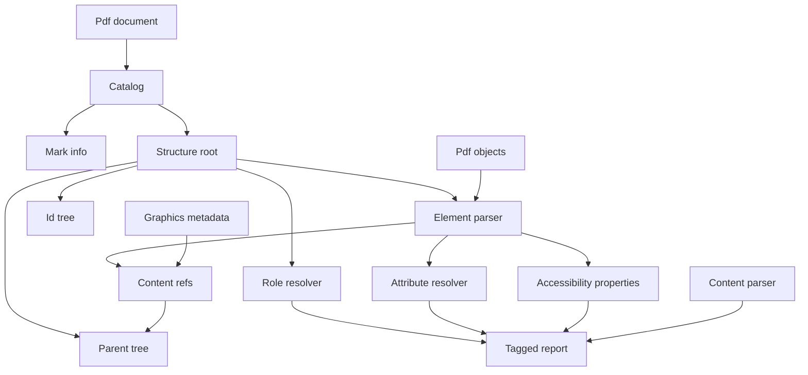
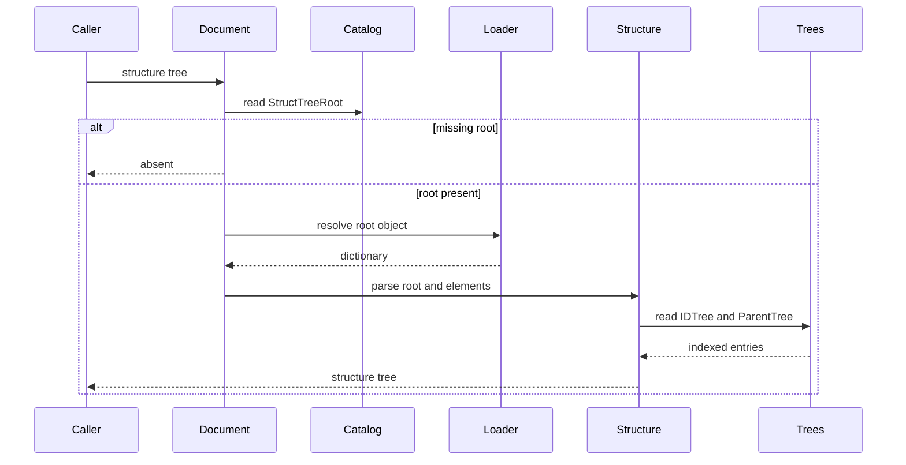
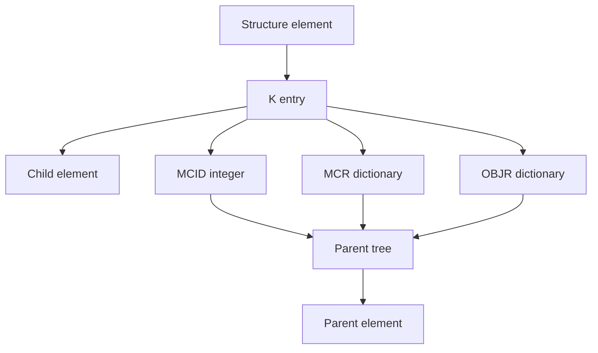
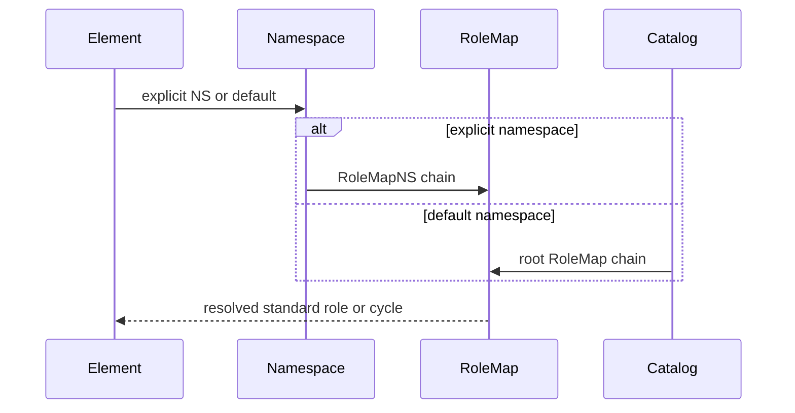
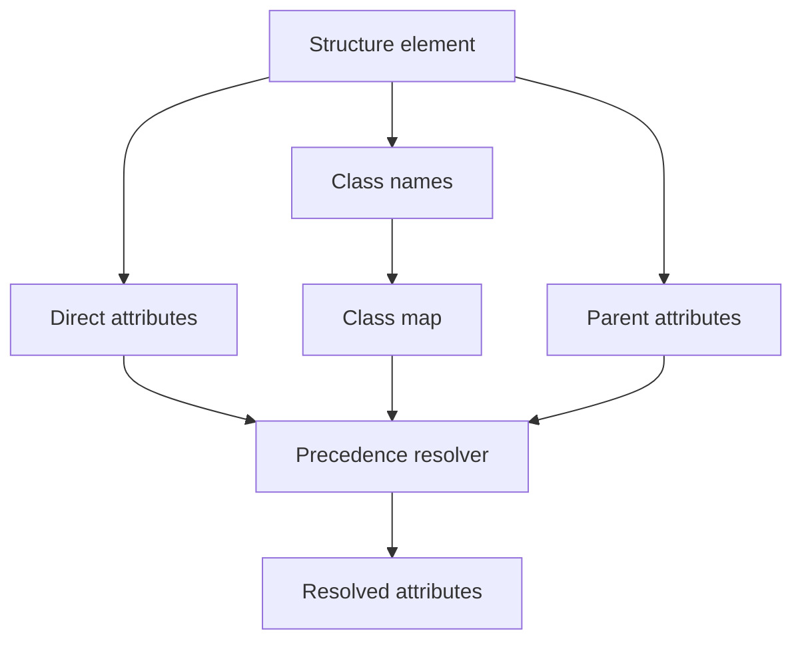
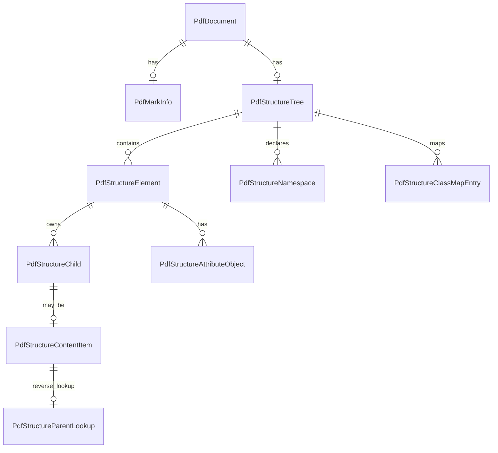

# Design Document

## Overview

This feature delivers read-side support for ISO 32000-2:2020 logical structure and Tagged PDF metadata in the MoonBit `trkbt10/pdf` library. It lets callers inspect Catalog mark information, traverse the document structure tree, resolve structure element identifiers, inspect role maps and namespaces, correlate structure content items with marked-content identifiers or object references, and read standard attributes and accessibility properties.

Library users and later extraction, accessibility, indexing, and PDF/UA-oriented phases use this layer to understand document semantics without rendering pages or mutating PDF files. The design extends the existing `src/reader` document facade because logical structure depends on Catalog entries, Page objects, annotations, XObjects, name trees, number trees, and lazy indirect-object resolution.

### Goals
- Expose `MarkInfo`, Catalog `Lang`, and optional `StructTreeRoot` through typed reader APIs.
- Parse the structure tree root, structure elements, IDTree, ParentTree, role maps, class maps, namespace dictionaries, and pronunciation lexicon references.
- Represent `K` children as child structure elements, MCID integers, marked-content reference dictionaries, and object reference dictionaries.
- Resolve structure type mappings through root `RoleMap` and namespace `RoleMapNS` chains while preserving custom roles.
- Expose raw and resolved structure attributes, user properties, standard attribute owner groups, and attribute inheritance provenance.
- Provide opt-in Tagged PDF diagnostics for mark information, real content versus artifacts, logical order, standard types, role mapping, namespaces, layout attributes, and natural language metadata.

### Non-Goals
- PDF writing, structure tree mutation, ParentTree generation, ID allocation, incremental updates, or metadata repair.
- Rendering, reflow, page layout calculation, screen-reader output, text-to-speech, PDF/UA certification, or accessibility policy decisions.
- Full text extraction, Unicode CMap evaluation, bidirectional text processing, word segmentation, or glyph-to-text recovery.
- Executing actions, resolving remote documents, playing media, submitting forms, or interpreting annotation UI behavior.
- XML or MathML parsing, namespace schema validation, pronunciation lexicon XML parsing, or XMP metadata interpretation.
- Replacing existing raw accessors such as `PdfCatalog::entry`, `PdfPage::entry`, `PdfPage::annotations`, `FormXObject`, or content parser APIs.

## Boundary Commitments

### This Spec Owns
- Reader-level typed APIs for logical structure and Tagged PDF metadata.
- Catalog `MarkInfo` interpretation: `Marked`, `UserProperties`, and deprecated `Suspects` defaults.
- Structure tree root validation for `Type`, `K`, `IDTree`, `ParentTree`, `ParentTreeNextKey`, `RoleMap`, `ClassMap`, `Namespaces`, `PronunciationLexicon`, and `AF`.
- Structure element dictionary parsing for `S`, `P`, `ID`, `Ref`, `Pg`, `K`, `A`, `C`, `R`, `T`, `Lang`, `Alt`, `E`, `ActualText`, `AF`, `NS`, `PhoneticAlphabet`, and `Phoneme`.
- Content item reference modeling for MCID integers, MCR dictionaries, OBJR dictionaries, and ParentTree back-links.
- Namespace dictionaries and role-map resolution, including circular and transitive role-map chains.
- Attribute object parsing, class-map lookup, revision-number representation, standard owner grouping, user properties, and resolved attribute provenance.
- Standard structure type metadata and supplemental Tagged PDF diagnostics derived from 14.8.
- Natural language inheritance over Catalog and structure elements.

### Out of Boundary
- Low-level object parsing, xref loading, stream filter decoding, content-stream parsing, graphics interpretation, form behavior, action behavior, and annotation rendering.
- Validating that every MCID exists in decoded content streams unless a caller explicitly supplies parsed content data to a diagnostic API.
- Computing visual content rectangles, allocation rectangles, table header associations from rendered geometry, or page reflow.
- Enforcing complete Annex L and PDF/UA conformance beyond the standard-type and supplemental rules available to this spec.
- Parsing XMP, MathML, XML schema files, pronunciation lexicons, language-tag escapes inside Unicode text strings, or font ToUnicode maps.
- Treating user-property values outside text strings, numbers, and booleans as errors.

### Allowed Dependencies
- MoonBit standard library only.
- `src/reader` may use existing local packages already imported by `src/reader/moon.pkg`: `objects`, `lexer`, `parser`, `filters`, `content`, and `graphics`.
- Existing `PdfDocument`, `PdfCatalog`, `PdfPage`, `PdfFile::load_object`, `PdfObject`, `PdfDictionary`, `PdfName`, `PdfStream`, `ObjectId`, `PdfRectangle`, `PdfAnnotation`, `FormXObject`, `ContentStream`, `ContentResources`, name-tree, and number-tree contracts.
- Existing local specification excerpts under `spec/extracted/14.7-14.13-structure-tagged.spec.txt`.
- Future downstream consumers may use this API, but this spec does not depend on future text extraction, rendering, PDF/UA, or writer APIs.

### Revalidation Triggers
- Any public shape change to `PdfDocument`, `PdfCatalog`, `PdfPage`, `PdfFile::load_object`, `PdfObject`, `PdfDictionary`, `PdfName`, `PdfStream`, `ObjectId`, `PdfAnnotation`, `FormXObject`, `ContentStream`, or `ContentResources`.
- Any dependency direction change involving `objects`, `content`, `graphics`, or `reader`.
- Any decision to introduce a dedicated structure package outside `src/reader`.
- Any implementation that starts parsing text content, applying ToUnicode maps, rendering, reflowing, executing actions, interpreting XML, or certifying PDF/UA.
- Any change to ParentTree traversal, IDTree key comparison, role-map cycle handling, namespace defaults, or attribute precedence.
- Extraction of Annex L or Annex M into local spec files that tightens standard structure nesting or namespace-difference validation.

## Architecture

### Existing Architecture Analysis

The repository already implements the `PdfDocument` facade in `src/reader`, including Catalog resolution, Page tree traversal, name-tree and number-tree helpers, Page accessors, annotations, forms, multimedia, optional content, and XObject bridges. Catalog optional entries such as `MarkInfo`, `StructTreeRoot`, and `Lang` are already available as raw `PdfCatalog::entry` values.

Logical structure is downstream of document structure. It requires lazy indirect-object loading, page object identities, annotation object references, ParentTree and IDTree traversal, and error wrapping in `PdfDocumentError`. Keeping the feature in `src/reader` follows the existing pattern used by annotations, actions, forms, multimedia, and requirements.

### Architecture Pattern & Boundary Map



**Architecture Integration**:
- Selected pattern: reader-layer structural extension over the existing lazy document facade.
- Domain boundaries: `reader` owns structure tree traversal and diagnostics; `objects` owns raw PDF values; `content` owns parsed operators; `graphics` owns XObject and optional-content metadata.
- Existing patterns preserved: standard-library-only implementation, typed public structs and `pub(all) enum`, `suberror` diagnostics, `///|` block separation, package-local white-box tests, and lazy object loading.
- New components rationale: mark information, structure elements, content references, role and namespace resolution, attributes, standard type catalog, and diagnostics have separate validation rules and test scopes.
- Steering compliance: this remains a read-only parser feature with no writer, renderer, XML parser, or external dependency.

### Technology Stack

| Layer | Choice / Version | Role in Feature | Notes |
|-------|------------------|-----------------|-------|
| Language | MoonBit project toolchain | Typed models, reader APIs, and validation | Use explicit structs, `pub(all) enum`, and raised `PdfDocumentError`. |
| Object model | `trkbt10/pdf/src/objects` | Names, dictionaries, arrays, strings, streams, refs, and raw values | No object-model changes. |
| Reader facade | `trkbt10/pdf/src/reader` | Catalog, Page, object loading, IDTree, ParentTree, public APIs | Primary implementation package. |
| Content model | `trkbt10/pdf/src/content` | Optional diagnostic input for marked-content operators and property lists | No parser behavior changes. |
| Graphics model | `trkbt10/pdf/src/graphics` | Form XObject structure-parent metadata and optional-content coexistence | No rendering changes. |
| Build and test | `moon check`, `moon test`, `moon fmt`, `moon info` | Type checking, tests, formatting, public API review | `moon info` must show intended reader API additions. |

## File Structure Plan

### Directory Structure

```text
src/
└── reader/
    ├── document_types.mbt                  # Add public structure, attribute, role, namespace, report, and language models
    ├── document_error.mbt                  # Add structure-specific document error variant
    ├── catalog.mbt                         # Keep raw MarkInfo, StructTreeRoot, and Lang entry access unchanged
    ├── structure_mark_info.mbt             # Catalog MarkInfo and Catalog Lang typed accessors
    ├── structure_tree.mbt                  # PdfDocument::structure_tree, root validation, tree traversal, cycle detection
    ├── structure_element.mbt               # Structure element dictionary parsing and K child normalization
    ├── structure_content.mbt               # MCID, MCR, OBJR, Ref, Pg, StructParent, StructParents, ParentTree checks
    ├── structure_role_namespace.mbt        # RoleMap, Namespace dictionary, RoleMapNS, standard namespace resolution
    ├── structure_attributes.mbt            # A, C, ClassMap, revision numbers, user properties, standard attributes
    ├── structure_standard_types.mbt        # Standard structure type catalog, categories, supplemental rules
    ├── structure_accessibility.mbt         # Lang, Alt, ActualText, E, Phoneme, PhoneticAlphabet resolution
    ├── tagged_pdf_report.mbt               # Opt-in Tagged PDF conformance diagnostics
    ├── structure_fixtures_wbtest.mbt       # Synthetic logical structure fixture builders
    ├── structure_mark_info_wbtest.mbt      # MarkInfo defaults and malformed shape tests
    ├── structure_tree_wbtest.mbt           # StructTreeRoot, K, IDTree, ParentTree, cycle, and parent tests
    ├── structure_content_wbtest.mbt        # MCID, MCR, OBJR, StructParent, StructParents, ParentTree tests
    ├── structure_role_namespace_wbtest.mbt # RoleMap, RoleMapNS, namespace default, cycle, MathML tests
    ├── structure_attributes_wbtest.mbt     # A, C, ClassMap, revision, precedence, user properties tests
    ├── structure_standard_types_wbtest.mbt # Standard type category and supplemental constraint tests
    ├── structure_accessibility_wbtest.mbt  # Lang, Alt, ActualText, E, phoneme inheritance tests
    ├── tagged_pdf_report_wbtest.mbt        # Tagged PDF diagnostics and warning coverage tests
    └── pdf20_structure_examples_wbtest.mbt # Smoke tests over bundled or synthetic PDF 2.0 structure examples
```

### Modified Files
- `src/reader/document_types.mbt` - Add public value models. Keep traversal state private.
- `src/reader/document_error.mbt` - Add `InvalidStructure(@objects.ObjectId?, String)` or equivalent precise structure failure variant.
- `src/reader/catalog.mbt` - No semantic change; optional entry comments already include `MarkInfo`, `StructTreeRoot`, and `Lang`.
- `src/reader/moon.pkg` - No planned dependency change.
- `src/reader/pkg.generated.mbti` - Regenerate with `moon info` after public API additions.
- `pdf.mbt` and root `pkg.generated.mbti` - Update only if the project chooses root re-exports for structure APIs.

### Component to File Mapping

| Component | Primary Files |
|-----------|---------------|
| MarkInfoReader | `src/reader/structure_mark_info.mbt`, `src/reader/document_types.mbt` |
| StructureTreeReader | `src/reader/structure_tree.mbt`, `src/reader/structure_element.mbt`, `src/reader/document_types.mbt` |
| StructureContentResolver | `src/reader/structure_content.mbt`, `src/reader/number_tree.mbt` |
| RoleNamespaceResolver | `src/reader/structure_role_namespace.mbt`, `src/reader/document_types.mbt` |
| AttributeResolver | `src/reader/structure_attributes.mbt`, `src/reader/document_types.mbt` |
| StandardStructureCatalog | `src/reader/structure_standard_types.mbt`, `src/reader/document_types.mbt` |
| AccessibilityPropertyResolver | `src/reader/structure_accessibility.mbt`, `src/reader/document_types.mbt` |
| TaggedPdfReport | `src/reader/tagged_pdf_report.mbt`, all `structure_*` files |

## System Flows

### Structure Tree Access



Missing `StructTreeRoot` returns `None`. A present malformed structure root raises `PdfDocumentError`.

### Content Item Association



The association resolver preserves the forward `K` reference and the reverse ParentTree lookup. Diagnostics can report mismatches without rejecting the base tree unless the structure dictionary itself is malformed.

### Role and Namespace Resolution



Resolution stops when a standard type is recognized, no mapping exists, or a previously visited role is reached.

### Attribute Resolution



The resolver records the selected source for each value: direct attribute, class-map attribute, inherited value, or default.

## Requirements Traceability

| Requirement | Summary | Components | Interfaces | Flows |
|-------------|---------|------------|------------|-------|
| 0.1 | Logical structure and mark information dictionary | MarkInfoReader, StructureTreeReader | `PdfDocument::mark_info`, `PdfDocument::structure_tree` | Structure Tree Access |
| 0.2 | Structure tree root and structure element dictionaries | StructureTreeReader, StructureContentResolver | `PdfStructureTree`, `PdfStructureElement` | Structure Tree Access |
| 0.3 | Structure types and root role maps | RoleNamespaceResolver, StandardStructureCatalog | `PdfResolvedStructureType` | Role and Namespace Resolution |
| 0.4 | Namespace concept for custom tagsets | RoleNamespaceResolver | `PdfStructureNamespace` | Role and Namespace Resolution |
| 0.5 | Namespace dictionary and RoleMapNS | RoleNamespaceResolver | `PdfNamespaceRoleMapEntry` | Role and Namespace Resolution |
| 0.6 | Structure elements can own graphical content | StructureContentResolver | `PdfStructureContentItem` | Content Item Association |
| 0.7 | Content item leaf restrictions | StructureContentResolver, TaggedPdfReport | `PdfStructureContentDiagnostic` | Content Item Association |
| 0.8 | Marked-content sequence references | StructureContentResolver | `PdfMarkedContentReference` | Content Item Association |
| 0.9 | Object reference dictionaries | StructureContentResolver | `PdfObjectReferenceContent` | Content Item Association |
| 0.10 | ParentTree lookup from content items | StructureContentResolver | `PdfStructureParentLookup` | Content Item Association |
| 0.11 | Attribute object dictionaries and owners | AttributeResolver | `PdfStructureAttributeObject` | Attribute Resolution |
| 0.12 | Attribute classes and ClassMap | AttributeResolver | `PdfStructureClassMap` | Attribute Resolution |
| 0.13 | Attribute revision numbers | AttributeResolver | `PdfAttributeRevision` | Attribute Resolution |
| 0.14 | User properties | AttributeResolver | `PdfUserProperty` | Attribute Resolution |
| 1.1 | Tagged PDF MarkInfo `Marked` requirement | MarkInfoReader, TaggedPdfReport | `PdfTaggedPdfReport` | Structure Tree Access |
| 1.2 | Tagged content organization rules | TaggedPdfReport, StructureContentResolver | `PdfTaggedContentRule` | Content Item Association |
| 1.3 | Real content and artifacts | TaggedPdfReport, StandardStructureCatalog | `PdfArtifactDescriptor` | Content Item Association |
| 1.4 | Artifact marked content and properties | StructureContentResolver, AttributeResolver | `PdfArtifactPropertyList` | Content Item Association |
| 1.5 | Soft hyphen declaration hooks | AccessibilityPropertyResolver, TaggedPdfReport | `PdfReplacementTextContext` | Attribute Resolution |
| 1.6 | Hidden content remains content | TaggedPdfReport | `PdfTaggedContentDiagnostic` | Content Item Association |
| 1.7 | Page order and logical order | StructureTreeReader, TaggedPdfReport | `PdfLogicalOrderEntry` | Structure Tree Access |
| 1.8 | Annotation sequencing by logical structure | StructureContentResolver | `PdfObjectReferenceContent` | Content Item Association |
| 1.9 | `ReversedChars` marked-content tag | TaggedPdfReport, StructureContentResolver | `PdfTaggedContentRule` | Content Item Association |
| 1.10 | Unicode mapping requirements and ActualText exceptions | AccessibilityPropertyResolver, TaggedPdfReport | `PdfReplacementTextContext` | Attribute Resolution |
| 1.11 | Word-break declaration hooks | AccessibilityPropertyResolver, TaggedPdfReport | `PdfTaggedTextDiagnostic` | Attribute Resolution |
| 1.12 | Basic layout model metadata | StandardStructureCatalog, AttributeResolver | `PdfLayoutAttribute` | Attribute Resolution |
| 1.13 | Reference areas and structure categories | StandardStructureCatalog | `PdfStandardStructureCategory` | Structure Tree Access |
| 1.14 | Progression direction and writing mode | AttributeResolver | `PdfWritingMode` | Attribute Resolution |
| 1.15 | Standard structure type categories | StandardStructureCatalog, RoleNamespaceResolver | `PdfStandardStructureType` | Role and Namespace Resolution |
| 1.16 | Standard element nesting constraints | StandardStructureCatalog, TaggedPdfReport | `PdfStandardNestingDiagnostic` | Structure Tree Access |
| 1.17 | Document and DocumentFragment types | StandardStructureCatalog | `PdfStandardStructureType` | Structure Tree Access |
| 1.18 | Grouping structure types | StandardStructureCatalog | `PdfStandardStructureType` | Structure Tree Access |
| 1.19 | Block-level structure types | StandardStructureCatalog | `PdfStandardStructureType` | Structure Tree Access |
| 1.20 | Sub-block structure type | StandardStructureCatalog | `PdfStandardStructureType` | Structure Tree Access |
| 1.21 | Inline element occurrence rules | StandardStructureCatalog, TaggedPdfReport | `PdfStandardNestingDiagnostic` | Structure Tree Access |
| 1.22 | General inline types and annotation form roles | StandardStructureCatalog, StructureContentResolver | `PdfStandardStructureType` | Content Item Association |
| 1.23 | Ruby and warichu structures | StandardStructureCatalog, AttributeResolver | `PdfRubyAttribute` | Attribute Resolution |
| 1.24 | Special internal structure groups | StandardStructureCatalog | `PdfStandardStructureType` | Structure Tree Access |
| 1.25 | List structures and list continuation attributes | StandardStructureCatalog, AttributeResolver | `PdfListAttribute` | Attribute Resolution |
| 1.26 | Table structures and header metadata | StandardStructureCatalog, AttributeResolver | `PdfTableAttribute` | Attribute Resolution |
| 1.27 | Caption structure rules | StandardStructureCatalog, TaggedPdfReport | `PdfStandardNestingDiagnostic` | Structure Tree Access |
| 1.28 | Figure structure and accessibility hooks | StandardStructureCatalog, AccessibilityPropertyResolver | `PdfReplacementTextContext` | Attribute Resolution |
| 1.29 | Formula structure and accessibility hooks | StandardStructureCatalog, AccessibilityPropertyResolver | `PdfReplacementTextContext` | Attribute Resolution |
| 1.30 | Artifact structure type | StandardStructureCatalog, TaggedPdfReport | `PdfArtifactDescriptor` | Content Item Association |
| 1.31 | Standard structure attributes and property locations | AttributeResolver, AccessibilityPropertyResolver | `PdfStructureAttributeObject` | Attribute Resolution |
| 1.32 | Standard attribute owners | AttributeResolver | `PdfAttributeOwner` | Attribute Resolution |
| 1.33 | Attribute values and inheritance precedence | AttributeResolver | `PdfResolvedAttribute` | Attribute Resolution |
| 1.34 | Layout attribute owner scope | AttributeResolver | `PdfLayoutAttribute` | Attribute Resolution |
| 1.35 | General layout attributes | AttributeResolver | `PdfLayoutAttribute` | Attribute Resolution |
| 1.36 | Block-level layout attributes | AttributeResolver | `PdfLayoutAttribute` | Attribute Resolution |
| 1.37 | Inline-level layout attributes | AttributeResolver | `PdfLayoutAttribute` | Attribute Resolution |
| 1.38 | Content and allocation rectangle declarations | AttributeResolver, TaggedPdfReport | `PdfLayoutAttribute` | Attribute Resolution |
| 1.39 | Figure Form Formula layout restrictions | AttributeResolver, TaggedPdfReport | `PdfLayoutAttribute` | Attribute Resolution |
| 1.40 | Column attributes | AttributeResolver | `PdfColumnAttribute` | Attribute Resolution |
| 1.41 | List attributes | AttributeResolver | `PdfListAttribute` | Attribute Resolution |
| 1.42 | PrintField attributes | AttributeResolver | `PdfPrintFieldAttribute` | Attribute Resolution |
| 1.43 | Table attributes | AttributeResolver | `PdfTableAttribute` | Attribute Resolution |
| 1.44 | Artifact attributes | AttributeResolver | `PdfArtifactDescriptor` | Attribute Resolution |
| 1.45 | Standard structure namespaces | RoleNamespaceResolver | `PdfStructureNamespace` | Role and Namespace Resolution |
| 1.46 | Role maps and namespace membership | RoleNamespaceResolver, TaggedPdfReport | `PdfResolvedStructureType` | Role and Namespace Resolution |
| 1.47 | MathML and other namespaces | RoleNamespaceResolver | `PdfStructureNamespace` | Role and Namespace Resolution |
| 1.48 | Accessibility support facilities | AccessibilityPropertyResolver | `PdfAccessibilityProperties` | Attribute Resolution |
| 1.49 | Natural language hierarchy | AccessibilityPropertyResolver, MarkInfoReader | `PdfEffectiveLanguage` | Attribute Resolution |

## Components and Interfaces

| Component | Domain / Layer | Intent | Req Coverage | Key Dependencies | Contracts |
|-----------|----------------|--------|--------------|------------------|-----------|
| MarkInfoReader | Reader | Expose Catalog mark and language metadata | 0.1, 1.1, 1.49 | PdfCatalog P0 | Service |
| StructureTreeReader | Reader | Parse root and element hierarchy | 0.1, 0.2, 1.7, 1.16 | PdfDocument P0, PdfFile P0 | Service, State |
| StructureContentResolver | Reader | Model K content items and ParentTree associations | 0.6, 0.7, 0.8, 0.9, 0.10, 1.8 | PdfPage P1, PdfAnnotation P1, FormXObject P1 | Service |
| RoleNamespaceResolver | Reader | Resolve custom and namespaced structure roles | 0.3, 0.4, 0.5, 1.45, 1.46, 1.47 | PdfStructureTree P0 | Service |
| AttributeResolver | Reader | Parse attributes, class maps, inheritance, and user properties | 0.11, 0.12, 0.13, 0.14, 1.31, 1.33 | PdfStructureElement P0 | Service |
| StandardStructureCatalog | Reader | Classify standard types and supplemental constraints | 1.12 through 1.30 | RoleNamespaceResolver P0 | Service |
| AccessibilityPropertyResolver | Reader | Resolve language, alternate, replacement, expansion, and pronunciation properties | 0.2, 1.48, 1.49 | AttributeResolver P1 | Service |
| TaggedPdfReport | Reader | Produce opt-in conformance diagnostics | 1.1 through 1.49 | All structure components P0 | Service |

### Reader Layer

#### MarkInfoReader

| Field | Detail |
|-------|--------|
| Intent | Convert Catalog `MarkInfo` and `Lang` entries into typed read-side metadata. |
| Requirements | 0.1, 1.1, 1.49 |

**Responsibilities & Constraints**
- Return ISO defaults for absent `Marked`, `UserProperties`, and `Suspects`.
- Preserve deprecated `Suspects` as data without making it a hard failure.
- Expose Catalog `Lang` as the highest-level natural-language source.
- Do not require a structure tree to exist when callers only inspect mark information.

**Dependencies**
- Inbound: `PdfDocument` public methods - caller entry point (P0).
- Outbound: `PdfCatalog::entry` - raw Catalog value lookup (P0).
- External: none.

**Contracts**: Service [x] / API [ ] / Event [ ] / Batch [ ] / State [ ]

##### Service Interface
```moonbit
pub fn PdfDocument::mark_info(self : PdfDocument) -> PdfMarkInfo raise PdfDocumentError
pub fn PdfDocument::document_language(self : PdfDocument) -> Bytes? raise PdfDocumentError
```
- Preconditions: the document Catalog is already validated by `PdfDocument`.
- Postconditions: absent `MarkInfo` returns all default flags; malformed present `MarkInfo` raises `InvalidStructure`.
- Invariants: raw Catalog entries remain available through `PdfCatalog::entry`.

#### StructureTreeReader

| Field | Detail |
|-------|--------|
| Intent | Resolve and parse the logical structure hierarchy. |
| Requirements | 0.1, 0.2, 1.7, 1.16, 1.17, 1.18, 1.19, 1.20, 1.21, 1.22, 1.23, 1.24, 1.25, 1.26, 1.27, 1.28, 1.29, 1.30 |

**Responsibilities & Constraints**
- Resolve Catalog `StructTreeRoot` when present and validate `/Type /StructTreeRoot`.
- Normalize root `K` and element `K` values into ordered child arrays.
- Validate structure element dictionaries, required `S` and `P`, optional IDs, page references, and metadata fields.
- Track visited indirect objects to reject structural cycles that would make traversal unbounded.
- Preserve raw dictionaries for forward compatibility.

**Dependencies**
- Inbound: `PdfDocument::structure_tree` - public entry point (P0).
- Outbound: `PdfFile::load_object` - indirect object resolution (P0).
- Outbound: `StructureContentResolver`, `RoleNamespaceResolver`, `AttributeResolver` - child parsing and enrichment (P0).

**Contracts**: Service [x] / API [ ] / Event [ ] / Batch [ ] / State [x]

##### Service Interface
```moonbit
pub fn PdfDocument::structure_tree(self : PdfDocument) -> PdfStructureTree? raise PdfDocumentError
pub fn PdfStructureTree::elements(self : PdfStructureTree) -> Array[PdfStructureElement]
pub fn PdfStructureTree::element_by_id(self : PdfStructureTree, id : Bytes) -> PdfStructureElement? raise PdfDocumentError
```
- Preconditions: Catalog is valid; `StructTreeRoot` is absent or resolves to a dictionary.
- Postconditions: element order follows depth-first logical order.
- Invariants: each parsed element retains its object id when available, raw dictionary, parent descriptor, children, and diagnostics.

#### StructureContentResolver

| Field | Detail |
|-------|--------|
| Intent | Represent structure element content items and reverse ParentTree associations. |
| Requirements | 0.6, 0.7, 0.8, 0.9, 0.10, 1.2, 1.3, 1.4, 1.6, 1.8, 1.9 |

**Responsibilities & Constraints**
- Parse MCID integers, MCR dictionaries, and OBJR dictionaries from `K`.
- Preserve `Pg`, `Stm`, `StmOwn`, `MCID`, and `Obj` values with indirect-reference requirements.
- Use ParentTree entries to map `StructParent` and `StructParents` keys back to parent structure elements.
- Report leaf-content violations and `StructParent` versus `StructParents` exclusivity as diagnostics.
- Do not parse page contents unless a caller supplies parsed content-stream data to an opt-in diagnostic.

**Dependencies**
- Inbound: `StructureTreeReader` - structure child parsing (P0).
- Outbound: `enumerate_number_tree` - ParentTree traversal (P0).
- Outbound: existing annotation and XObject models - object-reference context when available (P1).

**Contracts**: Service [x] / API [ ] / Event [ ] / Batch [ ] / State [ ]

##### Service Interface
```moonbit
pub fn PdfStructureTree::parent_for_object(self : PdfStructureTree, key : Int) -> PdfStructureParentLookup? raise PdfDocumentError
pub fn PdfStructureTree::parent_for_mcid(self : PdfStructureTree, struct_parents_key : Int, mcid : Int) -> PdfStructureParentLookup? raise PdfDocumentError
pub fn PdfDocument::structure_content_report(self : PdfDocument) -> PdfStructureContentReport raise PdfDocumentError
```
- Preconditions: ParentTree is present when structure content items require it.
- Postconditions: missing optional associations return absent; malformed ParentTree values raise `InvalidStructure`.
- Invariants: forward `K` references and reverse ParentTree lookups are stored separately.

#### RoleNamespaceResolver

| Field | Detail |
|-------|--------|
| Intent | Resolve structure type names through root and namespace-specific role maps. |
| Requirements | 0.3, 0.4, 0.5, 1.15, 1.45, 1.46, 1.47 |

**Responsibilities & Constraints**
- Parse root `RoleMap`, root `Namespaces`, namespace `NS`, `Schema`, and `RoleMapNS`.
- Apply the default standard namespace `http://iso.org/pdf/ssn` when `NS` is absent.
- Recognize the PDF 2.0 standard namespace `http://iso.org/pdf2/ssn` and MathML namespace `http://www.w3.org/1998/Math/MathML`.
- Preserve transitive chains and circular role maps instead of forcing a hard parse failure.

**Dependencies**
- Inbound: `StructureTreeReader`, `TaggedPdfReport` (P0).
- Outbound: `StandardStructureCatalog` for recognized type names (P0).

**Contracts**: Service [x] / API [ ] / Event [ ] / Batch [ ] / State [ ]

##### Service Interface
```moonbit
pub fn PdfStructureTree::resolve_structure_type(self : PdfStructureTree, element : PdfStructureElement) -> PdfResolvedStructureType raise PdfDocumentError
pub fn PdfStructureTree::namespaces(self : PdfStructureTree) -> Array[PdfStructureNamespace]
```
- Preconditions: namespace dictionaries referenced from `Namespaces` or element `NS` resolve to dictionaries.
- Postconditions: resolution returns original role, namespace, chain, and recognized target when any.
- Invariants: unknown custom roles are preserved as `Custom`.

#### AttributeResolver

| Field | Detail |
|-------|--------|
| Intent | Parse raw and resolved structure attributes with source provenance. |
| Requirements | 0.11, 0.12, 0.13, 0.14, 1.31, 1.32, 1.33, 1.34, 1.35, 1.36, 1.37, 1.38, 1.39, 1.40, 1.41, 1.42, 1.43, 1.44 |

**Responsibilities & Constraints**
- Parse `A` as a single attribute object or an array with optional revision numbers.
- Parse `C` as a class name or array with optional revision numbers and resolve through `ClassMap`.
- Model owner values including `Layout`, `List`, `PrintField`, `Table`, `Artifact`, export-format owners, `UserProperties`, and `NSO`.
- Apply precedence: format-specific direct attributes, standard direct attributes, class-map attributes, inherited values, defaults.
- Preserve raw arbitrary attribute values and user-property values.

**Dependencies**
- Inbound: `StructureTreeReader`, `TaggedPdfReport`, `AccessibilityPropertyResolver` (P0).
- Outbound: `RoleNamespaceResolver` for `NSO` owner namespace identity (P1).

**Contracts**: Service [x] / API [ ] / Event [ ] / Batch [ ] / State [ ]

##### Service Interface
```moonbit
pub fn PdfStructureElement::attributes(self : PdfStructureElement) -> Array[PdfStructureAttributeObject]
pub fn PdfStructureTree::resolved_attributes(self : PdfStructureTree, element : PdfStructureElement) -> Array[PdfResolvedAttribute] raise PdfDocumentError
pub fn PdfStructureElement::user_properties(self : PdfStructureElement) -> Array[PdfUserProperty] raise PdfDocumentError
```
- Preconditions: element belongs to the supplied tree when resolving inherited attributes.
- Postconditions: inherited and default values identify their source.
- Invariants: class-map entries do not mutate element attributes.

#### StandardStructureCatalog

| Field | Detail |
|-------|--------|
| Intent | Classify standard structure names and evaluate supplemental Tagged PDF structure rules. |
| Requirements | 1.12 through 1.30 |

**Responsibilities & Constraints**
- Classify standard names into document, grouping, block, sub-block, inline, ruby, warichu, list, table, caption, figure, formula, and artifact categories.
- Recognize heading forms `H` and `Hn` with strict uppercase and no leading zero.
- Represent known supplemental constraints: list child roles, table child roles, caption first-or-last rule, Figure and Formula text-object restriction hook, Ruby and Warichu sequence shapes, and Artifact ignore guidance.
- Keep full visual interpretation and missing Annex L matrix checks as diagnostics that can be tightened later.

**Dependencies**
- Inbound: `RoleNamespaceResolver`, `TaggedPdfReport` (P0).
- External: local ISO excerpt for 14.8 standard types (P0).

**Contracts**: Service [x] / API [ ] / Event [ ] / Batch [ ] / State [ ]

##### Service Interface
```moonbit
pub fn standard_structure_type(name : @objects.PdfName) -> PdfStandardStructureType?
pub fn PdfStructureTree::standard_structure_report(self : PdfStructureTree) -> Array[PdfStandardNestingDiagnostic] raise PdfDocumentError
```
- Preconditions: roles have already been resolved when custom names are checked.
- Postconditions: unknown names remain valid only when role mapping resolves them or diagnostics record the missing mapping.
- Invariants: this component does not certify PDF/UA.

#### AccessibilityPropertyResolver

| Field | Detail |
|-------|--------|
| Intent | Resolve language and accessibility-related textual properties from Catalog and structure elements. |
| Requirements | 0.2, 1.3, 1.5, 1.10, 1.11, 1.28, 1.29, 1.31, 1.48, 1.49 |

**Responsibilities & Constraints**
- Resolve effective `Lang` from Catalog and structure ancestors.
- Expose `Alt`, `ActualText`, `E`, `Phoneme`, and `PhoneticAlphabet` on structure elements.
- Preserve property locations so future extraction can decide whether to replace content text, describe graphics, or expand abbreviations.
- Do not parse Unicode language escape sequences inside text strings or evaluate font ToUnicode maps.

**Dependencies**
- Inbound: `StructureTreeReader`, `TaggedPdfReport` (P0).
- Outbound: `AttributeResolver` for property and attribute coexistence (P1).

**Contracts**: Service [x] / API [ ] / Event [ ] / Batch [ ] / State [ ]

##### Service Interface
```moonbit
pub fn PdfStructureTree::effective_language(self : PdfStructureTree, element : PdfStructureElement) -> PdfEffectiveLanguage raise PdfDocumentError
pub fn PdfStructureElement::accessibility_properties(self : PdfStructureElement) -> PdfAccessibilityProperties
```
- Preconditions: element belongs to the supplied tree for inherited language lookup.
- Postconditions: absent language returns a source value of `Absent`; absent phonetic alphabet defaults to `ipa` only when `Phoneme` is present.
- Invariants: raw text string bytes are preserved.

#### TaggedPdfReport

| Field | Detail |
|-------|--------|
| Intent | Produce opt-in diagnostics for Tagged PDF rules without blocking structure inspection. |
| Requirements | 1.1 through 1.49 |

**Responsibilities & Constraints**
- Check that `MarkInfo.Marked` is true for Tagged PDF diagnostics.
- Report missing structure root, missing role maps for custom types, namespace membership issues, malformed artifact properties, attribute owner misuse, and standard type supplemental rule failures.
- Report downstream-dependent checks as warnings with explicit required context, such as Unicode mapping, word breaks, text-object placement, or MCID existence in decoded content.
- Keep raw structure inspection usable when the report contains errors.

**Dependencies**
- Inbound: `PdfDocument::tagged_pdf_report` (P0).
- Outbound: all structure components (P0).
- External: no service dependency.

**Contracts**: Service [x] / API [ ] / Event [ ] / Batch [ ] / State [ ]

##### Service Interface
```moonbit
pub fn PdfDocument::tagged_pdf_report(self : PdfDocument) -> PdfTaggedPdfReport raise PdfDocumentError
pub fn PdfStructureTree::tagged_pdf_report(self : PdfStructureTree) -> PdfTaggedPdfReport raise PdfDocumentError
```
- Preconditions: base document is readable; structure tree may be absent.
- Postconditions: report contains errors, warnings, and unchecked downstream-context items.
- Invariants: report generation does not mutate caches or raw dictionaries.

## Data Models

### Domain Model



- `PdfDocument` remains the aggregate root for loading structure data.
- `PdfStructureTree` owns parsed root-level maps, indexes, namespaces, and ordered elements.
- `PdfStructureElement` owns raw dictionary data and normalized children, but not rendered content.
- `PdfStructureContentItem` is a value object for MCID, MCR, or OBJR references.
- `PdfResolvedAttribute` is a value object with source provenance.

### Logical Data Model

- `PdfMarkInfo`: `marked : Bool`, `user_properties : Bool`, `suspects : Bool`, `raw_dict : PdfDictionary?`.
- `PdfStructureTree`: root object id, root dictionary, top-level children, element index, IDTree entries, ParentTree entries, role map, class map, namespaces, pronunciation lexicons, associated files.
- `PdfStructureElement`: object id, structure type, parent reference, id, refs, page reference, children, attributes, classes, revision, title, language, accessibility properties, namespace, associated files, raw dictionary.
- `PdfStructureChild`: child element, MCID content item, MCR content item, OBJR content item, or raw malformed diagnostic.
- `PdfStructureNamespace`: namespace name bytes, schema file specification object, role-map entries, raw dictionary.
- `PdfResolvedStructureType`: original name, source namespace, role-map chain, standard target, custom terminal, cycle flag.
- `PdfStructureAttributeObject`: owner, namespace owner, revision, raw dictionary or stream, parsed user properties when owner is `UserProperties`.
- `PdfResolvedAttribute`: key, value, owner, namespace, source kind, inherited flag, default flag, revision.
- `PdfTaggedPdfReport`: errors, warnings, unchecked items, and summary flags.

### Data Contracts & Integration

- Reader APIs resolve indirect references before structure validators inspect required dictionary entries.
- IDTree keys are byte strings and are compared exactly.
- ParentTree keys are integers; object content items resolve to a parent element reference, while marked-content streams resolve to arrays indexed by MCID.
- `P` parent entries must refer to a parsed structure element or the structure tree root.
- `K` order is preserved exactly as document logical order.
- Raw dictionaries and raw `PdfObject` values are retained for custom roles, custom attributes, file specifications, associated files, schemas, and downstream specs.

## Error Handling

### Error Strategy
- Missing optional `MarkInfo`, Catalog `Lang`, and `StructTreeRoot` return default or absent values.
- Present malformed structure dictionaries raise `PdfDocumentError::InvalidStructure` or the equivalent structure-specific variant.
- Cycles in structure elements, IDTree, ParentTree, namespaces, and indirect object resolution raise existing `CycleDetected` where object identity is available.
- Tagged PDF conformance issues are report entries unless the underlying object shape prevents parsing.
- Downstream-dependent checks are warnings, not hard errors.

### Error Categories and Responses
- Malformed mark information: non-dictionary `MarkInfo`, non-boolean flags.
- Malformed structure root: wrong `Type`, invalid `K`, invalid IDTree, invalid ParentTree, invalid RoleMap, invalid ClassMap, invalid Namespaces.
- Malformed structure element: missing `S`, invalid `P`, invalid `K`, invalid `Pg`, invalid metadata fields, invalid namespace reference.
- Malformed content reference: MCR missing `MCID`, OBJR missing `Obj`, invalid indirect-reference requirements, invalid ParentTree value shape.
- Malformed attributes: missing owner `O`, invalid `NSO` namespace, invalid class-map entry, malformed revision pair, malformed user property dictionary.
- Conformance diagnostics: missing tagged mark flag, unresolved custom type, namespace membership failure, malformed artifact, supplemental standard type violation, unchecked text or rendering requirement.

### Monitoring
No runtime telemetry is introduced. Tests assert exact error variants and diagnostic categories. Public values preserve raw object context so callers can log malformed producer data.

## Testing Strategy

### Unit Tests
- `structure_mark_info_wbtest.mbt`: verify absent defaults, `Marked`, `UserProperties`, deprecated `Suspects`, Catalog `Lang`, and malformed flag errors for 0.1, 1.1, 1.49.
- `structure_element_wbtest.mbt`: verify required `S`, required `P`, optional `ID`, `Ref`, `Pg`, `K` normalization, text properties, namespace references, and raw dictionary preservation for 0.2.
- `structure_content_wbtest.mbt`: verify MCID integer children, MCR dictionaries, OBJR dictionaries, page overrides, stream references, and ParentTree array indexing for 0.6 through 0.10.
- `structure_role_namespace_wbtest.mbt`: verify root `RoleMap`, namespace `RoleMapNS`, standard namespace defaults, circular chains, PDF 2.0 namespace, and MathML namespace handling for 0.3 through 0.5 and 1.45 through 1.47.
- `structure_attributes_wbtest.mbt`: verify `A`, `C`, ClassMap, revision numbers, owner parsing, user properties, precedence, inheritance, and defaults for 0.11 through 0.14 and 1.31 through 1.44.

### Integration Tests
- `structure_tree_wbtest.mbt`: open synthetic documents with Catalog `StructTreeRoot`, nested elements, IDTree, ParentTree, RoleMap, ClassMap, and Namespaces, then verify tree traversal and lookup for 0.1 through 0.5.
- `tagged_pdf_report_wbtest.mbt`: verify report errors and warnings for missing `Marked`, unresolved custom roles, artifact property misuse, invalid standard type placement, and unchecked text requirements for 1.1 through 1.49.
- `structure_accessibility_wbtest.mbt`: verify Catalog `Lang` inheritance, element `Lang` override, `Alt`, `ActualText`, `E`, `Phoneme`, and `PhoneticAlphabet` defaulting for 0.2, 1.48, 1.49.
- `structure_standard_types_wbtest.mbt`: verify all standard type names in 1.17 through 1.30 classify to the expected category and supplemental constraints are reported.
- `pdf20_structure_examples_wbtest.mbt`: parse bundled or synthetic PDF 2.0 logical-structure examples and ensure existing document, annotation, form, and XObject tests still pass.

### E2E / Public API Tests
- `public_api_wbtest.mbt`: verify `PdfDocument::mark_info`, `PdfDocument::structure_tree`, `PdfStructureTree::element_by_id`, and `PdfDocument::tagged_pdf_report` are callable from public APIs.
- `pdf20_examples_wbtest.mbt`: ensure PDFs without structure trees return absent structure without regressions.
- `package_boundary_wbtest.mbt`: ensure no upstream package imports `reader` and no new external dependency is introduced.

### Performance / Load
- Structure traversal is linear in the number of reachable structure elements and tree entries.
- Role-map resolution uses a visited chain bounded by the number of mappings in the relevant map.
- Attribute resolution caches ancestor paths or uses bounded traversal to avoid repeated full-tree walks for report generation.
- Content-stream scanning is not performed during `structure_tree` access.

## Security Considerations

- Structure attributes, user properties, associated files, schema references, pronunciation lexicons, and raw metadata may contain sensitive producer data; APIs preserve them intentionally and leave redaction policy to callers.
- XML schema files, MathML namespaces, pronunciation lexicons, and associated files are not opened or executed.
- Actions referenced through annotations or links remain under the existing action parser and are not executed.
- No network access, file-system access, scripting, or external process execution is introduced.

## Performance & Scalability

- `PdfDocument::structure_tree` is opt-in and does not run during normal document open.
- Parsed structure data can be cached in the `PdfDocument` implementation if needed, but caching must not hide updated raw object-loading errors.
- ParentTree and IDTree traversal reuse existing bounded tree traversal patterns.
- Raw dictionaries and arrays are referenced through existing `PdfObject` values; validators avoid copying stream bytes.

## Migration Strategy

- Existing raw APIs remain compatible: `PdfCatalog::entry`, `PdfPage::entry`, annotation APIs, XObject APIs, and content parsing behavior are unchanged.
- New APIs are additive and reader-local.
- `moon info` output must be reviewed to confirm intended public API additions only.
- Future `pdf-text`, rendering, PDF/UA, associated-files, XML, MathML, and writer specs must revalidate the boundary before replacing raw hand-off fields or tightening diagnostics.
