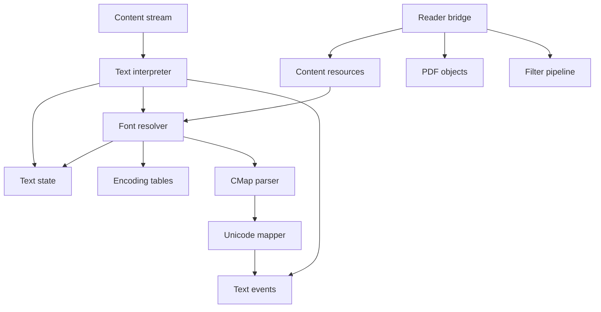
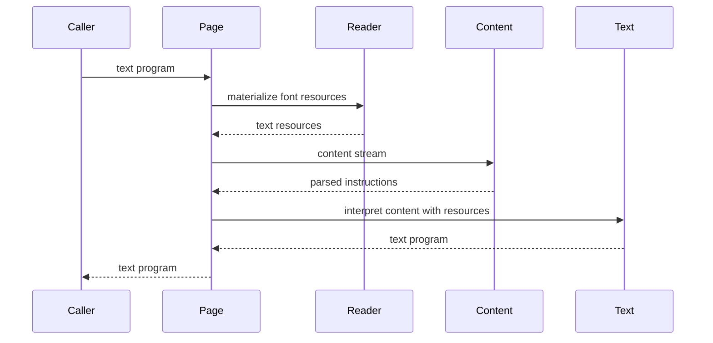
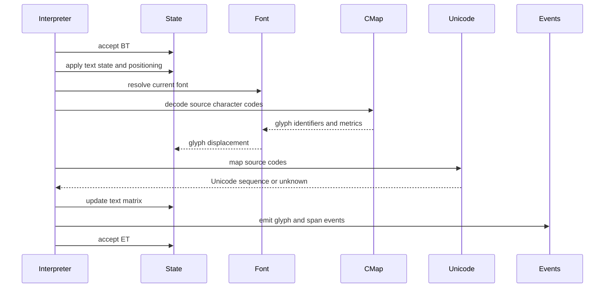
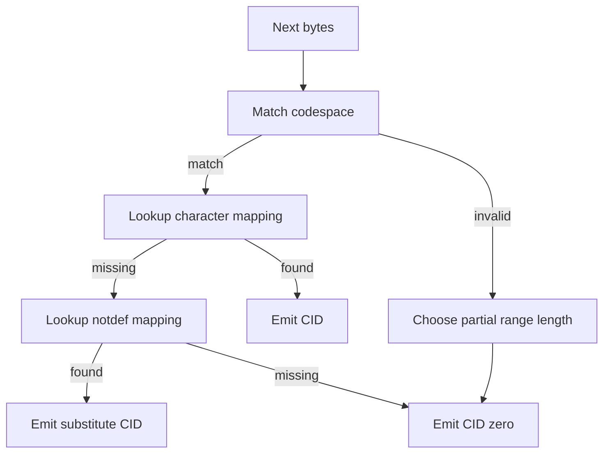

# Design Document

## Overview
This feature delivers ISO 32000-2:2020 clause 9 text semantics for the MoonBit `trkbt10/pdf` library. It consumes parsed content-stream instructions, models text state and text object state, resolves font resources, decodes simple and composite font character codes, computes glyph advances, and emits device-independent text events plus extractable Unicode text where the PDF supplies enough information.

Library users and downstream indexing workflows use this layer to inspect text content without rendering pages. The feature adds a reusable `src/text` package and a reader bridge for page-level font materialization and extraction. It preserves the existing ownership split: `src/content` owns syntax, `src/graphics` owns general graphics semantics, and `src/reader` owns document loading.

### Goals
- Interpret text state, text positioning, text showing, and text object lifecycle operators from parsed content streams.
- Parse and validate PDF font dictionaries for simple fonts, Type 0 fonts, CIDFonts, Type 3 fonts, font descriptors, embedded font metadata, and font subsets.
- Decode character codes through simple encodings, CMaps, Identity CMaps, notdef mappings, and ToUnicode CMaps.
- Compute text matrix and line matrix updates, glyph displacement, word spacing, character spacing, horizontal scaling, leading, text rise, rendering mode, and knockout state.
- Expose ordered text events and extracted Unicode spans through reusable `src/text` APIs and page-level `src/reader` APIs.

### Non-Goals
- Rendering, rasterization, hinting, antialiasing, glyph outline execution for Type 1, TrueType, CFF, or OpenType programs, or pixel output.
- System font lookup, substitute font selection, platform font APIs, font licensing enforcement, or editing embedded font programs.
- Changing content-stream tokenization, operator recognition, inline image parsing, page tree traversal, stream filter semantics, or xref/object loading.
- Full logical-structure extraction, ActualText replacement, tagged PDF reading order, reverse-order show string handling, or marked-content structure tree integration.
- Transparency compositing, final clipping path mutation from real glyph outlines, or renderer-specific color output.

## Boundary Commitments

### This Spec Owns
- The `src/text` package and its public text interpretation, font parsing, CMap, encoding, metric, and Unicode extraction APIs.
- Text state parameters: `Tc`, `Tw`, `Th`, `Tl`, `Tf`, `Tfs`, `Tmode`, `Trise`, and `Tk` as observed by text interpretation.
- Text object state: active `BT`/`ET`, text matrix `Tm`, text line matrix `Tlm`, and computed text rendering matrix values.
- Text operator semantics for `Tc`, `Tw`, `Tz`, `TL`, `Tf`, `Tr`, `Ts`, `BT`, `ET`, `Td`, `TD`, `Tm`, `T*`, `Tj`, `'`, `"`, `TJ`, `d0`, and `d1`.
- Font dictionary models for Type 1, MMType1, TrueType, Type 3, Type 0, CIDFontType0, and CIDFontType2.
- Encoding models for named encodings, encoding dictionaries, Differences arrays, Type 3 encodings, and TrueType encoding metadata.
- CMap models for codespace ranges, CID mappings, notdef mappings, writing mode, embedded CMaps, Identity-H, Identity-V, and ToUnicode mappings.
- Font descriptor, CIDSystemInfo, width, vertical metric, embedded font stream metadata, subset tag, and Type 3 CharProcs validation.
- Reader-side page text APIs that materialize font-related resource graphs and wrap text errors as document errors.

### Out of Boundary
- `src/content` remains authoritative for parsing operands, recognizing text operators, preserving string bytes, and providing `ContentResources`.
- `src/graphics` remains authoritative for general graphics events, path state, color state, XObjects, patterns, shadings, and optional content visibility. This spec does not make `src/graphics` import `src/text`.
- `src/reader` remains authoritative for indirect object loading, page tree traversal, inherited page Resources, stream decoding entry points, and document errors.
- Font program interpretation for Type 1 charstrings, TrueType glyph tables, CFF charstrings, OpenType layout, kerning, ligature substitution, and hinting is deferred.
- ActualText, structure tree reading order, accessibility replacement text, and paragraph/word layout reconstruction are deferred to a later extraction semantics spec.
- Runtime network access for CMap, glyph list, or font data is not allowed.

### Allowed Dependencies
- MoonBit standard library only.
- `src/text` may import `trkbt10/pdf/src/objects`, `trkbt10/pdf/src/content`, and `trkbt10/pdf/src/filters`.
- `src/reader` may import `trkbt10/pdf/src/text` for page text bridge APIs and text-error wrapping.
- Existing dependency direction remains valid: `objects <- lexer <- parser`; `objects <- filters`; `objects, lexer, filters <- content`; `objects, content, filters <- graphics`; `objects, content, filters <- text`; `objects, lexer, parser, filters, content, graphics, text <- reader`.
- Static generated text data is allowed only as source-controlled MoonBit tables after licensing verification. Runtime downloads and system font APIs are not allowed.
- Local specification excerpts under `spec/extracted/9-text.spec.txt`.

### Revalidation Triggers
- Any public shape change to `ContentInstruction`, `ContentOperation`, `StandardContentOperator`, `ContentResources`, `PdfInlineImage`, `PdfObject`, `PdfStream`, or `PdfName`.
- Any change to whether `PdfStream.data` stores encoded or decoded bytes or to `@filters.decode_stream`.
- Any change to `PdfPage::content_stream`, `PdfPage::materialized_content_stream`, `PdfPage::resources`, `PdfFile::load_object`, or `PdfDocumentError`.
- Adding a font-program interpreter, renderer, system font lookup, ActualText extraction, structure-tree reading order, or network-backed CMap lookup.
- Changing package dependency direction so `src/content`, `src/graphics`, or `src/text` imports `src/reader`.
- Changing text event or extracted-span public contracts.

## Architecture

### Existing Architecture Analysis
The repository already parses PDF objects, decodes supported stream filters, resolves pages, parses content streams, and interprets graphics state. `src/content` already recognizes every text-domain operator and Type 3 `d0`/`d1` operator, while `src/graphics` currently emits begin/end text object events and treats other text operators as future-domain operators.

This feature adds a semantic text layer downstream of content parsing. It does not modify the object parser or content parser. Page-specific object loading stays in `src/reader`, following the existing materialization pattern used for XObjects.

### Architecture Pattern & Boundary Map



**Architecture Integration**:
- Selected pattern: semantic interpreter with reader-owned materialization. `src/text` interprets already parsed instructions and materialized resources; `src/reader` loads indirect resource objects.
- Domain boundaries: `src/text` owns text and font semantics, not page graph traversal or rendering.
- Existing patterns preserved: package-per-directory layout, standard-library-only implementation, byte-oriented parsing, `pub(all)` inspectable models, `suberror` diagnostics, package-local tests, and `moon info` API review.
- New components rationale: text state, font resources, CMap parsing, Unicode mapping, Type 3 glyph validation, and page bridge each have separate invariants and test surfaces.
- Steering compliance: the design remains parser-first, lazy at the reader boundary, independently testable, and portable across native and wasm targets.

### Technology Stack

| Layer | Choice / Version | Role in Feature | Notes |
|-------|------------------|-----------------|-------|
| Language | MoonBit project toolchain | Typed text, font, CMap, and extraction models | Use `///|`, `pub(all)` structs/enums, and `suberror`. |
| Content model | `trkbt10/pdf/src/content` | Parsed text operators, operands, strings, and resource dictionaries | No syntax changes planned. |
| Object model | `trkbt10/pdf/src/objects` | Font dictionaries, descriptors, streams, names, arrays, and strings | No object-model change planned. |
| Filter pipeline | `trkbt10/pdf/src/filters` | Decode embedded CMap, ToUnicode, CharProcs, and embedded font streams when needed | Unsupported font programs remain metadata. |
| Text semantics | `trkbt10/pdf/src/text` | Main feature package for interpretation, metrics, and extraction | New package. |
| Reader integration | `trkbt10/pdf/src/reader` | Materialize font resources and expose page text APIs | Reader imports text, not the reverse. |
| Static data | Generated MoonBit tables | Standard encodings, glyph-name Unicode lookup, standard 14 metrics, predefined CMap metadata | No runtime network dependency. |

## File Structure Plan

### Directory Structure

```text
src/
├── text/
│   ├── moon.pkg                         # Imports objects, content, filters
│   ├── error.mbt                        # PdfTextError with instruction offsets and resource context
│   ├── matrix.mbt                       # TextMatrix and text rendering matrix helpers
│   ├── state.mbt                        # TextState, TextObjectState, TextStateStack
│   ├── font.mbt                         # FontResource dispatch for simple, Type0, CIDFont, and Type3 fonts
│   ├── font_descriptor.mbt              # FontDescriptor, flags, style, FD, embedded font metadata
│   ├── simple_font.mbt                  # Type1, MMType1, TrueType, Type3 dictionary validation and widths
│   ├── type0_font.mbt                   # Type0 root font, descendant CIDFont, CIDSystemInfo compatibility
│   ├── cid_font.mbt                     # CIDFont dictionaries, W, W2, DW, DW2, CIDToGIDMap metadata
│   ├── encoding.mbt                     # Named encodings, Differences arrays, simple-font code to glyph names
│   ├── cmap.mbt                         # CMap model, codespace matching, CID and notdef mappings
│   ├── cmap_parser.mbt                  # Embedded CMap and ToUnicode stream parser
│   ├── unicode_mapping.mbt              # ToUnicode, glyph-name, predefined CMap, and unknown fallback logic
│   ├── type3_glyph.mbt                  # CharProcs, d0, d1, glyph bbox, resources, decoded glyph content
│   ├── interpreter.mbt                  # TextInterpreter, TextProgram, TextEvent emission
│   ├── extraction.mbt                   # ExtractedText, TextSpan, source-code and Unicode sequence output
│   ├── standard_encoding.mbt            # StandardEncoding, MacRoman, MacExpert, WinAnsi tables
│   ├── standard14_metrics.mbt           # Built-in standard 14 font metrics and descriptors
│   ├── adobe_glyph_list.mbt             # Glyph-name to Unicode mapping table
│   ├── predefined_cmap.mbt              # Identity and predefined CMap metadata/table dispatch
│   ├── state_wbtest.mbt                 # Text state defaults, q/Q save restore, TK behavior
│   ├── matrix_wbtest.mbt                # Td, TD, Tm, T*, Trm, TJ displacement math
│   ├── font_wbtest.mbt                  # Font dictionary validation and metric fallback behavior
│   ├── encoding_wbtest.mbt              # Named encodings, Differences, Type3, TrueType metadata cases
│   ├── cmap_wbtest.mbt                  # Codespace, CID, notdef, Identity-H/V, WMode parsing
│   ├── unicode_mapping_wbtest.mbt       # ToUnicode, glyph names, ligatures, surrogate pairs, unknowns
│   ├── type3_glyph_wbtest.mbt           # CharProcs, d0/d1 first operator, bbox and resource scope
│   └── interpreter_test.mbt             # Public interpretation and extraction over content streams
└── reader/
    ├── moon.pkg                         # Add text import
    ├── document_error.mbt               # Add TextError wrapper around @text.PdfTextError
    ├── text.mbt                         # PdfPage text resources, text program, extracted text APIs
    ├── text_wbtest.mbt                  # Page font materialization, ToUnicode streams, page extraction
    └── pkg.generated.mbti               # Regenerated by moon info when public APIs change
```

### Modified Files
- `src/reader/moon.pkg` - Add `trkbt10/pdf/src/text` import.
- `src/reader/document_error.mbt` - Add `TextError(@text.PdfTextError)` for page-level text failures.
- `src/reader/pkg.generated.mbti` and `src/text/pkg.generated.mbti` - Regenerated by `moon info` after implementation.
- `src/graphics/interpreter.mbt` - No planned change. It continues to classify text-domain operators as graphics future-domain events.
- `src/content/*`, `src/objects/*`, `src/parser/*`, `src/filters/*`, `moon.pkg`, and `cmd/main/*` - No planned changes.

### Existing Files Consumed Without Modification
- `src/content/operator.mbt` - Existing text and Type 3 operator recognition.
- `src/content/parser.mbt` - Existing operand preservation for strings, arrays, names, numbers, and text operators.
- `src/content/resources.mbt` - Existing Font and ExtGState resource category lookup.
- `src/reader/page_content.mbt` - Existing decoded page content parsing and inherited Resources bridge.
- `src/reader/xobjects.mbt` - Existing materialized resource pattern used as a model for font materialization.
- `src/objects/types.mbt` - `PdfObject`, `PdfName`, `PdfDictionary`, `PdfStream`, and indirect references.
- `src/filters/pipeline.mbt` - Stream decoding for embedded CMaps, ToUnicode streams, CharProcs, and embedded font streams.

### Component to File Mapping

| Component | Primary Files |
|-----------|---------------|
| TextStateMachine | `src/text/state.mbt`, `src/text/matrix.mbt`, `src/text/interpreter.mbt` |
| FontResourceResolver | `src/text/font.mbt`, `src/text/simple_font.mbt`, `src/text/type0_font.mbt`, `src/text/cid_font.mbt`, `src/reader/text.mbt` |
| EncodingResolver | `src/text/encoding.mbt`, `src/text/standard_encoding.mbt`, `src/text/adobe_glyph_list.mbt` |
| CMapResolver | `src/text/cmap.mbt`, `src/text/cmap_parser.mbt`, `src/text/predefined_cmap.mbt` |
| UnicodeMapper | `src/text/unicode_mapping.mbt`, `src/text/extraction.mbt` |
| Type3GlyphModel | `src/text/type3_glyph.mbt`, `src/text/simple_font.mbt` |
| FontDescriptorModel | `src/text/font_descriptor.mbt` |
| Standard14Metrics | `src/text/standard14_metrics.mbt` |
| PredefinedCMapTables | `src/text/predefined_cmap.mbt` |
| ReaderTextBridge | `src/reader/text.mbt`, `src/reader/document_error.mbt`, `src/reader/moon.pkg` |

## System Flows

### Page Text Interpretation



Reader loads indirect font resources before calling `src/text`. `src/text` never calls `PdfFile::load_object`.

### Text Object and Showing Flow



`TJ` numeric adjustments are applied between string segments and update the text matrix even when text rendering mode is invisible or clipping-only.

### CMap Decoding and Undefined Characters



The CMap decoder consumes the number of bytes required by the matched or best partially matched codespace range. Undefined or unmapped results remain observable in text events.

## Requirements Traceability

| Requirement | Summary | Components | Interfaces | Flows |
|-------------|---------|------------|------------|-------|
| 1.1 | Distinguish characters, glyphs, font dictionaries, and font programs | FontResourceResolver, Type3GlyphModel | `FontResource`, `EmbeddedFontProgram` | Text Object and Showing Flow |
| 1.2 | Select font resources and show strings through text operators | TextStateMachine, FontResourceResolver | `TextState::set_font`, `interpret_text` | Text Object and Showing Flow |
| 1.3 | Model rendering modes and color use abstractly | TextStateMachine, TextEvent | `TextRenderingMode`, `TextPaintIntent` | Text Object and Showing Flow |
| 1.4 | Compute glyph metrics and displacements | FontResourceResolver, TextStateMachine | `glyph_metrics`, `advance_text_matrix` | Text Object and Showing Flow |
| 1.5 | Store text state parameters and defaults | TextStateMachine | `TextState::initial` | Page Text Interpretation |
| 1.6 | Apply character spacing | TextStateMachine | `TextState::character_spacing` | Text Object and Showing Flow |
| 1.7 | Apply word spacing only to eligible code 32 cases | EncodingResolver, TextStateMachine | `word_spacing_applies` | Text Object and Showing Flow |
| 1.8 | Apply horizontal scaling to shape and displacement math | TextStateMachine | `horizontal_scaling` | Text Object and Showing Flow |
| 1.9 | Apply leading for line movement operators | TextStateMachine | `text_leading`, `move_to_next_line` | Text Object and Showing Flow |
| 1.10 | Model text rendering mode, clipping accumulation, and Type 3 exceptions | TextStateMachine, Type3GlyphModel | `TextRenderingMode`, `TextClipAccumulator` | Text Object and Showing Flow |
| 1.11 | Apply text rise in rendering matrix | TextStateMachine | `text_rise`, `text_rendering_matrix` | Text Object and Showing Flow |
| 1.12 | Apply text knockout from ExtGState outside text objects | TextStateMachine, ReaderTextBridge | `apply_ext_gstate_text_entries` | Page Text Interpretation |
| 1.13 | Enforce text object lifecycle and non-nesting | TextStateMachine | `begin_text_object`, `end_text_object` | Text Object and Showing Flow |
| 1.14 | Implement text positioning operators | TextStateMachine | `Td`, `TD`, `Tm`, `T*` handling | Text Object and Showing Flow |
| 1.15 | Implement text showing operators and string grouping neutrality | TextStateMachine, UnicodeMapper | `Tj`, `'`, `"`, `TJ` handling | Text Object and Showing Flow |
| 1.16 | Compute text rendering matrix and post-glyph text matrix updates | TextStateMachine | `TextRenderingMatrix`, `advance_text_matrix` | Text Object and Showing Flow |
| 2.1 | Model simple font constraints and horizontal metrics | FontResourceResolver, EncodingResolver | `SimpleFont` | Text Object and Showing Flow |
| 2.2 | Validate Type 1 font dictionaries | FontResourceResolver, FontDescriptorModel | `parse_type1_font` | Page Text Interpretation |
| 2.3 | Provide standard 14 fallback metrics | FontResourceResolver, Standard14Metrics | `standard14_metrics` | Text Object and Showing Flow |
| 2.4 | Validate MMType1 differences | FontResourceResolver | `parse_mmtype1_font` | Page Text Interpretation |
| 2.5 | Preserve TrueType/OpenType metadata and encoding constraints | FontResourceResolver, EncodingResolver | `TrueTypeFont` | Text Object and Showing Flow |
| 2.6 | Validate Type 3 font dictionaries and CharProcs | Type3GlyphModel, EncodingResolver | `Type3Font`, `Type3GlyphInvocation` | Text Object and Showing Flow |
| 2.7 | Implement simple-font encoding dictionaries and Differences | EncodingResolver | `Encoding`, `EncodingDifferences` | Text Object and Showing Flow |
| 2.8 | Apply Type 1 encoding override and `.notdef` fallback | EncodingResolver, UnicodeMapper | `glyph_name_for_code` | Text Object and Showing Flow |
| 2.9 | Require Type 3 Encoding and no default glyph name | Type3GlyphModel, EncodingResolver | `parse_type3_font` | Text Object and Showing Flow |
| 2.10 | Represent TrueType encoding algorithm constraints | EncodingResolver, FontResourceResolver | `TrueTypeEncodingPlan` | Text Object and Showing Flow |
| 2.11 | Model Type 0 fonts and descendant CIDFont relationship | FontResourceResolver, CMapResolver | `Type0Font` | CMap Decoding and Undefined Characters |
| 2.12 | Model CID-keyed architecture | FontResourceResolver, CMapResolver | `CIDFont`, `CMap` | CMap Decoding and Undefined Characters |
| 2.13 | Validate CIDSystemInfo compatibility | FontResourceResolver, CMapResolver | `CIDSystemInfo::compatible_with` | Page Text Interpretation |
| 2.14 | Validate CIDFont dictionary entries | FontResourceResolver | `parse_cid_font` | Page Text Interpretation |
| 2.15 | Preserve CID glyph selection metadata | FontResourceResolver | `cid_to_gid_map`, `GlyphSelector` | CMap Decoding and Undefined Characters |
| 2.16 | Compute CIDFont horizontal and vertical metrics | FontResourceResolver | `cid_metrics`, `vertical_metrics` | Text Object and Showing Flow |
| 2.17 | Model CMap role and writing mode | CMapResolver | `CMap`, `WritingMode` | CMap Decoding and Undefined Characters |
| 2.18 | Support predefined CMap names and Identity-H/V | CMapResolver, PredefinedCMapTables | `resolve_predefined_cmap` | CMap Decoding and Undefined Characters |
| 2.19 | Parse embedded CMap stream dictionaries and UseCMap | CMapResolver, ReaderTextBridge | `parse_cmap_stream` | CMap Decoding and Undefined Characters |
| 2.20 | Validate Type 0 font dictionaries | FontResourceResolver | `parse_type0_font` | Page Text Interpretation |
| 2.21 | Decode CMap character codes to CIDs | CMapResolver | `decode_next_code` | CMap Decoding and Undefined Characters |
| 2.22 | Handle undefined CMap characters and CID 0 fallback | CMapResolver, FontResourceResolver | `decode_notdef_or_cid_zero` | CMap Decoding and Undefined Characters |
| 2.23 | Parse common font descriptor entries | FontDescriptorModel | `FontDescriptor` | Page Text Interpretation |
| 2.24 | Interpret font descriptor flags | FontDescriptorModel, EncodingResolver | `FontDescriptorFlags` | Page Text Interpretation |
| 2.25 | Parse CIDFont descriptor additions | FontDescriptorModel | `CIDFontDescriptorExtensions` | Page Text Interpretation |
| 2.26 | Parse CIDFont style and FD metadata | FontDescriptorModel | `FontStyle`, `FontDescriptorOverride` | Page Text Interpretation |
| 2.27 | Preserve embedded font program stream metadata | FontDescriptorModel, ReaderTextBridge | `EmbeddedFontProgram` | Page Text Interpretation |
| 2.28 | Recognize font subset tags | FontResourceResolver | `FontSubsetTag` | Page Text Interpretation |
| 2.29 | Expose extractable information content separate from glyphs | UnicodeMapper, TextProgram | `ExtractedText`, `TextSpan` | Text Object and Showing Flow |
| 2.30 | Implement Unicode mapping priority | UnicodeMapper, EncodingResolver, CMapResolver | `map_to_unicode` | CMap Decoding and Undefined Characters |
| 2.31 | Parse ToUnicode CMaps and UTF-16BE destination strings | CMapResolver, UnicodeMapper | `ToUnicodeCMap` | CMap Decoding and Undefined Characters |

## Components and Interfaces

| Component | Domain | Intent | Requirement Coverage | Key Dependencies | Contracts |
|-----------|--------|--------|----------------------|------------------|-----------|
| TextStateMachine | Text semantics | Track text state, matrices, object lifecycle, and operator effects | 1.5-1.16 | `@content.ContentOperation` | Service, State |
| FontResourceResolver | Fonts | Parse font dictionaries and provide glyph metrics | 1.1-1.4, 2.1-2.6, 2.11-2.16, 2.20, 2.27-2.28 | `@objects.PdfObject`, `@content.ContentResources` | Service |
| EncodingResolver | Encoding | Map simple-font codes to glyph names and encoding metadata | 2.1, 2.7-2.10, 2.24, 2.30 | Static encoding tables | Service |
| CMapResolver | CMaps | Decode composite font and ToUnicode CMap source codes | 2.11-2.22, 2.30-2.31 | `@filters.decode_stream`, predefined tables | Service |
| UnicodeMapper | Extraction | Convert decoded character codes to Unicode sequences or unknown mappings | 2.29-2.31 | FontResourceResolver, EncodingResolver, CMapResolver | Service |
| Type3GlyphModel | Type 3 fonts | Validate glyph streams and emit abstract glyph invocation metadata | 1.10, 2.6, 2.9 | `@content.parse_decoded_content`, `@filters.decode_stream` | Service |
| TextInterpreter | Runtime | Consume content instructions and produce text events and extracted spans | 1.2-1.16, 2.29-2.31 | TextStateMachine, FontResourceResolver, UnicodeMapper | Service, State |
| ReaderTextBridge | Reader integration | Materialize font graphs and expose page text APIs | 1.2, 2.2-2.31 | `PdfPage`, `PdfFile::load_object` | API |

### Text Layer

#### TextStateMachine

| Field | Detail |
|-------|--------|
| Intent | Store and mutate text state and active text object matrices. |
| Requirements | 1.5, 1.6, 1.7, 1.8, 1.9, 1.10, 1.11, 1.12, 1.13, 1.14, 1.15, 1.16 |

**Responsibilities & Constraints**
- Initialize text state at the beginning of page interpretation.
- Retain text state values across text objects in a content stream.
- Save and restore text state on `q` and `Q` because text state is part of graphics state.
- Reject `BT` nesting, `ET` outside a text object, and positioning/showing operators outside a text object.
- Ignore ExtGState `/TK` changes between `BT` and `ET`.
- Compute text rendering matrices using font size, horizontal scaling, text rise, text matrix, and CTM-like input supplied by the interpreter.

**Dependencies**
- Inbound: TextInterpreter - applies operators in content order (P0).
- Outbound: FontResourceResolver - current font metrics for text showing (P0).
- External: none.

**Contracts**: Service [x] / API [ ] / Event [ ] / Batch [ ] / State [x]

##### Service Interface
```moonbit
pub(all) struct TextState {
  character_spacing : Double
  word_spacing : Double
  horizontal_scaling : Double
  leading : Double
  font_name : @objects.PdfName?
  font_size : Double?
  rendering_mode : TextRenderingMode
  text_rise : Double
  text_knockout : Bool
}

pub(all) struct TextObjectState {
  text_matrix : TextMatrix
  text_line_matrix : TextMatrix
}

pub fn TextState::initial() -> TextState
```
- Preconditions: positioning and showing operators require an active text object.
- Postconditions: every showing operator updates `text_matrix` according to decoded glyph advances and `TJ` adjustments.
- Invariants: `horizontal_scaling` stores `Tz / 100`; rendering mode is 0 through 7.

#### TextInterpreter

| Field | Detail |
|-------|--------|
| Intent | Consume parsed content instructions and emit ordered text events. |
| Requirements | 1.2-1.16, 2.29-2.31 |

**Responsibilities & Constraints**
- Interpret only text-relevant operators, `q`, `Q`, `cm`, and `gs` entries that affect text state.
- Preserve source string grouping while also emitting normalized extracted spans.
- Emit glyph events for empty, visible, invisible, and clipping text without assuming renderer output.
- Continue matrix updates for rendering modes 3 and 7.

**Dependencies**
- Inbound: ReaderTextBridge or direct library callers (P0).
- Outbound: FontResourceResolver, UnicodeMapper, TextStateMachine (P0).
- External: none.

**Contracts**: Service [x] / API [ ] / Event [ ] / Batch [ ] / State [x]

##### Service Interface
```moonbit
pub fn interpret_text(
  content : @content.ContentStream,
  resources : TextResources,
  initial : TextInitialState,
) -> TextProgram raise PdfTextError

pub(all) struct TextProgram {
  events : Array[TextEvent]
  spans : Array[TextSpan]
  final_state : TextState
}
```
- Preconditions: font resources in `TextResources` are materialized enough for the selected font.
- Postconditions: `events` are in content instruction order; `spans` preserve extraction order as encountered.
- Invariants: no indirect object loading occurs in `src/text`.

### Font Layer

#### FontResourceResolver

| Field | Detail |
|-------|--------|
| Intent | Parse PDF font resource objects and provide code decoding and metric lookup. |
| Requirements | 1.1, 1.2, 1.4, 2.1-2.6, 2.11-2.16, 2.20, 2.23-2.28 |

**Responsibilities & Constraints**
- Validate `Type`, `Subtype`, required entries, optional PDF-version compatibility entries, and descriptor relationships.
- Provide glyph width and vertical metric lookup from PDF dictionaries.
- Recognize standard 14 font names and built-in metrics when allowed.
- Preserve embedded font program metadata without executing font programs.
- Enforce CIDFont use only as a Type 0 descendant.

**Dependencies**
- Inbound: TextStateMachine and UnicodeMapper - current font decoding and metrics (P0).
- Outbound: EncodingResolver, CMapResolver, FontDescriptorModel (P0).
- External: static standard 14 metrics table (P0).

**Contracts**: Service [x] / API [ ] / Event [ ] / Batch [ ] / State [ ]

##### Service Interface
```moonbit
pub(all) enum FontResource {
  Simple(SimpleFont)
  Type0(Type0Font)
}

pub fn parse_font_resource(
  object : @objects.PdfObject,
  offset : Int64,
) -> FontResource raise PdfTextError

pub fn FontResource::decode_show_string(
  self : FontResource,
  bytes : Bytes,
) -> Array[DecodedGlyph] raise PdfTextError
```
- Preconditions: indirect references inside the font graph are already materialized by the caller.
- Postconditions: invalid dictionary shapes raise `PdfTextError::InvalidFont`.
- Invariants: simple fonts emit single-byte source codes; composite fonts emit CMap-decoded source code byte sequences.

#### CMapResolver

| Field | Detail |
|-------|--------|
| Intent | Decode composite font character codes and ToUnicode mappings. |
| Requirements | 2.11-2.22, 2.30, 2.31 |

**Responsibilities & Constraints**
- Parse embedded CMap streams into codespace ranges, mappings, notdef mappings, writing mode, CIDSystemInfo, and UseCMap composition.
- Provide Identity-H and Identity-V behavior without external data.
- Decode invalid or undefined character codes according to best partial codespace range rules.
- Parse ToUnicode `bfchar` and `bfrange` destinations as UTF-16BE byte strings, including multi-codepoint strings.

**Dependencies**
- Inbound: FontResourceResolver and UnicodeMapper (P0).
- Outbound: `@filters.decode_stream` for stream data supplied by reader or direct callers (P0).
- External: generated predefined CMap tables for named CJK CMaps (P1).

**Contracts**: Service [x] / API [ ] / Event [ ] / Batch [ ] / State [ ]

##### Service Interface
```moonbit
pub(all) struct CMap {
  name : @objects.PdfName?
  writing_mode : WritingMode
  cid_system_info : CIDSystemInfo?
}

pub fn CMap::decode_next(
  self : CMap,
  bytes : Bytes,
  start : Int,
) -> CMapDecodeResult raise PdfTextError
```
- Preconditions: source bytes come from a PDF string operand.
- Postconditions: result reports consumed byte length, selected CID, and whether fallback was used.
- Invariants: codespace length is 1 to 4 bytes.

#### UnicodeMapper

| Field | Detail |
|-------|--------|
| Intent | Convert decoded glyph/source-code information into extractable Unicode text. |
| Requirements | 2.29, 2.30, 2.31 |

**Responsibilities & Constraints**
- Apply mapping priority: ToUnicode, simple-font glyph names, predefined CMap plus Adobe CID Unicode map, unknown.
- Represent one source code mapping to zero, one, or multiple Unicode scalar values.
- Preserve original source bytes and glyph identifiers when Unicode is unknown.

**Dependencies**
- Inbound: TextInterpreter (P0).
- Outbound: EncodingResolver, CMapResolver, static glyph list and CID Unicode tables (P0/P1).
- External: none at runtime.

**Contracts**: Service [x] / API [ ] / Event [ ] / Batch [ ] / State [ ]

##### Service Interface
```moonbit
pub(all) enum UnicodeMapping {
  Unicode(String)
  Unknown(Bytes, GlyphIdentifier)
}

pub fn map_to_unicode(
  font : FontResource,
  glyph : DecodedGlyph,
) -> UnicodeMapping raise PdfTextError
```
- Preconditions: glyph came from the same `FontResource`.
- Postconditions: UTF-16BE ToUnicode values are validated before conversion.
- Invariants: mappings with multiple Unicode scalar values remain one `Unicode(String)` for the source code.

### Reader Layer

#### ReaderTextBridge

| Field | Detail |
|-------|--------|
| Intent | Provide page-level text APIs and materialize font-related resource graphs. |
| Requirements | 1.2, 2.2-2.31 |

**Responsibilities & Constraints**
- Resolve inherited page Resources and materialize Font and ExtGState categories needed by text interpretation.
- Load indirect FontDescriptor, DescendantFonts, Encoding, ToUnicode, CMap, CharProcs, Resources, and embedded font streams.
- Decode page content through existing page content APIs.
- Wrap `PdfTextError` as `PdfDocumentError::TextError`.

**Dependencies**
- Inbound: library callers through `PdfPage` (P0).
- Outbound: `PdfFile::load_object`, `@content`, `@text`, `@filters` (P0).
- External: none.

**Contracts**: Service [ ] / API [x] / Event [ ] / Batch [ ] / State [ ]

##### API Contract
| Method | Receiver | Input | Response | Errors |
|--------|----------|-------|----------|--------|
| `text_resources` | `PdfPage` | none | `@text.TextResources` | `PdfDocumentError` |
| `text_program` | `PdfPage` | `TextPageOptions` | `@text.TextProgram` | `PdfDocumentError` |
| `extracted_text` | `PdfPage` | `TextPageOptions` | `@text.ExtractedText` | `PdfDocumentError` |

## Data Models

### Domain Model
- `TextProgram` is the aggregate produced by interpreting one content stream with one resource context.
- `TextState` and `TextObjectState` are mutable interpreter state, saved and restored through `TextStateStack`.
- `FontResource` is either a `SimpleFont` or a `Type0Font`; `CIDFont` exists only as a Type 0 descendant.
- `DecodedGlyph` represents source bytes, character code or CID, glyph name or CID, metrics, Unicode mapping, and fallback flags.
- `TextSpan` groups consecutive extracted mappings from one showing operation while preserving source offsets and matrix snapshots.
- `Type3GlyphInvocation` records validated glyph stream metadata without rendering the glyph.

### Logical Data Model

**Text Values**
- `TextMatrix`: six `Double` values with PDF affine matrix operations.
- `TextRenderingMode`: enum for modes 0 through 7 with fill, stroke, invisible, and clipping predicates.
- `WritingMode`: horizontal or vertical.
- `GlyphMetrics`: horizontal displacement, vertical displacement, vertical origin vector, and width-source metadata.
- `UnicodeMapping`: Unicode string or unknown mapping with source bytes and glyph identifier.

**Font Values**
- `SimpleFont`: subtype, base font, first/last character range, widths, descriptor, encoding, ToUnicode, and subset metadata.
- `Type3Font`: simple font plus font bbox, font matrix, CharProcs, glyph resources, and Type 3 glyph program metadata.
- `Type0Font`: base font, CMap, one descendant CIDFont, ToUnicode, and compatibility metadata.
- `CIDFont`: subtype, base font, CIDSystemInfo, descriptor, width arrays, vertical metrics, CIDToGIDMap metadata, and embedded program metadata.
- `FontDescriptor`: common descriptor entries, flags, optional style and FD overrides, embedded font stream metadata.

**Consistency & Integrity**
- Font dictionary parsing fails fast when required PDF entries are missing or have incompatible object types.
- Missing optional metrics use standard defaults defined by the specification, such as `MissingWidth`, `DW`, and `DW2`.
- Duplicate CID width entries use the first specification.
- Subset tags are recognized but do not merge subset fonts.

## Error Handling

### Error Strategy
`src/text` exposes one `PdfTextError` suberror with byte offsets or resource context strings. Reader page APIs wrap it as `PdfDocumentError::TextError`. Unknown Unicode mappings are not errors when the PDF standard permits processor choice; they are represented in `UnicodeMapping::Unknown`.

### Error Categories and Responses
- **Malformed text content**: invalid text object lifecycle, bad operand count, bad operand type, missing current font, or text showing outside `BT`/`ET` raises `PdfTextError::InvalidTextState` or `BadOperand`.
- **Invalid font resource**: malformed font dictionaries, descriptor mismatches, invalid widths, invalid CMap dictionaries, incompatible CIDSystemInfo, or missing required Type 3 entries raise `InvalidFont` or `InvalidCMap`.
- **Resource failures**: missing named font resources, unresolved required indirect references after reader materialization, malformed ExtGState `/TK`, or stream decode failures raise `ResourceFailure` or wrapped filter/content errors.
- **Extraction gaps**: no ToUnicode, glyph-name, or predefined-CMap Unicode result emits `UnicodeMapping::Unknown` and records fallback status.

### Monitoring
No logging or telemetry is added. Tests assert exact error variants, offsets, and context strings.

## Testing Strategy

### Unit Tests
- Text state defaults and operator effects for `Tc`, `Tw`, `Tz`, `TL`, `Tf`, `Tr`, `Ts`, `BT`, `ET`, `Td`, `TD`, `Tm`, and `T*`.
- Text matrix updates for `Tj`, `'`, `"`, and `TJ`, including empty strings, positive and negative `TJ` adjustments, text rise, and horizontal scaling.
- Simple font parsing for Type 1, MMType1, TrueType, standard 14 fallback metrics, missing widths, and descriptor flags.
- Type 0/CIDFont parsing for `DescendantFonts`, `CIDSystemInfo`, `DW`, `W`, `DW2`, `W2`, `CIDToGIDMap`, Identity-H, and Identity-V.
- Encoding and Unicode mapping for named encodings, Differences arrays, `.notdef`, ToUnicode `bfchar`, ToUnicode `bfrange`, ligature strings, and surrogate-pair UTF-16BE values.

### Integration Tests
- Interpret a decoded content stream with page-style resources, two font switches, `TJ` adjustments, and extracted spans in source order.
- Reader materializes indirect Font, FontDescriptor, ToUnicode stream, DescendantFonts, and CharProcs before calling `src/text`.
- Type 3 font CharProcs validate `d0` and `d1` first-operator rules, glyph width consistency, resource scope, and no-glyph behavior.
- ExtGState `/TK` changes outside text objects affect text state, while `/TK` inside a text object is ignored.
- CMap undefined-character handling consumes the correct byte count and falls back to notdef or CID 0.

### E2E / Sample Tests
- Extract text from Annex H text examples with WinAnsi Type 1 font resources.
- Extract text from a synthetic Type 0 Identity-H font with ToUnicode ligature and surrogate-pair mappings.
- Smoke-test bundled PDF 2.0 examples to confirm existing page parsing still works when text APIs are called.

### Performance / Load
- Decode large `TJ` arrays without copying source string bytes more than needed for emitted events.
- Cache parsed font resources, encodings, CMaps, and ToUnicode maps within one page text interpretation.
- Validate generated mapping tables with direct lookup tests rather than linear scans.
- Keep `moon test src/text` deterministic and independent of system fonts or network availability.

## Security Considerations
- Embedded font programs and CMap streams are untrusted PDF stream data. The parser must bound recursion through `UseCMap`, Type 3 resources, and reader materialization.
- No embedded font program is executed as code.
- Runtime network access and system font APIs are disallowed.
- Large mapping tables, CMaps, and font streams must reject integer overflow and excessive range expansion.

## Performance & Scalability
- Text interpretation is single-pass over content instructions.
- Font and CMap parsing results are cached per `TextResources` instance.
- CMap codespace matching uses bounded code lengths of 1 to 4 bytes.
- Generated static tables should be keyed by `PdfName` or compact numeric ranges to avoid O(n) scans in common extraction paths.
