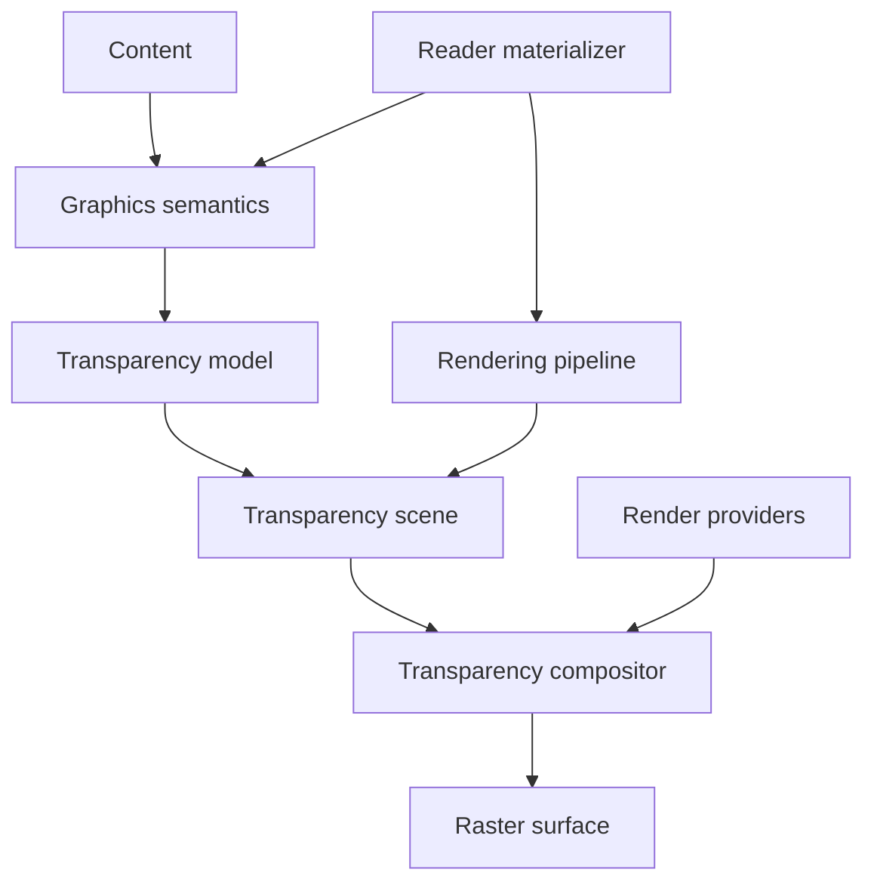
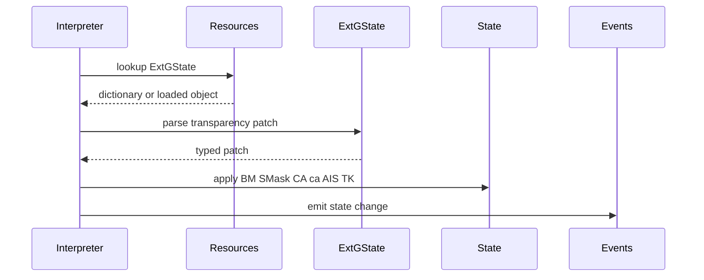
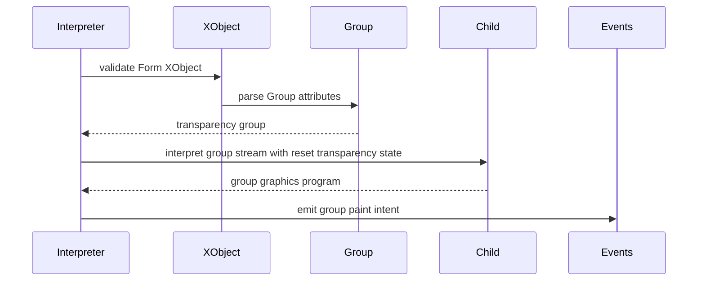
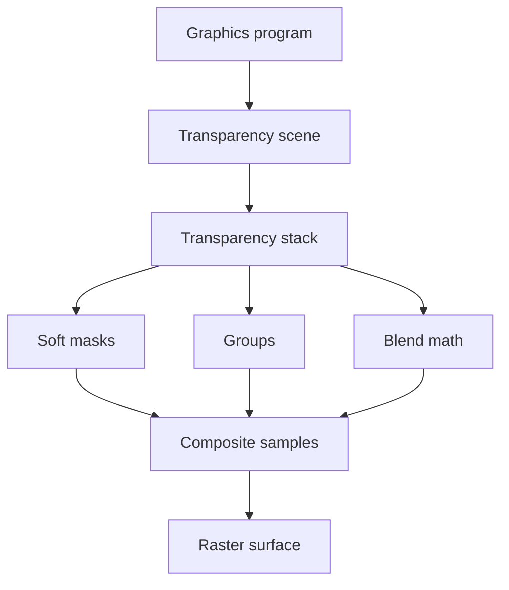

# Design Document

## Overview

This feature delivers ISO 32000-2 clause 11 transparency semantics across the existing PDF pipeline. It turns raw transparency graphics-state entries, group dictionaries, soft masks, blend modes, and transparency-related rendering rules into typed contracts that can be interpreted and rendered deterministically.

Library users gain inspectable transparency metadata in graphics programs, while rendering callers gain a transparency compositor that consumes existing graphics events and writes alpha-aware raster output. The design preserves current package ownership: `content` parses syntax, `graphics` owns loaded PDF graphics semantics, `rendering` owns raster compositing, and `reader` owns indirect object materialization.

### Goals
- Represent standard blend modes, alpha constants, alpha-is-shape, soft masks, transparency groups, page groups, and transparency-related colour policies with explicit MoonBit types.
- Validate PDF transparency representations from ExtGState dictionaries, soft-mask dictionaries, image dictionaries, Form XObject group dictionaries, Pattern and Shading integration points, and page Group dictionaries.
- Provide a rendering compositor for basic object compositing, isolated groups, non-isolated groups, knockout groups, soft masks, spot colours, overprint compatibility, and rendering parameter selection.
- Keep external colour management, PDF function execution, font execution, and document object loading outside the wrong packages.

### Non-Goals
- PDF writing or content-stream serialization.
- Adding external graphics, PDF, image, ICC, or colour-management dependencies.
- Moving indirect object loading into `src/graphics` or `src/rendering`.
- Implementing a complete CIE or ICC colour management module in this spec.
- Implementing PDF function execution, tint transforms, glyph shape extraction, or JPEG/JPEG2000/JBIG2/CCITT decoding in this spec.
- Implementing Annex Q page transparency detection as a mandatory API.

## Boundary Commitments

### This Spec Owns
- The typed transparency graphics-state contract for `BM`, `SMask`, `CA`, `ca`, `AIS`, and `TK`.
- Standard blend-mode parsing and blend functions for PDF 1.4 through PDF 2.0 compatibility.
- Structural transparency group attributes for Form XObjects and page groups, including `CS`, `I`, and `K`.
- Structural soft-mask models for graphics-state soft-mask dictionaries, soft-mask images, JPX embedded mask metadata, `BC`, `TR`, and matte information.
- Transparency scene construction from existing `GraphicsProgram` events.
- Raster compositing of transparency stacks, groups, masks, alpha constants, shape, opacity, spot components, and overprint compatibility inside `src/rendering`.
- Reader-side materialization for indirect ExtGState, soft-mask, transparency group, page Group, Pattern, Shading, and XObject resources needed by transparency interpretation.

### Out of Boundary
- `src/content` remains authoritative for content instruction syntax, operands, resource dictionary categories, inline image parsing, and operator recognition.
- `src/graphics` remains device-independent and does not allocate raster surfaces, perform scan conversion, or resolve indirect objects.
- `src/rendering` does not open PDF files, traverse page trees, or load indirect references.
- `src/reader` does not evaluate blend formulas, colour conversions, or final pixels.
- Colour conversion providers, PDF function providers, and glyph mask providers remain runtime contracts rather than new package dependencies.
- Annotation appearance processing, optional-content UI controls, and external PDF import remain outside this spec.

### Allowed Dependencies
- `src/graphics` may depend on `objects`, `content`, `filters`, and `moonbitlang/core/math`.
- `src/rendering` may depend on `objects`, `content`, `filters`, `graphics`, `text`, and `moonbitlang/core/math`.
- `src/reader` may depend on `graphics`, `rendering`, and existing parser/filter/content packages.
- `graphics` and `rendering` must not import `reader`.
- No external dependencies are introduced.

### Revalidation Triggers
- Any public shape change to `GraphicsState`, `GraphicsEvent`, `GraphicsProgram`, `ColourSpace`, `ColourValue`, image descriptors, pattern resources, shading resources, or XObject events.
- Any public shape change to transparency models such as `BlendMode`, `SoftMaskSource`, `TransparencyGroup`, `TransparencyPaint`, or compositor provider contracts.
- Any change that makes `graphics` or `rendering` load indirect objects or import `reader`.
- Any change to ExtGState parsing, image soft-mask validation, Form XObject group parsing, or page Group materialization.
- Any new external dependency or provider requirement.
- Any change that moves colour conversion, transfer-function execution, tint-transform execution, or PDF function evaluation into the wrong package.

## Architecture

### Existing Architecture Analysis

The repository already has typed PDF object parsing, content-stream parsing, graphics interpretation, colour-space validation, image/XObject/pattern/shading models, and a minimal rendering package. `GraphicsState` stores raw or scalar transparency state (`blend_mode`, `soft_mask`, `alpha_stroking`, `alpha_nonstroking`, `alpha_source`, and `text_knockout`), while `ExtGStatePatch` parses these entries loosely. `FormGroupInfo` preserves raw group dictionaries without identifying transparency groups, and `ImageDescriptor` preserves soft-mask entries without enforcing soft-mask image restrictions.

The rendering design explicitly leaves general transparency compositing to this feature. Therefore this design extends `graphics` for typed PDF representation, `rendering` for compositing behavior, and `reader` for resource materialization. It does not change content syntax ownership or parser behavior.

### Architecture Pattern & Boundary Map



**Architecture Integration**:
- Selected pattern: split semantic model plus downstream compositor.
- Domain boundaries: `graphics` validates loaded transparency PDF structures; `rendering` evaluates pixels and samples; `reader` materializes indirect resources.
- Existing patterns preserved: package-per-directory layout, standard-library-only implementation, `pub(all)` inspectable models, `suberror` diagnostics, package-local tests, and `moon info` API review.
- New components rationale: blend modes, soft masks, transparency groups, scene construction, colour/spot policy, overprint policy, and rendering parameter selection have separate contracts and tests.
- Steering compliance: no external dependencies, lazy object loading stays in `reader`, and each layer remains independently testable.

### Technology Stack

| Layer | Choice / Version | Role in Feature | Notes |
|-------|------------------|-----------------|-------|
| Language | MoonBit project toolchain | Typed transparency models and compositor | Use `///|`, `pub(all)`, and `suberror` patterns |
| Object model | `trkbt10/pdf/src/objects` | Dictionaries, streams, names, refs, arrays, raw function objects | No object-model ownership change |
| Content model | `trkbt10/pdf/src/content` | Parsed graphics operators and resources | No syntax parser change |
| Graphics runtime | `trkbt10/pdf/src/graphics` | Transparency state, dictionaries, groups, events | Owns device-independent semantics |
| Rendering runtime | `trkbt10/pdf/src/rendering` | Transparency scene, blend math, raster compositing | Owns device-dependent output |
| Reader integration | `trkbt10/pdf/src/reader` | Indirect resource materialization and page Group access | Reader imports graphics/rendering |

## File Structure Plan

### Directory Structure

```text
src/
├── graphics/
│   ├── blend_mode.mbt                    # BlendMode enum, parsing, separable and white-preserving classification
│   ├── transparency_state.mbt            # Alpha constants, AIS, typed soft-mask state, text knockout helpers
│   ├── transparency_group.mbt            # TransparencyGroup, page group attributes, group colour-space validation
│   ├── soft_mask.mbt                     # SoftMaskSource, soft-mask dictionaries, soft-mask image restrictions
│   ├── ext_gstate.mbt                    # Replace raw BM and SMask patch fields with typed transparency fields
│   ├── state.mbt                         # Store typed transparency state in GraphicsState
│   ├── form_xobject.mbt                  # Parse Group subtype Transparency into TransparencyGroup metadata
│   ├── image.mbt                         # Validate soft-mask image and matte metadata with transparency rules
│   ├── interpreter.mbt                   # Emit transparency-aware state and group events
│   ├── blend_mode_wbtest.mbt             # Blend mode parsing and classification tests
│   ├── transparency_state_wbtest.mbt     # ExtGState alpha, AIS, SMask, and TK tests
│   ├── transparency_group_wbtest.mbt     # Group dictionary and page group validation tests
│   ├── soft_mask_wbtest.mbt              # Soft-mask dictionary and soft-mask image tests
│   └── interpreter_test.mbt              # Public graphics event regression tests
├── rendering/
│   ├── transparency_scene.mbt            # TransparencySceneBuilder over GraphicsProgram events
│   ├── transparency_math.mbt             # Union, safe divide, alpha, shape, opacity, and vector helpers
│   ├── transparency_blend.mbt            # Standard blend-mode function implementations
│   ├── transparency_compositor.mbt       # Stack, group, knockout, isolated, page-group compositing
│   ├── transparency_mask.mbt             # Soft-mask alpha and luminosity evaluation hooks
│   ├── transparency_colour.mbt           # Group colour-space inheritance and conversion provider dispatch
│   ├── transparency_overprint.mbt        # Spot colour and compatible overprint blend policy
│   ├── transparency_rendering_params.mbt # Halftone, transfer, RI, BPC, BG, and UCR selection policy
│   ├── resources.mbt                     # Extend renderer providers for colour and function execution
│   ├── renderer.mbt                      # Integrate transparency compositor into page rendering
│   ├── transparency_math_wbtest.mbt      # Formula edge cases, including 0 divided by 0
│   ├── transparency_blend_wbtest.mbt     # All standard separable and non-separable blend modes
│   ├── transparency_group_wbtest.mbt     # Group recursion, isolated, non-isolated, knockout behavior
│   ├── transparency_mask_wbtest.mbt      # Alpha and luminosity mask evaluation paths
│   ├── transparency_overprint_wbtest.mbt # Table 146 compatible overprint behavior
│   └── renderer_test.mbt                 # Public transparency rendering scenarios
└── reader/
    ├── transparency.mbt                  # Page Group and transparency resource materialization helpers
    ├── xobjects.mbt                      # Materialize ExtGState, ColorSpace, Pattern, Shading, and soft-mask refs
    ├── graphics.mbt                      # Add transparency-aware graphics options if needed
    ├── rendering.mbt                     # Pass materialized transparency inputs to rendering
    ├── transparency_wbtest.mbt           # Indirect soft masks, group XObjects, page Group loading
    └── pkg.generated.mbti                # Regenerated when public reader APIs change
```

### Modified Files
- `src/graphics/moon.pkg` - Keep existing imports and add no external dependency.
- `src/graphics/error.mbt` - Add `InvalidTransparency` or reuse precise existing errors when the current categories are sufficient.
- `src/graphics/ext_gstate.mbt` - Type `BM`, `SMask`, `CA`, `ca`, `AIS`, and `TK` rather than leaving them raw.
- `src/graphics/state.mbt` - Store typed transparency state and preserve copy/save/restore behavior.
- `src/graphics/form_xobject.mbt` - Replace raw-only group metadata with parsed transparency group metadata for subtype `Transparency`.
- `src/graphics/image.mbt` - Validate soft-mask image restrictions, `SMaskInData`, and `Matte` metadata.
- `src/graphics/interpreter.mbt` - Emit state changes and Form XObject events carrying typed transparency group information.
- `src/rendering/moon.pkg` - Add imports for `graphics`, `content`, `filters`, `text`, and `math` as required by existing rendering design.
- `src/rendering/renderer.mbt` - Route rendering through the transparency scene and compositor.
- `src/reader/xobjects.mbt` - Materialize transparency-relevant resource categories in addition to XObject and Properties.
- `src/reader/document_error.mbt` - Add or reuse graphics/rendering wrappers for transparency failures.
- `src/graphics/pkg.generated.mbti`, `src/rendering/pkg.generated.mbti`, and `src/reader/pkg.generated.mbti` - Regenerated through `moon info`.

### Existing Files Consumed Without Modification
- `src/content/operator.mbt` - Existing `gs`, `Do`, colour, path, image, text, and shading operator recognition.
- `src/content/resources.mbt` - Existing `ExtGState`, `ColorSpace`, `Pattern`, `Shading`, `XObject`, and `Properties` resource lookup.
- `src/graphics/colour_space.mbt` and `src/graphics/colour_state.mbt` - Existing colour-space and colour-value contracts.
- `src/graphics/pattern.mbt` and `src/graphics/pattern_shading.mbt` - Existing pattern and shading resource models.
- `src/graphics/xobject.mbt` - Existing XObject resource dispatch.
- `src/rendering/device.mbt` and `src/rendering/surface.mbt` - Existing raster device and surface primitives.

### Component to File Mapping

| Component | Primary Files |
|-----------|---------------|
| BlendModeModel | `src/graphics/blend_mode.mbt`, `src/rendering/transparency_blend.mbt` |
| TransparencyParameterModel | `src/graphics/transparency_state.mbt`, `src/graphics/ext_gstate.mbt`, `src/graphics/state.mbt` |
| TransparencyGroupModel | `src/graphics/transparency_group.mbt`, `src/graphics/form_xobject.mbt` |
| SoftMaskModel | `src/graphics/soft_mask.mbt`, `src/graphics/image.mbt`, `src/rendering/transparency_mask.mbt` |
| TransparencySceneBuilder | `src/rendering/transparency_scene.mbt`, `src/rendering/renderer.mbt` |
| TransparencyCompositor | `src/rendering/transparency_compositor.mbt`, `src/rendering/transparency_math.mbt` |
| TransparencyColourPolicy | `src/rendering/transparency_colour.mbt`, `src/graphics/colour_space.mbt` |
| SpotOverprintPolicy | `src/rendering/transparency_overprint.mbt` |
| RenderingParameterPolicy | `src/rendering/transparency_rendering_params.mbt`, `src/rendering/renderer.mbt` |
| ReaderTransparencyBridge | `src/reader/transparency.mbt`, `src/reader/xobjects.mbt`, `src/reader/graphics.mbt`, `src/reader/rendering.mbt` |

## System Flows

### ExtGState Transparency Application



`graphics` accepts only direct or reader-materialized dictionaries. Indirect references remain a reader responsibility.

### Transparency Group Invocation



The group stream is still interpreted device-independently. Actual group compositing is deferred to `rendering`.

### Transparency Compositing



The compositor works on bounded raster surfaces and provider-supplied colour/function results. Unsupported provider work returns rendering errors rather than approximating silently.

## Requirements Traceability

| Requirement | Summary | Components | Interfaces | Flows |
|-------------|---------|------------|------------|-------|
| 1 | Clause 11 transparency model scope | BlendModeModel, TransparencyCompositor, TransparencyGroupModel | `BlendMode`, `TransparencySample` | Transparency Compositing |
| 2 | Stack, alpha, group, and soft-mask overview | TransparencySceneBuilder, TransparencyCompositor, SoftMaskModel | `TransparencyScene`, `TransparencyPaint` | Transparency Compositing |
| 2.1 | Basic compositing scope | TransparencyCompositor | `composite_object` | Transparency Compositing |
| 2.2 | Safe notation and undefined values | TransparencyCompositor | `safe_ratio`, `union_alpha` | Transparency Compositing |
| 2.3 | Basic compositing formula | TransparencyCompositor, BlendModeModel | `composite_object`, `blend` | Transparency Compositing |
| 2.4 | Blending colour space | TransparencyColourPolicy | `resolve_group_colour_space` | Transparency Compositing |
| 2.5 | Blend mode selection | BlendModeModel, TransparencyParameterModel | `parse_blend_mode` | ExtGState Transparency Application |
| 2.6 | Separable blend modes | BlendModeModel | `blend_separable` | Transparency Compositing |
| 2.7 | Non-separable blend modes | BlendModeModel | `blend_nonseparable` | Transparency Compositing |
| 2.8 | Alpha interpretation | TransparencyCompositor | `TransparencySample` | Transparency Compositing |
| 2.9 | Shape and opacity general rules | TransparencyParameterModel, TransparencyCompositor | `TransparencyInputs` | Transparency Compositing |
| 2.10 | Source shape and opacity | TransparencySceneBuilder, SoftMaskModel | `source_inputs_for_event` | Transparency Compositing |
| 2.11 | Result shape and opacity | TransparencyCompositor | `composite_object` | Transparency Compositing |
| 2.12 | Basic computation summary | TransparencyCompositor | `composite_object` | Transparency Compositing |
| 2.13 | Formula ordering and alpha result | TransparencyCompositor | `safe_ratio`, `union_alpha` | Transparency Compositing |
| 2.14 | Transparency group general rules | TransparencyGroupModel, TransparencyCompositor | `TransparencyGroup` | Transparency Group Invocation |
| 2.15 | Group notation | TransparencyCompositor | `GroupStackFrame` | Transparency Compositing |
| 2.16 | Group structure and backdrops | TransparencySceneBuilder, TransparencyCompositor | `GroupBackdrop` | Transparency Group Invocation |
| 2.17 | Group compositing formulas | TransparencyCompositor | `composite_group` | Transparency Compositing |
| 2.18 | Isolated groups | TransparencyGroupModel, TransparencyCompositor | `isolated` | Transparency Compositing |
| 2.19 | Knockout groups | TransparencyGroupModel, TransparencyCompositor | `knockout` | Transparency Compositing |
| 2.20 | Page group | ReaderTransparencyBridge, TransparencyGroupModel, TransparencyCompositor | `page_transparency_group` | Transparency Compositing |
| 2.21 | Group computation summary | TransparencyCompositor | `composite_group` | Transparency Compositing |
| 2.22 | Soft mask general rules | SoftMaskModel, TransparencyParameterModel | `SoftMaskSource` | ExtGState Transparency Application |
| 2.23 | Alpha soft masks | SoftMaskModel, TransparencyCompositor | `evaluate_alpha_mask` | Transparency Compositing |
| 2.24 | Luminosity soft masks | SoftMaskModel, TransparencyColourPolicy | `evaluate_luminosity_mask` | Transparency Compositing |
| 2.25 | PDF transparency representation | TransparencyParameterModel, TransparencyGroupModel, SoftMaskModel | state and dictionary parsers | ExtGState Transparency Application |
| 2.26 | Source and backdrop colours | TransparencySceneBuilder, TransparencyColourPolicy | `TransparencyPaint` | Transparency Compositing |
| 2.27 | Blending colour space and blend mode | BlendModeModel, TransparencyColourPolicy | `parse_blend_mode`, `resolve_group_colour_space` | ExtGState Transparency Application |
| 2.28 | Shape and opacity representation | TransparencyParameterModel, SoftMaskModel | `TransparencyInputs` | Transparency Compositing |
| 2.29 | Object shape and opacity | TransparencySceneBuilder | `source_inputs_for_event` | Transparency Compositing |
| 2.30 | Mask shape and opacity | SoftMaskModel, TransparencyParameterModel | `SoftMaskSource`, `alpha_is_shape` | ExtGState Transparency Application |
| 2.31 | Constant shape and opacity | TransparencyParameterModel | `alpha_stroking`, `alpha_nonstroking` | ExtGState Transparency Application |
| 2.32 | Soft-mask dictionaries | SoftMaskModel, ReaderTransparencyBridge | `parse_soft_mask_dictionary` | ExtGState Transparency Application |
| 2.33 | Soft-mask images | SoftMaskModel | `validate_soft_mask_image` | Transparency Compositing |
| 2.34 | Transparency group XObjects | TransparencyGroupModel, ReaderTransparencyBridge | `parse_transparency_group` | Transparency Group Invocation |
| 2.35 | Patterns and transparency | TransparencySceneBuilder, TransparencyGroupModel | pattern paint intent | Transparency Compositing |
| 2.36 | Colour and rendering issue scope | TransparencyColourPolicy, RenderingParameterPolicy | provider contracts | Transparency Compositing |
| 2.37 | Transparency group colour spaces | TransparencyColourPolicy | `resolve_group_colour_space` | Transparency Compositing |
| 2.38 | Spot colours | TransparencyColourPolicy, SpotOverprintPolicy | `SpotComponentSet` | Transparency Compositing |
| 2.39 | Overprinting general rules | SpotOverprintPolicy | `overprint_decision` | Transparency Compositing |
| 2.40 | Blend modes and overprinting | SpotOverprintPolicy, BlendModeModel | `spot_blend_mode` | Transparency Compositing |
| 2.41 | Opaque overprint compatibility | SpotOverprintPolicy | `compatible_overprint_blend` | Transparency Compositing |
| 2.42 | Combined fill and stroke considerations | TransparencySceneBuilder, SpotOverprintPolicy | `CombinedPaintGroup` | Transparency Compositing |
| 2.43 | Overprinting summary behavior | SpotOverprintPolicy | `overprint_decision` | Transparency Compositing |
| 2.44 | Rendering parameter categories | RenderingParameterPolicy | `TransparencyRenderingParams` | Transparency Compositing |
| 2.45 | Halftone and transfer selection | RenderingParameterPolicy, TransparencySceneBuilder | `topmost_opaque_paint` | Transparency Compositing |
| 2.46 | Rendering intent, BPC, BG, and UCR conversions | RenderingParameterPolicy, TransparencyColourPolicy | colour conversion provider context | Transparency Compositing |

## Components and Interfaces

| Component | Domain | Intent | Req Coverage | Key Dependencies | Contracts |
|-----------|--------|--------|--------------|------------------|-----------|
| BlendModeModel | Graphics and rendering | Parse, classify, and evaluate standard blend modes | 2.3, 2.5, 2.6, 2.7, 2.40 | `objects` P0, math P0 | Service, State |
| TransparencyParameterModel | Graphics state | Own typed ExtGState transparency parameters | 2.22, 2.25, 2.27, 2.28, 2.30, 2.31 | `content` P0, `objects` P0 | Service, State |
| TransparencyGroupModel | Graphics resources | Validate page and Form XObject transparency group dictionaries | 2.14-2.21, 2.34, 2.35, 2.37 | FormXObject P0, ColourSpace P0 | Service, State |
| SoftMaskModel | Graphics and rendering | Model and evaluate graphics-state, image, alpha, and luminosity masks | 2.22-2.24, 2.30, 2.32, 2.33 | XObjects P0, filters P1, providers P1 | Service, State |
| TransparencySceneBuilder | Rendering input | Convert graphics events into transparency paint stack entries | 2, 2.10, 2.16, 2.26, 2.29, 2.35, 2.42, 2.45 | `graphics` P0 | Service |
| TransparencyCompositor | Rendering core | Evaluate object, group, page, and soft-mask compositing formulas | 1, 2, 2.1-2.24 | Scene P0, BlendModeModel P0, providers P1 | Service, Batch |
| TransparencyColourPolicy | Rendering colour | Resolve blending colour spaces, spot behaviour, and conversion dispatch | 2.4, 2.24, 2.26, 2.27, 2.36-2.38, 2.46 | ColourSpace P0, providers P0 | Service |
| SpotOverprintPolicy | Rendering colourants | Apply spot colour and compatible overprint rules | 2.38-2.43 | BlendModeModel P0, Rendering device P0 | Service |
| RenderingParameterPolicy | Rendering output | Select halftone, transfer, RI, BPC, BG, and UCR context under transparency | 2.44-2.46 | Rendering providers P0 | Service |
| ReaderTransparencyBridge | Reader integration | Materialize indirect transparency resources and page Group metadata | 2.20, 2.32, 2.34, 2.35 | Object loader P0, graphics P0 | Service |

### Graphics Semantic Layer

#### BlendModeModel

| Field | Detail |
|-------|--------|
| Intent | Provide the canonical blend-mode vocabulary and classification used by graphics state and rendering math. |
| Requirements | 2.3, 2.5, 2.6, 2.7, 2.40 |

**Responsibilities & Constraints**
- Parse `BM` from a name or deprecated array of names, selecting the first recognized mode and defaulting to Normal when none are recognized.
- Treat Compatible as Normal for PDF 2.0 compatibility.
- Classify modes as separable, non-separable, and white-preserving for spot colour policy.
- Keep numeric blend execution in `rendering`; `graphics` owns names and classifications.

**Dependencies**
- Inbound: TransparencyParameterModel - parses ExtGState `BM` (P0).
- Inbound: TransparencyCompositor - evaluates blend functions (P0).
- Outbound: `objects` - reads names and arrays (P0).
- External: none.

**Contracts**: Service [x] / API [ ] / Event [ ] / Batch [ ] / State [x]

##### Service Interface
```moonbit
pub(all) enum BlendMode { Normal; Multiply; Screen; Overlay; Darken; Lighten; ColorDodge; ColorBurn; HardLight; SoftLight; Difference; Exclusion; Hue; Saturation; Color; Luminosity }

pub fn parse_blend_mode(object : @objects.PdfObject, offset : Int64) -> BlendMode raise PdfGraphicsError
pub fn BlendMode::is_separable(self : BlendMode) -> Bool
pub fn BlendMode::is_white_preserving(self : BlendMode) -> Bool
```
- Preconditions: The input object is an ExtGState `BM` value.
- Postconditions: Unknown arrays return Normal when no recognized mode exists.
- Invariants: Compatible is not exposed as a distinct rendering behavior.

#### TransparencyParameterModel

| Field | Detail |
|-------|--------|
| Intent | Own transparency-related graphics-state parameters as typed state. |
| Requirements | 2.22, 2.25, 2.27, 2.28, 2.30, 2.31 |

**Responsibilities & Constraints**
- Replace raw `blend_mode` and `soft_mask` state fields with `BlendMode` and `SoftMaskSource`.
- Validate `CA` and `ca` as clamped or rejected alpha constants according to the existing project error policy selected during implementation.
- Preserve `AIS` as the switch that routes soft masks and alpha constants to shape or opacity.
- Preserve `TK` for text knockout and downstream text rendering.
- Reset blend mode, alpha constants, and soft mask when entering a transparency group stream.

**Dependencies**
- Inbound: GraphicsInterpreter - applies ExtGState patches (P0).
- Outbound: BlendModeModel - parses blend mode values (P0).
- Outbound: SoftMaskModel - parses `SMask` values (P0).

**Contracts**: Service [x] / API [ ] / Event [ ] / Batch [ ] / State [x]

##### Service Interface
```moonbit
pub(all) struct TransparencyState {
  blend_mode : BlendMode
  soft_mask : SoftMaskSource
  alpha_stroking : Double
  alpha_nonstroking : Double
  alpha_is_shape : Bool
  text_knockout : Bool
}

pub fn TransparencyState::initial() -> TransparencyState
pub fn parse_transparency_ext_gstate(dictionary : @objects.PdfDictionary, offset : Int64) -> TransparencyStatePatch raise PdfGraphicsError
```
- Preconditions: Indirect ExtGState references are materialized by `reader`.
- Postconditions: `None` soft mask removes the current mask.
- Invariants: Save/restore copies transparency state exactly with the graphics state stack.

#### TransparencyGroupModel

| Field | Detail |
|-------|--------|
| Intent | Represent transparency groups for Form XObjects, page groups, and implicit pattern groups. |
| Requirements | 2.14, 2.15, 2.16, 2.17, 2.18, 2.19, 2.20, 2.21, 2.34, 2.35, 2.37 |

**Responsibilities & Constraints**
- Parse group attributes only when `S` is `Transparency`.
- Validate `CS` as an allowed blending colour space and reject Pattern, Indexed, Separation, DeviceN, Lab, and unsuitable ICC profile shapes where the existing colour model can prove invalidity.
- Track isolated and knockout flags with PDF defaults.
- Identify page groups separately because page groups are effectively isolated when imposed on output media.
- Preserve non-transparency group dictionaries as ordinary Form XObject metadata.

**Dependencies**
- Inbound: Form XObject validation - parses `Group` entries (P0).
- Inbound: ReaderTransparencyBridge - parses page Group entries (P0).
- Outbound: ColourSpaceModel - parses group colour spaces (P0).

**Contracts**: Service [x] / API [ ] / Event [ ] / Batch [ ] / State [x]

##### Service Interface
```moonbit
pub(all) enum TransparencyGroupKind { FormGroup; PageGroup; PatternGroup }

pub(all) struct TransparencyGroup {
  kind : TransparencyGroupKind
  colour_space : ColourSpace?
  isolated : Bool
  knockout : Bool
}

pub fn parse_transparency_group(dict : @objects.PdfDictionary, kind : TransparencyGroupKind, defaults : ColourDefaults, offset : Int64) -> TransparencyGroup? raise PdfGraphicsError
```
- Preconditions: Group dictionaries are direct or reader-materialized.
- Postconditions: Non-Transparency group subtypes return `None`.
- Invariants: `kind == PageGroup` applies page-group isolation rules in rendering.

#### SoftMaskModel

| Field | Detail |
|-------|--------|
| Intent | Represent soft-mask sources and validate mask-specific dictionary and image restrictions. |
| Requirements | 2.22, 2.23, 2.24, 2.30, 2.32, 2.33 |

**Responsibilities & Constraints**
- Parse graphics-state `SMask` as `None`, direct soft-mask dictionary, or unresolved reference.
- Validate soft-mask dictionary `Type`, `S`, `G`, `BC`, and `TR` structure.
- Validate soft-mask image restrictions: DeviceGray colour space, no nested masks, no image mask, default decode, optional Matte length against parent colour components.
- Preserve transfer functions as raw objects or Identity because function execution is a rendering provider responsibility.
- Record mask coordinate-system establishment at the `gs` operator point.

**Dependencies**
- Inbound: TransparencyParameterModel - current soft mask state (P0).
- Inbound: TransparencyCompositor - evaluates mask values (P0).
- Outbound: TransparencyGroupModel - validates the `G` group XObject (P0).
- Outbound: Rendering providers - execute transfer functions and luminosity conversion where required (P1).

**Contracts**: Service [x] / API [ ] / Event [ ] / Batch [ ] / State [x]

##### Service Interface
```moonbit
pub(all) enum SoftMaskKind { NoSoftMask; AlphaMask; LuminosityMask; ImageSoftMask; EmbeddedImageSoftMask; UnresolvedSoftMask(@objects.ObjectId) }

pub(all) struct SoftMaskSource {
  kind : SoftMaskKind
  group : FormXObject?
  backdrop_colour : Array[Double]
  transfer : @objects.PdfObject?
  matrix_at_establish : GraphicsMatrix?
}

pub fn parse_soft_mask_object(object : @objects.PdfObject, state : GraphicsState, offset : Int64) -> SoftMaskSource raise PdfGraphicsError
pub fn validate_soft_mask_image(parent : ImageDescriptor, mask : ImageDescriptor, matte : @objects.PdfObject?, offset : Int64) -> Unit raise PdfGraphicsError
```
- Preconditions: Parent image descriptors are validated before subsidiary mask validation.
- Postconditions: Image `SMask` and `SMaskInData` override graphics-state soft masks for that image object only.
- Invariants: A soft mask provides either shape or opacity according to `alpha_is_shape`, never both.

### Rendering Layer

#### TransparencySceneBuilder

| Field | Detail |
|-------|--------|
| Intent | Convert existing graphics events into a transparency-aware stack of paint entries. |
| Requirements | 2, 2.10, 2.16, 2.26, 2.29, 2.35, 2.42, 2.45 |

**Responsibilities & Constraints**
- Treat each path paint, image paint, inline image, shading paint, form group, pattern paint, and text paint input as an elementary or group paint entry.
- Preserve event order as stack order.
- Capture source colour, source shape source, opacity source, alpha constants, soft mask, blend mode, overprint flags, rendering intent, black point compensation, and deferred rendering parameters.
- Represent combined fill and stroke operations as implicit groups when required by transparency/overprint rules.

**Dependencies**
- Inbound: Renderer - requests scene construction (P0).
- Outbound: `graphics` - consumes `GraphicsProgram` and event snapshots (P0).
- Outbound: `text` - consumes supplied glyph paint events when available (P1).

**Contracts**: Service [x] / API [ ] / Event [ ] / Batch [ ] / State [ ]

##### Service Interface
```moonbit
pub fn build_transparency_scene(program : @graphics.GraphicsProgram, inputs : TransparencySceneInputs) -> TransparencyScene raise PdfRenderingError
```
- Preconditions: Indirect resources required for rendering have been materialized by `reader` or supplied through inputs.
- Postconditions: Scene entries preserve PDF paint order.
- Invariants: Scene construction does not allocate the destination raster surface.

#### TransparencyCompositor

| Field | Detail |
|-------|--------|
| Intent | Evaluate compositing formulas for objects, groups, soft masks, and page output. |
| Requirements | 1, 2, 2.1, 2.2, 2.3, 2.8, 2.9, 2.10, 2.11, 2.12, 2.13, 2.14, 2.15, 2.16, 2.17, 2.18, 2.19, 2.20, 2.21, 2.22, 2.23, 2.24 |

**Responsibilities & Constraints**
- Implement `Union(b, s) = b + s - b * s`.
- Adopt the specified `0 / 0 = 0` convention and prevent divide-by-zero failures.
- Composite elementary objects with shape, opacity, masks, constants, and blend mode.
- Composite non-isolated, isolated, knockout, and non-knockout groups.
- Composite page groups against caller-supplied medium/backdrop colour.
- Keep group result colour, shape, and alpha separate where knockout and soft masks require it.

**Dependencies**
- Inbound: Renderer - executes page or form rendering (P0).
- Outbound: BlendModeModel - blend functions (P0).
- Outbound: SoftMaskModel - mask values (P0).
- Outbound: RasterSurface - writes final samples (P0).

**Contracts**: Service [x] / API [ ] / Event [ ] / Batch [x] / State [ ]

##### Service Interface
```moonbit
pub(all) struct TransparencySample {
  colour : TransparencyColour
  shape : Double
  alpha : Double
}

pub fn composite_scene(scene : TransparencyScene, target : RasterSurface, providers : TransparencyProviders) -> Unit raise PdfRenderingError
pub fn composite_group(backdrop : TransparencySample, group : TransparencyGroupPaint, providers : TransparencyProviders) -> TransparencySample raise PdfRenderingError
```
- Preconditions: Source and backdrop colours are expressed in the selected blending colour space.
- Postconditions: Output sample components are clamped to the valid component range.
- Invariants: Backdrop contribution is removed exactly once for group results.

#### TransparencyColourPolicy

| Field | Detail |
|-------|--------|
| Intent | Resolve blending colour spaces and dispatch required colour conversions. |
| Requirements | 2.4, 2.24, 2.26, 2.27, 2.36, 2.37, 2.38, 2.46 |

**Responsibilities & Constraints**
- Resolve page, parent, isolated group, non-isolated group, and soft-mask group colour spaces.
- Apply default device colour-space remapping from existing `ColourDefaults`.
- Substitute nearest compatible CIE-based ancestor where required for compositing.
- Keep spot components separate when available, or convert them to alternates in soft masks and unavailable spot contexts.
- Dispatch CIE/ICC, DeviceRGB to DeviceCMYK, BG, UCR, and luminosity conversions to renderer providers.

**Dependencies**
- Inbound: TransparencyCompositor - requests normalized colours (P0).
- Outbound: `graphics.ColourSpace` - structural colour-space model (P0).
- External: renderer colour providers - conversion execution (P0 for required conversions).

**Contracts**: Service [x] / API [ ] / Event [ ] / Batch [ ] / State [ ]

##### Service Interface
```moonbit
pub fn resolve_group_colour_space(group : @graphics.TransparencyGroup, parent : TransparencyColourContext, providers : TransparencyProviders) -> TransparencyColourContext raise PdfRenderingError
pub fn convert_for_compositing(source : TransparencyColour, target : TransparencyColourContext, params : ColourConversionParams, providers : TransparencyProviders) -> TransparencyColour raise PdfRenderingError
```
- Preconditions: Group colour-space dictionaries have been structurally validated by `graphics`.
- Postconditions: Process components and spot components are represented separately.
- Invariants: Spot components are not converted through group colour spaces unless the spec requires alternate substitution.

#### SpotOverprintPolicy

| Field | Detail |
|-------|--------|
| Intent | Apply spot colour and transparent overprint compatibility behavior. |
| Requirements | 2.38, 2.39, 2.40, 2.41, 2.42, 2.43 |

**Responsibilities & Constraints**
- Maintain process and spot component availability for each transparency group.
- Substitute Normal for spot colours when the current blend mode is not separable or not white-preserving.
- Apply compatible overprint behavior for elementary objects and combined fill/stroke implicit groups.
- Treat transparency group objects as painting all components, with compatible overprint unavailable.

**Dependencies**
- Inbound: TransparencyCompositor - asks for component blend policy (P0).
- Outbound: BlendModeModel - separable and white-preserving classification (P0).
- Outbound: RasterDevice - process and spot component availability (P0).

**Contracts**: Service [x] / API [ ] / Event [ ] / Batch [ ] / State [ ]

##### Service Interface
```moonbit
pub fn overprint_decision(paint : TransparencyPaint, component : ColourComponent, backdrop : TransparencySample) -> OverprintDecision
pub fn compatible_overprint_blend(paint : TransparencyPaint, component : ColourComponent) -> BlendMode
```
- Preconditions: Paint entries identify whether they are elementary objects or group objects.
- Postconditions: Component policy follows Table 146 semantics.
- Invariants: Blend functions operate on additive values; subtractive values are complemented before and after blend execution.

#### RenderingParameterPolicy

| Field | Detail |
|-------|--------|
| Intent | Select rendering parameters whose meaning changes under transparency. |
| Requirements | 2.44, 2.45, 2.46 |

**Responsibilities & Constraints**
- Track topmost fully opaque elementary object per sample for halftone and transfer-function selection.
- Ignore group-object rendering parameters for halftone and transfer selection.
- Use default page halftone and transfer functions for never-painted or non-opaque regions.
- Capture rendering intent, black point compensation, black generation, and undercolour removal at the painting or group invocation point where conversion occurs.

**Dependencies**
- Inbound: TransparencyCompositor - requests per-sample rendering parameters (P0).
- Outbound: Rendering providers - execute transfer functions, halftones, BG, and UCR (P0).

**Contracts**: Service [x] / API [ ] / Event [ ] / Batch [ ] / State [ ]

##### Service Interface
```moonbit
pub fn rendering_params_for_sample(stack : TransparencyStackTrace, component : ColourComponent) -> TransparencyRenderingParams
pub fn conversion_params_for_paint(paint : TransparencyPaint) -> ColourConversionParams
```
- Preconditions: Paint entries carry state snapshots from the time of painting or group invocation.
- Postconditions: Fully opaque eligibility is evaluated per component when overprinting is enabled.
- Invariants: Rendering intent and BPC are selected at colour conversion time, not final raster write time.

### Reader Integration Layer

#### ReaderTransparencyBridge

| Field | Detail |
|-------|--------|
| Intent | Materialize indirect resources needed by transparency while preserving reader ownership. |
| Requirements | 2.20, 2.32, 2.34, 2.35 |

**Responsibilities & Constraints**
- Load page Group dictionaries and pass them to `graphics` validation.
- Materialize ExtGState dictionaries, soft-mask group XObjects, Form XObject transparency groups, and nested resources needed by transparency.
- Keep cycle detection for recursive Form XObjects and soft-mask group references.
- Wrap graphics and rendering errors in document errors at the reader boundary.

**Dependencies**
- Inbound: `PdfPage::graphics_program` and page rendering APIs (P0).
- Outbound: PdfFile object loader - indirect object loading (P0).
- Outbound: `graphics` transparency parsers (P0).
- Outbound: `rendering` compositor inputs (P1).

**Contracts**: Service [x] / API [ ] / Event [ ] / Batch [ ] / State [ ]

##### Service Interface
```moonbit
pub fn PdfPage::transparency_group() -> @graphics.TransparencyGroup? raise PdfDocumentError
pub fn PdfPage::materialized_transparency_resources() -> @content.ContentResources raise PdfDocumentError
```
- Preconditions: Page resources are readable through existing document APIs.
- Postconditions: Returned resource dictionaries contain direct objects where transparency interpretation requires them.
- Invariants: Reader materialization does not evaluate blend math or colour conversions.

## Data Models

### Domain Model
- `BlendMode`: PDF standard blend-mode vocabulary and classification.
- `TransparencyState`: current blend mode, soft mask, alpha constants, alpha-is-shape flag, and text knockout.
- `TransparencyGroup`: group kind, optional blending colour space, isolation flag, and knockout flag.
- `SoftMaskSource`: absence, dictionary alpha/luminosity mask, image mask, embedded image mask, or unresolved reference.
- `TransparencyPaint`: elementary object or group paint entry with state snapshot, source colour, shape source, opacity source, and rendering parameter context.
- `TransparencySample`: colour, shape, and alpha at a raster sample.
- `TransparencyScene`: ordered stack tree produced from graphics events.

### Logical Data Model
- `GraphicsState` owns `TransparencyState` and is saved/restored by `q` and `Q`.
- `FormXObject` optionally owns `TransparencyGroup` when its Group subtype is Transparency.
- `ImageDescriptor` owns soft-mask image metadata and points to the applicable mask source.
- `TransparencyScene` is immutable after construction and consumed by the compositor.
- `RasterSurface` remains the physical output store; transparency writes final device samples only after compositing.

### Data Contracts & Integration
- Graphics-to-rendering contract: `GraphicsProgram` plus optional text/glyph inputs are converted into `TransparencyScene`.
- Reader-to-graphics contract: materialized `ContentResources` provide direct dictionaries/streams for ExtGState, XObject, Pattern, Shading, and soft-mask dependencies.
- Rendering provider contract: colour conversion, PDF function execution, transfer functions, halftone execution, tint transforms, and glyph masks are caller-supplied capabilities.

## Error Handling

### Error Strategy
- Structural PDF transparency errors raised in `graphics` use `PdfGraphicsError`.
- Rendering execution failures raised in `rendering` use `PdfRenderingError`.
- Reader materialization and API boundary failures are wrapped as `PdfDocumentError`.
- Missing provider capabilities return explicit unsupported-rendering errors.

### Error Categories and Responses
- Invalid blend mode object: fall back only for deprecated blend-mode arrays with no recognized entries; malformed types raise graphics errors.
- Invalid group colour space: raise graphics errors before rendering.
- Invalid soft-mask dictionary or image restrictions: raise graphics errors with operator or object offset when available.
- Unsupported colour/function conversion: raise rendering errors with the provider capability name.
- Recursive transparency group or soft-mask resource materialization: raise reader cycle errors.

## Testing Strategy

### Unit Tests
- `blend_mode_wbtest.mbt`: recognized mode names, deprecated arrays, Compatible normalization, separable and white-preserving classification for 2.5 through 2.7 and 2.40.
- `transparency_math_wbtest.mbt`: `Union`, alpha products, `0 / 0 = 0`, source/result shape and opacity, and basic compositing formulas for 2.1 through 2.13.
- `transparency_group_wbtest.mbt`: group dictionary `CS`, `I`, `K`, page group special rules, isolated and knockout combinations for 2.14 through 2.21 and 2.34.
- `soft_mask_wbtest.mbt`: soft-mask dictionary `Alpha`, `Luminosity`, `BC`, `TR`, coordinate capture, and image mask restrictions for 2.22 through 2.24 and 2.32 through 2.33.
- `transparency_overprint_wbtest.mbt`: spot component isolation, non-white-preserving fallback, compatible overprint, and Table 146 cases for 2.38 through 2.43.
- `transparency_rendering_params_wbtest.mbt`: topmost opaque object selection, page defaults, RI/BPC/BG/UCR conversion contexts for 2.44 through 2.46.

### Integration Tests
- `interpreter_test.mbt`: `gs` updates typed transparency state, Form XObject transparency groups emit group paint intent, and existing graphics events remain stable.
- `reader/transparency_wbtest.mbt`: indirect ExtGState, soft-mask group, Form XObject group, and page Group resources materialize without adding reader imports to graphics.
- `rendering/renderer_test.mbt`: layered semi-transparent fills, isolated group, knockout group, alpha mask, luminosity mask, and page backdrop scenarios produce deterministic surfaces.

### Performance and Robustness
- Bound compositor allocation by existing `RenderLimits`.
- Test deep but finite group nesting and reject or stop at configured recursion limits.
- Test empty groups, fully transparent objects, zero alpha, missing providers, and unsupported colour conversion paths.
- Use `moon check`, targeted `moon test`, `moon fmt`, and `moon info` for implementation validation.

## Security Considerations
- Indirect resource materialization must keep cycle detection for Form XObjects and soft-mask group references.
- Stream decoding for soft masks and groups must use existing filter limits and error paths.
- Provider callbacks must receive bounded inputs and must not mutate parsed PDF objects.
- Raster allocation must remain governed by rendering limits.

## Performance & Scalability
- Compositing operates per bounded raster sample or tile; full-page intermediate groups must be limited by `RenderLimits`.
- Group buffers can be allocated lazily by bounding boxes when the implementation can prove the paint bounds.
- Blend-mode math uses `Double` intermediate values to reduce round-off accumulation before writing device samples.
- Pattern transparency may use isolated-group caching only when blend mode and opacity conditions make it equivalent.

## Migration Strategy
- Keep existing raw transparency fields only behind deprecated aliases if needed during implementation; the final public API should expose typed transparency state.
- Update existing graphics tests to expect typed `BlendMode::Normal` and `SoftMaskSource::NoSoftMask` defaults.
- Run `moon info` and review `pkg.generated.mbti` diffs for `graphics`, `rendering`, and `reader`.
