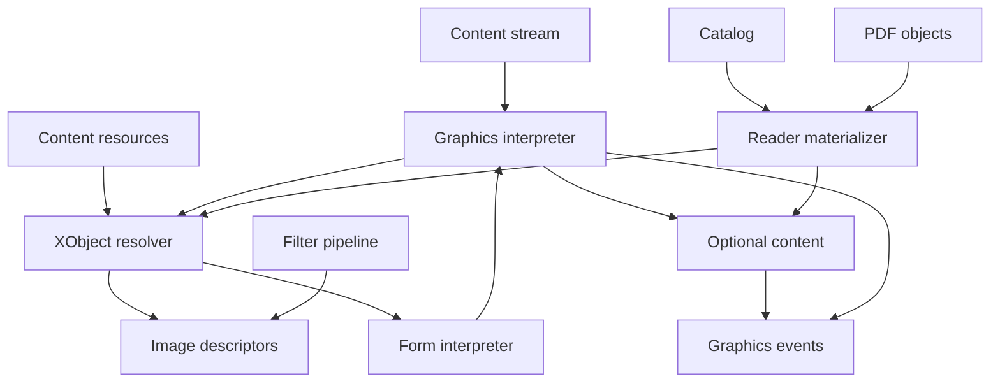
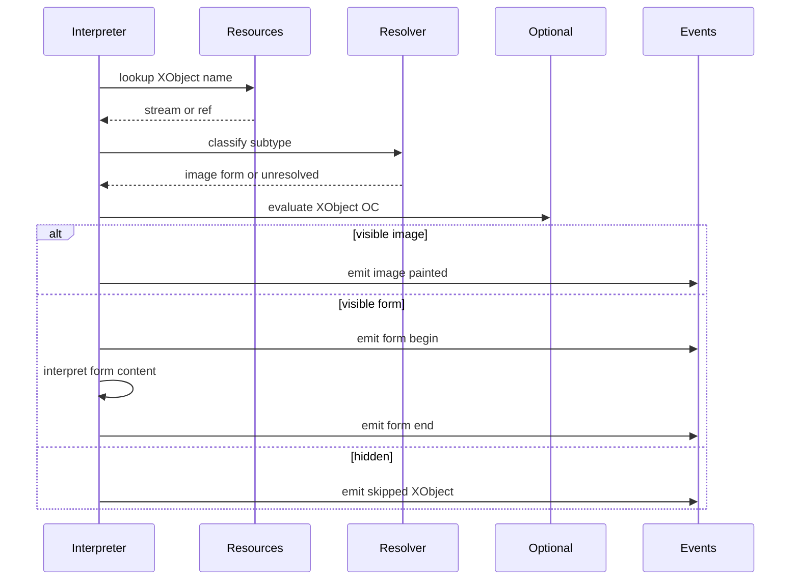
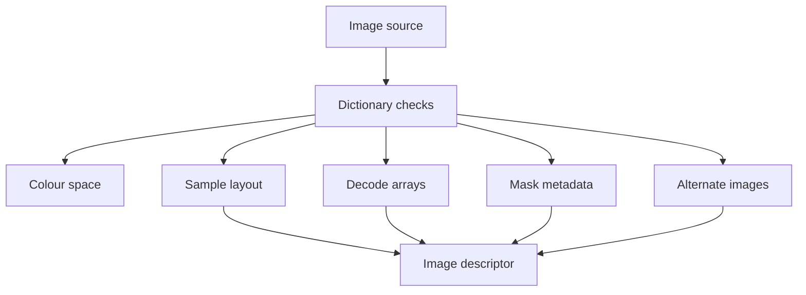
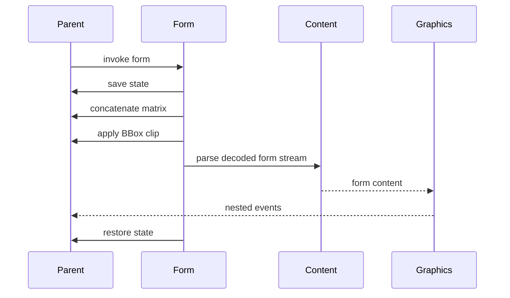
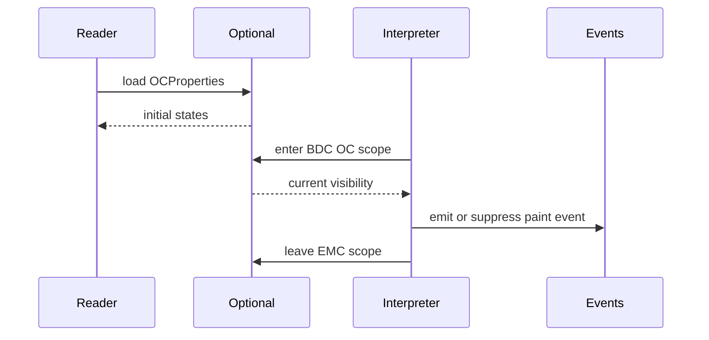

# Design Document

## Overview
This feature delivers structural semantics for ISO 32000-2 clause 8.8 through 8.11: external objects, image dictionaries, inline image validation, form XObjects, group and reference XObject metadata, and optional content visibility. It extends the current graphics interpreter from raw `Do` classification to typed XObject events while preserving the parser-first, device-independent architecture.

Library users and later renderer phases use this layer to inspect which images and forms are invoked, how they are placed, which optional-content state controls them, and whether their dictionaries are structurally valid. The design intentionally stops before raster image decoding, transparency compositing, font rendering, annotation handling, external PDF import, or UI layer management.

### Goals
- Resolve and validate XObject resources used by `Do` when direct or reader-materialized objects are available.
- Represent image XObjects and inline images as typed descriptors with sample layout, decode arrays, masks, alternates, interpolation hints, and optional-content metadata.
- Represent form XObjects, group dictionaries, reference dictionaries, form-space matrix and BBox semantics, and device-independent nested form interpretation.
- Parse Catalog optional-content structures and evaluate deterministic visibility for marked-content spans and XObject `OC` entries.
- Preserve existing package boundaries: `content` owns syntax, `graphics` owns semantic interpretation of loaded resources, and `reader` owns object loading and Catalog integration.

### Non-Goals
- Pixel rendering, rasterization, interpolation output, colour conversion, image resampling, mask compositing, soft-mask compositing, transparency groups, blend modes, or final page appearance.
- Adding external image codecs or external PDF import for reference XObjects.
- Font execution, text extraction, annotation visibility, annotation appearance processing, logical structure integration, actions, ECMAScript, or interactive UI state mutation.
- Changing the object parser, content operator tokenizer, stream filter ownership, page tree traversal, or resource dictionary syntax model.
- Treating unsupported filters such as DCTDecode, JPXDecode, JBIG2Decode, CCITTFaxDecode, or Crypt as decoded sample bytes.

## Boundary Commitments

### This Spec Owns
- Typed XObject resource models for image, form, group, and reference XObject structures.
- `Do` resource resolution and event emission for direct or reader-materialized XObject streams.
- Image dictionary validation for required entries, type/subtype constraints, dimensions, colour space, bit depth, decode arrays, interpolation flag, masks, alternates, soft-mask metadata, and PDF 2.0 associated metadata entries.
- Inline image semantic validation over existing `@content.PdfInlineImage` values, including PDF 2.0 `Length`, abbreviation expansion expectations, colour-space restrictions, and forbidden inline filters.
- Form XObject dictionary validation for `Subtype`, `FormType`, `BBox`, `Matrix`, `Resources`, `Group`, `Ref`, structural parent constraints, and optional metadata.
- Device-independent form invocation semantics: save graphics state, concatenate form matrix, apply BBox clipping, interpret form content with scoped resources when loaded, and restore graphics state.
- Optional content models for OCG, OCMD, visibility expressions, configuration dictionaries, usage dictionaries, and visibility evaluation for marked-content spans and XObject `OC` entries.

### Out of Boundary
- `src/content` remains authoritative for parsing operands, operators, inline image byte capture, compatibility sections, and resource dictionary syntax.
- `src/reader` remains authoritative for Catalog access, indirect object loading, page tree traversal, stream decoding entry points, and document error wrapping.
- `src/graphics` does not import `src/reader` or load indirect objects by itself.
- Image sample rendering, device colour management, ICC execution, JPEG/JPEG2000/JBIG2/CCITT decoding, alpha compositing, and transparency group rendering are deferred.
- Reference XObject target PDF loading is deferred. The proxy form is preserved and interpreted as ordinary form content when available.
- Annotation optional content, interactive UI layer controls, `Set-OCG-state` actions, and manual viewer override persistence are deferred.

### Allowed Dependencies
- MoonBit standard library only.
- `src/graphics` may use `objects`, `content`, `filters`, and existing graphics colour, path, matrix, and state modules.
- `src/reader` may use `graphics` to materialize XObject resources and optional-content state for page-level APIs.
- Existing colour-space APIs remain the source of truth for image component counts and component ranges.
- Existing filter APIs may be used only for supported stream filters; unsupported filter names remain explicit metadata.
- Local extracted spec text under `spec/extracted/8.8-8.11-xobjects-images-optional.spec.txt`.

### Revalidation Triggers
- Any public shape change to `ContentInstruction`, `ContentOperation`, `PdfInlineImage`, `ContentResources`, `ResourceCategory`, or `StandardContentOperator`.
- Any public shape change to `GraphicsEvent`, `GraphicsProgram`, `GraphicsState`, `GraphicsInitialState`, `ColourSpace`, `ColourRange`, or `ColourDefaults`.
- Any change to `PdfCatalog`, `PdfPage::content_stream`, `PdfPage::content_resources`, `PdfFile::load_object`, or document error wrapping.
- Adding object loading to `graphics`, changing the package dependency direction, or adding third-party codec/rendering dependencies.
- Adding pixel rendering, transparency compositing, external PDF import, annotation processing, or interactive optional-content state mutation.
- Changing inline image terminator scanning or abbreviation expansion in `content`.

## Architecture

### Existing Architecture Analysis
The repository already has layered parsing: `objects` and `parser` model PDF objects, `filters` decodes supported streams, `content` parses decoded content instructions, `graphics` interprets device-independent graphics state and path semantics, and `reader` bridges documents and pages. `content` already recognizes `Do`, `BI`, `ID`, `EI`, `BDC`, `DP`, and `EMC`, and exposes `XObject`, `Properties`, and `ColorSpace` resources.

The missing part is semantic interpretation of XObject resources and optional-content visibility. The current `graphics` interpreter emits `ExternalObjectInvoked` for `Do`, `InlineImageSeen` for inline images, and `MarkedContentSeen` for marked-content operators without validating the referenced structures. This feature adds validation and event contracts at that semantic layer while `reader` supplies indirect objects and Catalog optional-content data.

### Architecture Pattern & Boundary Map



**Architecture Integration**:
- Selected pattern: structural resource interpretation with reader-owned materialization. `graphics` validates loaded objects and emits semantic events; `reader` loads indirect resources and Catalog state.
- Domain boundaries: `content` owns syntax, `graphics` owns loaded-resource semantics, and `reader` owns document graph access.
- Existing patterns preserved: package-local MoonBit files, `pub(all)` inspectable models, typed `suberror` diagnostics, resource lookup through `ContentResources`, standard-library-only implementation, and `moon info` API review.
- New components rationale: XObject dispatch, image metadata, form execution, optional content state, and reader materialization each have separate invariants and test surfaces.
- Steering compliance: the design stays byte-oriented, lazy where possible, independently testable, and non-rendering.

### Technology Stack

| Layer | Choice / Version | Role in Feature | Notes |
|-------|------------------|-----------------|-------|
| Language | MoonBit project toolchain | Typed XObject, image, form, and optional-content models | Use `///|`, `pub(all)` structs/enums, and `suberror`. |
| Content model | `trkbt10/pdf/src/content` | Parsed `Do`, inline image, marked-content instructions, and resources | No syntax parser ownership change. |
| Object model | `trkbt10/pdf/src/objects` | Dictionaries, streams, names, refs, arrays, strings, and raw stream data | No object-model change planned. |
| Filter pipeline | `trkbt10/pdf/src/filters` | Decode supported image/form streams for structural validation and form content parsing | Unsupported image filters remain metadata. |
| Graphics runtime | `trkbt10/pdf/src/graphics` | Semantic validation and event emission | Primary feature package. |
| Reader integration | `trkbt10/pdf/src/reader` | Catalog optional-content state, indirect resource loading, page-level materialized interpretation | Reader imports graphics, not the reverse. |

## File Structure Plan

### Directory Structure

```text
src/
├── graphics/
│   ├── xobject.mbt                    # XObjectResource, subtype dispatch, Do operand handling, unresolved refs
│   ├── image.mbt                      # ImageDescriptor, ImageSource, sample layout, dictionary validation
│   ├── image_mask.mbt                 # ImageMask, explicit mask, colour-key mask, soft-mask metadata validation
│   ├── image_decode.mbt               # Decode arrays, default decode ranges, row bit layout, optional length checks
│   ├── form_xobject.mbt               # FormXObject, BBox, Matrix, Resources, Group, Ref validation
│   ├── optional_content.mbt           # OCG, OCMD, visibility expressions, configuration, visibility evaluator
│   ├── interpreter.mbt                # Replace raw Do and inline image events with validated image/form/visibility events
│   ├── object_context.mbt             # Allow XObject/image operators only in valid graphics object contexts
│   ├── error.mbt                      # Add XObject and optional-content failure cases or reuse ResourceFailure
│   ├── xobject_wbtest.mbt             # Do resource resolution, subtype dispatch, missing and malformed XObjects
│   ├── image_wbtest.mbt               # Image dictionaries, decode arrays, bit depth, colour space, alternates
│   ├── image_mask_wbtest.mbt          # ImageMask, Mask, SMask, colour-key mask invariants
│   ├── form_xobject_wbtest.mbt        # Form dictionary, matrix, BBox clipping, scoped resources
│   ├── optional_content_wbtest.mbt    # OCG, OCMD, VE, config, usage, marked-content visibility
│   └── interpreter_test.mbt           # Public graphics events for Do, forms, inline images, optional content
└── reader/
    ├── xobjects.mbt                   # Page-level XObject materialization, recursive form guard, loaded resource map
    ├── optional_content.mbt           # Catalog OCProperties loading and default/use-context state construction
    ├── graphics.mbt                   # Add materialized graphics program entry points or options
    ├── document_error.mbt             # Wrap new graphics or optional-content errors if needed
    ├── xobjects_wbtest.mbt            # Indirect image/form resources, recursive forms, reference proxy behavior
    ├── optional_content_wbtest.mbt    # Catalog OCProperties, OCG arrays, default config, usage application
    └── pkg.generated.mbti             # Regenerated by moon info when public reader APIs change
```

### Modified Files
- `src/graphics/moon.pkg` - Keep existing local imports and add no external dependency.
- `src/graphics/interpreter.mbt` - Resolve `Do`, validate inline images, manage optional-content visibility stack, and emit typed XObject/image/form events.
- `src/graphics/object_context.mbt` - Ensure `Do` and inline images are accepted only where graphics objects are valid and path/text restrictions remain correct.
- `src/graphics/error.mbt` - Add `InvalidXObject`, `InvalidImage`, or `InvalidOptionalContent` only if existing `ResourceFailure` and `InvalidGraphicsState` are not precise enough.
- `src/graphics/pkg.generated.mbti` - Regenerated after public event/model changes.
- `src/reader/graphics.mbt` - Add page-level options for materialized XObject and optional-content evaluation.
- `src/reader/catalog.mbt` - Add a focused `PdfCatalog::optional_content_properties_entry` accessor if direct entry access is too vague for tests.
- `src/reader/pkg.generated.mbti` - Regenerated if reader public APIs are added.
- `src/content/inline_image.mbt` - Only extend abbreviation expansion if missing PDF 2.0 inline-image abbreviations are found during implementation; syntax ownership remains unchanged.
- `src/content/pkg.generated.mbti` - Regenerated only if inline-image public behavior changes.

### Existing Files Consumed Without Modification
- `src/content/operator.mbt` - Existing `Do`, `BI`, `ID`, `EI`, `BDC`, `DP`, and `EMC` operator recognition.
- `src/content/resources.mbt` - Existing `XObject`, `Properties`, `ColorSpace`, and form resource-scope lookup.
- `src/content/parser.mbt` - Existing operand preservation for `Do` and marked-content operators.
- `src/graphics/colour_space.mbt` - Existing component counts and ranges for image colour-space validation.
- `src/graphics/path.mbt` and `src/graphics/state.mbt` - Existing CTM, graphics state stack, and clipping contracts used by form invocation.
- `src/reader/page_content.mbt` - Existing page content and resource bridge.

### Component to File Mapping

| Component | Primary Files |
|-----------|---------------|
| XObjectResourceResolver | `src/graphics/xobject.mbt`, `src/graphics/interpreter.mbt`, `src/reader/xobjects.mbt` |
| ImageDescriptorModel | `src/graphics/image.mbt`, `src/graphics/image_decode.mbt`, `src/graphics/image_mask.mbt` |
| InlineImageSemanticValidator | `src/graphics/image.mbt`, `src/content/inline_image.mbt` |
| FormXObjectInterpreter | `src/graphics/form_xobject.mbt`, `src/graphics/interpreter.mbt`, `src/reader/xobjects.mbt` |
| OptionalContentEvaluator | `src/graphics/optional_content.mbt`, `src/graphics/interpreter.mbt`, `src/reader/optional_content.mbt` |
| ReaderXObjectMaterializer | `src/reader/xobjects.mbt`, `src/reader/graphics.mbt` |

## System Flows

### XObject Invocation



The pure graphics path validates direct streams. The reader materializer supplies loaded streams for indirect resources and prevents recursive form cycles.

### Image Descriptor Validation



Validation is structural. Supported filters may be decoded for row-length checks, but unsupported image codecs remain represented by filter metadata.

### Form XObject Interpretation



The form stream inherits the invocation graphics state except for the form matrix and BBox clipping. Resource scope uses the form dictionary's `Resources` when present, otherwise the parent content resources.

### Optional Content Evaluation



Hidden marked-content scopes still execute graphics-state side effects. Hidden image or form XObjects are skipped as whole encapsulated objects.

## Requirements Traceability

| Requirement | Summary | Components | Interfaces | Flows |
|-------------|---------|------------|------------|-------|
| 0.1 | `Do` paints named image or form XObjects from resources | XObjectResourceResolver, GraphicsInterpreter | `resolve_xobject_resource`, `GraphicsEvent::XObjectPainted` | XObject Invocation |
| 0.2 | Images are sampled visual arrays or inline images | ImageDescriptorModel, InlineImageSemanticValidator | `ImageDescriptor`, `InlineImageDescriptor` | Image Descriptor Validation |
| 0.3 | Image format, samples, placement, and component mapping are explicit or implicit | ImageDescriptorModel, ImageDecodeModel | `ImageSampleLayout`, `ImagePlacement` | Image Descriptor Validation |
| 0.4 | Sample representation uses width, height, components, bit depth, and image-mask colour rules | ImageDescriptorModel, ImageDecodeModel, ImageMaskModel | `validate_image_dictionary` | Image Descriptor Validation |
| 0.5 | Image space maps to the user-space unit square and CTM controls placement | ImageDescriptorModel, GraphicsInterpreter | `ImagePlacement`, graphics state snapshot | XObject Invocation |
| 0.6 | Image dictionaries validate required and optional entries | ImageDescriptorModel, ImageMaskModel, OptionalContentEvaluator | `ImageDescriptor` | Image Descriptor Validation |
| 0.7 | Decode arrays map samples to colour components with defaults | ImageDecodeModel | `ImageDecodeArray`, `default_image_decode` | Image Descriptor Validation |
| 0.8 | Interpolate is a hint preserved on image descriptors | ImageDescriptorModel | `interpolate` field | Image Descriptor Validation |
| 0.9 | Alternate images and print or OC selection metadata are represented | ImageDescriptorModel, OptionalContentEvaluator | `AlternateImage`, visibility input | Image Descriptor Validation |
| 0.10 | Masked image mechanisms are modeled structurally | ImageMaskModel | `ImageMask`, `ExplicitMask`, `ColourKeyMask`, `SoftMask` | Image Descriptor Validation |
| 0.11 | Stencil image masks forbid ColorSpace and require one-bit semantics | ImageMaskModel | `ImageMask::Stencil` | Image Descriptor Validation |
| 0.12 | Explicit masks are image mask XObjects over the same unit square | ImageMaskModel, XObjectResourceResolver | `ExplicitImageMask` | Image Descriptor Validation |
| 0.13 | Colour-key masks validate component ranges before Decode | ImageMaskModel, ImageDecodeModel | `ColourKeyMask` | Image Descriptor Validation |
| 0.14 | Inline images validate BI ID EI semantics, abbreviations, Length, colour, and filters | InlineImageSemanticValidator, ImageDescriptorModel | `validate_inline_image` | Image Descriptor Validation |
| 0.15 | Form XObjects are reusable content streams invoked by `Do` with save matrix clip paint restore | FormXObjectInterpreter, GraphicsInterpreter | `FormXObject`, nested graphics events | Form XObject Interpretation |
| 0.16 | Form dictionaries validate Type 1 entries, resources, group, ref, OC, and metadata constraints | FormXObjectInterpreter, OptionalContentEvaluator | `validate_form_xobject` | Form XObject Interpretation |
| 0.17 | Group XObjects preserve group subtype metadata | FormXObjectInterpreter | `GroupAttributes` | Form XObject Interpretation |
| 0.18 | Reference XObject section is modeled as form `Ref` specialization | FormXObjectInterpreter | `ReferenceXObject` | Form XObject Interpretation |
| 0.19 | Reference dictionaries identify target files and proxy behavior | FormXObjectInterpreter, ReaderXObjectMaterializer | `ReferenceDictionary` | Form XObject Interpretation |
| 0.20 | Printing may use imported content or proxy | FormXObjectInterpreter | print intent on reference event | XObject Invocation |
| 0.21 | Reference XObject annotation and structure caveats remain deferred metadata | FormXObjectInterpreter | `ReferenceXObject` notes | Form XObject Interpretation |
| 0.22 | Optional content structures control visibility | OptionalContentEvaluator | `OptionalContentState` | Optional Content Evaluation |
| 0.23 | Optional content groups are primary visibility structures | OptionalContentEvaluator | `OptionalContentGroup` | Optional Content Evaluation |
| 0.24 | OCG dictionaries validate Type, Name, Intent, Usage and state membership | OptionalContentEvaluator | `parse_optional_content_group` | Optional Content Evaluation |
| 0.25 | OCMD dictionaries validate OCGs, P policies, and VE expressions | OptionalContentEvaluator | `OptionalContentMembership` | Optional Content Evaluation |
| 0.26 | Intent filters determine which groups affect visibility | OptionalContentEvaluator | `OptionalIntentSet` | Optional Content Evaluation |
| 0.27 | Graphical content may be optional | OptionalContentEvaluator, GraphicsInterpreter | visibility stack | Optional Content Evaluation |
| 0.28 | Hidden marked-content still applies state while hidden XObjects are skipped | OptionalContentEvaluator, GraphicsInterpreter | `OptionalVisibilityStack` | Optional Content Evaluation |
| 0.29 | BDC and DP OC marked-content property lists resolve through Properties resources | OptionalContentEvaluator, XObjectResourceResolver | `resolve_optional_property` | Optional Content Evaluation |
| 0.30 | XObject `OC` entries gate whole image or form invocation | OptionalContentEvaluator, XObjectResourceResolver | `xobject_visibility` | XObject Invocation |
| 0.31 | Optional content configuration structures are modeled | OptionalContentEvaluator, ReaderXObjectMaterializer | `OptionalContentProperties` | Optional Content Evaluation |
| 0.32 | Configuration dictionaries initialize and adjust group states | OptionalContentEvaluator | `OptionalContentConfiguration` | Optional Content Evaluation |
| 0.33 | Catalog `OCProperties` lists OCGs and configurations | ReaderXObjectMaterializer, OptionalContentEvaluator | `PdfCatalog::optional_content_properties` | Optional Content Evaluation |
| 0.34 | Configuration dictionaries validate BaseState, ON, OFF, Intent, AS, Order, ListMode, RBGroups, Locked | OptionalContentEvaluator | `parse_optional_content_config` | Optional Content Evaluation |
| 0.35 | Usage and usage application dictionaries adjust states by view, print, export, zoom, user, language | OptionalContentEvaluator | `OptionalContentUseContext` | Optional Content Evaluation |
| 0.36 | OCG state determination applies default, usage, manual, print, and export rules where supported | OptionalContentEvaluator | `build_optional_content_state` | Optional Content Evaluation |

## Components and Interfaces

| Component | Domain | Intent | Req Coverage | Key Dependencies | Contracts |
|-----------|--------|--------|--------------|------------------|-----------|
| XObjectResourceResolver | Graphics resources | Resolve `Do` names and dispatch Image, Form, Group, Reference, or unresolved XObjects | 0.1, 0.15, 0.16, 0.17, 0.18, 0.19, 0.20, 0.21, 0.30 | `content` P0, `objects` P0 | Service |
| ImageDescriptorModel | Graphics images | Validate image XObject and inline image metadata without rendering | 0.2, 0.3, 0.4, 0.5, 0.6, 0.7, 0.8, 0.9, 0.10, 0.11, 0.12, 0.13, 0.14 | ColourSpace P0, `filters` P1 | Service, State |
| ImageMaskModel | Graphics images | Validate stencil, explicit, colour-key, and soft-mask relationships | 0.6, 0.10, 0.11, 0.12, 0.13 | ImageDescriptorModel P0 | Service, State |
| FormXObjectInterpreter | Graphics forms | Validate and interpret form streams as nested device-independent graphics | 0.15, 0.16, 0.17, 0.18, 0.19, 0.20, 0.21 | GraphicsState P0, `content` P0 | Service, State |
| OptionalContentEvaluator | Visibility | Build optional-content state and answer visibility queries | 0.22, 0.23, 0.24, 0.25, 0.26, 0.27, 0.28, 0.29, 0.30, 0.31, 0.32, 0.33, 0.34, 0.35, 0.36 | `objects` P0, `content` P1 | Service, State |
| ReaderXObjectMaterializer | Reader integration | Load indirect XObjects and optional-content structures for page graphics | 0.1, 0.15, 0.16, 0.17, 0.18, 0.19, 0.20, 0.21, 0.22, 0.23, 0.24, 0.25, 0.26, 0.27, 0.28, 0.29, 0.30, 0.31, 0.32, 0.33, 0.34, 0.35, 0.36 | `reader` P0, `graphics` P0 | API, Service |
| GraphicsInterpreterIntegration | Graphics runtime | Apply XObject and optional-content semantics during interpretation | 0.1, 0.2, 0.3, 0.4, 0.5, 0.6, 0.7, 0.8, 0.9, 0.10, 0.11, 0.12, 0.13, 0.14, 0.15, 0.16, 0.17, 0.18, 0.19, 0.20, 0.21, 0.22, 0.23, 0.24, 0.25, 0.26, 0.27, 0.28, 0.29, 0.30, 0.31, 0.32, 0.33, 0.34, 0.35, 0.36 | All graphics models P0 | Service, State |

### Graphics Resource Layer

#### XObjectResourceResolver

| Field | Detail |
|-------|--------|
| Intent | Resolve a named `XObject` resource into a typed direct resource or explicit unresolved reference. |
| Requirements | 0.1, 0.15, 0.16, 0.18, 0.19, 0.30 |

**Responsibilities & Constraints**
- Validate that the `Do` operand is a name and exists in the `XObject` resource subdictionary.
- Require direct or materialized XObject values to be streams with optional `/Type /XObject` and a valid `/Subtype`.
- Dispatch `/Subtype /Image` to `ImageDescriptorModel` and `/Subtype /Form` to `FormXObjectInterpreter`.
- Represent indirect refs explicitly when no reader materialization is supplied.
- Preserve unknown subtypes as typed resource failures, not ignored events.

**Dependencies**
- Inbound: `GraphicsInterpreterIntegration` - handles `InvokeXObject` operations (P0).
- Outbound: `ContentResources` - resource lookup (P0).
- Outbound: `ImageDescriptorModel` and `FormXObjectInterpreter` - subtype parsing (P0).
- Outbound: `OptionalContentEvaluator` - XObject `OC` visibility (P0).

**Contracts**: Service [x] / API [ ] / Event [ ] / Batch [ ] / State [ ]

##### Service Interface
```moonbit
pub(all) enum XObjectResource {
  Image(ImageDescriptor)
  Form(FormXObject)
  Unresolved(@objects.ObjectId)
}

pub fn resolve_xobject_resource(
  resources : @content.ContentResources,
  name : @objects.PdfName,
  offset : Int64,
) -> XObjectResource raise PdfGraphicsError
```
- Preconditions: the operation operand has already been checked as a name.
- Postconditions: direct resources are structurally validated or a typed error is raised.
- Invariants: `graphics` does not load `PdfObject::Ref`.

#### ImageDescriptorModel

| Field | Detail |
|-------|--------|
| Intent | Model image XObjects and inline images as validated sample metadata plus raw or decoded-byte availability. |
| Requirements | 0.2, 0.3, 0.4, 0.5, 0.6, 0.7, 0.8, 0.9, 0.14 |

**Responsibilities & Constraints**
- Validate positive `Width` and `Height`.
- Validate `BitsPerComponent` as 1, 2, 4, 8, or 16 where required; image masks require 1 if present.
- Resolve image `ColorSpace` through existing colour-space APIs except where inline image rules restrict direct forms.
- Reject Pattern colour spaces for images.
- Validate `Decode` length against component count or mask rules and compute defaults from colour-space ranges.
- Preserve `Interpolate`, `Intent`, `Alternates`, `SMaskInData`, `AF`, `Measure`, and `PtData` as structural metadata.
- Preserve image-space unit-square placement with the graphics-state snapshot at invocation.

**Dependencies**
- Inbound: `XObjectResourceResolver`, `GraphicsInterpreterIntegration`, `InlineImageSemanticValidator` (P0).
- Outbound: `ColourSpace` parser and component ranges (P0).
- Outbound: `filters.decode_stream` for supported optional byte validation (P1).
- External: no third-party codecs (P0).

**Contracts**: Service [x] / API [ ] / Event [ ] / Batch [ ] / State [x]

##### Service Interface
```moonbit
pub fn parse_image_xobject(
  stream : @objects.PdfStream,
  resources : @content.ContentResources,
  offset : Int64,
) -> ImageDescriptor raise PdfGraphicsError

pub fn validate_inline_image(
  image : @content.PdfInlineImage,
  resources : @content.ContentResources,
  offset : Int64,
) -> ImageDescriptor raise PdfGraphicsError
```
- Preconditions: image XObject input is a stream; inline image input has already been parsed by `content`.
- Postconditions: descriptor contains normalized dictionary metadata and sample layout.
- Invariants: descriptor construction does not require unsupported codec decoding.

#### ImageMaskModel

| Field | Detail |
|-------|--------|
| Intent | Validate image mask relationships and expose them structurally. |
| Requirements | 0.6, 0.10, 0.11, 0.12, 0.13 |

**Responsibilities & Constraints**
- Enforce `ImageMask true` forbids `ColorSpace` and `Mask`.
- Validate image mask `Decode` as `[0 1]` or `[1 0]`.
- Validate explicit `Mask` stream as an image mask descriptor when direct or materialized.
- Validate colour-key `Mask` arrays as `2 * component_count` integers within the pre-decode sample domain.
- Validate `SMask` and `SMaskInData` mutual exclusions and preserve soft-mask metadata without compositing.

**Contracts**: Service [x] / API [ ] / Event [ ] / Batch [ ] / State [x]

### Form And Optional Content Layer

#### FormXObjectInterpreter

| Field | Detail |
|-------|--------|
| Intent | Validate form XObjects and model form invocation as nested graphics interpretation. |
| Requirements | 0.15, 0.16, 0.17, 0.18, 0.19, 0.20, 0.21 |

**Responsibilities & Constraints**
- Validate `/Subtype /Form`, `FormType` default 1, required `BBox`, optional `Matrix` default identity, and optional `Resources`.
- Validate `StructParent` and `StructParents` are not both present.
- Validate group attributes dictionary common entries and preserve transparency-specific details as raw metadata.
- Validate reference dictionary required `F` and `Page`, optional `ID`, and preserve proxy semantics.
- Interpret loaded form content by applying save, matrix concatenation, BBox clipping, scoped resources, nested interpretation, and restore.
- Enforce recursion guard supplied by reader materialization.

**Dependencies**
- Inbound: `XObjectResourceResolver` and `GraphicsInterpreterIntegration` (P0).
- Outbound: `ContentResources::for_form_xobject` and `parse_decoded_content` (P0).
- Outbound: `filters.decode_stream` for form content streams (P0).
- Outbound: `OptionalContentEvaluator` for form `OC` entries (P0).

**Contracts**: Service [x] / API [ ] / Event [x] / Batch [ ] / State [x]

##### Event Contract
- Published events: `FormXObjectBegan`, nested graphics events, `FormXObjectEnded`, or `XObjectSkipped`.
- Ordering: form begin event precedes nested events; form end event is emitted after state restoration.
- Recovery: malformed form dictionaries raise `PdfGraphicsError` and stop interpretation.

#### OptionalContentEvaluator

| Field | Detail |
|-------|--------|
| Intent | Evaluate optional-content visibility for marked-content scopes and XObject `OC` entries. |
| Requirements | 0.22, 0.23, 0.24, 0.25, 0.26, 0.27, 0.28, 0.29, 0.30, 0.31, 0.32, 0.33, 0.34, 0.35, 0.36 |

**Responsibilities & Constraints**
- Parse OCG dictionaries with `Type`, `Name`, `Intent`, and `Usage`.
- Parse OCMD dictionaries with `OCGs`, `P`, and `VE`; `VE` takes precedence when present.
- Parse `OCProperties`, default and alternate configurations, BaseState, ON/OFF arrays, Intent, AS, Order, ListMode, RBGroups, and Locked.
- Build initial state from default configuration and optional view, print, or export usage context.
- Evaluate visibility expressions with `And`, `Or`, and `Not`.
- Resolve marked-content `BDC` and `DP` property names through the `Properties` resource subdictionary.
- Maintain a visibility stack so hidden marked-content suppresses drawing events while state changes still execute.
- Gate image and form XObjects as whole encapsulated invocations when `OC` is hidden.

**Dependencies**
- Inbound: `GraphicsInterpreterIntegration`, `XObjectResourceResolver`, `ReaderXObjectMaterializer` (P0).
- Outbound: `ContentResources` `Properties` lookup (P0).
- Outbound: `objects` for OCG, OCMD, and config dictionaries (P0).

**Contracts**: Service [x] / API [ ] / Event [ ] / Batch [ ] / State [x]

##### State Management
- State model: `OptionalContentState` stores group states, active intents, use context, and resolved membership policies.
- Persistence: no mutation is persisted to the PDF document; state exists only for interpretation.
- Concurrency strategy: state objects are immutable or copied per interpretation path; manual viewer override state is out of scope.

### Reader Integration Layer

#### ReaderXObjectMaterializer

| Field | Detail |
|-------|--------|
| Intent | Load indirect XObjects and optional-content structures for page-level graphics interpretation. |
| Requirements | 0.1, 0.15, 0.16, 0.17, 0.18, 0.19, 0.20, 0.21, 0.22, 0.23, 0.24, 0.25, 0.26, 0.27, 0.28, 0.29, 0.30, 0.31, 0.32, 0.33, 0.34, 0.35, 0.36 |

**Responsibilities & Constraints**
- Load `OCProperties` from the Catalog and resolve OCG references listed in `OCGs`.
- Build page-level optional-content state from default configuration and caller options.
- Materialize XObject resource refs used by a page and nested form resources on demand.
- Track object IDs during form interpretation to detect recursion.
- Wrap graphics and content failures as `PdfDocumentError`.

**Dependencies**
- Inbound: `PdfPage::graphics_program` or a new materialized page graphics API (P0).
- Outbound: `PdfFile::load_object` and existing page resource access (P0).
- Outbound: `graphics` XObject and optional-content APIs (P0).

**Contracts**: Service [x] / API [x] / Event [ ] / Batch [ ] / State [ ]

##### API Contract
| Method | Input | Response | Errors |
|--------|-------|----------|--------|
| `PdfDocument::optional_content_state` | optional use context | `OptionalContentState` | invalid Catalog OC structures |
| `PdfPage::graphics_program_with_resources` | graphics options plus optional-content state | `GraphicsProgram` | content, graphics, resource, recursion errors |

## Data Models

### Domain Model
- `XObjectResource` is the aggregate root for resources invoked by `Do`.
- `ImageDescriptor` owns image dictionary metadata, sample layout, mask metadata, alternate metadata, and source identity.
- `FormXObject` owns form dictionary metadata, form resource scope, group/reference metadata, and form-space transform constraints.
- `OptionalContentState` owns OCG states, active intents, membership policies, and usage context.
- `GraphicsProgram` remains the ordered event aggregate for interpreted content.

### Logical Data Model

| Entity | Key Attributes | Relationships | Invariants |
|--------|----------------|---------------|------------|
| `ImageDescriptor` | source, width, height, colour_space, bits_per_component, decode, interpolate | optional masks, alternates, OC entry | width and height positive; Pattern colour space forbidden; mask rules consistent |
| `ImageMask` | kind, decode, mask source, colour-key ranges | attached to `ImageDescriptor` | stencil has no ColorSpace or Mask; colour-key range count matches components |
| `FormXObject` | bbox, matrix, resources, group, ref, oc | invoked by `Do`; may contain nested content | FormType is 1; BBox has four numbers; StructParent and StructParents are exclusive |
| `OptionalContentGroup` | object id, name, intents, usage | included in OCProperties OCGs | Type is OCG; state is external to PDF object |
| `OptionalContentMembership` | ocgs, policy, visibility expression | referenced by BDC or XObject OC | VE overrides OCGs and P when present |
| `OptionalContentState` | group states, active intents, use context | used by interpreter | missing OCProperties means optional content is ignored and treated as visible |

## Error Handling

- Missing `XObject` resource names raise `PdfGraphicsError::ResourceFailure` with the `Do` operator offset.
- Malformed image, form, group, reference, OCG, OCMD, and configuration dictionaries raise graphics errors at the closest available content or object offset.
- Unsupported image filters do not automatically fail descriptor creation; unsupported filter names are preserved unless a caller requests decoded sample validation.
- Recursive form XObjects raise a resource failure before interpreting the repeated form.
- Missing Catalog `OCProperties` makes optional-content structures inert and visible, matching the requirement that processors ignore optional content when properties are absent.

## Testing Strategy

- XObject resolution tests cover missing resources, non-stream resources, invalid `/Type`, invalid `/Subtype`, direct image resources, direct form resources, and unresolved indirect refs.
- Image descriptor tests cover required `Width` and `Height`, bit depths 1/2/4/8/16, JPX exceptions, Pattern colour-space rejection, Decode defaults for Device, Lab, ICCBased, Indexed, Separation, and DeviceN spaces, Interpolate preservation, and stream metadata preservation.
- Mask tests cover stencil image masks, invalid mask plus ColorSpace combinations, explicit mask streams, colour-key range counts and bounds, SMask precedence, and SMaskInData mutual exclusion.
- Inline image tests cover abbreviation expansion, `Length` validation, 4096-byte recommendation diagnostics if represented, forbidden JPX/Crypt/JBIG2 filters, Indexed inline colour-space limits, and existing `BI`/`ID`/`EI` error behavior.
- Form tests cover form dictionary defaults, BBox clipping event, matrix concatenation order, scoped Resources fallback, nested form content order, state restoration, group metadata, reference proxy metadata, and recursion rejection.
- Optional-content tests cover OCG parsing, OCMD policies, VE precedence, Intent filtering, BaseState/ON/OFF application, usage application for view/print/export/zoom/language/user, marked-content state side effects while hidden, `DP` property references, and XObject `OC` whole-object skipping.
- Reader integration tests cover Catalog `OCProperties`, indirect image and form XObjects, page graphics events with materialized resources, nested form resources, and document error wrapping.

## Implementation Notes

- Add new public models conservatively and run `moon info` to review `pkg.generated.mbti` changes.
- Prefer `pub(all)` for inspectable domain records where tests and downstream users need pattern matching.
- Keep form recursive interpretation bounded and deterministic; do not start background loading or external file access.
- Keep unsupported filter handling explicit so future codec work can extend the descriptor without changing dictionary validation contracts.
- If `GraphicsEvent` gains visibility-aware variants, update existing graphics tests to assert old paths remain visible by default.
